# Raw Slide Content

- Source file: FA_thuong.le/Documents v5.5 - Final Submission - thuong.le/FA_BMW_RSE27_Bluetooth_Settings_thuong.le_v5.5.pptx
- Total slides: 17

## Slide 1

New design for synchronizing “Bluetooth remote device information” in RSE Applications (BMW RSE27)

By Le Trung Thuong
Mentor: Mr. Sanghyup Lee
LGEDV

1

## Slide 2

Table of contents

1

6

Project Overview
Architectural Drivers
Problem Identification
Quality attributes
Architectural Design
Proposal 1: IPC Service Architecture (Dual Adapter)
Proposal 2: Shared Adapter Architecture
Design decisions
Verification
Appendix

6

2

## Slide 3

1. Overview

3

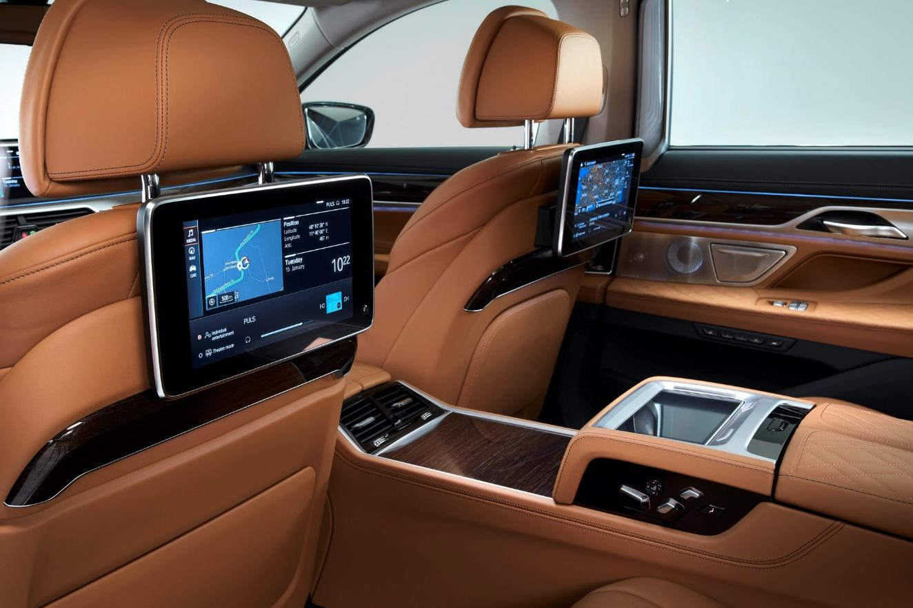
Image reference: slide_03_image_01.jpg

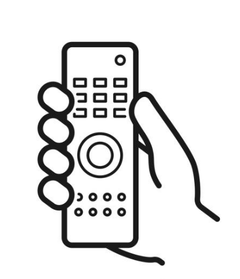
Image reference: slide_03_image_02.png

One remote device using Bluetooth

Bluetooth connection

Two Android screens

## Slide 4

1. Overview

4

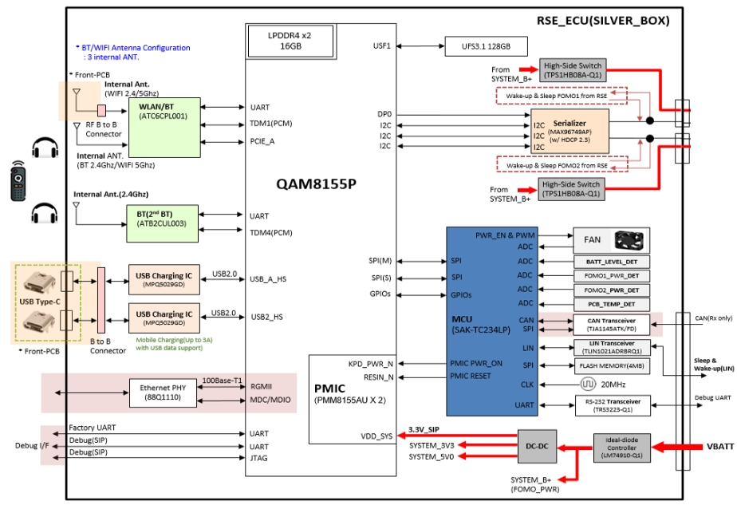
Image reference: slide_04_image_01.png

System overall block-diagram

Bluetooth chipset #1

Bluetooth chipset #2

Main CPU

## Slide 5

1. Overview

5

Context diagram of the overall software in the BMW RSE27

The BT Settings app runs as two separate processes

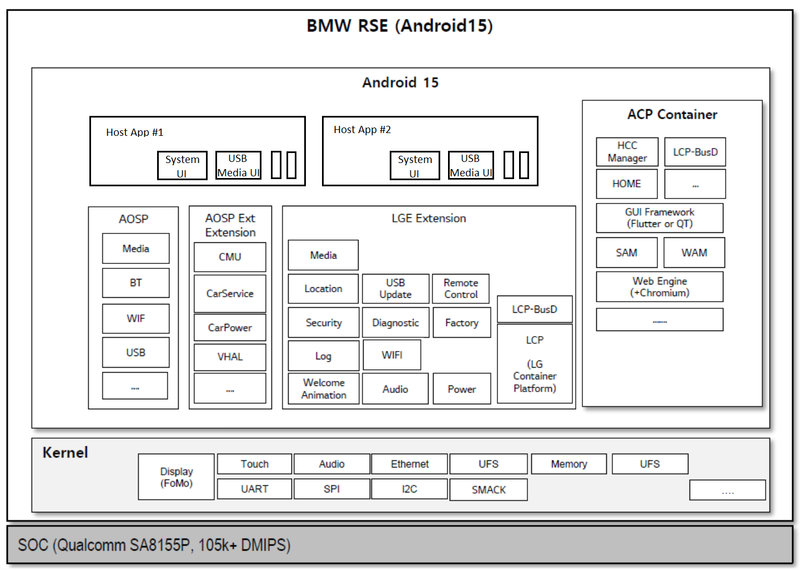
Image reference: slide_05_image_01.png

BT Settings

BT Settings

HMI Applications

Bluetooth Adapter #1

Bluetooth
Adapter #2

BT #1

BT #2

Bluetooth Settings

Bluetooth Framework (Outside our application)

Legend

BluetoothAdapter also runs on 2 processes
BT Settings app use API from BT Framework to communicate with BT chipsets

Image reference: slide_05_image_02.png

Android User #1

Image reference: slide_05_image_03.png

Android User #2

## Slide 6

2.1 Problem Identification

6

Constraints

How to synchronize Remote device information between two Android users ?

Requirements

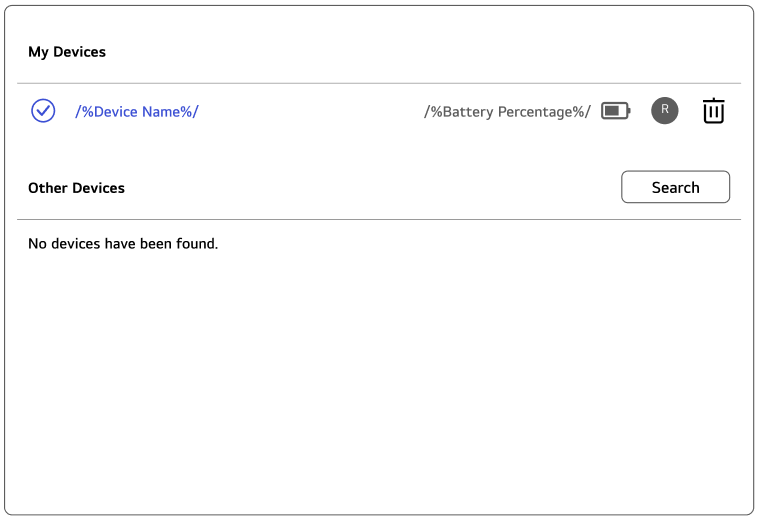
Image reference: slide_06_image_01.png

Image reference: slide_06_image_02.png

User 1

User 2

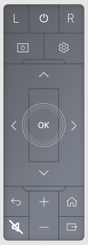
Image reference: slide_06_image_03.png

Bluetooth Settings

Bluetooth Settings

### Table
| Create Settings application to manage Bluetooth connection for Remote Device |
| The remote device information displayed on the two screens must be the same. |
| Actions (connect, remove, pair) from any display must be reflected on the other display |

## Slide 7

2.2 Quality Attributes

7

### Table
| Quality Attribute | Priority | QA Scenario |
| Reliability | High | The information about the remote controller (name, battery level) needs to be synchronized exactly between the 2 screens |
| Availability | High | Remote works even if one Bluetooth chipset fails |
| Performance | Medium | System response time for users needs to be kept as small as possible(Our target: button press response < 100ms) |
| Maintainability | Medium | The structure and logic inside application need to be simple to understand and modify |

Key Quality Attributes for design

## Slide 8

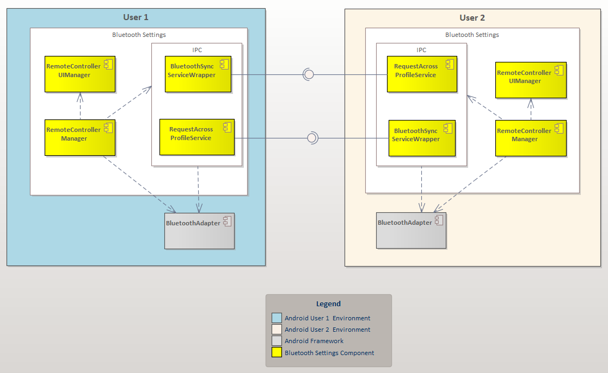
Image reference: slide_08_image_01.png

3.1 Proposal 1: IPC Service Architecture (Dual Adapter)

8

✅ Pros:
Maximum resource utilization: Uses both Bluetooth chipsets
Independent operation: Each Bluetooth works independently
Full control: Can customize synchronization logic as needed
❌ Cons:
Complex implementation: IPC synchronization with many edge cases
Performance overhead: 10-50ms IPC latency affects button response and sync timing

IPC channel

## Slide 9

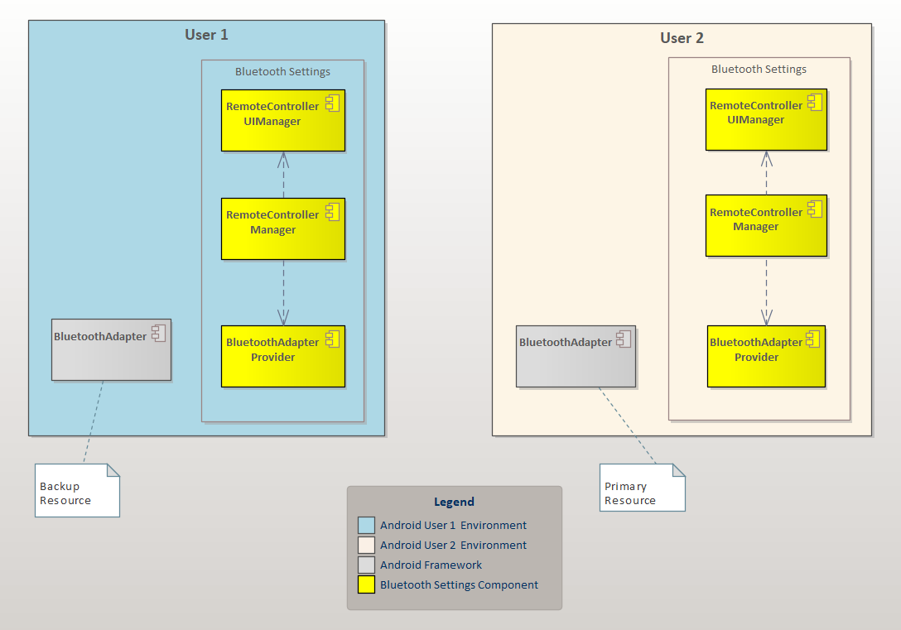
Image reference: slide_09_image_01.png

3.2 Proposal 2: Shared Adapter Architecture

9

✅ Pros:
Perfect synchronization: Single source of truth guarantees exact info sync between screens, no conflicts
High performance: Direct adapter access achieves <100ms button response
Universal visibility: Remote controller visible on both displays simultaneously, automatic sync
❌ Cons:
Framework dependency: Need to discuss with the framework team about feasibility and API availability.
Underused resources : Only uses 1 of 2 Bluetooth chipsets

FAIL

❌

Switch to use backup resource

## Slide 10

3.2 Proposal 2: Shared Adapter Architecture

10

In case of bad case if primary Bluetooth chip is broken, we will use failover mode

### Table
| Module | Description |
| Remote ControllerUIManager | Handles the logic for displaying UI elements to the user |
| Remote ControllerManager | Handles events received from Context/Framework and passes them to UIManager |
| BluetoothAdapter Provider | Handles BluetoothAdapter switching when needed and ensures the correct BluetoothAdapter is provided |
| BluetoothAdapter | The framework-provided module for interacting with the Bluetooth chipset |

Image reference: slide_10_image_01.png

## Slide 11

3.3 Design decisions

11

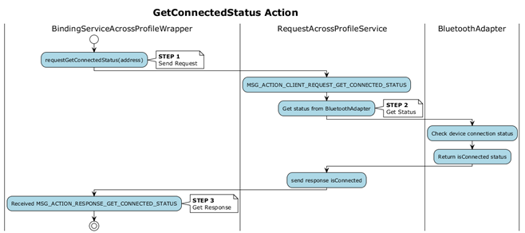
Image reference: slide_11_image_01.png

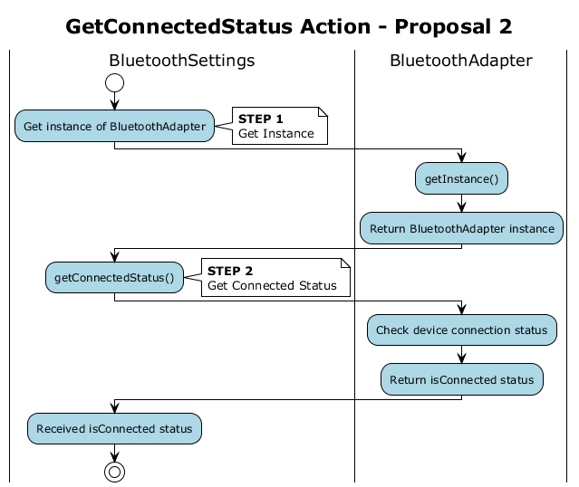
Image reference: slide_11_image_02.png

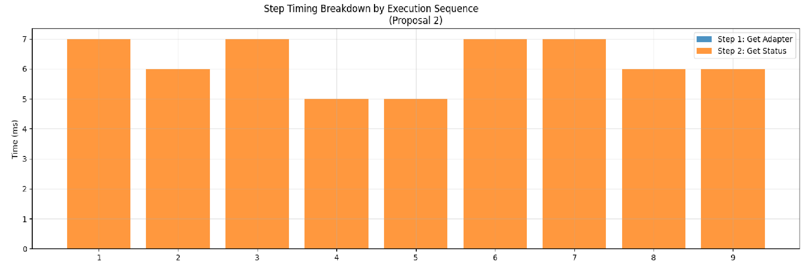
Image reference: slide_11_image_03.png

Average total time: 15.88ms

Average total time: 6.22ms

- Proposal 1

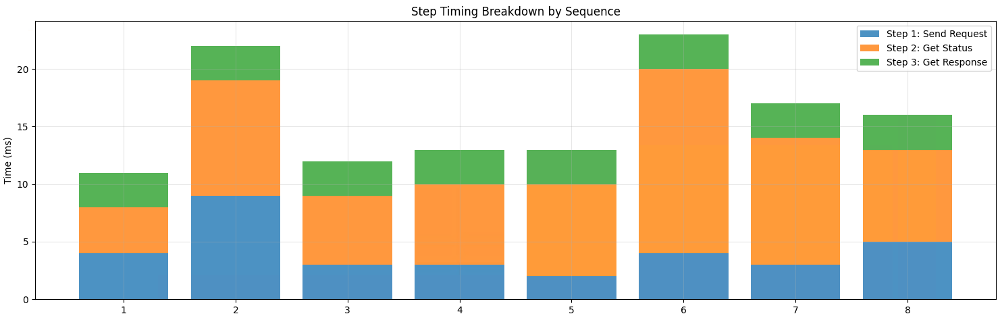
Image reference: slide_11_image_04.png

## Slide 12

3.3 Design decisions

12

### Table
| Quality Attribute | Priority | Proposal 1 (IPC Service) | Proposal 2 (Shared Adapter) |
| Reliability | High | Medium IPC sync conflicts possible | High Single source, guaranteed consistency |
| Availability | High | High Hardware redundancy, dual chipsets | High Switch to backup BluetoothAdapter if primary fail |
| Performance | Medium | Medium 10-50ms IPC latency | High Direct access, <100ms button response |
| Maintainability | Medium | Medium Complex IPC architecture | Medium Requires framework modifications and API provision |

Key Decision Factors:
•  Reliability vs Availability: Shared Adapter guarantees sync consistency, IPC Service offers hardware redundancy but with sync complexity risks.
Android Bluetooth Framework automatically handles mutual exclusion when multiple apps access the same Bluetooth chipset simultaneously.
• Balanced Trade-offs: Despite underutilizing system resources (only 1 of 2 adapters used) and requiring framework modifications, the better reliability, performance, and maintainability benefits justify this single-adapter approach for dual-display remote controller management.
✅ Selected Proposal: Proposal 2 (Shared Adapter)

## Slide 13

4. Verification

13

The video

## Slide 14

Q&A
Thank you for listening

14

## Slide 15

15

Advantages & Disadvantages Summary

### Table
| Key Factor | Proposal 1 (IPC Service) | Proposal 2 (Shared Adapter) |
| Implementation | ❌ Complex - IPC synchronization, edge cases, conflict handling | ✅ Normal - Need to discussion with Framework side to modification |
| Performance | ❌ Overhead - 10-50ms IPC latency affects button response | ✅ Direct - No latency, optimal for real-time interaction |
| Data Sync | ❌ Manual - Custom sync between adapters, potential conflicts | ✅ Automatic - Single source of truth, guaranteed consistency |
| Framework Dependency | ✅ Independent - No specific API dependency | ❌ Dependent - Need to request framework to provide api |
| Resource Usage | ✅ Full - Uses both Bluetooth chipsets | ❌ Half - Only 1 of 2 adapters used |

Appendix 1

## Slide 16

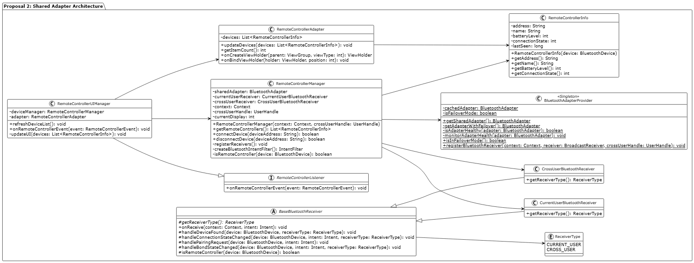
Image reference: slide_16_image_01.png

16

Class Diagram for Chosen Proposal (Proposal 2)

Handle UI rendering

Provider uses the Singleton pattern

Main function

Handle logic when an update event occurs

Appendix 2

## Slide 17

17

Appendix 3

Image reference: slide_17_image_01.png

Image reference: slide_17_image_02.png

Image reference: slide_17_image_03.png

Component in User 2

Component in User 1

Bluetooth Framework

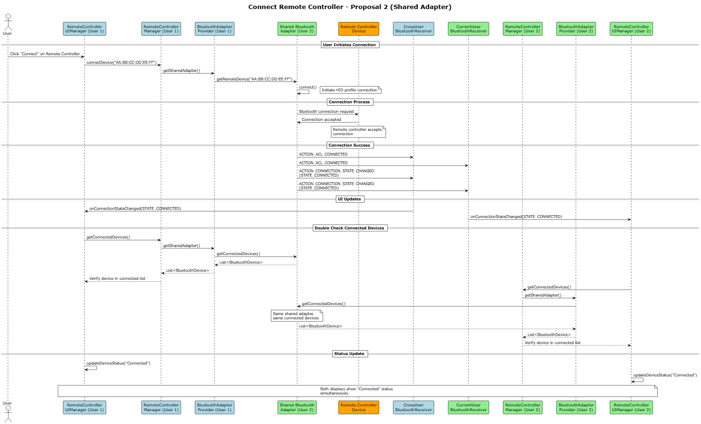
Image reference: slide_17_image_04.png

Legend

Sequence Diagram for Connect Remote Device

