# Raw Document Content

- Source file: FA_tien_nguyen/FA 인증과제_ECall Application Skeleton Architecture_Final.docx

FA 인증과제 (ECall Application Skeleton Architecture)

About This Document

Document Information

## Table
| Issuing authority | LGE |
| --- | --- |
| Status of document | In Progress |

Revision History

## Table
| Version | Date | Notes | Author | Approval |
| --- | --- | --- | --- | --- |
| 1.0 | 2023.08.06 | Initial Release. | Tien.Nguyen |  |
| 1.1 | 2023.08.16 | Make more detail about current problems, clarify the number of thread used in ECall module, fix syntax and typo issues. | Tien.Nguyen |  |
| 1.2 | 2023.08.25 | Add comparison of some designs and experimental results, fix syntax and typo issues. | Tien.Nguyen |  |
| Final | 2023.09.25 | Update comparison of some designs and experimental results, update detail designs for adding new feature CPD and DESS | Tien.Nguyen | Joon.Namkoong |
|  |  |  |  |  |
|  |  |  |  |  |
|  |  |  |  |  |
|  |  |  |  |  |
|  |  |  |  |  |
|  |  |  |  |  |
|  |  |  |  |  |

Purpose

This document specifies the software architectural design for ECall Application skeleton Architecture on telematics system based on tiger platform 3.0. This design document also serves as a guideline on how each software component in the system should be implemented and how the internal components/external processes should interact with each other.

Background

Emergency Call (ECall) Application is one of the most important modules in telematics projects, it is applied to most of telematics project as the requirement from OEM side. The main responsibilities of ECall are listening collision signal from sensor or emergency situation from driver then making the emergency voice call and sending vehicle data to ECall center so emergency operator can quickly support driver in emergency situation.

Because the popularity of ECall Application in telematics service, so it is the time for thinking about the new design which can provide the common structure of ECall application, it can be easy to use in variant telematics project and bring the benefits of well-designed module to many projects.
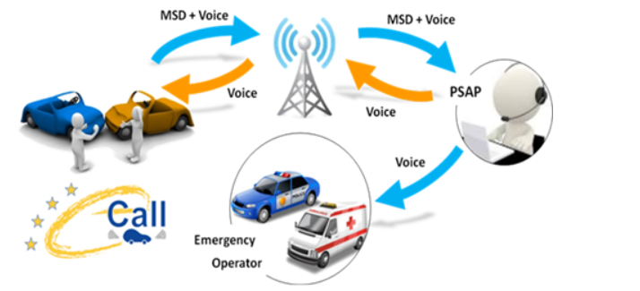
Image reference: doc_image_001.png

Scope

This document describes the following about the ECall Application skeleton.

SW Architectural representation

External interface design

Sequence diagram for use case

Audience

The readers of this article are as follows.

Software architect who will evaluate the design of the software.

Software engineers developing ECall application.

Related Documents

The project documentation associated with this document is:

Acronyms / Glossary

Table : Acronyms

## Table
| Acronyms | Description |
| --- | --- |
| ACN | Automatically Collision Notification |
| ECall | Emergency Call |
| OEM | Original equipment manufacturer |
| MSD | Minimum Set Data |
| RSN | Road Side Notification |
| SDD | Software Detail Design |
| SAD | Software Architecture Design |
| DCM | Data Communication Module |
|  |  |
|  |  |
|  |  |
|  |  |
|  |  |

Table : Glossary

## Table
| Glossary | Description |
| --- | --- |
| Service | A process working in background providing a solution |
| Tiger platform | A LGE framework used for developing telematics system |

Figures

Figure 1: Emergency call overview	2

Figure 2: ECall Application common functions	9

Figure 3:  Current design 1: Each region are totally independent.	12

Figure 4: Select wrong antenna issue	14

Figure 5: Using state machine patterns for handling specific specification of each ECall feature	16

Figure 6: Class diagram of state machine model in Honda ecallapp	17

Figure 7: Service wrapper block in ECall Application	20

Figure 8:New  Structure of ECall Application	22

Figure 9: Common logic handling sequence.	23

Figure 10: The dependency model of software sub components	25

Figure 11: Overall architecture of Honda telematics system based on tiger platform 3.0	26

Figure 12: The new structure of ECall application	27

Figure 13: Memory usage comparison	34

Figure 14: ECall application static diagram	37

Figure 15: State diagram of ECall Application skeleton	39

Figure 16: Boot up sequence diagram	41

Figure 17: register receiver to service sequence	42

Figure 18: Recovering the connection with service when it is died.	43

Figure 19: Priority matrix handling sequence	46

Figure 20: Service wrapper block of OEMCallApp	48

Figure 21: OEMCallApp static design	49

Figure 22: The overall architecture of Toyota 24DCM CY telemactics sytem.	50

Figure 23: Structure diagram of Toyota DCM 24CY ECall module	51

Figure 24: Class diagram of Toyota DCM 24CY ecalldcmreg module	52

Figure 25: Honda TSU 26 ECall module extending DESS, CPD features	54

Table

Table 1: Acronyms	3

Table 2: Glossary	4

Table 3: Basic requirement of feature list	10

Table 4: The list of commits dupplicated many times	15

Table 5: The comparison of the new designs and old design in aspects of non-functional requirement.	28

Table 6: Registering receivers to services in Honda ecallapp	30

Table 7: Registering receivers to services in Honda OEMCallapp	30

Table 8: Registering receivers to services in Toyota ECall module	32

Table 9: The comparison of the improved quality attributes of the new designs.	35

Table 10: Sub-block of ECall Application skeleton	36

Table 11: The class descriptions of ECall Application skeleton	37

Table 12: The description of ECall Application state transition	40

Overview

Overall Descriptions

ECall application is a big application with many sub features applied for many market region such as:

Manual ECall for NA

Automatic ECall for NA (ACN for NA )

Manual ECall for UAE, EU, SA, RU

Automatic ECall for UAE, EU, SA, RU

Manual ECall for CN, JP

Automatic ECall for CN, JP

Road side notification

ACN with Phone

Test call service

…

The main functions of ECall are as bellow:

Listen the request to trigger ECall feature from the user or from the collision detection sensors.

Notify the user to know the current emergency situation by LED, Voice prompt, Beep tone.

Sharing the vehicle information with ECall center via data communication.

Talking with the ECall operator via voice communication.

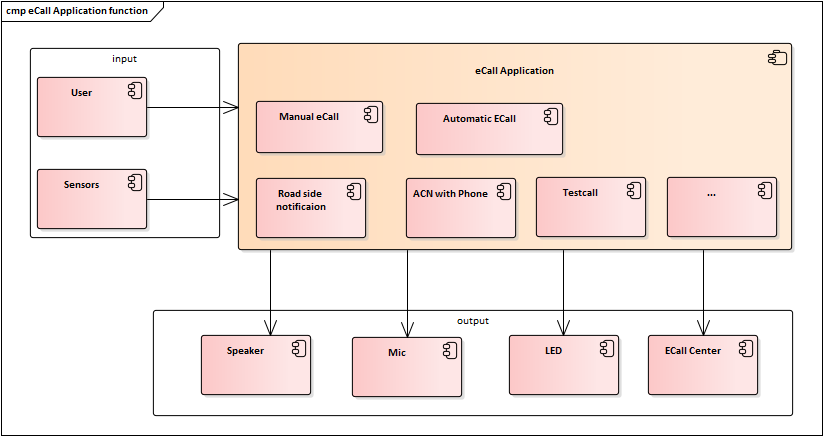
Image reference: doc_image_002.png

Functional Requirement

Each features has its own specification from OEM side, and the basic requirement can be showed in the bellow table.

Table : Basic requirement of feature list

## Table
| Feature name | Requirements |
| --- | --- |
| ACN | Listening collision signal from collision sensors. Notify the mergence to the user by LED, Beep tone, voice prompt. Collect vehicle data. Sending the data to ECall center. Establish the voice connection to ECall center. |
| E-Call | Listening emergency request from user Notify the mergence to the user by LED, Beep tone, voice prompt. Collect vehicle data. Sending the data to ECall center. Establish the voice connection to ECall center. |
| RSN | Listening roadside support request from user Notify the current situation to the user by LED, Beep tone, voice prompt. Collect vehicle data. Sending the data to ECall center. Establish the voice connection to ECall center. |
| ACN with phone (or AACN) | Listening collision signal from collision sensors. Notify the current situation to the user by LED, Beep tone, voice prompt. Collect vehicle data. Sending the data to ECall center. |
| Test call | Listening Test Call request from user Notify the current situation to the user by LED, Beep tone, voice prompt. Collect vehicle data. Sending the data to ECall center. Establish the voice connection to ECall center. |

Non-Function Requirement

The new ECall Application skeleton must follow non-functional requirements are described as bellow table:

## Table
| Scenario # | QA Scenario | Quality Attribute | Priority |
| --- | --- | --- | --- |
| 1 | The new design shall not require any the redundant procedure to any sequence flow of current features causing to down grade the performance of current system. | Performance | High |
| 2 | The new application applied this design should be available fast enough after the system start booting. | Performance | High |
| 3 | The new design is easy to adapt with variant telematics system based on tiger platform. | Reusable, Portability | Medium |
| 4 | The new design should help the developer easy to know that what is the sub-components should be modified for the new change (bug fix, specification updated, system updated, … ) . | Modifiability | Medium |
| 5 | Developer can easily add the new feature in the case that OEM request to the current system without reducing the other quality attribute of the system or reducing the other quality attribute small enough. | Extensibility | Medium |

Constraints

For ensuring the functional requirement of specific project and Non-functional requirement of specific project, this design should apply the some constraints: new developers shall not miss and detail sequence such as prevent missing ecall trigger, avoiding drain battery …, OEM requirement permits to group some features to handle in 1 process, ….

Problem identification

With the purpose of providing the common design for ECall Application, some current designs of ECall module and its disadvantages are demonstrated as below. (Note that: we will consider the below analysis in aspect of the ability to provide the common design for ECall Application):

Current design 1: all features of each regions are totally independent.

Image reference: doc_image_003.emf

With this design, each region has its own ECall source code, then the problem which developers encounter is that the source code for handling the communication between app and service is duplicated many times while many features has the same scenarios of using service APIs. The total size of source codes become too big.

The bellow example shows the trouble of this design:

There is one common bug occurred at the service-application communication part but needs the modification in many places:

Issue link: http://vlm.lge.com/issue/browse/ICONICC-19325?attachmentSortBy=dateTime&attachmentOrder=asc

The issues is that in some conditions, the system doesn’t change the active antenna from main antenna to backup antenna.

The root cause of issue is that: ECall Application get wrong value, and check the incorrect condition to switch antenna.

This issue of switching to wrong antenna can be modeled as below:

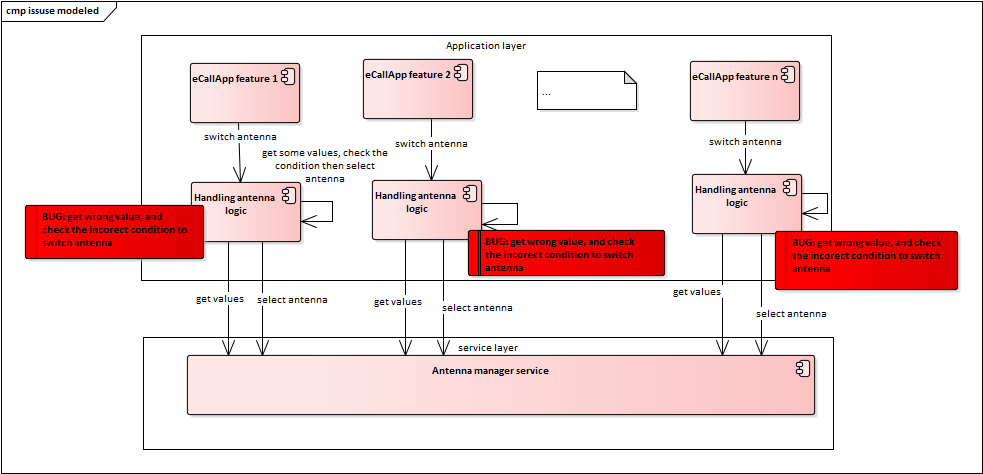
Image reference: doc_image_004.png

Because, each application has the different source code, so the logic of communication between ECall App and Antenna services is duplicated many times, then the bug fix also has to be duplicated many times.

Modifications:

+ http://vgit.lge.com/eu/c/bmw/linux/eraecallapp/+/1536980

+ http://vgit.lge.com/eu/c/bmw/linux/psapecallapp/+/1536960

+ http://vgit.lge.com/eu/c/bmw/linux/bmwecallapp/+/1536787

+ http://vgit.lge.com/eu/c/bmw/linux/euecallapp/+/1537308

And there are many modifications need to be duplicated many times as bellows:

Table : The list of commits dupplicated many times

## Table
| The link requests update the implementation | Commit links |
| --- | --- |
| http://vlm.lge.com/issue/browse/ICONICC-1220 | [ICONICC][ECALL] Update EU ecall app to get boot complete flag (I0090b5da) · Gerrit Code Review (lge.com) [ICONICC][ECALL] Update PSAP ecall app to get boot complete flag (I2db4bbb1) · Gerrit Code Review (lge.com) [ICONICC][ECALL] Update eraecallapp to get boot complete flag (Iab484cad) · Gerrit Code Review (lge.com) [ICONICC][ECALL] Update bmwecallapp to get boot complete flag (Ic545cde7) · Gerrit Code Review (lge.com) |
| http://vlm.lge.com/issue/browse/ICONICC-14585 | [ICON][PSAPECALL][FEATURE] Change interface of someip receivers (Ia0d786aa) · Gerrit Code Review (lge.com) [ICON][BMWECALL][feature] change interface of someip receivers (Ie1060f3e) · Gerrit Code Review (lge.com) [ICON][EUECALL][feature] change interface of someip receivers (I5343de91) · Gerrit Code Review (lge.com) |
| http://vlm.lge.com/issue/browse/ICONICC-12819 | [ICON][PSAPECALL][FEATURE] Add someip receivers (I2eae690a) · Gerrit Code Review (lge.com) [ICON][EUECALL][Implement] add someip receivers (I3648e1e7) · Gerrit Code Review (lge.com) [ICON][ERAECALL][Implement] add someip receivers (I72e09938) · Gerrit Code Review (lge.com) [ICON][BMWECALL][Implement] add someip receivers (I624bc2af) · Gerrit Code Review (lge.com) |
| http://vlm.lge.com/issue/browse/ICONICC-21628 | [ICON][PSAPECALL][Feature] Implement CAN signal for logging feature (I1d8d4a9d) · Gerrit Code Review (lge.com) [ICON][PSAPECALL][Feature] Implement CAN signal for logging feature (I1d8d4a9d) · Gerrit Code Review (lge.com) [ICON][EUECALL][Feature] implement CAN signal (Ied0754af) · Gerrit Code Review (lge.com) |
| http://vlm.lge.com/issue/browse/ICONICC-19325 | http://vgit.lge.com/eu/c/bmw/linux/eraecallapp/+/1536980 http://vgit.lge.com/eu/c/bmw/linux/psapecallapp/+/1536960 http://vgit.lge.com/eu/c/bmw/linux/bmwecallapp/+/1536787 http://vgit.lge.com/eu/c/bmw/linux/euecallapp/+/1537308 |

Current design 2: Using state machine patterns for handling specific specification of each ECall feature.

Each features has the different number of state and each state has the different responsibility. So not well applying state machine patterns lead source code to too complicated and too difficult to extent new feature.
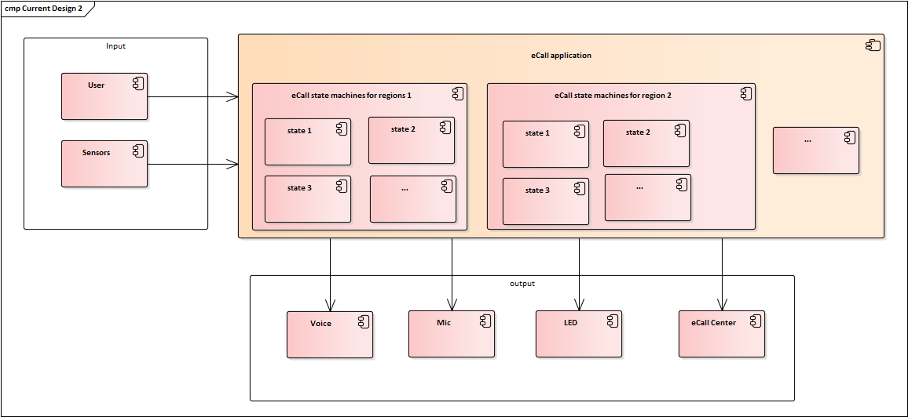
Image reference: doc_image_005.png

Currently, Honda ecallapp modules applied state machine pattern as below class diagram:

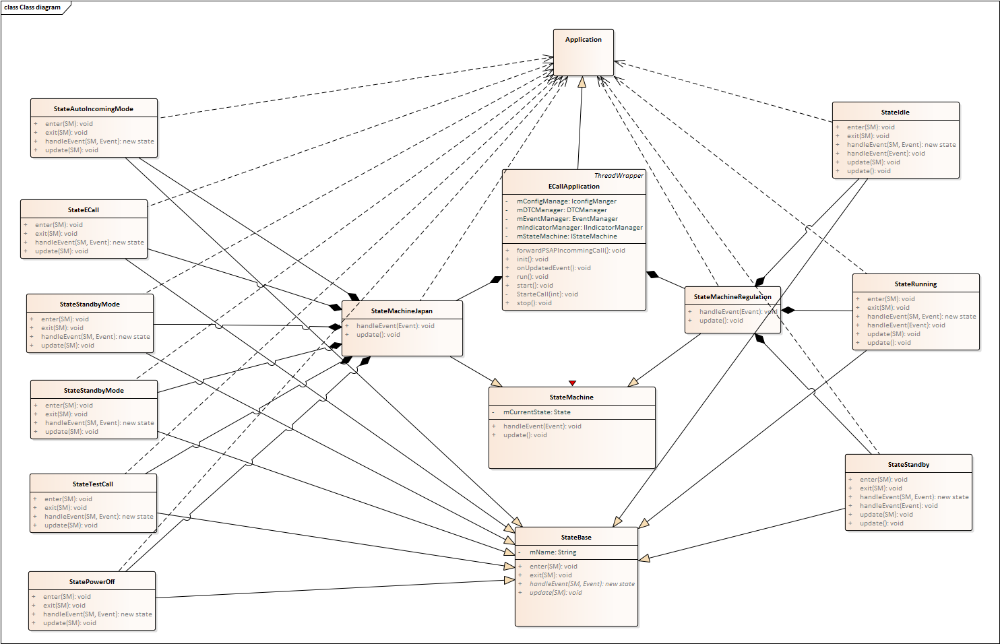
Image reference: doc_image_006.png

As the above class diagram, the relationship between software subcomponents becomes too complicated, each state class holds the App class object instance, but it doesn’t handle the business logic. All the business logic are handled by ECallApplication class, the logic of ECallApplication class becomes too complicated because that it has multiple responsibility. It is difficult to extend new feature since many state classes need to be added. In otherwise, the logic sequence becomes more complicated so it leads to the situation that developer needs more effort to resolve simple issue.

The below example shows the trouble of not well applying state machine design pattern:

Honda ecallapp not well applied state machine design pattern, and Honda oemcallapp don’t apply state machine design pattern. With the one issue http://vscb.lge.com:8080/cb/item/24318510.

Honda ecallapp need to modify many lines of code: http://vgit.lge.com/as/c/honda/con/linux/apps/ecallapp/+/1846878 . While Honda oemcallapp needs a simple modification: http://vgit.lge.com/as/c/honda/con/linux/apps/oemcallapp/+/1845948 .

Architecture Design Proposal

In this section, I propose two improvements for architecture designs and base on these two improvement, I propose new ECall application skeleton base on tiger platform 3.0 as bellow:

Section 2.1: Adding service adapter block

Section 2.2: Restructure ECall Application

Section 2.3: New ECall Application skeleton

Section 2.4: Proposal Comparison Summary

2.1 Adding service adapter block

For handling duplicated the communication between application layer and service layer problem, service wrapper block should be added to the structure of application source code.

Service wrapper block is responsible for handling common logic as below:

+ Register receiver and unregister receiver to service (only 1 receiver instance for each service is enough for many features of 1 application).

+ Recover the connection with service when service died.

+ The scenario of using service API.

+ Listening event from service layer and forward to features block

Advantage:

+ Easy to extend:  When ECall module needs to communicate with new service module, add the new service adapter to service wrapper block.

+ Reusable: Service wrapper block can be reused in different project with small changing of the scenario of using service API with the assumption that service layer doesn’t change its architecture.

+ Modifiability: Reduce the effect of changing in service to business logic of each feature.

Disadvantage: Need additional workload to initialize service wrapper block. But this workload is totally no problem for new project since that it is the mandatory effort of new project.

Image reference: doc_image_007.png

2.2 Restructure ECall Application

The one simple way to simplify the structure of ECall Application, ECall Application is divided into 4 main blocks (App main, business logic processor, service wrapper) with the main responsibilities of each block are described as below:

+ App main: Handling app life cycle; initialize service adapters; business, logic processors, listening event from service and forward to processor block.

+ Utils: Common logic function.

+ Processor: Containing classes for handling specification for each features.

+ Service wrapper: handling the communication with service layer.

Because the simple of new structure, this design with brings the below benefit to project; of course, it also has its own disadvantages, but the disadvantages is small when comparing with the advantages:

Advantage:

+ Easy to extend:  when ECall module needs to communicate with new service module, add the new service adapter to service wrapper block.

+ Reusable: Other module can reuse this structure (not reuse source code because different business logic).

+ Modifiability: The update of each feature will not affect to other feature, the update of service layer will not affect to business logic

Disadvantage: This design is not suitable with the modules having only 1 sub-feature.

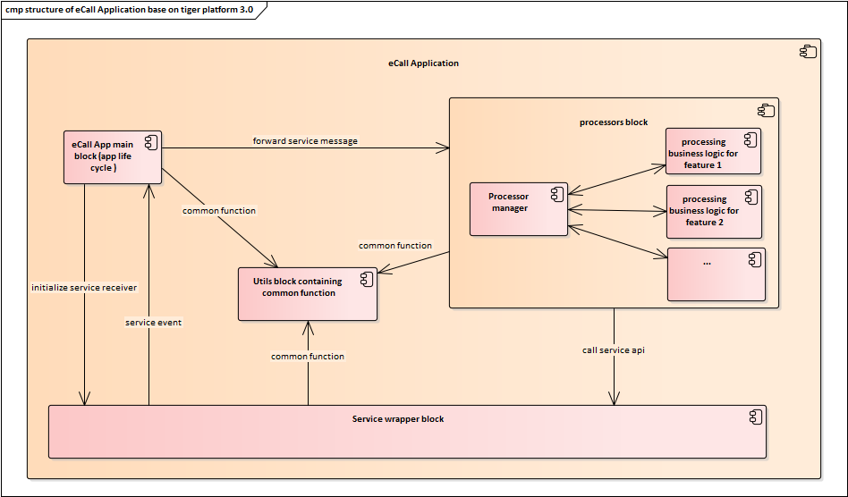
Image reference: doc_image_008.png

With the new structure, the logic sequences can be modeled by the below common sequence:

Image reference: doc_image_009.emf

The step descriptions:

Step 1.0: Service module sent an event when it occur to the listener registered by ECall module.

Step 2.0: Service wrapper module does small logic such as filter to remove unnecessary message before sending it to message queue, and at this step doesn’t much many things, and doesn’t use the resource of main thread.

Step 3.0, 3.1, 4.0: Use the App handler to send service message to message queue and SLLooper thread has the responsibility for en-queue, de-queue message then dispatches it to main thread.

Step 5.0: App main forwards message to processors manager class.

Step 6.0, 7.0: Processor manager class checks the appropriate class needs to handle message and forward message to this class.

Step 8.0: Processor class handles business logic

Step 9.0, 10.0, 11.0: When ECall App need to call service api, it calls via service wrapper class.

This design doesn’t permit directly communicating between one feature and another feature, it mean that the unnecessary dependencies between features and features are totally removed. The dependency model are simplified as bellow:

Image reference: doc_image_010.emf

2.3 New ECall Application skeleton

By using 2 improvements above and base on the tiger platform 3.0 system, I propose the new structure of ECall App as below:

ECall module is the sub component of telematics system, and most telematics project are implemented base on tiger platform 3.0.

The example of overall architecture of Honda telematics system based on tiger platform 3.0 is showed as bellow (ECall module includes eCallApp and OemCallApp):
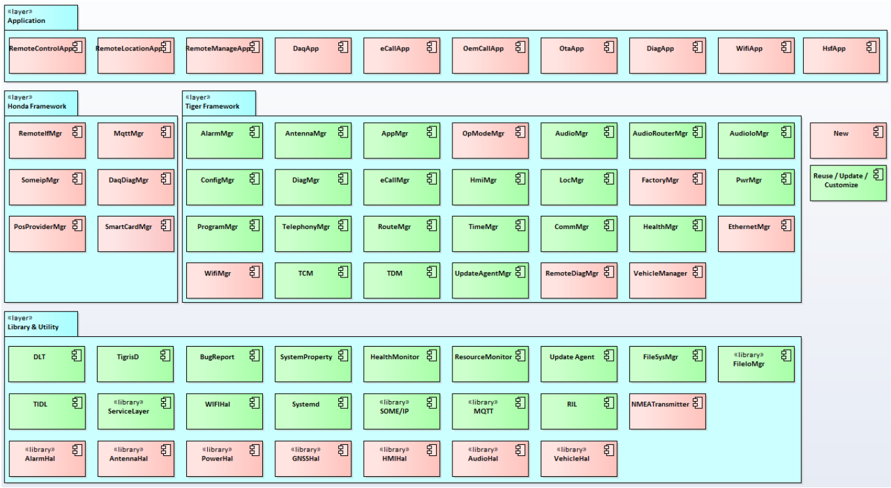
Image reference: doc_image_011.png

The new structure of ECall application are designed base on tiger platform 3.0 as below:
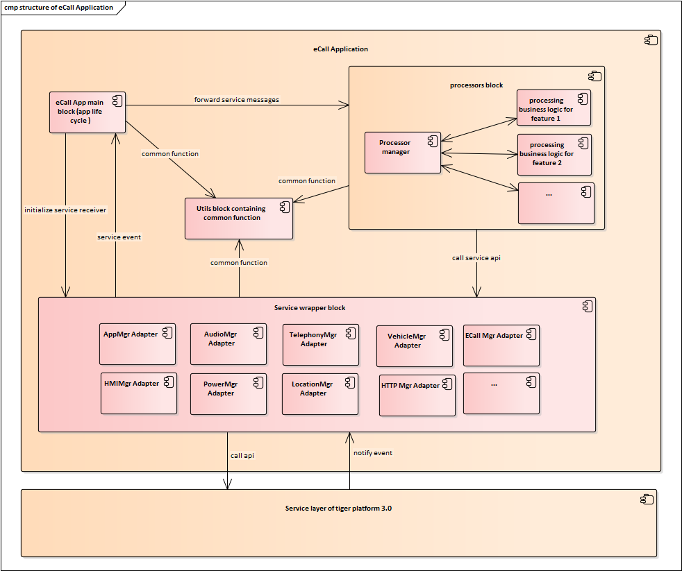
Image reference: doc_image_012.png

2.4 Proposal Comparison Summary

With the analysis above and experimental results. I would like to summarize the comparison of current design with the new design as below:

Table : The comparison of the new designs and old design in aspects of non-functional requirement.

## Table
| Item | Item | Current design 1: all features of each regions are totally independent. | Current design 2: Using state machine for handling specific specification but not well applied. | New design 1: Using the improvement 1: adding service wrapper block | New Design 2: New ECall Application skeleton |
| --- | --- | --- | --- | --- | --- |
| Non-Function Requirement | The new design shall not require any the redundant procedure to any sequence flow of current features causing to down grade the performance of current system. Quality attribute: Performance. | OK - There is no performance problem. | OK - There is no performance problem. | OK - There is no performance problem. - The structure of code is very simple, so there is not any redundant procedure added to any logic sequence. | OK - There is no performance problem. - The structure of code is very simple, so there is not any redundant procedure added to any logic sequence. |
| Non-Function Requirement | The new application applied this design should be available fast enough after the system start booting. Quality attribute: Performance. | OK - After the system boot up completed, the time to initialize the receivers and register with service is small enough. | OK - After the system boot up completed, the time to initialize the receivers and register with service is small enough. | OK - After the system boot up completed, the time to initialize the receivers and register with service is small enough. | OK - After the system boot up completed, the time to initialize the receivers and register with service is small enough. |
| Non-Function Requirement | The new design is easy to adapt with variant telematics system based on tiger platform. Quality attribute: Reusable, Portability. | NG. - The communication with service is separated but is duplicated many time | NG - The communication with service is not separated | OK - The communication with service is separated, it help the module easily adapt with. - Evidence: This improvement is used in many modules in Toyota 24CY DCM project and used in Honda TSU oemcall app | OK - The communication with service is separated, it help the module easily adapt with. - Evidence: This improvement is used in many modules in Toyota 24CY DCM project and used in Honda TSU oemcall app |
| Non-Function Requirement | The new design should help the developer easy to know that what is the sub-components should be modified for the new change (bug fix, specification updated, … ). Quality attribute: Modifiability | NG - This design does not point out what is the sub component of each module. | NG - This design does not point out what is the sub component of each module. | Partly – Improved. - This design separates the app-service communication. | OK - This design divides the module into 4 sub-component. |
| Non-Function Requirement | Developer can easily add the new feature in the case that OEM request to the current system without reducing the other quality attribute of the system or reducing the other quality attribute small enough. Quality attribute: Extensibility | NG - If new feature is requested, new process need to be created. It affected to the system performance. | NG - If new feature is requested, we need adding more state machine class. in otherwise, the un-organized source code make the developer confused to | Partly – Improved - This improvement separates the service wrapper block with business logic block. - This improvement doesn’t consider to separate the business logic handling with other part. | OK. - Adding more process class for handling logic for new feature. |

The evidence for the above comparison that there are many current modules of Honda TSU project and Toyota 24CY DCM project used the New Design 2: New ECall Application skeleton (refer Appendix 1 for more detail). In some cases that the module has only 1 feature, the improvement 1 can be choose to keep the implementation simple corresponding with the simple of the requirement.

To understand more detail about the benefit of the new design I would like to provide more analysis and data from experimental results as below:

1. Experimental results:

Performance quality attribute scenario: The number of used process

ECall module of BMW ICONNIC (Applied current design 1): 5 processes (bmwecallapp, eraecallapp, euecallapp, gscapp, psapecallapp).

ECall module of Honda TSU (Applied new design 2): 2 processes (oemcallapp, ecallapp (applied current design 2)).

ECall module of Toyota DCM 24LC (Applied new design 2): 2 processes (ecalldcnnonreg, ecalldcmreg).

Performance quality attribute scenario: The initializing time of module

The time for registering receivers to service of ECall module of BMW ICONNIC (Applied current design 1): 9 hundreds milliseconds after boot up completed.

The time for registering receivers to service of ECall module of Honda TSU (Applied current design 2):  less than 3 hundreds milliseconds after boot up completed:

Table : Registering receivers to services in Honda ecallapp

## Table
| 4500 2022/05/17 19:16:46.335000 42.7444 4 TSU1 ECAP ECAP 1600 log info verbose 7 1744 [ ECallApplication.cpp : 202 ] System boot completed, initialize application now 4501 2022/05/17 19:16:46.335000 42.7445 5 TSU1 ECAP ECAP 1600 log info verbose 7 1744 [ ECallApplication.cpp : 59 ] Initialize eCall Application service managers and receivers. 4502 2022/05/17 19:16:46.335000 42.7482 6 TSU1 ECAP ECAP 1600 log info verbose 7 1744 [ IndicatorManager.cpp : 24 ] Initialize eCall IndicatorManager 4503 2022/05/17 19:16:46.335000 42.7482 7 TSU1 ECAP ECAP 1600 log info verbose 7 1744 [ AudioController.cpp : 21 ] Initialize eCall AudioController 4569 2022/05/17 19:16:46.341000 42.8063 8 TSU1 ECAP ECAP 1600 log info verbose 7 1744 [ AudioController.cpp : 53 ] Register Audio Receiver successfull 4582 2022/05/17 19:16:46.379000 42.8416 9 TSU1 ECAP ECAP 1600 log info verbose 7 1744 [ LedController.cpp : 18 ] Initialize eCall LedController 4598 2022/05/17 19:16:46.380000 42.8546 10 TSU1 ECAP ECAP 1600 log info verbose 7 1744 [ NotificationController.cpp : 15 ] Initialize eCall NotificationController 5431 2022/05/17 19:16:46.532000 42.9650 11 TSU1 ECAP ECAP 1600 log info verbose 7 1744 [ ConditionManager.cpp : 43 ] Initialize eCall ConditionManager : configMgr, DiagMgr, OpModeMgr 5432 2022/05/17 19:16:46.532000 43.2247 12 TSU1 ECAP ECAP 1600 log info verbose 7 1744 [ EventManager.cpp : 40 ] Initialize eCall EventManager 5433 2022/05/17 19:16:46.532000 43.2266 13 TSU1 ECAP ECAP 1600 log info verbose 7 1744 [ EventManager.cpp : 142 ] Register VCM successfull 5434 2022/05/17 19:16:46.532000 43.2437 14 TSU1 ECAP ECAP 1600 log info verbose 7 1744 [ EventManager.cpp : 53 ] Registerd HMI Manager service 5435 2022/05/17 19:16:46.532000 43.2830 15 TSU1 ECAP ECAP 1600 log info verbose 7 1744 [ EventManager.cpp : 120 ] Registed Comm Receiver 5436 2022/05/17 19:16:46.532000 43.2892 16 TSU1 ECAP ECAP 1600 log info verbose 7 1744 [ CommManager.cpp : 56 ] Initialize CommManager 5437 2022/05/17 19:16:46.532000 43.3302 17 TSU1 ECAP ECAP 1600 log info verbose 7 1744 [ ECallApplication.cpp : 74 ] Register eCallManagerReceiver state changed successfully! 5438 2022/05/17 19:16:46.532000 43.3645 18 TSU1 ECAP ECAP 1600 log info verbose 7 1744 [ ECallApplication.cpp : 82 ] Register eCallManagerReceiver event detected successfully! |
| --- |

The time for registering receivers to service of ECall module of Honda TSU (Applied new design 2): less than 3 hundred milliseconds after boot up completed).

Table : Registering receivers to services in Honda OEMCallapp

## Table
| 8417 2023/08/08 11:25:24.169000 64.6759 3 TSU1 OEMC OECT 2164 log info verbose 13 [ 2413 ] [ oem_call_app.cpp : 71 : ] [ doBootCompleted ] onBootComplete 8419 2023/08/08 11:25:24.177000 64.8845 5 TSU1 OEMC OECT 2164 log info verbose 13 [ 2413 ] [ receiver_manager.cpp : 181 : ] [ registerPowerService ] registerPowerService 8420 2023/08/08 11:25:24.185000 65.2409 6 TSU1 OEMC OECT 2164 log info verbose 15 [ 2413 ] [ receiver_manager.cpp : 200 : ] [ registerPowerService ] registerPowerService , Registed Power manager Service 8417 2023/08/08 11:25:24.169000 64.6759 3 TSU1 OEMC OECT 2164 log info verbose 13 [ 2413 ] [ oem_call_app.cpp : 71 : ] [ doBootCompleted ] onBootComplete 8419 2023/08/08 11:25:24.177000 64.8845 5 TSU1 OEMC OECT 2164 log info verbose 13 [ 2413 ] [ receiver_manager.cpp : 181 : ] [ registerPowerService ] registerPowerService 8420 2023/08/08 11:25:24.185000 65.2409 6 TSU1 OEMC OECT 2164 log info verbose 15 [ 2413 ] [ receiver_manager.cpp : 200 : ] [ registerPowerService ] registerPowerService , Registed Power manager Service 8421 2023/08/08 11:25:24.188000 65.2409 7 TSU1 OEMC OECT 2164 log info verbose 13 [ 2413 ] [ receiver_manager.cpp : 248 : ] [ registerConfigService ] registerConfigService 8422 2023/08/08 11:25:24.189000 65.2433 8 TSU1 OEMC OECT 2164 log info verbose 15 [ 2413 ] [ receiver_manager.cpp : 267 : ] [ registerConfigService ] registerConfigService , Registed Config Service 8423 2023/08/08 11:25:24.199000 65.2466 9 TSU1 OEMC OECT 2164 log info verbose 13 [ 2413 ] [ receiver_manager.cpp : 228 : ] [ registerHMIReceiver ] Registed HMI manager Service 8424 2023/08/08 11:25:24.202000 65.2494 10 TSU1 OEMC OECT 2164 log info verbose 13 [ 2413 ] [ receiver_manager.cpp : 301 : ] [ registerAirBarReceiver ] Registed AirBag Receiver 8426 2023/08/08 11:25:24.207000 65.6968 12 TSU1 OEMC OECT 2164 log info verbose 13 [ 2413 ] [ telephone_manager_adapter.cpp : 205 : ] [ registerTelephonyService ] registerTelephonyService 8428 2023/08/08 11:25:24.211000 65.8626 14 TSU1 OEMC OECT 2164 log info verbose 13 [ 2413 ] [ config_manager_adapter.cpp : 166 : ] [ ConfigManager ] Creating ConfigManagerAdapter ... 8429 2023/08/08 11:25:24.222000 65.8626 15 TSU1 OEMC OECT 2164 log info verbose 13 [ 2413 ] [ config_manager_adapter.cpp : 87 : ] [ setDefaultAllConfig ] setDefaultAllConfig 8430 2023/08/08 11:25:24.228000 66.3852 16 TSU1 OEMC OECT 2164 log info verbose 13 [ 2413 ] [ rim_adapter.cpp : 152 : ] [ registerRIM ] registerRIM 8431 2023/08/08 11:25:24.230000 66.4473 17 TSU1 OEMC OECT 2164 log info verbose 13 [ 2413 ] [ rim_adapter.cpp : 167 : ] [ registerRIM ] [RIM] Registed RIM Service 8432 2023/08/08 11:25:24.234000 66.4473 18 TSU1 OEMC OECT 2164 log info verbose 13 [ 2413 ] [ hmi_manager_adapter.cpp : 61 : ] [ HmiManagerAdapter ] Creating HmiManagerAdapter ... 8435 2023/08/08 11:25:24.253000 66.5995 21 TSU1 OEMC OECT 2164 log info verbose 13 [ 2413 ] [ audio_manager_adapter.cpp : 170 : ] [ AudioManagerAdapter ] Creating AudioManager Adapter ... 8436 2023/08/08 11:25:24.253000 66.6238 22 TSU1 OEMC OECT 2164 log info verbose 15 [ 2413 ] [ audio_manager_adapter.cpp : 144 : ] [ registerAudioService ] registerAudioService , Registed Audio manager Service 8437 2023/08/08 11:25:24.253000 66.6239 23 TSU1 OEMC OECT 2164 log info verbose 13 [ 2413 ] [ app_manager_adapter.cpp : 216 : ] [ AppManagerAdapter ] Creating AppManager Adapter ... 8438 2023/08/08 11:25:24.253000 66.6239 24 TSU1 OEMC OECT 2164 log info verbose 13 [ 2413 ] [ power_manager_adapter.cpp : 124 : ] [ PowerManagerAdapter ] Creating PowerAdapter ... 8439 2023/08/08 11:25:24.253000 66.6250 25 TSU1 OEMC OECT 2164 log info verbose 13 [ 2413 ] [ comm_manager_adapter.cpp : 150 : ] [ CommManagerAdapter ] Creating CommManagerAdapter ... 8446 2023/08/08 11:25:24.281000 66.7887 32 TSU1 OEMC OECT 2164 log info verbose 13 [ 2413 ] [ AlarmManagerAdapter.cpp : 28 : ] [ init ] AlarmManagerAdapter::init |
| --- |

The time for registering receivers to service of ECall module of Toyota DCM 24LC (Applied new design 2): less than 3 hundred milliseconds after boot up completed).

Table : Registering receivers to services in Toyota ECall module

## Table
| 15420 2023/05/30 13:26:27.039000 61.2466 7 DCM EREG EREG 2407 log info verbose 13 [ 2798 ] [ ECallApp.cpp : 42 : ] [ doBootCompleted ] onBootComplete 15422 2023/05/30 13:26:27.039000 61.2466 9 DCM EREG EREG 2407 log info verbose 13 [ 2798 ] [ AlarmManagerAdapter.cpp : 33 : ] [ registerService ] AlarmManagerAdapter::registerService 15436 2023/05/30 13:26:27.039000 61.2622 10 DCM EREG EREG 2407 log info verbose 13 [ 2798 ] [ AlarmManagerAdapter.cpp : 47 : ] [ registerService ] AlarmManagerAdapter::registerService successfully 15440 2023/05/30 13:26:27.039000 61.2632 14 DCM EREG EREG 2407 log info verbose 13 [ 2798 ] [ AudioManagerAdapter.cpp : 76 : ] [ registerService ] AudioManagerAdapter::registerService successfully 15485 2023/05/30 13:26:27.070000 61.2862 16 DCM EREG EREG 2407 log info verbose 13 [ 2798 ] [ VehicleManagerAdapter.cpp : 48 : ] [ registerService ] ApplicationManagerAdapter::registerService 15555 2023/05/30 13:26:27.086000 61.4557 31 DCM EREG EREG 2407 log info verbose 13 [ 2798 ] [ PowerManagerAdapter.cpp : 68 : ] [ registerService ] PowerManagerAdapter::registerService 15863 2023/05/30 13:26:27.225000 62.7208 35 DCM EREG EREG 2407 log info verbose 13 [ 2798 ] [ TelephoneManagerAdapter.cpp : 35 : ] [ registerService ] PowerManagerAdapter::registerService 15879 2023/05/30 13:26:27.225000 62.7258 36 DCM EREG EREG 2407 log info verbose 13 [ 2798 ] [ TelephoneManagerAdapter.cpp : 56 : ] [ registerService ] Registed Telephony manager Service 16005 2023/05/30 13:26:27.258000 62.8637 41 DCM EREG EREG 2407 log info verbose 13 [ 2798 ] [ HMIManagerAdapter.cpp : 152 : ] [ registerService ] Registed HMI manager Service 16007 2023/05/30 13:26:27.258000 62.8650 43 DCM EREG EREG 2407 log info verbose 13 [ 2798 ] [ CommunicationManagerAdapter.cpp : 40 : ] [ registerService ] Registed AirBag Receiver 16090 2023/05/30 13:26:27.289000 63.0446 48 DCM EREG EREG 2407 log info verbose 13 [ 2798 ] [ ConfigurationManagerAdapter.cpp : 182 : ] [ registerService ] Registed Config Service successfully 16091 2023/05/30 13:26:27.289000 63.0465 49 DCM EREG EREG 2407 log info verbose 13 [ 2798 ] [ ConfigurationManagerAdapter.cpp : 195 : ] [ registerService ] Registed registerDataChangedEvent successfully |
| --- |

Performance quality attribute scenario: Consume time to receive service event

ECall module of BMW ICONNIC (Applied current design 1): not all but almost service events listened by ECall module are sent 5 times to 5 processes of ECall module.

ECall module of Honda TSU (Applied new design 2): not all but almost service events listened by ECall module are sent 2 times to 2 processes of ECall module.

ECall module of Toyota DCM 24LC (Applied new design 2): not all but almost service events listened by ECall module are sent 2 times to 2 processes of ECall module.

Performance quality attribute scenario: Memory usages after system boot up completed

Measured by command “procrank” at the time after system boot up complete, ecall module is ready but in IDLE state. I measured 5 times and the results as bellow:

ECall module of BMW ICONNIC (Applied current design 1):

## Table
|  | bmwecallapp | bmwecallapp | bmwecallapp | eraecallapp | eraecallapp | eraecallapp | euecallapp | euecallapp | euecallapp | gscapp | gscapp | gscapp | psapecallapp | psapecallapp | psapecallapp |
| --- | --- | --- | --- | --- | --- | --- | --- | --- | --- | --- | --- | --- | --- | --- | --- |
|  | RSS | PSS | USS | RSS | PSS | USS | RSS | PSS | USS | RSS | PSS | USS | RSS | PSS | USS |
| #1 | 8564K | 2745K | 2336K | 8492K | 2719K | 2300K | 8256K | 2488K | 2072K | 6304K | 1461K | 1192K | 7156K | 1949K | 1676K |
| #2 | 8512K | 2746K | 2340K | 8524K | 2786K | 2372K | 8164K | 2474K | 2080K | 6168K | 1486K | 1244K | 7172K | 1986K | 1708K |
| #3 | 8392K | 2684K | 2284K | 8556K | 2772K | 2340K | 8144K | 2471K | 2052K | 6136K | 1465K | 1204K | 7028K | 1909K | 1640K |
| #4 | 8420K | 2724K | 2328K | 8568K | 2803K | 2368K | 8240K | 2557K | 2152K | 6184K | 1510K | 1260K | 7048K | 1973K | 1708K |
| #5 | 8640K | 2693K | 2260K | 8600K | 2710K | 2280K | 8348K | 2506K | 2072K | 6268K | 1424K | 1148K | 7320K | 2016K | 1720K |

ECall module of Honda TSU (Applied new design 2):

## Table
|  | oemcallapp | oemcallapp | oemcallapp | ecallapp | ecallapp | ecallapp |
| --- | --- | --- | --- | --- | --- | --- |
|  | RSS | PSS | USS | RSS | PSS | USS |
| #1 | 5460K | 1969K | 1804K | 4640K | 1436K | 1296K |
| #2 | 5460K | 1969K | 1804K | 4636K | 1432K | 1292K |
| #3 | 5460K | 1969K | 1804K | 4640K | 1436K | 1296K |
| #4 | 5464K | 1965K | 1800K | 4640K | 1436K | 1296K |
| #5 | 5460K | 1969K | 1800K | 4636K | 1432K | 1296K |

ECall module of Toyota DCM 24LC (Applied new design 2)

## Table
|  | ecalldcmnonreg | ecalldcmnonreg | ecalldcmnonreg | ecalldcmreg | ecalldcmreg | ecalldcmreg |
| --- | --- | --- | --- | --- | --- | --- |
|  | RSS | PSS | USS | RSS | PSS | USS |
| #1 | 7388K | 3372K | 3112K | 7360K | 2167K | 1664K |
| #2 | 7388K | 3374K | 3112K | 7364K | 2169K | 1662K |
| #3 | 7384K | 3370K | 3108K | 7362K | 2169K | 1668K |
| #4 | 7384K | 3374K | 3108K | 7364K | 2169K | 1666K |
| #5 | 7388K | 3372K | 3112K | 7362K | 2167K | 1662K |

The comparison of total memory usage of ECall modules of BMW, Honda TSU, Toyota 24DCM are as bellow:

With the above data, it indicates that if the number of processed used increase with the number of process, the consumed resource will be increase. By applying the new design, we can groups many feature into one process to handle, this actions brings the benefits of reducing the number of used processes. In the real projects, by applying new design in Honda TSU project: ACN US, ECall US, RSN Call for Japan, ACN with phone features to Oemcallapp process and by applying new design in Toyota 24 DCM, I grouped many features to 2 processes (ecalldcmreg contains EU ACN, EU ECall, EU Test service, JP ACN, JP ECall, JP Test call, JP maintenance features, …; and ecalldcmnonred contains US RSN, US ACN, US ECall, CN ACN, CN SOS, maintenance, test call, TW ECall, IN ECall, …).

2. The improved quality attributes are showed as below:

By using the new design, some important quality attributes below are improved:

Table : The comparison of the improved quality attributes of the new designs.

## Table
| Quality attribute | New design 1: Using the improvement 1: adding service wrapper block | New Design 2: New ECall Application skeleton |
| --- | --- | --- |
| Modifiability | Partly – Improved. - Easy to modify service wrapper block | Improved. - Easy to modify service wrapper block. - Easy to modify logic handling class |
| Portability | Improved. - Service wrapper block help the module become easier to adapt with variant system based on tiger platform 3.0 (This design is applied some project: Honda TSU, Toyota DCM). | Improved. - Service wrapper block help the module become easier to adapt with variant system based on tiger platform 3.0 (This design is applied some project: Honda TSU, Toyota DCM). |
| Reusable | Improved. - Service wrapper block can be reused with small changing. | Improved - Service wrapper block can be reused with small changing. - The structure diagram can be reused in other module with one part of source code. |
| Extensibility | Partly-Improved. - Easy to add service wrapper class. | Improved. - Easy to add service wrapper class. - Easy to add new feature (processor class) |

And with above experimental results, the performance quality attribute also is improved by applying New Design 2: New ECall Application skeleton to develop ECall module as bellow:

## Table
| Quality attribute | Scenarios | Current design #1: all features of each regions are totally independent | New Design 2: New ECall Application skeleton |
| --- | --- | --- | --- |
| Performance | The number of process. | Linear with the number of features. | Const. Improved. |
| Performance | The initializing time of module. | Linear with the number of features. | Const. Improved. |
| Performance | Consume time to receive service event. | Linear with the number of features. | Const. Improved. |
| Performance | Memory usages after system boot up completed. | Linear with the number of features. | Const. Improved. |

See the Appendix 1 for more detail about the usages of ECall Application Skeleton.

Architecture Diagrams of ECall Application Skeleton Architecture

3.1 Static Design

ECall Application Skeleton is composed by 4 sub block, the descriptions of each block are described as below table:

Table : Sub-block of ECall Application skeleton

## Table
| Index | Component | Description |
| --- | --- | --- |
| 1 | App main | - Inherit Application class to manage App life cycle. - Include service wrapper class to initialize service wrapper class and listen service events - Forward service event to processors |
| 2 | Service wrapper | - Wrap service classes to use service APIs and listen service events, initialize receiver to service, recover died service |
| 3 | Processor | - Contain processor classes to handle specific business specification |
| 4 | Utils | - Contain common classes, common function such as log function, timer, const definition, message queue handler, … |

The static diagram of ECall Application Skeleton is as below:

Image reference: doc_image_013.png

The class descriptions are showed as the bellow table:

Table : The class descriptions of ECall Application skeleton

## Table
| Class | Descriptions |
| --- | --- |
| ECallApp | This is the main application of ECall Application. - Inherit Application class to manage App life cycle. - Waiting for bootup complete and register service wrapper classes to initialize receivers to service and listen service events - Forward service event to processors |
| utils/ECallHandler | - This class provide Handler object as a singleton object, to receive all messages sent from service and handle these message at the main looper of application. |
| utils/Logger | Provide Logging APIs via DLT or message log |
| services/ApplicationManagerAdapter | Application Service wrapper class provides boot completed signal and provide service priority arbitration algorithm. |
| services/TelephoneManagerAdapter | Telephony service wrapper class |
| services/PowerManagerAdapter | Power service wrapper class |
| services/AudioManagerAdapter | Audio service wrapper class |
| services/CommunicationManagerAdapter | COM port service wrapper class |
| services/ HMIManagerAdapter | HMI service wrapper class |
| services/ LocationManagerAdapter | Location service wrapper class |
| services/VehicleManagerAdapter | Vehicle service wrapper class |
| … (many more service wrapper classes) |  |
| processor/ProcessorManager | This class manages the processors classes, it initialize processor classes, and forward the events to the proper class needing to handle it. |
| processor/ProcessorFeatureClass | This class handle the business logic of a feature. |
| … (many more processor classes) |  |

3.2 Dynamic Design

3.2.1 State Design

The state diagram of ECall Application skeleton is as bellow:

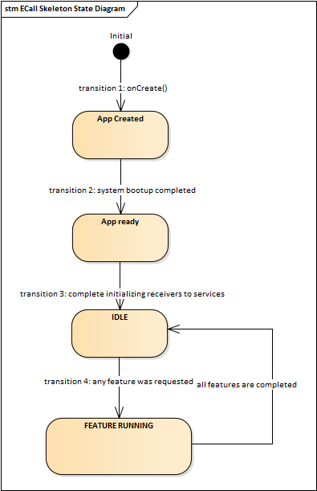
Image reference: doc_image_014.png

Table : The description of ECall Application state transition

## Table
| Current state | Event | Next state | Descriptions |
| --- | --- | --- | --- |
| Initial | onCreate() | App created | When system call the function onCreate() from instance of Application class, then app is created. |
| App created | System boot up complete. | App ready | Right after app is created, it will check the system is boot up completed or not, if not it will wait I current state until system boot up completed and transits to App ready state |
| App ready | Complete initializing receivers to services. | IDLE | Right after application is ready, it will initialize all needed receivers to services to listen service event, when this process is completed, it will transits to IDLE state, in this state all features are ready to work normally |
| IDLE | Any feature is requested. | FEATURE RUNNING | When any features requested, the application will operates the feature as its specification |
| FEATURE RUNNING | All features are completed. | IDLE | When all features are completed, application will transits to IDLE state, in which, it is available for operating new feature. |

3.2.2 Interaction Design.

3.2.2.1 Booting up sequence.

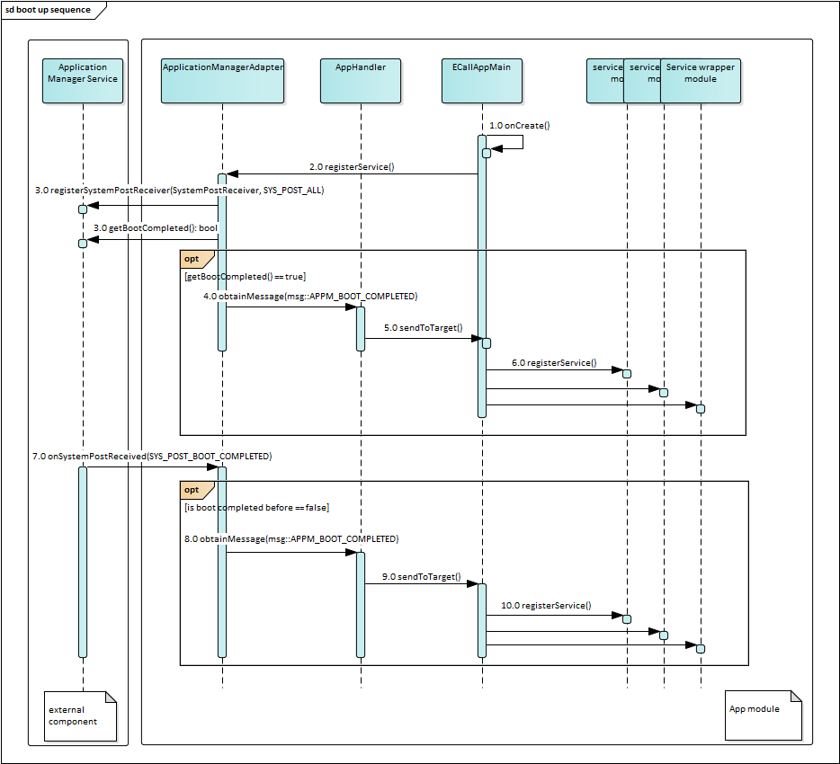
Image reference: doc_image_015.png

3.2.2.2 Registering receivers to services sequence

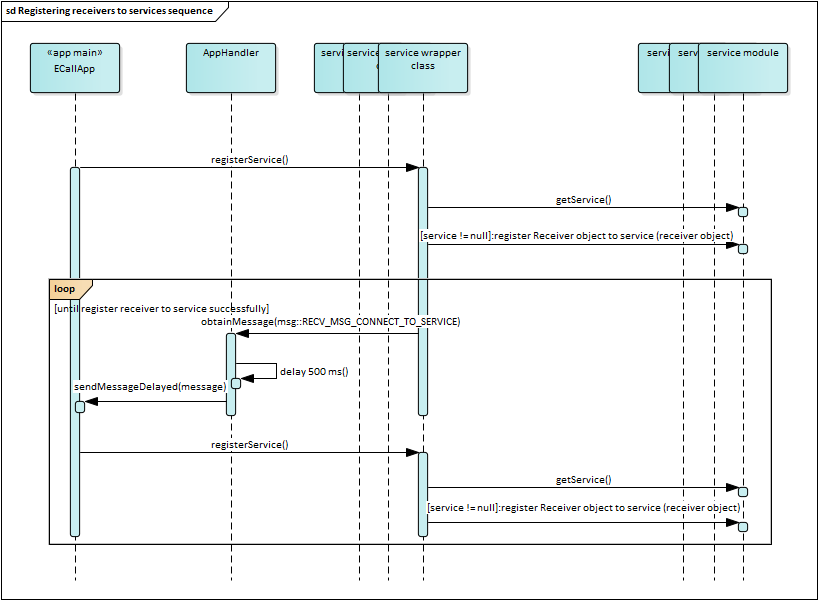
Image reference: doc_image_016.png

3.2.2.3 Recovering the connection with service sequence

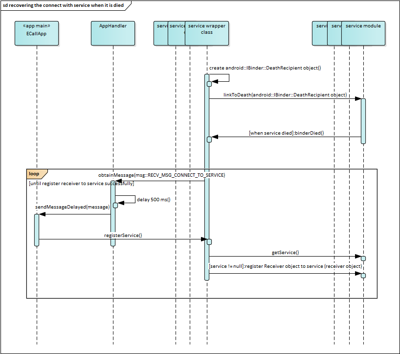
Image reference: doc_image_017.png

3.3 Algorithm Design.

3.3.1 Handling priority specification.

Because, priority matrix is 1 of the common and important requirement of telematics system, show the new design supports to handle this requirement.

Normally, priority specification is feature-crossed specification, it describes how the system behaves if the next features is requested and the current system has some or zero features operating. It can be summarized as below table:

## Table
| Current features | Feature 1 | Feature 2 | … | Feature n |
| --- | --- | --- | --- | --- |
| Next requested features | Feature 1 | Feature 2 | … | Feature n |
| Feature 1 | Next behavior can be 1 of the below case: - Allows working parallel. - Terminate the current feature, permit the new feature working. - Not permit the new feature working. - Waiting the old feature finished then start running new feature. - Impossible to occur. | Next behavior can be 1 of the below case: - Allows working parallel. - Terminate the current feature, permit the new feature working. - Not permit the new feature working. - Waiting the old feature finished then start running new feature. - Impossible to occur. | … | Next behavior can be 1 of the below case: - Allows working parallel. - Terminate the current feature, permit the new feature working. - Not permit the new feature working. - Waiting the old feature finished then start running new feature. - Impossible to occur. |
| Feature 2 | Next behavior can be 1 of the below case: - Allows working parallel. - Terminate the current feature, permit the new feature working. - Not permit the new feature working. - Waiting the old feature finished then start running new feature. - Impossible to occur. | Next behavior can be 1 of the below case: - Allows working parallel. - Terminate the current feature, permit the new feature working. - Not permit the new feature working. - Waiting the old feature finished then start running new feature. - Impossible to occur. | … | Next behavior can be 1 of the below case: - Allows working parallel. - Terminate the current feature, permit the new feature working. - Not permit the new feature working. - Waiting the old feature finished then start running new feature. - Impossible to occur. |
| … | Next behavior can be 1 of the below case: - Allows working parallel. - Terminate the current feature, permit the new feature working. - Not permit the new feature working. - Waiting the old feature finished then start running new feature. - Impossible to occur. | Next behavior can be 1 of the below case: - Allows working parallel. - Terminate the current feature, permit the new feature working. - Not permit the new feature working. - Waiting the old feature finished then start running new feature. - Impossible to occur. | … | Next behavior can be 1 of the below case: - Allows working parallel. - Terminate the current feature, permit the new feature working. - Not permit the new feature working. - Waiting the old feature finished then start running new feature. - Impossible to occur. |
| Feature n | Next behavior can be 1 of the below case: - Allows working parallel. - Terminate the current feature, permit the new feature working. - Not permit the new feature working. - Waiting the old feature finished then start running new feature. - Impossible to occur. | Next behavior can be 1 of the below case: - Allows working parallel. - Terminate the current feature, permit the new feature working. - Not permit the new feature working. - Waiting the old feature finished then start running new feature. - Impossible to occur. | … | Next behavior can be 1 of the below case: - Allows working parallel. - Terminate the current feature, permit the new feature working. - Not permit the new feature working. - Waiting the old feature finished then start running new feature. - Impossible to occur. |

The more simple of priority spec can be described by priority level of each feature, each feature has one its own priority level, if two features have the same level of priority then these features are working parallel. If two feature has the different priorities, the higher priority level feature is permitted to work in the case of 1 feature is requested while another feature is working.

It is obviously that handling priority requirement by priority matrix can cover the case that the priority requirement described by priority level without changing the performance of system. But vice versa, we can’t use priority level to describe priority matrix.

 For handling priority matrix requirement, application layer interacts with application manager service as bellow sequence:
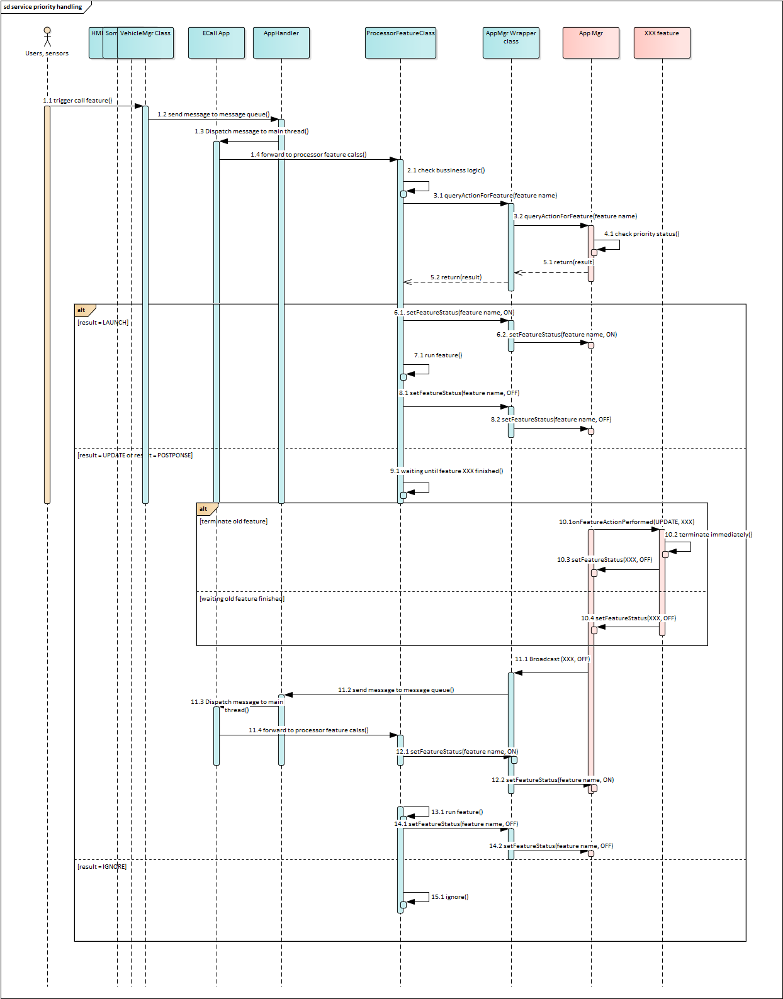
Image reference: doc_image_018.png

Appendix

Appendix 1: Applying ECall Application skeleton in real project:

We have many telematics projects having ECall module, and each of them has the different request. And the design of ECall Application Skeleton Architecture, can easily be extended to meet the requirement of each project and to be suitable with the overall architecture of each project. And not only ECall module, some other modules also applied this design. The applications of this design are showed as below:

1. Honda TSU 25.5

SDD Document Link: http://vscb.lge.com:8080/cb/tracker/78958109.

The current module applied this design is Honda OEMCallApp (Honda OEMCallApp is the application handling all ecall features in non-regulation region). I would like to brief the design as bellow:

Firstly please see the “Figure 7: Overall architecture of Honda telematics system based on tiger platform 3.0” for understanding the overall architecture of Honda telematics system.

To fit this architecture, the service wrapping block is implemented as bellow:
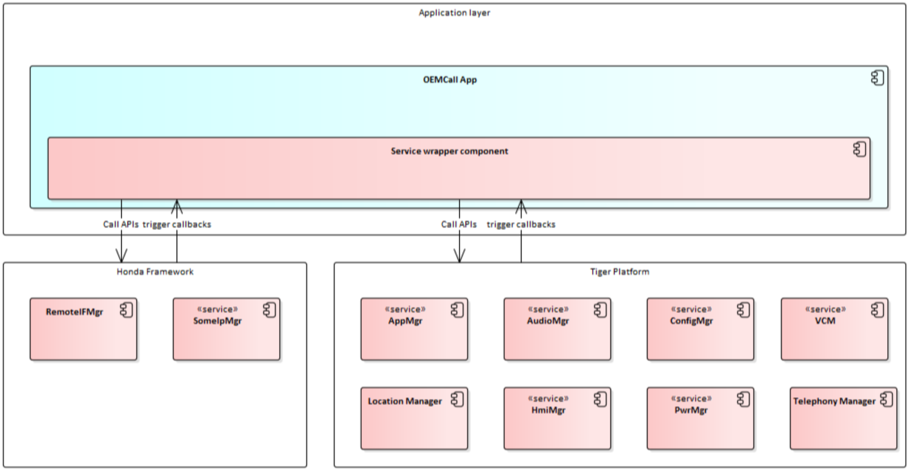
Image reference: doc_image_019.png

In this design, service wrapper block not only communicates with tiger platform service module, it also communicate with Honda framework service module.

OEMCallApp is responsible for handling 3 features NA ECall (ACN for US and ECall for US), Road side notification, ACN with phone. To meet this requirement, the static design is built base on ECall Application skeleton as bellow:

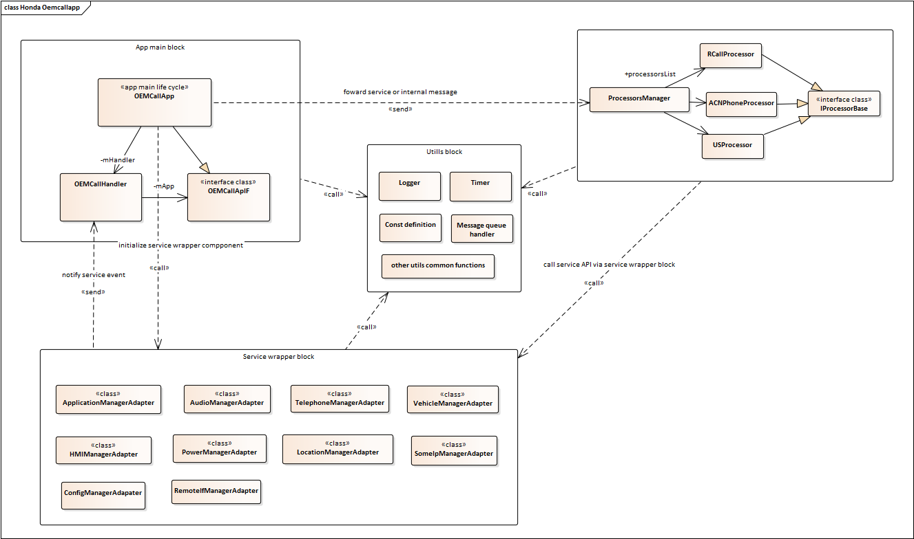
Image reference: doc_image_020.png

2. Toyota 24DCM CY

SAD link: http://vscb.lge.com:8080/cb/tracker/69234779.

Some modules of Toyota 24DCM CY projects designed base on the architect of ECall Application and some modification for fitting with the overall architectures of Toyota 24DCM CY system:

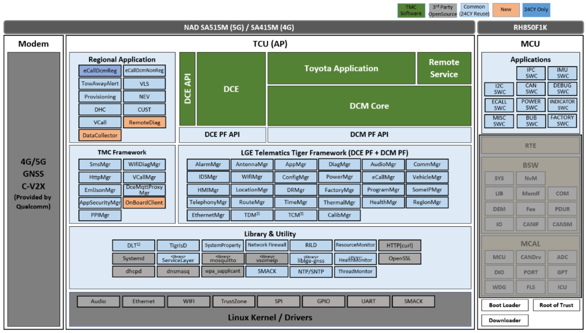
Image reference: doc_image_021.png

2.1 ECall regulation and ECall Non-regulation modules;

ECall regulation is handling for all regulation ECall features, and ECall Non-regulation is handling for all non-regulation Ecall features. The structure diagrams are designed as below:

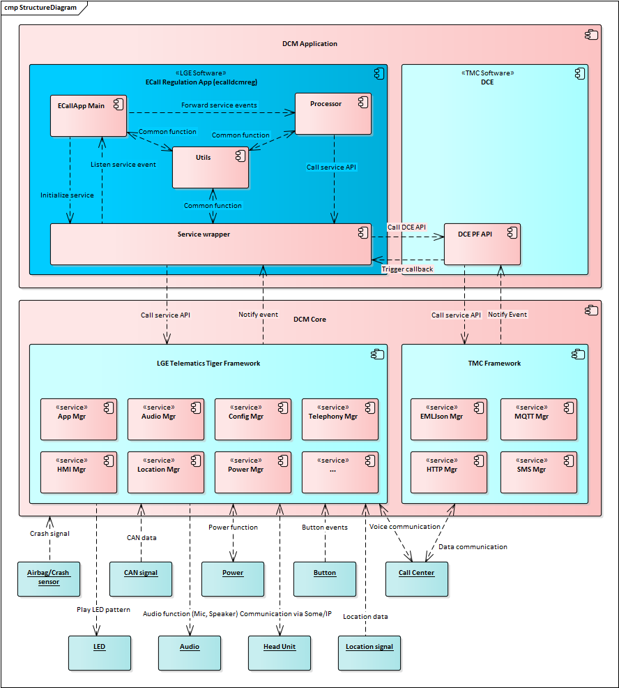
Image reference: doc_image_022.png

And the static design of each module are designed as below:

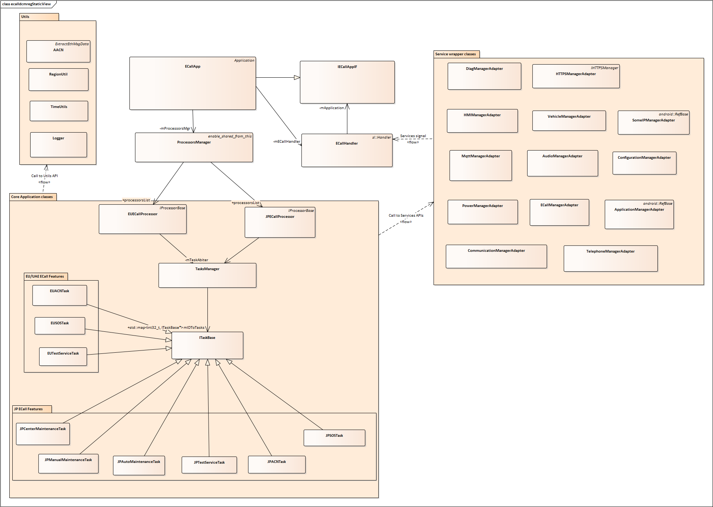
Image reference: doc_image_023.png

2.2 other modules applied ECall Application skeleton design.

Toyota DCM 24CY CUST module: http://vscb.lge.com:8080/cb/issue/23089147.

Toyota DCM 24CY DHC module: http://vscb.lge.com:8080/cb/issue/23089212.

3. Honda TSU 26

In the new project Honda TSU 26, ECall module will be inherited from Honda TSU 25.5 but extended 2 new features “Driver Emergency Support System” (DESS) and Child Presence Detection (CPD). New can signals are added for communicating between ECall module and others modules RODS and RVU (Radar Vision Unit).

For adding these new features, the static diagram of OemcallApp can be updated as bellow:

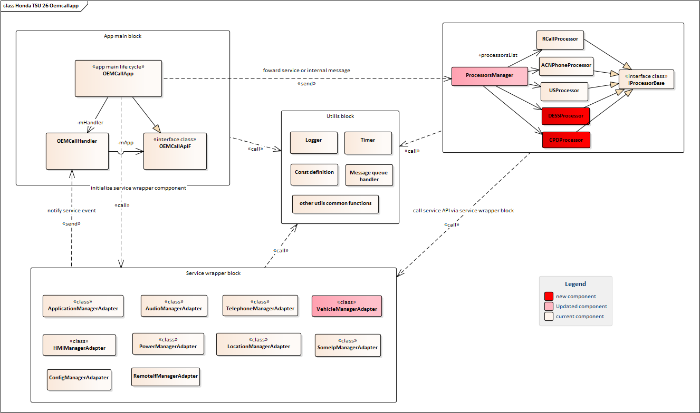
Image reference: doc_image_024.png
