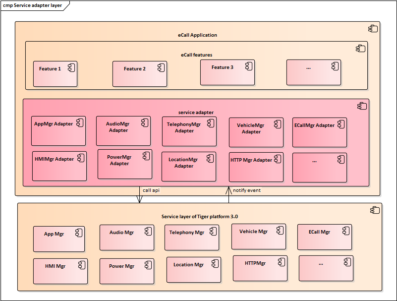
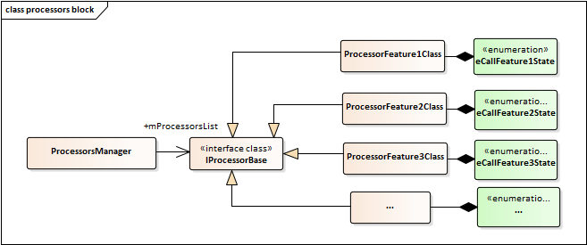
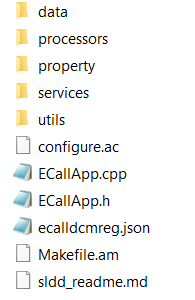
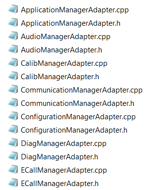
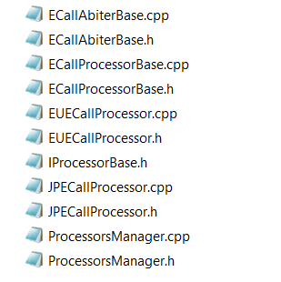
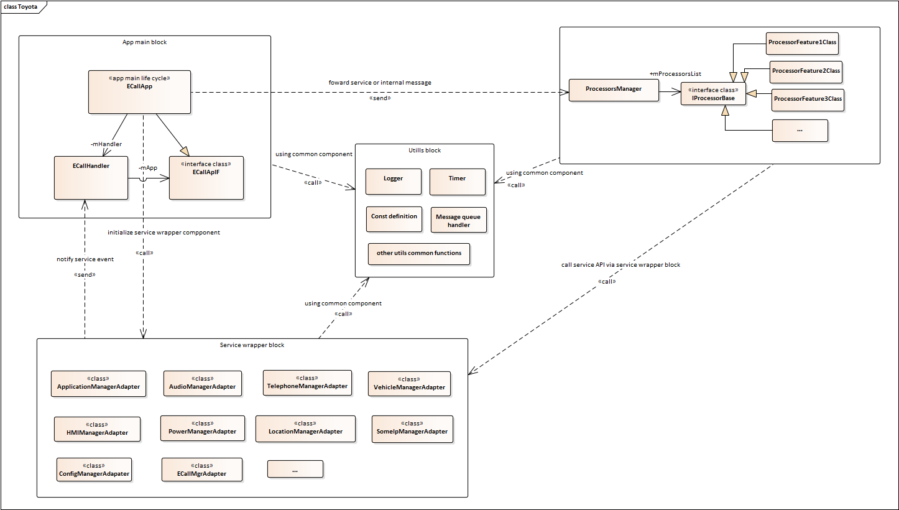
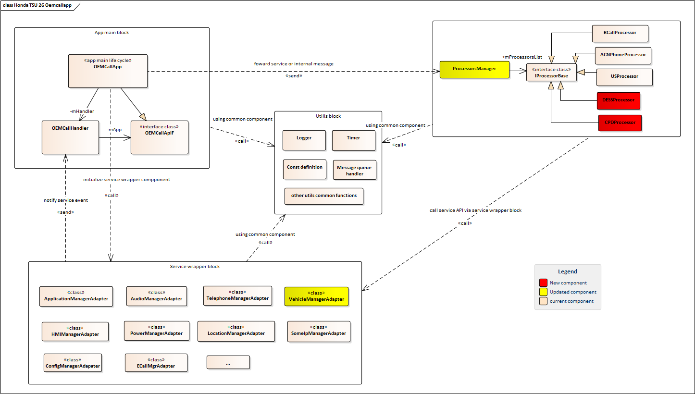

# Raw Slide Content

- Source file: FA_tien_nguyen/FA 인증과제_ECall Application Skeleton Architecture_Final_2.pptx
- Total slides: 18

## Slide 1

FA 인증과제
ECall Application Skeleton Architecture

By Tien.Nguyen
Supervised by Joon.NamKong
ECall Unit – Core Framework 1
LGEDV
October 8th 2023

## Slide 2

TABLE CONTENT

1

Comparison & Experimental Result

3

Detailed Architecture Design

4

Problem Identification

Q&A session

#

6

Architecture Design Proposals

2

## Slide 3

1. Problem Identification

3

Overview of Ecall applicaton

Emergency Call (ECall) Application is one of the most important modules in telematics projects, it is applied to most of telematics project as the requirement from OEM side (Toyota DCM, Honda TSU, BMW ICONNIC, BMW WAVE, …) .
 Because of the popularity and important of ECall Application in telematics project, so it is better to create a design which can help to provide common structure of ECall application, it can be easy to use in variant telematics project and brings the benefits of well-designed module to many projects.

Image reference: slide_03_image_01.png

Ecall application overview

## Slide 4

1. Problem Identification

4

Functional requirement:

Ecall App contains many features and is applied to many markets such as:  Manual ECall (NA, AU, JP, EU, …), Automatic ECall (NA, AU, JP, EU, …)), Road side notification (RSN), ACN with Phone, Test call service, …

Image reference: slide_04_image_01.wmf

## Slide 5

1. Problem Identification

Current Architecture Design Problems

5

1. The current first design: All features of each region are totally independent.

Image reference: slide_05_image_01.wmf

The disadvantages of this design are that:
- Many features use the same logic for listening to user request, collision signals from sensors and interaction with Speaker, MIC, LED, ECall center, ….
- Need to use many processes to handle many features

Duplicated source code

Process 1

Process 2

Process n

## Slide 6

1. Problem Identification

Current Architecture Design Problems

6

2. The current second design: Using state machine patterns for handling Ecall features.

Image reference: slide_06_image_01.wmf

The disadvantages of this design is that:
Each feature has the different number of state and each state has the different responsibilities.
 So not well applying state machine patterns leads source code to be too complicated and too difficult to extent new feature.

## Slide 7

1. Problem Identification

Current Architecture Design Problems

7

1. The current second design: Using state machine patterns for handling Ecall features.

Image reference: slide_07_image_01.png

Fault design: This class handles business logic for all features

Fault design: State classes only handle the logic of  state transition of features

## Slide 8

2. Architecture Design Proposals

The first improvement: Adding service adapter block

8

The Responsibilities of this block are as bellow items:
+ Registering and unregistering receivers to service
+ Recovering the connection with a service module when it is terminated unexpectedly.
+ Listening events from service layer and forwarding to features block
+ The scenarios of using service API.
The advantages of this design are as bellow:
+ Extensibility: easier to add the new service adapter to service wrapper block.
+ Reusable: service wrapper block can be reused with small changing of the scenario of using service API.
+ Modifiability: Reduce the side effect of changing in service to business logic of each feature.
The disadvantage of this design is that: Need additional workload to initialize service wrapper block.

Image reference: slide_08_image_01.png

This wrapper service block permits resolving the duplicated source code problem of current first design by commonizing the common logic of service and app communication

Feature 1

Feature 2

Feature n

Common logic

Tiger service

## Slide 9

2. Architecture Design Proposals

The second improvement: Restructure the ECall Application

9

Divide the app into 4 main blocks
+ App main: Handling app life cycle; initialize other component, listening and forwarding message.
+ Utils: utility functions.
+ Processor: handling business logic.
+ Service wrapper: handling the communication with service layer.
Advantage:
+ Extensibility: easier to extent new feature.
+ Reusable: one part of source code can be reuse.
+ Modifiability: The update of each feature will not affect to other features, the update of service layer will not affect to business logic
Disadvantage:
+ This design is not suitable with the modules having only 1 sub-feature.
+ Difficulty to apply to current modules in which the source code has a different structure.

Image reference: slide_09_image_01.png

Processors block permit resolving god class (a class that does too much) problem and redundant classes problem of current second design by
+ separating the business logic of features in to each processor feature class
+ using enum type to define states of ecall feature in processor classes

Image reference: slide_09_image_02.png

Static design of processor block

## Slide 10

3. Comparison & Experimental Result

10

### Table
| Quality attribute | New design 1 | New Design 2 |
| Modifiability | Partly – Improved. Easy to modify service wrapper block | Improved. Easy to modify service wrapper block. Easy to modify logic handling class |
| Portability | Improved. Service wrapper block helps the module become easier to adapt with variant system based on tiger platform 3.0 (This design is applied in some project: Honda TSU, Toyota DCM). | Improved. Service wrapper block helps the module become easier to adapt with variant system based on tiger platform 3.0 (This design is applied in some project: Honda TSU, Toyota DCM). |
| Reusable | Improved. Service wrapper block can be reused with small change. | Improved. Service wrapper block can be reused with small changing. The structure diagram can be reused in other module with one part of source code. |
| Extensibility | Partly-Improved. Easy to add service wrapper class. | Improved. Easy to add service wrapper class. Easy to add new feature (processor class) |

We have two options for developing new module:
- The first option: Using the first improvement – new design 1.
- The second: The new Ecall Application skeleton (Using 2nd improvement ) – new design 2;
The comparison of these design are as bellow table:

 From this comparison, with the module having many features; we should choose the new design 2



## Slide 11

### Table
|  |  |  |

3. Comparison & Experimental Result

11

- The new design “Ecall Application skeleton” was successfully applied in many modules of Honda TSU and Toyota 24DCM projects: Honda oemcallapp, Toyota DCM ecalldcmreg, Toyota DCM ecalldcmnonreg, Toyota DCM 24CY CUST app, Toyota DCM 24CY DHC app, Toyota DCM 24CY Vcall apps.

Experimental Result:

Image reference: slide_11_image_01.png

uniform structure of source code.

Image reference: slide_11_image_02.png

uniform structure of service wrapper classes.

Image reference: slide_11_image_03.png

Many feature can be added

Source code structure:

Service wrapper block:

Processors block:

## Slide 12

3. Comparison & Experimental Result

12

Performance comparisons between new design and old design:

### Table
| Performance quality attribute scenarios | ECall module of BMW ICONICC (old design) | ECall module of Honda TSU 26MY (new design) | ECall module of Toyota DCM 24LC (new design) |
| The number of used process | 5 processes (bmwecallapp, eraecallapp, euecallapp, gscapp, psapecallapp) | 2 processes  Improved. (oemcallapp, ecallapp, *note I just only applied new design for oemcallapp) | 2 processes  Improved. (ecalldcnnonreg, ecalldcmreg) |
| The initializing time of module | 9 hundreds milliseconds after boot up. The time for registering receivers to service = total time consumed by 5 processes. | 3 hundreds milliseconds  Improved. The time for registering receivers to service = total time consumed by 2 processes | 4 hundreds milliseconds  Improved. The time for registering receivers to service = total time consumed by 2 processes |
| Consumed time to receive service events | Each registered event is sent to 5 processes. | Each registered event is sent to 2 processes  Improved. | Each registered event is sent to 2 process  Improved. |

## Slide 13

3. Comparison & Experimental Result

13

Performance quality attribute scenario: Memory usages after system boot up completed:
Measured by command “procrank”:

Performance comparisons between new design and old design:

### Table
| RSS: resident set size (RSS) is the portion of memory (measured in kilobytes) occupied by a process that is held in main memory (RAM) |
| PSS: Proportional Set Size (PSS): The number of non-shared pages used by the app and an even distribution of the shared pages (for example, if three processes are sharing 3MB, each process gets 1MB in PSS) |
| USS: In computing, unique set size (USS) is the portion of main memory (RAM) occupied by a process which is guaranteed to be private to that process. The unshared memory of a process is reported as USS |

## Slide 14

3. Comparison & Experimental Result

14

 From the experimental result, the new design has the benefits of the important quality attributes: Performance, Modifiability, Portability, Reusable, Extensibility.

Experimental Results:

## Slide 15

4. Detailed Architecture Design

Common sequence for handling logic of features:

15

Image reference: slide_15_image_01.wmf

## Slide 16

4. Detailed Architecture Design

16

The static design of Ecall Application skeleton is shown as bellow:

Image reference: slide_16_image_01.png

## Slide 17

4. Detailed Architecture Design

17

Extending new features DESS and CPD to OEMCallApp (Honda TSU 26):

Image reference: slide_17_image_01.png

## Slide 18

5. Q&A

Q&A

Thank you for listening!

18

