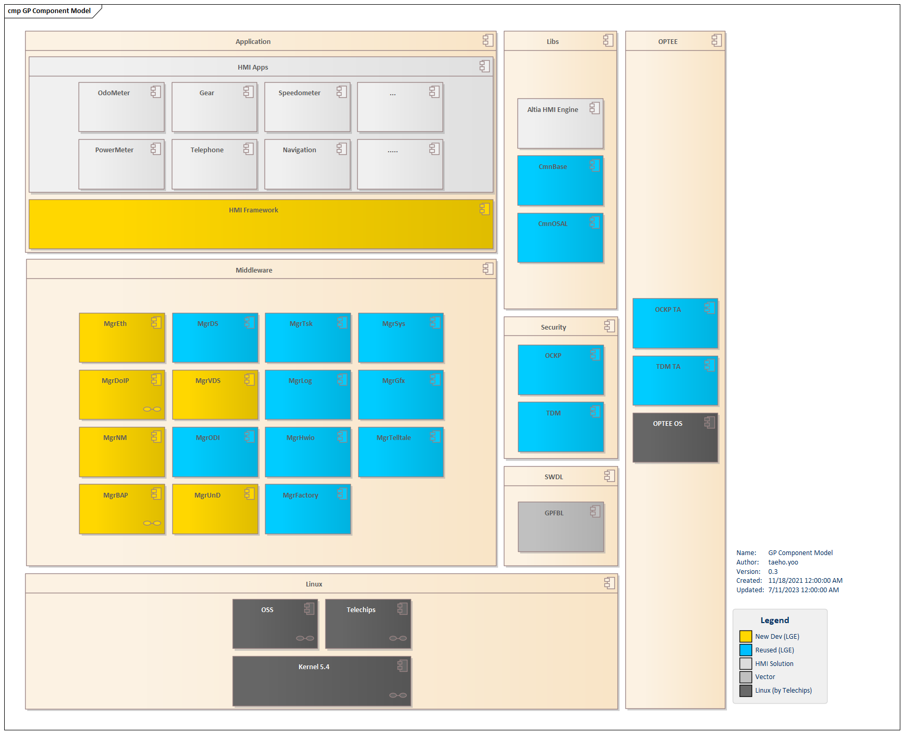
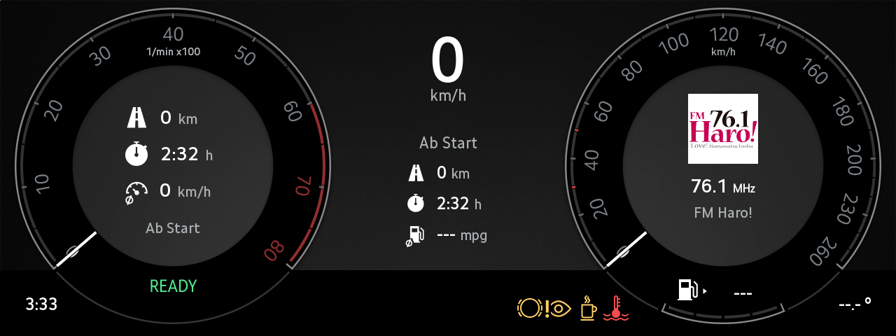
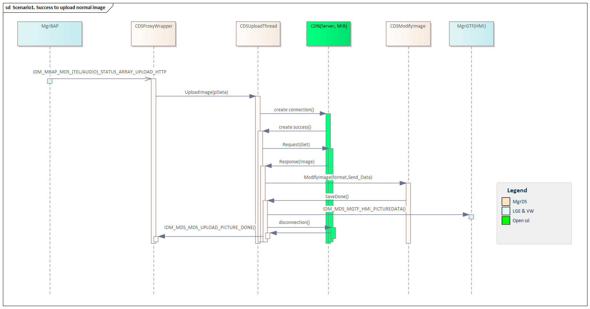
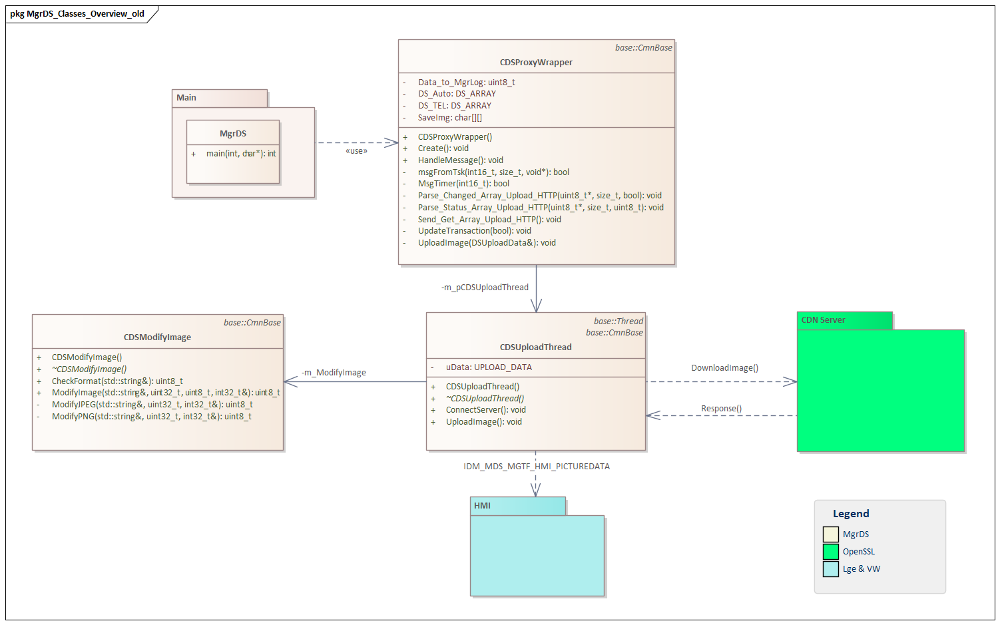
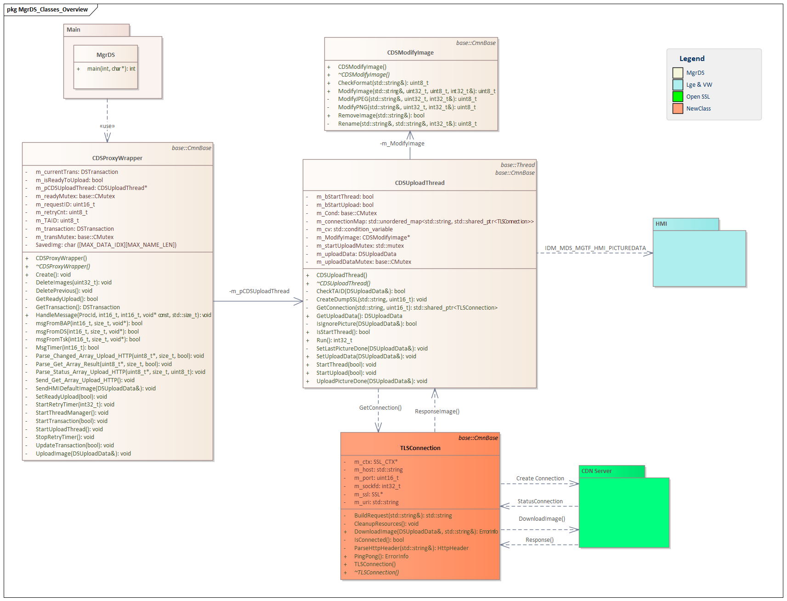

# Raw Document Content

- Source file: FA_tuan7.nguyen/Optimizing Logic and Performance in the MgrDS Service_16092025.docx

FA Certification task (Improving Logic Structure and Performance Efficiency of the Manager Data Sharing Application)

About This Document

Revision History

## Table
| Version | Date | Content of Change | Author | Reviewer |
| --- | --- | --- | --- | --- |
| 0.1 | 2025.07.01 | Initial Release | tuan7.nguyen |  |
| 0.2 | 2025.09.09 | Update comment from Mentor | Tuan7.nguyen |  |

Purpose

This document specifies the software detailed design for the Manager Data Sharing Service (MgrDS) in the FPK project. Including static design, dynamic design, and algorithm design.

This document identifies the class consisting of the MgrDS app and describes the behaviors of those classes to accomplish the requirements upon them.

Project Background

1: Manager Data Sharing Application Overview

1.1: Overall Descriptions.

Manager Data Sharing (MgrDS) application is one of the Cheetah applications, it is located at GP partition in FPK project. The module's primary function is to download an image over the network from the Head Unit in response to a request initiated by the Head Unit.

Image reference: doc_image_001.png

Figure 1: Project background

Image reference: doc_image_002.png

Figure 2: MgrDS process download and request HMI display Image

1.2: Functional Requirement of MgrDS app.

The MgrDS application supports the following key functionalities:

Handles communication messages received from the Head Unit and HMI.

Manages the Ethernet-based connection with the Head Unit.

Downloads images from the specified source.

Performs image modifications and stores them in the internal file system.

2:  Architectural Analysis.

2.1: Problem Identification

Let see the scenario download Image:

Image reference: doc_image_003.png

Figure 3: scenario download Image

As indicated in Figure 2, three issues have been identified and highlighted in red above:

#1: Using Multi-Threading to create class CDSUploadThread

Every image download request requires the creation of a new thread.

Inside each thread, a new connection is established before initiating the image download.

This process significantly increases response time and system resource usage.

#2: CDSUploadThread is responsible for handling multiple tasks, from message processing to connection creation and management.

#3: Modify and Save All Image

What could be the outcome of these issues?

Using Multi-Threading to create class CDSUploadThread:

Race Conditions: When multiple threads access or modify shared resources (like variables, files, or network connections) without proper synchronization, it may lead to unpredictable behavior or data corruption.

Deadlocks: Occur when two or more threads are waiting for each other to release resources, causing all threads involved to freeze indefinitely.

Resource Contention: Creating too many threads can lead to competition for CPU time or network bandwidth, resulting in performance degradation.

Memory Leaks or Resource Exhaustion: If threads, buffers, or network handles aren’t properly released, system resources can be drained unnecessarily.

Concurrency Bugs: These bugs are difficult to detect and reproduce. For example, one thread writing to a file while another is reading it can corrupt the output.

Thread Starvation: Some threads may never get CPU time if scheduling is unfair, especially when high-priority threads monopolize system resources.

CDSUploadThread is responsible for handling multiple tasks, from message processing to connection creation and management.

 Tight Coupling

Mixing multiple concerns in one thread makes the system harder to maintain and extend.

Any change in message handling might unintentionally affect connection logic.

 Performance Bottlenecks

One thread doing too much can slow down the entire upload process.

Increased latency due to sequential or blocking operations.

 Reduced Fault Tolerance

If the thread crashes due to one faulty task (e.g., failed connection), it could bring down the whole upload mechanism.

 Difficult Debugging

When multiple responsibilities are entangled, tracing bugs becomes complex and time-consuming.

 Scalability Limitations

Harder to scale specific functionalities independently (e.g., scaling message handling without affecting connection logic).

 Poor Resource Utilization

CPU and memory might be inefficiently used if the thread is constantly switching between unrelated tasks.

Modify and Save All Image

Processing may introduce unnecessary time overhead for images that do not require any modification.

## Table
| Class / Source File | Responsibilities |
| --- | --- |
| CDSProxyWrapper (CDSProxyWrapper.cpp) | Entry point of the application Handles messages and requests from external applications Initiates the image download process |
| CDSUploadThread (CDSUploadThread.cpp) | Manages the image download operations Handles Ethernet-based communication with the Head Unit |
| CDSModifyImage (CDSModifyImage.cpp) | Processes image modifications to meet predefined specifications or expectations Save image to the folder /log |

Table 1 Current class list

This is the diagram class in MgrDS:

Figure 4: Class diagram

These time-stamped records were obtained directly from live environments:

## Table
| # | Request Expect image | Start request | Success display Image | Time process | Image output |
| --- | --- | --- | --- | --- | --- |
| 1 | 160199.png | '00:44:49.204436 | '00:44:51.224661 | 2.020225 | 160199.png |
| 2 | 160203.png | '00:44:51.225142 | '00:44:53.617660 | 2.392518 | 160203.png |
| 3 | 160432.png | '00:44:53.618152 | '00:44:57.654741 | 4.036589 | 160432.png |
| 4 | 160195.png | '00:44:57.655145 | '00:45:01.673899 | 4.018754 | 160195.png |
| 5 | 160311.png | '00:45:01.674362 | '00:45:05.074025 | 3.399663 | 160311.png |
| 6 | 160195.png | '00:45:05.074539 | '00:45:06.523955 | 1.449416 | 160195.png |
| 7 | 160057.png | '00:45:12.523715 | '00:45:18.555240 | 6.031525 | 160057.png |
| 8 | 160159.png | '00:45:18.556148 | '00:45:23.407283 | 4.851135 | 160159.png |
| 9 | 160021.png | '00:45:23.408981 | '00:45:26.244444 | 2.835463 | 160021.png |
| 10 | 160021.png | '00:45:26.244937 | '00:45:27.009820 | 0.764883 | 160021.png |
| 11 | 160189.png | '00:45:27.010612 | '00:45:29.125299 | 2.114687 | 160189.png |
| 12 | 160018.png | '00:45:29.126314 | '00:45:32.574618 | 3.448304 | 160018.png |
| 13 | 160189.png | '00:45:32.575013 | '00:45:35.724004 | 3.148991 | default image |
| 14 | default image | '00:45:35.726748 | '00:45:35.727103 | 0.000355 | default image |
| 15 | default image | '00:45:35.726748 | '00:45:36.669693 | 0.942945 | 160189.png |

Table 2: Record data time to download Image

Table Analysis:

Observations from Real-World Data

Based on data collected from the live production environment, image display requests exhibit considerable latency.

The delays range from a minimum of 0.764883 seconds to as much as 6.031525 seconds in certain cases.

Average time ≈ 3.70618 seconds

Highlighted Failure Cases:

## Table
| Case | Issue Type | Description |
| --- | --- | --- |
| #13 | Thread Synchronization | Improper synchronization across threads caused logic errors and disrupted request handling. |
| #15 | The issue is unknown | The root cause couldn’t be found because it’s too difficult to debug. |

Root Cause Considerations

Each image request triggers the creation of a separate thread, introducing significant system overhead.

The absence of centralized error handling makes it difficult to detect and resolve issues quickly and reliably.

2.2: Conclusion

Figure 3 highlights three critical architectural and implementation issues affecting system performance and reliability:

Multi-threaded Image Download via CDSUploadThread

CDSUploadThread is overloaded with responsibilities, from handling incoming messages to managing connections.

Unnecessary Modification of All Images

These issues collectively contribute to increased latency, resource inefficiency, and system instability. These delays are significant and directly impact user experience and system responsiveness.

Recommendation Summary

To mitigate these issues:

Implement thread pooling and proper synchronization mechanisms.

The CDSUploadThread class should be split, and the connection management part should be moved to a new class. This will make the code easier to manage, more readable, and simplify debugging. It will also make exception handling more straightforward.

Introduce conditional image processing to avoid unnecessary modifications.

3: Architectural Proposal: Enhancing MgrDS Image Download Design

3.1: Objective

The primary goal of these proposals is to modularize connection handling by introducing a dedicated class for connection management. This abstraction will streamline connection control and significantly improve future maintainability and extensibility and improve performance.

3.2. Proposal 1: Create thread pool

Create a class to manager the threads.

Optimizing System Performance

Reduces thread creation overhead: Creating and destroying threads repeatedly consumes resources. A thread pool reuses existing threads, minimizing this cost.

Controls the number of active threads: Limiting concurrent threads helps prevent CPU or memory overload—especially critical in embedded systems.

Efficient Resource Management

Prevents memory leaks: Thread pools manage thread lifecycles more predictably, reducing the risk of leaks or system crashes.

Improves system stability: With a fixed number of threads, the system becomes more predictable and less prone to resource exhaustion.

Enhances Responsiveness

Handles short tasks in parallel: In embedded systems like IoT devices, thread pools allow quick and efficient handling of small tasks (e.g., reading sensors, sending data).

Reduces latency: Threads are always ready in the pool, so tasks can be executed immediately without waiting for thread creation.

Easier Maintenance and Scalability

Integrates well with multithreading frameworks: Many libraries like FreeRTOS, Zephyr, or Java Embedded support thread pools, making it easier to scale your application.

Better task control: Thread pools often include task queues, giving developers more control over execution flow and system behavior.

3.3. Proposal 2: Persistent Connection and Conditional Image Update

Only a single thread is instantiated for the CDSUploadThread class.

A new class named TLSConnection is introduced to encapsulate connection logic and should keep the connection alive when no requests are being made.

Modify or update the image only when necessary, minimizing redundant processing

 The UploadThread class:

Initializes the connection once at system boot (startup)

Closes the connection only when the system shuts down

This method improves performance by avoiding repeated connection cycles and ensures image updates occur only when required, reducing overhead.

Proposal 1: Create thread pool

Purpose and Benefits

Efficient Task Management: To handle multiple short-lived tasks (e.g. sensor readings, communication events) without constantly creating and destroying threads.

Resource Control: To maintain predictable usage of CPU and memory, which is crucial in resource-constrained environments.

Concurrency Simplification: To simplify the design of concurrent systems by reusing threads and managing task queues.

Design Highlights

Below is the architecture model after adding the CDSThreadPool class:

Figure 6  New MgrDS class diagram

## Table
| Class/File | Jobs |
| --- | --- |
| CDSProxyWrapper (CDSProxyWrapper.cpp) | Entry point of the application Handles messages and requests from external applications Initiates the image download process |
| CDSUploadThread (CDSUploadThread.cpp) | Manages the image download operations Handles Ethernet-based communication with the Head Unit |
| CDSModifyImage (CDSModifyImage.cpp) | Modify or update the image only when necessary, minimizing redundant processing |
| CDSThreadPool (CDSThreadPool.cpp) | Manager Threads |

Table 4  New MgrDS class list with interface

* Implementation Steps

Create new class CDSThreadPool

CDSProxyWrapper init the CDSThreadPool and call thread pool after receiver request download Image

Pros

	1. Efficient Resource Utilization

Pre-creating a fixed number of threads avoids the overhead of constantly creating and destroying threads. Reduces CPU and memory usage, which is crucial in resource-constrained embedded environments.

2. Improved Processing Performance

Tasks are handled concurrently by available threads, reducing latency and improving response time. Ideal for systems that need to process multiple events such as sensor signals, network communication, or real-time data handling.

Cons

Increased System Complexity Introducing multiple functions and additional classes may result in a more complex system structure, which requires careful documentation and training for developers.

 Let's see the sequence of MgrDS after applying this design:

Figure 7 Sequence handles signals received by LGE IPC with interface

After implementation, the following results were obtained during testing using the table below with same test case:

## Table
| # | Request Expect image | Start request | Success display Image | Time process | Image output |
| --- | --- | --- | --- | --- | --- |
| 1 | 160199.png | 02:43:09:789 | 02:43:10:529 | 0.74 | 160199.png |
| 2 | 160203.png | 02:43:10:649 | 02:43:11:051 | 0.402 | 160203.png |
| 3 | 160432.png | 02:43:14:290 | 02:43:14:621 | 0.331 | 160432.png |
| 4 | 160195.png | 02:43:17:429 | 02:43:17:804 | 0.375 | 160195.png |
| 5 | 160311.png | 02:43:19:179 | 02:43:19:601 | 0.422 | 160311.png |
| 6 | 160195.png | 02:43:20:809 | 02:43:21:124 | 0.315 | 160195.png |
| 7 | 160057.png | 02:43:25:129 | 02:43:25:360 | 0.231 | 160057.png |
| 8 | 160159.png | 02:43:30:119 | 02:43:30:728 | 0.609 | 160159.png |
| 9 | 160021.png | 02:43:33:439 | 02:43:33:611 | 0.172 | 160021.png |
| 10 | 160021.png | 02:43:35:749 | 02:43:36:086 | 0.337 | 160021.png |
| 11 | 160189.png | 02:43:37:503 | 02:43:37:719 | 0.216 | 160189.png |
| 12 | 160018.png | 02:43:38:127 | 02:43:38:589 | 0.462 | 160018.png |
| 13 | 160189.png | 02:43:39:011 | 02:43:39:367 | 0.356 | 160189.png |
| 14 | default image | 02:43:40:203 | 02:43:40:437 | 0.234 | default image |
| 15 | 160189.png | 02:43:41:057 | 02:43:41:493 | 0.436 | 160189.png |

Table 2: Record data time to download Image with Proposal 1

As we can see from the actual data after implementing the solution

The average time to process a single image display request is 0.4425 seconds.

The processing time of 0.4425 seconds is approximately 8.375 times faster than the average time of 3.70618 seconds.

Proposal 2: Architecture and Connection Management

Only a single thread is instantiated for the CDSUploadThread class.

A new class named TLSConnection is introduced to encapsulate connection logic.

Since image modification can be time-consuming, only images deemed truly necessary will undergo the modification process.

Key differences lie in the connection lifecycle:

In Proposal 2, the connection is initialized only during system boot-up and terminated upon system shutdown.

Unlike Proposal 1, Proposal 2 does not create or disconnect the connection dynamically per request.

Additional Enhancements

To prevent session termination by the server during idle periods, the TLSConnection is designed to stay alive even when there are no image download requests.

Pros and Cons of Proposal 2

Pros

Optimized Connection Lifecycle: By initializing the connection only during application startup and disconnecting at shutdown, the image download process becomes faster and more stable—avoiding errors seen in older logic or Proposal 1, such as incorrect image rendering due to connection failure.

Seamless Reusability: For future projects based on the current system, the TLSConnection class can be reused as-is, without requiring modification—enhancing portability and saving development effort.

Cons

The drawbacks regarding complexity and interface enforcement (e.g. potentially redundant method implementations) remain applicable.

Let's see the sequence of MgrDS after applying this design:

Figure 9 New NMH static view with Factory pattern

After implementation, the following results were obtained during testing using the table below with same test case:

## Table
| # | Request Expect image | Start request | Success display Image | Time process | Image output |
| --- | --- | --- | --- | --- | --- |
| 1 | 160199.png | '00:44:03.148761 | '00:44:03.293026 | 0.14427 | 160199.png |
| 2 | 160203.png | '00:44:04.880970 | '00:44:04.903898 | 0.02293 | 160203.png |
| 3 | 160432.png | '00:44:06.138757 | '00:44:06.141798 | 0.00304 | 160432.png |
| 4 | 160195.png | '00:44:07.321093 | '00:44:07.629318 | 0.30823 | 160195.png |
| 5 | 160311.png | '00:44:09.777612 | '00:44:10.041357 | 0.26375 | 160311.png |
| 6 | 160195.png | '00:44:11.500442 | '00:44:11.773179 | 0.27274 | 160195.png |
| 7 | 160057.png | '00:44:12.419281 | '00:44:12.451495 | 0.03221 | 160057.png |
| 8 | 160159.png | '00:44:12.956968 | '00:44:13.145863 | 0.1889 | 160159.png |
| 9 | 160021.png | '00:44:15.100487 | '00:44:15.250216 | 0.14973 | 160021.png |
| 10 | 160021.png | '00:44:20.877725 | '00:44:21.392894 | 0.17517 | 160021.png |
| 11 | 160189.png | '00:44:24.764603 | '00:44:24.784932 | 0.02033 | 160189.png |
| 12 | 160018.png | '00:44:28.347457 | '00:44:28.361269 | 0.01381 | 160018.png |
| 13 | 160189.png | '00:44:29.228199 | '00:44:29.237438 | 0.00924 | 160189.png |
| 14 | default image | '00:44:30.400306 | '00:44:30.401417 | 0.00111 | default image |
| 15 | 160189.png | '00:44:31.250222 | '00:44:31.677457 | 0.42724 | 160189.png |

Table 3: Record data time to download Image with Proposal 2

Based on the data table above, we can see that the time to download a single image has significantly decreased. The average download time is approximately 0.16942 seconds, which means the performance has improved by about 21.88 times compared to Current (which had an average time of 3.70618 seconds).

4: Compare Design Proposals

Consider the table to see the comparison of the two above solutions:

## Table
| Criteria | Proposal 1: Decoupled Connection Handling with TLSConnection | Proposal 2: Architecture and Connection Management |
| --- | --- | --- |
| Performance | Medium Download fast Optimizing System Resources | High Download images faster More reliably Avoiding common connection errors. |
| Maintainability | Medium Efficient resource control Limiting the number of threads helps prevent system overload. | High Easy to maintain Independent connection layer Minimized impact of changes |
| Extensibility | Medium Flexible configuration | High Lower average time supports extension to more image types, sizes, or platforms |

Table 6 Compare design proposals

4.1: Architecture Decision.

Factors Affecting Design Decision

Several key factors influenced the chosen architecture:

Performance Requirements Proposal 2 demonstrated a ~2.5× improvement in image download speed over Proposal 1, reducing average latency from 0.44s to 0.16942s.

Maintainability & Modifiability In the revised design, the CDSUploadThread class is responsible solely for orchestration, while the connection and image download logic has been decoupled and delegated to the TLSConnection class. TLSConnection now manages the entire lifecycle of the TLS connection, resulting in cleaner separation of concerns and improved maintainability.

System Stability Persistent connection strategy minimizes intermittent disconnects, which previously caused incorrect image rendering.

Extensibility The design facilitates easy adaptation for new projects by reusing the TLSConnection class without needing modification.

Error Mitigation By preventing repeated connection creation, the likelihood of connection failure (as seen in test case #15) is reduced.

Decided as Proposal 2.

4.2: Architecture Results.

By apply Proposal 2 the design of MgrDS will be changed as follow:

Image reference: doc_image_004.png

Figure 12 Current MgrDS static view

Image reference: doc_image_005.png

Figure 13 New MgrDS Class Diagram with new class TLSConnection

5: Architecture Diagrams of MgrDS Application.

5.1: Static Design

The class design of the MgrDS App is described in Figure 14 with its descriptions in Table 7.

Image reference: doc_image_006.png

Figure 14 New MgrDS Class Diagram with new class TLSConnection

## Table
| Class/File | Jobs |
| --- | --- |
| CDSProxyWrapper (CDSProxyWrapper.cpp) | Entry point of the application Handles messages and requests from external applications Initiates the image download process |
| CDSUploadThread (CDSUploadThread.cpp) | Manages the image download operations |
| CDSModifyImage (CDSModifyImage.cpp) | Processes image modifications to meet predefined specifications or expectations Modify or update the image only when necessary, minimizing redundant processing |
| TLSConnection (TLSConnection.cpp) | Handles Ethernet-based communication with the Head Unit |

Table 7 Class list after applied Architecture and Connection Management

5.2: Dynamic Design.

5.2.1: State Design.

The MgrDS app shall work as the following states:

Image reference: doc_image_007.png

Figure 15 MgrDS state design

## Table
| State | Description |
| --- | --- |
| Idle | State before the process is created and resources are allocated. |
| Starting | When the process is created and resources are allocated, MgrDS initializes its members and establishes a connection with the server. |
| Running | After initializing its members, the process enters a state where it listens for message requests or status updates from other applications. |
| Terminating | When another application sends a "ready to shutdown" message, the application terminates the connection and resets all internal states. |
| Terminated | State when process and resources are freed. |

Table 8 Description of MgrDS states

5.2.2: Interaction Design

Boot up:

When the process is created and scheduled.

Figure 16 MgrDS boot up sequence

6. How to verify the final Architecture design

The update was applied to the FPK project versions MY25 (0755) and MY26 (0814) starting from April 18 2025.

After the update, the number of issues dropped significantly — from 24 down to just 2.

The remaining 2 issues are not related to our updated components. They were caused by a third-party system.

7. Conclustion

By implementing Proposal 2, we successfully resolved the issues, enhanced user experience, and made the class structure clearer and easier to maintain in the future.
