# Raw Slide Content

- Source file: FA_tuan7.nguyen/FA_Optimizing Logic and Performance in the MgrDS Service_16092025.pptx
- Total slides: 17

## Slide 1

Image reference: slide_01_image_01.png

Image reference: slide_01_image_02.png

Optimizing Logic and Performance in the Data Sharing service
By tuan7.nguyen
HQ mentor by Mr. Sangkyu Hwangbo
LGEDV

1

## Slide 2

Image reference: slide_02_image_01.png

Image reference: slide_02_image_02.png

TABLE CONTENT

Overview
Problem Identification
Design Proposals & Comparison
Decision
Q&A

2

## Slide 3

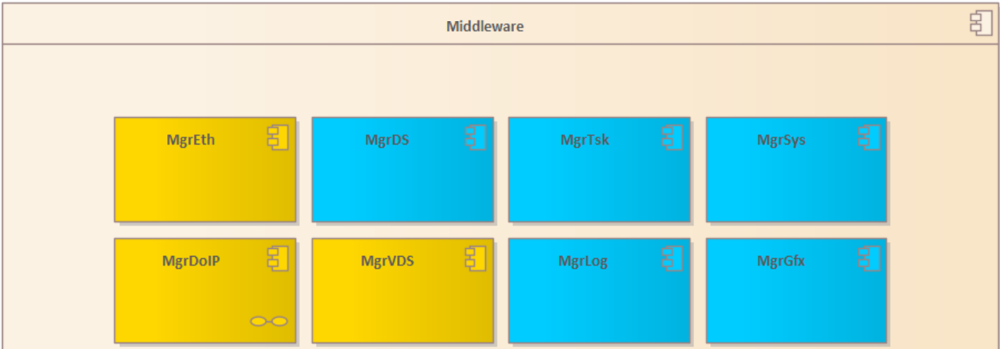
Image reference: slide_03_image_01.png

Image reference: slide_03_image_02.png

Image reference: slide_03_image_03.png

1. Overview - FPK project from Volkswagen(VW)

Image reference: slide_03_image_04.png

Image reference: slide_03_image_05.png

Receives messages from the Head Unit and HMI.
Connects to the Head Unit using Ethernet.
Gets images from a given source.
Edits the images and saves them to the internal storage.

Functional Requirement:

3

## Slide 4

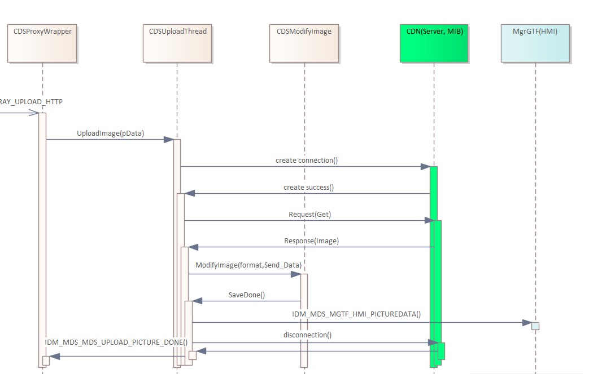
Image reference: slide_04_image_01.png

Image reference: slide_04_image_02.png

Image reference: slide_04_image_03.png

2. Problem Identification

Current Architecture Design Problems

1. A new thread is created for every
image download request

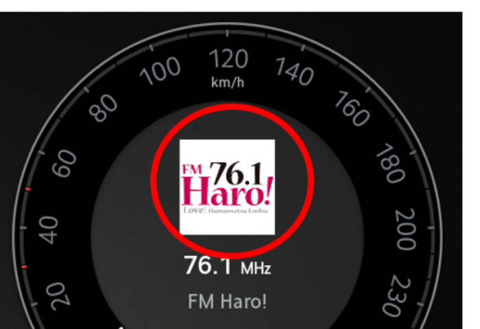
Image reference: slide_04_image_04.png

1

2

3

2. The CDSUploadThread is responsible for handling multiple job

3. Processing may take extra time for images that don’t need editing.

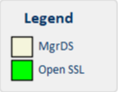
Image reference: slide_04_image_05.png

4

MgrDS

Create new thread

Destroy Thread

## Slide 5

Image reference: slide_05_image_01.png

Image reference: slide_05_image_02.png

2. Problem Identification

Current Architecture Design Problems

### Table
| QA ID | Quality Attribute | Priority | Description |
| QA.01 | Performance | High | Recreating new threads repeatedly leads to low performance, high system resource consumption, thread synchronization issues, and so on. |
| QA.02 | Maintainability | Medium | CDSUploadThread handles multiple tasks, which may make future maintenance challenging. |
| QA.03 | Extensibility | Medium | Because it only focuses on image downloading, it lacks extensibility. |

5

## Slide 6

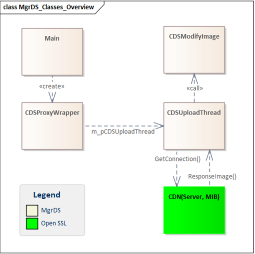
Image reference: slide_06_image_01.png

Image reference: slide_06_image_02.png

Image reference: slide_06_image_03.png

Architecture proposal 1: Create thread pool

3: Architecture Design Proposals

Pros
Improved performance
Easier Multithreading Management
Cons
Complex Implementation

6

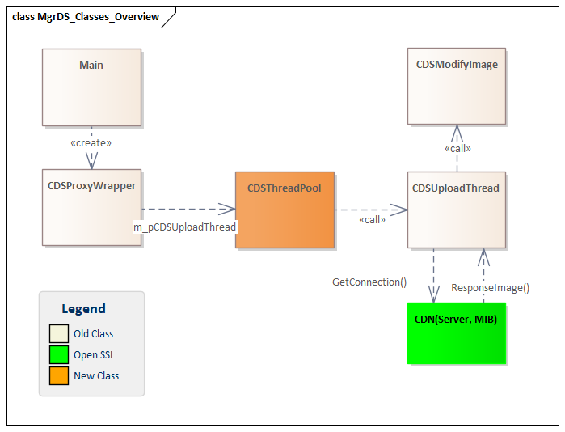
Image reference: slide_06_image_04.png

## Slide 7

Image reference: slide_07_image_01.png

Image reference: slide_07_image_02.png

Architecture proposal 1: Create thread pool

3: Architecture Design Proposals

7

Image reference: slide_07_image_03.png

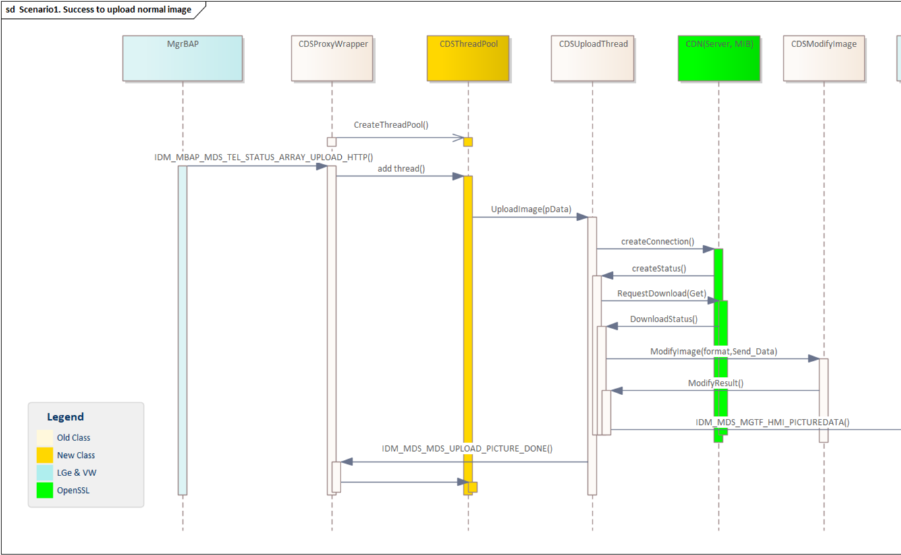
Image reference: slide_07_image_04.png

## Slide 8

Image reference: slide_08_image_01.png

Image reference: slide_08_image_02.png

Architecture proposal 1: Create thread pool

3: Architecture Design Proposals

Current:
Average time ≈ 3.7 seconds

Proposal 1:
Average time ≈ 0.44 seconds

8

Display Incorrect
RC:Thread synchronization issues

Display Incorrect image

## Slide 9

Image reference: slide_09_image_01.png

Image reference: slide_09_image_02.png

Image reference: slide_09_image_03.png

Architecture proposal 2: Architecture and Connection Management

3: Architecture Design Proposals

Pros:
 Optimized Connection Lifecycle
 Seamless Reusability
Better Maintainability
Ease of Extension
Cons:
Complexity

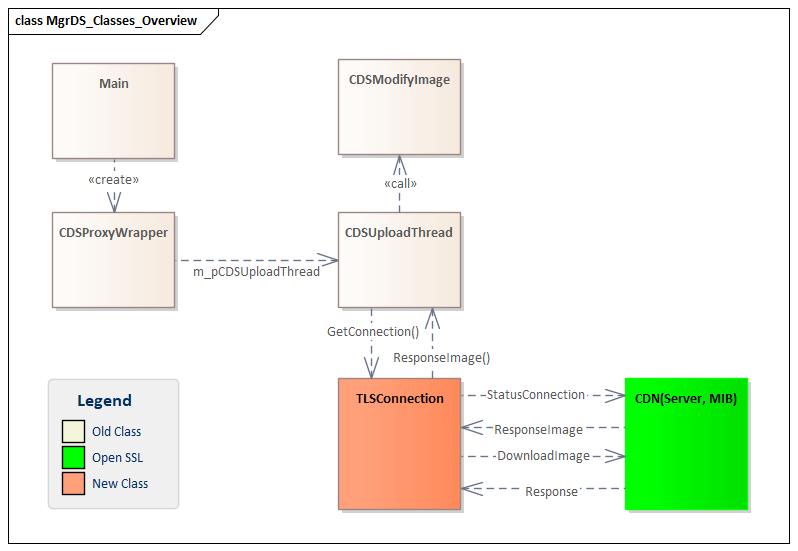
Image reference: slide_09_image_04.png

9

Check modify image if need

Manages download request

Manager connection

MgrDS

Create only a thread

## Slide 10

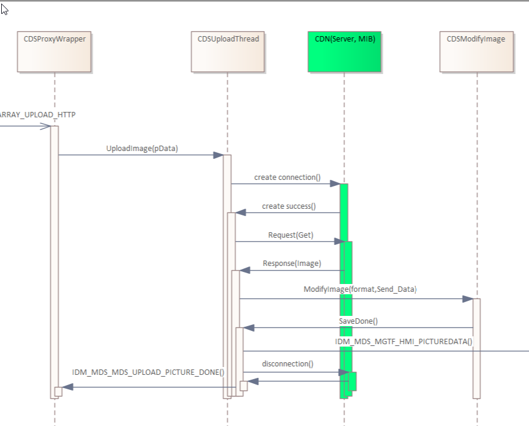
Image reference: slide_10_image_01.png

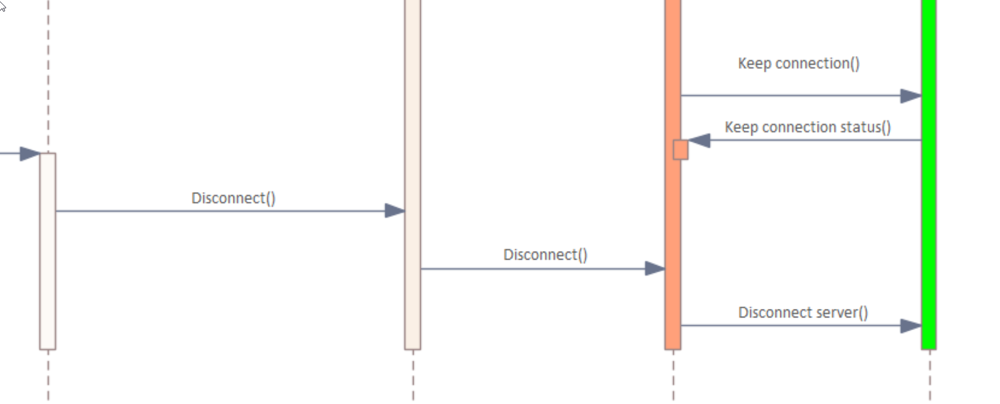
Image reference: slide_10_image_02.png

Image reference: slide_10_image_03.png

Image reference: slide_10_image_04.png

Architecture proposal 2: Architecture and Connection Management

3: Architecture Design Proposals

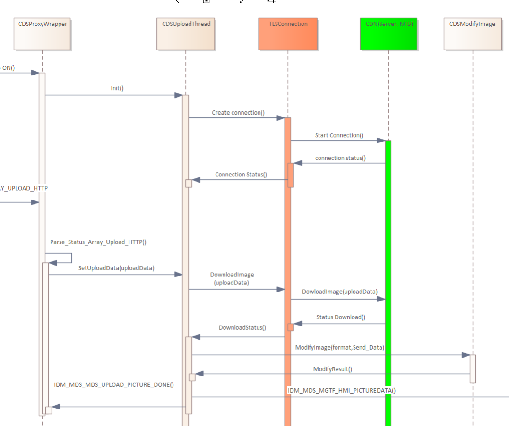
Image reference: slide_10_image_05.png

1

2

3

4

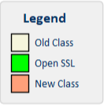
Image reference: slide_10_image_06.png

10

Create connection after boot up

Disconnect after system shutdown

Keep connection

Request download only

## Slide 11

Image reference: slide_11_image_01.png

Image reference: slide_11_image_02.png

Architecture proposal 2: Architecture and Connection Management

3: Architecture Design Proposals

Proposal 1:
Average time ≈ 0.44 seconds

Proposal 2:
Average time ≈ 0.17  seconds

11

## Slide 12

Image reference: slide_12_image_01.png

Image reference: slide_12_image_02.png

4. Architecture Decision

### Table
| Proposal 1:Create thread pool | QA | Proposal 2: Architecture and Connection Management |
| Medium Download fast Optimizing System Resources | Performance | High Download images faster More reliably Avoiding common connection errors. Optimizing System Resources |
| Medium Efficient resource control Limiting the number of threads helps prevent system overload. | Maintainability | High Easy to maintain Independent connection layer Minimized impact of changes |
| Medium Flexible configuration | Extensibility | High Lower average time supports extension to more image types, sizes, or platforms |

So, I decided to go with Proposal 2

12

## Slide 13

Image reference: slide_13_image_01.png

Image reference: slide_13_image_02.png

4. Architecture Decision

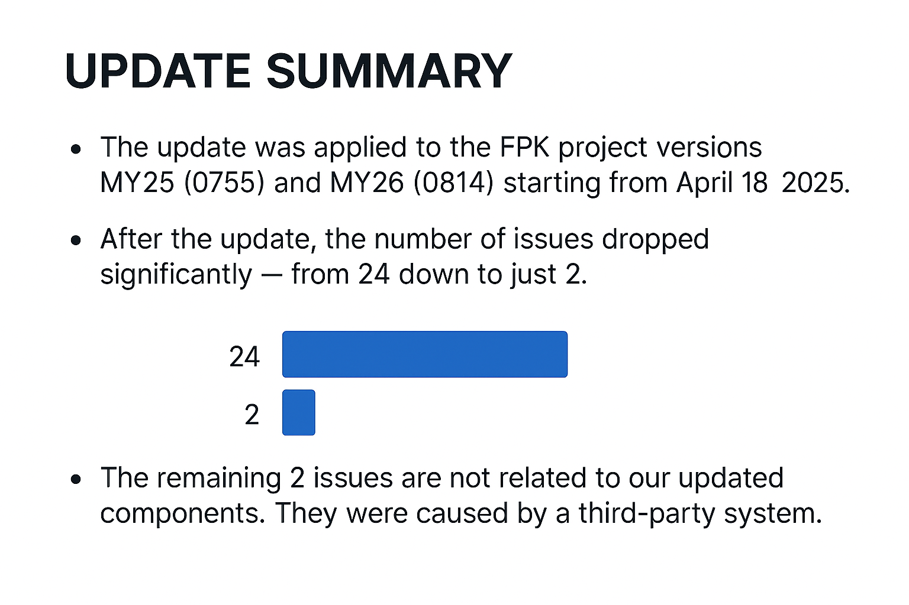
Image reference: slide_13_image_03.png

13

## Slide 14

Image reference: slide_14_image_01.png

Image reference: slide_14_image_02.png

5. Q&A

Q&A
Thank you for listening!

14

## Slide 15

Image reference: slide_15_image_01.png

Image reference: slide_15_image_02.png

Appendix

Boot up sequence:

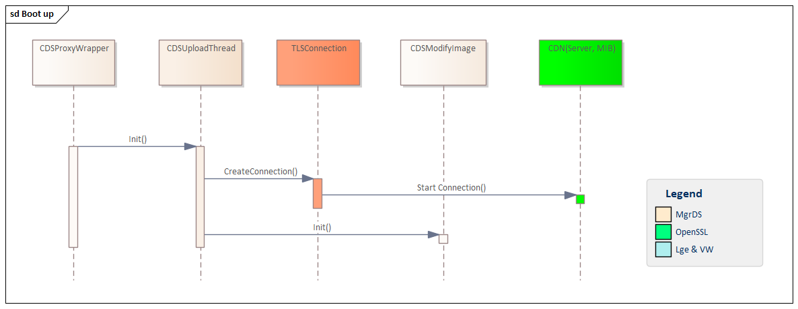
Image reference: slide_15_image_03.png

15

## Slide 16

Image reference: slide_16_image_01.png

Image reference: slide_16_image_02.png

Appendix

CDN Server

Cluster

AVN

MgrBAP

MgrDS

CHANGE_ARRAY

GET_ARRAY(TAID)

STATUS_ARRAY(ip,port,uri)

Connect_socket(ip,port)

SSL_handshake_accepted

accepted

SSL_connect()

SSL_accepted

SSL_do_handshake()

SSL_read(http_data)

SSL_write(http_data)

16

## Slide 17

Image reference: slide_17_image_01.png

Image reference: slide_17_image_02.png

Appendix

Data Response Format

HTTP/1.1 200 OK
Date: Tue, 24 Sep 2024 08:37:58 GMT
Connection: Keep-Alive
Access-Control-Allow-Credentials: true
Access-Control-Allow-Methods: GET,HEAD,PUT,PATCH,POST,DELETE
Access-Control-Allow-Origin: *
Access-Control-Expose-Headers: Location
ETag: 1727167078
Last-Modified: Tue, 24 Sep 2024 08:37:58 GMT
Content-Length: 19628
Content-Type: image/png
�PNG

Header

Body

17

