# Raw Document Content

- Source file: FAProject_Tran_Anh_Kiet[1]/FA_KIPC_Tran_Anh_Kiet_v0.7.docx

FUNTIONAL DESIGN DOCUMENT

KIPC ARCHITECTURE IMPROVEMENT

About this document

Document information

## Table
| Issuing authority | VW Cockpit |
| --- | --- |
| Status of document | In Progress |

Revision history

## Table
| Version | Date | Notes | Author | Approval |
| --- | --- | --- | --- | --- |
| 0.1 | 2024.08.01 | Initial Release | Tran Anh Kiet |  |
| 0.2 | 2024.08.06 | Update analysis of requirements and current design | Tran Anh Kiet |  |
| 0.3 | 2024.08.11 | Update the solutions | Tran Anh Kiet |  |
| 0.4 | 2024.09.09 | Comparison between the solutions Update the architect design | Tran Anh Kiet |  |
| 0.5 | 2024.09.19 | Make some modifications based on the review | Tran Anh Kiet |  |
| 0.6 | 2024.09.25 | Finalize the document | Tran Anh Kiet |  |
| 0.7 | 2024.10.13 | Update 2.4, 2.5, 3: Improve the comparison | Tran Anh Kiet |  |

Figures

Figure 1 PID Number for addressing the Processes	9

Figure 2 KIPC message sending	9

Figure 3 KIPC message receiving	10

Figure 4 Data frame of KIPC message	10

Figure 5 Example 1	11

Figure 6 Example 2	11

Figure 7 Solution 1 concept	14

Figure 8 Register handler	15

Figure 9 Data flow logic	16

Figure 10 Request-response sequence diagram of solution 1	17

Figure 11 Message Encapsulation Concept	18

Figure 12 API-ize the messages	19

Figure 13 Abstract the applications of other processes	19

Figure 14 Solution 2 data flow	20

Figure 15 Request-response diagram of solution 2	21

Figure 16 Class diagram of Message Encapsulation	28

Figure 17 New message format	29

Figure 18 UniqueID for correlating request and response	34

Figure 19 UniqueID generation and recycling mechanism	34

Figure 20 Append data to DataHashTable	35

Figure 21 Message serialize/deserialize progress	36

Figure 22 Data serialize/deserialize concept	36

Figure 23 Variable-size field format	37

Figure 26 Serialize progress	38

Figure 25 Deserialize progress	39

Figure 26 MessageTransceiver communication	39

Figure 27 Stub registers interesting MessageID through KIPCManager	40

Figure 28 Dispatch request mechanism	41

Figure 29 Asynchronous response subscription logic	41

Figure 32 Asynchronous response dispatch logic	42

Figure 31 Synchronous response subscription logic	42

Figure 32 Synchronous response dispatch logic	42

Figure 33 Generic wrapper callback	43

Figure 34 Activity logic of Generic wrapper callback	43

Figure 35 Synchronous communication	44

Figure 36 Asynchronous communication	46

Figure 37 One-way communication	47

Tables

Table 1 Quality attribute requirements	13

Table 2 Scalability scenario 1	23

Table 3 Scalability scenario 2	23

Table 4 Usability comparison	24

Table 5 Maintainability Scenario	24

Table 6 Maintainability of solution comparison	25

Table 7 Comparison of solutions	25

Table 8 Static design class description	29

Table 9 Element of the “processes”:	30

Table 10 Element of the "messages"	30

Table 11 Elements of “fields”	31

Table 12 Elements of "message_pairs"	32

Table 13 Supported data types	33

Table 14 Synchronous communication description table	45

Table 15 Asynchronous communication description table	47

Table 16 One-way communication description table	47

About this project

Purpose

This document specifies the software architecture design for the improvement of K-IPC in VW-ICAS3/MIB3 GP Project

Background

The existing KIPC library is a low-level utility that facilitates the exchange of raw messages between processes. While it provides the fundamental capability to send and receive raw data, it lacks higher-level features that modern applications often require. Developers using this library must handle several complex tasks manually, including:

Handle message parsing and serialization

The current library does not inherently support synchronous or asynchronous communication patterns, requiring developers to implement these mechanisms themselves.

Expectation

Reduce effort to use the KIPC, parse and process KIPC data

Enhance the functionality, improve usability and facilitate easier maintenance of KIPC.

Enhance KIPC source code scalability

Scope

This document covers for the design for a high level KIPC design include below content:

Overview

Architectural Driver (Functional Requirement, Quality Attribute, Constraint)

Architectural Analysis

Architectural Alternatives and Tactics

Architectural Decision

Architecture Diagram.

 Audiences

The target audiences of this document are:

Mr. 황보상규 sangkyu.hwangbo, my mentor in the FA program

Software architects responsible for evaluating the software design

Project overview

Current KIPC design

The current KIPC communication protocol that utilized the Kernel Driver to transfer data between the applications.

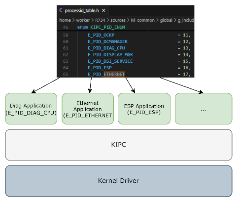
Image reference: doc_image_001.png

Figure 1 PID Number for addressing the Processes

Each application is assigned its own PID Number, which is predefined in a file and serves as the application's address within the KIPC system.

The KIPC interface provides methods for sending and receiving messages but operates at a low data level. To facilitate communication between applications through KIPC, the library offers two key features:

Message Sending: KIPC Library provides an API that allows an application to send a message in byte stream format to a specific PID Number. Data will be forward to Kernel Driver.

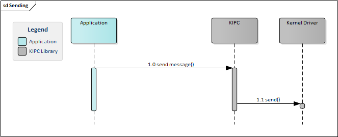
Image reference: doc_image_002.png

Figure 2 KIPC message sending

Message Receiving: The KIPC library provides a mechanism that a user-implemented callback function is invoked whenever an incoming message is received. This callback function handles all incoming messages. In the diagram below, callback function is implemented in KIPCHandler.

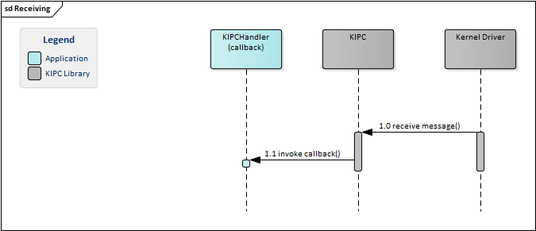
Image reference: doc_image_003.png

Figure 3 KIPC message receiving

The data frame of a KIPC message is described in the picture below. A Message contains 2 parts: header and payload.

Header: contains information about the source, destination address (PID number) and data size of the message

Data: the payload of the message

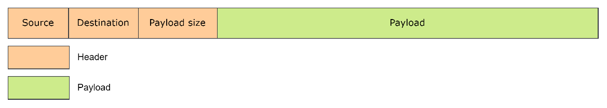
Image reference: doc_image_004.png

Figure 4 Data frame of KIPC message

Problem: in the current KIPC design, there are 2 problems:

KIPC only provides basic message sending and receiving, it does not provide mechanisms for asynchronous or synchronous communication.

The developer must deal with raw data (byte stream) when using KIPC

Problem description

Limited functionality

The existing KIPC is restricted to basic send and receive operations and does not support asynchronous or synchronous communication. As a result, developers must write custom logic for handling synchronous and asynchronous messages. This approach can introduce several issues, as demonstrated in the following example of custom logic.

Example 1:

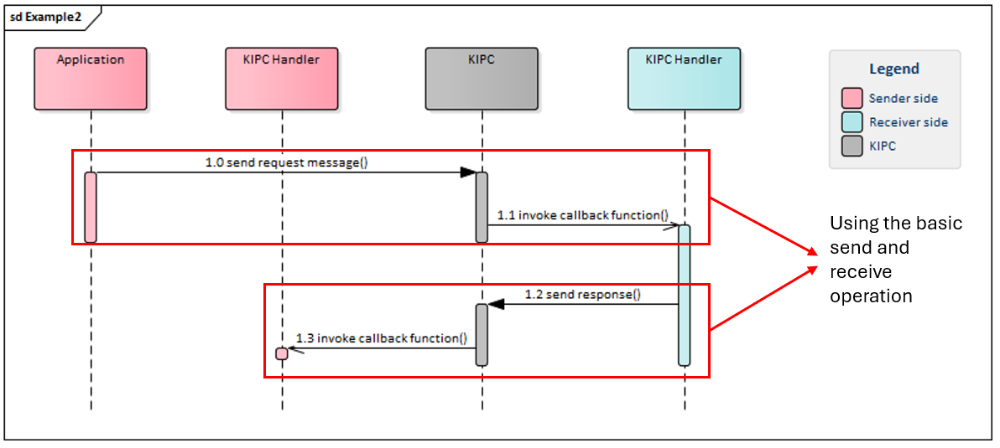
Image reference: doc_image_005.png

Figure 5 Example 1

In this example, developers will use the basic send and receive operations on KIPC to implement asynchronous communication. On the sender side, the application sends a KIPC message. On the receiver side, the KIPCHandler callback function is invoked to process the incoming data and send a response. The response data is then processed by the KIPCHandler on the sender side.

Example 2:

Image reference: doc_image_006.png

Figure 6 Example 2

	In another example, since there is no built-in synchronous mechanism, developers need to use the asynchronous sending method from Example 1 to handle scenarios that typically require synchronous communication.

In a typical synchronous setup, an application sends a request and blocks the current thread until the response is received, and then processes the response to proceed with the next steps.

However, in this case, asynchronous sending is used, and the logic for handling the response is implemented within the callback function of the KIPCHandler. This means that the logic is split between two locations in the source code: one for sending the request and another for handling the response. If the code is not well-organized, this can result in fragmentation, making it harder for others to understand and maintain.

In conclusion, the functionality limitation of KIPC presents significant challenges:

Usability: lack of built-in features for managing communication patterns like asynchronous, synchronous forces developers to implement custom solutions for each message, making it difficult for developers to work efficiently.

Scalability: developers must manually implement custom synchronous and asynchronous logic for each message, which restricts the system's scalability as new messages are introduced.

Maintainability: there is no common logic for handling synchronous and asynchronous communication, using the custom logic mentioned above can cause difficulties to maintain and manage the changes related to the messages.

Clean code problem: custom logic can lead to code fragmentation, resulting in code that is difficult to understand.

Raw Data Management

In the current KIPC design, data sent and received is in byte stream format. This means that the interpretation of these data relies entirely on the developers. In other words, developers must implement the logic to parse the raw data for each individual message. Before creating this parsing logic, the teams responsible for the sender and receiver sides of a message need to collaborate to define a specific message format. These formats are documented in human-readable form only. This can lead to limitations:

Scalability limitation: as the system grows, more messages are added. Handling raw data becomes more challenging because developers need to append new logic to handle the new messages. This will limit the scalability of the software.

Maintainability limitation: manually manage raw data can lead to significant complexity to the codebase. Dealing with this type of raw data presents challenges in maintenance. Developers need to track the documentation of this data before making changes.

Risk of Errors: manual data parsing is prone to human error, which can lead to incorrect data interpretation. Mistakes in parsing logic can cause bugs and inconsistencies. Automated and standardized parsing methods can help avoid these issues by reducing manual errors and improving consistency.

Collaboration issue: each new message requires collaboration among the team to define and document it, which can slow down the development process. Creating and maintaining human-readable documentation (e.g., Word or Excel files) for message formats is time-consuming and inefficient. This approach hampers effective collaboration and can lead to wasted time and effort.

Requirements

Functional requirements

FR#1. The new design should provide the following communication methods

Asynchronous Sending: support sending messages asynchronously, allowing the application to continue processing without waiting for the message to be sent.

Synchronous Sending: support sending messages synchronously, where the application waits for a response or a timeout before continuing.

One-way Sending: sending a request but don’t expect a response.

FR#2. Raw data processing

Due to the issues with raw data management, the mechanism for handling raw data is proposed in the new KIPC design. The new KIPC must be capable to process raw data into structured data at both the sender and receiver. This will be facilitated by sharing a message descriptions between sender and receiver side, allow data to be automatically parsed, serialized, and deserialized. The expected advantages of the raw data processing mechanism are:

Reduce complexity and risk: Developer will no longer need to spend effort to manually develop the data parsing/serializing for each message. That can help to reduce the complexity and risk of the code. That can make the source code cleaner and maintainable

Improved efficiency in collaboration: the shared message description mechanism will save time to make agreement on message format between the PIC of each function or module

Quality attribute requirements

The design should address several key quality attributes. Scalability is the top priority, as the system must be able to handle increasing volumes of messages.

In addition to scalability, the solution must ensure the maintainability of the system itself. Usability is also important and should be prioritized to ensure a user-friendly experience.

While the maintainability of the libraries and utilities provided by the solution is important, it is considered a lower priority compared to other aspects.

## Table
| ID | Description | QA | Priority |
| --- | --- | --- | --- |
| QA#1 | The design should easily support a growing number of messages | Scalability | High |
| QA#2 | The new design must provide easy-to-use methods and facilitate efficient communication with other applications. | Usability | Medium |
| QA#3 | The solution should be designed in a way that ensures the system applying it is easy to maintain. | Maintainability | Medium |
| QA#4 | The solution should provide libraries or utilities that are easy to maintain and debug | Maintainability | Low |

Table 1 Quality attribute requirements

Attention: KIPC is a peer-to-peer communication protocol, meaning no application is playing the role of client or service. However, in this document, the terms Client and Service are sometimes used. Please note that it only describes the roles within a specific context. In such cases, the application sending a request is referred to as the client, while the application receiving the request (and potentially sending a response) is referred to as the service, but only within the context of that particular communication sequence.

Expanding the KIPC Library

Concept

This solution aims to tackle the problems separately. Two new libraries are introduced to provide a stronger method that can effectively troubleshot the issue stated above:

Image reference: doc_image_007.png

Figure 7 Solution 1 concept

MessageProcessing Library: provide APIs to serialize and deserialize data based on a Message Description File. Message Description File contains metadata about the messages such as message ID, format, and type… that help sender can serialize the message and receiver side can correctly deserialize the message.

IPC Library: Manages communication patterns such as asynchronous, synchronous, and one-way messaging, as well as listening for incoming messages. By building on the existing KIPC design, the new IPC Manager provides APIs for sending and receiving messages. Since the IPC Library only handles raw data transmission, encoding and decoding are managed by the MessageProcessing Library. Key features of the IPC Library include:

Sending Messages (Client Side): The IPC Library offers APIs to send raw message data, as defined in the Message Description File, in three communication patterns: asynchronous, synchronous, and one-way.

Registering Callbacks (Service Side): On the service side, applications register handlers (callback functions) for each message defined in the Message Description File. When a message is received from the client, the corresponding handler is automatically invoked.

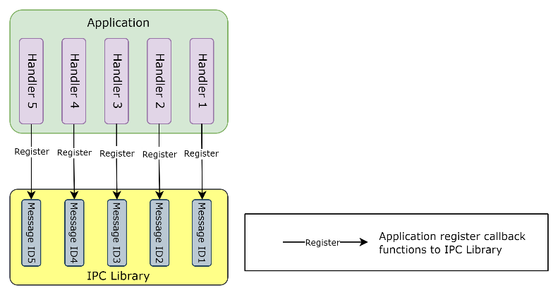
Image reference: doc_image_008.png

Figure 8 Register handler

Quality attributes benefit:

Scalability: this design concept can enhance the scalability of the system by the Message Description File. New messages can be added without altering the core logic of the system, allowing the system to handle more communication patterns or message types as needed

Maintainability: the Message Description File can improve the maintainability of the system by simplifying the process of updating or modifying messages when changes are required.

Usability: usability is improved by providing two new libraries for sending messages, registering handlers, and serialize/deserialize data; and the Message Description File offers a clear structure for message formats. However, a limitation remains as developers need to work with two libraries, requiring coordination of their functionality to achieve the desired result.

Communication Model

The following pictures describes the data flow from sender side to receiver side.

At the sender side, the Application uses the MessageProcessing Library to serialize data before using IPC Library APIs to send a message. At the receiver side IPC Library will receive data transfer this raw data to application, and data can be deserialized by the MessageProcessing Library.

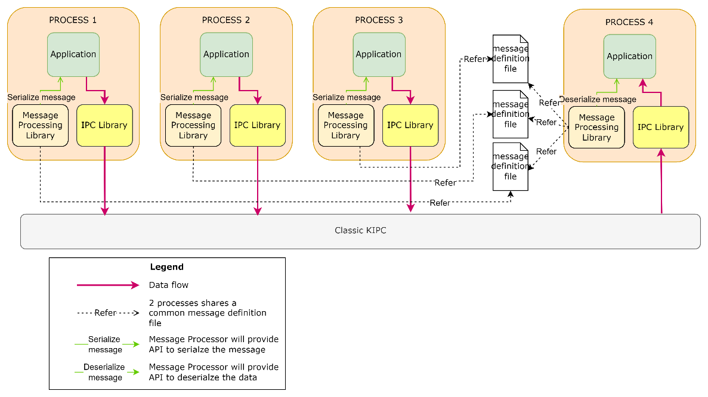
Image reference: doc_image_009.png

Figure 9 Data flow logic

This is how a Request Message moves from the Client to the Service, and a Response Message flows from the Service back to the Client.

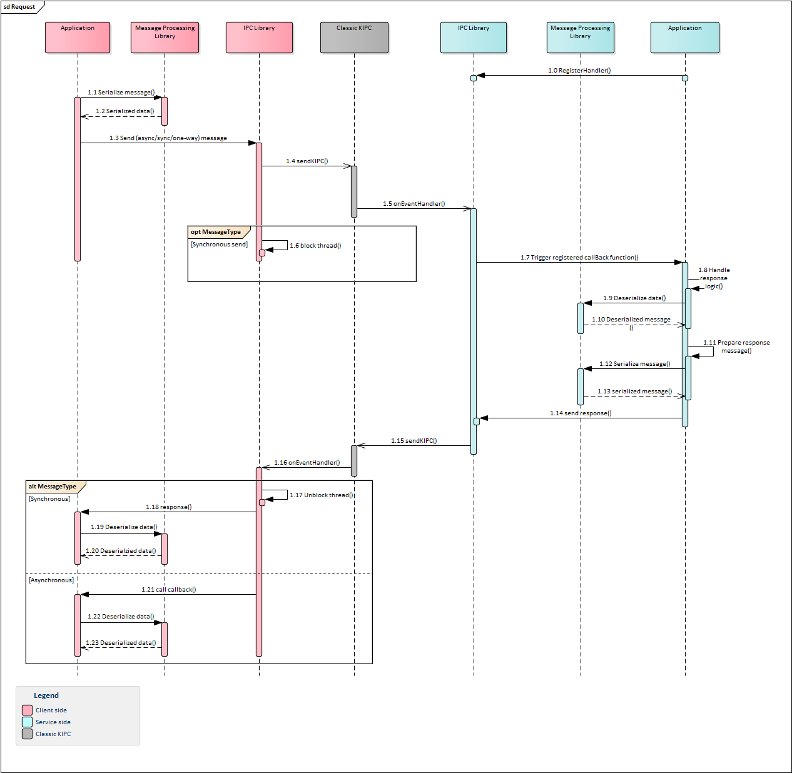
Image reference: doc_image_010.png

Figure 10 Request-response sequence diagram of solution 1

Message Encapsulation

Concept

The core concept of this design is to enhance the functionality of the existing KIPC by introducing the layers that can abstract/wrap all messages interaction. That means instead of directly utilizing the common KIPC API to send and receive messages, developers can use specialized functions that are specifically designed for these tasks.

To realize this idea, we will first need a library that handles basic responsibilities KIPC job like send and receive message, serialize and deserialize message… Then we create an Abstraction Layer that includes the Interfaces designed to utilize core functionality of this library to offer more specific APIs tailored for specific tasks. These Interfaces will be designed for distinct applications, each corresponding to different processes.

Image reference: doc_image_011.png

Figure 11 Message Encapsulation Concept

From the above concept, I would propose the following layers on this design:

Core Library will be able to provide communication between processes, control the communication sequence and handle raw data.

Abstraction Layer, contains the Interfaces, is a solution to API-ize the messages and abstract other Applications

API-ize the messages: developers can transmit and handle messages using Interfaces instead of dealing with obscure message IDs and raw data. To facilitate this, each pair of processes will have access to a shared Message Description File, which contains the metadata about the messages such as message ID, format, and type…

The Message Description File has 2 key purposes:

A reference for serializing and deserializing data before sending and after receiving messages.

An input for generating APIs and message handlers for the interfaces. This ensures that each message ID is reflected to a specific function or handler. For this solution, a tool to generate the Interfaces is required.

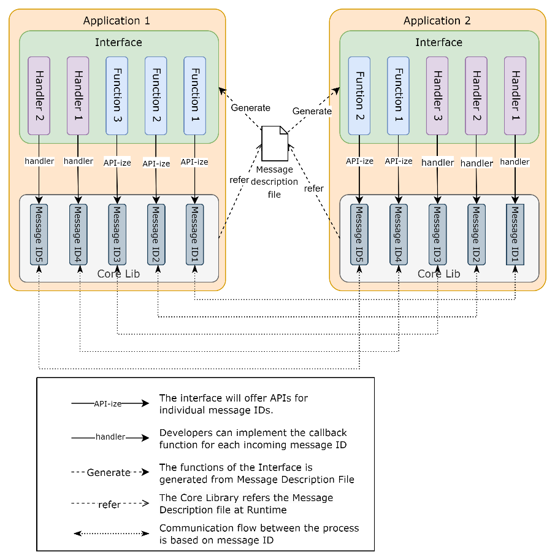
Image reference: doc_image_012.png

Figure 12 API-ize the messages

Abstract the Applications: Each Interface abstracts communication of the Application running on another Process. The Interface groups the API functions/Handlers of the Message IDs relating to that Application to a Class. Developers can interact with this Application by calling the API Functions of this Interface or implement the logic for incoming message within this Interface Handler.

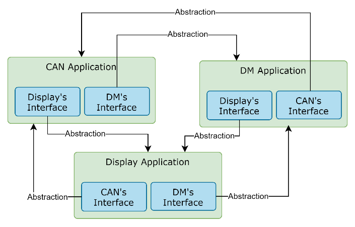
Image reference: doc_image_013.png

Figure 13 Abstract the applications of other processes

Quality attributes benefit:

Scalability: Similar to solution 1, this design concept can enhance scalability of the system by the Message Description File. The design can easily handle a growing number of messages.

Usability: The solution improves usability by wrapping automating complex processes such as serialization/deserialization, message handling into the Interfaces, making it easier for developers to interact with other applications.

Maintainability: This solution provides Message Description File, which simplifies system maintenance by making it easier to update or modify messages when necessary.

Communication model

The following picture describes the data flow of this design. At the sender side, the Application transmits messages to the Core Library thought Interfaces and data being serialized at the Core Library by referring to the Message Description File before sending. At the receiver side, the Core Library must refer to the Message Description File to deserialize the incoming data before forwarding to Interfaces.

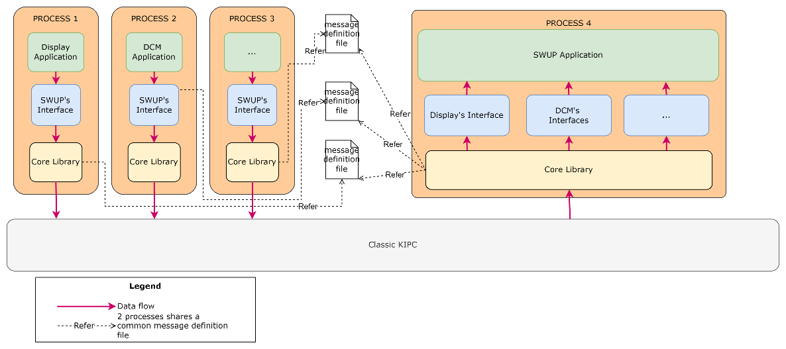
Image reference: doc_image_014.png

Figure 14 Solution 2 data flow

These sequence diagrams will show how a Request Message moves from the Client to the Service, and a Response Message flows from the Service back to the Client.

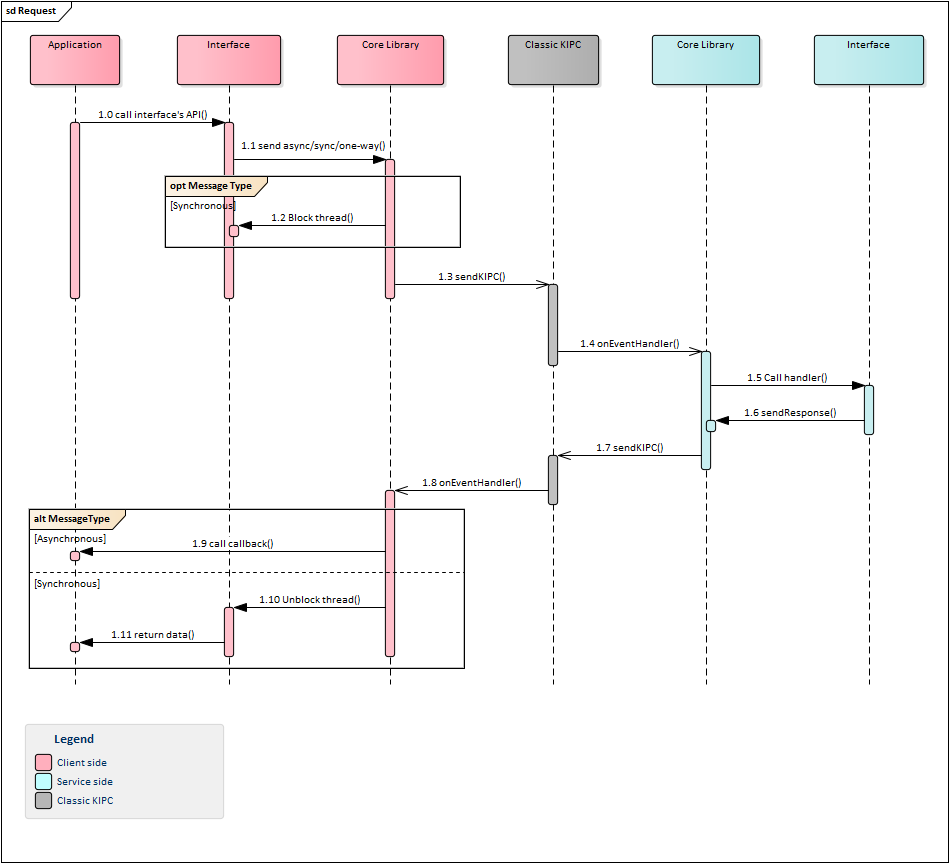
Image reference: doc_image_015.png

Figure 15 Request-response diagram of solution 2

Comparison between the Solutions

Solution 1: Expanding the library

Pros:

Scalability: this solution provides a good method to scale up when system grows and more new messages are added

Maintainability of the system: the system is easier to maintain by providing the Message Description File

Maintainability of the library: each library has a single responsibility, making it easier to maintain individually.

Error Handling: this solution allows the developer to address problems more effectively since they know whether the issue is related to data conversion or message delivery.

Cons:

Usability: The developer will need to manage both libraries independently, which makes it harder to use.

Solution 2: Message Encapsulation

Pros:

Scalability: As the system grows, adding new messages can be more easily by using this solution.

Usability: this simplifies the developer experience by automatically providing the message handler and API to send and handle the messages, reducing the chance of errors and making the system more intuitive.

Maintainability of the system: All code logic related to KIPC is centrally managed by the library, reducing the need for developers to handle these details manually. Additionally, messages are easily maintained with the message description mechanism.

Error Handling: The Core Library can provide centralized error handling for serialization/deserialization and message transmission, leading to more consistent error management. This allows for better control over how errors are propagated through the system

Clean Code: the library manages all related tasks, you can enforce consistent coding practices, ensuring clean and maintainable code.

Cons:

Maintainability of library and tool: since all functionality is concentrated in the Core Library, its design becomes more complex and harder to maintain. Additionally, the code generation tool is also a target for maintenance. However, these challenges can be mitigated if the solution is well-designed and implemented.

Effort to implement the solution: this solution requires more effort and time to design and implement. This is due to the need to develop the Core Library, generating code for Interfaces and designing the interactions between Interfaces and Core Library components. The added complexity of integrating these elements into a unified system increases the overall implementation workload.

Comparison between the solutions

Scalability (QA#1)

Scalability is evaluated based on how the two solutions handle an increasing number of messages. Two scenarios are proposed to assess scalability:

Scenario 1: Adding 1 new message

## Table
| Solution 1: Expanding KIPC Library | Solution 1: Expanding KIPC Library | Solution 1: Expanding KIPC Library | Solution 2: Message Encapsulation | Solution 2: Message Encapsulation | Solution 2: Message Encapsulation |
| --- | --- | --- | --- | --- | --- |
| Steps | Complexity | Estimated Time | Steps | Complexity | Estimated Time |
| 1. Update Message Description File | Medium | 1h | 1. Update Message Description File | Medium | 1h |
| 2. Share Message Description File | Low | 1h | 2. Share Message Description File | Low | 1h |
| 3. Declare a callback function and register this callback to IPC Library | Medium | 1h | 3. Generate interfaces | Low | 1h |

Table 2 Scalability scenario 1

Scenario 2: Adding 10 new messages

## Table
| Solution 1: Expanding KIPC Library | Solution 1: Expanding KIPC Library | Solution 1: Expanding KIPC Library | Solution 2: Message Encapsulation | Solution 2: Message Encapsulation | Solution 2: Message Encapsulation |
| --- | --- | --- | --- | --- | --- |
| Steps | Complexity | Estimated Time | Steps | Complexity | Estimated Time |
| 1. Update Message Description File | Medium | 10h | 1. Update Message Description File | Medium | 10h |
| 2. Share Message Description File | Low | 1h | 2. Share Message Description File | Low | 1h |
| 3. Declare a callback function and register this callback to IPC Library | Medium | 10h | 3. Generate interfaces | Low | 1h |

Table 3 Scalability scenario 2

Solution 2 offers better scalability due to its lower complexity and quicker adaptation when adding new messages, especially when there are many new messages are need at the same time.

Usability (QA#2)

## Table
| Aspect | Solution1: Expanding KIPC Library | Solution 2: Message Encapsulation |
| --- | --- | --- |
| Ease of Use | Low: Requires manual handling of message processing, working with multiple libraries. | High: Provides intuitive, high-level APIs, abstracting much of the complexity. |
| Simplicity of Setup | Medium: Higher complexity due to manual serialization, deserialization, and handler registration. | High: Setup is simpler with interfaces code generation |

Table 4 Usability comparison

Solution 2 offers better usability due to its automation and simplicity, making the process more streamlined for developers.

Maintainability of system (QA#3)

Maintainability is evaluated based on how well each solution can support changes to message formats, including changes to parameter types or structures. This scenario is proposed to evaluate the Maintainability of the solutions

Scenario: Modify message format

## Table
| Solution 1: Expanding KIPC Library | Solution 1: Expanding KIPC Library | Solution 1: Expanding KIPC Library | Solution 2: Message Encapsulation | Solution 2: Message Encapsulation | Solution 2: Message Encapsulation |
| --- | --- | --- | --- | --- | --- |
| Steps | Complexity | Estimated Time | Steps | Complexity | Estimated Time |
| 1. Update Message Description File | Medium | 1h | 1. Update Message Description File | Medium | 1h |
| 2. Share Message Description File | Low | 1h | 2. Share Message Description File | Low | 1h |
|  |  |  | 3. Generate interfaces | Low | 1h |

Table 5 Maintainability Scenario

Solution 1 requires fewer steps to maintain messages

Maintainability of solution (QA#4)

Below table evaluate the complexity of each target (Simpler means easier to maintain)

## Table
| Solution 1: Expanding KIPC Library | Solution 1: Expanding KIPC Library | Solution 2: Message Encapsulation | Solution 2: Message Encapsulation |
| --- | --- | --- | --- |
| Target | Complexity | Target | Complexity |
| Core Library | Very High | Message Processing Library | Medium |
| Generation Tool | Medium | IPC Library | Medium |

Table 6 Maintainability of solution comparison

Solution 1 is simpler and easier to maintain

Conclusion

## Table
| Aspect | Attributes | Expanding the KIPC Library | Message Encapsulation |
| --- | --- | --- | --- |
| Quality attribute aspects | Scalability (QA#1) | Medium: More time needed to add new messages. | High: Easier to scale with automated interfaces generation |
| Quality attribute aspects | Usability (QA#2) | Medium: Requires working with multiple libraries and manual message handling. | High: Provides intuitive APIs, automates serialization/deserialization and handler registration. |
| Quality attribute aspects | Maintainability (QA#3) | High: More manual work, don’t need much effort on message changes | Medium: Message changes require re-generating interfaces. |
| Quality attribute aspects | Maintainability (QA#4) | High: The IPC Library and MessageProcessing Library are separate, which reduces the effort required to maintain each individually. | Medium: Core library and generation tool need regular updates but manageable. |
| Other aspects | Error Handling | Medium: separate error handling for serialization and transmission | High: better since unified, consistent error handling in by one library |
| Other aspects | Clean Code | N/A Depending on the design | High |
| Other aspects | Effort to implement the solution | Medium: need less effort to implement | High: need more effort to implement |

Table 7 Comparison of solutions

Conclusion

In terms of Maintainability (QA#3 and QA#4), Solution 1 is better. While Solution 1 is easier to approach, design, and implement, it has limitations in Usability (QA#2) and Scalability (QA#1), which is the most important quality attribute.

On the other hand, Solution 2 overcomes most of the disadvantages of Solution 1 but requires more effort to implement and maintain. Given the substantial advantages of Solution 2 and the fact that its disadvantages are manageable, I decide to choose Solution 2.

Architecture Design

Static design

The design concept is structured as follows: the Core Library handles common KIPC communication as well as data serialization and deserialization, while the Interfaces offer specific APIs tailored to individual messages.

Considering the functionality of Core Library, the proposed components are:

KIPCManager, MessageDispatcher, and UniqueIDManager: These manage the communication sequences within KIPC.

MessageProcessor: These handle the parsing, serialization, and deserialization of messages.

MetaReader: Read the message description file

MessageTransceiver: This component oversees basic KIPC communication and coordinates the activities of the other components.

The Interfaces provide specific APIs and handlers for individual messages. For this layer, I would propose:

Stubs wrap all the handlers

Proxies wrap all the APIs

Each Stub and Proxy is integrated into an Interface of a particular application.

Class diagram

Image reference: doc_image_016.png

Figure 16 Class diagram of Message Encapsulation

## Table
| Class | Description |
| --- | --- |
| KIPCManager | The main interface for KIPC operations, handling message sending, receiving and managing the communication with other components like the MessageDispatcher and MessageTransceiver. |
| MessageDispatcher | Manages the dispatching logic of. It ensures that responses are delivered to the correct subscriber |
| UniqueIDManager | Responsible for generating and recycling unique IDs for identifying messages, which helps in correlating requests with responses. |
| MessageProcessor | Responsible for parsing the important information from the message, serializing and deserializing messages based on message format read from MetaReader. This component ensures that messages are converted into the correct format for transmission or reception. |
| MetaReader | Reads message information (source, destination, format…) and provide this information for MessageProcessor |
| MessageTransceiver | Handles the transmission of messages, managing the message queue and sending/receiving logic. It works closely with the message processor and dispatcher. |
| MessageInfo | Represents the structure of a message being sent or received, holding the data before serialized, UniqueID, MessageID |
| MessageQueue | Messages after being serialized will be stored in MessageQueue |
| Frame | The Frame is the class that is used for communication with the old KIPC Library by using the methods of this class |
| Stubs | Contains the handler function for all the requests from the Proxies |
| Proxies | Creates and exposes a set of APIs that allow applications to send a request to another process. These APIs typically correspond to the request messages defined in the message description file |
| Interfaces | The Interfaces class acts as a wrapper that inherits from both Stub and Proxy. It serves two key purposes: - By inheriting from Proxy, the Interfaces class provides methods for an application to communicate with other applications seamlessly. - By overriding the callback handler methods of Stub, developers can easily implement callback handler logic. When new messages are defined, the Stub needs to be regenerated. If handler logic were implemented directly within the Stub, developers would need to merge old and new code every time it’s regenerated, which can be time-consuming and error-prone. With the Interfaces class, no matter how many times the Stub is regenerated, developers only need to override the necessary methods to implement the handler logic |

Table 8 Static design class description

Message design

The current Message Frame has been stated in 2.1. Current KIPC Design. Because with the new design, the Message Frame must be re-designed based on the old Message Frame. Below is the proposed Message Frame Design

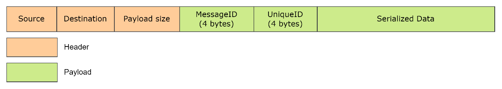
Image reference: doc_image_017.png

Figure 17 New message format

Header is the stable part and belongs to old KIPC since the new design is based on the old design. The payload will be re-structured to 3 parts:

MessageID: 4 bytes length, the ID of the message

UniqueID: 4 bytes length the number that is generated by UniqueIDManager. This number will help to correlate requests with responses.

Serialized Data: Contains the serialized data

Message Description File

The Message Description File is a file that defines the information of the Processes and the structure and attributes of messages used in the system. The file contains key information about the messages as well as the communication sequences. This file is used in 2 purposes:

Provides details that are read by the MetaReader to guide the MessageProcessor on how to properly serialize and deserialize messages

Using for generating code of Stub and Proxy

From the above requirements, I would like to propose the JSON format for the Message Description File in the example file (double click to see the file)

This file contains three sections:

“process”: Provides details about the two processes involved in the communication described in this file.

“messages”: Contains information about the individual messages.

“message_pairs”: Describes the pairing of request and response messages.

## Table
| Key | Description | Remark |
| --- | --- | --- |
| name | The name of the process, used to identify it in the system. | See explanation of PID number in 2.1. Current KIPC Design |
| id | A unique numerical identifier for the process. | See explanation of PID number in 2.1. Current KIPC Design |
| stub_name | The name of the Stub class associated with this process, which handles the server-side implementation for receiving and processing messages. | This value is used for naming the Stub Class in the generated code file |
| proxy_name | The name of the Proxy class associated with this process, which allows the process to send messages or make requests to other processes. | This value is used for naming the Proxy Class in the generated code file |

Table 9 Element of the “processes”:

## Table
| Key | Description | Remark |
| --- | --- | --- |
| messageID | The hex number represent the ID of the message |  |
| name | Name of the message | For reminder purposes only |
| source | The PID name of source of this message | See explanation of PID number in 2.1. Current KIPC Design |
| destination | The PID name of destination of this message | See explanation of PID number in 2.1. Current KIPC Design |
| fields | Message format. Defines the structure of the payload, contains details like name, type, length… | Refer Table 6 Elements of message format for explanation of the message format |

Table 10 Element of the "messages"

This table explain the keys of format of message

## Table
| Key | Description | Remarks |
| --- | --- | --- |
| name | The name of the field in the message. | This value is used for naming the parameters of Stub Handlers and Proxy Functions |
| type | The data type of the field. | Table 7 Supported data types |
| max_length | The max number of elements of the field | Optional. Only use for string, hex_array, array |
| element_type | For arrays, specifies the type of elements in the array. | Optional. Only use for array |
| element_max_length | For arrays, defines the maximum length of each element. | Optional. Only use for array of string, array of hex array |

Table 11 Elements of “fields”

## Table
| Key | Description | Remarks |
| --- | --- | --- |
| type | This field specifies whether the message is synchronous, asynchronous or one-way sending, defining how the response is handled. | There are 3 possible values: “sync”, “async”, “oneway” |
| request_message_id | message id of request | Predefined in “messages” section |
| response_message_id | message id of response | Predefined in “messages” section |
| caller | The name of the Proxy function that initiates the request. | This value is used for generating the Proxy |
| handler | The name of or callback that will handle the request message | This value is used for generating the Stub |
| requestor | The PID name of the KIPC application that sends the message. This is defined in “processes” (above table) | See explanation of PID number in 2.1. Current KIPC Design |
| responsor | The PID number of the KIPC application that is expected to respond to the message. This is defined in “processes” (above table) | See explanation of PID number in 2.1. Current KIPC Design |
| timeout | The timeout of waiting for the response message | Millisecond (0 mean no timeout) Only apply for synchronous |

Table 12 Elements of "message_pairs"

Supported data type in this design

## Table
| Group | type | data type provided by library |
| --- | --- | --- |
| Fixed-size data type | int8 uint8 int16 uint16 int32 uint32 int64 uint64 | signed char unsigned char signed short unsigned short int unsigned int long long int unsigned long long int |
| Array of fixed-size data type | array of int8 array of uint8 array of int16 array of uint16 array of int32 array of uint32 array of int64 array of uint64 string hex_array | std::vector<signed char> std::vector<unsigned char> std::vector<signed short> std::vector<unsigned short> std::vector<int> std::vector<unsigned int> std::vector<long long int> std::vector<unsigned long long int> std::string std::vector<char> |
| Array of array | array of string array of hex_array | std::vector<std::string> std::vector<std::array<char, N>> (N is array size) |

Table 13 Supported data types

Code generation

The Stub and Proxy are generated based on the message definitions provided in the Message Description File. Python, with its flexibility and powerful text-processing capabilities, is an excellent choice for building this tool.

Dynamic design

UniqueIDManager

In cases where the application sends multiple requests with the same MessageID simultaneously, it becomes challenging to distinguish which response belongs to which request. The UniqueID was introduced to solve this issue.

A UniqueID is a unique 4-byte number assigned to each message, allowing the system to correlate requests with their respective responses. On the client side, when a request is sent, a UniqueID is generated and attached to the request message. On the service side, the UniqueID from the request is included in the response message before it is sent back to the client. This ensures that the client can accurately match the response to the original request using the UniqueID.

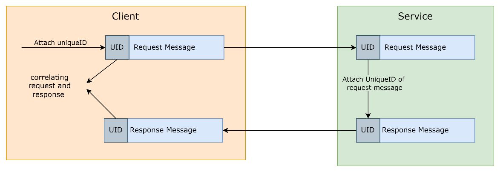
Image reference: doc_image_018.png

Figure 18 UniqueID for correlating request and response

But as the system grows, more and more messages are newly defined.  Assigning a new UniqueID to each message is impossible, because we can’t evaluate how many UniqueIDs are needed and how many bytes are required to store the UniqueID in each message.

To deal with this problem, a mechanism for generating and recycling UniqueIDs is essential. The UniqueIDManager is the component responsible for managing the generation and recycling of UniqueIDs efficiently.

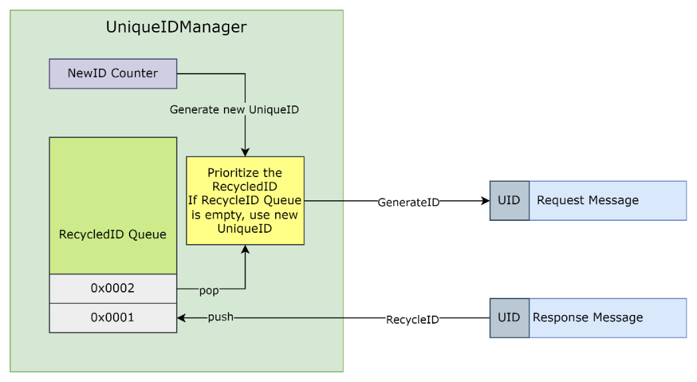
Image reference: doc_image_019.png

Figure 19 UniqueID generation and recycling mechanism

The UniqueIDManager contains:

RecycledIDQueue: queue of available IDs that can be reused.

NewIDCounter: a 4-byte simple counter that increments to generate new UniqueIDs if no UniqueIDs are available in the RecycledID Queue. NewIDCounter is initialized with the value 0x0000.

The mechanism of generating and recycling the UniqueIDs is described below:

Generating UniqueID:

The UniqueIDManager first checks if there are any UniqueIDs available in the RecycledIDQueue. If so, a UniqueID is reused and removed from this queue

If the RecycledID Queue is empty, a new ID is generated using the NewIDCounter. Then the NewIDCounter is increased by one.

Recycling UniqueID:

When a UniqueID is no longer needed (receive Response Message) the UniqueIDManager adds it to the RecycledIDQueue.

Data Storage (MessageInfo class)

MessageInfo class is responsible for storing data of a message before serialization (on the sender side) and after deserialization (on the receiver side). This includes details like the UniqueID, MessageID, and Parsed Data. Since the system can define multiple messages with different formats, and the Core Library can only determine the message format by reading the Message Description File at runtime, the Message class must be designed commonly to handle various data structures.

The DataHashTable is a hash table where the key is a string representing the field name, and the value is the corresponding field's data. The data in the DataHashTable isn’t serialized data and has specific formats such as unsigned integer or std::vector… (as mentioned in Table 8). The Stub, Proxy, and MessageProcessor components interact with the DataHashTable to read from and write to it.

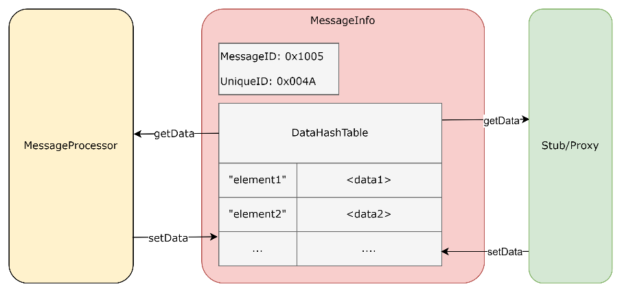
Image reference: doc_image_020.png

Figure 20 Append data to DataHashTable

Data Serialize/Deserialize

The MessageProcessor is responsible for converting structured data into a byte stream for transmission (serialization) and converting the byte stream back into structured data upon reception (deserialization).

To perform serialization and deserialization, the MessageProcessor requires the message format, which is predefined in the Message Description File. The MetaReader module reads this information from the Message Description File, providing the details for the MessageProcessor to process the data.

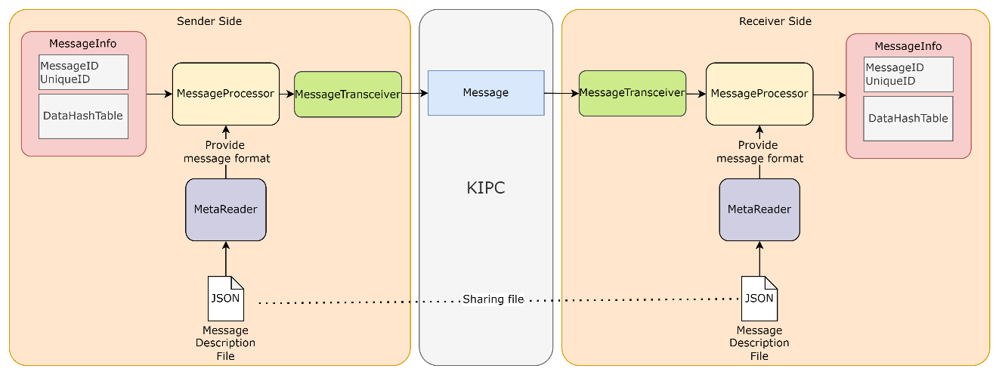
Image reference: doc_image_021.png

Figure 21 Message serialize/deserialize progress

Data serialize concept in introduced in below picture.

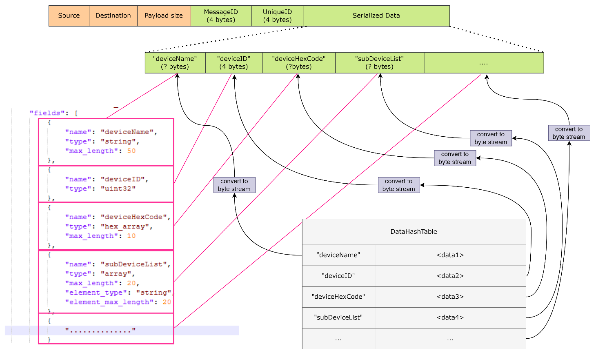
Image reference: doc_image_022.png

Figure 22 Data serialize/deserialize concept

Since the data in the DataHashTable isn't serialized and follows specific formats, it must be serialized first. The conversion of data in the DataHashTable to a byte stream is performed for each data type group as follows (refer to Table 7 for the list of supported data types and their corresponding groups)

Fixed-size element: is converted directly into a byte stream by copying the exact number of bytes representing the data. For example, int32 will always take 4 bytes in the byte stream.

Array of fixed-size element: converting each fixed-size element into a byte stream. The total byte stream is the sum of the bytes from each element

Array of array: The maximum length of each element is specified in the Message Description File. Each element is padded or adjusted to its maximum length before being converted into a byte stream. The total byte stream is the sum of the bytes for each element.

Serialized data consists of fields that correspond to the message format defined in the Message Description File. The order of fields in the serialized data follows the same order as in the message format. The fields in serialized data can be divided into two types:

Fixed-size fields: fields of which data type is a fixed-size variable (int32, uint32, int8, uint8…). The length of these fields can be easily determined from the message format. In the example, the field "deviceID" is a fixed-size field.

Variable-size fields (fields of array type): the field of which data type is not fixed (array, hex_array, string). Although the max_length parameter can specify the maximum possible size of these fields, this would unnecessarily waste message space due to the 1 KB limitation for each message on the KIPC. For such fields, the serialized data includes two parts:

Field length: 4 bytes, representing the length of the field (excluding the 4 bytes used for the field length itself).

Field data: the actual data of the field

Image reference: doc_image_023.png

Figure 23 Variable-size field format

During serialization, the MessageProcessor will first convert data in the DataHashTable to byte stream, then copy to the corresponding field on the message. For variable-size fields, the MessageProcessor also writes the field's length along with its value.

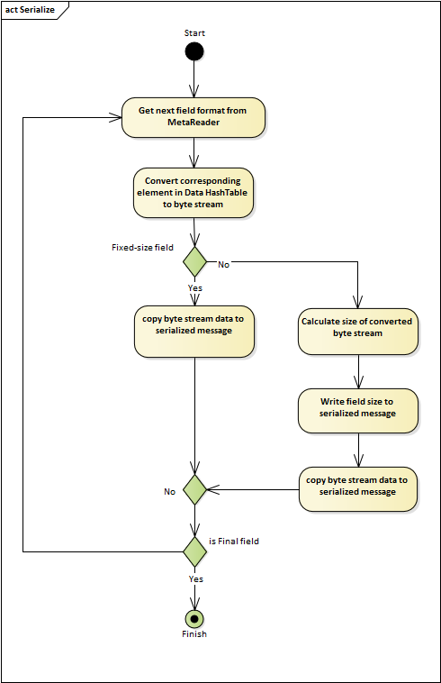
Image reference: doc_image_024.png

Figure 26 Serialize progress

Deserialization is the reverse process of serialization. The MessageProcessor parses the serialized data according to the message format, converts the byte stream into specific data types, and then populates the DataHashTable with the corresponding field data.

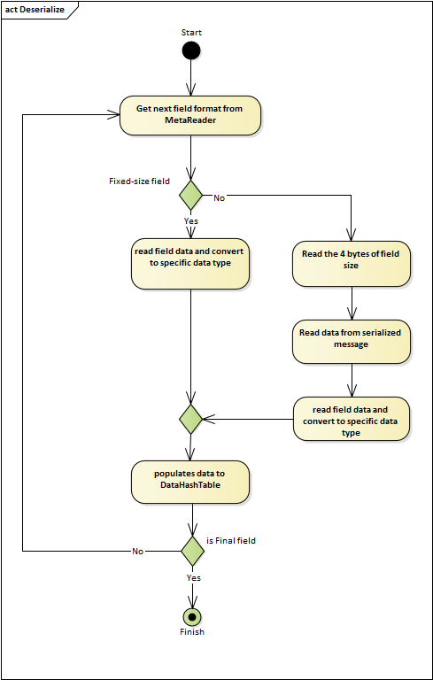
Image reference: doc_image_025.png

Figure 25 Deserialize progress

Communication between MessageTransceiver and KIPCManager, MessageDispatcher

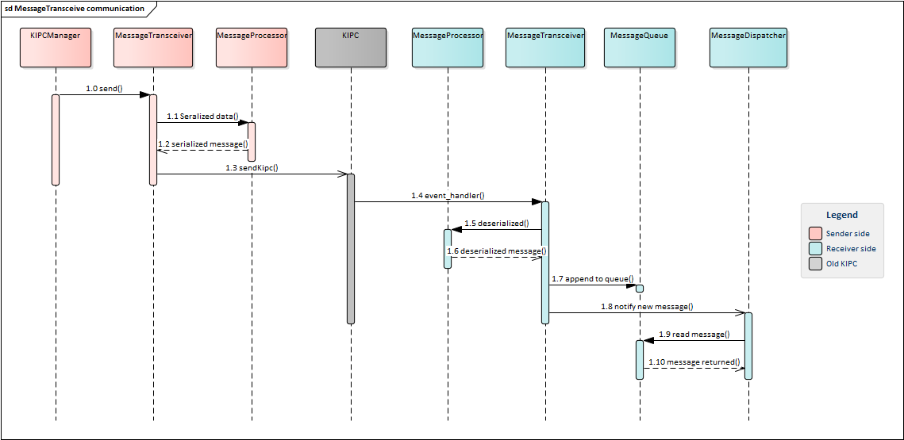
Image reference: doc_image_026.png

Figure 26 MessageTransceiver communication

The above diagram describes the communication between MessageTransceiver and MessageProcessor, MessageDispatcher, KIPCManager when sending and receiving a message:

Sending a message: The KIPCManager sends a message to the MessageTransceiver, which is then serialized by the MessageProcessor before being transmitted to the receiving side.

Receiving a message: when receiving a message, data will be deserialized at MessageProcessor and be appended to MessageQueue. MessageTransceiver will then notify MessageDispatcher of the new message via a condition variable mechanism. MessageDispatcher, running on another thread, waits for this notification and once alerted, retrieves the message from MessageQueue for further processing. This flow ensures that the deserialized message is properly queued and efficiently handled by the MessageDispatcher.

Message subscription and dispatching design of MessageDispatcher

The MessageDispatcher is responsible for routing incoming messages to their appropriate handlers. It handles three main scenarios:

Dispatch request messages: This includes processing asynchronous, synchronous, and one-way request messages received from the client by the service side.

Dispatch asynchronous response messages: This occurs when the client receives an asynchronous response to a request it has sent.

Dispatch synchronous response messages: This involves the client receiving a synchronous response to a request it has sent.

Dispatch request message

Dispatch Table: is a hash table where the key is the MessageID and the value is the corresponding callback function (RequestDispatchMap).

Subscribe: to dispatch this kind of messages, Stub first needs to register its interested MessageID through the KIPCManager and provides the associated callback function. KIPC will forward this information to MessageDispatcher and add to RequestDispatchMap.

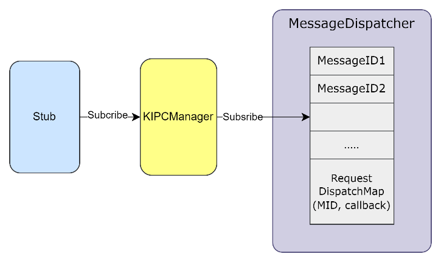
Image reference: doc_image_027.png

Figure 27 Stub registers interesting MessageID through KIPCManager

Dispatch: when a request with a matching MessageID is received, the MessageDispatcher invokes the appropriate callback function to process the message.

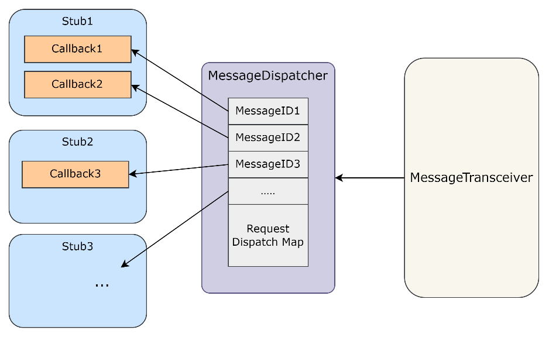
Image reference: doc_image_028.png

Figure 28 Dispatch request mechanism

Dispatch asynchronous response message

The message dispatching mechanism in this scenario is similar to Section 5.2.4.1:

Dispatch Table: a hash table where the key is the UniqueID and the value is a callback function (AsyncResponseDispatchMap). Response messages are dispatched based on this UniqueID.

Subscribe: when using a Proxy to send an asynchronous message, the developer must provide a callback function to handle the response. The KIPCManager registers this callback with the MessageDispatcher. The MessageDispatcher generates a UniqueID, associates the callback with the UniqueID in the Dispatch Table, and returns the UniqueID to the KIPCManager, which then attaches it to the request message.

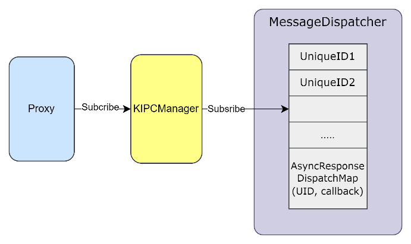
Image reference: doc_image_029.png

Figure 29 Asynchronous response subscription logic

Dispatch: when a response of asynchronous request with a matching UniqueID is received, the MessageDispatcher invokes the appropriate callback function to process the message.

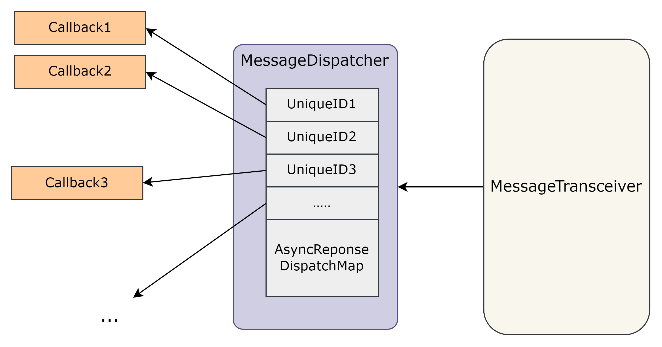
Image reference: doc_image_030.png

Figure 32 Asynchronous response dispatch logic

Unsubscribe: after receiving a response message that UniqueID must be removed.

Dispatch synchronous response message

Dispatch Table: a hash table called SyncResponseDispatchMap, where the key is the UniqueID, the value consists of a condition variable and the message data. The condition variable is used to notify the thread waiting for a synchronous response to continue

Subscribe: after sending a message, the KIPCManager subscribes to the UniqueID, provides the condition variable, which is used to block the thread while it waits for response.

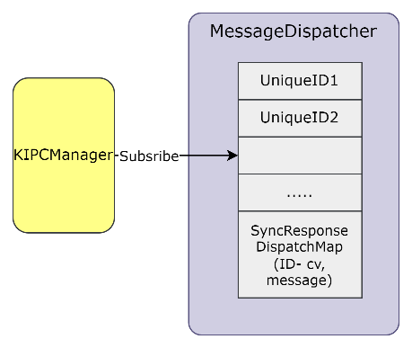
Image reference: doc_image_031.png

Figure 31 Synchronous response subscription logic

Dispatch: After receiving the response message with the corresponding UniqueID, the condition variable notifies the waiting thread in KIPCManager. The KIPCManager can then read the received data from the Dispatch Table.

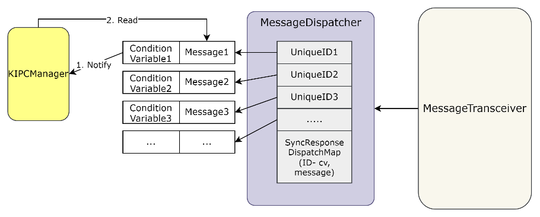
Image reference: doc_image_032.png

Figure 32 Synchronous response dispatch logic

Timeout: The condition variable is automatically notified after a specified period of time (defined in the Message Description File). If no response is received within this time, an exception is thrown.

Unsubscribe: Since each UniqueID is used only once per message, after receiving a response message or encountering a timeout while waiting for a response, that UniqueID must be unsubscribed and removed from the hash table.

Generic wrapper callback

The Core Library is the stable part of this design, while the Interfaces are generated by tools. The problem can be seen here is that the Callback functions have varying function-signature with an undefined number of parameters and data types. This creates a problem for ensuring that the KIPCManager, and MessageDispatcher can handle these unidentified callback function-signature. To resolve this, a Generic Wrapper Callback mechanism is introduced:

Generic wrapper callbacks are the functions of the Stub/Proxy and share a consistent function-signature.

For every real callback function, there is a corresponding Generic wrapper callback. These functions are generated by code generation process along with Stub and Proxy.

When registering a callback to the MessageDispatcher, the Generic wrapper callback is provided instead of the real callback. The dispatching logic works by invoking the Generic wrapper callback, which then calls the actual callback function.

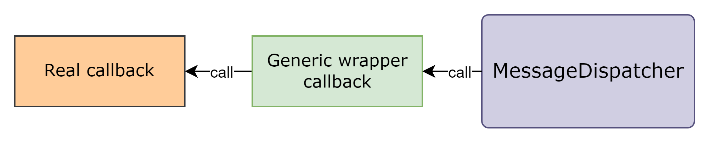
Image reference: doc_image_033.png

Figure 33 Generic wrapper callback

General logic of Generic wrapper callback:

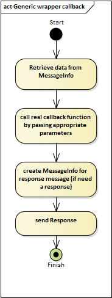
Image reference: doc_image_034.png

Figure 34 Activity logic of Generic wrapper callback

Based on this structure, the function-signature for the Generic wrapper callback is as follows.

void (MessageInfo);

All the callback dispatching logic mentioned in sections 5.2.5.1 and 5.2.5.2 is handled by Generic wrapper callback

Communication sequences

Message Registration

The KIPCManager collaborates with the MessageDispatcher to route incoming request message messages to the correct handler. To do that the KIPCManager allows Stub to register their interest in specific MessageID to MessageDispatcher (section 5.2.5.1).

Synchronous communication

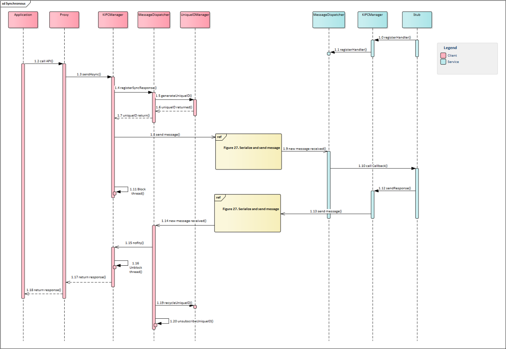
Image reference: doc_image_035.png

Figure 35 Synchronous communication

## Table
| Step | Description | Refer section |
| --- | --- | --- |
| 1.0 1.1 | Stub registers callback function for handling the request message to KIPCManager KIPCManager register callback to MessageDispatcher | 5.2.5.1. Dispatch request message |
| 1.2 1.3 | Application calls a Proxy’s API Proxy prepares data (create new MessageInfo instance) and calls KIPCManager to send message | 5.2.1. Data Storage (MessageInfo class) |
| 1.4 | Subscribe synchronous response and provide condition variable | 5.2.5.3. Dispatch asynchronous response message |
| 1.5 1.6 1.7 | A UniqueID is generated Return a UniqueID to MessageDispatcher Return a UniqueID to KIPCManager | 5.2.1. UniqueIDManager |
| 1.8 1.9 | Message is serialized and sent Message is received, deserialized and forward to MessageDispatcher | 5.2.1. Data Serialize/Deserialize 5.2.4. Communication between MessageTransceiver and KIPCManager, MessageDispatcher |
| 1.10 | Block current thread on Client side |  |
| 1.11 1.12 | Call the callback function for handling the request message Send the response | 5.2.5.1. Dispatch request message 5.2.5.4. Generic wrapper callback |
| 1.13 1.14 | Message is serialized and sent Message is received, deserialized and forward to MessageDispatcher | 5.2.1. Data Serialize/Deserialize 5.2.4. Communication between MessageTransceiver and KIPCManager, MessageDispatcher |
| 1.15 1.16 | Dispatch synchronous response by notifying be waiting thread Condition variable to release the waiting thread | 5.2.1.1. Dispatch synchronous response message |
| 1.17 1.18 | Proxy receives response data Proxy extract data and return to application | 5.2.1. Data Storage (MessageInfo class) |
| 1.19 | Recycle the UniqueID | 5.2.1. UniqueIDManager |
| 1.20 | Unsubscribe UniqueID | 5.2.5.3. Dispatch synchronous response message |

Table 14 Synchronous communication description table

Asynchronous communication

Image reference: doc_image_036.png

Figure 36 Asynchronous communication

## Table
| Step | Description | Refer section |
| --- | --- | --- |
| 1.0 1.1 | Stub registers callback function for handling the request message to KIPCManager KIPCManager register callback to MessageDispatcher | 5.2.5.1. Dispatch request message |
| 1.2 1.3 | Application calls a Proxy’s API Proxy prepares data (create new MessageInfo instance) and call KIPCManager to send message | 5.2.1. Data Storage (MessageInfo class) |
| 1.4 | Subscribe asynchronous response and provide callback | 5.2.5.2. Dispatch asynchronous response message |
| 1.5 1.6 1.7 | A UniqueID is generated Return a UniqueID UniqueID is return to KIPCManager | 5.2.1. UniqueIDManager |
| 1.8 1.9 | Message is serialized and sent Message is received, deserialized and forward to MessageDispatcher | 5.2.1. Data Serialize/Deserialize 5.2.4. Communication between MessageTransceiver and KIPCManager, MessageDispatcher |
| 1.10 1.11 | Call the callback function for handling the request message Send the response | 5.2.5.1. Dispatch request message 5.2.5.4. Generic wrapper callback |
| 1.12 1.13 | Message is serialized and sent Message is received, deserialized and forward to MessageDispatcher | 5.2.1. Data Serialize/Deserialize 5.2.4. Communication between MessageTransceiver and KIPCManager, MessageDispatcher |
| 1.14 | Call the callback function | 5.2.5.2. Dispatch asynchronous response message 5.2.5.4. Generic wrapper callback 5.2.1. Data Storage (MessageInfo class) |
| 1.15 | Recycle the UniqueID | 5.2.1. UniqueIDManager |
| 1.16 | Unsubscribe UniqueID | 5.2.5.3. Dispatch synchronous response message |

Table 15 Asynchronous communication description table

One-way sending

Image reference: doc_image_037.png

Figure 37 One-way communication

## Table
| Step | Description | Reference section |
| --- | --- | --- |
| 1.0 1.1 | Stub registers callback function for handling the request message to KIPCManager KIPCManager register callback to MessageDispatcher | 5.2.5.1. Dispatch request message |
| 1.2 1.3 | Application calls a Proxy’s API Proxy prepares data (create new MessageInfo instance) and call KIPCManager to send message | 5.2.1. Data Storage (MessageInfo class) |
| 1.4 1.5 | Message is serialized and sent Message is received, deserialized and forward to MessageDispatcher | 5.2.1. Data Serialize/Deserialize 5.2.4. Communication between MessageTransceiver and KIPCManager, MessageDispatcher |
| 1.6 | Call the callback function for handling the request message | 5.2.5.1. Dispatch request message 5.2.5.4. Generic wrapper callback |

Table 16 One-way communication description table
