# Raw Slide Content

- Source file: FAProject_Tran_Anh_Kiet[1]/KIPC_TranAnhKiet_v1.2.pptx
- Total slides: 32

## Slide 1

Image reference: slide_01_image_01.png

LGE Internal Use Only

Tran Anh Kiet

Supervised by 황보상규 sangkyu.hwangbo

Function Architect
KIPC Design

1

## Slide 2

Image reference: slide_02_image_01.png

LGE Internal Use Only

Contents

Problem identification
Requirements
Solutions proposal
Solutions comparison
Architecture Design
Solution Verification

2

## Slide 3

1. Problem identification

LGE Internal Use Only

KIPC

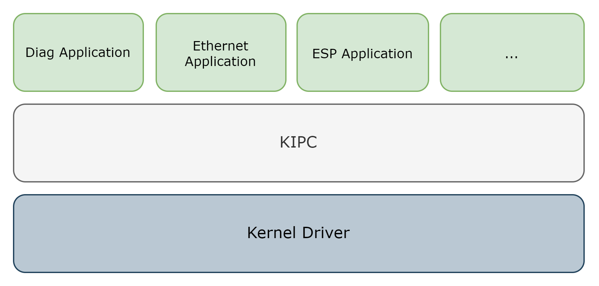
Image reference: slide_03_image_01.png

3

KIPC which stand for Kernal Inter process communication is a protocol that utilized the Kernel Driver on Linux to transfer data between the Processes.

Current KIPC design

## Slide 4

1. Problem identification

LGE Internal Use Only

Problem #1: Limited functionality

- The existing KIPC is restricted to basic send and receive operations and does not support asynchronous or synchronous communication
- Custom logics are used to replace the asynchronous and synchronous communication

Limitation:
Usability
Scalability
Maintainability
Risk of Errors
Collaboration issue
Clean code problem

4

Problem #2: Raw Data Management

Can only send and receive raw data (byte stream) with current KIPC
Developers must implement the logic to parse/serialize data for each individual message

## Slide 5

2. Requirements

LGE Internal Use Only

5

Functional requirements

FR#1. The new design should provide the asynchronous, synchronous, one-way communication methods
FR#2. The new design should be able to handle raw data automatically

Reason for fulfilling these functional requirements:
Enhance scalability, maintainability, and usability
Reduce code complexity and minimize risks
Improve collaboration efficiency across teams

## Slide 6

2. Requirements

LGE Internal Use Only

Quality attribute requirements

### Table
| ID | Description | QA | Priority |
| QA#1 | The design should easily support a growing number of messages | Scalability | High |
| QA#2 | The new design must provide easy-to-use methods and facilitate efficient communication with other applications. | Usability | Medium |
| QA#3 | The solution should be designed in a way that ensures the system applying it is easy to maintain. | Maintainability | Medium |
| QA#4 | The solution should provide libraries or utilities that are easy to maintain and debug | Maintainability | Low |

6

## Slide 7

3. Solution proposal

LGE Internal Use Only

Solution 1: Expanding the KIPC Library

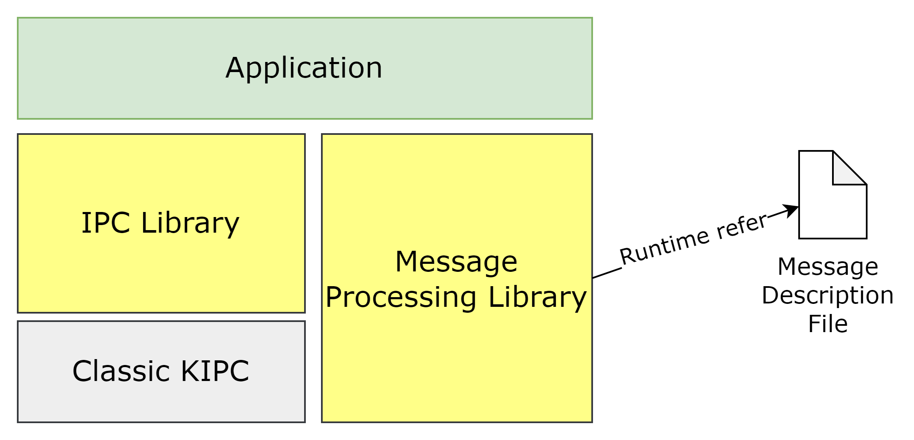
Image reference: slide_07_image_01.png

Solution 2: Message Encapsulation

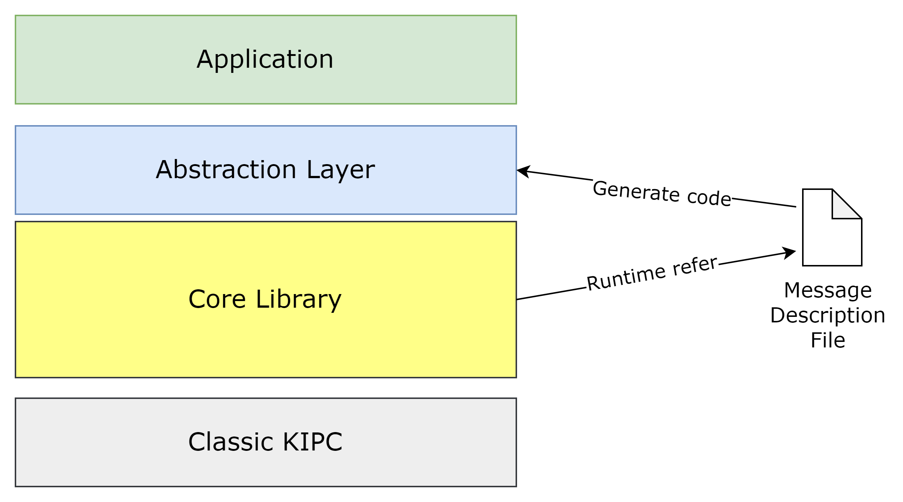
Image reference: slide_07_image_02.png

7

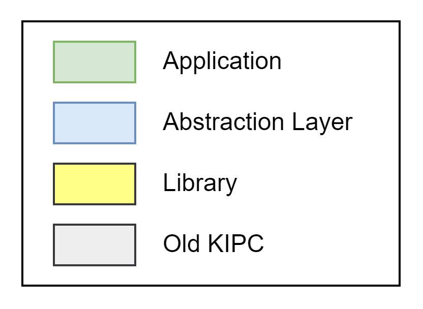
Image reference: slide_07_image_03.png

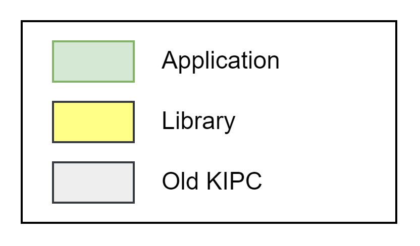
Image reference: slide_07_image_04.png

## Slide 8

3. Solution proposal

LGE Internal Use Only

Solution 1: Expanding the KIPC Library

Pros:
Good scalability
Easy to maintain the messages by Message Description File
Maintainable libraries
Easier error handling by splitting responsibilities
Cons:
Usability: increased complexity for developers managing multiple libraries.

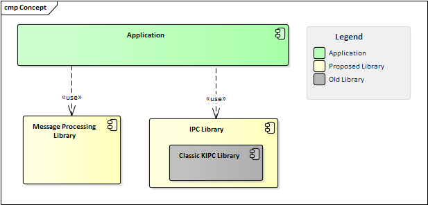
Image reference: slide_08_image_01.png

8

## Slide 9

3. Solution proposal

LGE Internal Use Only

Solution 2: Message Encapsulation

Pros:
Good Scalability
Improved usability
Better maintainability of system.
Error handling
Clean code
Cons:
 Increased effort to implement and maintain (library and generation tool)

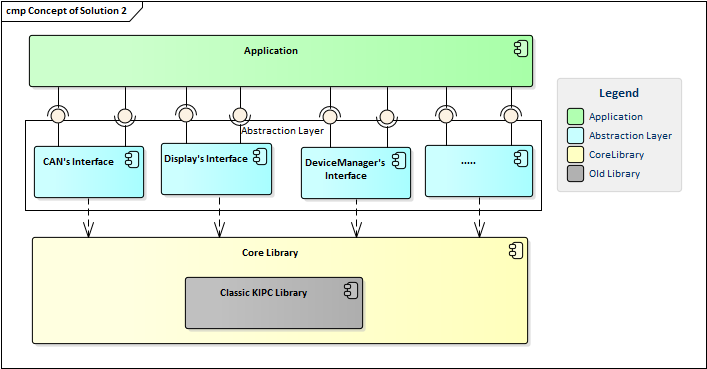
Image reference: slide_09_image_01.png

9

## Slide 10

4. Solution comparison

LGE Internal Use Only

### Table
| Aspect | Attributes | Expanding the KIPC Library | Message Encapsulation |
| Quality attribute aspects | Scalability (QA#1) | Medium: More time needed to add new messages. | High: Easier to scale with automated interfaces generation |
|  | Usability (QA#2) | Medium: Requires working with multiple libraries and manual message handling. | High: Provides intuitive APIs, automates serialization/deserialization and handler registration. |
|  | Maintainability (QA#3) | High: Don’t need much effort on message changes | Medium: Message changes require re-generating interfaces. |
|  | Maintainability (QA#4) | High: The IPC Library and MessageProcessing Library are separate, which reduces the effort required to maintain each individually. | Medium: Core library and generation tool need more effort to maintain |
| Other aspects | Error Handling | Medium: separate error handling for serialization and transmission | High: better since unified, consistent error handling in by one library |
|  | Clean Code | N/A Depending on the design | High |
|  | Effort to implement the solution | Medium: need less effort to implement | High: need more effort to implement |

Image reference: slide_10_image_01.png

Image reference: slide_10_image_02.png

Image reference: slide_10_image_03.png

Image reference: slide_10_image_04.png

Image reference: slide_10_image_05.png

Image reference: slide_10_image_06.png

Image reference: slide_10_image_07.png

10

=>  Solution 2: Message Encapsulation is better

## Slide 11

5. Architect design

LGE Internal Use Only

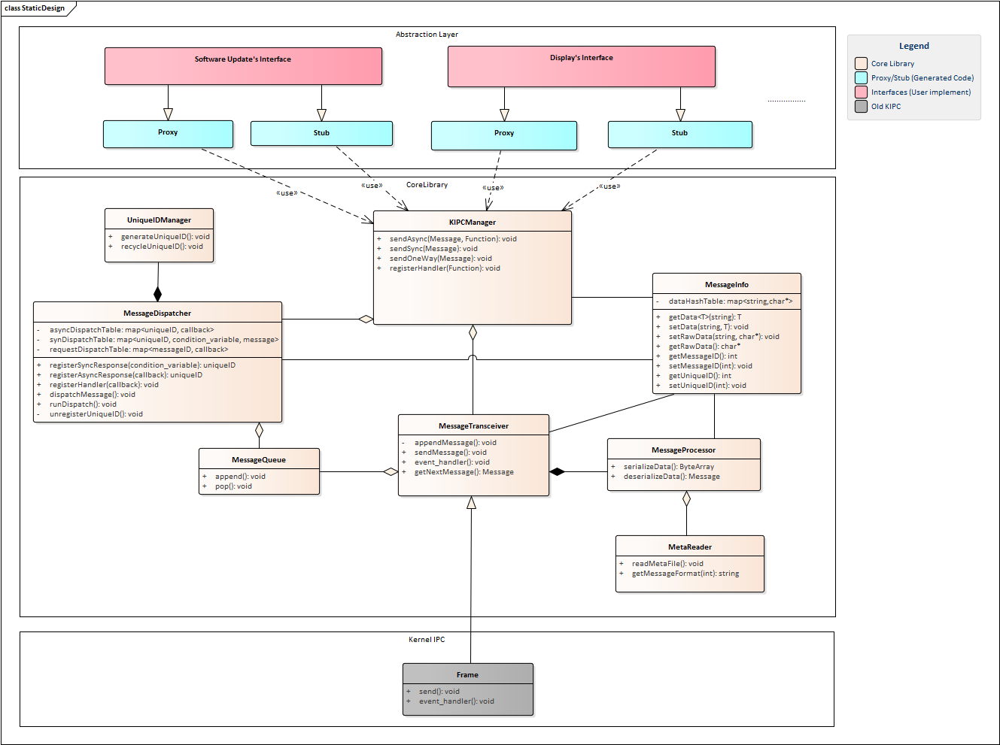
Image reference: slide_11_image_01.png

11

## Slide 12

6. Solution Verification

LGE Internal Use Only

12

### Table
| Solution 2: Message Encapsulation |  |  | Old Design |  |  |
| Steps | Complexity | Estimated Time | Steps | Complexity | Estimated Time |
| 1. Update Message Description File | Medium | 1h | 1. Collaborate meeting to define new message | Medium | 8h |
| 2. Share Message Description File | Low | 1h | 2. Share the meeting document | Low | 1h |
| 3. Generate interfaces | Low | 1h | 3. Refer document and implement new message logic | High | 16h |

Scenario. Adding a new message

Scalability

## Slide 13

6. Solution Verification

LGE Internal Use Only

13

### Table
| Solution 2: Message Encapsulation |  |  | Old Design |  |  |
| Steps | Complexity | Estimated Time | Steps | Complexity | Estimated Time |
| 1. Update Message Description File | Medium | 1h | 1. Collaborate meeting to update message | Medium | 8h |
| 2. Share Message Description File | Low | 1h | 2. Share the meeting document | Low | 1h |
| 3. Generate interfaces | Low | 1h | 3. Refer document and modify message logic | Medium | 3h |

Scenario. Modify a message format

Maintainability

## Slide 14

6. Solution Verification

LGE Internal Use Only

14

### Table
| Solution 2: Message Encapsulation |  |  | Old Design |  |  |
| Steps | Complexity | Estimated Time | Steps | Complexity | Estimated Time |
| 1. Call API designed for a specific purpose and provide the parameters | Low | 1h | 1. Refer document to understand message format | Medium | 4h |
|  |  |  | 2. Implement sending logic base on the document | High | 1h |

Scenario. Implement: sending a message

Usability

## Slide 15

Image reference: slide_15_image_01.png

15

## Slide 16

Appendix

16

## Slide 17

Problem #1: Limited functionality

LGE Internal Use Only

Image reference: slide_17_image_01.png

Example 1:

17

## Slide 18

Problem #1: Limited functionality

LGE Internal Use Only

Example 2:

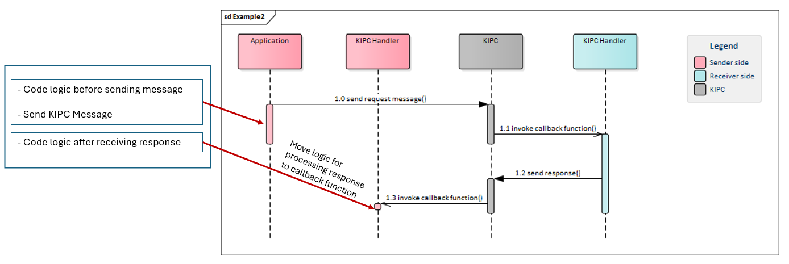
Image reference: slide_18_image_01.png

18

## Slide 19

Data frame of KIPC message

LGE Internal Use Only

Header: contains information about the source, destination address (PID number) and data size of the message
Data: the payload of the message

Image reference: slide_19_image_01.png

19

## Slide 20

Solution 1: Expanding the KIPC Library

LGE Internal Use Only

Image reference: slide_20_image_01.png

20

## Slide 21

Solution 2: Message Encapsulation

LGE Internal Use Only

Image reference: slide_21_image_01.png

21

## Slide 22

Scalability

LGE Internal Use Only

### Table
| Solution 1: Expanding KIPC Library |  |  | Solution 2: Message Encapsulation |  |  |
| Steps | Complexity | Estimated Time | Steps | Complexity | Estimated Time |
| 1. Update Message Description File | Medium | 1h | 1. Update Message Description File | Medium | 1h |
| 2. Share Message Description File | Low | 1h | 2. Share Message Description File | Low | 1h |
| 3. Declare a callback function and register this callback to IPC Library | Medium | 1h | 3. Generate interfaces | Low | 1h |

Scenario 1: Adding 1 new message

22

## Slide 23

Scalability

LGE Internal Use Only

Scenario 2: Adding 10 new messages

### Table
| Solution 1: Expanding KIPC Library |  |  | Solution 2: Message Encapsulation |  |  |
| Steps | Complexity | Estimated Time | Steps | Complexity | Estimated Time |
| 1. Update Message Description File | Medium | 10h | 1. Update Message Description File | Medium | 10h |
| 2. Share Message Description File | Low | 1h | 2. Share Message Description File | Low | 1h |
| 3. Declare a callback function and register this callback to IPC Library | Medium | 10h | 3. Generate interfaces | Low | 1h |

23

## Slide 24

Usability

LGE Internal Use Only

### Table
| Aspect | Solution1: Expanding KIPC Library | Solution 2: Message Encapsulation |
| Ease of Use | Low: Requires manual handling of message processing, working with multiple libraries. | High: Provides intuitive, high-level APIs, abstracting much of the complexity. |
| Simplicity of Setup | Medium: Higher complexity due to manual serialization, deserialization, and handler registration. | High: Setup is simpler with interfaces code generation |

24

## Slide 25

Maintainability (QA#3)

LGE Internal Use Only

Scenario: Modify message format

### Table
| Solution 1: Expanding KIPC Library |  |  | Solution 2: Message Encapsulation |  |  |
| Steps | Complexity | Estimated Time | Steps | Complexity | Estimated Time |
| 1. Update Message Description File | Medium | 1h | 1. Update Message Description File | Medium | 1h |
| 2. Share Message Description File | Low | 1h | 2. Share Message Description File | Low | 1h |
|  |  |  | 3. Generate interfaces | Low | 1h |

25

## Slide 26

Maintainability (QA#4)

LGE Internal Use Only

### Table
| Solution 1: Expanding KIPC Library |  | Solution 2: Message Encapsulation |  |
| Target | Complexity | Target | Complexity |
| Core Library | Very High | Message Processing Library | Medium |
| Generation Tool | Medium | IPC Library | Medium |

26

## Slide 27

Message Description File

LGE Internal Use Only

27

## Slide 28

Architect Design Concept

LGE Internal Use Only

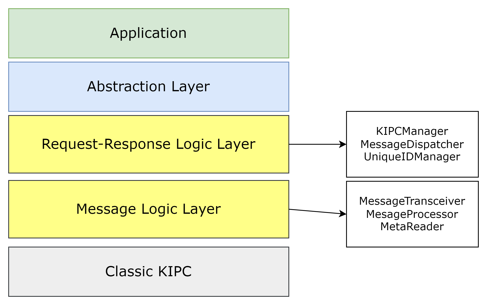
Image reference: slide_28_image_01.png

28

## Slide 29

Message sending and receiving

LGE Internal Use Only

Image reference: slide_29_image_01.png

29

## Slide 30

Synchronous communication

LGE Internal Use Only

Image reference: slide_30_image_01.png

30

## Slide 31

Asynchronous communication

LGE Internal Use Only

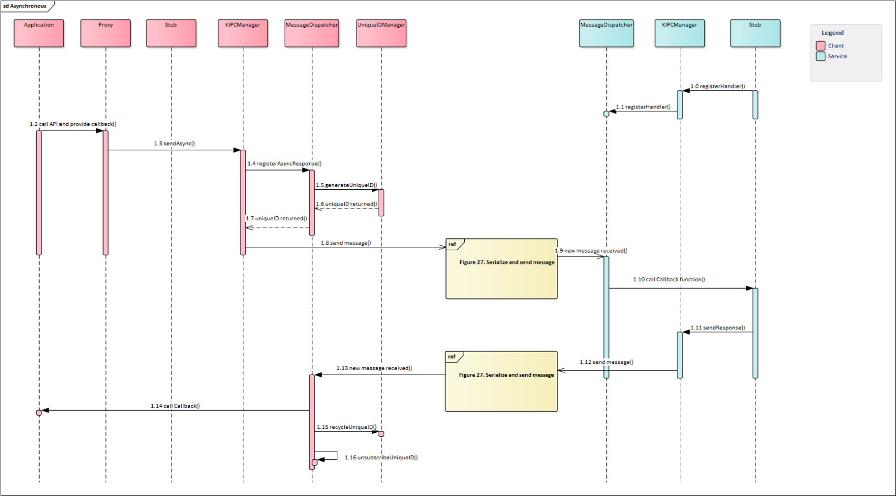
Image reference: slide_31_image_01.png

31

## Slide 32

One-way sending

LGE Internal Use Only

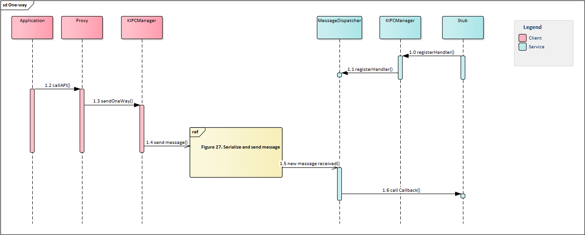
Image reference: slide_32_image_01.png

32

