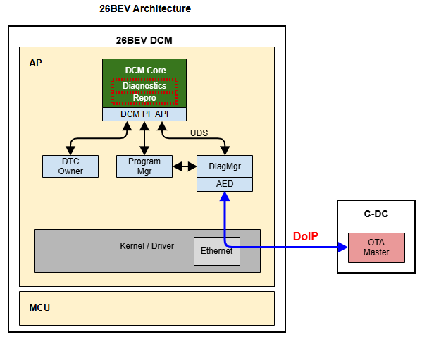
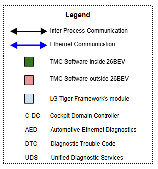
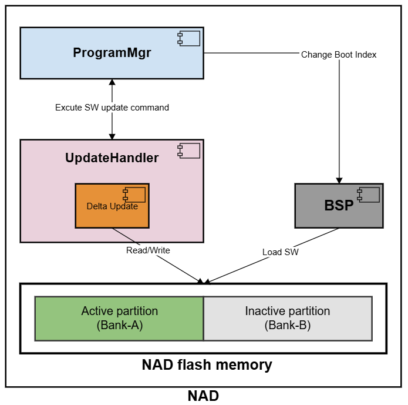
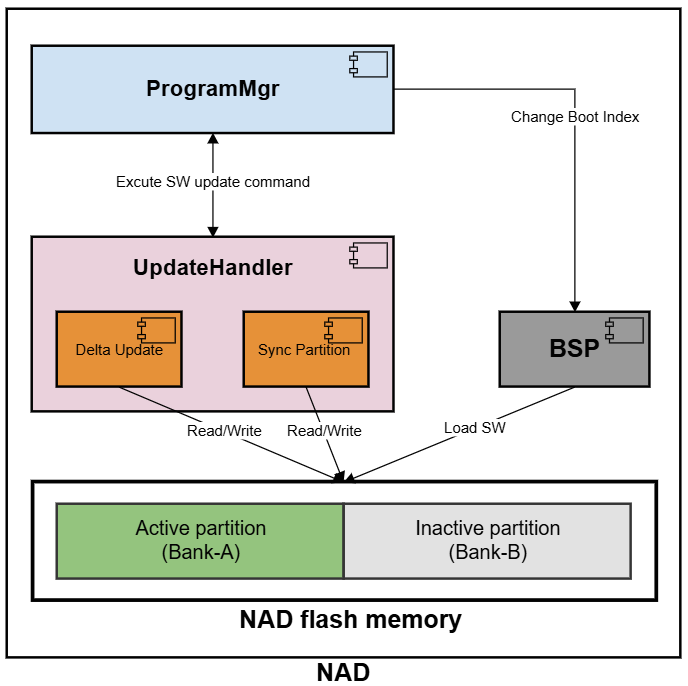
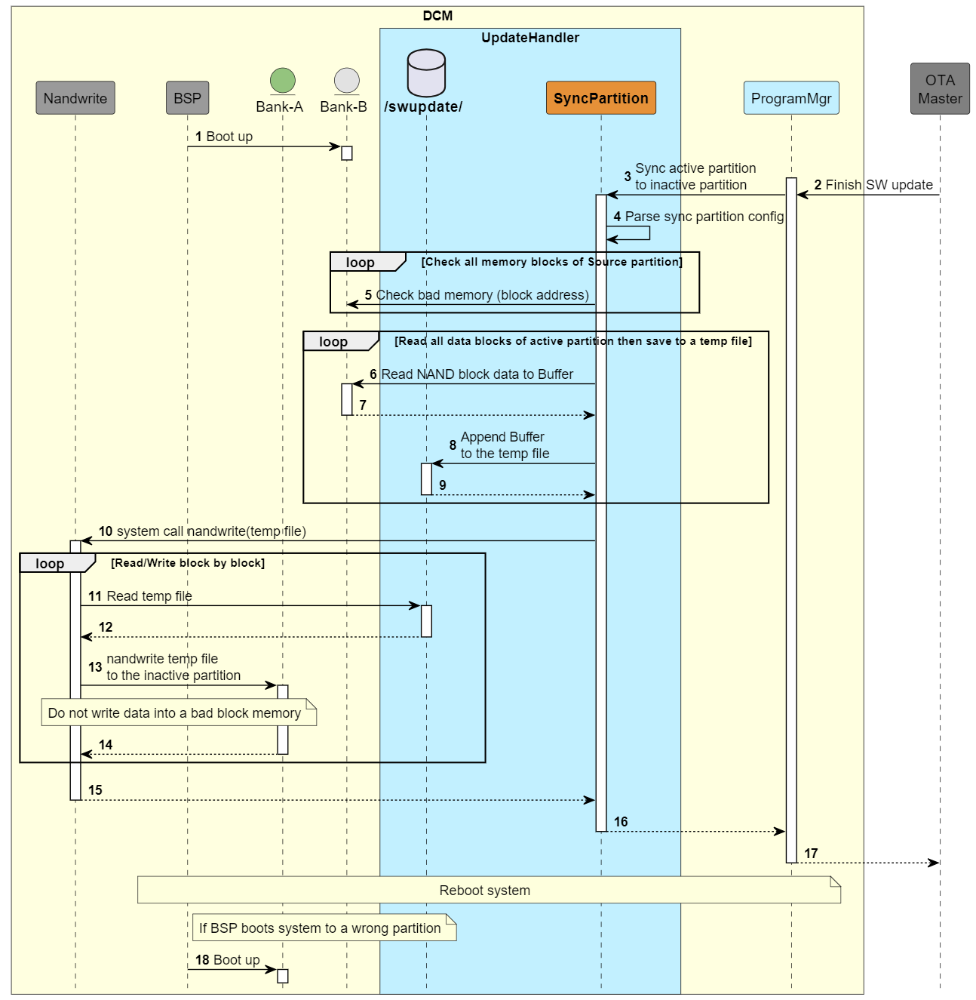
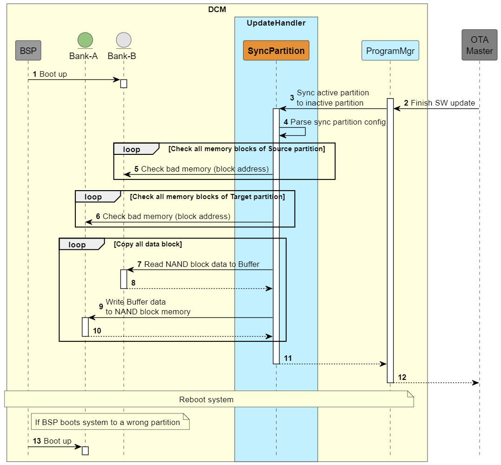
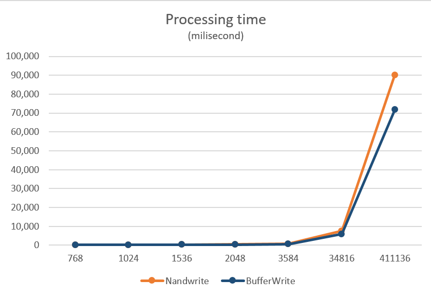
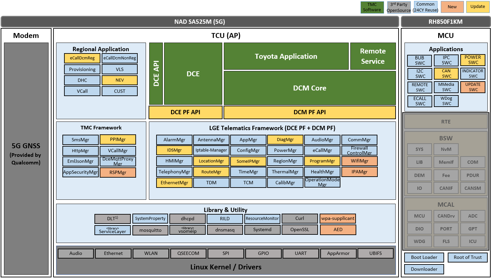
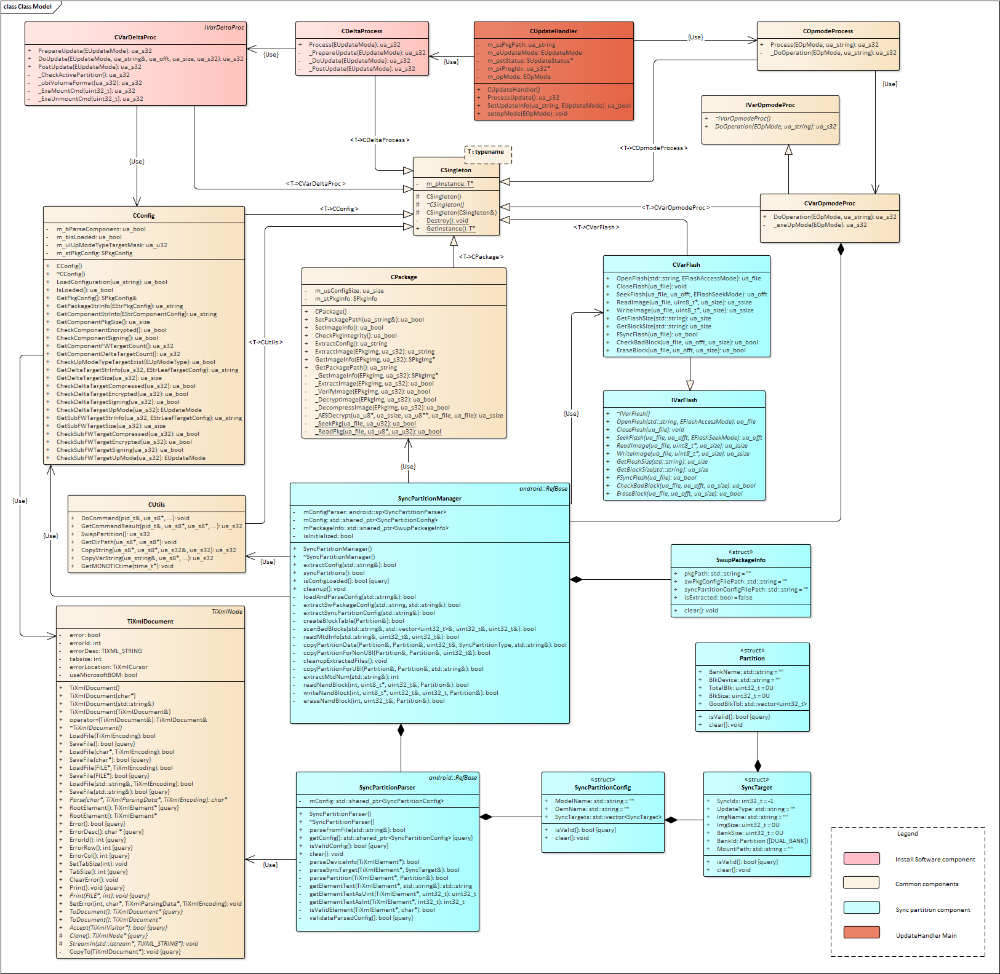
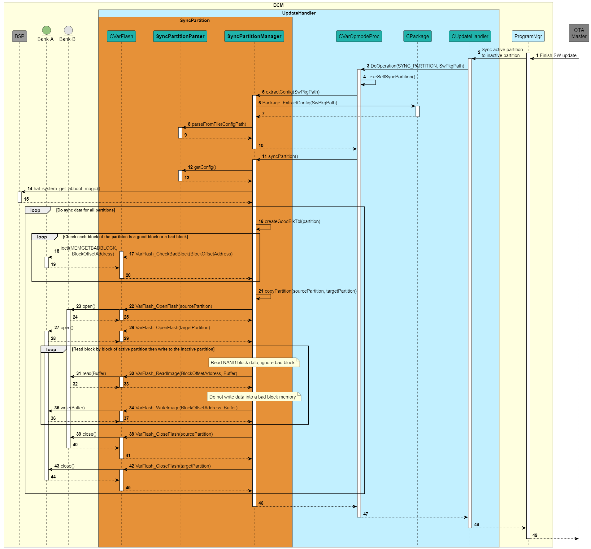

# Raw Slide Content

- Source file: Final_duc_phan_FA_2025_New_Synchronization_Partition_Design_for_Enhanced_Software_Update_Robustness_in_Toyota_26BEV/Final_duc_phan_FA_2025_New_Synchronization_Partition_Design_for_Enhanced_Software_Update_Robustness_in_Toyota_26BEV.pptx
- Total slides: 17

## Slide 1

New Synchronization Partition Design for Enhanced Software Update Robustness
(Toyota 26BEV)

- By duc.phan
- Supervised by by.kim
- September 2025

1

## Slide 2

Contents

Overview
Problem Identification
Architecture Design Proposals
Architecture Decision
Verify the architecture design
Results and Conclusion
Q&A

2

## Slide 3

What is Software (SW) update?
It is the process of installing a newer version of the software.
This new SW version usually includes improvements, bug fixes, security patches, and sometimes new features.

1. Overview

Image reference: slide_03_image_01.png

Image reference: slide_03_image_02.png

3

## Slide 4

In TOYOTA 26BEV:
It uses NAND flash memory to install system software. It provides dual banks for reprogramming.
ProgramMgr requests UpdateHandler module to write a new SW in the inactive partition. Then it asks to BSP changing the boot entry to the inactive partition for activating new SW.

1. Overview

4

Image reference: slide_04_image_01.png

## Slide 5

After a SW Update completed
The active partition contains the new SW version
The inactive partition still keeps the  older version.
→ Problem: Booting from the inactive partition's outdated SW could lead to serious issues and defeat SW update purpose.

Refer to the problem in ICONN and TOYOTA 26BEV projects :

Image reference: slide_05_image_01.png

Refer to these tickets
http://jira.lge.com/issue/browse/TMCBEV-2644
https://jira.cc.bmwgroup.net/browse/ICONSD-119799

Image reference: slide_05_image_02.png

Solution?

2. Problem Identification

5

## Slide 6

### Table
| QA ID | Quality Attribute | Priority | Description |
| QA.01 | Performance | High | Need to optimize system resources usage: CPU usage, RAM, memory usage. |
| QA.02 | Reliability | High | Must ensure the system operates stably after updating SW. |
| QA.03 | Compatibility | Medium | Can be conveniently integrated into multiple projects |
| QA.04 | Modifiability | Medium | Need to keep as minimal as possible to avoid increasing the flashdriver size too much. |

### Table
| ID | Constraint |
| C.01 | UpdateHandler module is designed to interact with system at low level. |
| C.02 | Ensures system operation even when switched to synchronized partition. |

2. Problem Identification: Quality attributes, Constraints

6

## Slide 7

To prevent this problem, the new SW version in the active partition should be synchronized to the inactive partition.

Active partition

Inactive partition

Sync

3. Architecture Design Proposals

7

Image reference: slide_07_image_01.png

## Slide 8

### Table
| SW update config |
| Package data |
| Sync partition config |

Software update package structure

Refer to 26BEV partition table http://collab.lge.com/main/pages/viewpage.action?pageId=2810646975

3. Architecture Design Proposals

<?xml version="1.0" encoding="UTF-8"?>
<SyncPartition>
    <ModelName>toyota_26bev</ModelName>
    <OEMName>toyota</OEMName>
    <SyncTarget>
        <Index>0</Index>
        <UpdateType>BU</UpdateType>
        <ImageName>xbl_s_nand.melf</ImageName>
        <ImageSize>300</ImageSize>
        <PartitionSize>600</PartitionSize>
        <MountPath></MountPath>
        <Partition>
            <Name>system</Name>
            <BlockDevice>/dev/mtd40</BlockDevice>
        </Partition>
        <Partition>
            <Name>sbystem</Name>
            <BlockDevice>/dev/mtd41</BlockDevice>
        </Partition>
    </SyncTarget>
</SyncPartition>

8

## Slide 9

Proposal #1: Nandwrite solution - Store temporary file and using nandwrite
Pros:
Modifiability:
A simple modification involves allocating memory to store system image.
Time saving to verify the synchronizing functionality.
Reliability
Nandwrite(mtd-utils) handles bad block
Cons:
Performance:
Needs about 401 MB extra storage for a temp file (largest system image ≈ 401 MB).
Processing time is not optimal.

3. Architecture Design Proposals

9

Image reference: slide_09_image_01.png

## Slide 10

Proposal #2: BufferWrite solution - Write source partition data directly to target partition
Pros:
Performance:
Read image data directly from the source partition and write it to the destination partition without storing the data in the SW update workspace.
This significantly reduces the amount of memory used.
Processing time is fast.
Cons:
Modifiability:
Implement complex algorithm for memory handling (Read/write NAND memory blocks).
Handle bad blocks table in service itself.

3. Architecture Design Proposals

10

Image reference: slide_10_image_01.png

## Slide 11

Proposal #1
(Nandwrite solution)

Proposal #2
(BufferWrite solution)

VS

Performance
(High)

Reliability
(High)

Modifiability
(Medium)

Medium
Requires ~401MB memory to save a temp image file
RAM 1MB for the buffer and 2.4MB for nandwrite
CPU usage ≈ 55%
Processing time is normal

High
Nandwrite mitigates the impact of bad blocks, allowing the flashing process to complete successfully as long as the number of bad blocks is not excessive.

High
The line of code (LOC) is slightly changed.

High
RAM 1MB for the buffer
CPU usage ≈ 46%
Processing time is faster than nandwrite 21%

High
Service must handle bad blocks itself. However, this algorithm has been verified by many projects.

Medium
Need more hundred LOC for new bad blocks handling algorithm.

Compatibility
(Medium)

High
It seamlessly adapts to changes in system configuration

High
It seamlessly adapts to changes in system configuration

Select

4. Architecture Decision

11

## Slide 12

### Table
| No. | Verification step | Current logic | Apply proposal solution |
| 1 | Check SW version of the active partition | / # cat /etc/version TdcLZ_Cc_2536_0041 | / # cat /etc/version TdcLZ_Cc_2536_0041 |
| 2 | Change Boot index to inactive partition | / # sldd progmgr requestjob 131076 3 2 requestJob ret : 0 outBuffer_(0) : 1 OK_done (0) | / # sldd progmgr requestjob 131076 3 2 requestJob ret : 0 outBuffer_(0) : 1 OK_done (0) |
| 3 | Check SW version of the current partition | / # cat /etc/version TdcLZ_Cc_2533_0099 | / # cat /etc/version TdcLZ_Cc_2536_0041 |
| 4 | Check System boot up successfully or not | / # sldd am get_bootcomplete start get bootcomplete ============================== Success get bootcomplete 1: ============================== | / # sldd am get_bootcomplete start get bootcomplete ============================== Success get bootcomplete 1: ============================== |
| 5 | Compare SW version of both partitions | Not same | Same |

5. Verify the architecture design

12

## Slide 13

### Table
| No. | Partition | Partition Size (KB) | Processing Time (ms) |  | CPU Usage (%) |  |
|  |  |  | Proposal #1 (Nandwrite) | Proposal #2 (BufferWrite) | Proposal #1 (Nandwrite) | Proposal #2 (BufferWrite) |
| 1 | tz_devcfg | 768 | 179 | 169 | 55% | 46% |
| 2 | keymaster | 1024 | 232 | 181 |  |  |
| 3 | cmnlib64 | 1536 | 364 | 256 |  |  |
| 4 | qhee | 2048 | 467 | 347 |  |  |
| 5 | uefi | 3584 | 766 | 608 |  |  |
| 6 | boot | 34816 | 7486 | 5819 |  |  |
| 7 | System | 411136 | 90169 | 71695 |  |  |
| Total |  |  | 99663 | 79075 |  |  |

Image reference: slide_13_image_01.png

ms

KB

Plan to apply:
December 2025: Apply Proposal #2 for robustness activity in the 26BEV project

6. Results and Conclusion

13

## Slide 14

Q&A
Thanks for your attention

14

## Slide 15

Appendix – 26BEV diagram

Image reference: slide_15_image_01.png

15

## Slide 16

Appendix – Class diagram

Image reference: slide_16_image_01.png

16

## Slide 17

Appendix – SW Detail Design

SyncPartitionManager: Responsible for managing the partition synchronization process.
SyncPartitionParser: Responsible for parsing the Sync Partition configuration.
CVarFlash: Interacts directly with the partitions for reading and writing data.
Synchronization partition sequence:
Prepare Synchronization partition config.
Prepare Good block memory table of partitions.
Copy source partition data to the target partition.

17

Image reference: slide_17_image_01.png

