# Raw Document Content

- Source file: manh.nguyen_BLE commonization architecture/manh.nguyen_BLE commonization architecture/BLE Commonization architecture.v0.5.docx

About This Document

Document Information

## Table
| Issuing authority | BMW ICONICC |
| --- | --- |
| Status of document | In Progress |

Revision History

## Table
| Verion | Date | Comment | Author | Approver |
| --- | --- | --- | --- | --- |
| 0.1 | 2024.07.15 | Initial document | Manh.nguyen |  |
| 0.2 | 2024.07.30 | Update context diagram and architecture proposal | Manh.nguyen |  |
| 0.3 | 2024.08.6 | Add detail architecture design | Manh.nguyen |  |
| 0.4 | 2024.08.14 | Add sequence diagram | Manh.nguyen |  |
| 0.5 | 2024.09.9 | Add state design & Lessons learned | Manh.nguyen |  |

Purpose

This document specifies the software architectural design for the Bluetooth Low Energy Manager service.

This design document also serves as a guideline on how each software component in the system should be implemented and how the internal components/external processes should interact with each other.

Scope

This document describes the following about the BLE communization service:

SW Architectural representation.

Sequence diagram for the use case.

Audience

The software architect responsible for assessing the software design.

Developers within the BMW-ICONICC project who will identify any inconsistencies between the design and the requirements.

Participants of all projects who want to understand the Bluetooth Low Energy Manager service architecture.

Figures

Figure 0-1. Overview about ICON system connection.	5

Figure 0-2. BT manager involve to system.	6

Figure 0-3. User case diagram.	7

Figure 0-4. Currently architecture Context diagram	11

Figure 0-5. Current Software Architecture.	12

Figure 0-6. Internal software components.	13

Figure 0-7. Proposal 1 – BLE comonization architecture base on façade design pattern	15

Figure 0-8. The static detail design for proposal 1	15

Figure 0-9.  Proposal 2 - Strategy design pattern approach solution.	17

Figure 0-10. Remove dependency platform specific propose architect	20

Figure 0-11. Proposal 2 strategy design pattern approach solution	21

Figure 0-12. Connection state	23

Figure 0-13. Sequence diagram of Enable/disable BLE feature	24

Figure 0-14. Connection with central mode diagram	25

Figure 0-15. Connection with peripheral mode diagram	27

Figure 0-16. Create BLE service, characteristics diagram	29

Figure 0-17. The NRF connect app show advertising, connected and disconnected state when trying to test the design	32

Tables

Table 1. Quality attributes of BE manager	9

Table 2. Current architect description	12

Table 3. Internal software components description	13

Table 4. Comparison and architecture decision	19

Table 5. BLE commonization new class description	21

Table 6. Descriptions for each state	23

Table 7.Enable BLE step	24

Table 8. Set connect device with central mode	26

Table 9. Connection with peripheral mode step	27

Table 10. Create BLE service, characteristics steps	29

Acronyms and Abbreviations

## Table
| Abbreviation | Description |
| --- | --- |
| BT | Bluetooth |
| BTLE | Bluetooth Low Energy |
| BLE services | Data transfer via BLE is structure data; service is a collection of data, and associated behaviors to accomplish a particular function or feature of a device or portions of a device. |
| BLE characteristics | A characteristic is a value used in a service along with properties and configuration information about how the value is access and information about how the value is displayed or represented. A characteristic definition contains a characteristic declaration, characteristic properties, and a value. It may also contain descriptors that describe the value or permit configuration of the server with respect to the characteristic value. |
| SOME/IP | Scalable service-Oriented Middleware over IP |

Project Context

Project Overview and Background explanation

ICON system support BT connection to communication with user device, any device support BTLE and allowed to can make a connection.

Image reference: doc_image_001.png

Figure 0-1. Overview about ICON system connection.

BT Manager involving

BT manager is one component in type B Container, that working as a service. Using provided API by Node0 to interactive with other component.

BT manager involved in system, interactive with other module via SOME/IP.

BT manager received request from diagnostic and handle maintain Bluetooth connection.

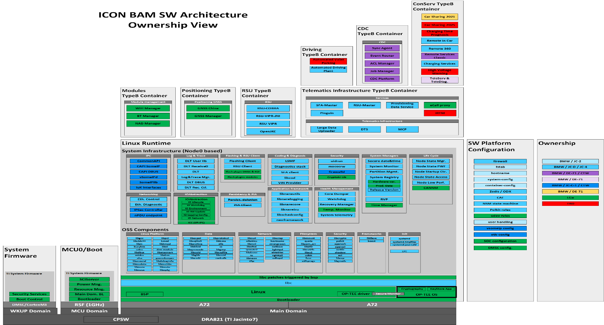
Image reference: doc_image_002.png

                                                                Figure 0-2. BT manager involve to system.

Functional Requirement:

In this section we only mention the basic functions and give an overview of them. From there, you will be able to have a general understanding of some main functions. To understand the functions in depth and in detail the following document is found to be useful “Core_v5.4” and "CSRSynergyBluetooth_20.0.1_API_UserGuide".

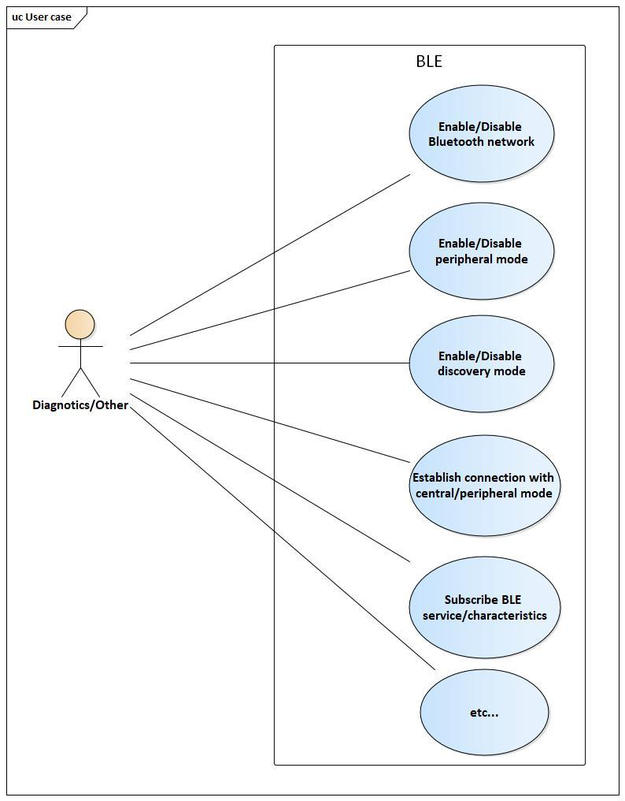
Image reference: doc_image_003.jpg

            Figure 0-3. User case diagram.

 Wakeup, enable/disable BLE features

When the wake-up value is triggered by an external device (ex. phone)) using the FindMe Profile. Wake up the WUC by triggering the BT_WAKEUP_HOST GPIO by the BT/WIFI SoC.

The BLE manager should handle requests to enable or disable BLE from BAM.

Support connect and disconnect to BLE peripheral devices

The BLE manager should handle requests to connect and disconnect to BLE peripheral devices. A device may initiate a connection with a synchronized device by using the LE Extended Create Connection command which indicates the sub-event and BD_ADDR of the peer device.

Start/stop scanning

The BLE manager should handle requests to start and stop scanning. BLE application requests synergy stack to start scanning to receive broadcast data from remote devices.

The BLE application also requests stop scanning via “CsrBtGattScanReqStopSend”

 Start/stop advertising

The BLE manager should handle requests to start and stop advertising. The BLE application request starts GATT advertising with no advertisement and scan response data. This function sends a “CSR_BT_GATT_ADVERTISE_REQ” primitive to the synergy stack.

The unit shall support enabling/disabling central/peripheral mode

In the central role, the device looks for connectable advertisements from target device(s) and initiates a connection on receiving such advertisement. The Application can request to initiate a connection in a central role by sending a Central Request (CSR_BT_GATT_CENTRAL_REQ). The GATT responds to this request with a Central Confirm (CSR_BT_GATT_CENTRAL_CFM) message.

In the peripheral role, the device starts connectable advertisements. An interested device may initiate a connection on receiving advertisements. The Applications can request peripheral roles by sending Peripheral Request (CSR_BT_GATT_PERIPHERAL_REQ). The GATT responds to this request through Peripheral Confirm (CSR_BT_GATT_PERIPHERAL_CFM).

Management and storage of device information.

The BLE manager should handle, manage, and store device information

Quality Attributes

On the other hand, BLE manager must follow the non-functional requirements described below:

Table 1. Quality attributes of BE manager

## Table
| ID | Scenario | Quality Attribute | Priority |
| --- | --- | --- | --- |
| QA.001 | When applying a new BLE stack, it should be possible to minimize changes in the common part. | Modifiability, Reusability | High |
| QA.002 | The BTManagerService should be easy to maintain | Maintainability | High |
| QA.003 | The BTManagerService should be easy to extend | Extensibility | High |
| QA.004 | BLE manager service must be enable and ready within 2sec from NAO mode wake-up. | Performance | Medium |
| QA.005 | The BLE manager shall handle all command requests and callback events without missing commands and events. | Reliability | Low |

During project development, the modeling team always wanted to optimize chip performance and reduce costs. Therefore, updating a new BLE chip with a new Bluetooth stack is often considered by the product development team. Therefore, the system design needs to be flexible and seamless when integrating new chips with minimal effort. This flexibility not only benefits the OEMs but also simplifies the task of system maintenance for developers. It is emphasizing the importance of QA.001 as a high priority.

When a new chipset Bluetooth stack is integrated, it imposes separate management requirements that do not affect the logic of the previous stack. The goal is to try to develop the adapter layer so that it is flexible and easy to maintain the system. QA.002 and QA00.3 was also highlighted as a high priority.

	Within the existing design, it is worth noting that the average time required for enable and ready BTLE service stands at 1.6 seconds. In scenarios QA.004 the performance of current system demonstrates commendable proficiency, so further enhancement is unnecessary.

	However, we also need to be careful not to make the system perform poorly. Alternatively, if other module also experience a performance decline, these issues can accumulate and lead to undesirable results. Consequently, the priority status of these Quality Attributes QA.004 can reasonably be assigned a medium priority level.

	In the context of Quality Attribute QA.005, the system must effectively manage all callback function events from synergy and handle command requests from the application without any omissions. From the constraints and specifications of the BMW-ICONICC project. The BTLE should manage or connect a maximum of 8 devices (phone). But in reality, our testing department can connect up to 8 devices without any signs of information loss. In practice, the process uses the BTLE function users often connect 2 devices at the same time. Therefore, the number of events that must be processed is usually kept to a minimum. To ensure seamless communication and event processing, the system uses message queues in its internal modules to store and process events posted from the synergy stack. Over the past 2 years, there have been no reported issues of missing events. With these considerations, the need to enhance QA.005 is considered low, making it the lowest priority within the project's scope.

Constraint

## Table
| No | Description | Constraint Type |
| --- | --- | --- |
| 1 | Using BT-stack provided by Qualcomm or other vendor to interactive with Bluetooth chipset. | Technical constraint |
| 2 | Using SOME/IP to interactive with other module, API is generated follow template. | Technical constraint |

Problem identify

In the context of the BMW-ICONICC project, the need arose to support some new Bluetooth chipset from Qualcomm or support other Bluetooth chipset stack (Infineon chipset). Now, let's take a closer look at the SOLID principles, focusing specifically on the Open-Closed Principle. This principle requires that classes should be open for extension and closed to modification. So what this principle wants to say is: We should be able to add new functionality without touching the existing code for the class. This is because whenever we modify the existing code, we are taking the risk of creating potential bugs. So we should avoid touching the tested and reliable (mostly) production code if possible.

Considering these principles, when examining the current design, it becomes clear that consolidating all the logic for BLE technologies within a BLE manager component, the BLE manager service goes against the Open-Closed Principle. Consequently, the integration of a new Bluetooth stack or support other Bluetooth chipset stack presents the risk of unintended side effects, which can extend the time and effort required for verification and stabilization. As a result, this approach does not meet QA.001 and QA.002.

	This highlights the issue in the current design: the negative impact on existing components and difficult to expand when integrating a new chipset with a new Bluetooth stack.

Image reference: doc_image_004.jpg

      Figure 0-4. Currently architecture Context diagram

Current Software Architecture

Software Architect Design

Image reference: doc_image_005.jpg

                              Figure 0-5. Current Software Architecture.

Table 2. Current architect description

## Table
| Component | Description |
| --- | --- |
| Neo framework in Node0 | This is library of Node0 which used by BT service for some/ip interface, BMW provided it. |
| BT manager service | The framework that receives commands from applications (diagnostic) to control Bluetooth function |
| Synergy Stack | A BT stack provided by Qualcomm vendor. It is implemented to handle data for Bluetooth communication BT chipset and BAM. It also provide API for BT manager. |
| Diagnostics | Which component will make request to BT Manager via SomeIP |

Software modules and responsibility

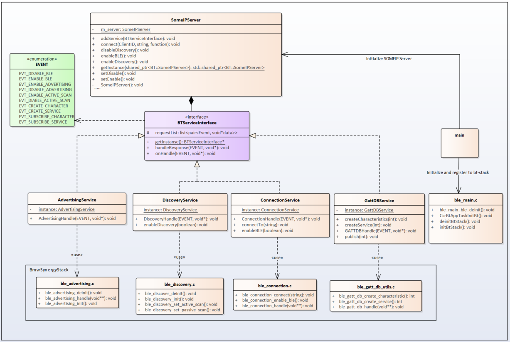
Image reference: doc_image_006.png

Figure 0-6. Internal software components.

Table 3. Internal software components description

## Table
| Components | Description |
| --- | --- |
| SOME/IP Handling | The server will always available to receive request form other service and forward it to BT manager, all API will explode fllow format defined by OEM |
| Discovery Service | The module handle feature relate to requirement relate to discovery: configureation for passive scaning, active scaning, discovery |
| Advertising Service | The module handle feature relate to requirement about advertising: Advertising, peripheral mode, visiable configuration |
| Connection Service | The module handle when 2 device estable connection |
| GATT DB Service | The module will handle about configureation for characteristic and services: Provide service, characteristics information for request subscribe and provide api to create new services, characteristics |
| C API | Handling bt-stack response event and provide API for service, easy for using, |

Architecture Design Proposal

In this section, I propose two architectural designs:

Section 2.1: Façade design pattern approach solution

Section 2.2: Strategy design pattern approach solution

In each section, the basic concept of my proposal will be introduced with the context diagram. The advantages and disadvantages of each proposal are highlighted in the corresponding section. Finally, the summary will be concluded in Section 2.3.

Façade design pattern approach solution

The objective of this project is not only to resolve the problems identified in the previous section but also to enhance the system to meet its requirements and quality attributes. Let's revisit two problems from section 1.4 Problems Identification and the highest-priority Quality Attribute (QA) in section 1.3 Quality Attributes

QA.001: When applying a new BLE stack, it should be possible to minimize changes in the common part.

QA.002: The BTManagerService should be easy to maintain.

             QA.003: The BTManagerService should be easy to extend

The problem: the negative impact on existing components and difficult to expand when integrating a new chipset with a new Bluetooth stack.

As previously analyzed, the current design with the BLE manager violates the Open-Closed Principle. To add new functionality without modifying the class, a common solution is to use interfaces and abstract classes. Robert C. Martin sums up this rule as follows in his 2000 article, Design Principles and Design Patterns: “If the open-closed principle (OCP) states the goal of object oriented (OO) architecture, the dependency inversion principle (DIP) states the primary mechanism”.

	In simpler terms, both high-level and low-level modules will depend on abstractions rather than high-level modules dependent on low-level modules. With this insight, the proposed solution is to convert the BLE manager into an interface or abstract layer, which forms the core idea behind the first proposal” Façade design pattern approach solution”.

To make classes open to extension, the initial idea I will create facade adaptor class to handle multiple Bluetooth stack. The common function of Bluetooth Low Energy (function of connection, advertising, handling event callback from synergy…) can be kept in BTManagerService. But the specific functions for each Bluetooth stack will be integrated in the Facade adaptor class. This design approach can indeed lead to the resolution of the identified problems and make the system more maintainable and extensible.

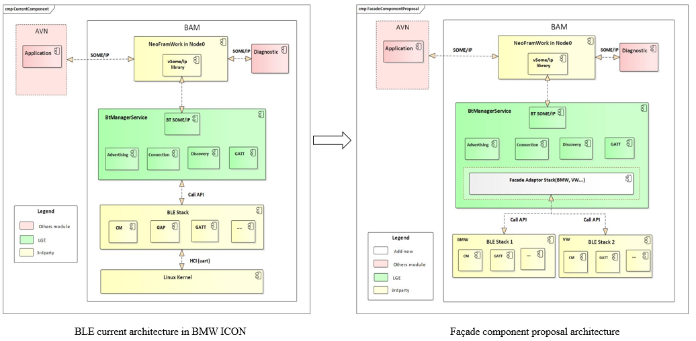
Image reference: doc_image_007.png

                                           Figure 0-7. Proposal 1 – BLE comonization architecture base on façade design pattern

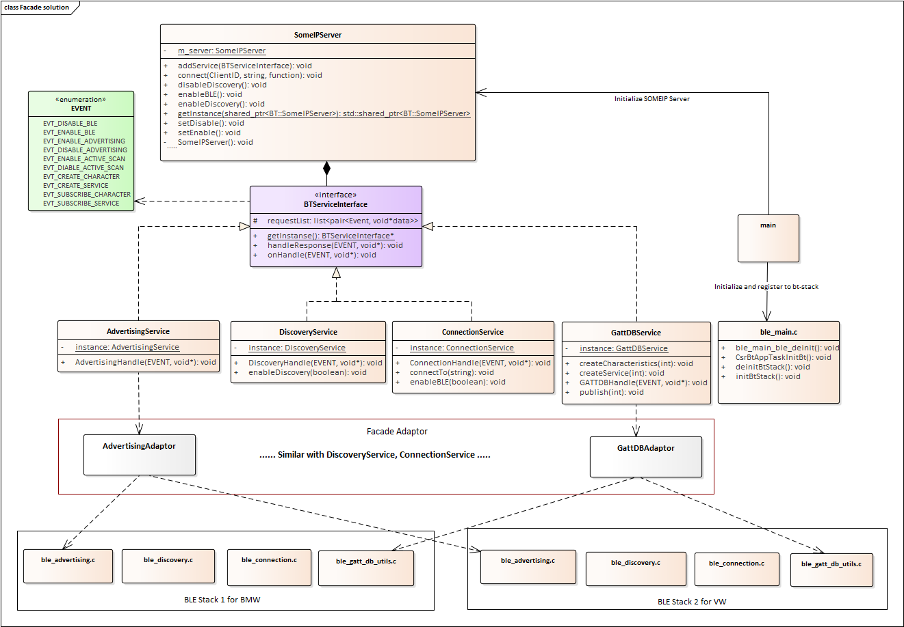
Image reference: doc_image_008.png

Figure 0-8. The static detail design for proposal 1

Some advantages of proposal 1:

Modifiability: Minimize the impact on the existing Bluetooth stack while applying new one. All Bluetooth stack will process through “Façade Adaptor” class.

Maintainability: Simplify the BLE commonization codebase.

Reusability: Façade adaptor can be reused when integrating a new stack.

However, there are some disadvantages to this method:

QA.002 and QA.003 emphasizes the BTManagerService should be easy to maintain and extend. There are logic related to the BLE chip has some different points and this design groups logic handles for all Bluetooth stacks to one component. This integration requires workarounds to achieve a complete separation between Bluetooth stacks, making this proposal less suitable for fully meeting the requirements of QA.002 and QA.003.

Additionally, complexity of the code increases because we need to introduce a set of new API when more synergy stack is applied. Sometimes it’s simpler just to change the service class so that it matches the rest of your code.

With these considerations, finding the right balance between modularity and complexity becomes essential in our quest to design a system that aligns with both current needs and future adaptability. In both our current system architecture and the first proposal, it's advantageous to have separate command request and handlers event for each stack since during the BLE process multiple interactions occur between BLE manager and the external clients such as application, synergy stack. However, this approach is no longer ideal in meeting the demands of QA.001. To address this challenge and overcome the disadvantage of reusability in this design, a comprehensive restructuring of all BLE manager is necessary. I suggest refactoring current BLE manager service class to abstract. The “service adaptor class” will be implement handle requests from the application and execute to corresponding synergy stack. This forms the core concept behind the second proposal: "Strategy design pattern approach solution".

Strategy design approach solution

Addressing the challenge of QA.002 and QA.003, which focuses on the system shall easy to maintain and extend. To overcome this challenge and deliver a more adaptive system, I turned to the thinking of the strategy pattern for design.

Strategy pattern popularized the concept of using design patterns to describe how to design flexible and reusable object-oriented software. Deferring the decision about which algorithm to use until runtime allows the calling code to be more flexible and reusable.

For instance, a class that performs validation on incoming data may use the strategy pattern to select a validation algorithm depending on the type of data, the source of the data, user choice, or other discriminating factors. These factors are not known until runtime and may require radically different validation to be performed. The validation algorithms (strategies), encapsulated separately from the validating object, may be used by other validating objects in different areas of the system (or even different systems) without code duplication.

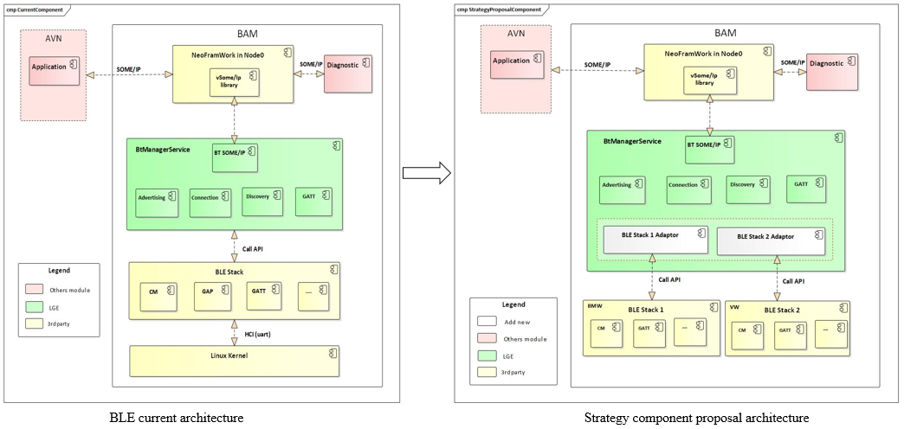
Image reference: doc_image_009.png

                                                 Figure 0-9.  Proposal 2 - Strategy design pattern approach solution.

Implementing the follow the ideal of strategy pattern to handle and integrate new Bluetooth stacks has both advantages and disadvantages, each of which is worth considering in the design context.

Pros:

Open-Closed Principle: This approach can introduce new strategies without having to change the context

Reduced code complexity: By separating the requests and event handlers into a separate class hierarchy and merging the original classes into one, this approach effectively reduces code duplication. It isolates the implementation details of the algorithms from the code that uses them, resulting in a cleaner and more maintainable code base.

Single Responsibility Principle. You can separate the interface or data conversion code from the primary business logic of the program.

Cros:

Over-complexity for Simple Cases: In scenarios where project requirements request to support for only one synergy stack, there’s no real reason to overcomplicate the program with new classes and interfaces that come along with the pattern.

Maintainability challenges: Developers must understand the differences between different strategies to make the right choice. This can require learning and potentially make maintenance more difficult.

Challenges without Using Strategy Pattern:

Limited Flexibility: Implementing BLE functional for each stack directly within the single class can make the code inflexible. Adding new functional or changing existing ones would require modifying the main class, which violates the Open/Closed Principle.

Code Duplication: Without a clear structure, you may end up duplicating source code or logic to handle different functional of BLE. This can lead to maintenance issues and inconsistency in the system.

Hard-Coded Logic: Implementing BLE logic directly within the main BLE manager component can make the code rigid and difficult to extend or modify. Making changes to the functional and algorithm becomes cumbersome and error-prone.

In conclusion, the decision apply the ideal of strategy pattern to handle BLE synergy should be made carefully, taking into account the complexity of the project and the expected future requirements. While it offers significant advantages in terms of code structure and extensibility, it may not be the ideal choice for every situation, especially in cases where simplicity and minimalism are key.

In this project, I prefer to approach solution 2. Testing and refactoring BLE manager with solution 2 will be presented in detail in the next section.

Comparison and Architecture Decision

In this section, all designs are evaluated and compared using certain criteria. The analysis and advantages and disadvantages discussed in sections 2.1 and 2.2 are summarized in the table below. Based on these findings, the architecture decision was made to align the constraints and requirements at the beginning of this project.

Table 4. Comparison and architecture decision

## Table
| Design No | QA: Maintainability | QA: Modifiability | QA: Reusability | QA: Extensibility |
| --- | --- | --- | --- | --- |
| Current | High, It is easy to maintain because of it only support for one BLE chipset stack. | High, it is easy to modify and has less impact on current logic. | NO, We cannot reuse the source code if require integrate other BLE chipset stack. | NO, It’s hardly extends because the design only focus support only one BLE chipset stack. |
| Design 1 | Mid, Because the “Façade adaptor” need to integrate or adapt with multiple BLE chipset stack which leads to the complexity. So, it’s difficult to maintain. | High, When applying the new BLE chipset stack only require modify on the “Façade service adaptor”. | High, It is able to reuse BLE manager service class and Façade adaptor class. | High, It able to extend with this design But We can face with difficult integrate code. |
| Design 2 | High, Because we only focus on develop extended part. So, it’s easier to manage and maintain. Ensure the Single responsibility principle. | High, When applying a new synergy stack only new strategy adaptor class needs to be add/modified. | High, It is able to extend with this design and reuse the BLE manager service abstract class. | High, It is able to extend because of We can easily make a class inheritance from a base class (BLE service abstract class). |

However, in scenarios where the system must support multiple stack, such as in the BMW ICONICC project, "Strategy design pattern approach solution" emerges as the appropriate choice. Here, the benefits of this approach outweigh its drawbacks, making it a suitable solution. Ultimately, the architectural decision should be driven by the project's goals and requirements, with a clear understanding of the trade-offs associated with each design approach. In the context of the BMW project and purpose of this project, "Strategy design pattern approach solution" aligns well with the objectives and fulfills the requirements effectively.

Remove the dependency with platform specific interfaces in application suggestion

On ICON, BT manager is developed based on NeoFramework. On other Telematics, it needs to be developed based on Tiger Platform (binder communication). Other AVN project uses different framework like Android. This is a challenge that needs to be addressed when BLE commonization is applied.

Through careful research a design can be adapted to different platforms as required. We thought of applying adapter design pattern to solve this problem. And here is the design diagram we propose.

Image reference: doc_image_010.png

Figure 0-10. Remove dependency platform specific propose architect

Detailed Architectural Design

Static Design

Below is the static diagram of the BLE commonization architecture following “Strategy design pattern approach solution”. It involves the introduction of the refactoring BLE manager to address the identified problems in current design and achieve the QA.001, enhancing QA.002. This design, known as "commonization," primarily stands out for its distinctive feature in contrast to modularization – its capacity to be relocated and isolated into a standardized area. Consequently, it becomes reusable in other project contexts that also use synergy stack.

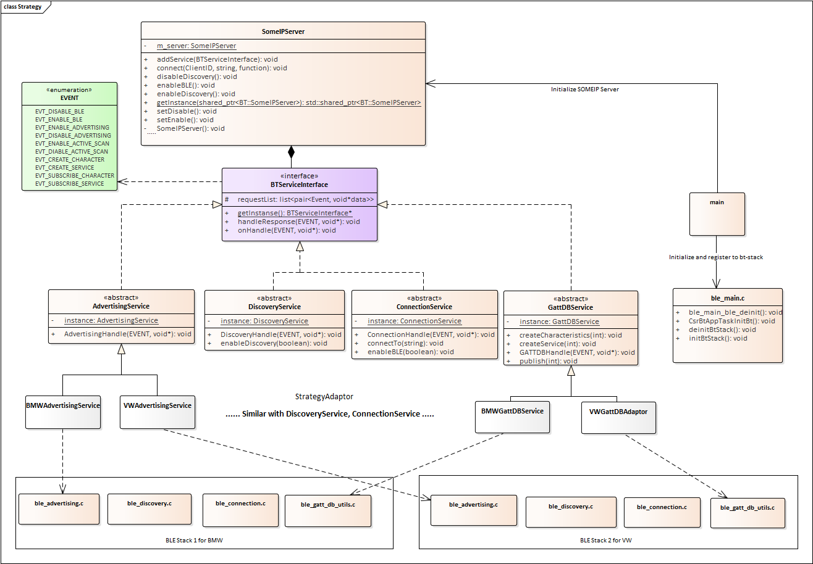
Image reference: doc_image_011.png

The descriptions of each class are as following:

Table 5. BLE commonization new class description

## Table
| Classes | Descriptions |
| --- | --- |
| BmwAdvertisingAdaptor | The child class of AdvertisingService class. It will handle advertising function of BmwSynergy stack |
| VWAdvertisingAdaptor | The child class of AdvertisingService class. It will handle advertising function of VWSynergy stack. |
| BmwDiscoveryAdaptor | The child class of DiscoveryService class. It will handle discovery function of BmwSynergy stack |
| VWDiscoveryAdaptor | The child class of DiscoveryService class. It will handle discovery function of VWSynergy stack |
| BmwConnectionAdaptor | The child class of ConnectionService class. It will handle connection function of BmwSynergy stack. |
| VWConnectionAdaptor | The child class of ConnectionService class. It will handle connection function of VWSynergy stack. |
| BmwGattDBAdaptor | The child class of GattDBService class. It will handle GattDB function of BWSynergy stack. |
| VWConnectionAdaptor | The child class of GattDBService class. It will handle GattDB function of VWSynergy stack. |

Connection state design

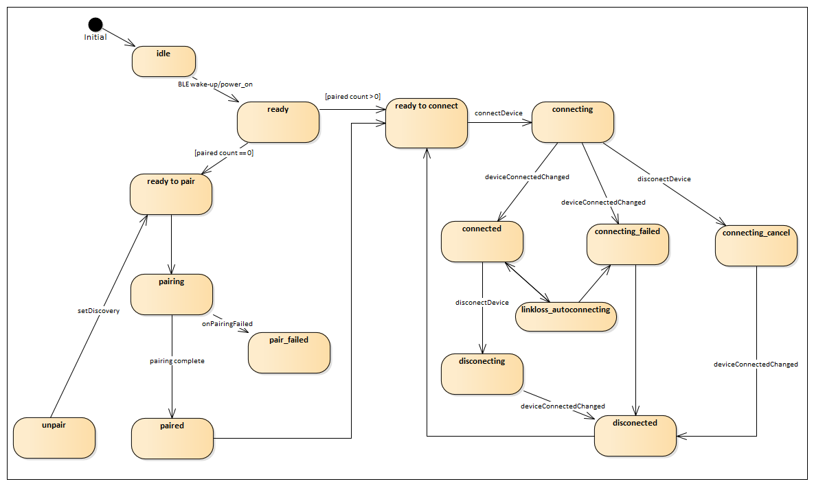
Image reference: doc_image_012.png

 					Figure 0-12. Connection state

Table 6. Descriptions for each state

## Table
| State | Descriptions |
| --- | --- |
| Idle | The standby state of Bluetooth LE means that the radio is idle |
| Ready | The system and BT stack Power state in on |
| Ready to pair | BLE manager app initialization is finished. Paired devices count is under 5. |
| Pairing | BLE is pairing with the device. |
| Paired | The device is paired. Setting for the paired device is finished. |
| Unpair | Unpair the paired device. |
| Pair failed | The device pairing is failed. |
| Ready to connect | Paired device exists. |
| Connecting | BLE is connecting with the device. |
| Conncted | The device is connected. |
| Disconnecting | BLE is disconnecting with the device. |
| Linkloss autoconnecting | Connecting state by link loss of the connected device. |
| Connecing failed | The device connecting is failed. |
| Disconnected | The device is disconnected. |
| Connecting cancel | User requests disconnecting the device in middle of connecting. |

Dynamic Design

Enable/disable BLE feature

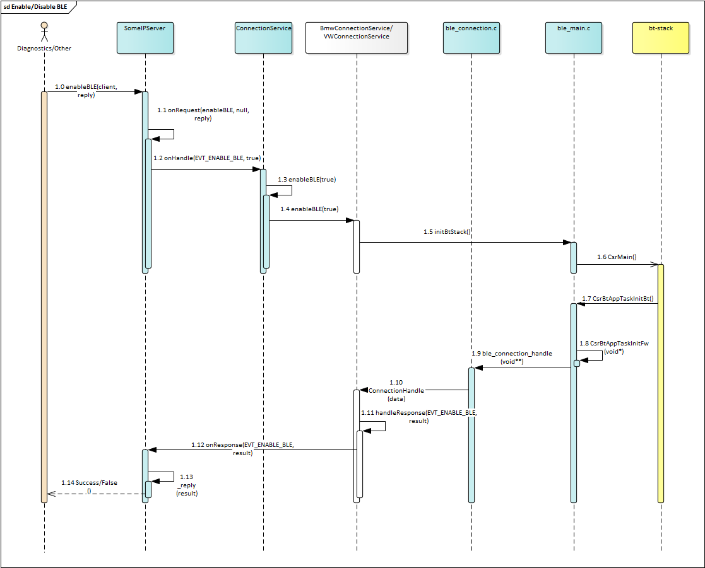
Image reference: doc_image_013.png

 Figure 0-13. Sequence diagram of Enable/disable BLE feature

       Table 7.Enable BLE step

## Table
| Step | Function | Description |
| --- | --- | --- |
| 1.0 | enableBLE | Client make request call via external API |
| 1.1 | onRequest | SOMEIPServer call to handle request, store callback function, determine handler service to handle |
| 1.2 | onHandle | ConnectionService handle incoming request |
| 1.3 | enableBLE | Call to enable BLE in abstract class with “true” is active |
| 1.4 | enableBLE | Call to enable BLE in Adaptor class with “true” is active |
| 1.5 | initBTStack | Prepare app configureation and init bt-stack |
| 1.6 | CSRMain | Stack API to init bt-stack |
| 1.7 | CsrBtAppTaskInitBt | Call to callback function to init listener event, CSR template function |
| 1.8 | CsrBtAppTaskInitFw | Init firmware |
| 1.9 | ble_connection_handle | Handle callback back when initialize app |
| 1.10 | ConnectionHandle | Parsing data result from CSR and response |
| 1.11 | handleResponse | Response data to caller |
| 1.12 | onResponse | Check corresponding callback response function |
| 1.13 | _reply | Callback to package data and response |

Connection with central mode diagram

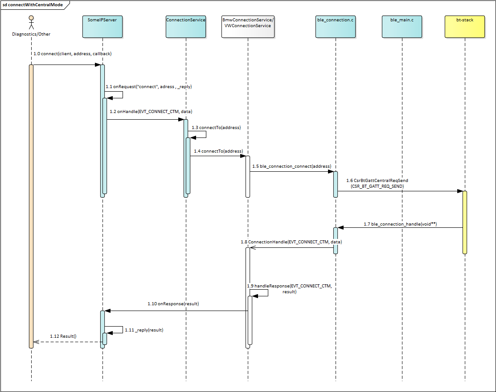
Image reference: doc_image_014.png

Figure 0-14. Connection with central mode diagram

       Table 8. Set connect device with central mode

## Table
| Step | Function | Description |
| --- | --- | --- |
| 1.0 | Connect | Client request connect to device with address |
| 1.1 | onRequest | Trigger request event |
| 1.2 | onHandle | Handle request connect to device |
| 1.3 | connectTo | Call to request connect |
| 1.4 | connectTo | Call to request connect to Adaptor class |
| 1.5 | ble_connection_connect | Wrapper API to connect to device address |
| 1.6 | CsrBtGattCentralRequestSend | Bt-stack handle connection request to device |
| 1.7 | ble_connection_handle | Handle response function call back |
| 1.8 | ConnectionHandle | Handle event response from wrapper API |
| 1.9 | handleReponse | Check result and response to caller |
| 1.10 | onResponse | Check callback event and response to client |
| 1.11 | _reply | Send data package result to client |

Connection with peripheral mode diagram

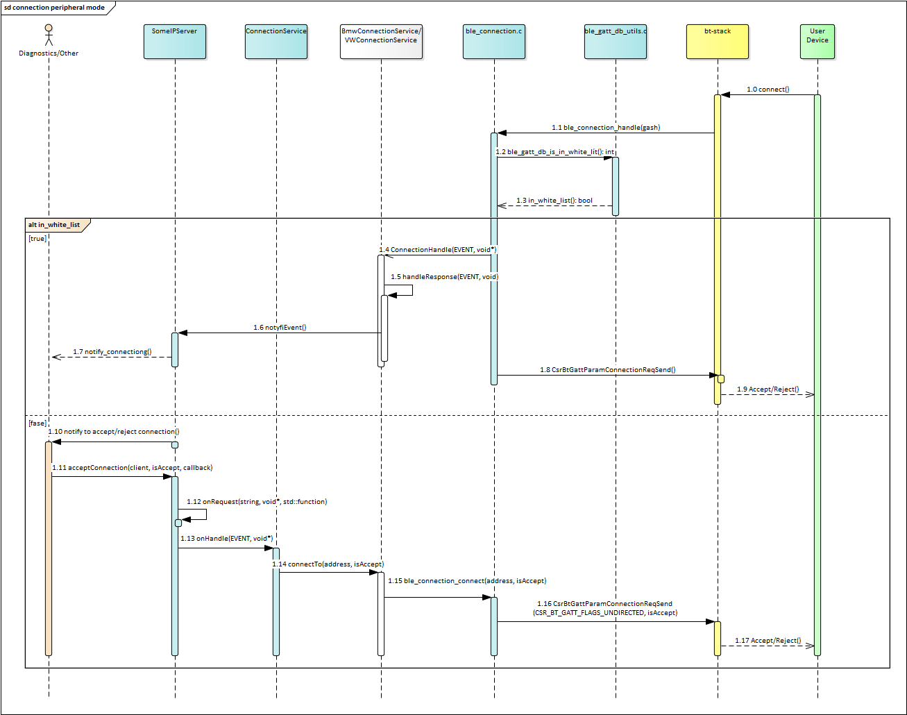
Image reference: doc_image_015.png

Figure 0-15. Connection with peripheral mode diagram

Table 9. Connection with peripheral mode step

## Table
| Step | Function | Description |
| --- | --- | --- |
| 1.0 | Connect | Request ble connect from user device |
| 1.1 | ble_connection_handle | Callback to handle new connection to ble app |
| 1.2 | ble_gatt_db_is_in_white_list | Check connecting device is in white list or not |
| 1.3 | in_white_list | Result device in white list or not |
| 1.4 | ConnectionHandle | Service handle connecting event |
| 1.5 | handleResponse | Handle connect device information, and notify to client |
| 1.6 | notifyEvent | Notify to client about connecting state or confirmation request |
| 1.7 | Notify connecting | Notify to client connecting status package |
| 1.8 | CsrBtGattParamConnectionReqSend | Call to accept connection |
| 1.9 | Connect result | Accept connect result package |
| 1.10 | Notify accept/reject connection | Because device is not in white list, so need confirm to accept connetion or not from client |
| 1.11 | acceptConnection | Client send confirm accept/reject incoming connection |
| 1.12 | onRequest | Server trigger request, store callback reply event and forward to service |
| 1.13 | onHandle | ConnectionService handle request |
| 1.14 | connectTo | Forward client action to accept/reject |
| 1.15 | ble_connection_connect | Wrapper API to handle accept/connect to device |
| 1.16 | CsrBtGattParamConnectionReqSend | Action accept or reject request |
| 1.17 | Accept/Reject | BLE package response to user device about accept/reject connection |

Create BLE services/characteristics

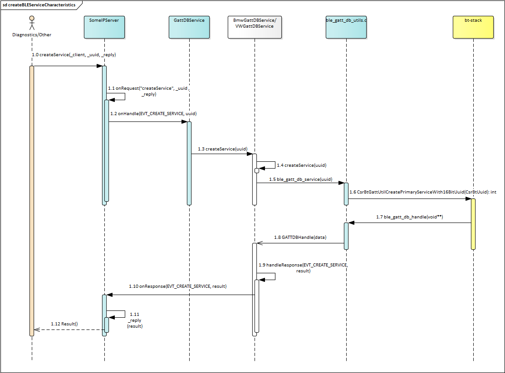
Image reference: doc_image_016.png

Figure 0-16. Create BLE service, characteristics diagram

Table 10. Create BLE service, characteristics steps

## Table
| Step | Function | Description |
| --- | --- | --- |
| 1.0 | CreateService | API to call from client to create service |
| 1.1 | onRequest | Checking request and store callback function |
| 1.2 | onHandle | Handle create service request |
| 1.3 | createService | Check uuid and create service |
| 1.4 | createService | createService to BmwGattDBAdaptor/ VWGattDBAdaptor |
| 1.5 | Ble_gatt_db_create_service | Wrapper function to create service |
| 1.6 | CsrBtGattUtilCreatePrimaryServiceWith16bitUuid | Bt-stack api to create service |
| 1.7 | Ble_gatt_db_handle | Handle response CSR data when finish create service |
| 1.8 | GATTDBHandle | Hanlde response result of bt-stack |
| 1.9 | handleResponse | Response data to SomeIPServer |
| 1.10 | onResponse | Response to corresponding callback function |
| 1.11 | _reply | Send data to client |

Verification results

In this chapter, I take an evaluation of the BLE communization architecture following proposal 2 “Strategy design pattern approach solution”, using predefined verification criteria. These criteria cover multiple dimensions, including modifiability, maintainability, and reusability. They serve as reference points for evaluating the design's effectiveness in addressing the issues highlighted in 1.6 Problems identify, and its ability to fulfill the highest-priority requirement outlined in 1.4 Quality Attributes.

Code complexity and maintenance consistency

With the chosen proposal, the code blocks that handle each different stack are isolated and implemented in different Adaptor classes. Therefore, in each new synergy stack, there will be no need for conditional statements to distinguish between these synergy stacks.

This refactoring makes the code clean, clear, and meets the single responsibility requirement. From the perspective of maintaining consistency, developers will find it easier to identify problems because each piece of code will be isolated in separate classes. This approach minimizes the risk of introducing new bugs when making changes, updates or additions to the code. Therefore, the final proposal effectively solves the first problem related to code complexity and significantly improves maintainability.

Integration of new chipset with new BLE stack

Below are the key steps to achieve this task:

Create the “Adaptor” Class

Start by creating a new class called "Adaptor" This class should inherit from the base class "BLE service abstract class".

Override relevant functions within the "BLE service abstract class" to align them to the specific requirements of new synergy stack.

Since the strategy pattern is applied in this design, the existing strategies can be reused.

These steps demonstrate the benefits of adhering to SOLID principles, particularly the Open-Closed Principle. All modifications are closed to the existing components, and the system remains open for extension. Adding new functionality simply involves introducing new code without the need to modify core code. This approach seamlessly supports the integration of a new synergy stack and satisfy both QA.001 and QA.002 requirements.

 	I tried to test some basic test case following 1.3. Function requirement to verify the BLE communization architecture following proposal 2 “Strategy design pattern approach solution”. The log is printed in each class to show the QA.002“The system shall easy to maintain”. Each functional stack will be handle by independent class.

Image reference: doc_image_017.png

Figure 0-17. The NRF connect app show advertising, connected and disconnected state when trying to test the design

Lessons Learned

In this chapter, I sum up the valuable insights I've gained from my project. It’s like looking back on a journey and thinking about the important moments, the challenges I faced, and the things that went well. These lessons help me get better and make smarter choices in future projects, especially on the architectural point of view. So, here is what I’ve learned from my project’s experiences:

Recognizing the Value of Design Phase: Understanding the significance of the design phase and how it contributes to long-term project success.

Adherence to SOLID Principles: The importance of adhering to SOLID principles, particularly the Open-Closed Principle, to ensure flexibility and extensibility in software architecture. Additionally, effectively applying design patterns, such as Strategy Pattern and Factory Method Pattern, to manage complex functionalities and maintain code clarity.

Importance of Requirement: Emphasizing the need of requirements, breaking down complex requirements into manageable components and ensuring each module has a well-defined role. Therefore promotes clarity and precision, ultimately contributing to a more effective and well-functioning system.

Effective Collaboration and Communication: Collaborating effectively and maintaining open, constructive communication with my mentor have been invaluable. One of the key lessons learned is the value of being open to feedback and willing to accept constructive criticism. This helps in refining ideas and making continuous improvements.

Thoughtful Analysis: Critical thinking involves questioning assumptions, avoid jumping to conclusions, and considering various viewpoints. Relying on evidence and data for decision-making has significantly improved my problem-solving abilities.
