# Raw Slide Content

- Source file: manh.nguyen_BLE commonization architecture/manh.nguyen_BLE commonization architecture/BLE commonization architecture_v1.5.pptx
- Total slides: 20

## Slide 1

Bluetooth Low Energy Commonization Architecture

- By Manh.nguyen
- Supervised by Sanghyup.lee
- LGEDV Vehicle Network Team
- October 2024

FA 인증과제

## Slide 2

Table Content

Overview & Problem Identification
Architecture Design Proposals
Comparison
State Design & Architecture Diagram
Q&A

## Slide 3

1. Overview & Problem Identification

BLE(Bluetooth Low Energy) current architecture in BMW ICON

BLE(Bluetooth Low Energy) functional requirement

Image reference: slide_03_image_01.jpg

Image reference: slide_03_image_02.jpg

## Slide 4

Quality Attribute

### Table
| QA ID | QA | Priority | Description |
| QA.001 | Modifiability, Reusability | High | When applying a new BLE stack, the common part should be minimized changes. |
| QA.002 | Maintainability | High | The BTManagerService should be easy to maintain. |
| QA.003 | Extensibility | High | The BTManagerService should be easy to extend |
| QA.004 | Performance | Medium | BLE manager service must be enable and ready within 2sec count from NAO mode wake-up. |
| QA.005 | Reliability | Low | BLE manager should handle all command requests, callback events without missing commands and events |

Constraint

### Table
| No | Description | Constraint Type |
| 1 | Using BT-stack provided by Qualcomm or other vendor to interactive with Bluetooth chipset. | Technical constraint |
| 2 | Using SOME/IP to interactive with other module, API is generated follow template. | Technical constraint |

## Slide 5

1. Problem Identification

BLE(Bluetooth Low Energy) current architecture in BMW ICON

Problems arising from current design:
The negative impact on existing components when integrating a new chipset with a new Bluetooth stack.
The difficulty of expanding and reusing BtManagerService when integrating a new Bluetooth stack.

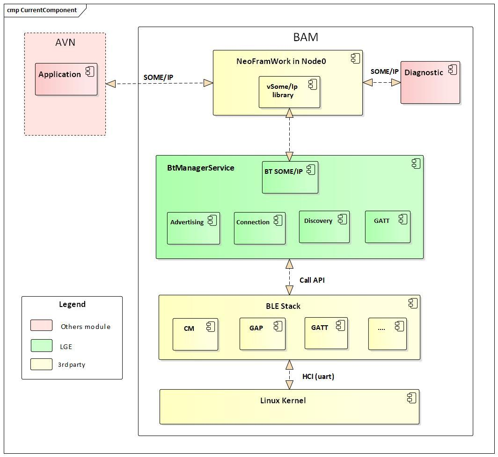
Image reference: slide_05_image_01.jpg

Add other BT chipset stack(Eg:VW- Infineon chipset)

Image reference: slide_05_image_02.png

## Slide 6

Proposal 1: Façade design pattern approach solution

BLE current architecture in BMW ICON

Façade component proposal architecture

Component design

Image reference: slide_06_image_01.jpg

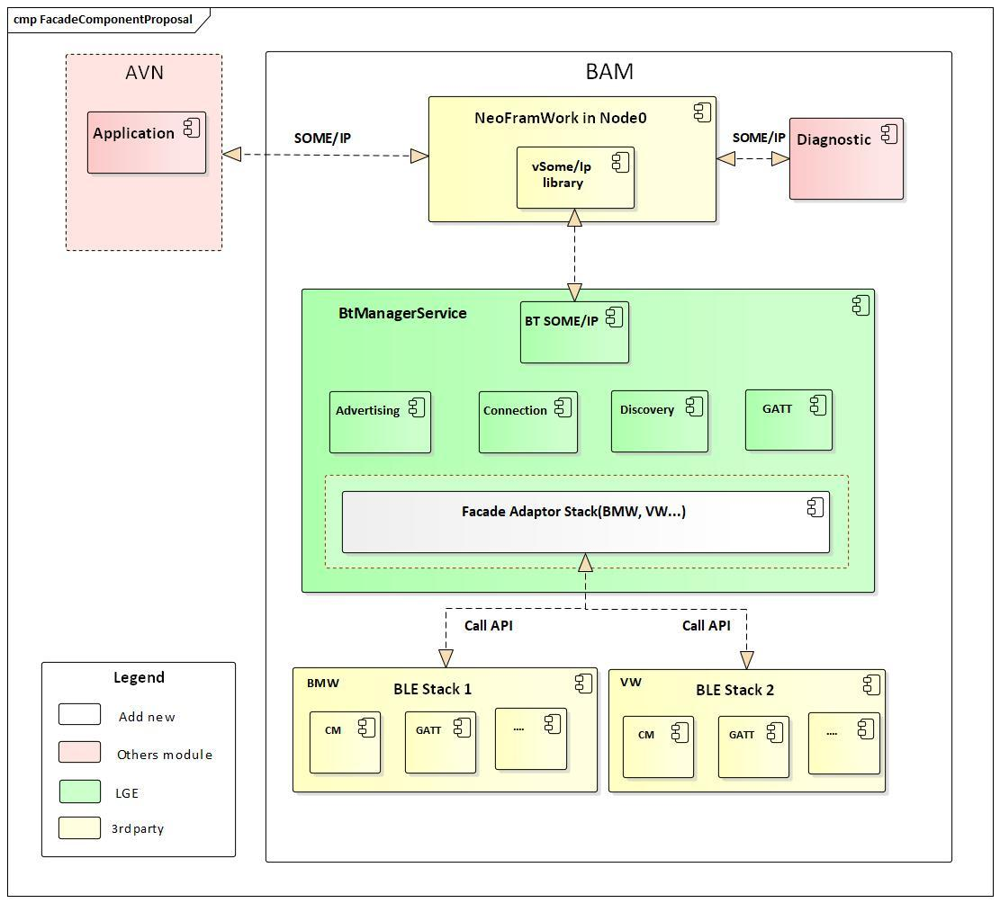
Image reference: slide_06_image_02.jpg

## Slide 7

Proposal 1: Façade design pattern approach solution

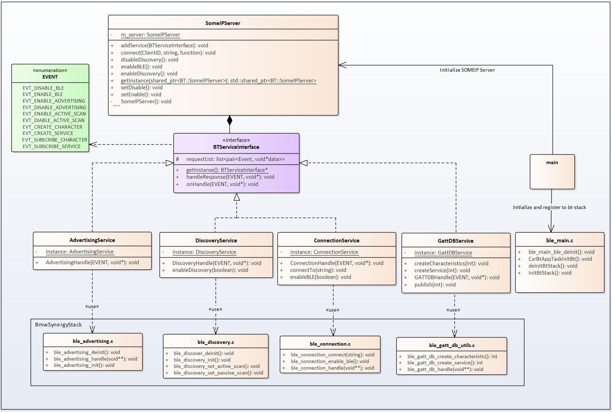
Image reference: slide_07_image_01.png

Pros:
Maintainability: Minimize the impact on the existing class.
Reusability: Façade adaptor can be reused when integrating the new Bluetooth stack.
Cons:
Complexity of the code will increase when more Bluetooth stack is applied, because we need to add or integrate new APIs into adaptor class.

Current class diagram of BLE in BMW ICON

Class diagram after add new Façade adaptor

Class diagram design

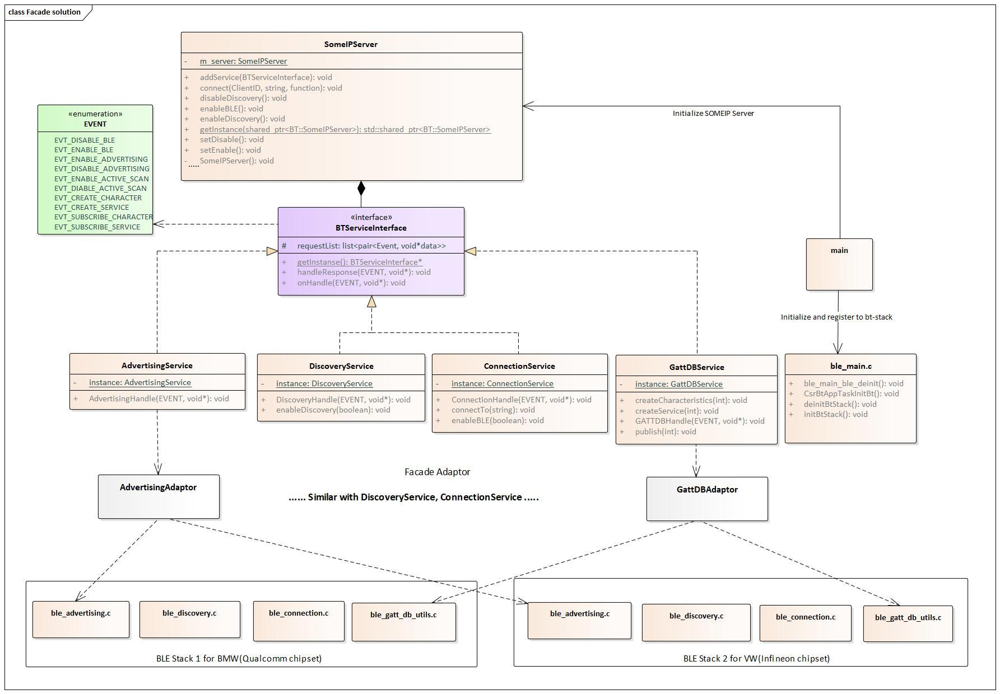
Image reference: slide_07_image_02.jpg

Legend
              Common area
              New adaptor class

## Slide 8

Proposal 2: Strategy design pattern approach solution

BLE current architecture

Strategy component proposal architecture

Component design

Image reference: slide_08_image_01.jpg

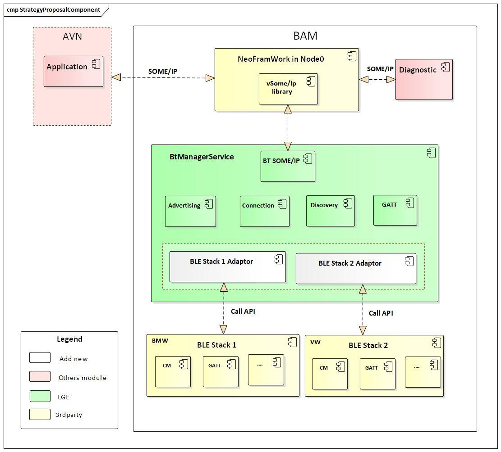
Image reference: slide_08_image_02.jpg

## Slide 9

Proposal 2: Strategy design pattern approach solution

Pros:
Open-Closed Principle: We can easily extend and incorporate new behavior without changing the application.
Ensure the Single responsibility principle (SRP)
Reduced code complexity: By reducing code duplication, the code result is cleaner and more maintainable.
Cons:
BLE manager base on new design will take more effort to refactor.

Class diagram after adding new strategy adaptor class

Class diagram design

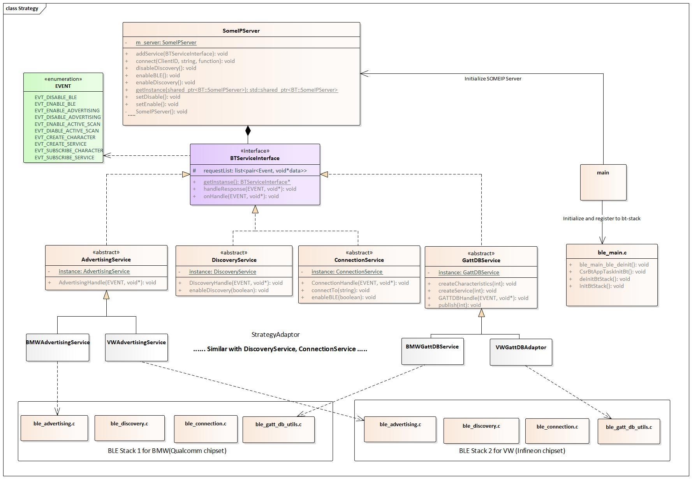
Image reference: slide_09_image_01.jpg

Legend
                 Common area
                 New class & OEM depend area

## Slide 10

Proposal 2: Strategy design pattern approach solution

Class diagram after adding new strategy adaptor class

Class diagram design

QA.001: Modifiability, Reusability
-> When applying a new BLE stack, the common
 part should be minimized changes
QA.002: Maintainability and QA.003: Extensibility
-> The BTManagerService should be easy to maintain/extend.

Image reference: slide_10_image_01.jpg

Legend
                 Common area
                 New class & OEM depend area

## Slide 11

 Comparison and Decision

-> In this project I choose design 2.

### Table
| Design No | QA: Maintainability | QA: Modifiability | QA: Reusability | QA: Extensibility |
| Current | High, It is easy to maintain because of it only support for one BLE chipset stack. | High, it is easy to modify and has less impact on current logic. | NO, We cannot reuse the source code if require integrate other BLE chipset stack. | NO, It’s hardly extends because the design only focus support only one BLE chipset stack. |
| Design 1 | Medium, Because the “Façade adaptor” need to integrate or adapt with multiple BLE chipset stack which leads to the complexity. So, it’s difficult to maintain. | High, When applying the new BLE chipset stack only require modify on the “Façade service adaptor”. | High, It is able to reuse BLE manager service class and Façade adaptor class. | Medium, It able to extend with this design But We can face with difficult integrate code. |
| Design 2 | High, Because we only focus on develop extended part. So, it’s easier to manage and maintain. Ensure the Single responsibility principle. | High, When applying a new synergy stack only new strategy adaptor class needs to be add/modified. | High, It is able to extend with this design and reuse the BLE manager service abstract class. | High, It is able to extend because of We can easily make a class inheritance from a base class (BLE service abstract class). |

## Slide 12

Architectural Diagram

New class involve to handle logic of Enable/disable BLE feature

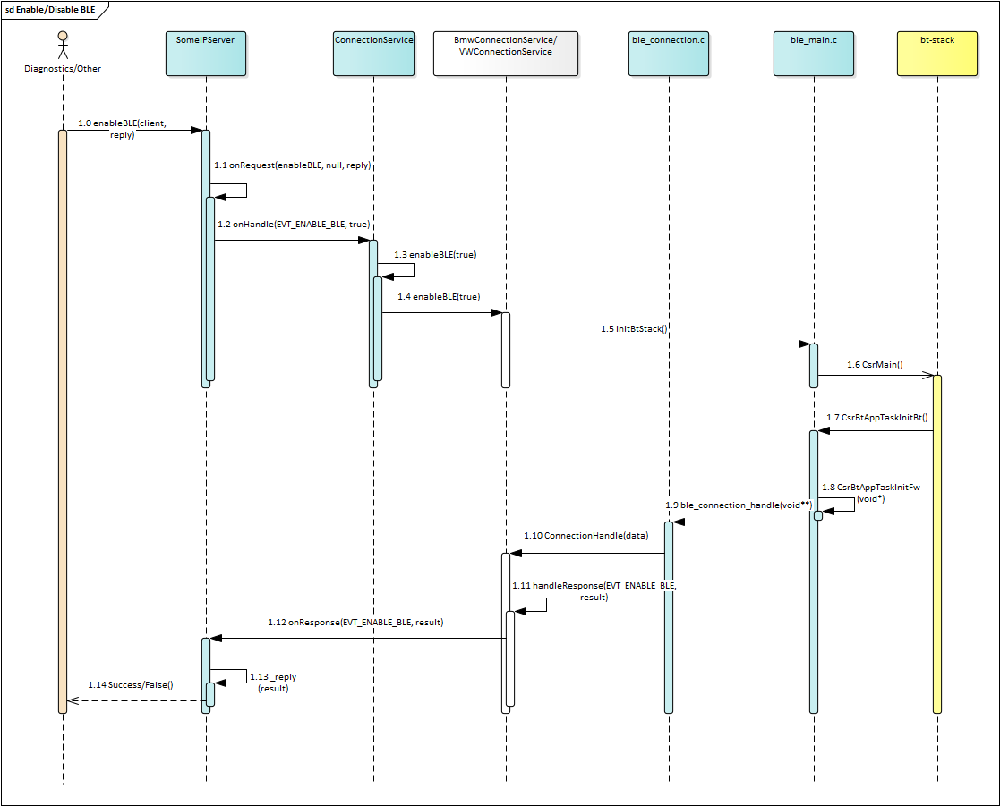
Image reference: slide_12_image_01.png

## Slide 13

Connection state design

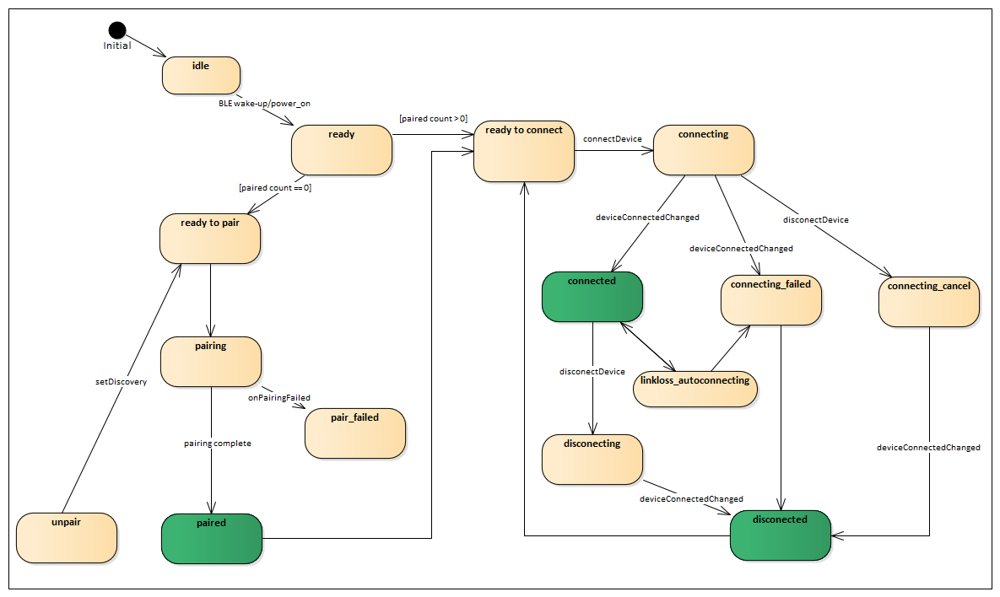
Image reference: slide_13_image_01.png

## Slide 14

Q&A
Thank you for listening!

## Slide 15

3 Scan Device
start ScanDevice timeOut = 5s
BmwDiscoveryService::scanDevice [API] searchTimeOut [5000]       phandle [16]
----------Menu----------
1. setConnect
2. start Advertising
3. Scan Device
5. SetDisconnect
6. Stop Advertising
7. Stop ScanDevice
BmwDiscoveryService::searchResultIND        addrress [64:9e:60:b9:87:d2]    type [BR][LE]   name [Xiaomi 11TTT]
BmwDiscoveryAdaptor::ble_discovery_handle_sd_prim ------------STOP  SCAN DEVICE ------------

             Appendix
Verification design result

## Slide 16

1 setConnect
Public : 0
Private : 1
1
Enter MAC address 64:9e:60:b9:87:d2
BmwConnectionService::setConnect [API]    Type = [1]      address [64:9e:60:b9:87:d2]
----------Menu----------
1. setConnect
2. start Advertising
3. Scan Device
5. SetDisconnect
6. Stop Advertising
7. Stop ScanDevice
BmwConnectionService::CsrBtGattConnectIndHandle      address [64:9e:60:b9:87:d2]     btConnId [1048576]  resultCode = [0]
BmwConnectionService::BleConnectIndHandle  address [64:9e:60:b9:87:d2]     type: CM_CONNECTION_NOTIFY Finish

## Slide 17

5 Disconnect
BmwConnectionService::setDisConnect [API] address [64:9e:60:b9:87:d2]
----------Menu----------
1. setConnect
2. start Advertising
3. Scan Device
5. SetDisconnect
6. Stop Advertising
7. Stop ScanDevice
BmwConnectionService::CsrBtGattDisconnectIndHandle   address [64:9e:60:b9:87:d2] btConnId [1048576] resultCode = [0]
BmwConnectionService::BleDisConnectIndHandle  address [64:9e:60:b9:87:d2] type: CM_DISCONNECTION_NOTIFY Finish

## Slide 18

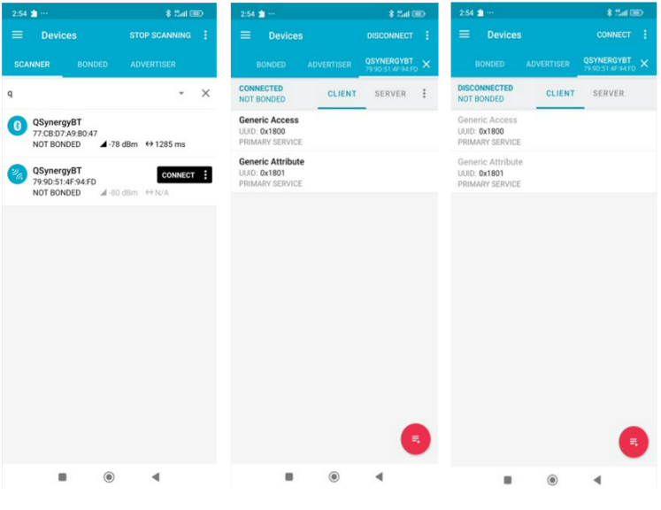
Image reference: slide_18_image_01.png

## Slide 19

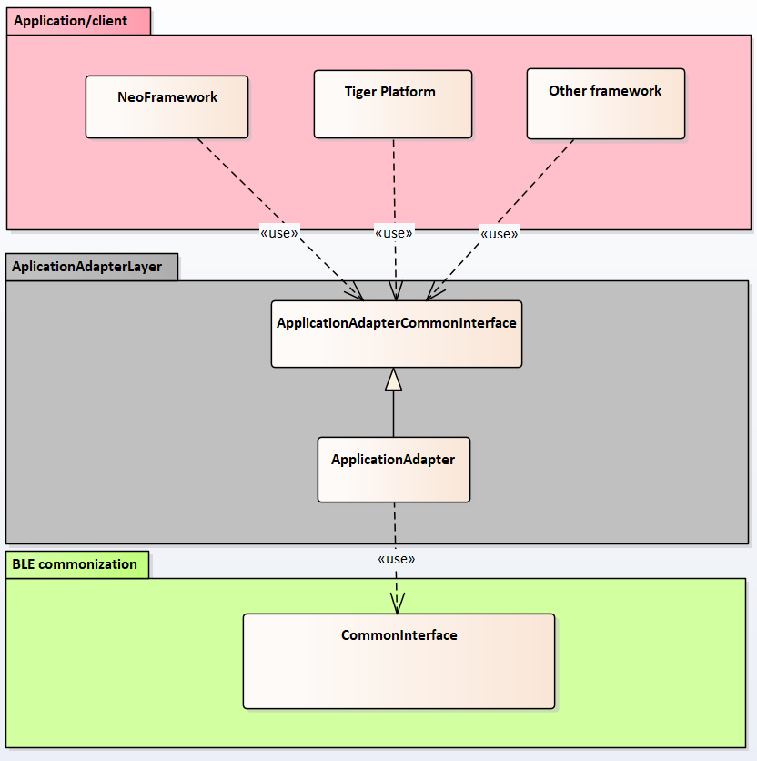
Image reference: slide_19_image_01.png

Remove the dependency with platform specific interfaces in application suggestion

## Slide 20

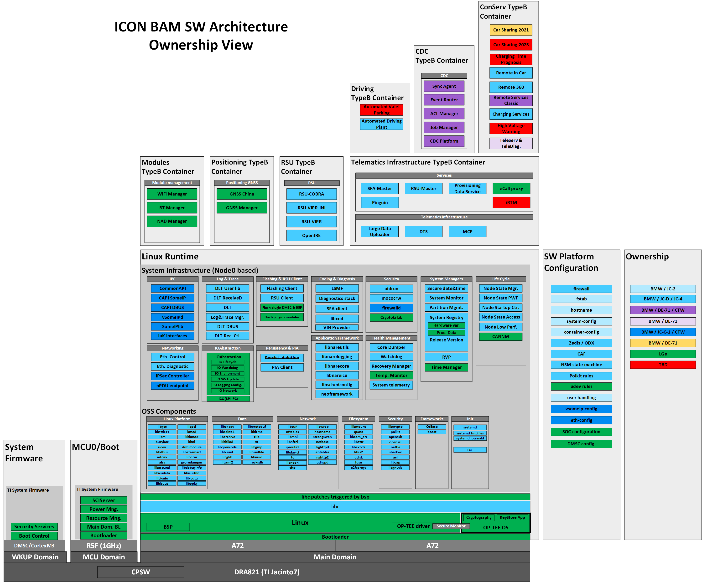
Image reference: slide_20_image_01.png

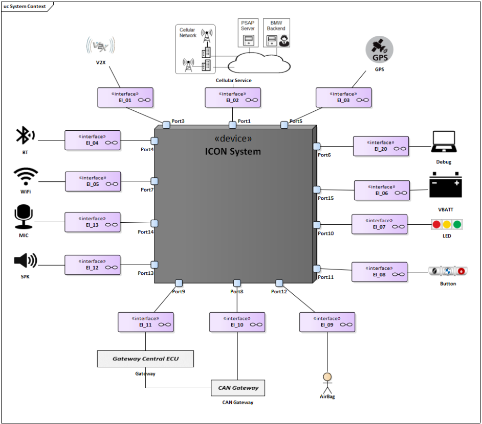
Image reference: slide_20_image_02.png

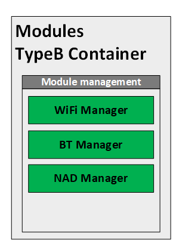
Image reference: slide_20_image_03.png

Need develop BT Manager for control connection

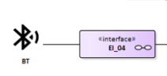
Image reference: slide_20_image_04.png

Support Bluetooth LE  Connection

