# Raw Document Content

- Source file: VR_Common_Service_de.tong/FA_VR_Common_Service_v2.6.docx

Function Architect Task

Voice Recognition Common Service

Author: Tong Tran Hoang De – Audio Unit – LGEDV

Mentor: Ms. Eunhee Jeong - SW Architect Unit

Revision History

## Table
| Version | Date | Comment | Author | Approver |
| --- | --- | --- | --- | --- |
| 1.0 | 2025-08-01 | Initial Release | Tong Tran Hoang De |  |
| 1.1 | 2025-08-18 | 1. Update Problem’s Description with diagram 2. Update Static and Dynamic design diagrams of Alternative 1 and Alternative 2 3. Update class’s description | Tong Tran Hoang De |  |
| 1.2 | 2025-08-21 | Update static design and Dynamic design on section 4 | Tong Tran Hoang De |  |
| 1.3 | 2025-08-28 | 1. Update Figure 8, 10. Remove GCP-IPC Socket, create, and call methods… 2. Update Figure 9, 11 from sequence diagram to C&C view and text description 3. Update chapter 3.3 | Tong Tran Hoang De |  |
| 2.0 | 2025-09-08 | 1. Update Chapter 4 - Architecture Drivers 2. Update sequence diagrams on chapter 4.3 3. Update class diagram | Tong Tran Hoang De |  |
| 2.1 | 2025-09-09 | Correct chapter number | Tong Tran Hoang De |  |
| 2.2 | 2025-09-11 | Update section 6 and sequence diagram 5.3.5 | Tong Tran Hoang De |  |
| 2.3 | 2025-09-16 | 1. Update problem description, Quality Attributes requirements 2. Add chapter 4.1 3. Update measurement data on chapter 6 | Tong Tran Hoang De |  |
| 2.4 | 2025-09-18 | Update comparison detail on chapter 4.4 | Tong Tran Hoang De |  |
| 2.5 | 2025-09-23 | Update Figure 11, Figure 12, Figure 16, Figure 18 | Tong Tran Hoang De |  |
| 2.6 | 2025-09-26 | 1. Correct grammar and improve wording 2. Add new Figure 9 | Tong Tran Hoang De |  |

Acronyms / Glossary

## Table
| Glossary | Description |
| --- | --- |
| AASB | Alexa Auto Services Bridge |
| ASR | Automatic Speech Recognition |
| CCF | Car Configuration File |
| DPA | Digital Personal Assistant |
| ECNR | Echo Cancellation and Noise Reduction |
| GCF | Generic Communication Format |
| GUI | Graphic User Interface |
| IPC | Inter Process Communication |
| IVI | In-vehicle Infotainment |
| JLR | Jaguar Land Rover |
| NGI | Next-Generation Interface |
| SDK | Software Development Toolkit |
| TTS | Text To Speech |
| UI | User Interface |
| VR | Voice Recognition |
| WuW | Wake-up-Word |

Figures

Figure 1 - Cerence VR	6

Figure 2- Alexa VR	6

Figure 3- TmallGenie VR	7

Figure 4: Current PIVI Architecture	7

Figure 5 - Audio Passthrough event	9

Figure 6 - Audio focus rejected	10

Figure 7 - Centralized VR	10

Figure 8 - Propose PIVI Architecture	12

Figure 9 - Design proposal C&C View	13

Figure 10 - SpeechService static design	13

Figure 11 - AlexaService static design	14

Figure 12 - Static design of Alternative 1	16

Figure 13 – Alternative 1 C&C View	17

Figure 14 - Static design of Alternative 2	18

Figure 15 – Alternative 2 C&C View	19

Figure 16 - Class Diagram of Alternative 2	21

Figure 17 - Communication flow	22

Figure 18 - Initialization sequence	23

Figure 19 - Hotword sequence	24

Figure 20 - Call contact sequence	25

Figure 21 - Show Climate	26

Figure 22 - Weather information query	27

Tables

Table 1 - Functional requirements	11

Table 2 - Quality Attributes	11

Table 3 - SpeechService class description	13

Table 4 - AlexaService class description	15

Table 5 - Main component and class description of Alternative 1	16

Table 6 - Main component and class description of alternative 1	18

Table 7 - Quality Attribute comparison between Alternatives	20

Table 8 - Main class description	21

Table 9 – Interfaces description	22

Table 10 - Performance measurement	28

Table 11 - Memory and CPU measurement	28

Project Overview

Introduction

Proteus IVI is a QNX-based Automotive Head Unit platform which aims to deliver infotainment feature to the users of Jaguar/Land-Rover vehicles. Voice Recognition feature is a part of JLR NGI System that allows users to access and control various domains such as navigation, phone and messaging, media… by using voice rather than GUI interaction. Besides, voice system also provides visual prompts, help commands to guide the user and support most of the language in Europe, US, Asian. Multiple voice engines can co-exist in the system.

Below are prompt UI for each VR. Alexa and TmallGenie used same prompt UI but different app icon.

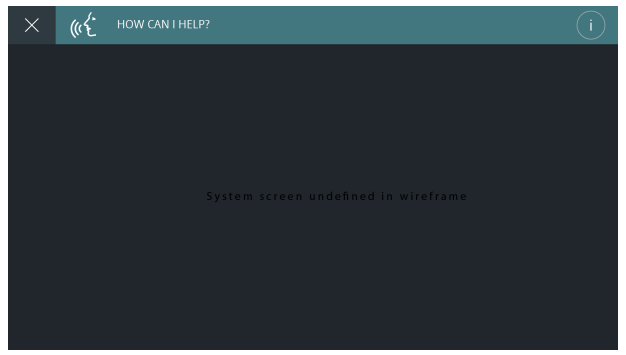
Image reference: doc_image_001.png

Figure 1 - Cerence VR

Image reference: doc_image_002.png

Figure 2- Alexa VR

Image reference: doc_image_003.png

Figure 3- TmallGenie VR

Project Architecture

Below is the current architecture of P-IVI system, focusing on VR and related components:

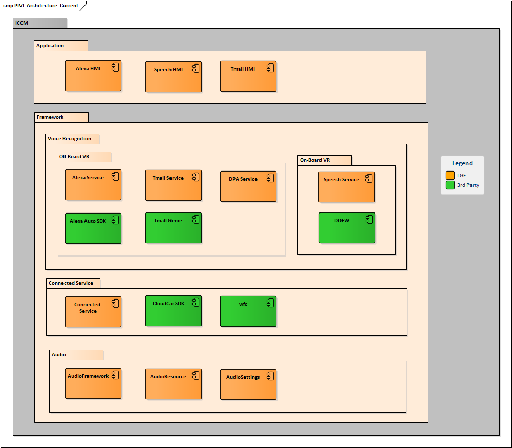
Image reference: doc_image_004.png

Figure 4: Current PIVI Architecture

The system uses basic Linux IPC:

Asynchronous IPC through message queue

Synchronous IPC through message passing

Shared memory

Broadcast through PPS (Persistent Publish/Subscribe)

Each voice engine is wrapped in different services which run on separate process. Availability of VR is controlled by CCF based on target market or by authentication status.

DDFW provided by Cerence support both on-board and off-board ASR while Alexa and TmallGenie only support off-board ASR. And off-board communication can be archived due to the help of Connected Service framework and DPA Service. Audio Framework will handle queries related to Audio resources from voice engines, support open microphone for input stream and speaker for output TTS playback.

Problem Description

As per the system design, voice engines from different vendors were integrated and handled separately by different services. This leads to several problems and limitations:

CPU and Memory consumption is increase because of the allocation for service’s process. Each service might also initialize its own audio pipeline, leading to duplicate Memory and CPU Usage

Extensibility is very limited since a new service is required whenever OEM wants to introduce a new voice engine to the system

Maintenance is difficult since the design structure of each service is not the same

DPA VR (Alexa, Tmall) used Cerence voice engine to recognize its WuW, and ECNR will also be done via Nuance SSE (Speech Signal Enhancement). Hence, additional IPC APIs are required to communicate between SpeechService and AlexaService/TmallService to inform audio pass through event.

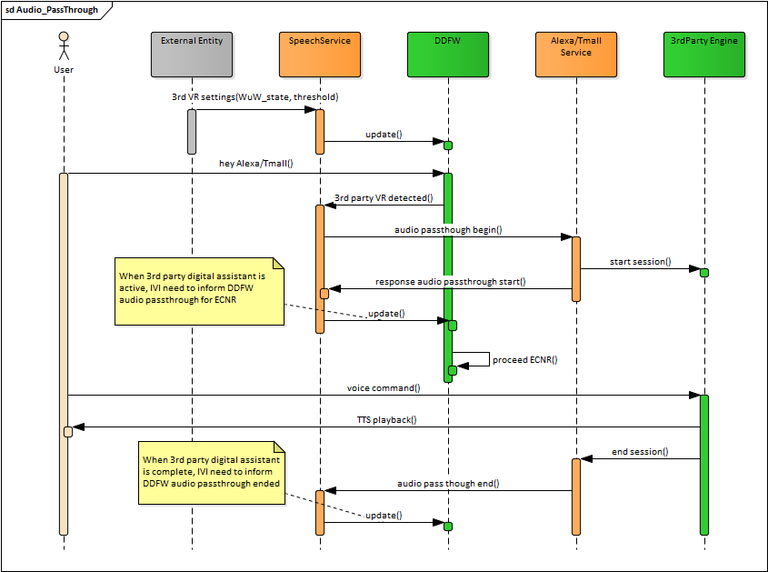
Image reference: doc_image_005.png

Figure 5 - Audio Passthrough event

Furthermore, PIVI’s audio policy follows last-win approach. So, when multiple clients request audio focus at the same time, resources are only granted to the client that make final requests and Audio Framework do not allow more than 2 requests granted at the same time. If other engines do not handle Audio focus callback properly, request audio focus will get rejected.

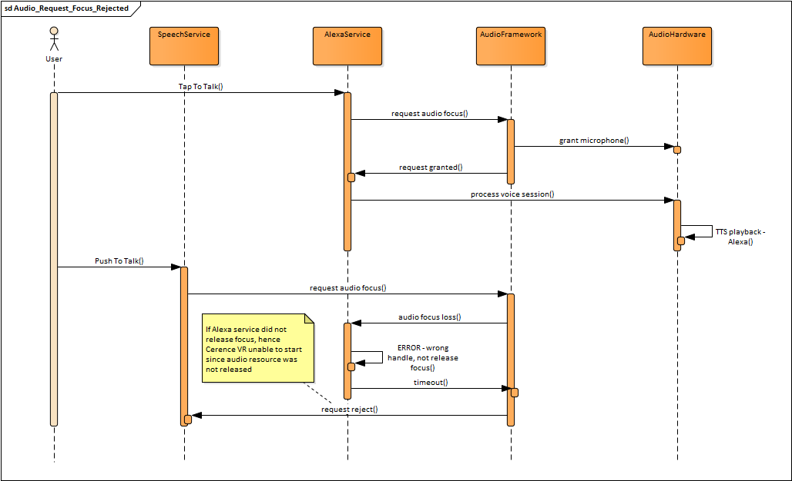
Image reference: doc_image_006.png

Figure 6 - Audio focus rejected

So, without centralized VR’s management, focus transitions such as ducked, released, paused… might not be handled consistently. Other engines may steal focus from another which cause audio glitches, leading to interruptions or unexpected behavior. With centralized VR, we can prevent the issue from happening in the first place. Moreover, it also depends on project’s requirements to decide whether new voice session will be blocked, or new voice session can be started, and current voice session must be terminated. So centralized VR increased flexibility to adapt with specific project’s requirements without audio policy intervention.

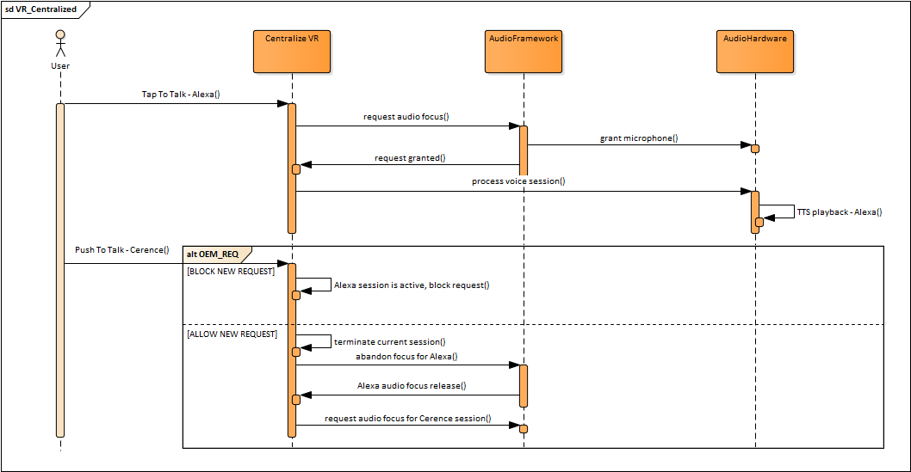
Image reference: doc_image_007.png

Figure 7 - Centralized VR

Architecture Drivers

3.1 Functional Requirements

Table 1 - Functional requirements

## Table
| Requirement ID | Functional Requirements |
| --- | --- |
| FAD_Voice_Pure_2 | The Speech control system comprises Speech recognition, ECNR for the mic input signal to the speech system and Text to Speech output |
| FAD_Voice_Pure_2 | The System supports activation by Press to Talk (PTT) and wake word activation |
| FAD_Voice_Pure_5 | The system checks loaded dictionary status and current recognition status and indicates to the user commands that can be given |
| Digital_Pers-6555894 | 3rd party Digital Personal Assistant feature allows the user to interact with the IVI system to achieve tasks and goals by voice using conversational natural language |
| Digital_Pers-6555894 | The 3rd party Digital Personal Assistant feature shall require Internet connectivity via the IVI system utilizing the embedded connectivity SIM (E-SIM) or the personal SIM (P-SIM) for off board communication |
| Digital_Pers-6555894 | The driver shall be able to initiate the 3rd Party DPA feature as an available speech feature using Wake up Word recognition or via the press of a button |

3.2 Quality Attributes Requirements

Table 2 - Quality Attributes

## Table
| QA ID | QA | Description |
| --- | --- | --- |
| DPR_Voice_53 | Performance | The voice input subsystem will be able to start speech session and recognize a user utterance within 15 seconds of the infotainment system starting |
| DPR_Voice_55 | Performance | The time taken from the user request to start a voice session to hear the listening tone (prompt to speak) will be no more than 500ms |
| DPR_Voice_31 | Usability | The voice system will be able to detect the fitments in the vehicle and limit its features automatically |
| DPR_Voice_77 | Usability | The user will be able to cancel the ongoing speech session either by command or appropriate button press |
| DPR_Digital_Personal _Assistant_286 | Usability | The IVI system shall interrupt ongoing Alexa voice session when a new voice session is requested |
| DPR_Digital_Personal _Assistant_288 | Usability | When Alexa SDK requests IVI to start streaming the microphone input, the IVI system shall start streaming microphone audio from the audio passthrough provided by native speech to the Alexa SDK |
| DPR_Voice_50 | Reliability | All the voice system settings and the user preferences shall be preserved across power cycles |
| DPR_Voice_90 | Supportability | Every message exchanged between speech middleware framework and speech application to show a view to user shall be logged as part of the standard DLT logging and as such must be logged with full time and date stamp |

Architecture Proposal

The main target of the proposal is to create a low coupling and high cohesion design but still archive design prerequisites of each VR regarding Functional Requirements and Quality Attributes Requirements. Easy to add new functionalities or new VR without significantly altering the existing core structure or code. This document will focus on describing the design combination of Alexa VR and Cerence VR.

Below is the proposal architecture of P-IVI system after changes, there would be a single service to wrap all the existing and potentially new voice engines:

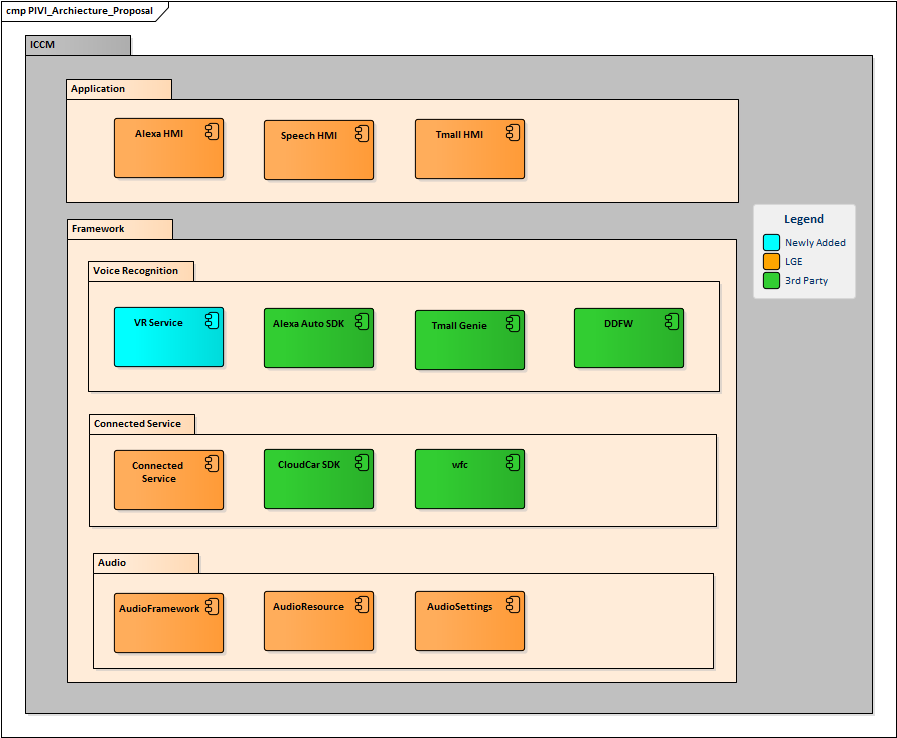
Image reference: doc_image_008.png

Figure 8 - Propose PIVI Architecture

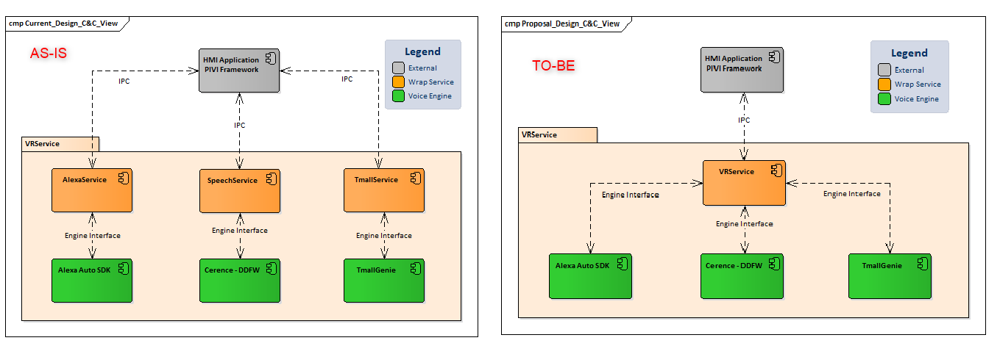
Image reference: doc_image_009.png

Figure 9 - Design proposal C&C View

4.1 Current design

Before jump right in to design proposal, let us review the current design of SpeechService and AlexaService to have the better understanding and comparison.

4.1.1 SpeechService

Static design of AlexaService:

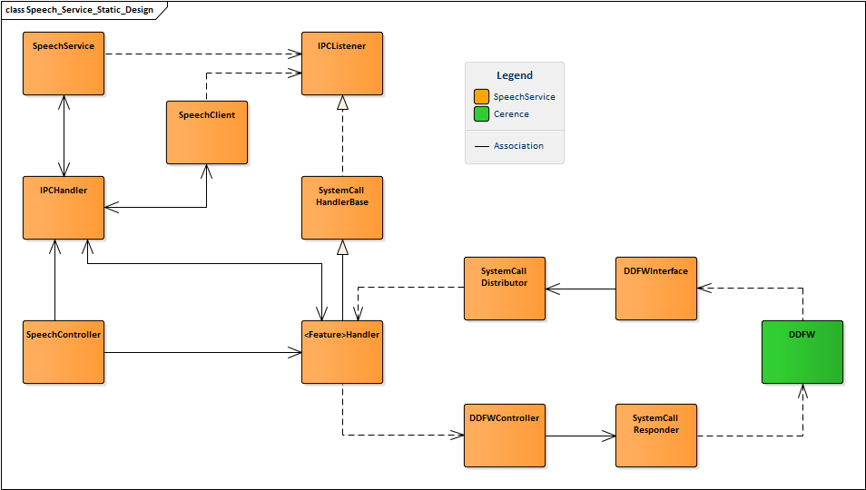
Image reference: doc_image_010.png

Figure 10 - SpeechService static design

Main class description of SpeechService:

Table 3 - SpeechService class description

## Table
| Name | Type | Description |
| --- | --- | --- |
| IPCHandler | Class | Support IPC between <Feature>Handler and external frameworks |
| SpeechService | Class | Receive request from external frameworks |
| SpeechClient | Class | Listen to event callback from external frameworks |
| SpeechController | Class | Control overall operation of service. Load and proceed CCF, init main classes, create all handlers |
| SystemCallHandler Base | Class | Base class of handler, representing communication between DDFW and <Feature>Handler. |
| IPCListener | Class | Base class, representing communication between external service and < Feature >Handler. |
| <Feature>Handler | Class | Containing specific logics of Cerence voice control. |
| DDFWController | Class | Receive requests from handlers, handle message and forward requests |
| SystemCallResponder | Class | Create GCF message and communicate with DDFW |
| DDFWInterface | Class | Receive callback message from DDFW |
| SystemCallDistributor | Class | Clarify GCF message type and message ID, trigger request to corresponding handler |
| DDFW | Object | Cerence voice engine |

4.1.2 AlexaService

Static design of AlexaService:

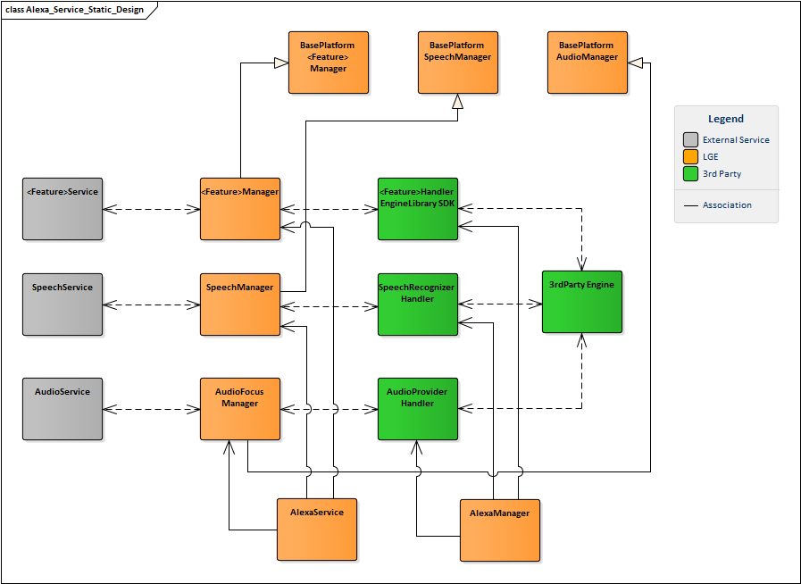
Image reference: doc_image_011.png

Figure 11 - AlexaService static design

Main class description of AlexaService:

Table 4 - AlexaService class description

## Table
| Name | Type | Description |
| --- | --- | --- |
| AlexaService | Class | Create and init all managers. Handler external service connection and manage engine life cycle |
| <Feature>Manager | Class | Contain domain specific logic, handle communication with external services |
| SpeechManager | Class | Handle voice session, communication with native SpeechService |
| AudioFocusManager | Class | Handle audio resource, focus state. communication with native AudioService |
| BasePlatform <Feature>Manager | Class | Base class of <Feature>Manager |
| BasePlatform SpeechManager | Class | Base class of SpeechManager |
| BasePlatform AudioManager | Class | Base class of AudioFocusManager |
| AlexaManager | Class | Create and init all handlers. Create and set up Alexa core engine |
| <Feature>Handler EngineLibrary SDK | Class | Contain AASB messages, handle communicate with Alexa SDK regarding specific <feature> domain |
| SpeechRecognizer Handler | Class | Contain AASB message regarding voice session control: start capture, handle WuW, start/end of speech session |
| AudioProviderHandler | Class | Contain AASB message regarding audio control: set input audio pipe, start/stop streaming… |
| Alexa SDK | Object | Containing core engine of Alexa, Message Broker and Alexa Voice Service Cloud SDK |

As we can see, SpeechService and AlexaService had different ways to handle IPC and internal classes communication. From design perspective, centralizing IPC package and re-use its source code would be a good approach.

To implement new VRService, I list down main things and steps to be taken:

Implementing new VRService repository

Define VRService MQ path

Add service build and filesets

Modify process_config.json

Modify MQ path of HMI applications

4.2 Alternative 1 – Centralized IPC

4.2.1 Static View

Static design of first alternative as below:

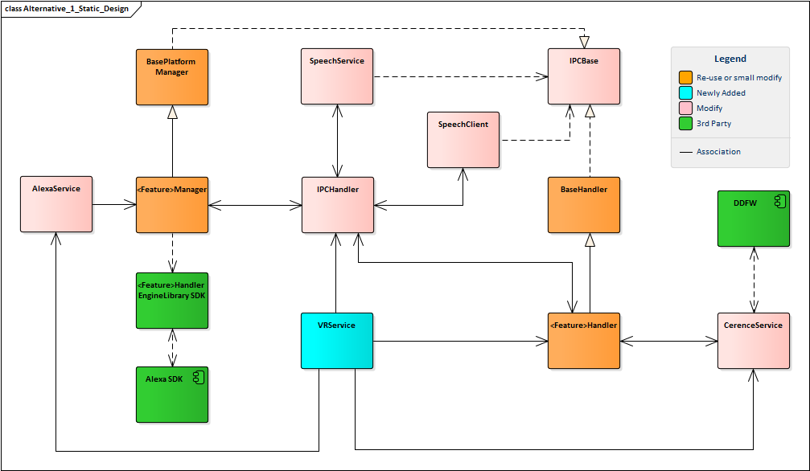
Image reference: doc_image_012.png

Figure 12 - Static design of Alternative 1

The main purpose of this design is to utilize source code and design from existing services as much as possible. <Feature>Manager which contains Alexa domain control logic and <Feature>Handler which contain Cerence domain control logic will be re-used with a small modification. By doing this, we can also re-use IPC classes which are responsible for communication with external frameworks and applications.

Main component and class descriptions:

Table 5 - Main component and class description of Alternative 1

## Table
| Name | Type | Description |
| --- | --- | --- |
| IPCHandler | Class | Support IPC between <Feature>Handler and external frameworks |
| IPCBase | Class | Base class, representing communication between external services and <Feature>Handler. |
| SpeechService | Class | Receive request from external frameworks and HMI applications |
| SpeechClient | Class | Listen to event callback from external frameworks and HMI apps |
| VRService | Class | Control overall operation of service. Load and proceed CCF, init main classes: AlexaService, CerenceService, IPC related classes… |
| CerenceService | Class | Handle GCF communication with DDFW, create Cerence handlers |
| BaseHandler | Class | Base class of Cerence handler, representing communication between DDFW and <Feature>Handler. |
| <Feature>Handler | Class | Containing specific logics of Cerence voice control |
| DDFW | Object | Cerence voice engine |
| AlexaService | Class | Create Alexa <Feature>Manager and manage engine lifecycle |
| BasePlatformManager | Class | Base class of Alexa <Feature>Manager |
| <Feature>Manager | Class | Containing specific logics of Alexa voice control |
| <Feature>Handler EngineLibrary SDK | Class | Containing Alexa Auto SDK libraries, specific handlers. AASB messages |
| Alexa Auto SDK | Component | Containing core engine of Alexa, Message Broker and Alexa Voice Service Cloud SDK |

4.2.2 Dynamic View

Dynamic view for Alternative 1 can be described as below:

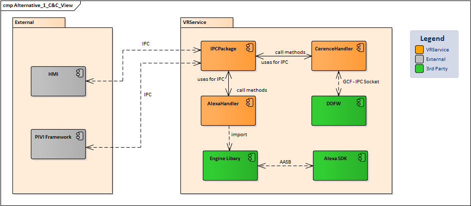
Image reference: doc_image_013.png

Figure 13 – Alternative 1 C&C View

Each engine handles will communicate with IPC Package via direct function calls. And <Engine>Handler manages communication with voice engine through defined interfaces provided by vendor.

4.3 Alternative 2 – Centralized Manager

4.3.1 Static View

Below is the static design of second alternative:

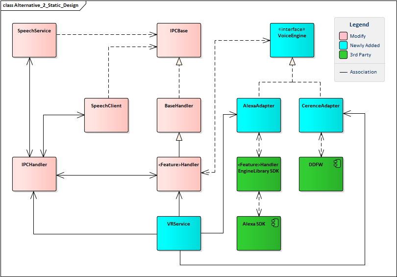
Image reference: doc_image_014.png

Figure 14 - Static design of Alternative 2

In this alternative, we consolidate all the handles/managers which contain engine’s specific logic into one package and centralized handler’s logic. With the help of Adapter Design pattern, we are able to adapt the interface of different voice engines to a single common interface.

Main component and class descriptions:

Table 6 - Main component and class description of alternative 1

## Table
| Name | Type | Description |
| --- | --- | --- |
| IPCHandler | Class | Support IPC between <Feature>Handler and external frameworks |
| SpeechService | Class | Receive request from external frameworks and HMI applications |
| SpeechClient | Class | Listen to event callback from external frameworks and HMI applications |
| IPCBase | Class | Base class, representing communication between external service and <Feature>Handler. |
| HandlerBase | Class | Abstraction class for all handlers |
| <Feature>Handler | Class | Containing implementation logics for each voice command domain control of all voice engines |
| VRService | Class | Control overall operation of service. Load and proceed CCF, initialization of main classes: IPC classes, Handlers, Adapters |
| VoiceEngine | Interface | Common interface defines the methods that all voice engines must implement |
| CerenceAdapter | Class | Adapt concrete Cerence voice engine to the common interface |
| DDFW | Object | Cerence voice engine |
| AlexaAdapter | Class | Adapt concrete Alexa voice engine to the common interface |
| <Feature>Handler EngineLibrary SDK | Class | Containing Alexa Auto SDK libraries, specific handlers, AASB messages |
| Alexa Auto SDK | Component | Containing core engines of Alexa, Engine SDK, Message Broker and Alexa Voice Service Cloud SDK |

4.3.2 Dynamic View

Dynamic View for Alternative 2

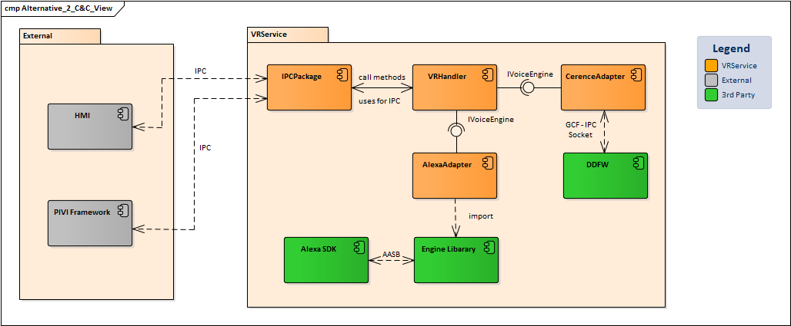
Image reference: doc_image_015.png

Figure 15 – Alternative 2 C&C View

By using this alternative design, common interface to communicate with voice engine will be provided by IVoiceEngine. All the specific handler logics will be requested from adapters to hander classes. This design allows us to easily extend the system with new voice engines by adding new adapters, maintaining clean and flexible architecture.

4.4 Comparison of Proposals

For better clarification, we will compare each alternative base on weight and score matrix. Weight score (1-5) based on its importance to target project. The higher the weight, the more critical. And scoring will be based on the assessment below:

1: Poor does not meet requirements

2: Below expectations

3: Meets requirements

4: Above expectations

5: Excellent or exceeds expectations

Table 7 - Quality Attribute comparison between Alternatives

## Table
| Quality Attributes (Weight) | Alternative 1 (Score) | Alternative 2 (Score) |
| --- | --- | --- |
| Performance (5) | Satisfy QA criteria regarding start-up and response time. Score: 5 | Satisfy QA criteria regarding start-up and response time. Score: 5 |
| Reusability (4) | There is no common interface, it might create duplicate logic on handlers. Score: 2 | Common interface is provided for concreate engine, re-used logic on handlers is possible. Score: 3 |
| Maintainability (3) | Easier to maintain since the design is more modular. Score: 4 | All logic placed on common handlers, make it more difficult in maintaining. Score: 2 |
| Modifiability (3) | Once requirements change, we need to update logic for each <engine>handler Score: 2 | Only need to update logic for common handlers Score: 3 |
| Extensibility (4) | Required to add new package manager and package handler for new engine Score: 2 | Only required to add new adapter class and can re-use the existing handler. Make adding new engines easier Score: 4 |
| Other Factors (Weight) | Alternative 1 (Score) | Alternative 2 (Score) |
| Implementation Effort (3) | Can utilize existing sources from previous design Score: 4 | We need to re-structure the whole design and modify lots of logic on handlers Score: 2 |
| Resource Efficiency (5) | Not much difference in CPU and Memory usages Score: 3 | Not much difference in CPU and Memory usages Score: 3 |
| Total Score (Weigh x Score) | 86 | 89 |

Since the main achievement of this design is to create flexible architecture which allows us to easily extend new functionalities or new voice systems without changing impact on the existing core structure or code base. Also, based on Quality Attributions and Other Factors comparison above and trade-off, it would be more beneficial to proceed with Alternative 2 as the final design in the long run.

Architecture Design

5.1 Static design

5.1.1 Class Diagram

The detail static design of Alternative 2 is shown as below class diagram:

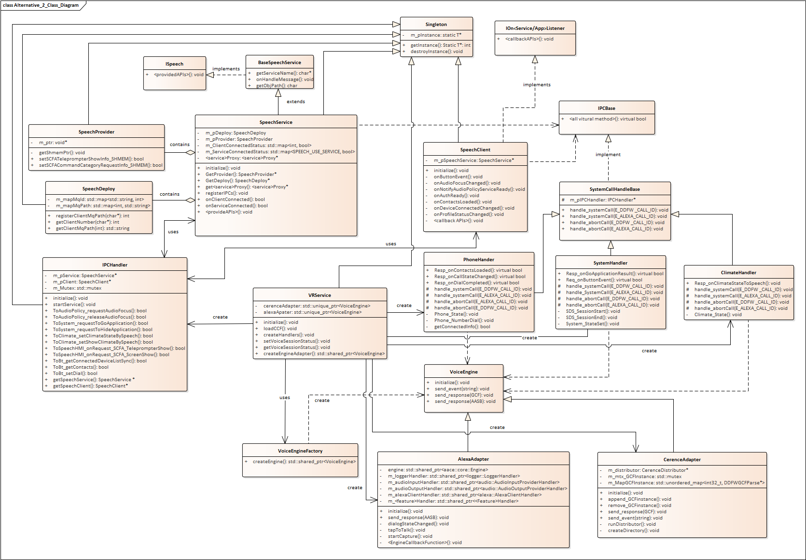
Image reference: doc_image_016.png

Figure 16 - Class Diagram of Alternative 2

5.1.2 Class description

Table 8 - Main class description

## Table
| Name | Description |
| --- | --- |
| IPCHandler | Support communication between VR Service and external frameworks as well as HMI applications |
| SpeechService | Receive request from external frameworks and HMI applications |
| SpeechClient | Listen to event callback, broadcast notification from external frameworks and HMI applications |
| SpeechProvider | Used by SpeechService, support Sharemem IPC |
| SpeechDeploy | Manage clients, deploy callback to clients via message queue |
| SystemCall HandlerBase | Abstraction class for all handlers |
| PhoneHandler | Containing implementation logics for phone domain control |
| ClimateHandler | Containing implementation logics for vehicle climate domain control |
| SystemHandler | Containing implementation logics for overall control of voice session: request audio resource, audio ducking, start/terminate voice session… |
| VRService | Control overall operation of service. Load and proceed CCF, initialization of main classes: IPC services, handlers, <Engine>Adapter |
| VoiceEngine | Common interface defines the methods that all voice engines must implement |
| VoiceEngineFactory | Centralize creation of voice engine adapters |
| CerenceAdapter | Adapt concrete Cerence voice engine to the common interface |
| AlexaAdapter | Adapt concrete Alexa voice engine to the common interface |

5.2 Interface design

The overall communication of data flow can be simplified as below:

Image reference: doc_image_017.png

Figure 17 - Communication flow

Interfaces design description:

Table 9 – Interfaces description

## Table
| Direction | Communication type |
| --- | --- |
| External service/Applications IPC Packages | Message queue, message passing, sharemem, PPS broadcast |
| IPC Packages Handler | Direct function call via Singleton instances |
| Handler Adapters | IVoiceEngine 1. send_response(GCF message) - overloading 2. send_response(AASB message) - overloading 3. send_event(std::string) |
| Adapters Handler | SystemCallHandlerBase 1. handle_systemCall(E_DDFW_CALL_ID) - overloading 2. handle_systemCall(E_ALEXA_CALL_ID) - overloading 2. handle_abortCall(E_DDFW _CALL_ID) - overloading 3. handle_abortCall(E_ALEXA_CALL_ID) - overloading E_<ENGINE>_CALL_ID enum will be pre-defined for each domain: SystemHandler: ID from 100 to 200 PhoneHandler: ID from 200 300 And increase for each domain feature Based on pre-defined ID, requests callback from engine will be clarified forwarded to corresponding handlers |
| Adapters Engines | Specific interface defined by engine provider vendor (GCF, AASB…) |

5.3 Dynamic design

This chapter briefs down some of the use cases scenario of VRService

5.3.1 Initialization

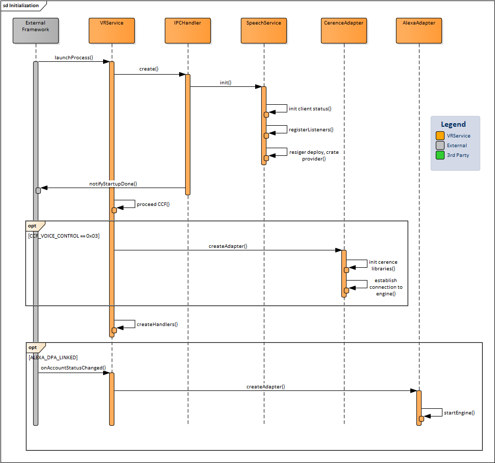
Image reference: doc_image_018.png

Figure 18 - Initialization sequence

5.3.2 Wake-Up-Word

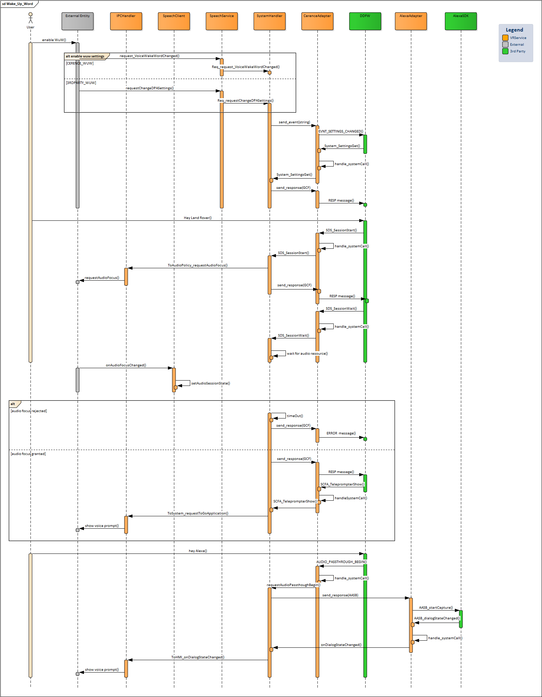
Image reference: doc_image_019.png

Figure 19 - Hotword sequence

5.3.3 Dial contact

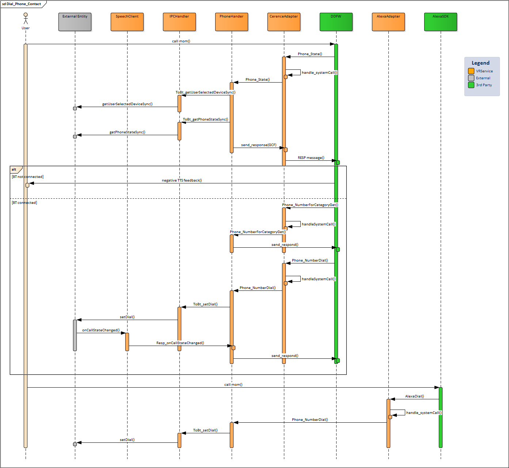
Image reference: doc_image_020.png

Figure 20 - Call contact sequence

5.3.4 Show climate

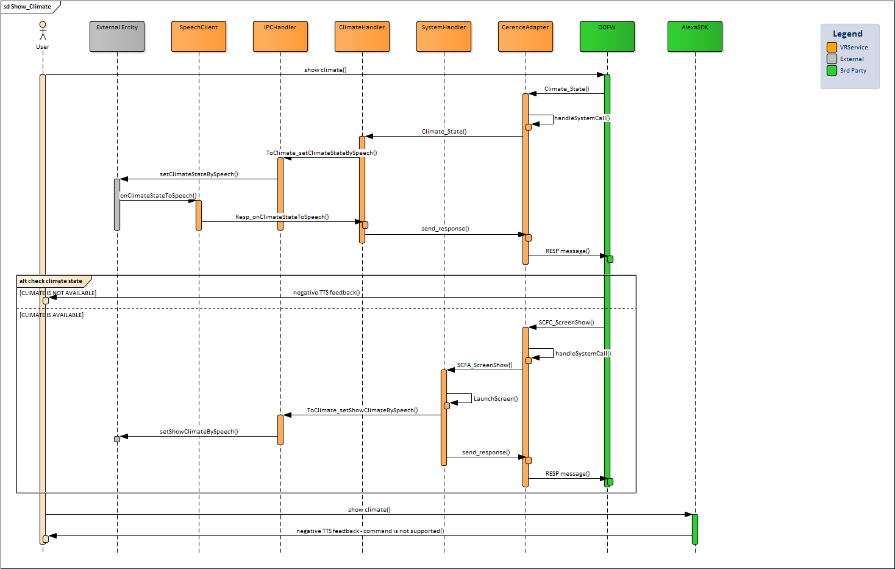
Image reference: doc_image_021.png

Figure 21 - Show Climate

5.3.5 How’s the weather

Image reference: doc_image_022.png

Figure 22 - Weather information query

Verify the final design

To verify the final design, we need to measure initial duration, measure average communication timing between External Services and Voice Engine. Memory and CPU usage measurements for some specific use cases are also required. We will do each test at least 5 times and then get the average result. Besides that, we need to perform testing in case of high CPU and make sure no critical issues or crashes are observed.

6.1 Performance measurement

Measurement results as below:

Table 10 - Performance measurement

## Table
| Scenario | Description | Before | Before | After | After | Diff (After - Before) |
| --- | --- | --- | --- | --- | --- | --- |
| Scenario | Description | Alexa | Cerence | Alexa | Cerence | Diff (After - Before) |
| Initialize | From process launched till service ready (seconds) | 6.6 | 3.2 | 5.4 | 2.8 | -1.6 |
| Average communicate time | External services Engine (seconds) | 0.15 | 0.001 | 0.15 | 0.001 | 0 |
| Average communicate time | Engine External service (seconds) | 0.03 | 0.01 | 0.03 | 0.01 | 0 |

We can see that initial time is shorter, since only few domain control features were enabled and implemented on demo prototype. And there was not much difference in average communication time:

External services  Voice Engine: measure from when VRService received IPC request or callback till message forwarded to Voice Engine

Voice Engine  External Service: measure from when VRService received request or callback from Voice Engine till VRService deploy IPC requests

6.2 Memory and CPU usages

I used hogs command to monitor average Memory and CPU consumption of target process. Measurement results as below:

Table 11 - Memory and CPU measurement

## Table
| Scenario | Category | Before | Before | After | Diff (After - Before) |
| --- | --- | --- | --- | --- | --- |
| Scenario | Category | Alexa | Cerence | After | Diff (After - Before) |
| IDLE | Memory usage (KB) | AlexaService: 8852 | SpeechService: 4456 DDFW: 85820 | VRService: 7872 DDFW: 85792 | -5464 |
| IDLE | CPU usage (%) | AlexaService: 5 | SpeechService: 0.1 DDFW: 8 | VRService: 4 DDFW: 6 | -3.1 |
| Trigger VR via Hotword | Memory usage (KB) | AlexaService: 14624 | SpeechService: 5408 DDFW: 115780 | VRService: 12253 DDFW: 108460 | -15099 |
| Trigger VR via Hotword | CPU usage (%) | AlexaService: 7 | SpeechService: 0.1 DDFW: 12 | VRService: 5 DDFW: 9 | -5.1 |
| Call contact | Memory usage (KB) | AlexaService: 15604 | SpeechService: 5404 DDFW: 115780 | VRService: 12890 DDFW: 114612 | -9286 |
| Call contact | CPU usage (%) | AlexaService: 11 | SpeechService: 0.1 DDFW: 15 | VRService: 7 DDFW: 13 | -6.1 |
| Weather query | Memory usage (KB) | AlexaService: 14256 | SpeechService: 5408 DDFW: 117828 | VRService: 12057 DDFW: 114624 | -10811 |
| Weather query | CPU usage (%) | AlexaService: 9 | SpeechService: 0.1 DDFW: 17 | VRService: 6 DDFW: 13 | -7.1 |

6.3 Stability

I use stress test script to simulate high CPU usage from 80% to 99% and execute voice command requests. No crashing or lost communication issues occur. Only observed delay on feedback from voice engine.
