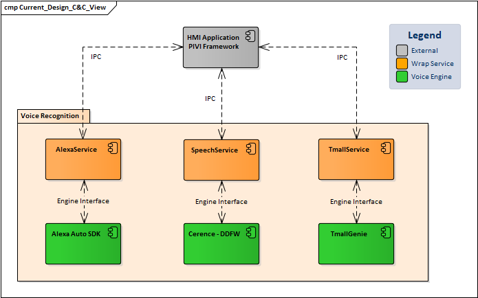
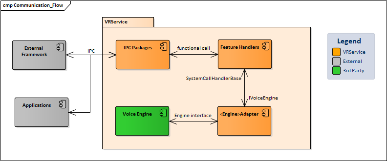
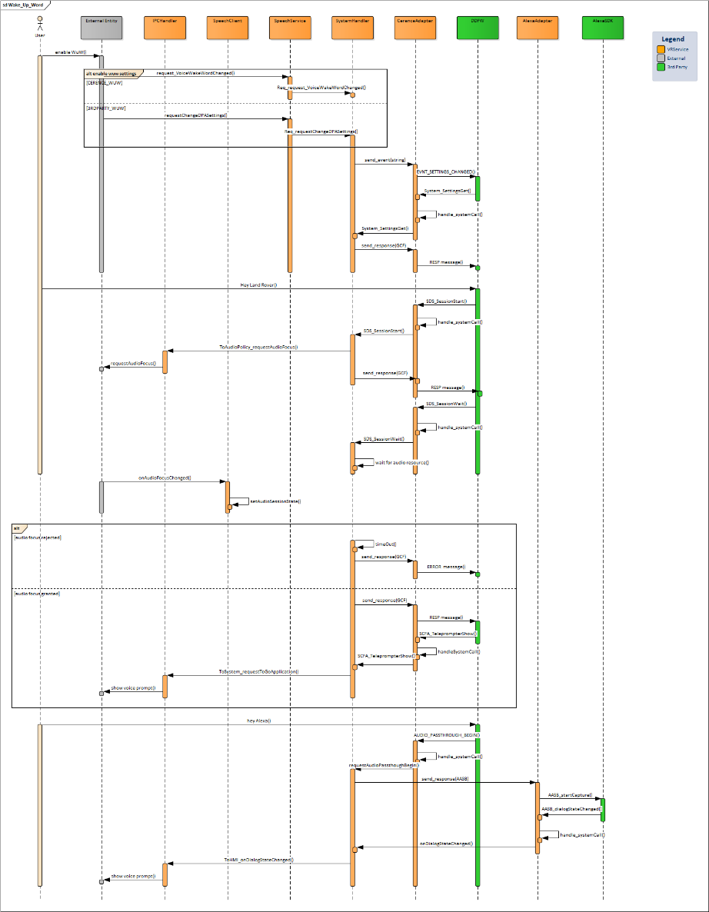
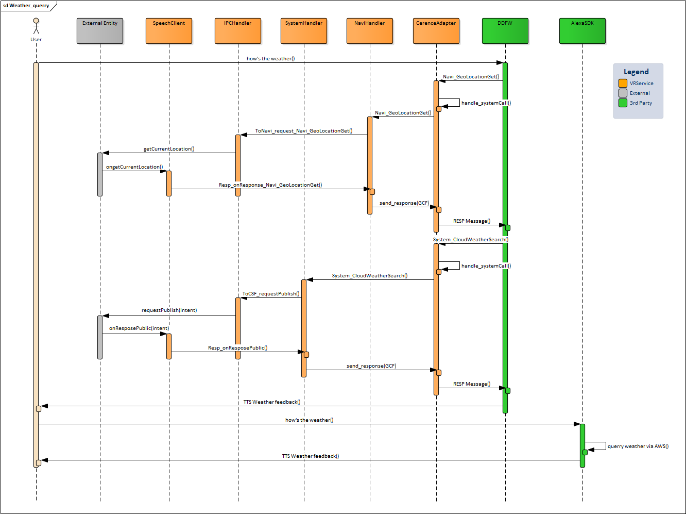

# Raw Slide Content

- Source file: VR_Common_Service_de.tong/FA_VR_Common_Service_v1.4.pptx
- Total slides: 28

## Slide 1

Voice Recognition Common Service

Supervised by Ms. 정은희 (Ms. Eunhee Jeong)
Tong Tran Hoang De - LGEDV DANANG
2025.10.16

Image reference: slide_01_image_01.png

## Slide 2

Image reference: slide_02_image_01.png

Contents
Overview
Problems
Proposals
Comparison of Proposals
Architecture Design
Measurement
Conclusion

## Slide 3

Overview

Voice Recognition (VR) feature is a part of PIVI system
Allow user to control various domains via voice commands
Multiple voice engines can co-exist in the system: Alexa, Cerence, TmallGenie

Image reference: slide_03_image_01.png

## Slide 4

Problems

Extensibility is limited
Maintenance is difficult
Inefficient use of CPU and memory resources
No flexibility in managing audio focus when multiple VRs run simultaneously

Image reference: slide_04_image_01.wmf

## Slide 5

Proposal Concept – Centralized VR

Image reference: slide_05_image_01.wmf

Manage all IPC and Voice Engine communication in one place via single service – VRService
 Easy to extend			 	 Enhances maintainability
 Optimizes system resource usage		 Proactive management of audio focus for concurrent VR

## Slide 6

1st Proposal – Centralized IPC

Re-used IPC packages which support IPC communication
Each <Engine>Manager package will:
Contain VR’s specific logic
Handle communication with Voice Engine

Image reference: slide_06_image_01.wmf

## Slide 7

2nd Proposal – Centralized Manager

Re-used IPC packages which support IPC communication
VRManager package will:
Consolidate VR’s domain control logic
Handle communication with Voice Engine

Image reference: slide_07_image_01.wmf

## Slide 8

Comparison of Proposals – Overall Design

Image reference: slide_08_image_01.wmf

1st Proposal – Centralized IPC

2nd Proposal – Centralized Manager

## Slide 9

Comparison of Proposals – Quality Attributes

Quality Attributes to be compared:
Performance
Reusability
Extensibility
Maintainability
Modifiability
Other factors to be compared:
Resource Efficiency
Implementation Effort
Quality Attributes comparison based on Weight (1-5) x Score (1-5) matrix  The higher score, the better

## Slide 10

Comparison of Proposals – Quality Attributes

### Table
| Quality Attributes (Weight) | 1st Proposal - Centralized IPC (Score) | 2nd Proposal – Centralized Manager (Score) |
| Performance (5) | Satisfy QA criteria regarding start-up and response time. Score: 5 | Satisfy QA criteria regarding start-up and response time. Score: 5 |
| Resource Efficiency (5) | Not much difference in CPU and Memory usages Score: 3 | Not much difference in CPU and Memory usages Score: 3 |
| Reusability (4) | There is no common interface, it might create duplicate logic on handlers. Score: 2 | Common interface is provided for concreate engine, re-used logic on handlers is possible. Score: 3 |
| Extensibility (4) | Required to add new package manager and package handler for new engine Score: 2 | Only required to add new adapter class and can re-use the existing handler. Make adding new engines easier Score: 4 |
| Modifiability (3) | Once requirements change, we need to update logic for each <engine>handler Score: 2 | Only need to update logic for common handlers Score: 3 |
| Maintainability (3) | Easier to maintain since the design is more modular. Score: 4 | All logic placed on common handlers, make it more difficult in maintaining. Score: 2 |
| Implementation Effort (3) | Can utilize existing sources from previous design Score: 4 | We need to re-structure the whole design Score: 2 |
| Total Score (Weigh x Score) | 86 | 89 |

 It would be more beneficial to proceed with 2nd Proposal as the final design in the long run

## Slide 11

Architecture Design – Interface design

### Table
| Direction | Communication type |
| External service/Applications  IPC Packages | Message queue, message passing, sharemem, PPS broadcast |
| IPC Packages  Handler | Direct function call via Singleton instances |
| Handler  Adapters | IVoiceEngine 1. send_response(GCF message) - overloading 2. send_response(AASB message) - overloading 3. send_event(std::string) |
| Adapters  Handler | SystemCallHandlerBase 1. handle_systemCall(E_DDFW_CALL_ID) - overloading 2. handle_systemCall(E_ALEXA_CALL_ID) - overloading 2. handle_abortCall(E_DDFW _CALL_ID) - overloading 3. handle_abortCall(E_ALEXA_CALL_ID) - overloading E_<ENGINE>_CALL_ID enum will be pre-defined for each domain |
| Adapters  Engines | Specific interface defined by engine provider vendor (GCF, AASB…) |

Image reference: slide_11_image_01.png

## Slide 12

Architecture Design – Class Diagram

Image reference: slide_12_image_01.wmf

## Slide 13

Measurement

What need to be measured?
Booting duration
Average communication performance
CPU and memory usages
Audio focus concurrency behavior

## Slide 14

Measurement – Initialization time

How to measure:
Cold boot
Monitor log’s timestamp:
Start time: when process created triggered by SystemService
End time: when service finish initialization and ready to use
 Initialization time = End time – Start time

### Table
| Scenario | Before |  | After | Difference (After - Before) |
|  | AlexaService | SpeechService | VRService |  |
| Initialization time (seconds) | 6.6 | 3.2 | 8.2 | -1.6 |

 Total booting time reduce by 1.6 seconds

## Slide 15

Measurement – Communication time

### Table
| Scenario | Before |  | After |  | Diff (After - Before) |
|  | Alexa | Cerence | Alexa | Cerence |  |
| External  Voice Engine (seconds) | ~0.15 | ~0.001 | ~0.15 | ~0.001 | 0 |
| Voice Engine -> External (seconds) | ~0.03 | ~0.01 | ~0.03 | ~0.01 | 0 |

We will measure 2-ways of communication:
External component  Voice Engine: measure from when VRService received IPC request/callback till Voice Engine received forward message
Voice Engine  External component: measure from when VRService received Voice Engine request/callback till VRSerice deploy API calls

 No changes or negative impact on performance

## Slide 16

Measurement – CPU and Memory usage

### Table
| Scenario | Category | Before |  | After | Diff (After - Before) | Diff (%) |
|  |  | Alexa | Cerence |  |  |  |
| IDLE | Memory usage (KB) | AlexaService: 8852 | SpeechService: 4456 DDFW: 85820 | VRService: 7872 DDFW: 85792 | -5464 | ~5.5% |
|  | CPU usage (%) | AlexaService: 5 | SpeechService: 0.1 DDFW: 8 | VRService: 4 DDFW: 6 | -3.1 | ~23.66% |
| Trigger VR via Hotword | Memory usage (KB) | AlexaService: 14624 | SpeechService: 5408 DDFW: 115780 | VRService: 12253 DDFW: 108460 | -15099 | ~11.11% |
|  | CPU usage (%) | AlexaService: 7 | SpeechService: 0.1 DDFW: 12 | VRService: 5 DDFW: 9 | -5.1 | ~26.7% |
| Call contact | Memory usage (KB) | AlexaService: 15604 | SpeechService: 5404 DDFW: 115780 | VRService: 12890 DDFW: 114612 | -9286 | ~6.78% |
|  | CPU usage (%) | AlexaService: 11 | SpeechService: 0.1 DDFW: 15 | VRService: 7 DDFW: 13 | -6.1 | ~23.37% |
| Weather query | Memory usage (KB) | AlexaService: 14256 | SpeechService: 5408 DDFW: 117828 | VRService: 12057 DDFW: 114624 | -10811 | ~7.86% |
|  | CPU usage (%) | AlexaService: 9 | SpeechService: 0.1 DDFW: 17 | VRService: 6 DDFW: 13 | -7.1 | ~27.2% |

 Lower memory and CPU consumption

## Slide 17

Measurement – Audio focus concurrency behavior

Scenario: Active Alexa voice session first then active Cerence voice session
Behavior:
Before: Alexa voice session is always terminated, Cerence voice session will active
After: We can control either to terminate Alexa or block Cerence request before trigger any audio focus requests to Audio Framework
Detail logs analysis can be found on Appendix section

## Slide 18

Conclusion

The new design satisfied targets of the FA’s task:
Create a low coupling and high cohesion design
Easy to extent, add new functionalities or new VR without breaking core structure
Provide flexibility on VR’s audio focus control
Comply with Quality Attributes Requirements
Can carry-over to other projects as a base or can be used as reference

## Slide 19

Thank you 

Image reference: slide_19_image_01.png

## Slide 20

Appendix 1 – Detail design of SpeechService

Image reference: slide_20_image_01.png

20

## Slide 21

Appendix 2 – Detail design of AlexaService

21

Image reference: slide_21_image_01.png

## Slide 22

Appendix 3 – Detail design of Proposal 1

22

Image reference: slide_22_image_01.png

## Slide 23

Appendix 4 – Detail design of Proposal 2

23

Image reference: slide_23_image_01.png

## Slide 24

Appendix 5 – Dynamic design - Initialize

Image reference: slide_24_image_01.png

24

## Slide 25

Appendix 6 – Dynamic design - WuW

25

Image reference: slide_25_image_01.png

## Slide 26

Appendix 7 – Dynamic design – Weather Query

26

Image reference: slide_26_image_01.png

## Slide 27

Appendix 8 – Detail logs analysis - Before

27

Log analysis – Before:
[I][SpeechManager][SpeechManager.cpp:872][1][TapToTalkBegin] +  TTT event to active Alexa voice session
[I][AudioFocusManager][AudioFocusManager.cpp:192][1][requestAudioFocus] (+) eAudioType: ALEXA_SPEECH_PLAYBACK  request audio focus for Alexa session
[I][AudioFocusListener][AudioFocusListener.cpp:136][1][onAudioFocusChanged] ALEXA_SPEECH_PLAYBACK RENDERING  Alexa resource granted
[ onButtonEvent - 110 ] eSwitchType=2, eButton=46, eAction=2  PTT event to active Cerence voice session
[ ToAudioPolicy_requestAudioFocus - 6239 ] nReqID = 5784, eID = SPEECH_PLAYBACK  request audio focus for Cerence session
[I][AudioFocusListener][AudioFocusListener.cpp:136][1][onAudioFocusChanged] ALEXA_SPEECH_PLAYBACK RELEASED  Alexa resource released
[ onAudioFocusChanged - 2090 ] [AUDIOPOLICY] eID:SPEECH_PLAYBACK, eFocus:RENDERING  Cerence resource granted

## Slide 28

Appendix 9 – Detail logs analysis - After

28

Log analysis – After:
[requestDpaVoiceSessionStart - 786][ALEXA] TapToTalkBegin  TTT event to active Alexa voice session
[requestDpaVoiceSessionStart - 790][ALEXA] getVoiceSessionStatus: E_NONE  no current voice session active
[ToAudioPolicy_requestAudioFocus - 246][VR] eAudioType: ALEXA_SPEECH_PLAYBACK  request audio focus for Alexa session
[[onAudioFocusChanged - 256][AUDIOPOLICY] eID:ALEXA_SPEECH_PLAYBACK, eFocus:RENDERING  Alexa resource granted
[onButtonEvent - 123][CERENCE] eSwitchType=2, eButton=46, eAction=2  PTT event to active Cerence voice session
[onButtonEvent - 141][CERENCE] getVoiceSessionStatus: ALEXA  Alexa voice session is currently active
 We can block PTT event
[onButtonEvent - 145][CERENCE] Alexa voice session is active, block PTT event   Session ended here
 Or allow new voice session active
[onButtonEvent - 160][CERENCE] Alexa session is active, request release Alexa audio focus  Terminate Alexa voice session and request Cerence voice session
[ToAudioPolicy_releaseAudioFocus - 362][VR] eID = ALEXA_SPEECH_PLAYBACK  Request audio focus for Alexa
[onAudioFocusChanged - 256][AUDIOPOLICY] eID:ALEXA_SPEECH_PLAYBACK, eFocus:RELEASED  Alexa resource released
[ToAudioPolicy_requestAudioFocus - 246][VR] eAudioType: SPEECH_PLAYBACK  request audio focus for Cerence session
[onAudioFocusChanged - 256][AUDIOPOLICY] eID:SPEECH_PLAYBACK, eFocus:RENDERING  Cerence resource granted

