# Raw Document Content

- Source file: cong.tran_FA_Optimize_Home_Application_v1.6[1].docx

Function Architecture (Optimize Home application)

LGE VS JLR P-IVI

FA Certification

Performance improvement of Home Application

SW Architectural Design

Author: Tran Duc Cong

Department: Functional Technology Team 4 – Application Unit

Date: 09/2023

Table of Contents

Figures

Figure 1. Guideline Home application in JLR P-IVI AVN system	6

Figure 2. Main screen of Home application	9

Figure 3. List tiles on Home screen	10

Figure 4. System Architecture of Home application on P-IVI system	11

Figure 5. Current Architecture of Home application	12

Figure 6.  Main view of Home application	13

Figure 7. Booting sequence of the AVN	15

Figure 8. Wireframe of Ev features with EV application(left) and EV Tile (right)	16

Figure 9. Example of processing data when any information changed	16

Figure 10. Example of combining device list	17

Figure 11. Package diagram for Home tiles in Generalize Architecture	19

Figure 12. Package diagram for Home tile in MVC Architecture	21

Figure 13. Capture QML profiler when Home startups	22

Figure 14. Memory capture by QML profiler	23

Figure 16. MVC Static Design (Example for Climate feature, other features will have the same design)	29

Tables

Table 1.  Relation of components in the context diagram	12

Table 2. Non-functional requirements of Home HMI	14

Table 3. Non	14

Table 4. Compare booting time between solutions	22

Table 5. Detail about timming-cost when Home syncups information.	23

Table 6. Problems with current architecture.	26

Table 7, Pros and cons between the proposals	27

Table 8. Quick compare betwwen 2 proposals	27

Table 9. Description of class functionality in the MVC design proposal	30

Table 10. Conditions to update Tiles	32

About This Document

Document Information

## Table
| Issuing authority | LGE-VS-JLR-PIVI |
| --- | --- |
| Status of document | In Progress |

Revision History

## Table
| Version | Date | Notes | Author | Approval |
| --- | --- | --- | --- | --- |
| 1.0 | 2023.06.12 | Initial Release | Cong D. Tran |  |
| 1.1 | 2023.07.18 | Add overview of project | Cong D. Tran |  |
| 1.2 | 2023.07.27 | Proposal architecture | Cong D. Tran |  |
| 1.3 | 2023.07.28 | Define diagram for MVC Architecture | Cong D. Tran |  |
| 1.4 | 2023.08.24 | Add detail for Architecture Analysis | Cong D. Tran |  |
| 1.5 | 2023.09.21 | - Add current data-processing flow (Section 4.2) - Add detail for Architecture Analysis (Section 4.5) - Add quick compare between proposals (Section 4.6) | Cong D. Tran |  |
| 1.6 | 2023.10.05 | Add detail for Measurement (Section 4.5.3) | Cong D. Tran |  |

Purpose

This document specifies the software architecture design for Home HMI app (kind of a General app on JLR P-IVI AVN system).

This design document also serves as a guideline on how each component in Home should be implemented and how the internal components/external processes should interact with each other. From that, it provides an effective way to improve the Home application’s performance and make Home smoother.

Background

According to the P-IVI system, HMI apps operate independently that receives data from services, combines it, and then shows it on screen.

It means Home app that can show information, and interact with almost features on P-IVI. Moreover, it also can show anytime during the cycle. So the Home app always needs to update data and be ready to show on the screen.

Therefore, in the extreme use case, there are many update from multiple features at the same time, which leads to delay, mismatch, and unsmooth animation caused by high CPU because of real-time update such as Media, Navigation, phone call…

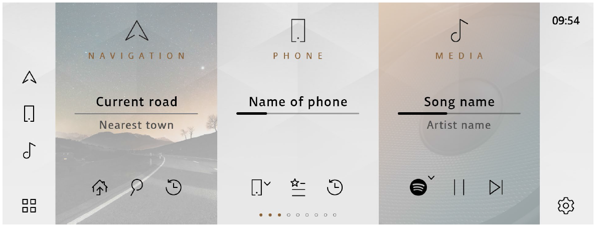
Image reference: doc_image_001.png

Figure 1. Guideline Home application in JLR P-IVI AVN system

Scope

This document describes the following about the Home HMI app works.

SW Architectural representation

Sequence diagram for use case

Audience

The readers of this article are as follows.

Software architect who will evaluate the design of the software

JLR P-IVI AVN project participants who want to understand the architecture of Home HMI apps or who want to improve performance of General apps.

Related Documents

The project documentation associated with this document is:

PIVI Home Page_v4.7.pdf

P-IVI HMI - Phone v9.1.pdf

P-IVI Media v8.0.pdf

P-IVI HMI - Navigation Home Tile v4.1.pdf

JLR_P-IVI_HMISpec_4x4i_7.7.pdf

IVI DPR Home page

Other HMI documents of related  features

Acronyms / Glossary

## Table
| Acronyms | Description |
| --- | --- |
| OEM | Original Equipment Manufacturer |
| DPR | Design Pre-Rite |
| CCF | Car configuration file |
| MVC | Model-View-Controller |
| UI | User interface |
| HMI | Human Machine Interface |
| AVN | Audio, Visual and Navigation |
| JLR | Jaguar-Land Rover |
| P-IVI | Proteus - In Vehicle Infotainment |
| QML | QT Modelling Language |

Overview

Overall Descriptions

Home application of JLR-PIVI is to provide a way to allow users can quickly get or interact with almost all features such as Navigation, Phone, media, Vehicle, and Weather …

Image reference: doc_image_002.png

Figure 2. Main screen of Home application

Beside that, PIVI has been increasingly expanded to new features. It required more and more tiles and data also.

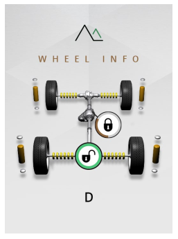
Image reference: doc_image_003.png
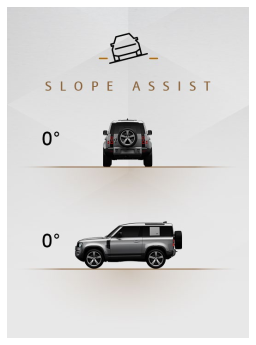
Image reference: doc_image_004.png

Image reference: doc_image_005.png
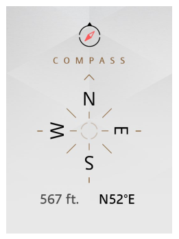
Image reference: doc_image_006.png

Image reference: doc_image_007.png
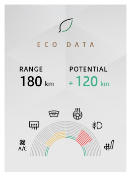
Image reference: doc_image_008.png
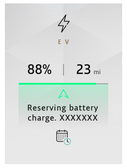
Image reference: doc_image_009.png
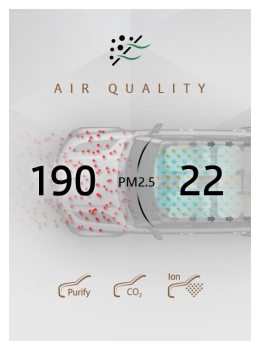
Image reference: doc_image_010.png
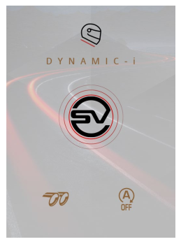
Image reference: doc_image_011.png
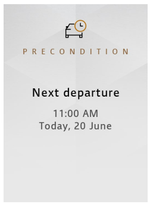
Image reference: doc_image_012.png

Figure 3. List tiles on Home screen

System Architecture

Home HMI Application is responsible to request, receive data from services then handle it and display on tile corresponding. It also can request to services to do something when user interacts on Home view.

Image reference: doc_image_013.png

Figure 4. System Architecture of Home application on P-IVI system

SW Architecture

Following the current P-IVI architectural design, in which services have the responsibility that it only transfers raw data to clients. It makes HMI applications must handle data before showing it on view.

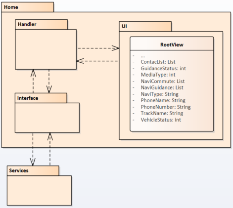
Image reference: doc_image_014.png

Figure 5. Current Architecture of Home application

Table below describes a relation among components in current architecture design.

## Table
| Relation | Description |
| --- | --- |
| Services ↔ Interface | The services deploys the updated data to Home clients via service interface. Home sends events to service if needed via service interface |
| Interface ↔ Handler | Data will be transfer between Service and Handler |
| Handler ↔ UI | Handler get and forward data to View. Processing data occurs on View components. Views emit events to Handler when user interacts. |

Table 1.  Relation of components in the context diagram

Architectural Driver

Functional Requirement

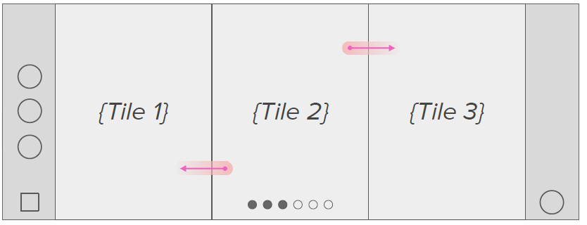
Image reference: doc_image_015.png

Figure 6.  Main view of Home application

## Table
| ID | Functional Requirement | SRS ID |
| --- | --- | --- |
| FR01 | The Home Page feature is realized within the HMI. It displays App Tiles or App icons to the user on the front upper screen based on the values of specific CCF parameters. The user can choose if the Home screen shows App Tiles or App Icons | HOME-HMI-0001 |
| FR02 | Some App tiles (e.g Navigation) display dynamic data. The data displayed for each tile are described in the relevant HMI documents for those features | HOME-HMI-0002 |
| FR03 | The Home page feature shall display only those features that are fitted to the vehicle as determined by the relevant CCF parameters. | HOME-HMI-0003 |

Quality Attribute Requirements

As a component in HMI applications, Home application must follow non-functional requirements are described as:

## Table
| ID | QA Scenario | Quality Attribute | Priority |
| --- | --- | --- | --- |
| QA1 | Home HMI need to be ready within 11s from the system startup | Performance | High |
| QA2 | The System shall switch from one view to a different one within the same application, within 500ms from reception of the user request for the new view. | Performance | Medium |
| QA3 | The System shall open a user requested application within 1s from reception of user input. | Performance | High |
| QA4 | Home tiles show within 300ms from user backs to Home screen and the animation to show Home tiles do not delay. | Performance | High |

Table 2. Non-functional requirements of Home HMI

Table 3. Non

Architecture Analysis and Alternatives

Overview of Tiles layout required Applications

In the P-IVI AVN system, there are several HMI Applications which require to show on Home as a shortcut (tile). Its functionality is to provide an overview of each feature status and the shortcut to open each application as a super application. The customer requirement for Home as: “The Home Page shall display a minimum of two tiles and maximum of nine tiles” and “The information displayed in this tile shall be reflected with each application”.

Currently, the number of shortcuts is not fixed. It depends on car models, linked-account to PIVI system. From 3 shortcuts at the first release to more than 15 tiles on IP35 version (May 2023), it will continuously increase in the future.

Moreover, Home HMI is one of early launching applications. Home HMI process will be started at around 7 seconds from startup time, hand-shaking with almost services and process data. Under high CPU conditions, Home’s booting must be completed and ready to show at 11s after the system startup. The booting sequence of the AVN system can be observed as:

## Table
|  |  |  |
| --- | --- | --- |
| Splash screen (Logo animation) 4s duration | Welcome HMI screen (User login / Account switching) 4s duration | Home HMI screen shows at 11s after system startups at the latest. |

Figure 7. Booting sequence of the AVN

Data-processing flow with current design

As I mentioned above, “the data displayed for each tile are described in the relevant HMI documents for those features.”

The problem is that services only deploy the raw data. Because the service only cares and makes sure the data is correct. Hence services only deploy the raw data and sometime applications need data from many services. Because on PIVI, the service only cares and makes sure the data is correct and displaying is the responsibility of HMI applications.

In the other word, service deloys a set of data to clients and clients will process it.

## Table
|  |
| --- |

Figure 8. Wireframe of Ev features with EV application(left) and EV Tile (right)

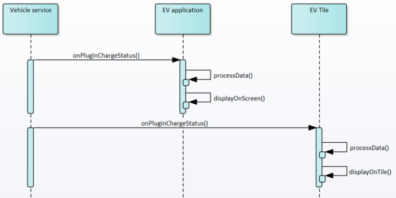
Image reference: doc_image_016.png

Figure 9. Example of processing data when any information changed

Image reference: doc_image_017.png

Figure 10. Example of combining device list

With the figure above, you can see that the device list is combined from data of 2 services. The way to combine, and order device lists can be implemented in many different ways and we can’t assign this task to a specific service because each service only has responsibility for it's feature..

From that, we can see that processData can be excecuted 2 times and even with 2 way of different implementation.

With the current architecture design, we face problems:

Data processing will be executed from Home tile and feature application. So the information is not consistent because it depends on a different algorithm from different applications.

Home tile will be updated whenever any information has been changed because the data is always sent to View components (Refer to Sections 1.1 Overall Descriptions)

Because the information of each tile is defined in the feature corresponding, it required the Home engineers need to cover all features. It so easily misses new requirements.

From my point of view, my idea is based on two facts:

In the extreme use case, Home application has a lot of update from many features while the car is running. But at one point, user can’t take a look all of that information. The flow of processing data can be control more efficiently.

The number of tile is dynamic, it can be modify by car models or by OEM side. So all tiles must be ready to modify (add/update/remove) with less effort and fewer side effects to other sides.

Hence, I follow to the concept “Divide and Conquer”. Divide the big handler into smaller ones allows the developer can control data for each feature. In this section, I propose two architecture designs as:

Section 4.2: Generalize Home Tiles manager Architecture – Proposal 1

Section 4.3: Model View Controller Architecture – Proposal 2

In each section, the basic concept of my proposal will be introduced with the context diagram. The most advantages and disadvantages of each proposal are highlighted in the corresponding section. Finally, the summary will be concluded in section Proposal Comparison Summary

Generalize Home Tiles manager Architecture – Proposal 1

As a result of the previous section, we can see the tiles will be available if the feature is available and the information will be reflected with each application. It is clear that the same data can be shown on the home tile and each application.

So Home can generalize the tile’s functions as a template. Home will provide a way to help each feature can request to update tiles at any time in the cycle.

The most advantage to considering this approach is the information will be controlled by feature application. It will bring us stability features with higher scalability. Besides that, it will improve the performance of the system because data processing will be executed one time instead of multi times from multi applications.

Image reference: doc_image_018.png

Figure 11. Package diagram for Home tiles in Generalize Architecture

From that, we can have quick analysis this proposal:

Service: Require few new APIs to notify the home tile’s information.

Home HMI: Remove internal logic and generalize tile’s functions.

Feature HMI: Implement new logic to modify (add/remove/update) tile’s information.

However, there are several shortcomings for this approach as my experience from the current AVN system:

Availability and usability: Home will update tiles depending on the startup sequence. Tiles information needs to wait for the feature corresponding ready. Home app can’t work correctly if feature app is not working well.

Maintainability: With the future expansion of new business requirements, it requires an additional implementation of the both applications (Home and feature application). It takes time to correct it.

Model View Controller Architecture – Proposal 2

To “reduce” the number of updates called, missing implementation, and data inconsistency, Model-View-Controller (MVC) Architecture is proposed to improve Home tile process.

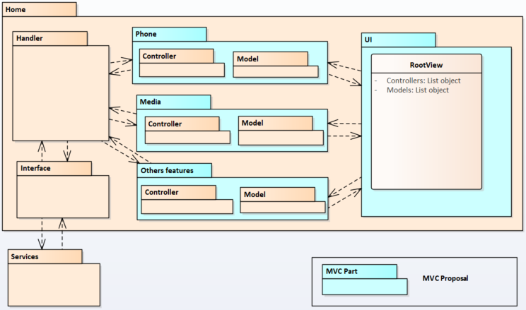
Image reference: doc_image_019.png

Figure 12. Package diagram for Home tile in MVC Architecture

With MVC architecture, the structure of Home application will be more flexible. Features will be divided into small modules. It helps engineer can develop and maintain easier without the side effects.

Engineers from other features can involve implementing Home tile easier. The missing implementation or data inconsistency will never occur because it will be updated by the same engineer.

"Update processing" can be controlled more efficiently. It can be ignored if it is needless.

This approach looks like a great idea but it still has some problems such as waste of CPU (data processing will occur many times), or Home needs to restructure to achieve an effective way to handle, and manage among modules.

Measurement analysis

Booting time

I run QML profiler when Home is booting up with default list (9 tiles). The result shows that:

Type: Creating: TilePanel.qml is created 9 times and It takes 398ms => 44ms per creating tile

Type: Handling signal: Features component are loaded into 9 tiles. It takes 536ms => 56ms per loading data.

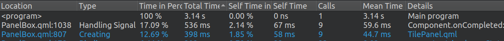
Image reference: doc_image_020.png

Figure 13. Capture QML profiler when Home startups

So result looks like below:

## Table
|  | Current architecture | Generalize architecture | MVC architecture | Note |
| --- | --- | --- | --- | --- |
| Time to creating view | ~0.934 s | ~0.934 s | ~0.3s (= (44 + 56) * 3) | Because Home only shows 3 tiles at the same time so we only create 3 times at the time. Initing time is reduced 634ms. |
| Time to sync up information | ~0.34 s (= 0.02 + 0.23 + 0.09) | ~0 s | ~0.25 s | Generalize architecture: Home no needs to sync update. MVC architecture: In default case, there are 3 tiles include Navigation, Phone, Media. |
| Total | ~1.274 s | ~0.934 s | ~0.55 s | Generalize architecture: Reduce 0.34 s MVC architecture: Reduce 0.724 s |

Table 4. Compare booting time between solutions

## Table
| Information | Time |
| --- | --- |
| Navigation | 0.02s |
| Phone and Media | 0.23s |
| Vehicle information | 0.09s |

Table 5. Detail about timming-cost when Home syncups information.

On real situations, the initing time can be reduce more because depends on car model, some features do not fitted. So the default variant of feature component do not initialize. It saves a little bit booting time this case.

Memory

When HMI application is created, almost memory usage is Graphic memory that is used for creating Window and It depends on Qualcomm’s graphic driver (refer memory improvement). Other memory for caching datas are almost unnoticeable because it doesn’t cost much CPU.

Assumption we have 30 properties per tile, the caching memory usage will be around 3Mb per tile (~ 110 * 30 /1024). We will have the result below:

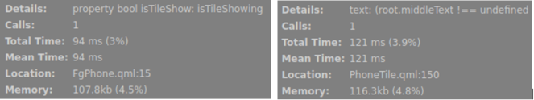
Image reference: doc_image_021.png

Figure 14. Memory capture by QML profiler

## Table
| Car Model | Current architecture (14 tiles) | MVC architecture & Generalize Architecture | Note (With assumption above: we need 3Mb per tile) |
| --- | --- | --- | --- |
| X760 | 42Mb | 24Mb | Memory usage is reduced 18Mb because with X760 Model, 6 features are not fitted. (WheelInfo, SlopeAssist, WadeSending, Compass, EV, Aỉr quality) |
| L462 | 42Mb | 36Mb | Memory usage is reduced 6Mb because with L663 Model, 2 features are not fitted. (EV, Dynamic) |
| L663 | 42Mb | 30Mb | Memory usage is reduced 12Mb because with L663 Model, 4 features are not fitted. (EV, Dynamic, Compass, Aỉr quality) |
| L550 | 42Mb | 30Mb | Memory usage is reduced 12Mb because with L663 Model, 4 features are not fitted. (WheelInfo , EV, Dynamic, Pre Driver) |
| L460 | 42Mb | 33Mb | Memory usage is reduced 12Mb because with L663 Model, 3 features are not fitted. (EV, Dynamic, Aỉr quality) |

Hence although with the new architecture, we only create data when needed but the improvement is not impact too much to System. But it will be useful incase we apply View Destroy strategy.

## Table
|  | Current architecture | MVC architecture and Generalize architecture | Note |
| --- | --- | --- | --- |
| Available to destroy View | NO | YES | Data is cached on C++ model, so the view can be destroyed to save memory and it can be re-created this window if needed. The memory usage reduces ~40Mb/window. |

CPU usage

Tiles will be updated continuoustly on the real car.

## Table
|  | Current architecture & Generalize Architecture | MVC architecture | Note |
| --- | --- | --- | --- |
| Update on view when data is changed | Always | Always (if tile visible) or Never (if tile is invisible) | The number of update will be reduced because Home only updates when tile is shown on screen. |

I run simulation with update 3D model on Wheel info tile with ~40 signals change per seconds. From that, we can see Home is not using CPU to update data tile when tile is not showing. The CPU will be save for another process.

## Table
| CPU Usage of Home | Current architecture & Generalize Architecture | MVC architecture | Note (When any process uses too much CPU, the System Setting Service will show that process and the percentage of CPU usage.) |
| --- | --- | --- | --- |
| 3D model is showing | 17.5 ~ 20.5% | 17.5 ~ 20.5% | When 3D model is showing, Home is using 17~20% CPU for the both architecture. CPU usage by Home process is reduced when 3D model is not showing. |
| 3D model is not showing | 17.5 ~ 20.5% | Low CPU usage (System setting did not mention it) | When 3D model is showing, Home is using 17~20% CPU for the both architecture. CPU usage by Home process is reduced when 3D model is not showing. |
| In-call and Phone tile is showing | ~2.02% | ~2.02% | If the phone tile is showing If the phone tile is not shown |
| In-call and Phone tile is not shown | ~2.02% | ~0.94% | If the phone tile is showing If the phone tile is not shown |

Proposal Comparison Summary

To compare the pros and cons of Generalize Home Tiles manager and Model-View-Controller architecture, it exists 4 main problems of current architecture design as below:

## Table
| No. | Problems | Quality Attribute |
| --- | --- | --- |
| 1 | All applications have individual data processing, which leads to: Mismatch information Waste of CPU resources for one task with multiple processing | Usability Performance Reusability |
| 2 | Home needs to cover all features. As a super application with huge changes from many features, Home engineers also cannot avoid certain errors. | Usability Maintainability |
| 3 | Everything changes from service side carries an update on View side whatever this update is needed or not. | Performance |
| 4 | The different features are fitted for different car model. But all data is initialized with default value on View side for all car model, which leads to: Waste of CPU/memory for unnecessary data. In the future, Home has not room enough for new features. | Performance Scalability |

Table 6. Problems with current architecture.

The following table shows the pros and cons of Generalize Home Tiles manager and Model-View Controller architecture as following:

## Table
| Item | Item | Generalize Home Tiles manager | Model-View-Controller architecture |
| --- | --- | --- | --- |
|  | 1 | Data processing will occurs one time on feature apps | Data processing can occur 2 times. |
|  | 2 | Both Home and feature apps need to update | The implementation will be executed by engineer of features corresponding on Home side. |
|  | 3 | Home needs to request update from features if needed. It will takes time and delay can occurs. | The update can be controlled by controller on Home side. |
|  | 4 | Data is controlled by features. If features is not fitted, data cannot created or updated. Home does not care about that. | Data will be controlled by controller layer. Home only create/update if needed. |
| Quality Attribute Requirements | 1 | KPI of booting time can be improved but tiles need to wait for other features ready. The waiting time can be extended. It impacts to user experience. | KPI of booting time can be improved because of reduce unnecessary data/logic for features. |
| Quality Attribute Requirements | 2 | No impact to KPI of switch view | No impact to KPI of switch view |
| Quality Attribute Requirements | 3 | No impact to KPI of switch another app | No impact to KPI of switch another app |
| Quality Attribute Requirements | 4 | No impact to animation | Animation of Home tile can be smoother by Home ignore update while the animation is running. |
| Implementation Impact Analysis | Implementation Impact Analysis | - Home HMI: Remove internal logic, generalized Home tile manager - App manager service: Create new APIs to allow feature requests to update tiles. - Feature applications: Implement new logic to adapt to the new Home tile process. | Home HMI: Re-structure to divide a big feature into small modules. Apply “lazy-load” for components. Features applications: The engineer can involve to develop Home tile. |

Table 7, Pros and cons between the proposals

Based on the analysis and result (detail at section Measurement analysis) and the table above we have a quick look about 2 architecture

## Table
|  | Generalize Architecture | MVC Architecture |
| --- | --- | --- |
| Loading time | Reduce 0.34s | Reduce 0.724s |
| Stability | Generalize Architecture is better | Generalize Architecture is better |
| Maintainability | MVC Architecture is better | MVC Architecture is better |
| Extensibility | The same | The same |
| Cost | MVC Architecture is lower | MVC Architecture is lower |
| User experience | MVC Architecture is better | MVC Architecture is better |

Table 8. Quick compare betwwen 2 proposals

Although "MVC architecture" has some disadvantages such as duplicate logic, take time to restructure the main logic, and less flexibility than "Generalize Home Tiles manager". However with this architecture, it can provide better experience with high maintainability, extensibility , lower cost (efforts) and less impact on other applications and better CPU also.

Moreover, it only impacts on Home side and other parts don’t need to change anything. The cost for this change will be less than “Generalized architecture” many times. So, I propose choosing Model-View-Controller architecture as a better option to improve the current situation of JLR P-IVI.

Architecture View

Static Design

The static design of Model-View-Controller’s main classes are described in Figure and Descriptions below:

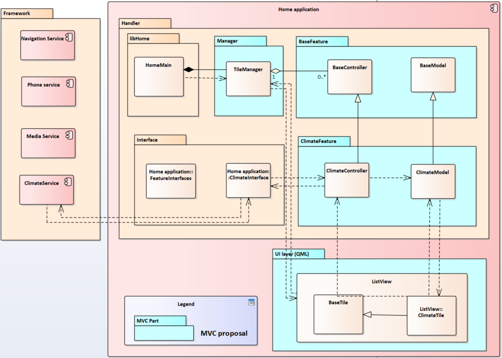
Image reference: doc_image_022.png

Figure 16. MVC Static Design (Example for Climate feature, other features will have the same design)

## Table
| Classes | Descriptions |
| --- | --- |
| HomeMain | The main class on Home, It controls the main logic during Home’s lifetime. |
| ClimateInterface | The connector between Framework (Climate service) and Home HMI: Service deploys information Client request to Service when get data or based on User interactions. |
| TileManager | Manage tile list. It controls general works for all tiles such as: Modify list tiles (Create/update/re-order/delete) Request updated System information (theme, language…) Allow/deny updates for specific tiles. |
| BaseController | An abstraction for controller. It contains general function for tiles. |
| BaseModel | An abstraction for model. It contains general function to interact with data in models. |
| ClimateController | It implements all logic for Climate features and update the result to Model |
| ClimateModel | It contains all necessary data for Climate features. It notifies to View side when data is changed. |
| BaseTile | Writing by QML, Base view of tile. It contains general information which provides the tile’s information for “TileManager” such as: Location of tile The status of tile (visible, available…) |
| ClimateTile | Writing by QML - inheritance BaseTile. It presents Climate tile on Screen: It retrieves data on Model when it gets the signal change. It forwards events to Controller based on User interactions |

Table 9. Description of class functionality in the MVC design proposal

Dynamic Design

Task Design

This chapter describes the tasks that the Home HMI application module requires. The task is the runtime unit that executes a job event-based.

Task Structure

## Table
| Task ID | Task Name | Description | SW Component Name | Constraints |
| --- | --- | --- | --- | --- |
| HOME_MAIN_SWT_001 | Initialization | Tiles should be initialized at the start. Tile is available or not depends on car model and user’s data. | Home application |  |
| HOME _MAIN_SWT_002 | Edit tile list | This task runs when user request to edit tile list. | Home application |  |
| HOME _MAIN_SWT_003 | Request sync data | This task will run after user edit list tile. It will get sync data for tile (if needed). | Home application |  |
| HOME _MAIN_SWT_004 | Detect available to update | This task runs when the received tile visibility is changed. | Home application |  |
| HOME _MAIN_SWT_005 | Update data | This task runs when received the new data from other components. | Home application |  |
| HOME _MAIN_SWT_006 | Request update | Home requests to another component based on user interactions. | Home application |  |

Task scheduling

Tile States

From the user point, Home tiles doesn’t always show on screen. Hence Home doesn’t always update data for tiles. Especially, user can active maximum 9 tile but at the same time, only 3 tiles can be shown on. Based on that, I defined Tile states which define that the tile can be updated or not. It listed on table 7 below:

Image reference: doc_image_023.png

## Table
|  | Condition | Condition | State | Descriptions |
| --- | --- | --- | --- | --- |
|  | Foreground | Visible | State | Descriptions |
|  | YES | YES | ACTIVE | Home tile will update information real-time if: User added shortcut into available list Tile is shown on screen |
|  | YES | NO | READY | The information will only be updated into data model if: User added shortcut into available list Tile is not shown on screen |
|  | NO | Not consider | INACTIVE | Home will ignore all events from services for this tile. |

Table 10. Conditions to update Tiles

Sequence Diagram

Tile Manager – Initialize and modify tile list

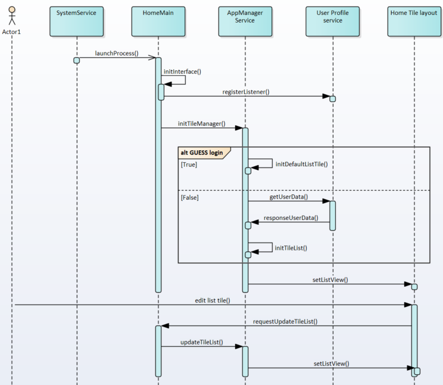
Image reference: doc_image_024.png

Tile Manager – Initialize Tile controller

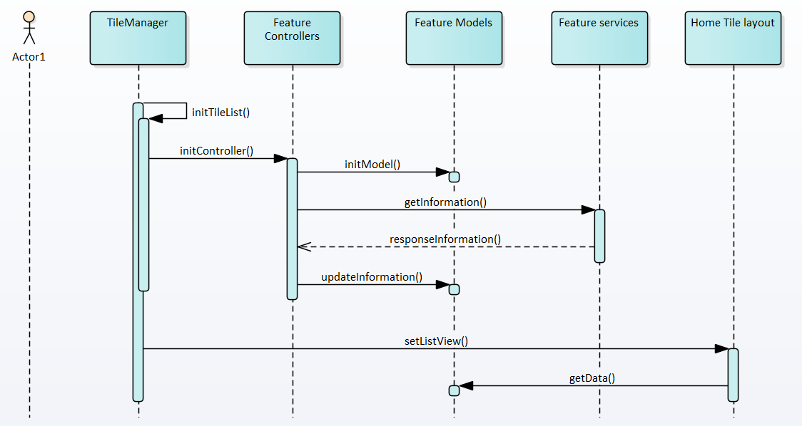
Image reference: doc_image_025.png

Tile Manager – Update Tile state

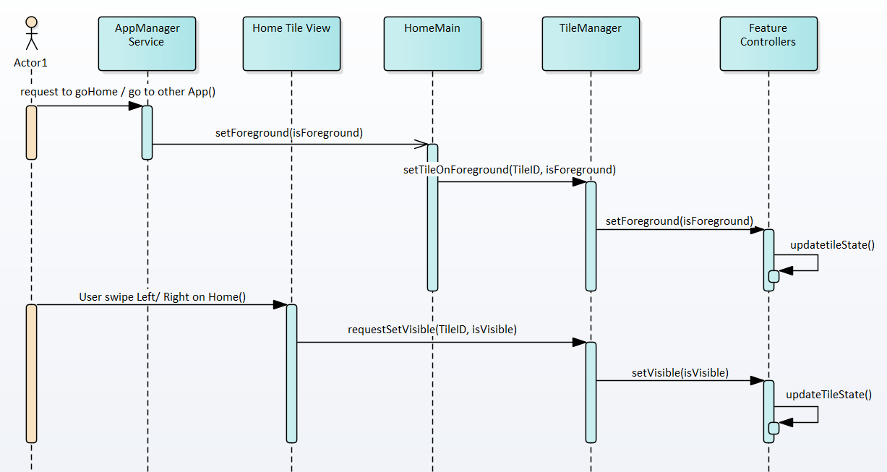
Image reference: doc_image_026.png

Tile Manager – Update Tile information when state is changed

Image reference: doc_image_027.png

Tile Manager – Update tile information by Service signals

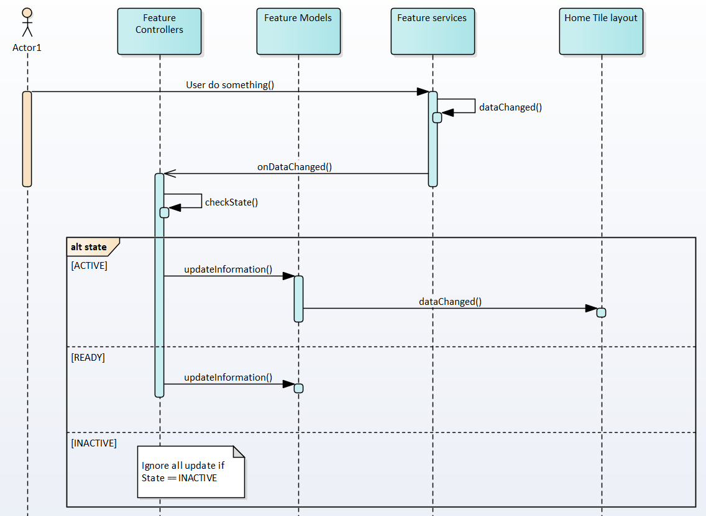
Image reference: doc_image_028.png

Interface Design

SW Component Interface Table

## Table
| SW Component Name | Interface Name | Type | Parameters |
| --- | --- | --- | --- |
| Tile Manager | TILE_STATE | enumerate | { TILE_STATE_INACTIVE, TILE_STATE_READY, TILE_STATE_ACTIVE } |
| Tile Manager | initializeTile | call |  |
| Tile Manager | editTileList | call | In: Tile list data with Tile ID, ordinal number |
| Base Controller | setTileState | call | In: Parameter 1: TILE_STATE |
| Base Controller | getTileState | call | Out: Data: TILE_STATE |
| Base Controller | requestSyncTileData | call |  |
| Base Controller | requestUpdateTileData | call |  |
| Base Model | setData | call | In: Parameters: Base on each of tile. |
| Base Model | getData | call | Out: Data |
| Controllers | requestSetData | call | In: Parameters: Base on each user interacts on screen. |

Appendix

Memory improvement:

1. The New Qualcomm EGL driver is added to reduce memory usage of each HMI application: http://collab.lge.com/main/display/JLRPIVI/4.+New+Qualcomm+EGL+driver+Integration

2. QT View Destroy in the background strategy:

http://collab.lge.com/main/display/JLRPIVI/3.+QT+View+Destroy+in+the+background
