# Raw Slide Content

- Source file: cong.tran_FA_Optimize_Home_Application_v2.3[1].pptx
- Total slides: 16

## Slide 1

Optimize Home Application

2023.10

Supervised by 이상훈 (Mr. Sanghun Lee)
Tran Duc Cong - LGEDV DANANG

LGE Internal Use Only

Image reference: slide_01_image_01.png

## Slide 2

Overview

Overview of Home application
Problems
Understand the problems
Proposals
Measurement analysis
Proposal Comparison and Conclusion
Demo proposals

## Slide 3

I. Overview of Home application

### Table
| The Home Page feature is realized within the HMI. It displays App Tiles or App icons to the user on the front upper screen based on the values of specific CCF parameters. Some App tiles (e.g Navigation) display dynamic data. The data displayed for each tile are described in the relevant HMI documents for those features |

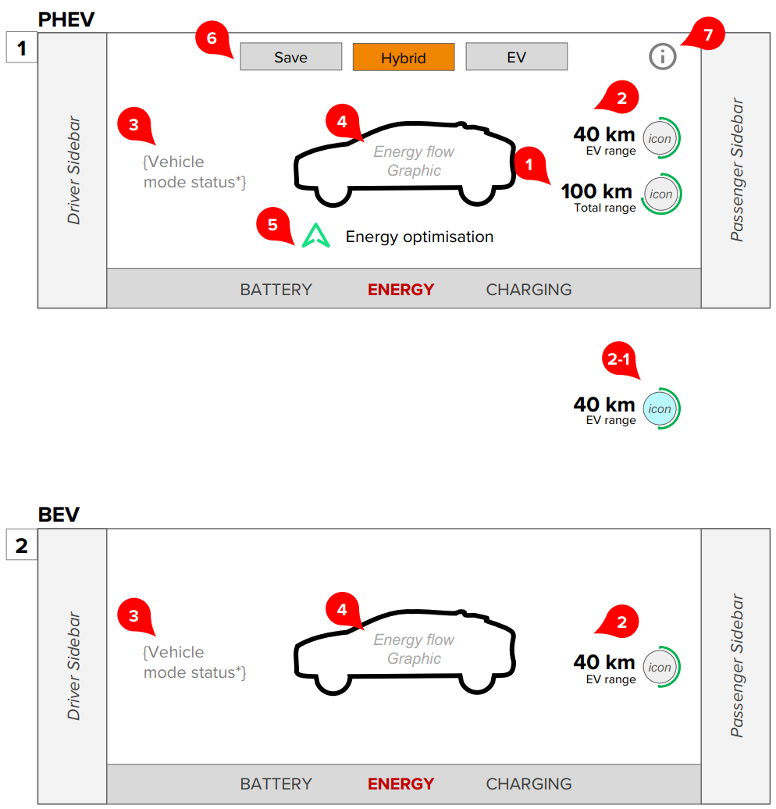
Image reference: slide_03_image_01.png

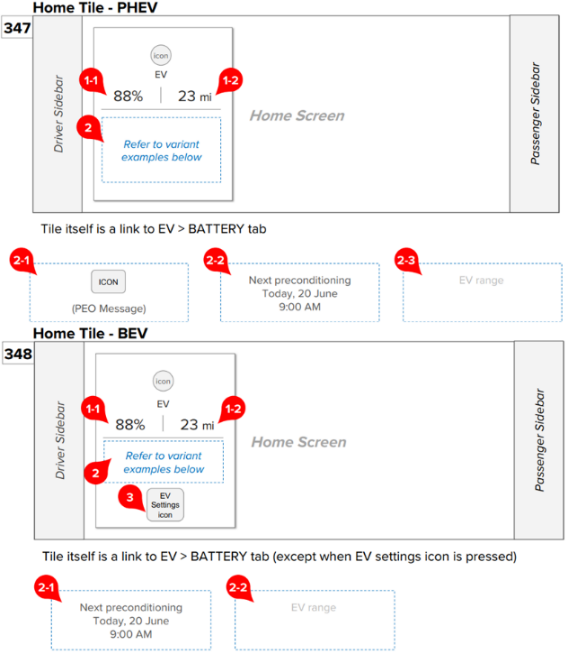
Image reference: slide_03_image_02.png

Refer to JLR_P-IVI_HMI_Charging v1.2

## Slide 4

II. Problems

Booting time: Home process takes much time to initialize. It can lead to miss the expectation of customer
Missing information: Information on Home app and features are missing match
Performance: Sometime, there are some symptoms such as delays and stuck.

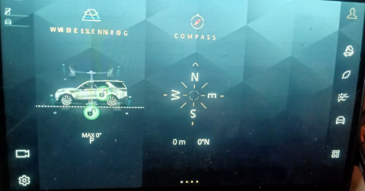
Image reference: slide_04_image_01.png

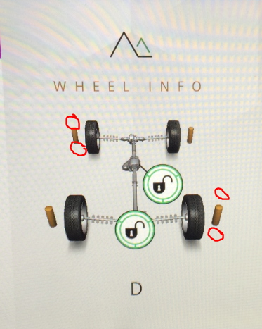
Image reference: slide_04_image_02.png

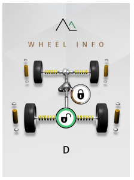
Image reference: slide_04_image_03.png

4x4i tile in normal case

4x4i tile is missing suspension (miss match with feature app)

4x4i tile is stuck

## Slide 5

III. Understand the problems

Booting time
Missing information
Performance problems:

Image reference: slide_05_image_01.png

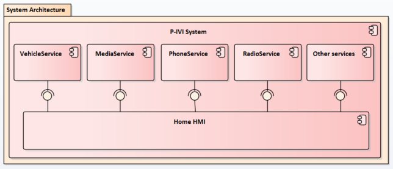
Image reference: slide_05_image_02.png

Current architecture

Sequence of merging device list on Phone app and Phone tile

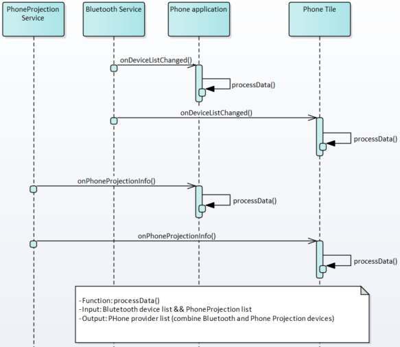
Image reference: slide_05_image_03.png

All data is initialized

processData() occurs 2 times

## Slide 6

IV. Proposals

Generalize Home Tiles Architecture
Generalize the tile’s functions as a template and provide a way to help each feature can request to update tiles at any time in the cycle.

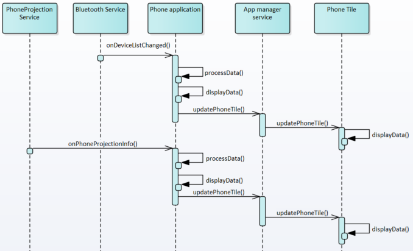
Image reference: slide_06_image_01.png

Update information on Home tile

## Slide 7

IV. Proposals

- Data processing occurs only one time.
- Information will be consistent

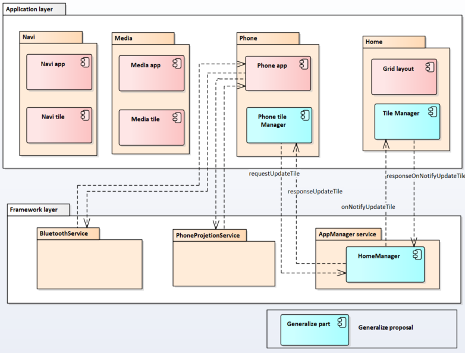
Image reference: slide_07_image_01.png

## Slide 8

IV. Proposals

Model View Controller Architecture
Applying MVC architecture, handler of features will be divided into small models.
It makes us easy to control separated features without side effects:
Feature owner can develop on Controller models.
The data flow will be more flexible. It can be processed to update on view or ignore if needed.

MVC proposal

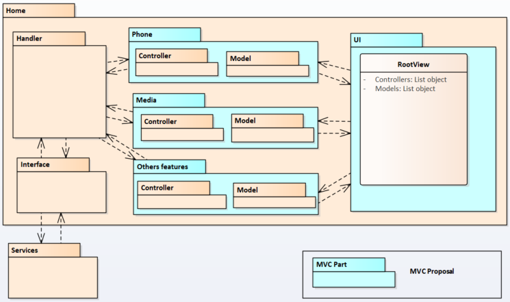
Image reference: slide_08_image_01.png

## Slide 9

IV. Proposals

Image reference: slide_09_image_01.png

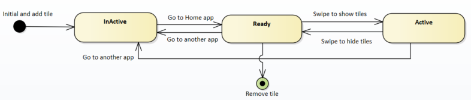
Image reference: slide_09_image_02.png

2.1. State of tiles

2.2. Update tile information base on Tile’s state when receive data from services

## Slide 10

IV. Proposals

2.3. Get sync information when tile state is changed

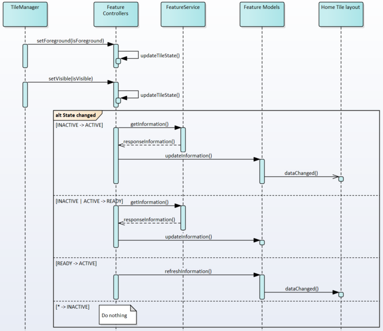
Image reference: slide_10_image_01.png

## Slide 11

V. Measurement analysis

### Table
| Booting time | Current | Generalize architecture | MVC architecture | Note |
| Time to creating view | ~0.934 s | ~0.934 s | ~0.3s (= (44 + 56) * 3) | Because Home only shows 3 tiles at the same time so we only create 3 tiles at the time. Creating time is reduced 634ms. |
| Time to sync up information | ~0.34 s (= 0.02 + 0.23 + 0.09) | ~0 s | ~0.25 s | Generalize architecture: Home no needs to sync update. MVC architecture: In default case, there are 3 tiles include Navigation, Phone, Media. |
| Total | ~1.274 s | ~0.934 s | ~0.55 s | Generalize architecture: Reduce 0.34 s MVC architecture: Reduce 0.724 s |

### Table
| Data | Handling time |
| Navigation | 0.02s |
| Phone and Media | 0.23s |
| Vehicle information | 0.09s |

## Slide 12

V. Measurement analysis

### Table
| CPU Usage | Current & Generalize architecture | MVC architecture | (When any process uses too much CPU, the System Setting Service will show that process and the percentage of CPU usage.) |
| 3D model is showing * | 17.5 ~ 20.5% | 17.5 ~ 20.5% | When Home is foreground, Home is using 17~20% CPU for the both architecture. CPU usage by Home process is reduced when Home is not showing with the MVC architecture. |
| 3D model is not showing * | 17.5 ~ 20.5% | Low CPU usage |  |
| Phome/Media tile is showing ** | ~2.0% | ~2.0% | CPU usage by Home process is reduced when user can’t view tile. |
| Phome/Media tile is not shown ** | ~2.0% | ~1.0% |  |

### Table
| Memory | Current architecture | Generalize & MVC architecture | We have total 14 tiles (42Mb) (Assumption 3Mb per tile) |
| X760 Model | 42Mb | 24Mb | 6 features are not fitted. (WheelInfo, SlopeAssist, WadeSending, Compass, EV, Aỉr quality) |
| L462 Model | 42Mb | 36Mb | 2 features are not fitted. (EV, Dynamic) |
| L663 Model | 42Mb | 30Mb | 4 features are not fitted. (EV, Dynamic, Compass, Aỉr quality) |
| L550 Model | 42Mb | 30Mb | 4 features are not fitted. (WheelInfo , EV, Dynamic, Pre Driver) |
| L460 Model | 42Mb | 33Mb | 3 features are not fitted. (EV, Dynamic, Aỉr quality) |

* CPU Usage recorded under stress test with Wheel Info (3D model) is showing
** CPU Usage recorded under normal case with Phone (in-call)/Media (track is playing)

## Slide 13

VI. Proposal Comparison and Conclusion

### Table
|  | Generalize Architecture | MVC Architecture |
| Loading time | Reduce 0.34s | Reduce 0.724s |
| Memory | The same |  |
| CPU Usage | Depends on the circumstances: Generalize Architecture is better if user is on Home screen but MVC Architecture is more effective if user uses other apps. |  |
| Stability | Generalize Architecture is better |  |
| Maintainability | MVC Architecture is better |  |
| Extensibility | The same |  |
| Cost | MVC Architecture is lower |  |
| User experience | MVC Architecture is better |  |

MVC architecture will be a better choice to improve the current situation of P-IVI system for performance and user experiences.

## Slide 14

Demo proposals

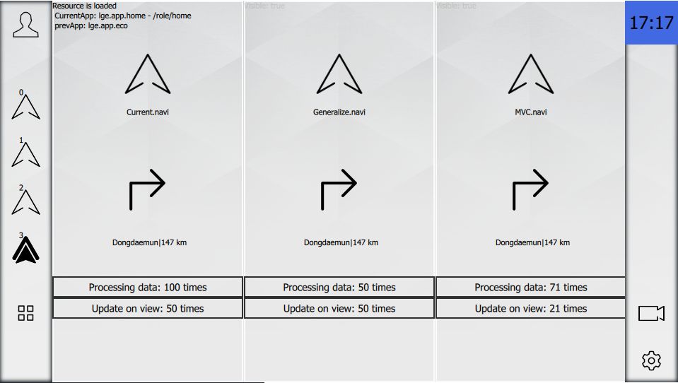
Image reference: slide_14_image_01.png

## Slide 15

Thank you 

Image reference: slide_15_image_01.png

## Slide 16

VI. Proposal Comparison and Conclusion

### Table
| Item |  | Generalize Home Tiles manager | Model-View-Controller architecture |
| Problems | 1 | - Data processing will occurs one time on feature apps | - Data processing will occur 2 times by the engineer of features corresponding |
|  | 2 | - Both Home and feature apps need to update | - The implementation will be executed by engineer of features corresponding on Home side. |
|  | 3 | - Home needs to request update from features if needed. It will takes time and delay can occurs. | - The update with exist data from model. |
|  | 4 | - Data is controlled by features. If features is not fitted, data cannot created or updated. Home does not care about that. | - Data will be controlled by controller layer. Home only create/update if needed. |
| Quality Attribute Requirements | 1 | Booting time can be improved but Tile’s information need to wait for other features ready. The waiting time can be extended. It impacts to user experience. | KPI of booting time can be improved because of reduce unnecessary data/logic for features. |
|  | 2 | No impact to KPI of switch view | No impact to KPI of switch view |
|  | 3 | No impact to KPI of switch another app | No impact to KPI of switch another app |
|  | 4 | No impact to animation | Smoother by ignoring update while animation is running. |
| Implementation Impact Analysis |  | - Home HMI: Remove internal logic & generalized Home tile manager - App manager service: Create new APIs to allow feature requests to update tiles. - Feature applications: Implement new logic to adapt to the new Home tile process. | Home HMI: - Re-structure to divide a big feature into small modules. - Apply “lazy-load” for components. Features applications: The engineer can involve to develop Home tile. |

