# Raw Document Content

- Source file: FA_Common3D_document_v1.4_final[1].docx

Function Architect
Common 3D in P-IVI

Revision History

## Table
| Version | Date | Comment | Author | Approver |
| --- | --- | --- | --- | --- |
| 1.0 | 2023-08-25 | First version. | Truong Quoc Hoang |  |
| 1.1 | 2023-09-01 | Update: Verify the final architecture design section. | Truong Quoc Hoang |  |
| 1.2 | 2023-09-25 | - Update more detail on Problems - Update score for Proposals - Update more information on figures and tables | Truong Quoc Hoang |  |
| 1.3 | 2023-10-04 | - Update Common 3D Model View Controller Architecture - Corrected some mistakes | Truong Quoc Hoang |  |
| 1.4 | 2023-10-09 | - Update memory used - Update Request Management Diagram | Truong Quoc Hoang |  |

Table of Contents

1	Project Context	6

1.1	Introduction	6

1.2	Software Architecture Design	6

1.3	Situation	6

2	Problems	7

3	Architecture Proposal	8

3.1	Current Architecture	8

3.2	Proposal	9

3.2.1	Proposal 1: 3D Optimization	9

3.2.2	Proposal 2: Build a mechanism to control and display in one place (Common 3D)	9

3.2.2.1	Proposal 2.1	9

3.2.2.2	Proposal 2.2	9

3.2.2.3	Proposal 2.3 Logic and 3D in new hybrid service/ application.	10

3.2.2.4	API flow change	11

4	Comparison between the alternatives	12

4.1	Comparison between proposal 1 and proposal 2	12

4.2	Comparison between proposal 2.1, 2.2, 2.3	12

4.3	Decide the Proposal	13

5	Architecture Design	14

5.1	New implementation	14

5.2	External Design	14

5.2.1	Common 3D Service Lifecycle	15

5.3	Internal Design	16

5.3.1	Static Design	16

5.3.1.1	Model View Controller Architecture	16

5.3.1.2	Class Diagram	17

5.3.2	Dynamic Design	18

5.3.2.1	Interaction Design	18

5.3.2.1.1	Set3DModelVisible	18

5.3.2.1.1	Sequence diagram for Set3DModelPosition API	18

5.3.3	Algorithm Design	19

5.3.3.1.1	Control the 3D view	19

5.3.3.1.1.1	Basic concepts about 3D development:	19

5.3.3.1.1.1.1	Coordinate Systems	19

5.3.3.1.1.1.2	Camera	20

5.3.3.1.1.2	How to apply in P-IVI	20

5.3.3.1.1.2.1	Situation	20

5.3.3.1.1.2.2	How to control the view?	20

5.3.3.1.1.2.3	Viewport when switching between applications:	22

5.3.3.1.2	Request Management	23

6	Verify the final architecture design	25

6.1	Loading time	25

6.2	Memory used	25

6.3	CPU used	25

6.3.1	Normal case	26

6.3.2	Receiving CAN signals	27

6.4	Stability	28

6.4.1	Stress test	28

6.4.2	Automation test	28

Figures

Figure 1 Proteus IVI Concept	6

Figure 2 P-IVI Software Architecture Design	6

Figure 3 3D models in P-IVI applications	7

Figure 4 Current Architecture for Handling 3D	8

Figure 5 Proposal 2.1	9

Figure 6 Proposal 2.2	9

Figure 7 Proposal 2.3	10

Figure 8 Current sequence diagram for onSteeringWheelAngle API	11

Figure 9 New sequence diagram for onSteeringWheelAngle API	11

Figure 10 External Design	14

Figure 11 Common 3D Service Lifecycle	15

Figure 12 Common 3D MVC Architecture	16

Figure 13 Common 3D Class Diagram	17

Figure 14 Set3DModelVisibleAPI	18

Figure 15 Sequnce diagram for Set3DModelPosition API	18

Figure 16 3D concept: Coordinate Systems	19

Figure 17 3D concept: Camera	20

Figure 18 P-IVI 3D Viewport	22

Figure 19 Class diagram: Request	23

Figure 20 Request Management Diagram	24

Figure 21 CPU used of 4x4i application in normal case - Before	26

Figure 22 CPU used of 4x4i application in normal case - After	26

Figure 23 CPU used of 4x4i application in receiving CAN signals case - Before	27

Figure 24 CPU used of 4x4i application in receiving CAN signals case - After	27

Tables

Table 1 Class Description	8

Table 2 Compare Proposal 1 and Proposal 2 based on Quality attributes.	12

Table 3 Compare Proposal 1 and Proposal 2 based on realistic.	12

Table 4 Pros and Cons of Proposal 2.1, 2.2, 2.3	12

Table 5 Class Description	17

Table 6 Loading time	25

Table 7 Loading time without 3D model	25

Table 8 CPU used of 3D applications in normal case	26

Table 9 CPU used of 3D applications in receiving CAN signals case	27

Table 10 Street test for 3D applications	28

Project Context

Introduction

This document provides solutions for Proteus IVI (P-IVI).

P-IVI project delivers software for Jaguar and Landrover cars with the vision to achieve faster, feature-rich user experience even for existing vehicles. It is focused on three main areas: Easy to Upgrade, CE-Like user-experience, and Seamless Digital Life.
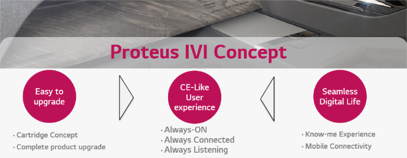
Image reference: doc_image_001.png

Software Architecture Design
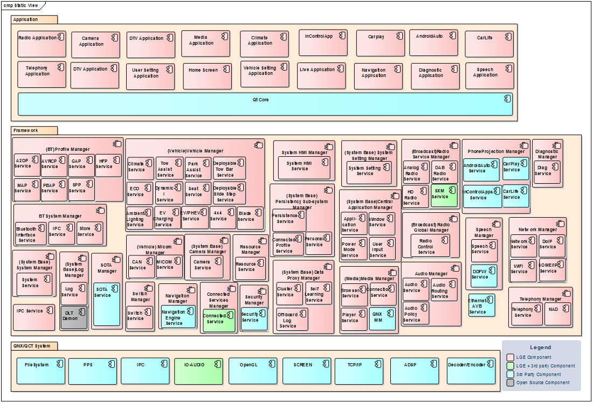
Image reference: doc_image_002.png

Situation

P-IVI is relatively stable, but when I work on HMI applications and the Framework layer, I see some problems, and it would be better. My idea come from we have some 3D issues related to performance. It’s hard to fix, and it’s time to come up with a radical solution instead of trying to fix it time by time.

Problems

In P-IVI, many applications use the same 3D model, but each application uses the 3D model and processes it separately.

They have the same 3D model but different perspectives of views, and some mirror 3D modules.

They receive signals from the 4x4 service to display the change in model, like rotating the wheel, increasing/decreasing suspension, changing color, etc.

Image reference: doc_image_003.png

Image reference: doc_image_004.png

Image reference: doc_image_005.png

Cons:

3D models take heavy performance.

The application takes at least 2 seconds to load the 3D model. It causes the 3D not display issue if the 3D is not yet finished for loading.

The application takes 6% CPU usage on average when updating and rendering the 3D model. It causes delay and freeze issues.

Duplicate logic and resources for each application.

Use the common logic handle separately in 3 applications.

The 3D model resource included in each application increases the size of the build and the memory used for processes.

Synchronization issue because each model is handled separately.

Mismatch in the 3D model module between applications.

Latency.

Architecture Proposal

To solve this problem, I suggest four options focus on two approaches:

Optimize the 3D model.

Build a mechanism to control and display in one place.

Current Architecture

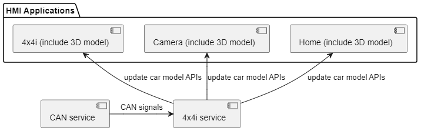
Image reference: doc_image_006.png

Table 1 Class Description

## Table
| Component | Description | Remark |
| --- | --- | --- |
| CAN service | CanService is to publish a CAN signal to MicomService and to listen to a CAN message from MicomService. When it receives a CAN message from MicomService, it parses it to the signals belonging to it or the groups and then distributes it to the clients subscribing to it. When it receives a signal or a group from a client, it encodes a MICOM message and then sends it to MicomService. |  |
| 4x4i service | 4x4iService provides manoeuvers to Targeted Terrain Launch Mode, Wade aid, etc. It translates the CAN signals between the 4x4i application and the 4x4i ECU. It shows the status of ATPC, Terrain Response Info, Wheel Information, Vehicle Geometry, and Slope Assist. |  |
| 4x4i application | An HMI Application for the 4x4i feature uses the 3D model. |  |
| Camera application | An HMI Application for the Camera feature uses the 3D model. |  |
| Home application | An HMI Application for the Home feature uses the 3D model. |  |

After receiving CAN signals, the CAN service transmits them to the 4x4i service.

4x4i service handles the CAN signals and deploys necessary APIs to clients.

4x4i, Camera, the Home application receives the 3D signals and updates the model based on the signals.

Proposal

Proposal 1: 3D Optimization

This proposal keeps the current logic and focuses on improving the existing 3D models for each application. We need to improve:

Loading time for:

Initialization

Rendering

Updating

Resources consumption

Proposal 2: Build a mechanism to control and display in one place (Common 3D)

This proposal is based on the main idea that we only need one model instead of three for each application. To do this, we need to know about 3D concepts such as 3D coordination, 3D spaces, and 3D transformation.

Proposal 2.1

Logic in 4x4i service

HMI in a new 3D app
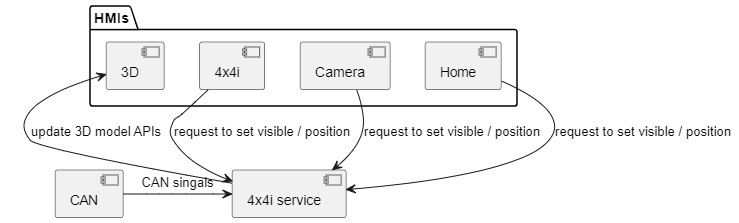
Image reference: doc_image_007.png

Update car model based on CAN signals:

After receiving CAN signals, the CAN service transmits them to the 4x4i service.

4x4i service handles the CAN signals and deploys necessary APIs to the 3D application.

Update car visibility and position based on the request from clients:

The client sends the request for visibility or update position to the 4x4i service.

The 4x4i service handles the request and deploys necessary APIs to the 3D application.

The 3D applications receive the APIs and update the 3D model.

Proposal 2.2

Logic in new 3D service

HMI in a new 3D app

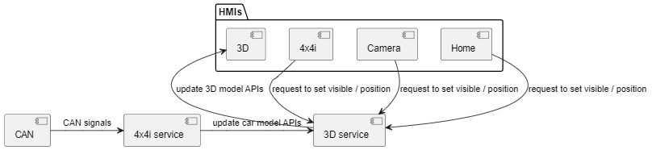
Image reference: doc_image_008.png

Update car model based on CAN signals:

After receiving CAN signals, the CAN service transmits them to the 4x4i service.

4x4i service handles the CAN signals and deploys necessary APIs to the 3D service.

The 3D service handles the 3D signals and deploys necessary APIs to the 3D application.

Update car visibility and position based on the request from clients:

The client sends the request for visibility or update position to the 3D service.

The 3D service handles the request and deploys necessary APIs to the 3D application.

The 3D applications receive the APIs and update the 3D model.

Proposal 2.3
Logic and 3D in new hybrid service/ application.
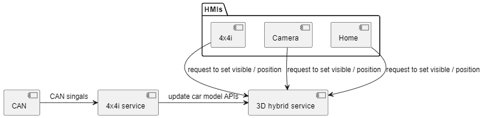
Image reference: doc_image_009.png

Update car model based on CAN signals:

After receiving CAN signals, the CAN service transmits them to the 4x4i service.

4x4i service handles the CAN signals and deploys necessary APIs to the 3D service.

The 3D service handles the 3D signals and update the 3D HMI in one process.

Update car visibility and position based on the request from clients:

The client sends the request for visibility or update position to the 3D service.

The 3D service handles the request and updates the 3D model.

API flow change

This is an example of an API change if we apply Proposal 2.

Current logic:
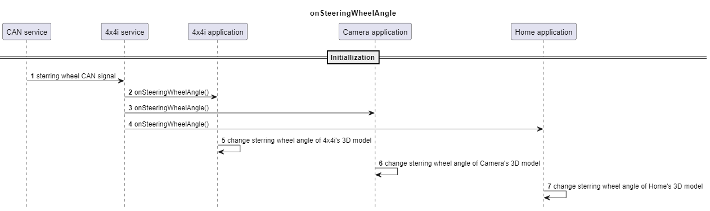
Image reference: doc_image_010.png

Proposal 2 logic:

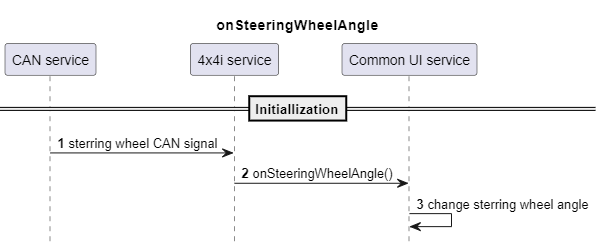
Image reference: doc_image_011.png

Figure 9 New sequence diagram for onSteeringWheelAngle API

Comparison between the alternatives

Comparison between proposal 1 and proposal 2

Table 2 Compare Proposal 1 and Proposal 2 based on Quality attributes.

## Table
| Quality attribute | Optimize the 3D model | Build a mechanism to control and display in one place |
| --- | --- | --- |
| Maintainability | - Need to maintain all applications when there is a change in the 3D model, like the current implementation. - It’s hard to control when we want to restructure in the future. | - Easier to maintain, only in Common 3D. - Easier to restructure in the future. |
| Reusability | Duplicate resources and logic for each application. | Highly reusable, the main logic and resource is centralized in one place. |
| Extensibility | Normal. We need to clone the source code and custom for a new application. | High. If a new application is needed using a 3D model, it’s easy to develop. |
| Feasibility | Not sure this proposal can be done effectively. | Yes. |
| Testability | The number of test cases that need to be created is less than proposal 2. We can use current test cases and focuses on performance test. | Need to create more test cases. |

Table 3 Compare Proposal 1 and Proposal 2 based on realistic.

## Table
| Criteria | Optimize the 3D model | Build a mechanism to control and display in one place |
| --- | --- | --- |
| Knowledge | Need to know deeply about 3D optimization and Qt platform. | - Understanding of service and HMI structure in P-IVI. - Understanding about 3D development. |
| Performance | Depending on the effectiveness of the 3D model can be optimized. | - Need to set up a new service, which takes memory and performance. - Reduce 66% of the memory consumed by 3D applications. |
| Potential Issues | - Synchronize issues because each model is handled separately. - Performance issues sometimes: very high CPU, stress test, etc. | Wrong display issues if the request management is not good. |
| Effort | High. Optimization in 3D development is quite complex and needs much effort. | High. We must build a new hybrid service with many implementations and develop the 3D application with effective request management. |

Comparison between proposal 2.1, 2.2, 2.3

Proposal 2.1: Logic in 4x4i service, HMI in a new 3D HMI application.

Proposal 2.2: Logic in new 3D service, HMI in a new 3D HMI application.

Proposal 2.3: Logic and 3D in new hybrid service/ application.

Table 4 Pros and Cons of Proposal 2.1, 2.2, 2.3

## Table
| Proposal | Pros | Cons | Evaluated Score |
| --- | --- | --- | --- |
| 2.1 | - The CAN signals for updating 3D models are handed in 4x4i service; it’s convenient when implementing 3D service here. | - 4x4i is a big service, and logic is handled here. If we add logic for 3D in the 4x4i service, it makes 4x4i bigger and has to take many things. - Potential performance issues. - Separate process takes time to communicate and has potential synchronize issues. | 7/10 |
| 2.2 | - Separate logic of the service and HMI application. | - We need to set up a new service, and a new HMI application lead to consumes much memory and resources. - Separate process takes time to communicate and has potential synchronize issues. | 8/10 |
| 2.3 | - We use only one process. The communication between service and application can be straightforward and quick. | - Need to build a hybrid service. It’s more complex a little bit than 2.1 and 2.2. | 9/10 |

Decide the Proposal

After comparing the proposals, I chose proposal 2 because it is more maintainable, reusability, extensibility, and feasibility.

In proposal 2, proposal 2.3 is the most suitable because it has good performance and avoids the communication risk between processes.

Architecture Design

New implementation

To do proposal 2.3: Build a hybrid service to manage the 3D model, I describe what things need to be done:

Setup a new service

List of APIs

Remove old 3D model source code in applications.

Implement new APIs for the 3D services:

Set visible

Set position

Implement a new mechanism for managing request

Handle APIs related to 3D car model in 3D service

Implement a 3D model displaying based on the viewport

Testing and measurement

External Design

Image reference: doc_image_012.png

Figure 10 External Design

Common 3D Service Lifecycle

Common 3D is a hybrid service with everything a service has. Like other services, the lifecycle of Common 3D service is as below diagram:

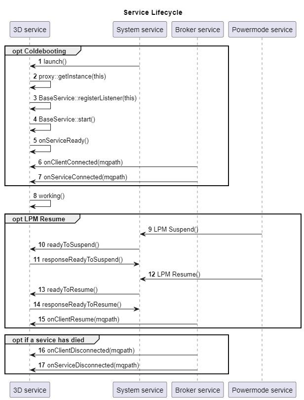
Image reference: doc_image_013.png

Figure 11 Common 3D Service Lifecycle

Internal Design

Static Design

Model View Controller Architecture
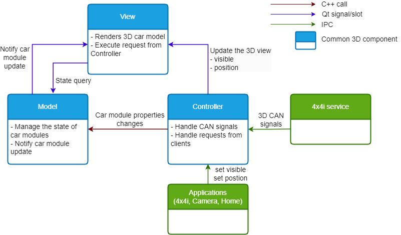
Image reference: doc_image_014.png

Common 3D uses MVC architecture pattern.

The View renders the 3D car model to the screen and executes the request from the Controller.

The Model manages the car module's state and notifies the state changes to the View.

The Controller handles 3D CAN signals and sends the request to the Model if it has any changes. The Controller also handles the request from Applications and sends the request to View if needed.

Class Diagram

Image reference: doc_image_015.png

Table 5 Class Description

## Table
| Class | Description | Remark |
| --- | --- | --- |
| Com3d | Base manager for both service and HMI |  |
| HmiManager | Manager HMI |  |
| 3DService | Main service of 3D service |  |
| BaseService | Base class defines almost everything the service needs |  |
| ListenerManager | This class is for managing all listener |  |
| Scene3DController | Manage all logic related to the 3D model |  |
| CcfUtil | CCF manager |  |
| Listener | Interface for a Listener |  |
| Drv4x4iListener | Listen to messages from the Drv4x4i service. |  |
| AppServiceListerner | Listen to messages from the App service. |  |
| SystemSettingListener | Listen to messages from the SystemSetting service. |  |

Dynamic Design

Interaction Design

Set3DModelVisible

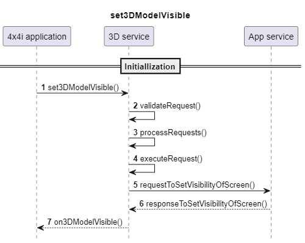
Image reference: doc_image_016.png

Figure 14 Set3DModelVisibleAPI

Sequence diagram for Set3DModelPosition API
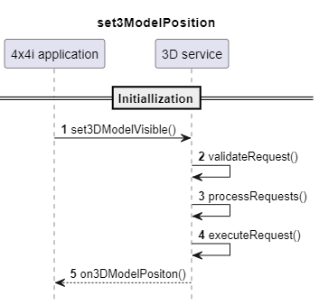
Image reference: doc_image_017.png

Algorithm Design

Control the 3D view

Basic concepts about 3D development:

Coordinate Systems

The process of transforming coordinates to NDC is usually done step-by-step, where vertices are transformed into several coordinate systems before finally reaching NDC. Transforming vertices to intermediate coordinate systems has advantages because certain operations/calculations are easier in specific coordinate systems. There are a total of 5 different coordinate systems that are important:

Local space

World space

View space

Clip space

Screen space

Image reference: doc_image_018.png

Each of these coordinate systems represents a different state in which vertices are transformed before becoming fragments.

To transform coordinates from one space to the next, we use various transformation matrices, the most important being the model, view, and projection matrices. Vertices start in local space, then go through transformations to world coordinates, view coordinates, clip coordinates, and finally end up as screen coordinates. Each transformation serves a specific purpose, as illustrated in the overall process.

Local space:

Local space refers to the coordinate space that is local to an object. It represents the initial position of an object, typically with the object's origin at (0, 0, 0). When creating models in software packages, such as Blender, the vertices are defined in local space, relative to the object itself.

World space:

World space is a coordinate space that encompasses a larger world or scene. It represents the position of objects within this world, relative to a global origin. The model matrix is used to transform vertices from local space to world space. This matrix translates, scales, and rotates the object to position it within the world.

View Space:

View space, also known as camera space or eye space, is the coordinate system that represents the view from the camera's perspective. It is the result of transforming world-space coordinates to coordinates that are in front of the viewer. This transformation is achieved through translations and rotations to position objects in front of the camera. The view matrix is used to transform from world to view space.

Clip Space:

After the vertex shader run, OpenGL expects the coordinates to be within a specific range, known as clip space. Any coordinates outside this range are clipped and discarded, while the remaining coordinates become visible fragments on the screen. A projection matrix is used to transform vertex coordinates from view space to clip space. The projection matrix defines a range of coordinates and converts them to normalized device coordinates (NDC) in the range of -1.0 to 1.0. Coordinates outside this range are clipped and not visible on the screen.

Camera

We need to simulate movement and create a 3D scene. It is important to deeply understand the camera/view space concept, which represents the coordinates as seen from the camera's perspective. We will use this to find out a good approach for P-IVI. The view matrix is used to transform world coordinates into view coordinates relative to the camera's position and direction.

Image reference: doc_image_019.png

To define a camera, we need its position in world space, the direction it is looking at, and vectors pointing to the right and upwards from the camera. By creating a coordinate system with these parameters, we can effectively simulate camera movement and navigation in the 3D scene.

How to apply in P-IVI

Situation

In P-IVI, we have:

2 main models: one for Landrover and one for Jaguar, only one model can be displayed at a time.

The view is not changed; each module of the car is updated, but the car itself is not moving.

How to control the view?

In P-IVI, it has only one perspective of view, which means we don’t need to update the model itself when switching apps, just change the position of the viewport. We define a viewport, and when switching apps, we change the coordinates of the viewport and the position of the camera.

We need to update one time when switching between applications or between tabs in one application:

The position of the camera

The position of viewport

Here is the Camera defined using Qt3D:

Camera {

    id: camera

    property real xOffset: 0.0

    property real yOffset: 7.0

    property real zOffset: -10.0

    projectionType: CameraLens.PerspectiveProjection

    fieldOfView: 25

    nearPlane: 0.1

    farPlane: 1000.0

    position: Qt.vector3d(xOffset, yOffset, zOffset)

    upVector: Qt.vector3d(0.0, 1.0, 0.0)

    viewCenter: Qt.vector3d(0.0, 1.0, 0.0)

    function updatePosition(xOffset, yOffset, zOffset) {

        position.x = xOffset

        position.y = yOffset

        position.z = zOffset

    }

    function update(positionValue) {

        position.x = positionValue.x + xOffset

        position.y = positionValue.y + yOffset

        position.z = positionValue.z + zOffset

        viewCenter = positionValue

    }

}

Because the 3D model has some fixed position, we can pre-defined these positions and set the position of the camera based on this when we need to update.

Viewport when switching between applications:

In the pictures, I colored the border of the viewport with red.

Image reference: doc_image_020.png

In the 4x4i application, the viewport position is equal to the screen size, and the 3D model is the center of the screen.

In the Camera application, the 3D model can be the right, or left, we change the position of the viewport to make sure the car displays in the proper position.

Request Management

Let's define the structure of a request, we have three fields:

Image reference: doc_image_021.png

Time

Requested client

Type of request.

Time: Timestamp when the client makes the request.

Clients can request to 3D service:

4x4i

Camera

Home

Type of request:

Show 3D model

Hide 3D model

Update 3D model position

Because Common 3D may have received many requests at the time, we need to build a mechanism with a queue to manage the request.

Image reference: doc_image_022.png

Step 1: Clients make the request.

Step 2: Common 3D receives and pushes the request to the queue.

Step 3: Common 3D processes the request based on the order in the queue.

Step 4: Validate request.

Step 5: Execute request. In this step, Common 3D update the 3D model position if it is an update position request and send the visible request to the App service if it is a show/ hide request.

In Step 4, we must also define the rules to ensure all requests are correct.

Order of the request should be Update position/show/hide. Update position must be done before hiding because when we update position when the 3D model is showing, the user can see the model change position, which is a display bug.

Show cannot execute if the current foreground app is not a valid client.

The duplicate request from the same client should be removed; only care about the last one in the queue.

If the show and hide come simultaneously, the hide should be prioritized because, in rare cases, if there is a bug if a request is wrong, the 3D model not displaying is better than the 3D model showing in the wrong place.

Verify the final architecture design

To verify the final architecture, we need to measure:

Loading time

Memory used

CPU used

Stability

Loading time

The KPI of loading time for application before and after applying Common 3D.

Steps:

SW upgrade and Cold booting (make sure LOG is OFF by default)

Wait for at least 2 minutes and launch the corresponding HMI application

Connect to the board and do the command: slog2info a | grep KPI_OPEN_APPLICATION

Get the result of the corresponding application

Do the test at least five times and get the average result.

Without 3D model

Table 6 Loading time

## Table
| Application | Before (ms) | After (ms) | Change (+/-) | Remark |
| --- | --- | --- | --- | --- |
| 4x4i | 557 | 469 | -88 |  |
| Camera | 1435 | 1354 | -81 |  |
| Home | 11941 | 11794 | -147 |  |
| Common 3D | N/A | 96 | +96 |  |
| Total | 13933 | 13713 | -220 |  |

3D model loading time

Table 7 Loading time without 3D model

## Table
| Application | Before (ms) | After (ms) | Change (+/-) | Remark |
| --- | --- | --- | --- | --- |
| 4x4i | 2089 | 0 | -2089 |  |
| Camera | 1822 | 0 | -1822 |  |
| Home | 2008 | 0 | -2088 |  |
| Common 3D | N/A | 1827 | +1827 |  |
| Total | 5919 | 1827 | -4092 |  |

Memory used

Private memory and graphic memory are used.

## Table
| Application | Before (MB) | After (MB) | Change (+/-) | Remark |
| --- | --- | --- | --- | --- |
| 4x4i | 249.725 | 137.077 | -112.648 |  |
| Camera | 240.749 | 178.770 | -61.979 |  |
| Home | 347.089 | 331.857 | -15.232 |  |
| Common 3D | N/A | 140.285 | +166.285 |  |
| Total | 837.563 | 787.989 | -49.574 |  |

CPU used

I wrote a script to measure the current memory used by the CPU when 3D. This script will record how many percent the CPU takes for application in a period of time and get the average value.

Normal case

The measure is recorded in case the application uses the 3D model, the 3D model is displayed on the screen but does not receive any CAN signals, which means the 3D model doesn’t update.

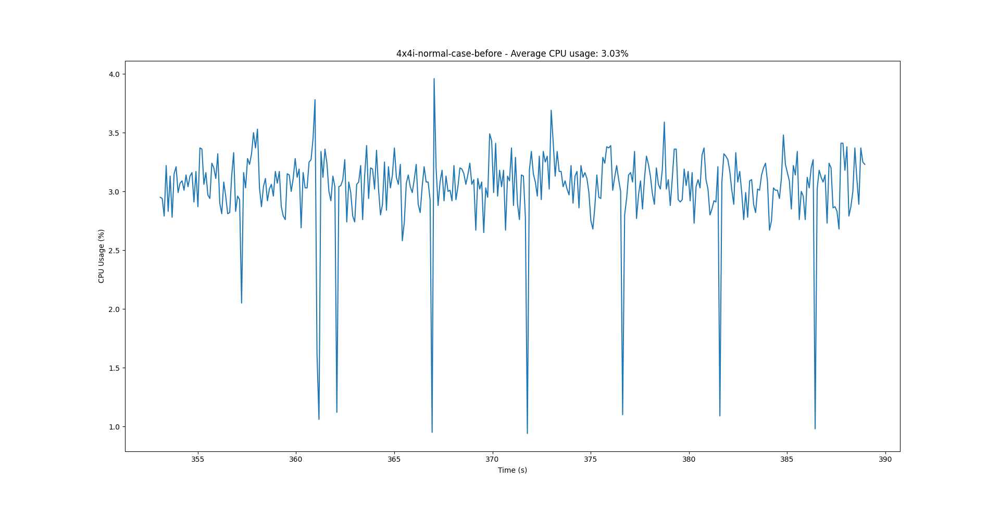
Image reference: doc_image_023.png

Figure 21 CPU used of 4x4i application in normal case - Before

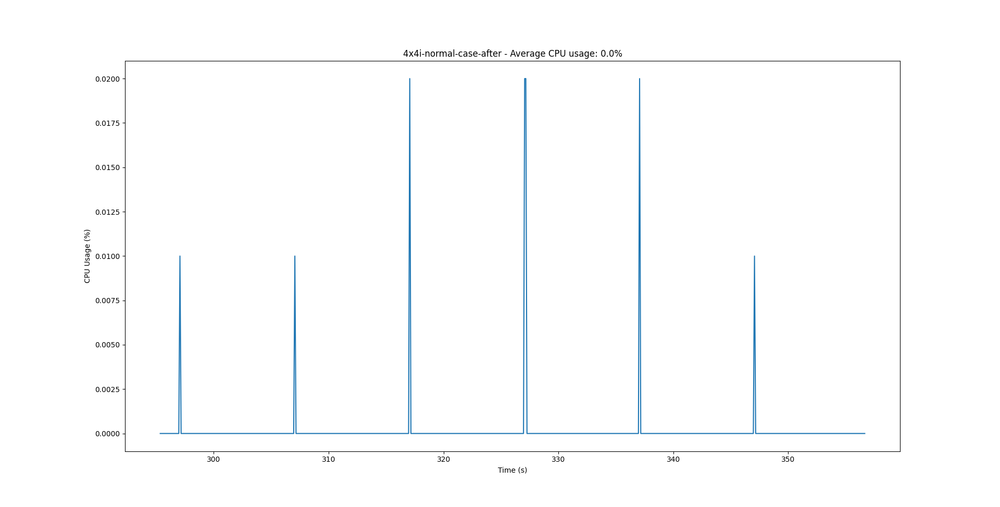
Image reference: doc_image_024.png

Figure 22 CPU used of 4x4i application in normal case - After

Table 8 CPU used of 3D applications in normal case

## Table
| Application | Before (%) | After (%) | Change (+/-) |
| --- | --- | --- | --- |
| 4x4i | 3.03 | 0.00 | -3.03 |
| Camera | 3.14 | 0.00 | -3.14 |
| Home | 4.24 | 4.21 | -0.03 |
| Common 3D | N/A | 2.67 | +2.67 |
| Total | 10.41 | 6.88 | -3.53 |

Receiving CAN signals

The measure is recorded in case the application uses the 3D model, the 3D model is displayed on the screen, and the application receives many CAN signals continuously, which means the 3D model updates continuously.

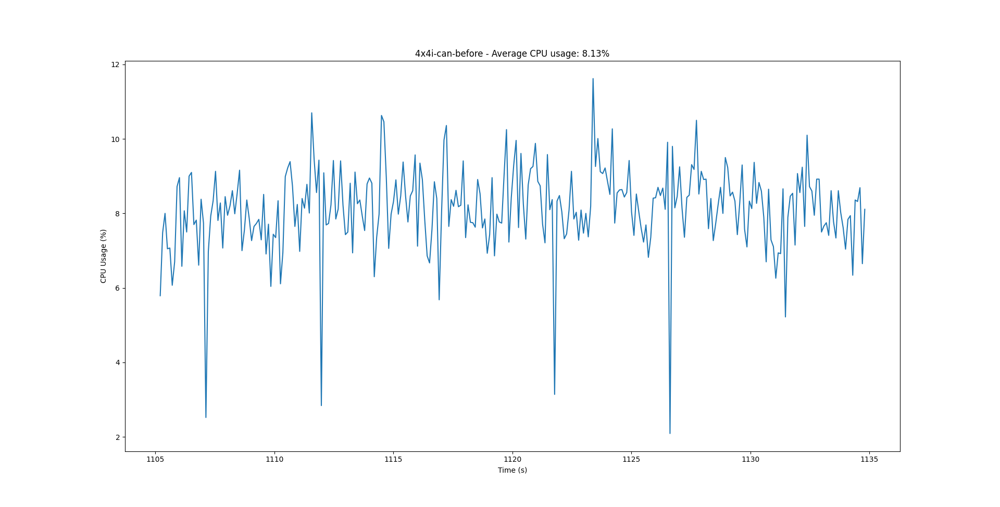
Image reference: doc_image_025.png
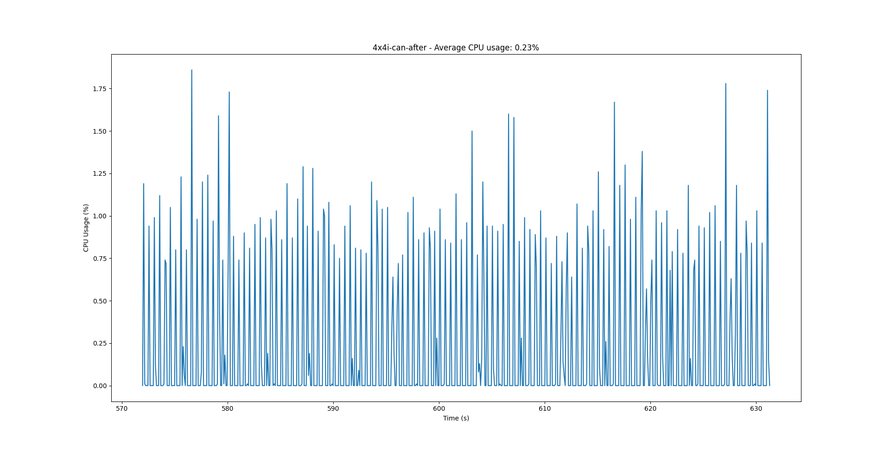
Image reference: doc_image_026.png

Figure 24 CPU used of 4x4i application in receiving CAN signals case - After

Table 9 CPU used of 3D applications in receiving CAN signals case

## Table
| Application | Before (%) | After (%) | Change (+/-) |
| --- | --- | --- | --- |
| 4x4i | 8.13 | 0.23 | -7.9 |
| Camera | 8.12 | 0.01 | -8.11 |
| Home | 15.56 | 9.87 | -5.69 |
| Common 3D | N/A | 2.67 | +2.67 |
| Total | 31.81 | 12.78 | -19.03 |

Stability

Stress test

Use the stress script test to test in case of high CPU from 80% to 99%, and make sure no critical issue occurs.

Table 10 Street test for 3D applications

## Table
| CPU (%) | 4x4i | Camera | Home | Common 3D |
| --- | --- | --- | --- | --- |
| 80 | OK | OK | OK | OK |
| 90 | OK | OK | OK | OK |
| 99 | OK | OK | OK | OK |

Automation test

Use the test script and ensure the following:

All functions work normally

No crash dump observed.

No critical issues can be found.
