# Raw Slide Content

- Source file: FA_Common3D_presentation_v1.4_final[1].pptx
- Total slides: 26

## Slide 1

LGE Internal Use Only

Function Architect
Common 3D in P-IVI

Image reference: slide_01_image_01.png

Truong Quoc Hoang
Supervise by Mr. Sang Hun Lee
LG Electronics Inc.

## Slide 2

Common 3D in P-IVI

Contents

Background
Current Architecture
Problems
Proposals
Comparison
Architecture Design
Measure

## Slide 3

1. Background

3

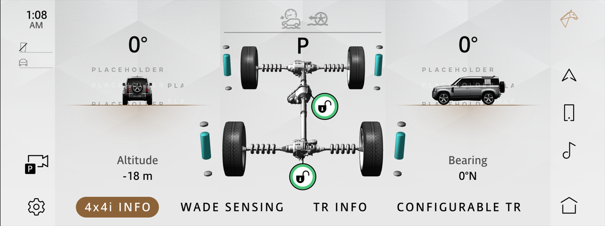
Image reference: slide_03_image_01.png

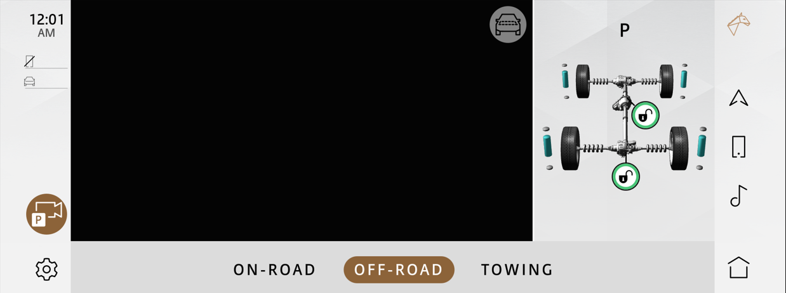
Image reference: slide_03_image_02.png

Image reference: slide_03_image_03.png

4x4i
application

Camera
application

Home
application

## Slide 4

1. Background

4

Image reference: slide_04_image_01.png

Image reference: slide_04_image_02.png

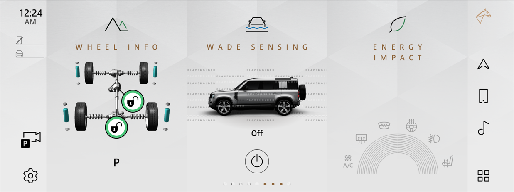
Image reference: slide_04_image_03.png

4x4i
application

Camera
application

Home
application

## Slide 5

2. Current Architecture

5

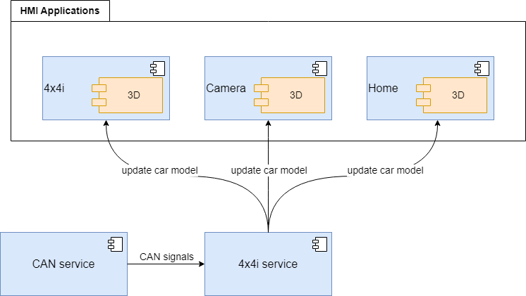
Image reference: slide_05_image_01.png

## Slide 6

3. Problems

Performance
Take at least 2 seconds to load the 3D model
-> display issue
Take ~6% CPU usage on average
-> delay, freeze issue
Duplicate logic and resources
Use the common logic, but it is handled separately in 3 applications
The 3D model included in each application
-> increases the size of the build and the memory used for processes
Synchronization issue
Mismatch in the 3D model module between applications
Latency

6

## Slide 7

4. Proposals

Proposal 1:
3D Optimization
Proposal 2:
Build a mechanism to control and display in one place
(Common 3D)

7

## Slide 8

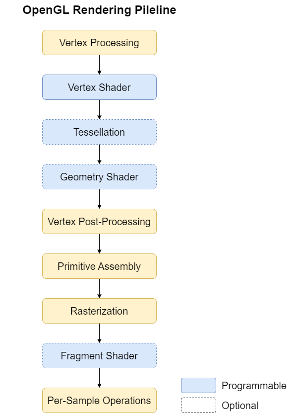
Image reference: slide_08_image_01.png

4.1 Proposal 1: 3D Optimization

8

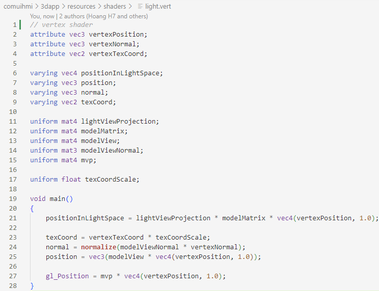
Image reference: slide_08_image_02.png

## Slide 9

4.1 Proposal 1: 3D Optimization

9

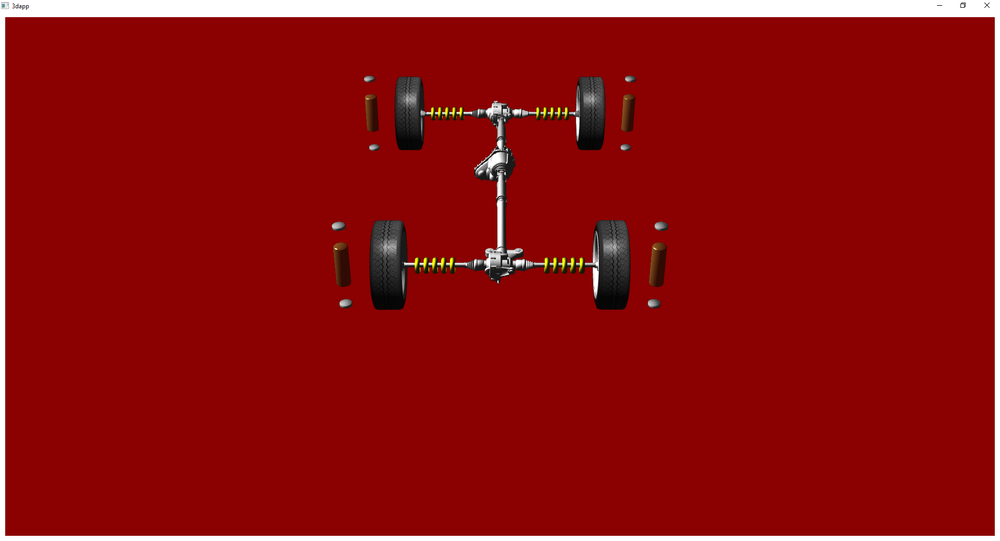
Image reference: slide_09_image_01.png

Symmetry

## Slide 10

4. Proposal 2: Common 3D

Proposal 2.1
Logic in 4x4i service
HMI in a new 3D app

10

1. Update car visibility and position based on the request from clients
2. Update car model based on CAN signals

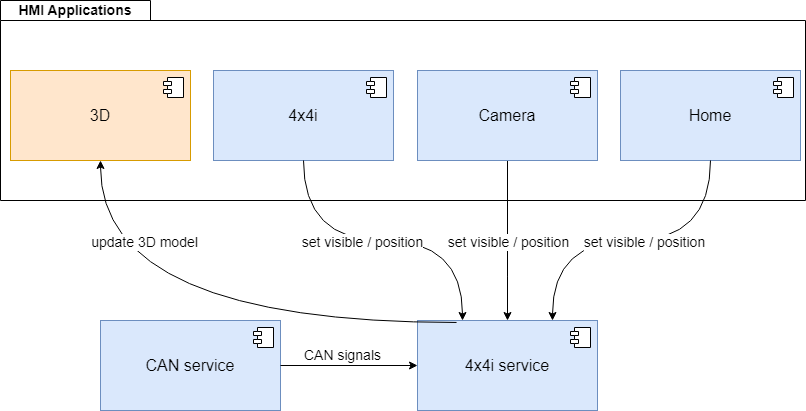
Image reference: slide_10_image_01.png

## Slide 11

4. Proposal 2: Common 3D

Proposal 2.2
Logic in new 3D service
HMI in a new 3D app

11

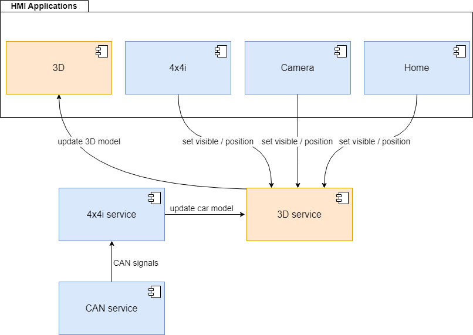
Image reference: slide_11_image_01.png

## Slide 12

4. Proposal 2: Common 3D

Proposal 2.3
Logic and 3D in new hybrid service.

12

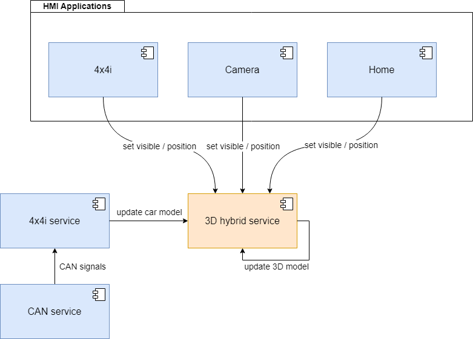
Image reference: slide_12_image_01.png

## Slide 13

5. Comparison

13

Proposal 1:
3D Optimization

Proposal 2:
Common 3D

Performance

Maintainability

Extensibility

Testability

More important

Less important

2.3 Hybrid service is better for performance.

## Slide 14

6. Architecture Design

14

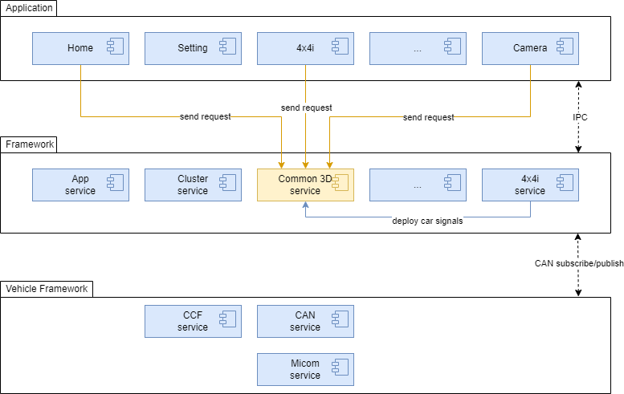
Image reference: slide_14_image_01.png

## Slide 15

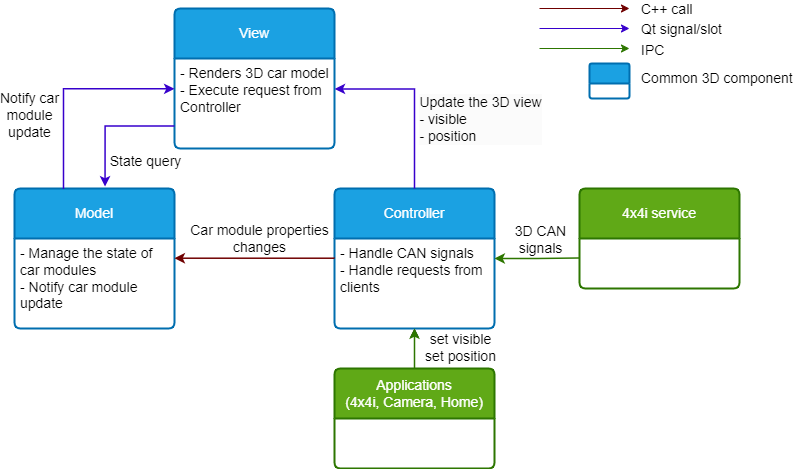
Image reference: slide_15_image_01.png

6. Architecture Design

15

MVC architecture pattern

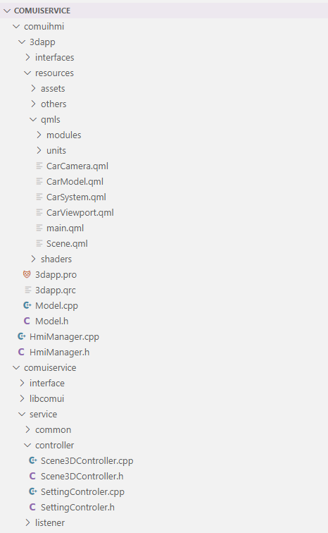
Image reference: slide_15_image_02.png

View

Model

Controller

Application

Service

## Slide 16

6. Control of the 3D view

16

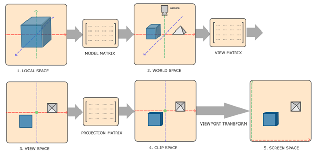
Image reference: slide_16_image_01.png

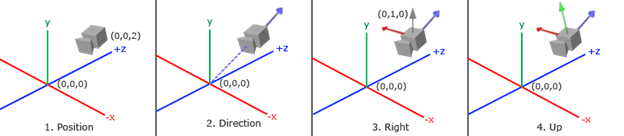
Image reference: slide_16_image_02.png

The position of the viewport
The position of the camera

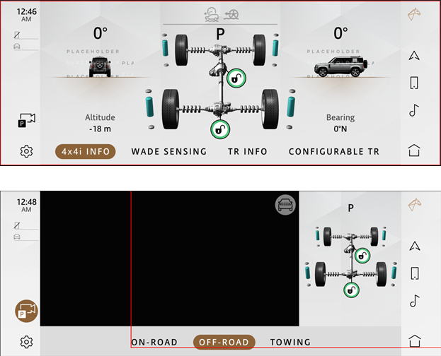
Image reference: slide_16_image_03.png

## Slide 17

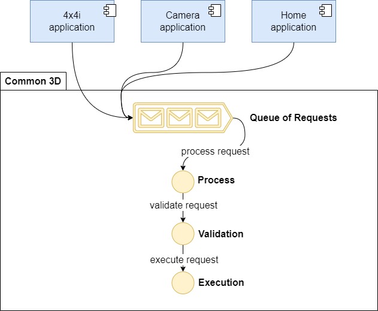
Image reference: slide_17_image_01.png

6. Request Management

17

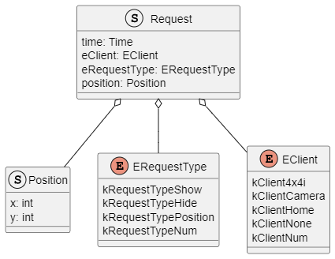
Image reference: slide_17_image_02.png

=> Rule (Appendix)

## Slide 18

7. Measure

18

### Table
| Application | Before (ms) | After (ms) | Change (+/-) |
| 4x4i | 2089 | 0 | -2089 |
| Camera | 1822 | 0 | -1822 |
| Home | 2008 | 0 | -2088 |
| Common 3D | N/A | 1827 | +1827 |
| Total | 5919 | 1827 | -4092 |

3D model loading time

### Table
| Application | Before (%) | After (%) | Change (+/-) |
| 4x4i | 8.13 | 0.23 | -7.9 |
| Camera | 8.12 | 0.01 | -8.11 |
| Home | 15.56 | 9.87 | -5.69 |
| Common 3D | N/A | 2.67 | +2.67 |
| Total | 31.81 | 12.78 | -19.03 |

CPU used

### Table
| Application | Before (MB) | After (MB) | Change (+/-) |
| 4x4i | 249.725 | 137.077 | -112.648 |
| Camera | 240.749 | 178.770 | -61.979 |
| Home | 347.089 | 331.857 | -15.232 |
| Common 3D | N/A | 140.285 | +166.285 |
| Total | 837.563 | 787.989 | -49.574 |

Memory used

## Slide 19

19

Q&A

## Slide 20

5. Comparison between proposal 1 and proposal 2

20

### Table
| Criteria | 1. Optimize the 3D model | 2. Build a mechanism to control and display in one place |
| Knowledge | Need to know deeply about 3D optimization and Qt platform. | - Understanding of service and HMI structure in P-IVI. - Understanding about 3D development. |
| Performance | Depending on the effectiveness of the 3D model can be optimized. | - Need to set up a new service, which takes memory and performance. - Reduce ~66% of the memory and CPU consumed by 3D applications. |
| Potential Issues | - Synchronize issues because each model is handled separately. - Performance issues sometimes: very high CPU, stress test, etc. | Wrong display issues if the request management is not good. |
| Effort | High. Optimization in 3D development is quite complex and needs much effort. | High. We must build a new hybrid service with many implementations and develop the 3D application with effective request management. |

## Slide 21

Comparison between proposal 2.1, 2.2 and 2.3

21

### Table
| Solution | Pros | Cons | Evaluated score |
| 2.1 Logic in 4x4i service, HMI in a new 3D HMI application | - The CAN signals for updating 3D models are handed in 4x4i service; it’s convenient when implementing 3D service here. | - 4x4i is a big service, and logic is handled here. If we add logic for 3D in the 4x4i service, it makes 4x4i bigger and has to take many things. - Potential performance issues. - Separate process takes time to communicate and has potential synchronize issues. | 7/10 |
| 2.2 Logic in new 3D service, HMI in a new 3D HMI application | - Separate logic of the service and HMI application. | - We need to set up a new service, and a new HMI lead to consumes much memory and resources. - Separate process takes time to communicate and has potential synchronize issues. | 8/10 |
| 2.3 Logic and 3D in new hybrid service | - We use only one process. The communication between service and application can be straightforward and quick. | - Need to build a hybrid service. It’s more complex a little bit than 2.1 and 2.2. | 9/10 |

## Slide 22

Architecture Design

22

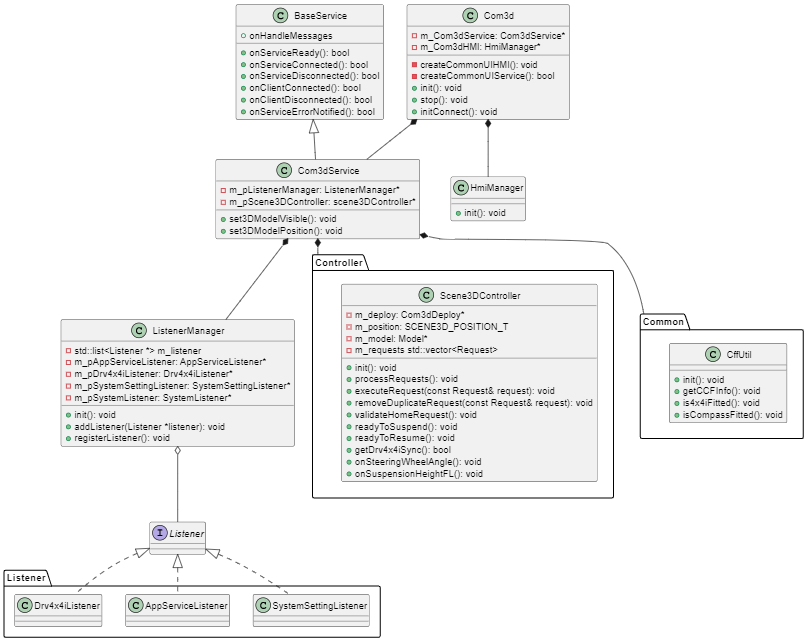
Image reference: slide_22_image_01.png

## Slide 23

Validate request rules

1. The order of the request should be Update position/show/hide. Update position must be done before hiding because when we update position when the 3D model is showing, the user can see the model change position, which is a display bug.
2. Show cannot execute if the current foreground app is not a valid client.
3. The duplicate request from the same client should be removed; only care about the last one in the queue.
4. If the show and hide come simultaneously, the hide should be prioritized because, in rare cases, if there is a bug if a request is wrong, the 3D model not displaying is better than the 3D model showing in the wrong place.

23

## Slide 24

7. Loading time

24

### Table
| Application | Before (ms) | After (ms) | Change (+/-) |
| 4x4i | 557 | 469 | -88 |
| Camera | 1435 | 1354 | -81 |
| Home | 11941 | 11794 | -147 |
| Common 3D | N/A | 96 | +96 |
| Total | 13933 | 13713 | -220 |

### Table
| Application | Before (ms) | After (ms) | Change (+/-) |
| 4x4i | 2089 | 0 | -2089 |
| Camera | 1822 | 0 | -1822 |
| Home | 2008 | 0 | -2088 |
| Common 3D | N/A | 1827 | +1827 |
| Total | 5919 | 1827 | -4092 |

Application loading time without the 3D model

3D model loading time

## Slide 25

7. CPU used

25

### Table
| Application | Before (%) | After (%) | Change (+/-) |
| 4x4i | 3.03 | 0.00 | -3.03 |
| Camera | 3.14 | 0.00 | -3.14 |
| Home | 4.24 | 4.21 | -0.03 |
| Common 3D | N/A | 2.67 | +2.67 |
| Total | 10.41 | 6.88 | -3.53 |

### Table
| Application | Before (%) | After (%) | Change (+/-) |
| 4x4i | 8.13 | 0.23 | -7.9 |
| Camera | 8.12 | 0.01 | -8.11 |
| Home | 15.56 | 9.87 | -5.69 |
| Common 3D | N/A | 2.67 | +2.67 |
| Total | 31.81 | 12.78 | -19.03 |

Receiving CAN signals case:

Not updating:

## Slide 26

Demo

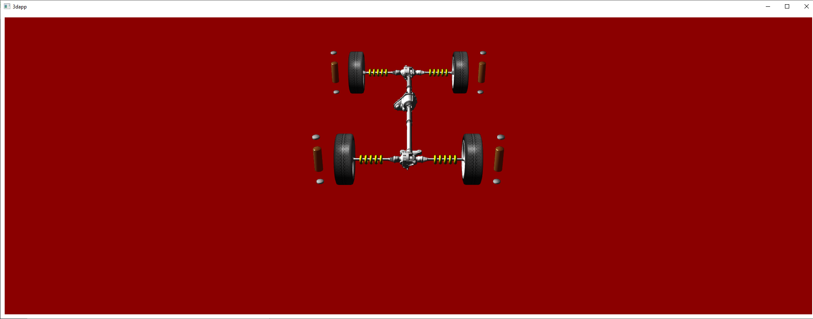
Image reference: slide_26_image_01.png

26

