# Raw Document Content

- Source file: FA_Nguyen_Van_Thinh_AllianceUpdateManager_v0.4_final[1].docx

FA Alliance Update Manager Architecture

About this document

## Table
| Issuing authority | A-IVI2 |
| --- | --- |
| Status of document | In Progress |

Revision history

## Table
| Version | Date | Notes | Author | Approval |
| --- | --- | --- | --- | --- |
| 0.1 | 2022.07.25 | Initial Release | Thinh Nguyen Van |  |
| 0.2 | 2022.08.18 |  | Thinh Nguyen Van |  |
| 0.3 | 2022.09.20 |  | Thinh Nguyen Van |  |

Purpose

This document specifies the software architectural design for Alliance Update Manager Architecture on A-IVI2 system.

Background

The update feature is based on the following features:

OMA DM SCOMO service used to provide update package to the vehicle,

OMA DM DESCMO service used to activate vehicle services (custom setting),

USB stick update used to provide update package to the vehicle.

The diagram below represents the update systems involved in the update feature.
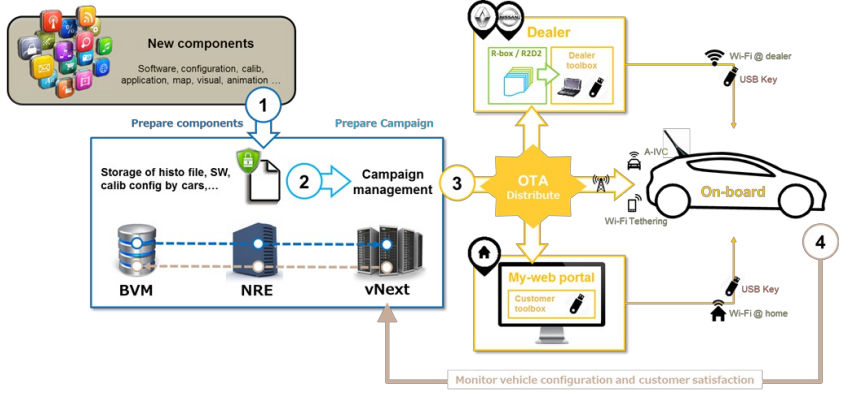
Image reference: doc_image_001.png

Figure 1.Update functional diagram

* BVM, NRE, vNext: OTA servers

Prepare new components.

Prepare and management Update campaign.

Distribute Update packages.

Monitor update status and customer satisfaction.

Scope

SW Architectural Representations

Architectural Alternatives

Interface Design

Related documents

F-A03-02-00-01_FOTA_Appendix_UPDATE Campaign v1.8.xlsx

F-A03-02-00-10_FOTA_Appendix_STATEMACHINES_v1.0rc19.xlsx

F-A03-02-10_Step2.x FOTA FOTA-CLIENT states diagram_v1.1.vsdx

F-A03-02-14_(Step2.5 FOTA) FOTA communication sequence_25.4.0.xlsx

Acronyms / Glossary

## Table
| Acronyms | Description |
| --- | --- |
| FOTA | Firmware Over The Air |
| AUM | Alliance Update Manager |
| ECU | Electronic control unit |
| IVI | In-Vehicle Infotainment |
| SCOMO | Software Component |
| DESMO | Device Settings Management Object |
| DIL | Device Integration Layer |
| DP | Data Package |
| SWMC | Software Management Client |

Table of Figures:

Figure 1.Update functional diagram	1

Figure 2. FOTA campaigns	4

Figure 3. System software architecture context diagram	5

Figure 4: Context diagram of Alliance Update Manager sequential design	6

Figure 5. Sequence diagram of sequential design	7

Figure 6: Context diagram of Alliance Update Manager state machine design	8

Figure 7: FOTA State diagram	9

Figure 8. Sequence diagram of Alliance Update Manager state machine design	10

Figure 9. Software component diagram of Update module	11

Figure 10. Class diagram	14

Figure 11. Event flow diagram	22

Figure 12. Distribution sequence diagram	24

Figure 13. Installation sequence diagram	26

Figure 14. Event processing algorithm	27

Overview

Overall Descriptions

Alliance Update Manager (AUM) responsible for updating the software for IVI itself and other ECUs also. In update data package, it can be included one or many ECU packages so AUM has to support mono and multiple update in one campaign.

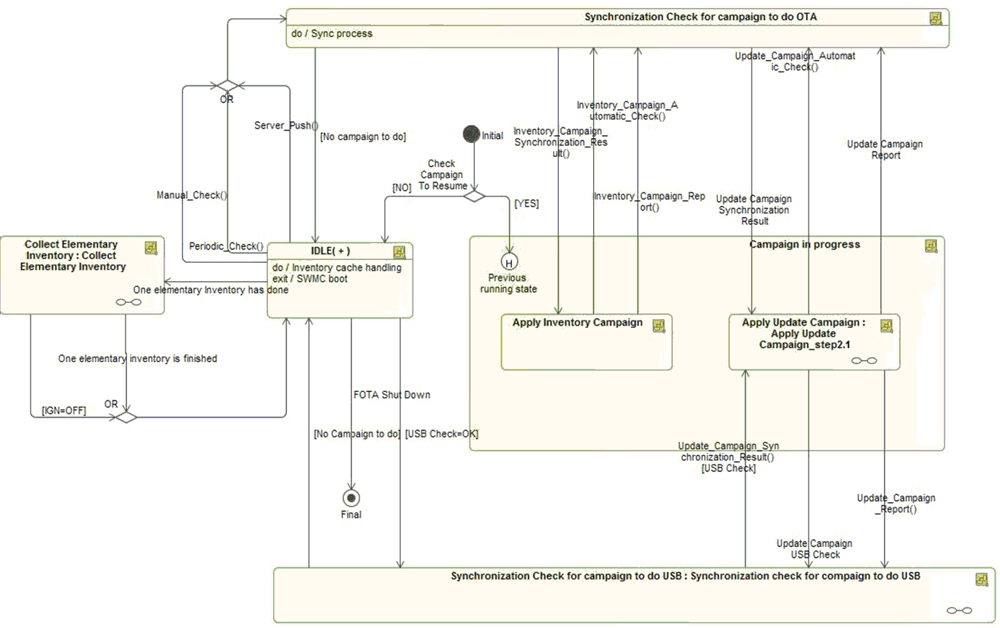
Image reference: doc_image_002.png

Figure 2. FOTA campaigns

In system software design, AUM has to locate in Framework layer and run as a native service(c++). It is one module of Update component which show in red box in below picture.

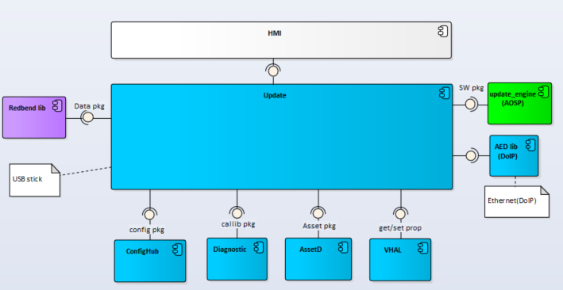
Image reference: doc_image_003.png

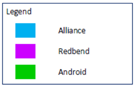
Image reference: doc_image_004.png

Figure 3. System software architecture context diagram

Functional Requirement

## Table
| Requirement ID | Requirement description |
| --- | --- |
| SAR-AAFW-FOTA-0002 | The Alliance Update manager component shall dispatch the update packages to the relevant Update handler. |
| SAR-AAFW-FOTA-0005 | The Alliance Update manager component shall manage the vehicle software cancel in case of installation issue |
| SAR-AAFW-FOTA-AUM-0002 | On a SCOMO install request from DIL, AUM shall support the followings phases: Menu Package Distribution, Package distribution, and installation. |
| SAR-AAFW-FOTA-AUM-0039 | AUM shall enter in suspend state on deep sleep entry event when AUM is in idle, pre-download, download, activation, cancel and rollback phases. |

Non-functional Requirement

## Table
| # | Quality Attributes | Requirement description |
| --- | --- | --- |
| 1 | Operability | The Alliance update manager handles a vehicle update context that will hold all metadata and status on an ongoing update campaign. Its purpose is to be able to resume a campaign from any suspend or stopping point. It also allows to keep all parameters of a campaign so that alliance update manager adjust its decision to the campaign. |
| 2 | Maintainability | AUM will organize an update campaign in different phases to fulfill an update campaign. Each of those phases will be decomposed in states. |
| 3 | Interoperability | All ECU update handler shall support a common API. |

Architecture Design Proposal

The goal of this project is to find the best design that can fulfill all the requirements from the client's side stated in the previous section, to do that, two designs are given and tested, the following is detail.

Alliance Update Manager sequential design

This design is an alternative 1 for AUM which define to process update one by one ECU package.

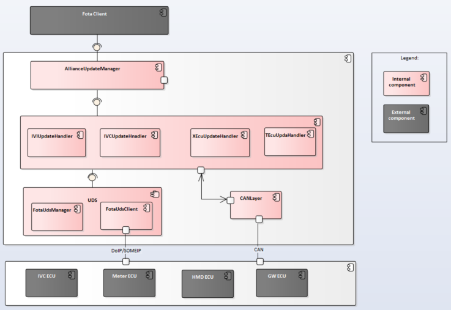
Image reference: doc_image_005.png

Figure 4: Context diagram of Alliance Update Manager sequential design

Detailed description of each component/class and its responsibilities:

Table 1.  Alliance Update Manager sequential design modules

## Table
| Module/Class | Description |
| --- | --- |
| FotaClient | The client of AllianceUpdateManager |
| AllianceUpdateManager | The main class of module which provides APIs for FotaClient can call to request start install new update package |
| BaseUpdateHandler | Common handler for all external ECUs update handler |
| IVIUpdateHandler | Specific update handler for IVI itself |
| IVCUpdateHandler | Update handler for some specific logic of IVC ECU |
| XEcuUpdateHandler | Update handler for some specific logic of Hybrid ECU |
| TEcuUpdateHandler | Update handler for some specific logic of Target ECU |
| FotaUdsManager | Manage UDS clients |
| FotaUdsClient | Provides UDS APIs for Update handler can communicate with other ECUs via Ethernet. |
| CANLayer | Listener CAN massage and forward it to related classes |
| x ECU | Other real ECUs outside IVI (eg: IVC, Meter, HMD, GW…) |

According to the requirement, the update campaign can have one or more ECUs, but the ECU packages are updated sequentially in a certain order. From that requirement I proposed a design that separates each handler that will be responsible for updating one or group of ECUs with the same update type.

The above design can handle the update process through distribution, installation and activation as well as error handling at any stage.

But because there are so many stages, and the new requirement is in the pre-activation stages, the update can be deferred and resumed when the vehicle goes to sleep. This design will get messy and complicated to be able to fulfill those requirements.

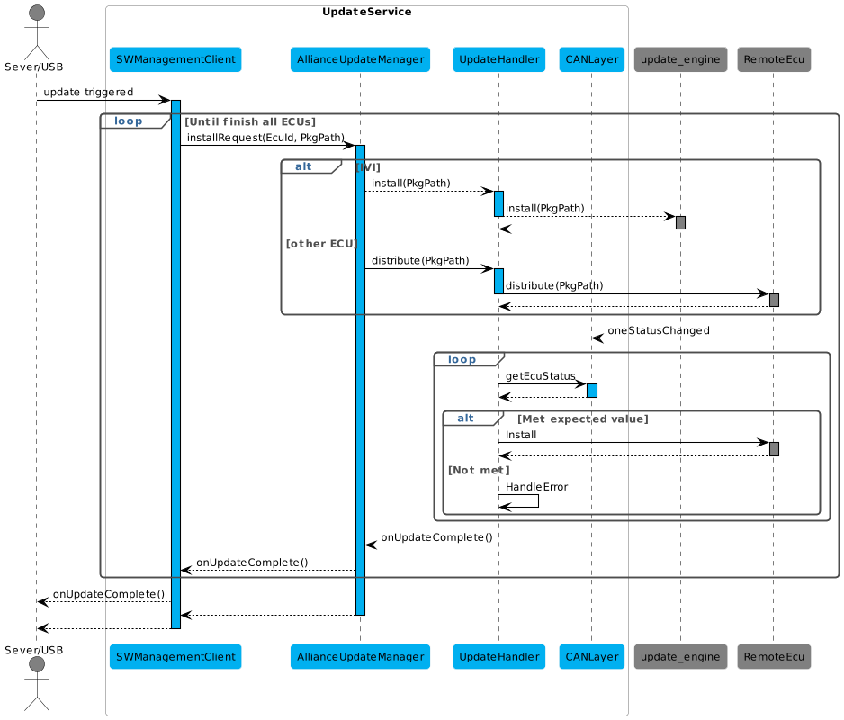
Image reference: doc_image_006.png

Figure 5. Sequence diagram of sequential design

Alliance Update Manager state machine design

Since campaign update goes through many stages, especially for external ECU updates, IVI has to wait for the ECU to move to the next valid state after executing a request from IVI, then IVI will send a new request.

So I proposed a new design like below, which will apply state machine and event-driven pattern.

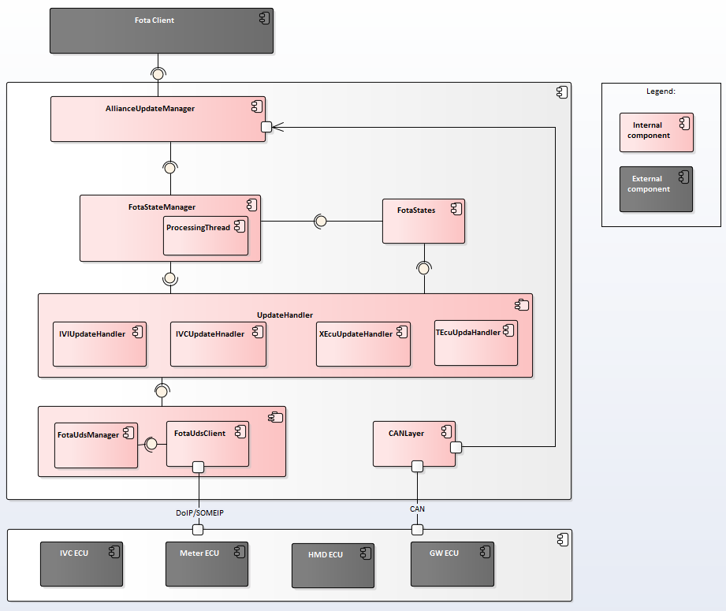
Image reference: doc_image_007.png

Figure 6: Context diagram of Alliance Update Manager state machine design

This design includes the same components/classes as the design in section 2.1 but with additional classes as shown in the table below:

Table 2. Alliance Update Manager state machine design modules

## Table
| Module/Class | Description |
| --- | --- |
| FotaStateManager | The class manage all state using state machine pattern, it includes ProcessingThread. |
| ProcessingThread | Separate thread in FotaStateManager to support handle events in parallel thread which detach from main thread. Allow AllianceUpdateManager can handle new request for FotaClient while current event processing. |
| FotaStates | The base case of FotaState which define common interface for all States. Specific state for each phase of update campaign flow, one small state responsible for one job only. |

Detail states flow chart:

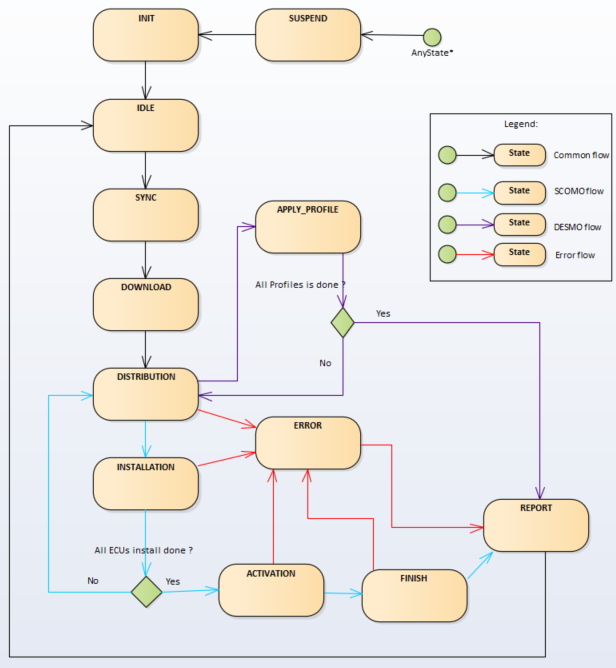
Image reference: doc_image_008.png

Figure 7: FOTA State diagram

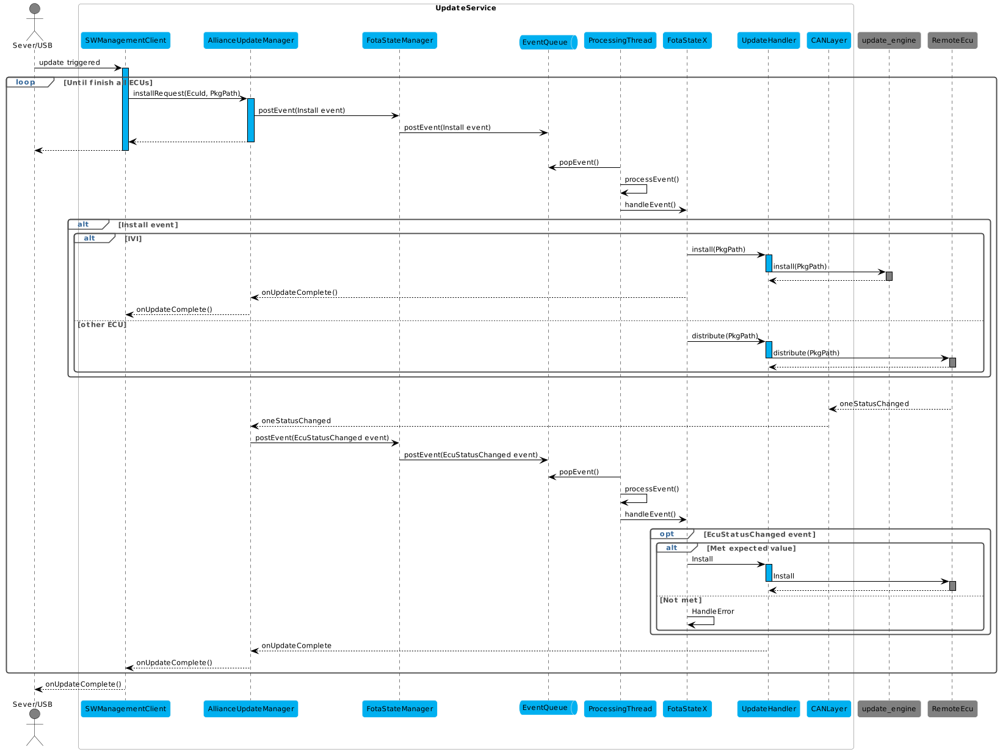
Image reference: doc_image_009.png

Figure 8. Sequence diagram of Alliance Update Manager state machine design

Proposal Comparison Summary

## Table
| Scenario | Sequential design | State machine design |
| --- | --- | --- |
| Normal logic | - Whole update logic implement in each update handler. - Updating thread blocked during update and especially when waiting remote ECU change to proper status (Figure 5, getEcuState loop). | - Update logic separate in each state. - Updating thread not block because it use event base design, it will idle if no event in queue (Figure 8). |
| Suspend -Resume | - Resume to previous pause point require update logic split to small function to allow recall it in resume logic | - Resume can be easy handle by just remember previous state and jump to it state, then we can do next step as normal flow. |
| Maintain code or fix issues | - High impact when change the code due to the code logic not split as state. - Have to re-test whole update flow to ensure the change of code not impact to normal flow. | - Low impact due to one state only responsible for small update flow. - Easy to verify the change, just focus on what state was change. |
| Expanding code | - Hardly to expand compare to state machine design. | - Easy expand due to we just add more state class and link it into FOTA state machine. |

Architecture Diagrams of Alliance Update Manager

Static Design

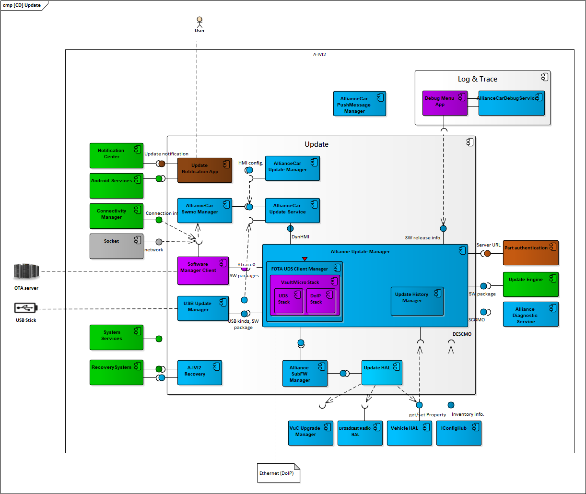
Image reference: doc_image_010.png

Image reference: doc_image_011.png

Figure 9. Software component diagram of Update module

Table 3: SW Component Descriptions

## Table
| Module | Descriptions |
| --- | --- |
| UpdateNotification App | Developed by ACV(3rd party). ACV has a responsibility of this component. Provides user interfaces between user and A-IVI2. Manages the display of update HMI |
| AllianceCarSwmcManager | This component provides access to the AllianceCarUpdateService for support communication with SWMC relate to HMI. |
| AllianceCarUpdateManager | This component provides access to the AllianceCarUpdateService for support HMI |
| AllianceCarUpdateService | Manages the HMI(s) during FOTA phases (download, installation, activation)... Configures HMI depends on attributes in DynHMI.xml - DownloadModalities, HMI conditions, Download/install/activate Consent, Manages the System Information - Sw Version, Hw Number, Hw Serial Number, Hw Part Number, Micom Verison, Dsp Version, Ethernet Version, Gnss Version Manages the HMI depends on HMI Location - Internal HMI : IVI HMI - Local HMI: Other HMI in the vehicle(for exampleDashboard) - Remote HMI: PC, Smartphone |
| AllianceUpdateManager | Provides to the Software Manager Client all the methods needed to interact with the update system and the OS. Provides the means to connect the server and to distribute software package to the ECU for installation. Controls the update HMI Displayed to the user. |
| SoftwareManagementClient | Redbend SWMC(Software Management Client) This component is owned by 3'rd party which is named Redbend(Harman), so Redbend has a responsibility the development of core functionality. Orchestrates the all update sequences. Manages the vehicle software package transfer between off board and onboard and storage of this package. |
| USBUpdateManager | Detects USB stick type among Black/Grey/Red/Blue/Yellow. Notifies to the related handler corresponding to the software package on USB stick. Checks the concordance between supplier package (grey key) and the current installed build before to provide the USB package to IVI update handler component. |
| Alliance SubFW Manager | Located in /vendor partition Manage the all subFW update |
| Update HAL | dspUpdateHal Communication with VHAL during DSP FW Update Register and UnRegister Callback to VHAL for getting answer from VHAL SendMessage UPDATE_DSP_START from Update HAL to VHAL after prepare for update SendMessage UPDATE_DSP_FINISH from Update HAL to VHAL after finish for update VHAL get a message from Update HAL, then VHAL send to Vuc(Micom) to change DSP download mode(UPDATE_DSP_START) or back to DSP normal mode(UPDATE_DSP_FINISH) Every Sending Messages (UPDATE_DSP_START and UPDATE_DSP_FINISH) has their own callback. dspRadioUpdateHal Communication with RADIO during DSP FW Update Register and UnRegister Callback to RADIO for getting answer from RADIO stopRadio from Update HAL to RADIO to stop using SPI during update (using SPI only for update) startRadio from Update HAL to RADIO to start using SPI after update (back to normal) RADIO get a call API from Update HAL, then RADIO answer the status about SPI stop or start to Update HAL dspRadioVersionHal Communication with RADIO to get DSP Version Register and UnRegister Callback to RADIO for getting answer from RADIO getRadioVersion from Update HAL to RADIO to get DSP version RADIO get a call API from Update HAL, then RADIO answer the status about SPI get to Update HAL |
| FOTA UDS Client Manager | Helps a communication between IVI and other ECUs. Discovers connected ECUs for auto-detection Delivers an update package to other ECU Delivers a signal from other ECU to IVI |
| A-IVI2 Recovery | In Recovery, Flash SoC Image(Android) for Next Version |
| VUCUpgradeManager | From USBUpdateManager, new version binary will be delivered by specific protocol. VuC are ready for storing new version binary at the opposite empty bank not related on current operating code. VuC operates erasing the bank and writing the new version at the empty bank. During the erasing and writing operation, VuC handles the whole operation, e.g. CAN transmission, power management, and DSP control, as usual. Control start update VuC |
| Update History Manager | Manage the history of update logs. Save the log. It is managed to be recorded as many as the set number of logs. Returns if a log is requested. Send log data to the diagnostic service. |
| Update Security Manager | Provides functions for security verification of update packages. CMS file verification SIG file verification Digest/Hash verification |

Class diagram:

Image reference: doc_image_012.png

Figure 10. Class diagram

Dynamic Design

3.2.1 State design

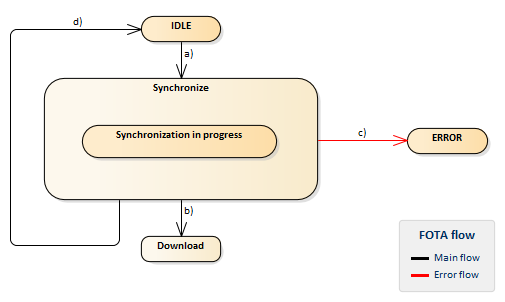
Image reference: doc_image_013.png

Synchronize status is handled by SWMC.

* Condition:

[Receives Connection setup request from IVC] or [User consent for manual check] or [Periodic check for update timer expired]

Receive {Download Dynamic HMI/pre-download data} from FOTA-SERVER.

When Server notified urgent ServerPushMessage.

No further request from server.

Distribution status

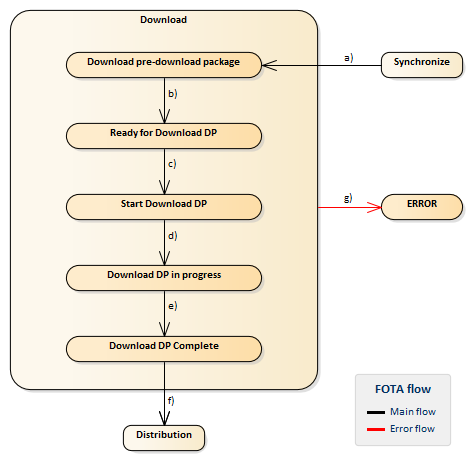
Image reference: doc_image_014.png

Download status is managed by SWMC.

* Condition:

 Customer consent from HMI-Proxy.

[Download pre-download package is complete] and [Verify OK].

Network is connected.

Accessed to URL.

Receive {Download DP Complete} from FOTA-SERVER.

DP verification OK.

When Server notified urgent ServerPushMessage.

Distribution status

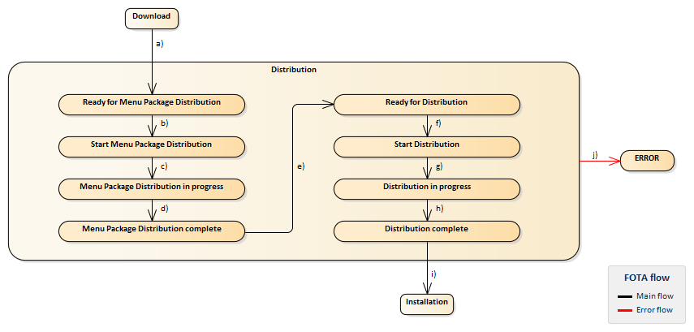
Image reference: doc_image_015.png

Distribution status is managed by AllianceUpdateManager.

* Condition:

DP verification OK.

Customer Consent from HMI-Proxy.

Receives "menu package distribution start request response" from FOTA-GW.

Receives {FOTA-GW FOTA state} = "Menu Package Integrity check complete" from FOTA-GW.

Received "menu package distribution result request response" from FOTA-GW.

Customer Consent from HMI-Proxy.

Receive {Distribution Start request response} from Distribution rout of "On going" Target ECU in {Distribution/Installation Table}.

[Receives {FOTA-GW FOTA state} = "FOTA-GW Package Distribution complete" from FOTA-GW] or [Receive {IVC FOTA state} = "Distribution complete}"] or [Receives {METER FOTA State} = "Slave Distribution Complete}"].

Receive {Distribution result request response} from Distribution rout of "Om going" Target ECU in {Distribution/Installation Table}.

When Server notified urgent ServerPushMessage.

Installation status

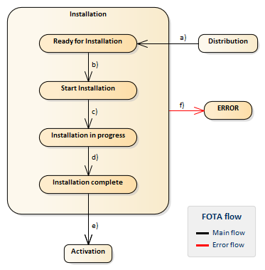
Image reference: doc_image_016.png

Installation status is managed by AllianceUpdateManager.

* Condition:

Receive {Distribution result request response} from Distribution rout of "On going" Target ECU in {Distribution/Installation Table}.

Customer Consent from HMI-Proxy.

Receives {Installation Request Response} from Distribution route of "On going" Target ECU in {Distribution/Installation Table}.

[Receives {FOTA-GW FOTA state} = "Ready for Activation"] or [Receives {IVC FOTA state} = "Installation Complete"] or [Receive {METER FOTA state} = "Slave Installation Complete"].

[All Distribution/Installation Status are "Done" in {Distribution/Installation table}] and [send {report Install Complete} to FOTA-SERVER].

When Server notified urgent ServerPushMessage.

Activation status

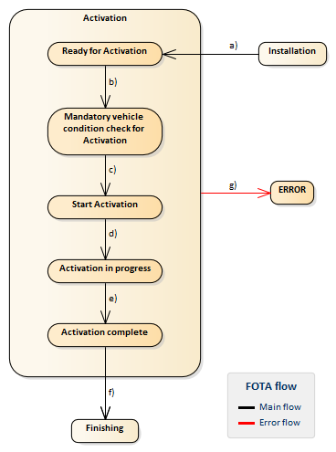
Image reference: doc_image_017.png

Activation status is managed by AllianceUpdateManager.

* Condition:

 All Distribution/Installation Status are "Done" in {Distribution/Installation table}] and [send {report Install Complete} to FOTA-SERVER].

[receive Customer Consent from HMI-Proxy] or [receive {Activation Request Now} from FOTA-SERVER] or [{FOTA_TimerExpired}="Timer Expired"] and [{FOTA_ProgValueStatus}=0] and {Internal Activation Timer Value} = 0}].

[{Vehicle condition check elapsed time} <= {Vehicle condition check timeout} in Menu package] and [{Vehicle state} <=”AutoACC”] and [{Vehicle speed} = “0”] and [{UserSOC} >= {Activation threshold}] and [{WarningLightsStatus} = "Warning Lights OFF"] and [{FOTA-CLIENT FOTA state} is “Mandatory vehicle Condition check for Activation”] and [FOTA-CLIENT has been validated consistency between {Activation set time} and {Current time in FOTA-CLIENT} once. if {Activation set time} is Not blank] and [FOTA-CLIENT completes to start stopwatch of {Activation elapsed time}].

[Receives "Activation request response" from FOAT-GW] or [Receive {Immediate Activation Request Response} from FOTA-McECU in IVI or FOTA-McECU in IVC or FOTA-xTECU in Meter] and [Receive {Activation notification Request Response} from FOTA-GW].

[Receives FOTA Status = "Activation complete" from FOTA-McECU in IVC Or FOTA-xTECU in METER Or FOTA-GW] or [Receive notification of "Activation complete" from FOTA-McECU in IVI].

Receives "Activation result request response" from FOTA-McECU in IVC or FOTA-xTECU in METER or FOTA-GW or IVI Installer
& Activation state of all target ECUs are "Done" in {Activation Table}.

Activation timeout is expired
or Detects CAN reception error
or Detects CAN transmission error
or FOTA buffer diagnostic error
or {Retry Counter} >=3
or Receive {Cancel request from FOTA-SERVER (Only when FOTA-CLIENT state before "Activation in progress")}
or Receives {FOTA-GW FOTA state} = Cancel in progress
or Receives {FOTA-McECU in IVC FOTA state} = Cancel in progress
or FOTA-McECU in IVI is in Cancel in progress
or FOTA-McECU in IVC FOTA state = "Error Detected"
or Detects inconsistency between {FOTA-CLIENT FOTA state} and {FOTA-GW FOTA state}
or Detects inconsistency between {FOTA-CLIENT FOTA state} and {FOTA-McECU in IVC FOTA state}
or Detects inconsistency between {FOTA-CLEINT FOTA state} and {FOTA-xTECU in METER/HUD FOTA state}.

Finishing status

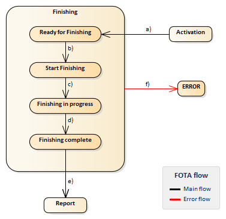
Image reference: doc_image_018.png

Finishing status is managed by AllianceUpdateManager.

* Condition:

Activation state of all Target ECU are "Done" in {Activation Table}.

Customer Consent from HMI-Proxy.

Receives {Back to Idle request response} from all Activation routes in {Activation table}.

[Receive {FOTA-GW FOTA state} = "idle"] and [Receive {FOTA-McECU in IVC FOTA State} = "Idle"].

Receives {Back to Idle result request response} from all Activation routes in {Activation table}.

When error occurred.

Report status

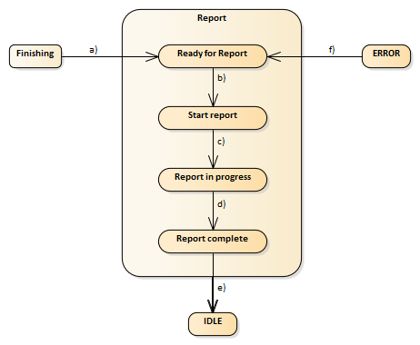
Image reference: doc_image_019.png

Report status is managed by AllianceUpdateManager.

* Condition:

Receives {Back to idle result request response} from all Activation routes in {Activation table}.

Customer consent from HMI-Proxy.

Receives {connection established} form FOTA-SERVER.

Send {complete Notification} to FOTA-SEREVER.

Receive {Acknowledgement} from FOTA-SERVER.

When error handling is done.

3.2.2 Event flow

Since this design is event-driven, the update steps and state transitions are event-based, the following figure shows three event flows in the update module.

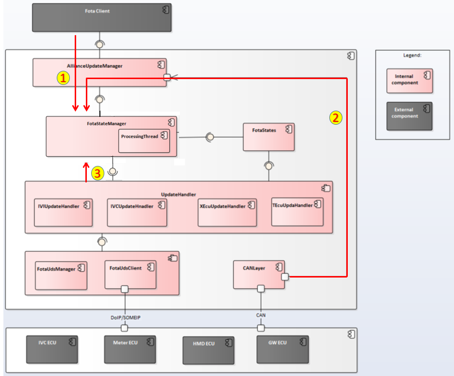
Image reference: doc_image_020.png

Figure 11. Event flow diagram

Client request events.

CAN events (ECU status changes, ECU install progress, …)

Internal events from UpdateHandler.

3.2.3 Sequence diagrams

Below are two important sequences in the update flow, it can be seen that the tasks are specifically broken down into functions in the UpdateHandler, and they are called in one or some fixed states, respectively.

Distribution sequence:

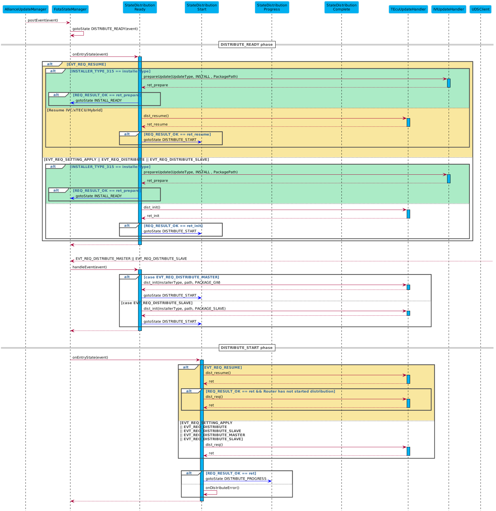
Image reference: doc_image_021.png

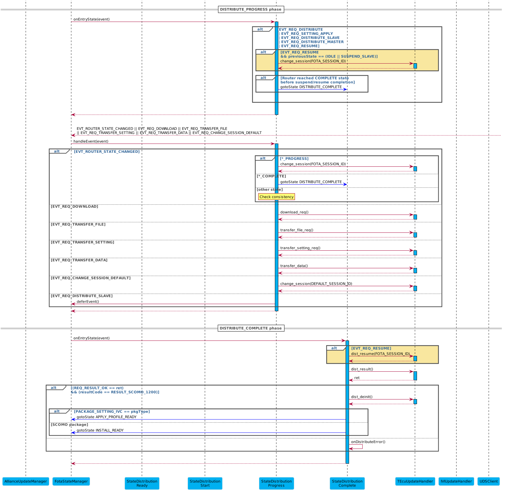
Image reference: doc_image_022.png

Figure 12. Distribution sequence diagram

Installation sequence:

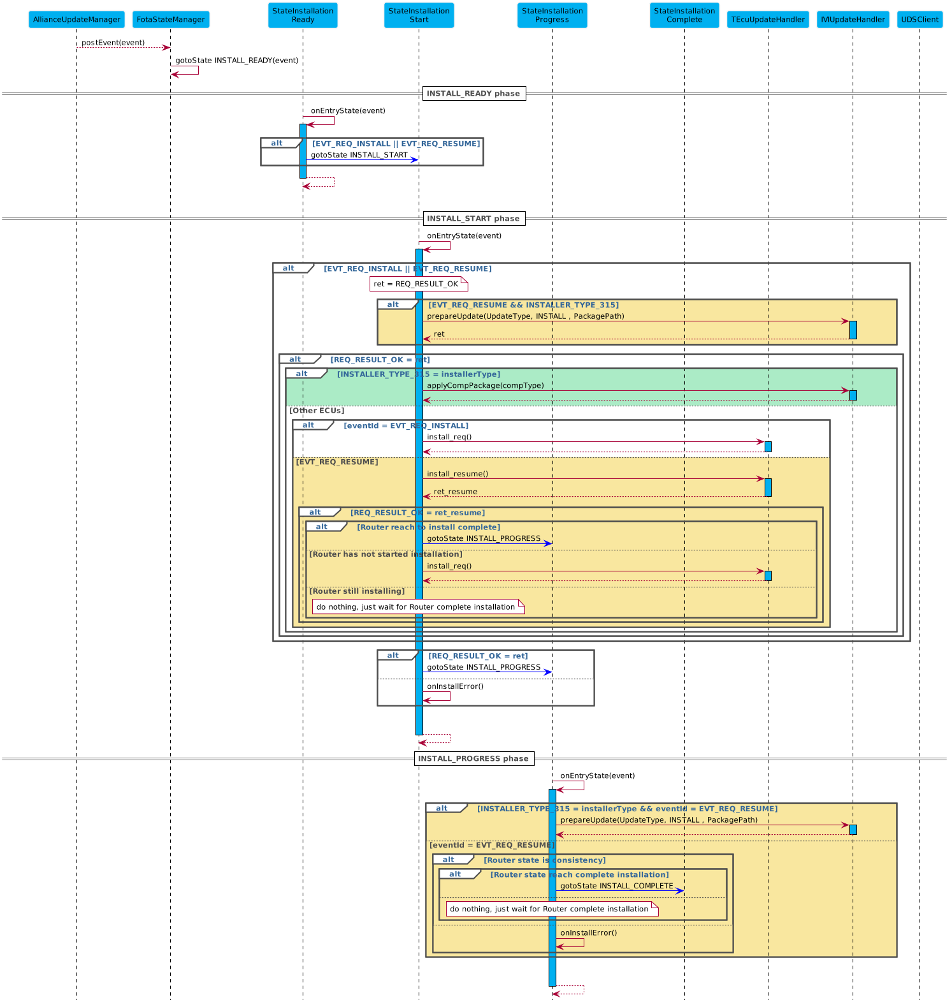
Image reference: doc_image_023.png

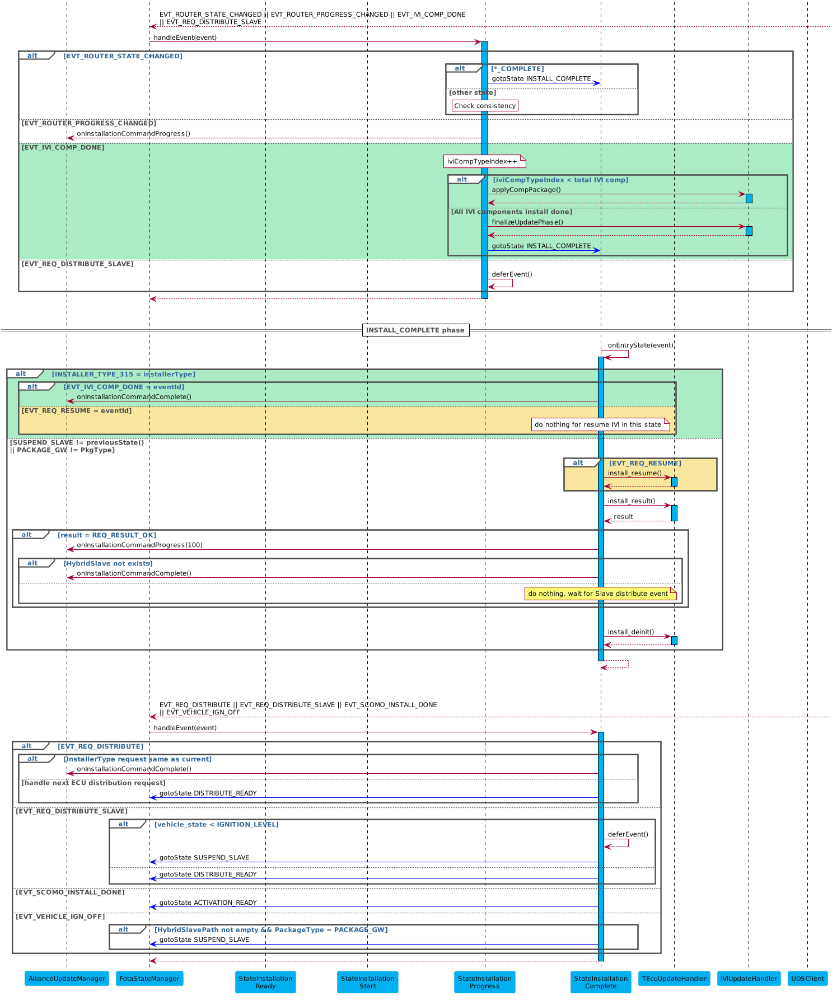
Image reference: doc_image_024.png

Figure 13. Installation sequence diagram

Algorithm Design

Events are very important in this design so they must be handled correctly, and invalid events should also be discarded.

There are three event queues in the design:

Normal queue: normal events, processed in order

Deferred event queue: events are deferred, they will be processed in the next state or at another specific time.

High priority event queue: events have high priority, they must be handled as soon as possible, if there are many events in this list they are processed in order.

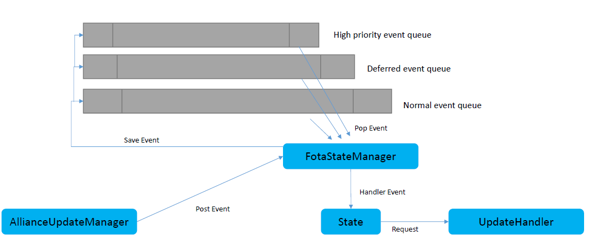
Image reference: doc_image_025.png

Figure 14. Event processing algorithm

Appendix

Spec of distribute communication sequence:

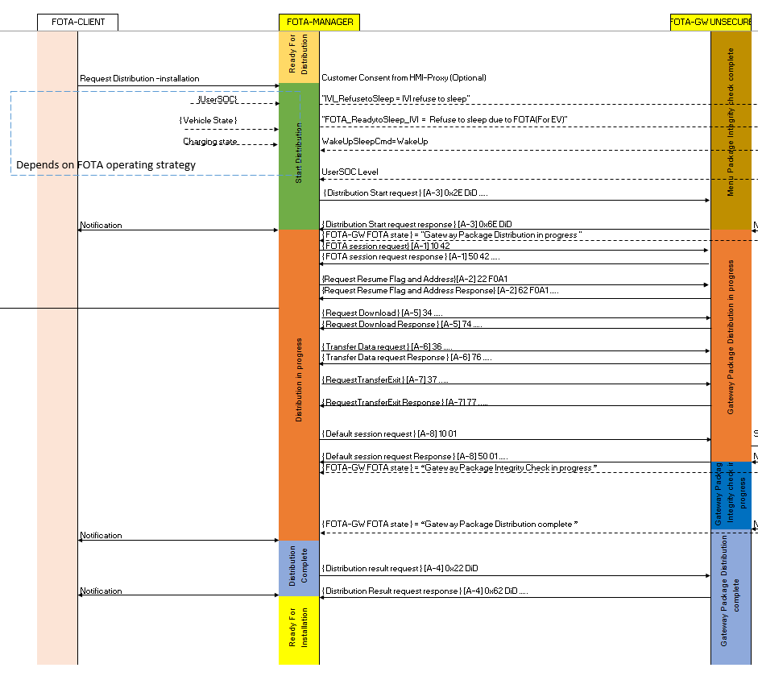
Image reference: doc_image_026.png

Spec of install communication sequence:

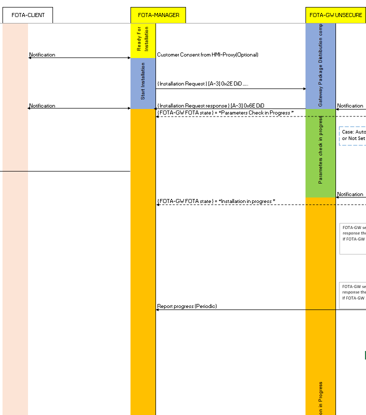
Image reference: doc_image_027.png

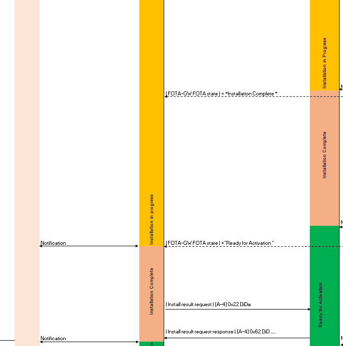
Image reference: doc_image_028.png
