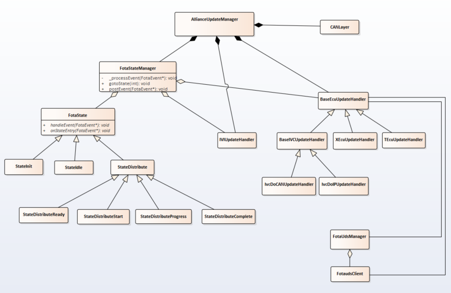

# Raw Slide Content

- Source file: FA_Nguyen_Van_Thinh_Alliance_Update_Manager_Architecture_v1.0_final[1].pptx
- Total slides: 12

## Slide 1

Image reference: slide_01_image_01.png

FA Certification Task
Alliance Update Manager Architecture

By Thinh Nguyen Van
Supervise by 신종혁
CFFT2
LG Vehicle Solution Development Center Vietnam
October 8th 2022

## Slide 2

TABLE CONTENT

1

Comparison & Architecture Decision

3

Detailed Architecture Design

4

Requirements Analysis

5

6

Architecture Design Proposals

2

Q&A

5

## Slide 3

1. Requirements Analysis

3

Spec Requirement

Sync

Download

Distribution

Installation

Activation

Finishing

Report

IVI itself

IVC

HMI

Meter

HMD

CGW

Check for update

Download accept

Install accept

Active accept

Install progress

Download progress

Update result

Update service

ECU

DoIP + CAN

## Slide 4

1. Requirements Analysis

4

### Table
| Requirement ID | Requirement description |
| SAR-AAFW-FOTA-0002 | The Alliance Update manager component shall dispatch the update packages to the relevant Update handler. |
| SAR-AAFW-FOTA-0005 | The Alliance Update manager component shall manage the vehicle software cancel in case of installation issue |
| SAR-AAFW-FOTA-AUM-0002 | On a SCOMO install request from DIL, AUM shall support the followings phases: Menu Package Distribution, Package distribution, and installation. |
| SAR-AAFW-FOTA-AUM-0039 | AUM shall enter in suspend state on deep sleep entry event when AUM is in idle, pre-download, download, activation, cancel and rollback phases. |

Functional Requirement

### Table
| # | Quality Attributes | Requirement description |
| 1 | Operability | The Alliance update manager handles a vehicle update context that will hold all metadata and status on an ongoing update campaign. Its purpose is to be able to resume a campaign from any suspend or stopping point. It also allows to keep all parameters of a campaign so that alliance update manager adjust its decision to the campaign. |
| 2 | Maintainability | AUM will organize an update campaign in different phases to fulfill an update campaign. Each of those phases will be decomposed in states. |
| 3 | Interoperability | All ECU update handler shall support a common API. |

## Slide 5

1. Requirements Analysis

5

Software context

Image reference: slide_05_image_01.png

Image reference: slide_05_image_02.png

## Slide 6

2. Architecture Design Proposals

Proposal 1: Alliance Update Manager sequential design

6

Pros:
Easy to implement.
Less component.
Cons:
Hard to expand.
Have to re-test whole update flow to ensure the change of code not impact to normal flow.

Image reference: slide_06_image_01.wmf

## Slide 7

2. Architecture Design Proposals

Proposal 2: Alliance Update Manager state machine design

7

Pros:
Easy to expand state.
Easy to maintain due to separated logic.
Cons:
More components.
Potential block State machine if all cases not handle well.
Potential loss events or duplicate event post lead to undefined behavior.

Image reference: slide_07_image_01.png

## Slide 8

2. Architecture Design Proposals

Proposal 2: Alliance Update Manager state machine design

8

States flow chart:

Image reference: slide_08_image_01.wmf

## Slide 9

3. Comparison & & Architecture Decision

Architecture Proposal Comparison

9

### Table
| Scenario | Sequential design | State machine design |
| Normal logic | - Whole update logic implement in each update handler. - Updating thread blocked during update and especially when waiting remote ECU change to proper status. | - Update logic separate in each state. - Updating thread not block because it use event base design, it will idle if no event in queue. |
| Suspend -Resume | - Resume to previous pause point require update logic split to small function to allow recall it in resume logic | - Resume can be easy handle by just remember previous state and jump to it state, then we can do next step as normal flow. |
| Maintain code or fix issues | - High impact when change the code due to the code logic not split as state. - Have to re-test whole update flow to ensure the change of code not impact to normal flow. | - Low impact due to one state only responsible for small update flow. - Easy to verify the change, just focus on what state was change. |
| Expanding code | - Hardly to expand compare to state machine design. | - Easy expand due to we just add more state class and link it into FOTA state machine. |

## Slide 10

Image reference: slide_10_image_01.png

4. Detailed Architecture Design

Class Diagram of Update Manager state machine design

10

Installation/Activation/Finishing/Report apply same structure as Distribution

## Slide 11

Image reference: slide_11_image_01.png

4. Detailed Architecture Design

Sequence Diagram of Update Manager state machine design

11

## Slide 12

5. Q&A

Q&A

Thank you for listening!

12

