# Raw Document Content

- Source file: FA_Pham_Phu_Quynh-Certification-Task[1].docx

FA CERTIFICATION TASK

NAVIGATION ADAPTATION LAYER IMPROVEMENT

## Table
| Issuing authority | LGE-VS-VW-ICAS3 |
| --- | --- |
| Status of document | In Progress |

About this document
Document information

Revision History

## Table
| Version | Date | Comment | Author | Approval |
| --- | --- | --- | --- | --- |
| 0.1 | 25-July-2021 | First draft | Quynh.pham |  |
| 0.2 | 04-Aug | Add component diagram Add sequence diagram | Quynh.pham |  |
| 0.3 | 12-Aug | Add class diagram and description | Quynh.pham |  |
| 0.4 | 20-Aug | Update the overall description, add design concern and improvement | Quynh.pham |  |
| 0.5 | 03-Sep | Revise/add sequence diagrams Add source code structure | Quynh.pham |  |
| 0.6 | 12-Sep | Add alternative solutions Update according to mentor feedback | Quynh.pham |  |
| 0.7 | 25-Sep | Add demonstration | Quynh.pham |  |

Purpose

This document specifies the software architecture design for the improvement of Navigation Adaptation Layer (Navi-AL) of ICAS3 system.

Background

The Navi-AL has been designed and implemented, for the purpose is the middle communication between navi-engine service and other services.

There are several points that can be improved for Navi-AL:

The components inside Navi-AL have tight coupling. Re-struct to achieve the loose coupling. That helps developers easily understand the connections and maintain.

Improve the task scheduler design in Navi-AL to help easily maintain and scale

Some classes are too big, divide them into smaller classes with detailed responsibility to help easily maintain.

Scope

This document describes the following about Navi-AL

Basic software requirements

Improvement solutions

SW Architectural representation

Static design with class diagrams

Dynamic design with sequence diagrams

Audience

The readers of this article are as follows:

Requirement engineer who will point out any contradiction between the design and the requirement

Software architect who will evaluate the design of the software

Component developer who will implement the design in actual code

Table of contents

Figures

Figure 1. Navi-al communications.	5

Figure 2. The components inside Navi-AL (original design)	6

Figure 3. The main components are categorized by interface	6

Figure 4. Apply observer pattern	7

Figure 5. Apply message concept	7

Figure 6. Threads in KIPC manager (original design)	9

Figure 7. Threads in KIPC manager (apply message queue concept)	9

Figure 8. Context diagram	10

Figure 9. Components and relationship	13

Figure 10. Component interface inside Navi-AL	15

Figure 11. Class diagram of Navi-AL	16

Figure 12. KipcManager class and related classes	17

Figure 13. The souce code structure	23

Figure 14. Startup sequence diagram	25

Figure 15. Sending message between managers sequence diagram	26

Figure 16. KipcManager processes incomming KIPC data sequence diagram	27

Figure 17. KipcManager processes message from other managers sequence diagram	27

Figure 18. CommonApiManager processes data from navi-engine sequence diagram	28

Figure 19. CommonApiManager processes message from other managers	28

Figure 20. ShmManager reads command and gets corresponding data from navi-engine sequence diagram	29

Figure 21. RsiManager gets RSI data and forwards to other managers	29

Figure 22. The source code structure	30

Figure 23. The main function and incomming KIPC data simulation	30

Figure 24. The message sent from Kipc Manager to CommonApi Manager	31

Figure 25. The demostration output	31

Tables

Table 1. Comparison between two solutions	9

Table 2 Navi-AL main component descriptions	12

Table 3. Relationship between components and services	12

Table 4. Quality attributes	14

Table 5. Component description in more detailed.	15

Table 6. Source code directory description	25

Overview

Overall Descriptions.

The goal of Navi-AL is to provide an adaptation communication between navi-engine service and other services which use different protocols.

Navi-AL should provide the adaptation between KIPC interface and CommonAPI interface

Navi-AL should provide the adaptation between Share memory interface and CommonAPI interface

Navi-AL should provide the adaptation between RSI interface and CommonAPI interface

Navi-Al should have the capability to process multiple incoming data at the same time to achieve the good performance

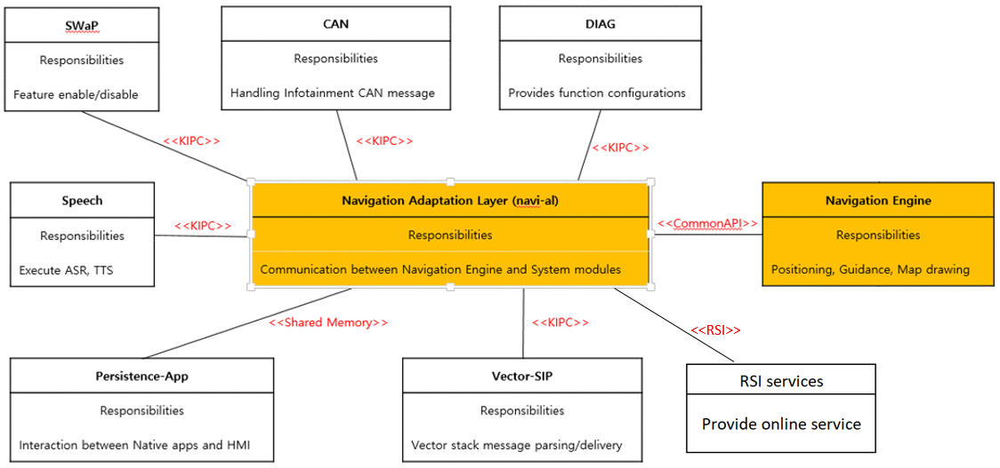
Image reference: doc_image_001.png

Figure 1. Navi-al communications.

Problem description.

As the original design, the main problems as below:

The components inside Navi-AL have tight coupling, they call each other directly.
For example: KipcProvider calls Stubloader function, then Stubloader calls ShmProvider function.
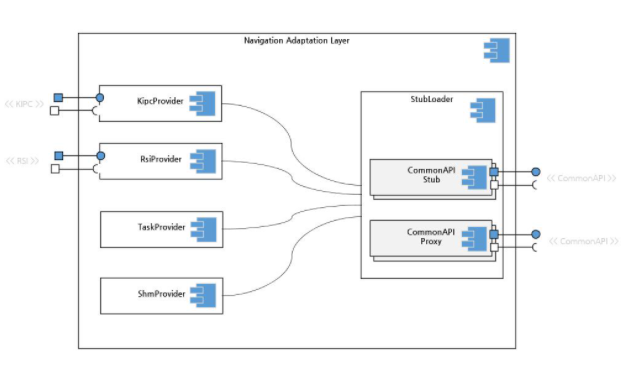
Image reference: doc_image_002.png

Figure 2. The components inside Navi-AL (original design)

Improvement solutions

The main components will be categorized by interface:

KipcManager: manages the communication with KIPC

RsiManager: manages the communication with Rsi

ShmProvider: manages the communication with Shared memory

CommonApiManager: manages the communication with CommonApi

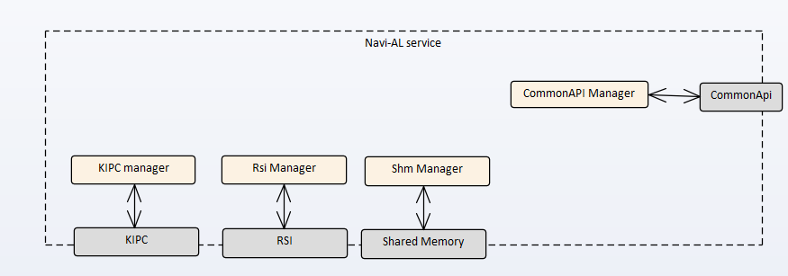
Image reference: doc_image_003.png

Figure 3. The main components are categorized by interface

The components call each other by a notification, not use other’s function directly

To define the mechanism how the main components (managers) communicate to each other. There are two alternative solutions:

2.3.1. Observer pattern

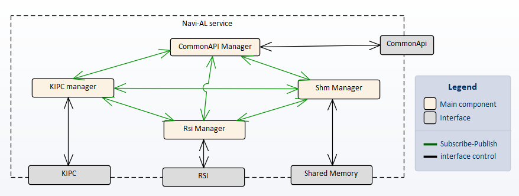
Image reference: doc_image_004.png

Figure 4. Apply observer pattern

The component connects to each other by subscribe-publish mechanism. When a manager sends data or request to another, it will publish the event. The subscribers receive this event and do the corresponding actions.

2.3.2. Message queue concept

Image reference: doc_image_005.png

Figure 5. Apply message concept

Each component has its own message queue. When a manager sends data or request to another, it will send a message to the message queue of the target manager. The target manager reads the message and do the corresponding actions.

2.3.3. Compare two solutions

## Table
| No | Observer pattern | Message Queue concept |
| --- | --- | --- |
| 1 | The subscriber (manager) processes notification at the same thread as publisher | The message receiver (manager) has its own thread to process the message. It is separated from the sender. |
| 2 | Simply to implement | Have to implement the message send/receive mechanism |
| 3 | Don’t need more thread | Need more threads for the message send/receive mechanism |
| 4 | Event-based mechanism | Message-based mechanism |

Table 1. Comparison between two solutions

As the above table, the green comment is better. The managers should have their own thread for their actions. It is easily to manage and reduce potential issues, especially thread-safe issue.

The message-based mechanism is more suitable. When a manager sends data or requests action to others, it should choose exactly the target the manager to send to.

About item #3 in the above table, if apply message queue concept, the number of threads for receiving Kipc data can be reduced to trade-off the total number of threads.

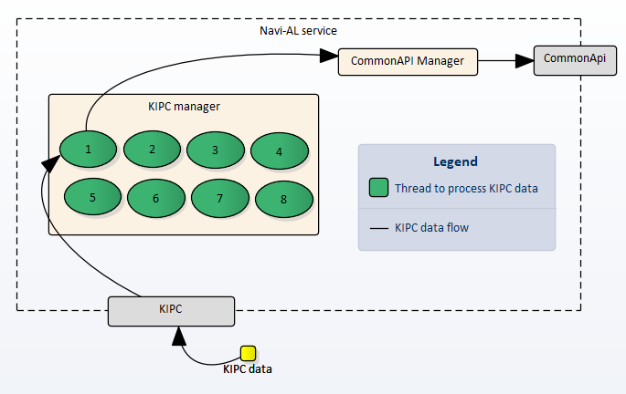
Image reference: doc_image_006.png

Figure 6. Threads in KIPC manager (original design)

As Figure 6, there are many threads in KIPC manager to process KIPC data. Each thread corresponds to each type of KIPC data.

When there is a new KIPC data, it will be processed in the corresponding thread.

For example: Thread 1 to process KIPC data from DIAG service, Thread 2 to process KIPC data from CAN service

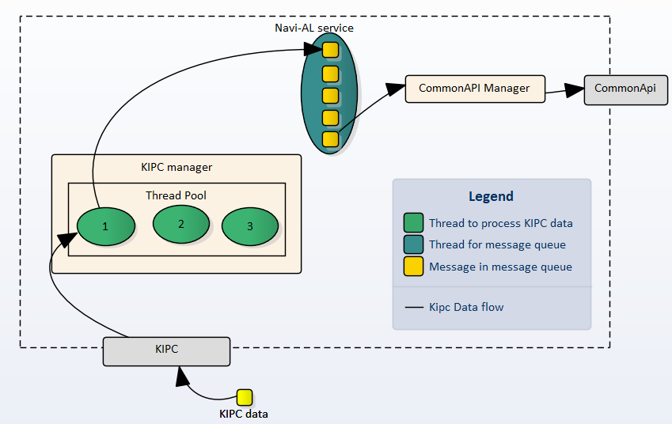
Image reference: doc_image_007.png

Figure 7. Threads in KIPC manager (apply message queue concept)

After applying the message queue concept, as the Figure 7, the KIPC manager does need to have many threads for KIPC data but only has a thread pool with a limitation of thread number (three threads).

When there is a new KIPC data, it will be processed in the thread that is free, no matter what kind of KIPC data.

In conclusion, the message queue concept is chosen for this improvement.

Design requirement and quality attribute

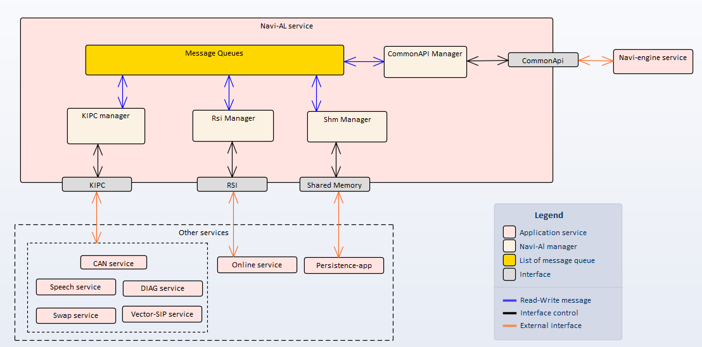
Image reference: doc_image_008.png

Figure 8. Context diagram

	The Navi-AL components in the above context diagram are described as below:

## Table
| Component | Description |
| --- | --- |
| KIPC manager | Manage the KIPC functionalities such as receiving/sending KIPC data from/to external services, forward KIPC data to other components like CommonAPI manager via message and vice-versa |
| RSI manager | Manage the RSI functionalities such as get/post RSI data on Online service. It can request to get data from other components via message. |
| Shm manager | Manage the Shared memory functionalities such as get data from nanvi-engine (via CommonApi manager) and store to shared memory for persistence-app service and vice-versa. |
| CommonApi manager | Manage the CommonApi functionalities. It connects directly to navi-engine service via CommonApi, receive data from navi-engine and forward to other components like Kipc manager via message and vice-versa |
| Message queues | Contain message queue of each manager. A message queue contains message for its manager. The message can be data or request from other manager. |

Table 2. Navi-AL main component descriptions

The relationship between Navi-AL components as described as below

## Table
| Relationship | Description |
| --- | --- |
| Other services <-> Navi-AL service | Navi-Al service receives/transmits the data from/to other services via interfaces: KIPC, RSI, Shared Memory |
| Navi-AL <-> Navi-engine service | Navi-AL forward data received from other services to Navi-engine service via CommonAPI and vice-versa |
| KIPC Manager <-> Other managers Rsi Manager <-> Other managers Shm Manager <-> Other Managers CommonAPI Manager <-> Other Managers | All managers communicate together via message queues. Each manager has its own message queue. |

Table 3. Relationship between components and services

Functional Requirements

KIPC manager:

Receives KIPC data from external services

Has a thread pool to process incoming KIPC data

Forwards KIPC data to CommonApi manager

Converts data from CommonApi manager to KIPC data and forwards to external services

Requests action from other managers

Rsi manager:

Receives RSI data from external services

Forwards RSI data to CommonApi manager

Requests action from other managers

Shm manager:

Read command from shared memory and forward to CommonApi manager

Gets data from CommonApi manager and writes to shared memory

Requests action from other managers

CommonApi manager:

Converts KIPC data from KIPC manager to CommonApi data and sends to navi-engine service

Gets data from navi-engine service and forwards to KIPC manager

Converts RSI data from RSI manager to CommonApi data and sends to navi-engine service

Converts Shared memory data from Shm manager and sends to navi-engine service

Gets data from navi-engine service and forwards to Shm manager

Requests action from other managers.

Message Service

Creates a message queue for a manager

Sends message to manager by write message to manager’s message queue

Receives message for manager by read message from manager’s message queue

Quality attributes

## Table
| Scenario # | QA Scenario | Quality Attribute | Priority |
| --- | --- | --- | --- |
| 1 | The message sent between components must have a delay less than 100 ms | Performance | High |
| 2 | The implement of system can be used for other projects | Reusability | Mid |
| 3 | The new interface can be added to the system without influence other components | Maintainability | Mid |
| 4 | The tasks inside each manager can be added without influence other tasks | Maintainability | High |
| 5 | The manager can load the tasks dynamically at run-time. The maximum tasks are 86 tasks | Scalability | High |

Table 4. Quality attributes

Static Design

Architectural Representations

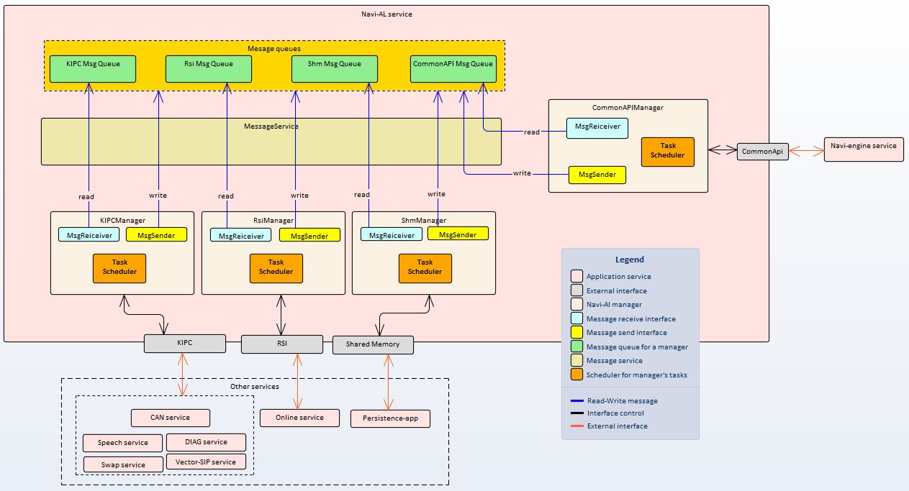
Image reference: doc_image_009.png

Figure 9. Components and relationship

 Navi-AL detailed Components Descriptions

## Table
| Component | Description |
| --- | --- |
| Task Scheduler | The scheduler for each manager. It contains tasks of the manager. These tasks run periodically in a thread. The periodic are: every 1 sec, 5 sec, 10 sec, 60 sec. |
| MsgSender | The interface for each manager to send message to other managers. |
| MsgReceiver | The interface for each manager to listen the message from other managers sent to it. It has its own thread to listen the message, and trigger callback from manager. |
| MessageService | The message service used by MsgSender/MsgReceiver/Manager to interact with message queue like creating message queue, read/write message from/to message queue. |
| Message queues | List of message queues. Each message queue is used for each manager uniquely. The manager send data or request action to other managers by putting corresponding message to message queue of the target manager |
| KIPCManager, RSIManager, ShmManager, CommonApiManager | As the description in Table 2 |

Table 5. Component description in more detailed.

Component diagram of Navi-AL

Descriptions

The manager requests to create their own message queue by calling interface register message queue from MessageService

After creating the message queue, the manager can write/read message to the message queue by using the interface read message, write message from Message service.

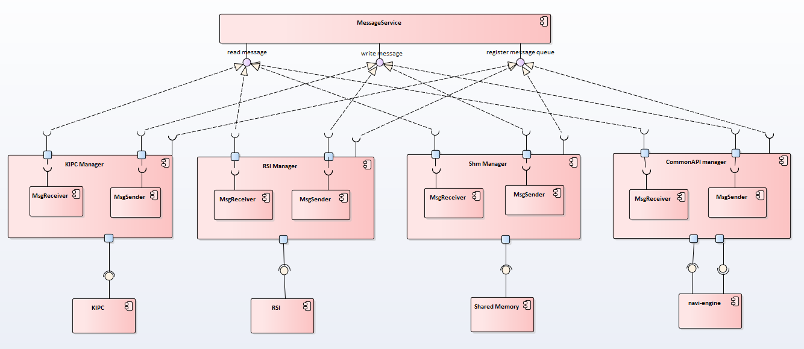
Image reference: doc_image_010.png

Figure 10. Component interface inside Navi-AL

Class diagram of Navi-AL

Design concern and improvement:

As the original design, the main classes are too big. A main class contains all their tasks and logics to process the message from others.

After designing, the code is divided into smaller dedicated classes.

For the tasks inside manager class: each task is separated into a class, which inherits the class BaseTask. The manager class manages its task via the abstract object BaseTask.

For the logic to process the message from others: each message is separated into a class, which inherits the class BaseMessage. The logic to process message is included inside the message class. When the receiver receive a message, it will call this logic to process the message.

With above design, user can develop their own task as well as define more message class without changing too much the manager class.

Image reference: doc_image_011.png

Figure 11. Class diagram of Navi-AL

Figure 11 shows the classes of Navi-AL, because this document focuses on improvement point, it only shows the main methods of class that related to improvements.
Because of the limitation of picture, the below figure shows more detailed about KipcManager class
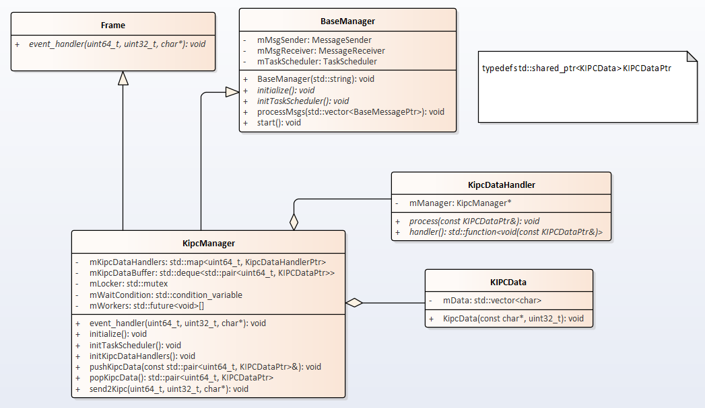
Image reference: doc_image_012.png

Figure 12. KipcManager class and related classes

## Table
| Class | Description |
| --- | --- |
| NavigationAdaptationLayer | The main class of navi-al service. It is initialized in the main function and starts all the logic of navi-al service. |
| BaseManager | The abstract class for the manager. |
| TaskScheduler | The class for manager’s scheduler. It contains task object which is defined for the manager. |
| BaseTask | The abstract class for manager’s task. It associates with the manager object and execute the task for the manager object by using the manager object’s methods/attributes. |
| BaseMessage | The abstract class for message which is sent between managers. It associates with the destination manager and includes the logic to process message by using the destination manager methods/attributes |
| MessageQueue | The class for message queue of each manager |
| MessageService | The class for message service. It is singleton pattern. It is used for creating message queue, writing/reading message from the message queue. |
| MessageSender | The class for message sender. Each manager has a message sender. |
| MessageReceiver | The class for message receiver. Each manager has a receiver |
| KipcManager | The class for KIPC manager. It’s used for managing interaction between KIPC and other protocols |
| RsiManager | The class for RSI manager. It’s used for managing interaction between RSI and other protocols |
| ShmManager | The class for Shared memory manager. It’s used for managing interaction between Shared memory and other protocols |
| CommonApiManager | The class for CommonApi manager. It’s used for managing interaction between CommonApi and other protocols |
| KipcDataHandler | The abstract class for handling the KIPC data. It is dedicated for Kipc manager. Each type of KIPC data has its own handler which inherits this class. |
| Frame | This class already is defined by LGE. In this context, it is used to interact with KIPC driver. When there is a new incoming KIPC data from the driver, the event_handler will be called. The KipcManager will inherit this class to get KIPC data. |
| KipcData | Class for wrapper of Kipc data |

Class BaseManager

## Table
| Method Name | Description | Input | Output |
| --- | --- | --- | --- |
| BaseManager | Constructor. Create message queue for it. | std::string msgQueueId: the id of message queue which is created for this object | None |
| initialize | Initialize the all stuff of this class | None | None |
| initTaskScheduler | Init the tasks and register them to the scheduler of this class | None | None |
| processMsgs | Process the messages sent to this class. This method is registered as a callback for message receiver | std:vector<BaseMessagePtr> msgs: list of BaseMessage shared pointer | None |
| start | Start the actions of this class: task scheduler, listen message. | None | None |

Class TaskScheduler

## Table
| Method Name | Description | Input | Output |
| --- | --- | --- | --- |
| registerTask | Register the task to this scheduler | BaseTaskPtr task: the shared pointer to the base task object | 0: register task successfully -1: register failed, exceed task slot in the scheduler, -2: register failed , task already registered |
| unregisterTask | Remove the task from this scheduler | std::string taskId: the id of the registered task. | 0: unregister task successfully -1: unregister failed, task has not registered yet |
| run | Start the scheduler | None | None |
| doTask | Do the registered tasks by scheduler | None | None |

Class BaseTask

## Table
| Method Name | Description | Input | Output |
| --- | --- | --- | --- |
| BaseTask | Constructor | std::string taskId: the id of task BaseManager* manager: the manager that the task process on | None |
| execute | execute the task | None | None |

Class BaseMessage

## Table
| Method Name | Description | Input | Output |
| --- | --- | --- | --- |
| BaseMessage | Constructor | char* p: the pointer to raw data uint32_t n: size of raw data | None |
| selfProcess | Execute the logic to process this message | BaseManager* manager: the manager which processes this message | None |

Class MessageQueue

## Table
| Method Name | Description | Input | Output |
| --- | --- | --- | --- |
| popMsg | Pop the messages in its message queue | None | std::vector<BaseMesssagePtr>: list of pointer to base message |
| pushMsg | Push a message to its message queue | BaseMesssagePtr msg: pointer to a base message | None |

Class MessageService

## Table
| Method Name | Description | Input | Output |
| --- | --- | --- | --- |
| instance | Return singleton instance of this class | None | MessageService&:The singleton instance of this class |
| registerMsg | Create a new message queue with a unique id | std::string msgQueueId: the unique id of creating message queue | 0: Register OK -1: Cannot register the message queue |
| sendMsg | Put a message to message queue | std::string msgQueueId: the id of message queue BaseMesssagePtr msg: the pointer to base message | 0: Send OK -1: Cannot send message |
| readMsg | Read the messages in message queue, after reading, the messages will be removed from message queue | std::string msgQueueId:the id of message queue std::vector<BaseMesssagePtr>& msgs: the reference to the output message that is read from queue | 0: Read OK -1: Cannot read message |

Class MessageSender

## Table
| Method Name | Description | Input | Output |
| --- | --- | --- | --- |
| sendMsg | Use message service to send message to a message queue | std::string msgQueueId: the id of message queue BaseMesssagePtr: the pointer to message | 0: Send OK -1: Cannot send message |

Class MessageReceiver

## Table
| Method Name | Description | Input | Output |
| --- | --- | --- | --- |
| MessageReceiver | Constructor | std::string msgQueueId: the id of message queue it will receive message | None |
| registerCallback | Register a callback that will be called when it receives message | ReceiverCallback callback: the callback function for processing received messages | None |
| listenMsg | Start listen message from the message queue | None | None |

Class KipcManager

## Table
| Method Name | Description | Input | Output |
| --- | --- | --- | --- |
| event_handler | Process KIPC data. It is called when receive new KIPC data | uint64_t src: the id of the source sending kipc data uint32_t len: len of kipc data char* str: kipc raw data | None |
| initialize | Initialize the stuff for this class | None | None |
| initTaskScheduler | Init the tasks and register them to the scheduler of this class | None | None |
| initKipcDataHandlers | Create the KIPC data handler for each type of KIPC data. A KIPC data handler will be called to process corresponding KIPC data | None | None |
| pushKipcData | Push the KIPC data to the buffer to be processed later by worker in thread pool | std::pair<uint64_t, KIPCDataPtr> data: the pair of source id and KIPCData | None |
| popKipcData | Pop the KIPC from the buffer | None | std::pair<uint64_t, KIPCDataPtr> data: the pair of source id and KIPCData |
| send2Kipc | Send KIPC data to another process | uint64_t dst: the id of the destination receiving the kipc data uint32_t len: len of kipc data char* str: kipc raw data | None |

Class RsiManager

## Table
| Method Name | Description | Input | Output |
| --- | --- | --- | --- |
| initialize | Initialize the stuff for this class | None | None |
| initTaskScheduler | Init the tasks and register them to the scheduler of this class | None | None |
| initRsi | Init the Rsi interface | None | None |

Class ShmManager

## Table
| Method Name | Description | Input | Output |
| --- | --- | --- | --- |
| initialize | Initialize the stuff for this class | None | None |
| initTaskScheduler | Init the tasks and register them to the scheduler of this class | None | None |
| initSharedMemory | Init the shared memory interface | None | None |

Class CommonApiManager

## Table
| Method Name | Description | Input | Output |
| --- | --- | --- | --- |
| initialize | Initialize the stuff for this class | None | None |
| initTaskScheduler | Init the tasks and register them to the scheduler of this class | None | None |
| initCommonApi | Init the common api interface | None | None |
| initStubImpl | Init the common api stubs | None | None |
| initProxy | Init the common api proxies | None | None |

Class KipcDataHandler

## Table
| Method Name | Description | Input | Output |
| --- | --- | --- | --- |
| KipcDataHandler | Constructor | KipcManager* myMananger: the manager that is associated with the logic of this handler | None |
| process | Process the Kipc data | KIPCDataPtr data: the KIPC data to be processed | None |

Class KipcData

## Table
| Method Name | Description | Input | Output |
| --- | --- | --- | --- |
| KipcData | Constructor | char* p: the pointer to raw data uint32_t n: size of raw data | None |

Source code structure

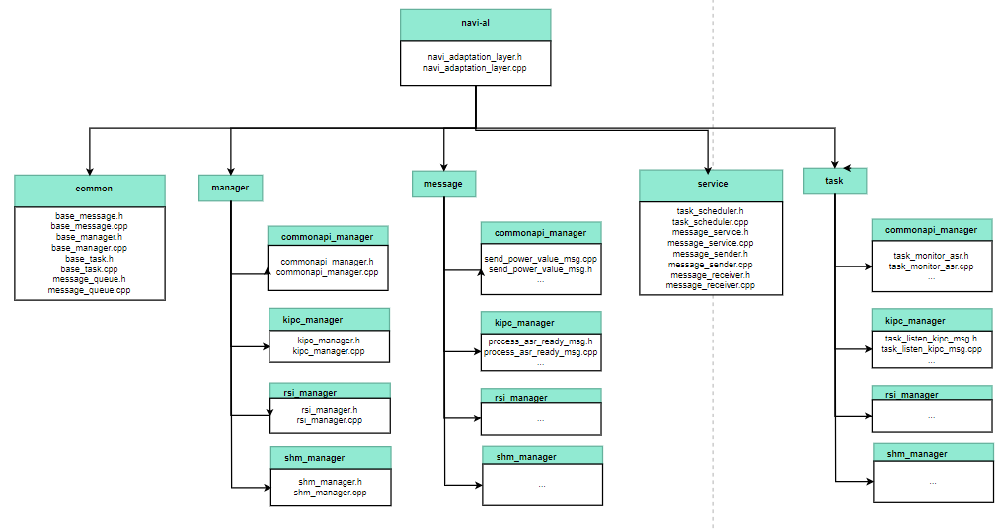
Image reference: doc_image_013.png

Figure 13. The source code structure

## Table
| Directory | Description |
| --- | --- |
| navi-al | The top directory for all source code |
| common | Contain base classes and common stuff |
| manager | Contain the manager classes. Each manager is separated by dedicated directory. |
| message | Contain the message classes for all managers. Messages for each manager are separated by corresponding directory. |
| service | Contain service classes used by the system such as message service, task scheduler. |
| task | Contain the task classes for all managers. Tasks for each manager are separated by corresponding directory. |

Table 6. Source code directory description

Dynamic Design (Sequence Diagram)

 Startup

Image reference: doc_image_014.png

Figure 14. Startup sequence diagram

Sending message between managers

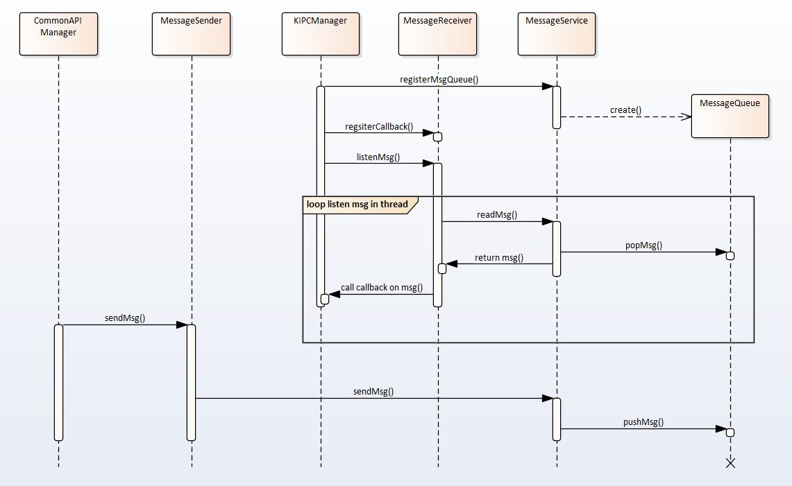
Image reference: doc_image_015.png

Figure 15. Sending message between managers sequence diagram

KipcManager processes incoming KIPC data
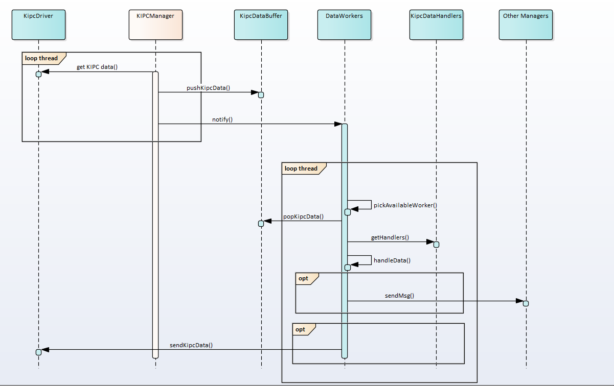
Image reference: doc_image_016.png

Figure 16. KipcManager processes incoming KIPC data sequence diagram

KipcManager processes message from other managers
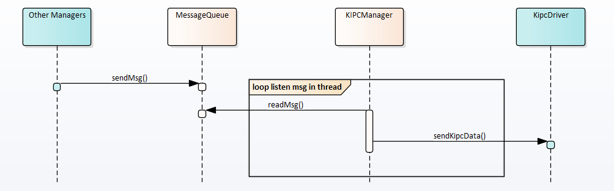
Image reference: doc_image_017.png

Figure 17. KipcManager processes message from other managers sequence diagram

CommonApiManager processes data from navi-engine service
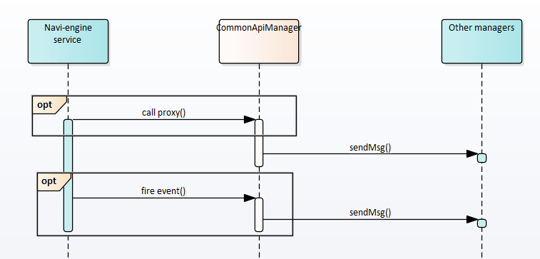
Image reference: doc_image_018.png

Figure 18. CommonApiManager processes data from navi-engine sequence diagram

CommonApiManager processes message from other managers
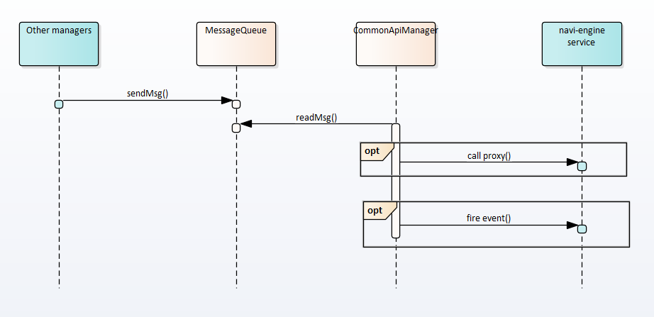
Image reference: doc_image_019.png

Figure 19. CommonApiManager processes message from other managers

ShmManager reads command and gets corresponding data from navi-engine service

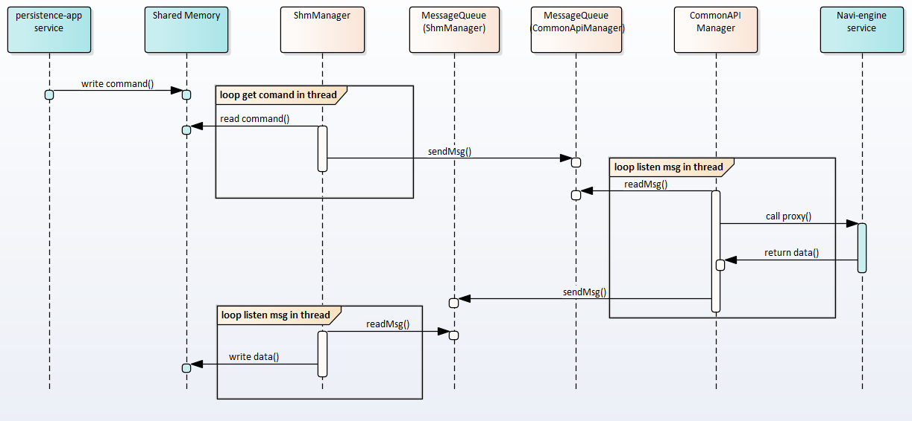
Image reference: doc_image_020.png

Figure 20. ShmManager reads command and gets corresponding data from navi-engine sequence diagram

 RsiManager gets RSI data and forwards to other managers
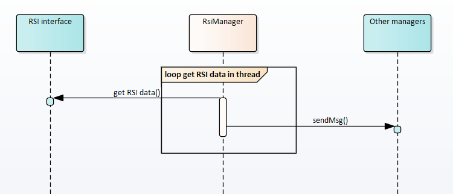
Image reference: doc_image_021.png

Figure 21. RsiManager gets RSI data and forwards to other managers

Demonstration

The source code is implemented to demonstrate the architecture.

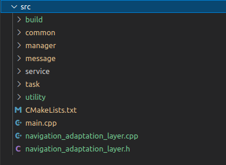
Image reference: doc_image_022.png

Figure 22. The source code structure

In this source code, it simulates a lot of incoming KIPC data messages. The KipcManager receives the KIPC data and forward to CommonApiManager.

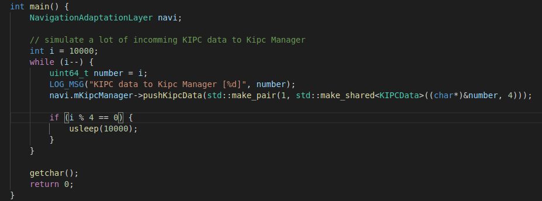
Image reference: doc_image_023.png

Figure 23. The main function and incoming KIPC data simulation

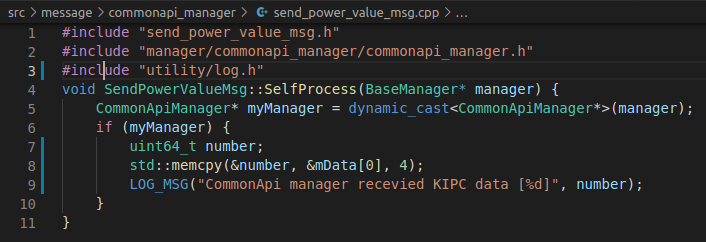
Image reference: doc_image_024.png

Figure 24. The message sent from Kipc Manager to CommonApi Manager

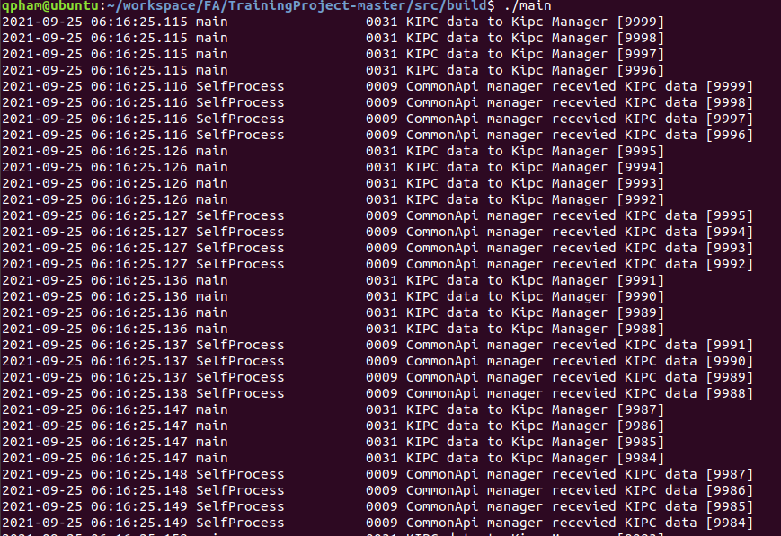
Image reference: doc_image_025.png

Figure 25. The demonstration output
