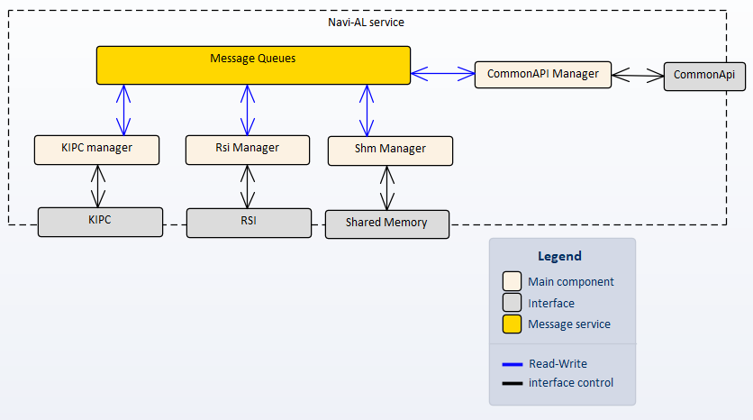
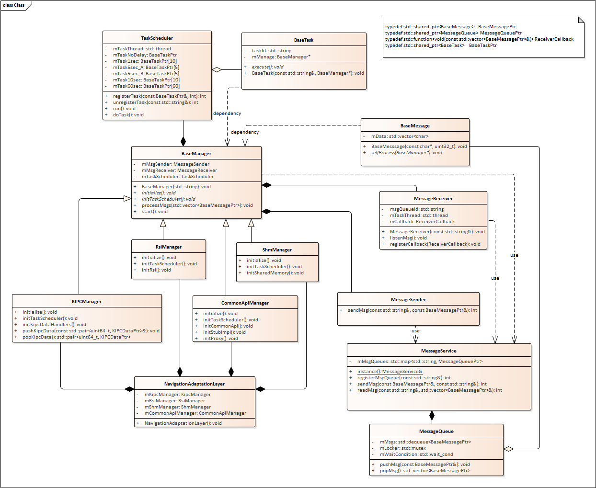
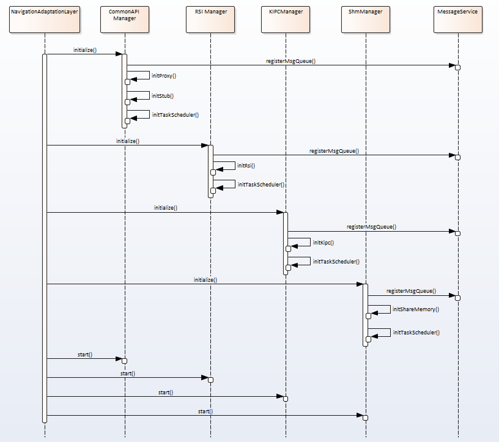

# Raw Slide Content

- Source file: FA_Pham_Phu_Quynh-Certification-Task[1].pptx
- Total slides: 18

## Slide 1

Navigation Adaptation Layer Improvement

Image reference: slide_01_image_01.png

LGE Internal Use Only

Image reference: slide_01_image_02.png

Author: Pham Phu Quynh
Mentor: Man Soo Seo

Function Architect Certification Review

1

## Slide 2

Agenda

LGE Internal Use Only

Image reference: slide_02_image_01.png

Navigation Adaptation Layer overview.
Problem.
Alternative Solution.
Implement Design.
QnA

2

## Slide 3

1. Navigation Adaptation Layer overview

Navigation Adaptation Layer (Navi-AL) provides an adaptation communication between navi-engine service and other services which use different interfaces.

Image reference: slide_03_image_01.png

3

Image reference: slide_03_image_02.png

## Slide 4

2. Problem

The components inside Navi-AL have a tight coupling.

Image reference: slide_04_image_01.png

Component B

Pointer A

Component C

Pointer A

Pointer B

Component A

Pointer B

Pointer C

2. The classes are designed to big.

Class A

Logic 1

Logic 2

Logic 3

Logic 4

Logic 5

……..

5

## Slide 5

3. Alternative Solutions

Make the components inside Navi-AL have a loose coupling.

Image reference: slide_05_image_01.png

Component B

Component C

Component A

2. Refactor the classes into smaller classes

Class A

Class Logic 1

Class Logic 2

Class Logic 3

Class Logic 4

Class Logic 5

6

Communicator

New Component

Class Logic 6

## Slide 6

3. Alternative Solutions

Image reference: slide_06_image_01.png

The main components will be categorized by interface:
KipcManager: manages the communication with KIPC.
RsiManager: manages the communication with Rsi.
ShmProvider: manages the communication with Shared memory.
CommonApiManager: manages the communication with CommonApi.

Image reference: slide_06_image_02.png

How the component connect?

7

## Slide 7

3. Alternative Solutions

Image reference: slide_07_image_01.png

Image reference: slide_07_image_02.png

Solution 1: Observer pattern

The manager connects by subscribe-publish mechanism.
When a manager sends data or request to another, it will publish the event.
The subscribers receive this event and do the corresponding actions.

8

## Slide 8

3. Alternative Solutions

Image reference: slide_08_image_01.png

Image reference: slide_08_image_02.png

Solution 2: Message queue concept

Each manager has its own message queue.
Manager sends a message to the message queue of the target manager.
The target manager reads the message and do the corresponding actions.

9

## Slide 9

3. Alternative Solutions

### Table
| No | Observer pattern | Message Queue concept |
| 1 | The subscriber (manager) processes notification at the same thread as publisher. | The message receiver (manager) has its own thread to process the message. It is separated from the sender. |
| 2 | Simply to implement. | Have to implement the message send/receive mechanism. |
| 3 | Don’t need more thread. | Need more threads for the message send/receive mechanism. |
| 4 | Event-based mechanism. | Message-based mechanism. |

Image reference: slide_09_image_01.png

Compare two solutions

better

better

better

better

10

Using Solution 2 – Message Queue Concept is better

## Slide 10

4. Implement design

Image reference: slide_10_image_01.png

Static Design - Architectural Representations

Image reference: slide_10_image_02.png

Components and relationship of Navi-AL

13

## Slide 11

4. Implement design

Image reference: slide_11_image_01.png

Static Design – Class Diagram

13

Image reference: slide_11_image_02.png

## Slide 12

4. Implement design

Image reference: slide_12_image_01.png

Dynamic Design – Sequence Diagram - Startup

14

Image reference: slide_12_image_02.png

## Slide 13

4. Implement design

Image reference: slide_13_image_01.png

Dynamic Design – Sequence Diagram - Sending message between managers

Image reference: slide_13_image_02.png

15

## Slide 14

4. Implement design

Image reference: slide_14_image_01.png

Result

15

Image reference: slide_14_image_02.png

The source code structure

## Slide 15

4. Implement design

Image reference: slide_15_image_01.png

Result

15

Sample code

Image reference: slide_15_image_02.png

Image reference: slide_15_image_03.png

## Slide 16

4. Implement design

Image reference: slide_16_image_01.png

Result

15

Demonstration output

Image reference: slide_16_image_02.png

## Slide 17

THANK YOU!

LGE Internal Use Only

Image reference: slide_17_image_01.png

17

## Slide 18

QnA

LGE Internal Use Only

Image reference: slide_18_image_01.png

18

