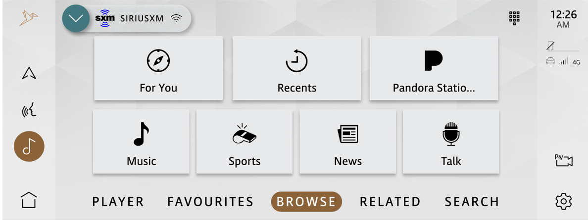
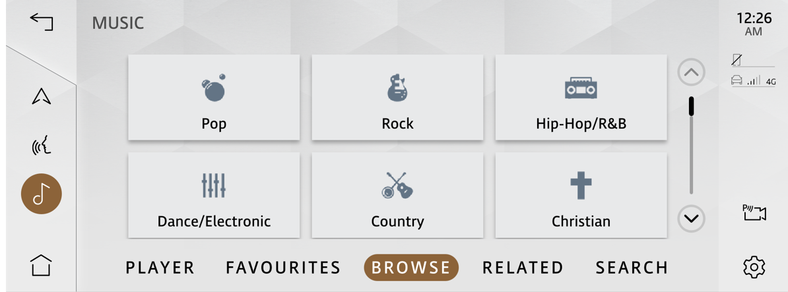
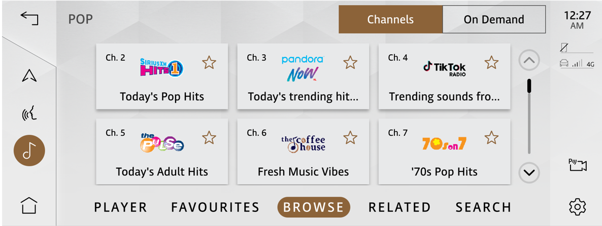

# Raw Slide Content

- Source file: FA_Pham_Phuong_Tuan_FA-Certification_Performance_improvement_of_Broadcast_SXM_function_v0.6[1].pptx
- Total slides: 15

## Slide 1

FA
Performance improvement of Broadcast SXM function

2022.09.26

LG VS DCV

CONTENT

Background
Architectural Driver
Architectural Alternatives
Architectural Decision
Conclusion

Image reference: slide_01_image_01.png

## Slide 2

Background

Figure: HMI Screen of Sirius XM Application

Image reference: slide_02_image_01.png

Image reference: slide_02_image_02.png

Image reference: slide_02_image_03.png

Let begin with a simple use case
1. Open “Music” Super Category

2. It take time to display the list of category
3. Then open “Pop” Category

4. It also take time to display the list of channel

## Slide 3

Background

Image reference: slide_03_image_01.wmf

All data content from Sirius XM function provide by EMMA API
The data is synced from EMMA framework to SXM service, then to SXM HMI quite slow, so the time to get data from the EMMA API is very important.

This topic try give some improvement, focus only on the user experience, to help user should not see the loading/blank screen as much as possible

## Slide 4

Architectural Driver

### Table
| ID | Functional Requirement | SRS ID |
| FR01 | When user select the Super Category List, Category List and Channel List, then the list corresponding to the user's choice is displayed | SXM-HMI-0001 |
| FR02 | When user select tabs (Related Content, Available Shows, Other Episodes List), then the list corresponding to the user's choice is displayed. If current now playing channel is changed, then these information will be changed also if there are any update | SXM-HMI-0001 |
| FR03 | When user select tabs (Recommended For You, Listening History, Pandora Station, SiriusXM Favorites), then the list corresponding to the user's choice is displayed. If user change Listener Profile, then these information will be changed also if there are any update | SXM-HMI-0003 |

### Table
| ID | Quality Attribute Scenario | Quality Attribute | Priority |
| QA01 | SXM App will response the following list within 1s from user clicked open corresponding screen to all information have been shown Super Category List Category List Category‘s Channel List | Performance | High |
| QA02 | SXM App will response the following list within 1s from user clicked open corresponding screen to all information have been shown or when there are an update when current playing channel have changed Related Content Available Shows Other Episodes List | Performance | High |
| QA03 | SXM App will response the following list within 1s from user clicked open corresponding screen to all information have been shown or when there are an update when Listener Profile have changed Recommended For You Listening History Pandora Station SiriusXM Favorites | Performance | High |

Table: Functional Requirement

Table: Quality Attribute

## Slide 5

Architectural Driver

Table: Business and Technical Constraint

### Table
| ID | Business Constraint | SRS ID |
| BC1 | OEM didn’t define EMMA’s Performance Spec |  |
| BC2 | OEM haven’t concerned the delay problem in wireframe or UI/UX documents yet. |  |
| BC3 | EMMA Performance may be improved via upgrade to newer version. Howerver, this migrating/porting to newer version will not considered to this document |  |

### Table
| ID | Technical Constraints | SRS ID |
| TC1 | EMMA framework doesn’t have callback API when information from following list changed - Super Category List - Category List - Category‘s Channel List - Related Content - Available Shows - Other Episodes List - Recommended For You - Listening History - Pandora Station - SiriusXM Favorites |  |
| TC2 | The EMMA framework performance cannot be interfered by LGE to improve this situation |  |
| TC3 | At start up it can take 5 – 10 seconds for initialization, followed by an additional 10-15 seconds to provide full channel list including banners and logos. |  |

## Slide 6

Architectural Alternatives

### Table
| HMI Screen |  | Frequency of information updates | Solution |
| - | Super Category List | Almost fixed for days or month (rare to update) |  |
|  | Category List |  |  |
|  | Category‘s Channel List |  |  |
| Changed if current channel is changed | Related Content | High frequency of updates | Cache must be reset when received current channel changed callback |
|  | Available Shows |  |  |
|  | Other Episodes List |  |  |
| Changed if current profile is changed | Recommended For You | Medium frequency of updates | Cache must be reset when received user profile changed callback |
|  | Listening History |  |  |
|  | Pandora Station |  |  |
|  | SiriusXM Favorites |  |  |

### Table
| Table: Cyclic preload: frequency of information updates for each HMI Screen |

1st Architectural : Cache Layer

The most obvious disadvantage of Cache Layer Solution is that the user can select the channel which don’t have on latest list.
But this disadvantage must be trade-off, user can see cached data for a short time and go to latest data

Image reference: slide_06_image_01.png

Send data content on cache as soon as possible, (some data content rare to update)
Then we get the data through EMMA’s API again
If Then we check whether the data is the same or not
data content is not match with cache data, we send data update signal to update HMI
The HMI Screen which is applied this solution should be considered in terms of frequency of information updates

Image reference: slide_06_image_02.png

## Slide 7

Architectural Alternatives

### Table
| Table: Cache Memory Estimation |

### Table
| HMI Screen |  | count | Structure | Sum (bytes) |
| - | Super Category List | 4 (estimate) | SUPER_CATEGORY_LIST_T (566 bytes) | 2264 |
|  | Category List | 50 (estimate) | CATEGORY_LIST_T (566 bytes) | 28300 |
|  | Category‘s Channel List | 980 (estimate) | CHANNEL_INFORMATION_T (3264 bytes) | 3198720 |
| Changed if current channel is changed | Related Content | 8 (estimate) | COMMON_TILE_ELEMENT_T (2362 bytes) | 18896 |
|  | Available Shows | 10 (estimate) |  | 23620 |
|  | Other Episodes List | 10 (estimate) |  | 23620 |
| Changed if current profile is changed | Recommended For You | 8 (maximum) |  | 18896 |
|  | Listening History | 24 (maximum) |  | 56688 |
|  | Pandora Station | 20 (estimate) |  | 47240 |
|  | SiriusXM Favorites | 38 (maximum) |  | 89756 |
| Total |  |  |  | 3.34 MB |

Cache Memory about 3.34MB
It'll increase heap memory when the service is running, the increment still acceptable in system.
Currently, many elements of structure may not necessary, it support for currently design but have not optimized yet
So it must be optimized more.

Image reference: slide_07_image_01.png

## Slide 8

Image reference: slide_08_image_01.wmf

Architectural Alternatives

1. Cache data will be sent immediately if it’s avaiable.
HMI will display the data very fast

2. The update if need, expect after about 2sec (depends a lot on the internet connection to the server)

## Slide 9

Architectural Alternatives

### Table
| Table 5 Cyclic preload: frequency of information updates for each HMI Screen |

2nd Architectural : Cyclic preload

Cyclic preload make service consumes CPU Usage of system

Image reference: slide_09_image_01.png

Periodically, we preload data even when the user doesn't need it.
The Data which store on EMMA also have been cached.
Preload the data help more quickly access on the next time we get the data

Image reference: slide_09_image_02.png

### Table
| HMI Screen |  | Frequency of information updates | Solution |
| - | Super Category List | Almost fixed for days or month (rare to update) | No need |
|  | Category List |  |  |
|  | Category‘s Channel List |  |  |
| Changed if current channel is changed | Related Content | High frequency of updates | Reload immediately after channel have changed Reload every 1 min, don’t request load all the information at the same time |
|  | Available Shows |  |  |
|  | Other Episodes List |  |  |
| Changed if current profile is changed | Recommended For You | Medium frequency of updates | Reload immediately after profile have changed Reload every 10 min, don’t request load all the information at the same time |
|  | Listening History |  |  |
|  | Pandora Station |  |  |
|  | SiriusXM Favorites |  |  |

## Slide 10

Architectural Alternatives

### Table
| Table: Cyclic preload: frequency of information updates for each HMI Screen |

2nd Architectural : Cyclic preload

Fortunately, most of lists size are medium, excepted Category‘s Channel List.
For another list, CPU Usage is not significant, but for Category‘s Channel List, the list size quite large.
To reduce CPU Usage, we should add a delay when we get channel list between categories, but it will increase execute time.

Image reference: slide_10_image_01.png

### Table
| Category‘s Channel List ( nth measurement ) | CPU% (no sleep) - execute time (sec) | CPU% (sleep 100ms) - execute time (sec) |
| 1st | 7.31% - 1.6s | 4.93% - 6.3s |
| 2nd | 7.41% - 1.6s | 5.33% - 6.3s |
| 3rd | 7.39% - 1.6s | 4.89% - 6.4s |
| Average | 7.37% - 1.6s | 5.05% - 6.3s |

## Slide 11

Architectural Decision

Table: Proposal Comparison

### Table
| Item |  | Cache Layer | Cyclic preload |
| Quality Attribute Scenario | QA01 | Reduce to time to load if 2 data is the same | Higher CPU may effect to the system, increase HMI render process It can be reduce by reduce call frequency |
|  | QA02 |  |  |
|  | QA03 |  |  |
| Implementation Impact Analysis |  | HMI: add API for update Data result on screen Service: add Cache layer | HMI: add API for update Data result on screen Service: add cyclic preload process |

Based on the analysis, I propose to choose Cache Layer, and a part of cyclic preload solution
The data will be preloaded only one time to as the initialization of the cache layer.
Because of constraint TC3, this preloading must avoid the time after cold boot or LPM.
(TC3: at start up it can take 5 – 10 seconds for initialization, followed by an additional 10-15 seconds to provide full channel list including banners and logos)

Image reference: slide_11_image_01.png

## Slide 12

Image reference: slide_12_image_01.wmf

Architectural Decision

initialization of the cache layer

## Slide 13

Conclusion

Image reference: slide_13_image_01.wmf

## Slide 14

Conclusion

### Table
| Category List ( nth measurement ) | AS-IS (s) | TO-BE (s) |
| 1st | 0.441 | 0.001 |
| 2nd | 0.427 | 0.001 |
| 3rd | 0.408 | 0.001 |
| Average | 0.425 | 0.001 |

### Table
| Table: Test Result: For Category List |

Test result, as expectation, data is requested and responds almost immediately.
User experience is improved, user will not often observed blank/loading screen.
Note: the time is count from HMI request to HMI response

Image reference: slide_14_image_01.png

## Slide 15

Image reference: slide_15_image_01.png

