# Raw Slide Content

- Source file: FA_Tran_Hoang_Nam_인증과제_Call_Manager_Commonization_Architecture_v1.2_(Final)[1].pptx
- Total slides: 12

## Slide 1

Image reference: slide_01_image_01.png

FA 인증과제
Call Manager Commonization Architecture

By Nam H. Tran
Supervise by 이상훈
AVN Application Unit - Functional Technology 4
LG Vehicle Solution Development Center Vietnam
October 7th 2021

## Slide 2

TABLE CONTENT

1

Comparison & Architecture Decision

3

Experimental Result

4

Problem Identification

Q&A

5

6

Architecture Design Proposals

2

## Slide 3

1. Problem Identification

Call Bubble: A widget to show the call states of the current connected device

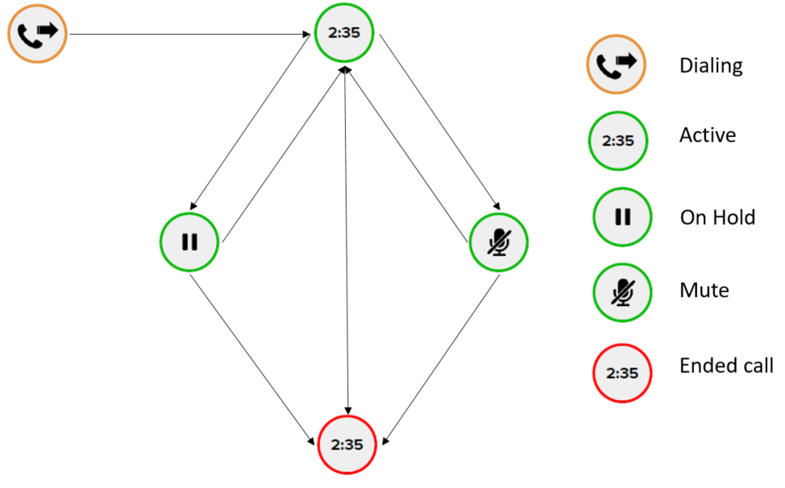
Image reference: slide_03_image_01.png

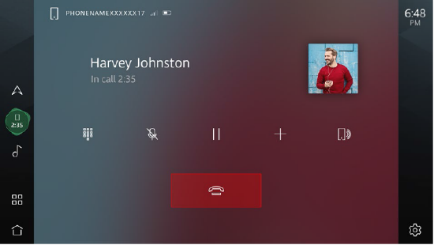
Image reference: slide_03_image_02.png

- Dialing a call
- Receive an incoming call
- Swap active call (2 calls active)
- Conference call (more than 1 call active)

- Switch feature between Bluetooth and Phone Projection
- Switch feature between Phone Projection (Androdid Auto, Apple CarPlay and Baidu CarLife)

Image reference: slide_03_image_03.png

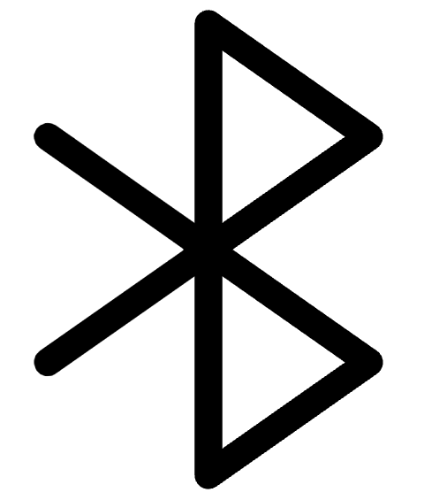
Image reference: slide_03_image_04.png

Bluetooth Service

Image reference: slide_03_image_05.png

Image reference: slide_03_image_06.png

Image reference: slide_03_image_07.png

Phone Projection Service

Functional Requirement:

- Adding a 2nd call
- Mute microphone
- End a call / a merged call
- Disconnect / Reconnect Bluetooth & Phone Projection

HMI Application
Call Bubble

3

## Slide 4

1. Problem Identification

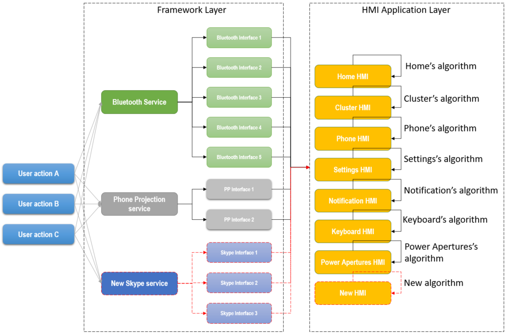
Image reference: slide_04_image_01.png

Current Architecture Design Problems

4

Difficult for feature expansion
Duplicated & Non-reusable
High CPU consumption

## Slide 5

1. Problem Identification

“The Call Bubble will remain and will always be visible from any feature or over a drawer”

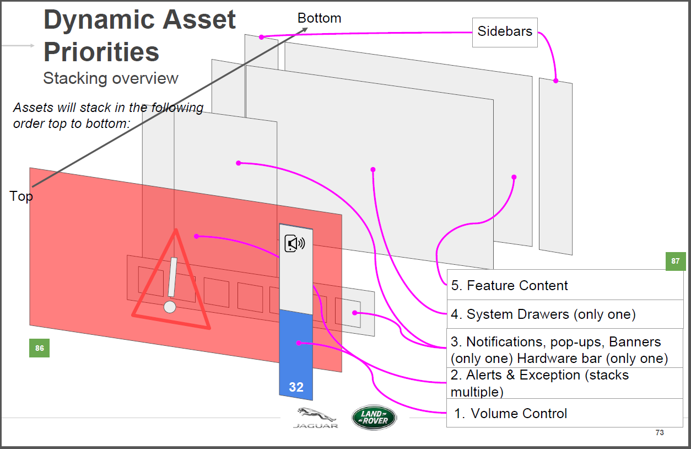
Image reference: slide_05_image_01.png

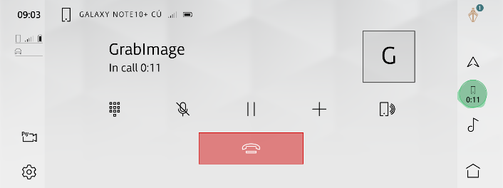
Image reference: slide_05_image_02.png

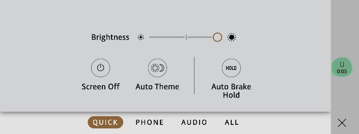
Image reference: slide_05_image_03.png

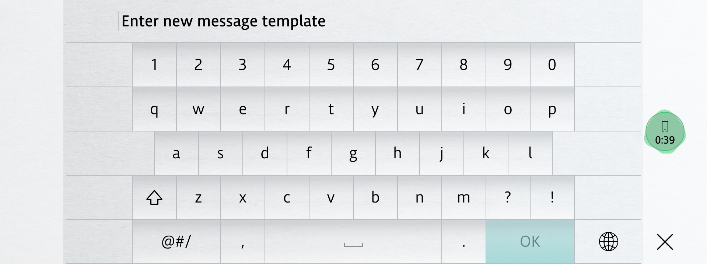
Image reference: slide_05_image_04.png

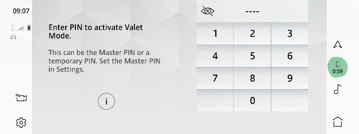
Image reference: slide_05_image_05.png

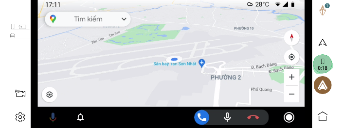
Image reference: slide_05_image_06.png

Image reference: slide_05_image_07.png

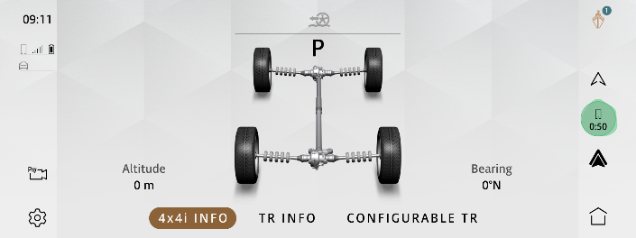
Image reference: slide_05_image_08.png

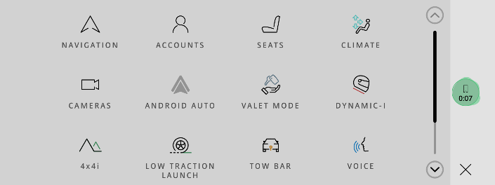
Image reference: slide_05_image_09.png

5

4. Mismatched call state between HMI Applications (~5000 issues)

## Slide 6

Task Objectives

To resolve completely the HMI call issues, especially when:
Integrate new HMI Application
Integrate new Framework Service
To reduce the effort of Call Bubble implementation
To improve the system performance when a call is initialized with a new architecture proposal

6

## Slide 7

2. Architecture Design Proposals

Proposal 1: Virtual Call Handler Architecture

7

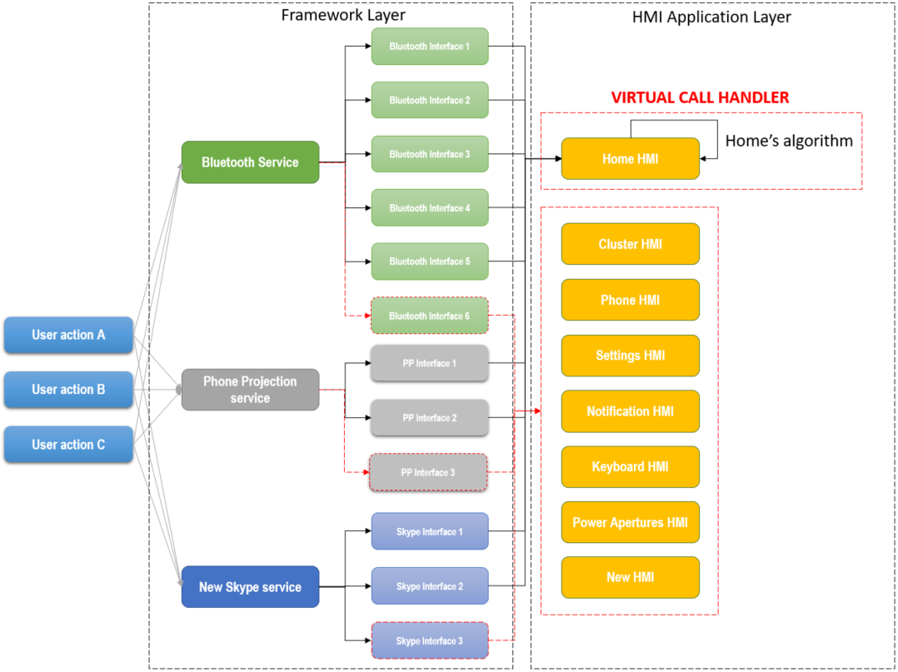
Image reference: slide_07_image_01.png

Pros:
Easy to implement without side effect or regression
→ Modifiability (Expected for 0.5MM for all changes)
Able to resolve the HMI call issues
→ Usability (Maintain by Home’s algorithm)
Able to reduce the MM for feature expansion
→ Reusability (Expected reduce from 1MM to 0.1MM)
Able to improve system performance
(To be compared in later slide)
Cons:
Additional work for Home HMI App
→ Performance & Maintainability
Requires integration for HMI Apps for new feature
→ Modifiability

## Slide 8

2. Architecture Design Proposals

Proposal 2: Call Manager Commonization Architecture

8

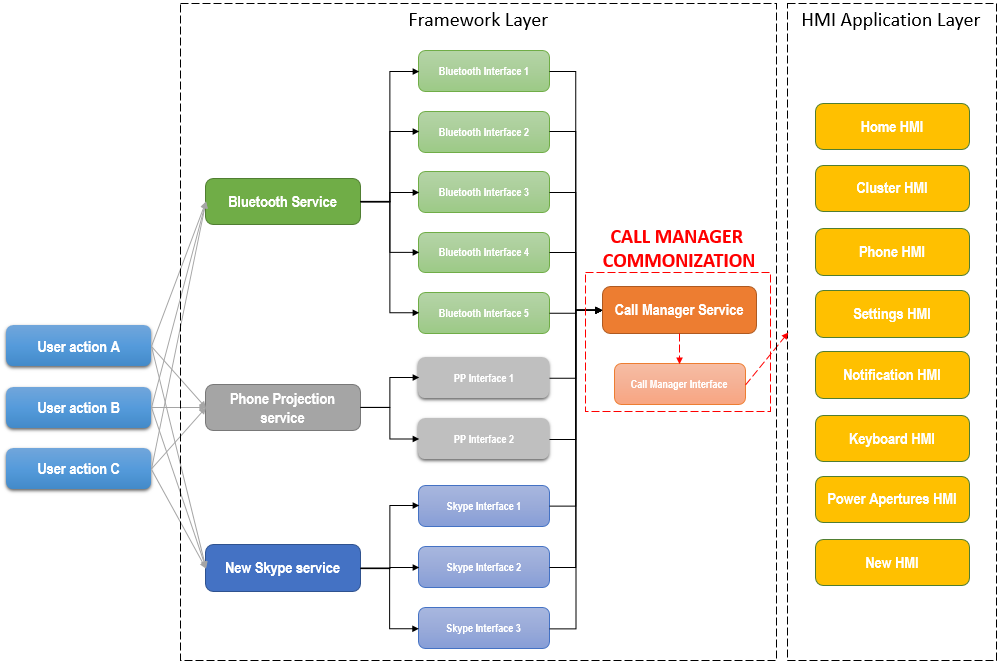
Image reference: slide_08_image_01.png

Pros:
Able to resolve the HMI call issues
→ Usability (Maintain by Call Manager Service)
Able to reduce the MM for feature expansion
→ Reusability (Expected reduce from 1MM to 0.05MM)
Able to improve system performance
(To be compared in later slide)
Cons:
Potential side effect (possible to
resolve by a detailed architecture design)
→ Modifiability

## Slide 9

3. Comparison & Experimental Result

### Table
| Non-functional requirement | How to measure |  | CA | VCH | CMC |
| Home HMI is ready within 11s from startup | Power on the system and initialize a call from the hand phone Measure the time until the Home screen is available |  | 9742 | 9741 | 9426 |
| App launching within 1s from the user request (not include Home & Cluster) | Initialize a call in active state Launch the application with Call Bubble | Phone HMI | 943 | 920 | 925 |
|  |  | Settings HMI | 624 | 612 | 610 |
|  |  | Notification HMI | 437 | 420 | 422 |
|  |  | Keyboard HMI | 754 | 737 | 730 |
|  |  | Power Apertures HMI | 894 | 874 | 870 |
| HMI update is required within 100ms from same update occurring on the phone | Initialize a call Change call state from the hand phone | Home HMI | 81 | 81 | 41 |
|  |  | Others | 82 | 52 | 41 |
| Call Bubble animation at 30 fps concurrently | Initialize a call in active state Measure the time to complete 1 cycle of Call Bubble animation (180 picture) |  | 6000 | 6000 | 6000 |

1. Non-functional requirement
Note: CA – Current Architecture, VCH – Virtual Call Handler, CMM – Call Manager Commonization
Measurement unit is milliseconds (ms)

9

## Slide 10

3. Comparison & Experimental Result

Architecture Proposal Comparison

2. System Integration Testing

### Table
| CPU Usage / Memory Usage | Feature Type | Current Architecture | Virtual Call Handler Architecture | Call Manager Commonization |
| Home | HMI App | 16% / 320MB | 16.5% / 320MB | 11% / 320MB |
| Phone | HMI App | 11% / 220MB | 7% / 220MB | 7% / 225MB |
| Settings | HMI App | 7% / 160MB | 1% / 150MB | 0.5% / 123MB |
| Notification | HMI App | 7% / 150MB | 1% / 140MB | 0.5% / 125MB |
| Keyboard | HMI App | 7% / 145MB | 1% / 135MB | 0.5% / 119MB |
| Power Door | HMI App | 7% / 150MB | 1% / 135MB | 0.5% / 122MB |
| Bluetooth Service | Framework | 8% / 30MB | 8% / 30MB | 8% / 30MB |
| Phone Projection Service | Framework | 5% / 12MB | 5% / 12MB | 5% / 12MB |
| Call Manager Service | Framework | N/A | N/A | 3% / 2.5MB |

10

## Slide 11

4. Detailed Architecture Design

Context Diagram of Call Manager Service

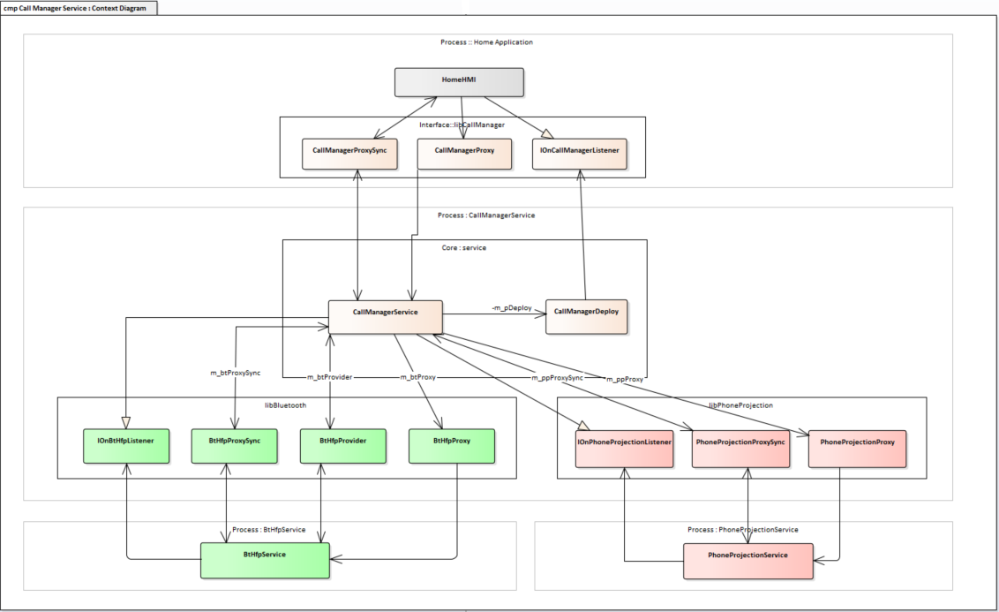
Image reference: slide_11_image_01.png

11

## Slide 12

5. Q&A

Q&A

Thank you for listening!

12

