# Raw Document Content

- Source file: Process_Communication_Manager_Architecture_final[1].docx

LGE FA 인증과제

 FA Design Document

[Process Communication Manager]

About This Document

Document Information

## Table
| Issuing authority |  |
| --- | --- |
| Configuration ID |  |
| Status of document | Approved |

Revision History

## Table
| Document history is organized in order with the most recent history at the top and the earliest history at the bottom. |
| --- |

## Table
| Version | Date | Comment | Author | Approver |
| --- | --- | --- | --- | --- |
| 0.0 | 07-24-2023 | Initialize the document structure | hai.phan |  |
| 0.1 | 07-27-2023 | Update the Overview and function requirement | hai.phan |  |
| 0.2 | 08-02-2023 | Update proposal architecture | hai.phan |  |
| 0.3 | 08-10-2023 | Update Detail Design | hai.phan |  |
| 0.4 | 09-10-2023 | Update Dynamic Design Update some comment of mr. Joon Update concern point and solution | hai.phan |  |
| 0.5 | 09-28-2023 | Final version | hai.phan | joon.namkoong |
|  |  |  |  |  |

Figures

Figure 1 The scope this topic working in	5

Figure 2 EA structure	7

Figure 3 App communicate with Service	8

Figure 4 App communicate with another App	8

Figure 5 The App import a lot of library	8

Figure 6 VDC architecture	9

Figure 7 Binder IPC sequence diagram	10

Figure 8 Tiger 3.0 Interface class	11

Figure 9 Service Manager’s purpose	12

Figure 10 Common Lib Concept	13

Figure 11 Common lib components	14

Figure 12 Common Lib’s "internal" Component Diagram	14

Figure 13  Send message from App to Service	15

Figure 14 PCM’s "internal" Component Diagram	17

Figure 15 App send message to Service via PCM	18

Figure 16 Compare Architecture Design Proposal	20

Figure 18 How message queue work	24

Figure 19 PCM External Design	27

Figure 20 PCM Class Diagram	28

Figure 21 PCM State Design	29

Figure 22 Send message via PCM	30

Figure 23 Share memory via PCM	31

Figure 24 Notify binder died to resisted Application	32

Table

Table 1 Connection in current architecture	9

Table 2 Evaluate of Common Lib Architecture	16

Table 3 Connection in PCM Architecture	17

Table 4 PCM evaluate	19

Table 6 Classes that PC Manager Service component consists of	29

Table 7 PCM State	30

Introduction

Purpose

I’m working in VDC project (a Telematics project that build for Jaguar).

A project like VDC has a lot of component, but my topic is only relate to the Application/Services in CSU (The Blue path in bellow image):

Image reference: doc_image_001.png

Figure 1 The scope this topic working in

Based on the demand for extending the communication capabilities of VDC, I have identified some limitations in the architecture of the current system. Consequently, I aim to develop a new system that will facilitate the implementation of novel communication methods for Software Engineers. My proposed solution involves the creation of a system called the "Process Communication Manager".

My design proposal, although a substantial and influential change for various applications, cannot be applied to the current project due to its significant time investment requirements. Despite its numerous positive attributes and potential benefits, it is clear that implementing this design is not feasible at this time. However, I remain optimistic that in the future, when Telematics undergoes substantial enhancements, this design may prove valuable for the project.

This document outlines the Software Design for the Process Communication Manager, encompassing static, dynamic, and algorithmic designs.

Scope

This document covers for the design for a service handle communication service include some below content:

Overview

Architectural Driver (Functional Requirement, Quality Attribute, Constraint)

Architectural Analysis

Architectural Alternatives and Tactics

Architectural Decision

Architecture Diagram.

Audience

The target audience of this document is:

Mr. 남궁준 joon.namkoong who mentor me on FA programing

Software architect who will evaluate the design of the software

Convention

NOTE: Various notes that are useful to know in the contents

Acronyms

## Table
| Acronym | Description |
| --- | --- |
| PCM | Process Communication Manager |
|  |  |
|  |  |
|  |  |

## Table
| Glossary | Description |
| --- | --- |
|  |  |
|  |  |

Related Documents

Documents related to this document include:

Tiger_IPC_binder__reliable.pptx

Tiger Platform_tobeREF.pptx

Enterprise Architecture

I’m using Enterprise Architecture to create the PCM design

EA server:

Data Source Name: FA

TCP/IP Server: 10.220.48.235

Port: 3306

User: clip

Password: clip

EA Structure:

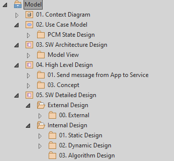
Image reference: doc_image_002.png

                        Figure 2 EA structure

Overview

 Overall Descriptions

In a Telematics project, below are the ways that some process communicated together

App to Service

Image reference: doc_image_003.png

Figure 3 App communicate with Service

App to App

Image reference: doc_image_004.png

Figure 4 App communicate with another App

It meas the application needs to import a lot of libs to communicate to each Service

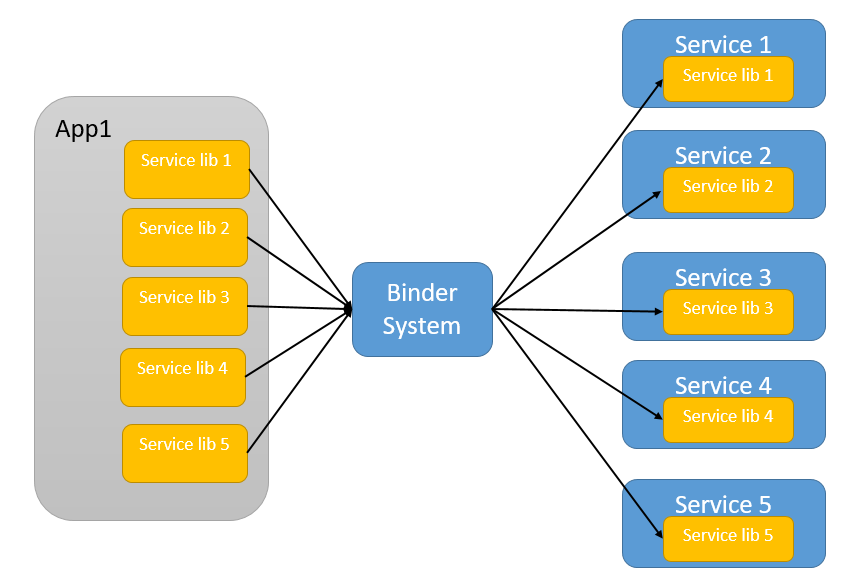
Image reference: doc_image_005.png

Figure 5 The App import a lot of library

This mechanism result in some below inconvention:

The app need to import a lot of library lead to reduce its performance (reduce start time of process due to load a lot of library). Moreover, there are a lot of same libraries that a lot of applications need to import.

Duplicate the effort when have any change in Binder/Communicate system.

Communicating is a complex task, especially when we want to extend or enhance it. And I would like to simplify the responsibility of the service. The main focus of service should be on the core business, while another process can be implemented to handle communication effectively.

Current Architecture:

Image reference: doc_image_006.png

Figure 6 VDC architecture

## Table
| Connector : from | Connector : to | Description | Note |
| --- | --- | --- | --- |
| App | Service | The application need to import the Service lib and the Service also import this lib. The Service contains the binder implement that help app communicate with Service |  |
| App | App | The App communicate with other app via Application lib. |  |
| Service1 | Service2 | The Service1 also need to import the Service 2 library to communicate. |  |

Table 1 Connection in current architecture

Functional Requirement

In the Telematics project, there is no specific requirement related to the Communication between the App – Service – App. Just base on the System design, the App need to get data from other service/other app and Vice versa, sometimes, the app also need to communicate with other app to trigger some action.

Bellow sequence diagram is a sample when a Service manager want to send message to Client via Binder IPC.

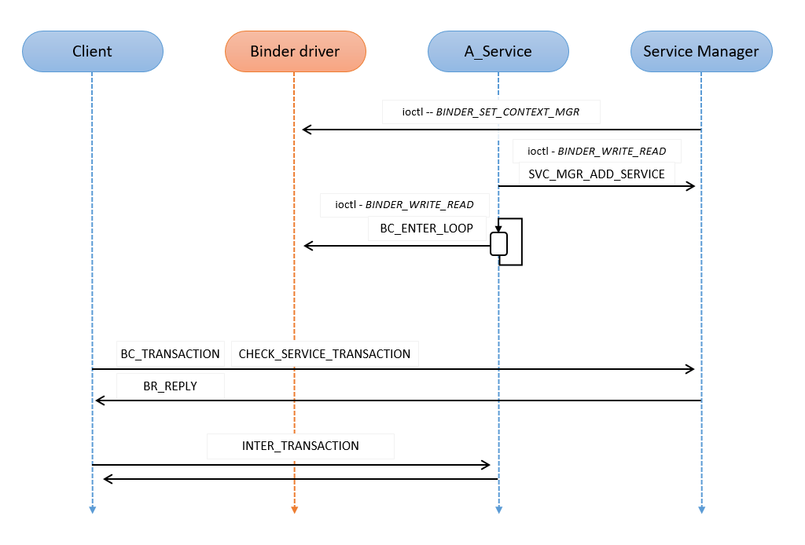
Image reference: doc_image_007.png

Figure 7 Binder IPC sequence diagram

Non-functional Requirement

Even though the Telematics system doesn’t have specific requirement for the communication, it also need this system to adapt some above non-functional requirement:

Reliability

Request/Response messages are the primary communication mechanism for the Client to migrate SUM through the phases and states and for requesting information. Actions with high latency will be acknowledged immediately and, concluded with asynchronous messages sent by the SUM to the Client.

Performance

The Telematics system require some Performance KPI to guarantee it working smooth

## Table
| Cold Start | 10 | Sec |
| --- | --- | --- |
| System Metrics | 70% | RAM |

Tiger 3.0 Change

Tiger 3.0 has new concept that the Service need to implement a specific manager class. The Manager working as a proxy that help Application communicate with Legacy interface.

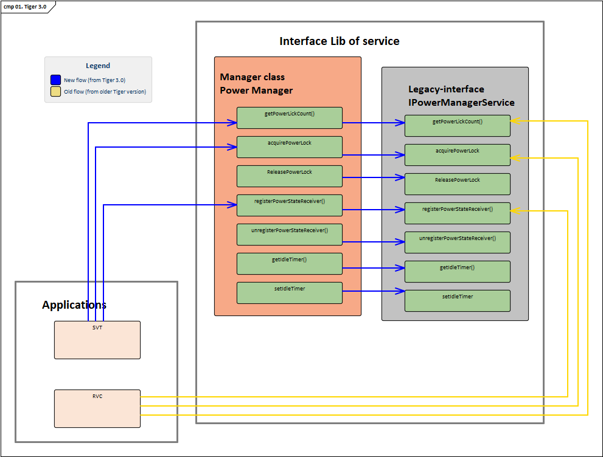
Image reference: doc_image_008.png

Figure 8 Tiger 3.0 Interface class

The figure 9 describes how Power Manager implements the Manager class based on Tiger 3.0 concept. There are 2 big changes:

1. The App will get the Service via the Service Manager and the Service Manager will communicate with Service via Legacy Interface:

2. The Service Manager also implements the binder died of the Service. The Application doesn’t need to implement it.

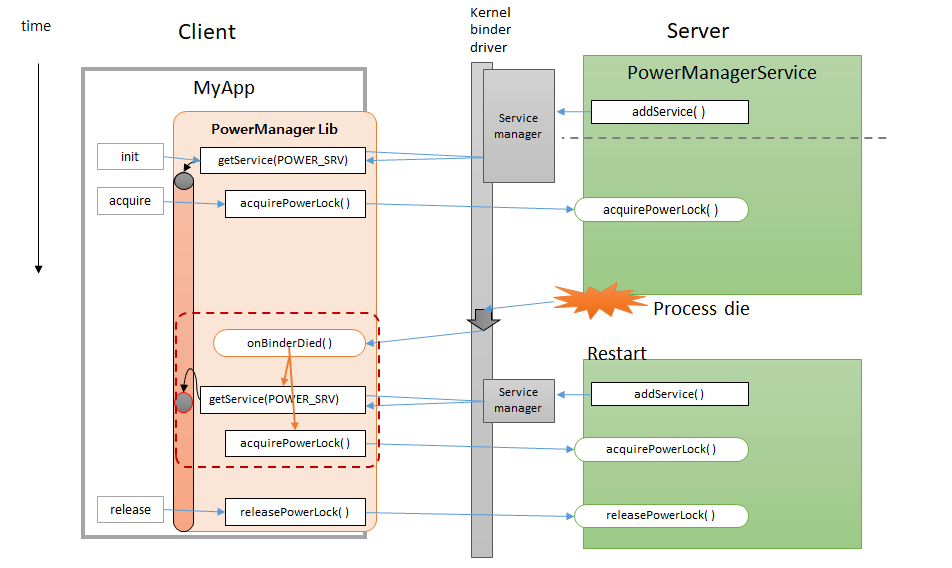
Image reference: doc_image_009.png

Figure 9 Service Manager’s purpose

Architecture Design Proposal

To address the problem was described in 2.1 Overall Descriptions, I propose 2 architectures below:

Communication Common Library Architecture

Process Communication manager

After describe detail about the concept design of each design, I will clarify the pros and cons points of each design before summary the result.

Communication Common Library Architecture

 Concept

This proposal base on the idea of group all the libraries that using to communicate to one big group. The goal is to reduce the library that all processes have requirement to communicate with other process in Telematics system. In doing so, we need to create a very big library that have responding to communicate between process and all Applications should have this Very Big Common Library. It is also assumed that all aspects of this project have the ability to communicate together in the way the designer is expecting.

Image reference: doc_image_010.png

Figure 10 Common Lib Concept

Concern point:

In order to communicate between App – Services, Service – Services, the data structure that process using to communicate is different, so all the process need to implement the Data that it want to send in the library interface.

The Death Notification is different depending on Services so all Service need to define its Death Notification in the library.

High Level Design

Figure 11, the Common lib comprise 2 different paths below:

Common Library source file

Contain the Application/Service interface, each Application/Service have different interface in Common Communication Lib.

Common Library Static Lib

Contain the implementation relate to communication:

Send message

Receive message

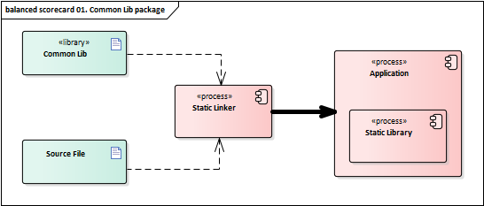
Image reference: doc_image_011.png

Figure 11 Common lib components

All the process in the system need to integrate the common lib to handle the communication:

Image reference: doc_image_012.png

Figure 12 Common Lib’s "internal" Component Diagram

Below sequence diagram will describe how an application send a message to NGTP via Common library. Because we have merged all library to one, so we need to define the target in the message.

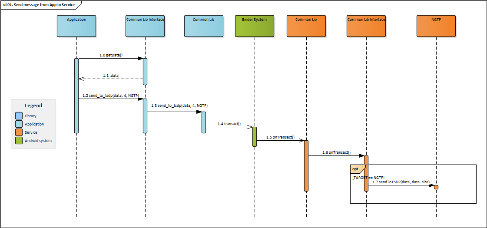
Image reference: doc_image_013.png

Figure 13  Send message from App to Service

The Application prepare the data to send message to NGTP

The Common lib that import in Application will handle the message then send it via IPC system

The Common lib that import in NGTP will receives the message

3.a. If the message contain TARGET == NGTP, send it to NGTP

Evaluate

## Table
| Criteria | Evaluate | Evaluate point |
| --- | --- | --- |
| Files | The common lib will be have numerous of files, as the concern points in 3.1.1 Concept, there a lot specific implement of each Service in the Common Library so it is very hard to reduce the File/ Line of code. | 2/10 |
| Error Handling | In my point of view, this architecture will be not easy to handle the error due to the size of Common Lib. Anyway, the purpose of Common Lib is simply to communicate so when it is stable, there is not much error that we need to handle. | 5/10 |
| Interfaces | The number of interface depend on how many services/apps need create data and API to call. Controlling interface also quite complicated due to number of generated interface. | 5/10 |
| Performance | The system performance may reduce due to the number of library that each Application need to import. Anyway, because the Common Library is quite big so it is not significant. | 5/10 |
| Reliability | The mechanism used to communicate still hasn’t changed. However, the common lib seems will be quite risky due to all the processes must to import this lib. | 5/10 |
| Maintainability | Very little maintenance should be required for this setup. An initial configuration will be the only system-required interaction after the system is put together. | 8/10 |
| Extensibility | Because we group all implementations to Common lib, it will be very easy to extensibility. Anyway, because the number of interface is quite big so this problem also reduce the extensibility a litter bit. | 7/10 |
| Portability | This system don’t have the ability that because the library depend on the business of process that using it. | 0/10 |
| Tiger 3.0 compatibility | The Common library is suitable for Tiger 3.0. The Service just need to add new Interface class then Common library will communicate with legacy interface class via it. | 10/10 |

Table 2 Evaluate of Common Lib Architecture

Process Communication Manager Architecture

Concept

This proposal is based on the idea of grouping all the libraries used for communication into one comprehensive entity. Since there are numerous data structures and APIs that this system needs to manage, the PCM (Process Communication Manager) will establish a new process responsible for handling messages before they are sent to their intended targets via system IPC (Inter-Process Communication). The library has a lot of duplicated implementations for IPC, so the PCM will help reduce a lot of redundant files and lines of code.

All the process in the system need to integrate the common lib to receive the message from PCM:

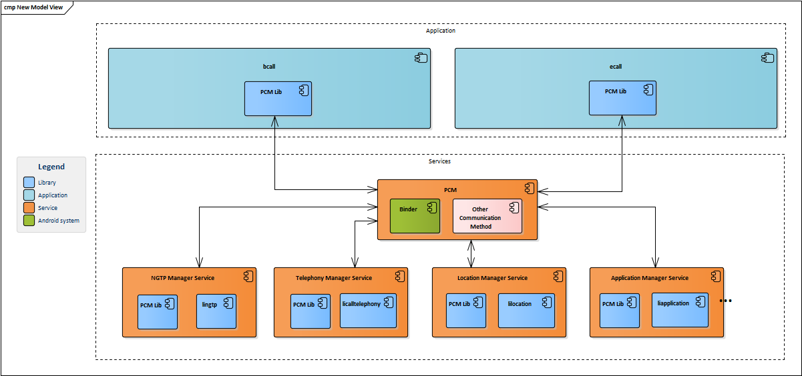
Image reference: doc_image_014.png

Figure 14 PCM’s "internal" Component Diagram

## Table
| Connector : from | Connector : to | Description | Note |
| --- | --- | --- | --- |
| App | Service | In case a process want to communicate with other process, it just need to import PCM lib. The PCM process will coordinate the message to right target. |  |
| App | App | In case a process want to communicate with other process, it just need to import PCM lib. The PCM process will coordinate the message to right target. |  |
| Service1 | Service2 | In case a process want to communicate with other process, it just need to import PCM lib. The PCM process will coordinate the message to right target. |  |

Table 3 Connection in PCM Architecture

Concern point:

Latency may be delayed because all message handling was processed via PCM

Because all the processes in system use PCM, we must make sure that the PCM should be start fast and soon to help al process can communicate all time

If PCM dead/stuck, all processed in system will be impact

High Level Design

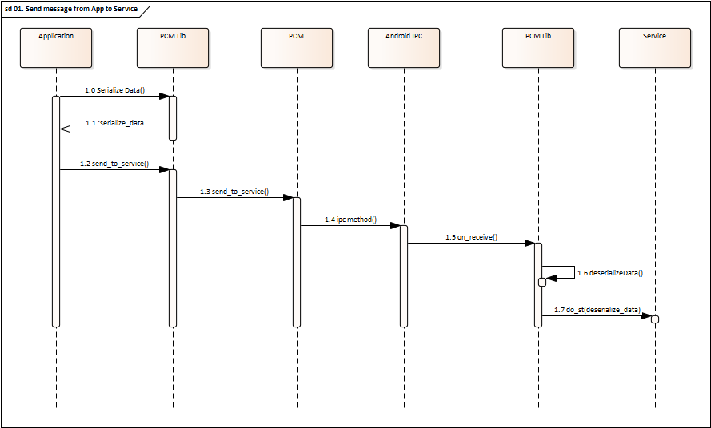
Image reference: doc_image_015.png

Figure 15 App send message to Service via PCM

App serialize data then send data to PCM via PCM library

The PCM check the target then send message to service via the PCM library

The PCM library desterilize data then send message to Service

Evaluate

## Table
| Criteria | Evaluate | Evaluate point |
| --- | --- | --- |
| Files | In the VDC project, an interface need about 1300 line of code for the Service lib: Header: Source: With the PCM implementation, we can reduce the source code based on the number of processes needed to implement the communication methods. This approach will be particularly beneficial as we extend the project. | 8/10 |
| Error Handling | Error handling will be simpler than before with the new approach. Communication permissions will be divided into three distinct parts, each with clearly defined permissions. When implementing new features in the communication method, it will be easier to control errors. | 7/10 |
| Interfaces | Number of interface will be reduce due to merge the all other service interface into PCM interface. | 6/10 |
| Performance | By reducing the number of redundant libraries and eliminating duplicated functions during the implementation of communication methods, PCM can significantly enhance system performance. | 8/10 |
| Reliability | PCM will implement the mechanism to retry in case the message cannot send to the receiver and response to the sender the result. Anyway, it will be have some potential issue if the PCM process is crashed. The Developer needs to be very careful when implementing PCM features. | 7/10 |
| Maintainability | When the feature is completed, Very little maintenance should be required for this system. | 7/10 |
| Extensibility | Extending the communication method will be notably straightforward. In the context of VDC, incorporating a new communication method presently necessitates updating the source code across all Services. This process, however, mandates altering the application's API, thereby rendering the assessment of the effort required for the modification considerably intricate. | 9/10 |
| Portability | The API is simpler and the Data is Serialize then the PCM is suitable for Portability. | 6/10 |
| Tiger 3.0 compatibility | Due to the app need to include the Service Manager class, it seems the PCM is not suitable with Tiger 3.0 concept. Anyway, by implement a simple version of Service Manager in PCM, the Tiger 3.0 is reluctant acceptance. | 5/10 |

Table 4 PCM evaluate

Proposal Comparison Summary

Analyze

Below chart is based on the evaluation of each proposal design that describe in 3.1 and 3.2:

Figure 16 Compare Architecture Design Proposal

As the evaluation in both 3.1 and 3.2, we can easily see that the PCM has a lot of remarkable advantages over Common lib.

There are some main remarkable advantages that I decided to apply PCM in a Telematics project:

1. The PCM is easier to extend and maintain than Common Lib

The main difference point between PCM and Common Lib is PCM will include a specific process to handle the message. In doing so, when there are some new requirements, The PCM will be easier to extend because the process doesn’t impact to the source code of all processes. Anyway, to guarantee that the PCM adapts the Extensibility, it also need a correct design (The detailed design of PCM is described in path 4).

Because device to library and service, it will help the Engineer more easy to maintain and debug. The Common Lib impact to all processes so it will be very dangerous if some exception is occurred.

2. The PCM will make the system more fast when start

I have make a test the reduce time when remove the library of SVT process:

Before:

## Table
| 09-13 09:42:36.775 1898 1898 E Leopard : launchApp(svt) 09-13 09:42:37.597 993 1532 V AppManager: handleReadyToRun, svt |
| --- |

After:

## Table
| 09-15 04:41:52.247 1919 1919 E Leopard : launchApp(svt) 09-15 04:41:52.959 999 1552 V AppManager: handleReadyToRun, svt |
| --- |

This measurement may vary in the other test, but the difference is not significant. It is observed that after removing approximately 7 libraries, the variance in start time is around 120 milliseconds. While this data may not appear substantial on its own, when applied to a larger system with numerous processes, the impact on overall performance becomes more pronounced.

The Common Lib also reduces the number of imported libraries, but it is relatively heavy in terms of size. As a result, incorporating the Common Lib is unlikely to enhance system performance

3. Help Engineer easier to implement new Service

During my time working on the VCM/TCUA project (a new EVA3 project), engineers in my team had to dedicate significant time to researching how Binder works in this system:

The layer architecture in Binder Android

How parcel work

How to Bn and BP classes work in the system

…

We often encountered challenging issues, such as cases where the message from a service was too large for Binder's limited bandwidth of 1MB. In real vehicle scenarios, this would result in an out-of-bandwidth exception. As a workaround, we had to update the data to a file and then notify the other processes when the update was completed.

These difficulties highlighted the need for new engineers to tackle various challenges without the assistance of legacy processes that could help us avoid similar issues in the future. By introducing a concept similar to PCM, I believe we can address this problem by creating a dedicated process solely responsible for handling interprocess communication. This approach would allow us to extend the new method without duplicating efforts.

 4. Tiger 3.0 compatibility

For Tiger 3.0, the communication between applications doesn't have an impact, as it simply changes from using the "sendPost" method via the Application Manager to another API of PCM. However, the communication method between applications and services has changed. There are now two methods available:

App -> Service Manager -> Legacy Interface -> Service

App -> Legacy Interface -> Service

The Legacy Interface refers to the older method of communication with services that was introduced in Tiger 2.0. Using these two methods of communication conflicts with PCM because PCM defines a specific method of communication, and services are not required to implement its library.

Nevertheless, it is possible to consider both of the above methods as legacy methods. This means that the PCM library will contain the Service Manager -> Legacy Interface and it will be referred to as Legacy Communication.

The flow, once implemented, will be as follows:

App -> PCM -> Service

App -> PCM -> Legacy Communication -> Service

However, it should be noted that implementing the legacy library in this way not only retains the system's performance but also slightly reduces it compared to before (by keep the old service library). Therefore, if we decide to keep the legacy library, we need to consider the tradeoff of potentially losing the performance advantages offered by PCM.

Conclude

It is evident that PCM has both advantages and disadvantages. However, the advantages related to extensibility, maintainability, and performance make it a suitable choice for implementing PCM in a Telematics project.

Considering that PCM represents a significant change and is responsible for handling a crucial aspect of the system, it requires a meticulous and careful implementation process. Therefore, a strict design approach is necessary.

Path 4 will provide a detailed design description and explain specific algorithms related to PCM.

Architecture of Process Communication Manager

Overview

The purpose of the Process Communication Manager (PCM) is to facilitate seamless communication among various Services and Applications. The idea for PCM originated during my involvement in the VDC project. In an attempt to transmit messages asynchronously via the binder, I encountered a challenge: Because the Binder process is embedded within the Service library, we can implement it by updating an argument to the binder but we need to update in the library and all the Applications using this API. The problem is to understand how to change the parameter, I also need to investigate in deep about how Binder works which demands a comprehensive understanding of the Binder mechanism. It means whenever an Application/Service wants to apply this change, it also needs some certain effort to investigate it.

Evaluating the Modifiability Quality Attribute, effecting changes to the communication method across numerous services proved intricate and time-consuming. Furthermore, introducing alternative communication methods, such as shared memory, posed similar complexities, undermining the Extensibility Quality Attribute. Addressing the Performance aspect, a multitude of Applications had to import duplicated libraries, consequently impacting app launch speed.

There are 3 main features of PCM that will be described in this path:

How PCM handle all messages via IPC:

Using Binder

Using Share memory (additional method)

How PCM sends onBinderDied to Application when the Service was died

How App use Service Manager (relate to Tiger 3.0 new concept) from PCM

This is the software architectural design of the system that PCM work in:

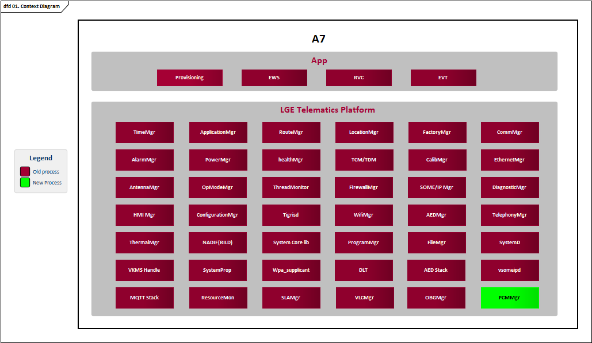
Image reference: doc_image_016.png

Figure 17   System Context Diagram

Concern point treatment

Latency may be delayed because all messages handling was processed via PCM

Related to the issue that the PCM must handle many messages of the system, this concept may lead to the message having latency.

To address this problem, two proposals are suggested as solutions:

Proposal 1: Create a fixed number of message queues based on the number of Applications/Services in the system. In order to determine the appropriate number of message queues, it is necessary to calculate the total number of messages in the system. This statistical information can then be used to define the number of message queues required.

Proposal 2: Implement a message queue limit while also incorporating a thread pool to efficiently manage the task of handling the message queues. The number of working threads within the thread pool would be dynamically determined based on the current number of messages in the system. This approach ensures that the system can handle the workload effectively by allocating an appropriate number of threads to process the messages.

Each solution have its pros and cons points, I’m going to describe the implementation and analyze pros and cons point of each solution in bellow:

Create fix number of message queue depend on the number of Applications/Service in system

In the system described in section 1.1 Purpose, there are a total of 46 services and 5 applications. In my perspective, it would be optimal to allocate approximately 1 message queue for every 10-15 processes. As a result, in the PCM (Process Control Module), we would need approximately 5 message queues to facilitate effective communication. Furthermore, it is essential to have a dedicated handler class for each message queue, which operates in a separate thread. This ensures that the handlers continuously listen for incoming messages within the queue using a while-true method.

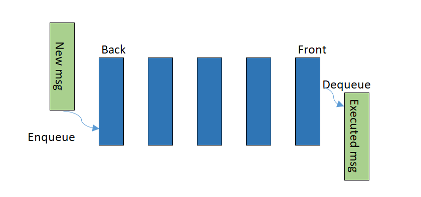
Image reference: doc_image_017.png

Figure 17 Message queue in PCM

The concept off message queue is Data messages added to a queue are stored and held to be processed later. As a result, adding messages to the queue is completely decoupled from subscribers wishing to take messages off the queue. If subscribers cannot keep up, the queue simply grows and the PCM is given some breathing room and as much time as they need to catch up.

These is a Manager class that help PCM control the message queue, this class will have some functions:

Dispatch the message to the suitable queue (base on the number of message in each queue)

Control a timer that will handle exception case (like stuck queue)

Detailed Implementation

Basically, the Message queue in the PCM will be implemented as below diagram:

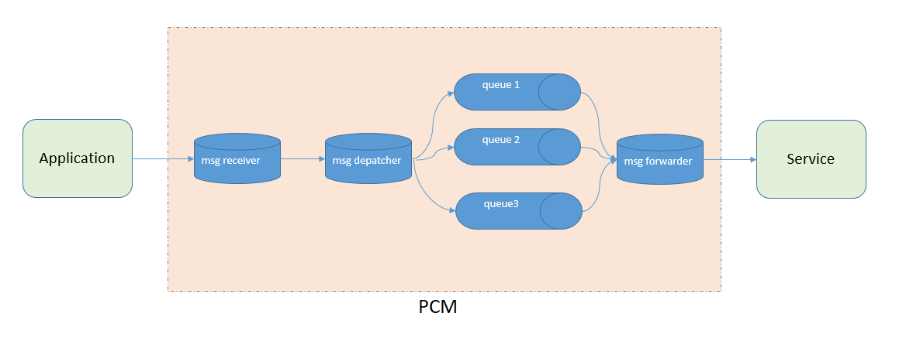
Image reference: doc_image_018.png

In each queue, we have a while true loop to handle the message (which a condition variable to make sure the performance of system). Whenever PCM receiver a message, the Message Despatcher object will send the class to the suitable queue and handle the message in another thread. The handle message will contains some bellow job:

Read the message variable to detect the target process

Serialize/Deserialize if needed

Create thread pool to handle the message

To make sure the PCM have enough the thread to handle all messages of the system, I proposal we will create 10 threads for PCM to handle the message. Because the execution of tasks in each will be sleep when it doesn’t have the task (by implement condition variable) so this will be safe for CPU. However, because the number of thread is limited in the system, so the number of thread also need to carefully consider in the real system (because it depend on the hardware and the business of each system).

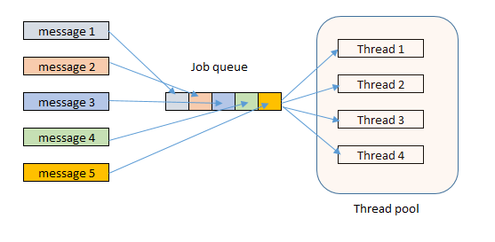
Image reference: doc_image_019.png

Figure 18 Thread Pool in PCM

Advantage will be you can save thread creation overhead each time new task has to be executed and each task can be executed parallel.

Detailed Implementation

Basically, the Thread pool in the PCM will be implemented as below diagram:

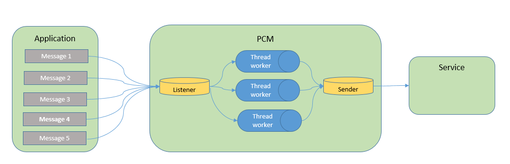
Image reference: doc_image_020.png

Each request message is represented by an object of the Task class. The Task class essentially encapsulates a function pointer that points to the actual function defining the task. As a class, Task also provides a functor-based interface to invoke the function pointer stored within it.

The ThreadPool class manages the actual thread pool. It maintains a vector of threads, a queue to store tasks (instances of the Task class), methods to enqueue incoming tasks and execute them in separate threads. Additionally, there are helper methods to initialize the pool, destroy it, and perform necessary clean-up operations.

Conclude

## Table
|  | Message queue | Thread pool |
| --- | --- | --- |
| Performance | The message queue is fix some when implement message queue, sometime we will met the delay message due to the message consumer need to wait for the top message in the queue | The Thread pool is more flexible to handle message, by controller message as a list jobs, it will have better performance due to dynamics to increate thread to handle message |
| Maintainability/Extensibility | When have other kind of the message need to implement, the message queue will more complicated to implement | By control the message job, it not depend in any specific container like message queue. We also can design more polymorphism for message data in PCM to more easy to maintain as well as extend program in future |
| Complexity | Implement message queue will more simple than thread pool | There is some complicated points to implement the thread pool. We need some deep understanding about thread, data race and race condition. |

 The thread pool is more complicated than message queue. However, consider in some other advantage of Thread Pool, it will me better than Message when using to handle the message in PCM.

PCM starting time

The PCM need to start very soon. To make PCM start, I also proposal 2 solutions:

Run PCM via systemd and set the highest priority for it

Fork PCM process whenever the system init another process

Each solution have its pros and cons points, I’m going to describe the implementation and analyze pros and cons point of each solution in bellow:

Run PCM via systemD and set the highest priority for it

The Engineer need config in the system to start PCM system via the systemD with highest priority to make sure that PCM process will be started first.

Fork PCM process whenever the system initialize another process

In the PCM library, we add a logic to alow that the process that intergrate this library can fork the PCM process. It also contains the condition to make sure that only PCM just start 1 time.

Conclude

The solution starting via systemD seems more safety and more easy to implement. Initialize via systemD also help Engineer easier to control the case that PCM crash (restart it).

PCM dead/stuck

The Telematics has a watch doc mechanism in case any process was stuck (occurred some exemption like dead lock in main thread). In this case, the system will kill the PCM process then restart it immediate.

In case PCM dead, all processes that have resisted to PCM will receive a binderDied notify, in this case, all process need implement a logic to pending the sending message send re-send when PCM alive again.

Data Design

## Table
| Type | Name | Description | Remark |
| --- | --- | --- | --- |
| enum | APP_NAME | Enum APP_NAME { NGTP_SERVICE = 0, TELEPHONE_SERVICE, LOCATION_SERVICE, APPLICATION_SERVICE, … ECALL_APP, BCALL_APP, PROVISIONING_APP, … } | SERVICE value: 0 – 255 App value: 256 - 512 |
| Structure | PCM_DATA | Struct PCM_DATA{ APP_NAME from; APP_NAME to; SerializeData data; } |  |
| Structure | SerializeData |  |  |
| Define | SHARE_MEM_NAME | Ex: ‘/dev/ashmem’ | Every Share memory area will have a unique name. |

Table 5 Data Design

External Design

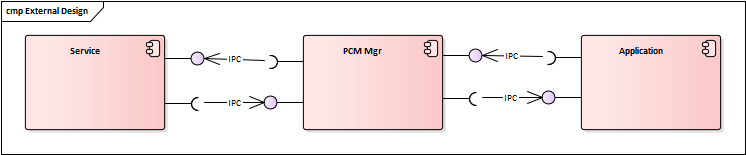
Image reference: doc_image_021.png

		Figure 19 PCM External Design

The PCM only communicate with Services and Applications via Android IPC.

Internal Design

Static Design

The PCM will be divided into two main paths:

The Process Communication Manager Service: This will be used to handle all messages of the module that include in the blue scope of figure 1, functioning as a dispatcher that sends messages to the intended targets.

The Process Communication Library: This library will implement the reception and transmission of messages through Android IPC

The Process Communication Manager Service is implemented through the utilization of the Mediator Pattern. Within this pattern, a central class known as PCManagerServiceController takes the lead. This class not only manages the logic of the services but also orchestrates the passage of messages from the receiving class to the MessageProcessor. Another vital entity is the MessageProcessor class, tasked with serializing messages and subsequently managing their transmission and storage within a queue.

The Process Communication Library encompasses several classes responsible for message transmission and reception.

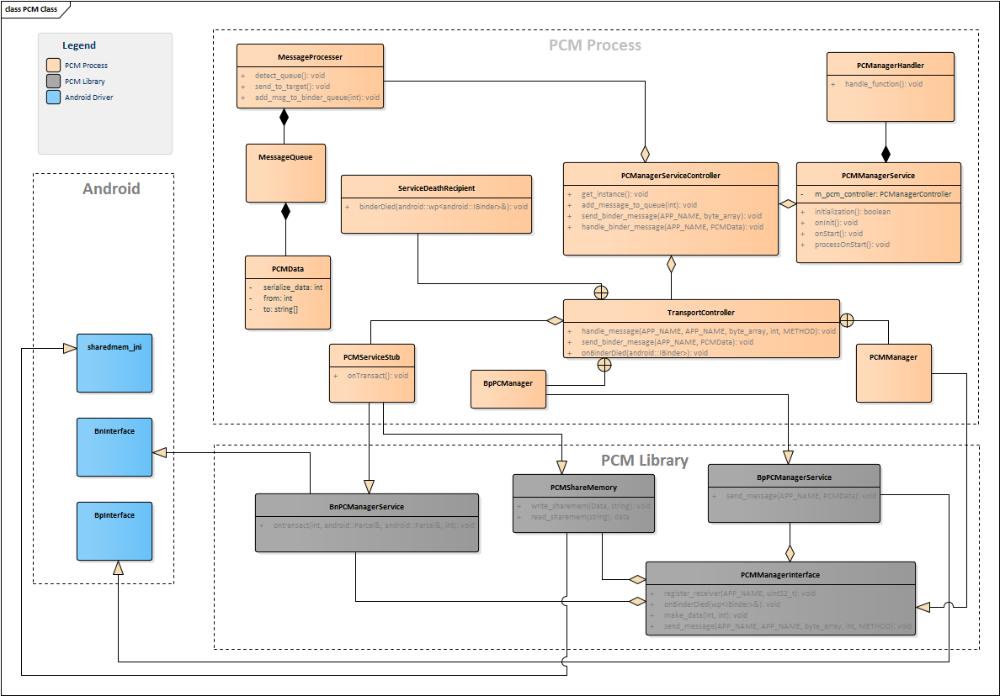
Image reference: doc_image_022.png

Figure 20 PCM Class Diagram

## Table
| Class | Descriptions |
| --- | --- |
| PCManagerServiceController | Controller all the logics of PC Manager Service. This class will be create as a Singleton class that help other easy to get instance. |
| PCMManagerService | The Class that handle start/stop of process as well as initialize other Objects in PC Manager Service. |
| MessageProcesser | Process all logic relate to the PCM Message. |
| MessageQueue | Create queue to storage the message. |
| PCMServiceStub | Receive message from other app/service via Android API. |
| PCMManagerInterface | This class is implemented in PCM library. The is main class that all Processes using to communicate together: Send message Register Receiver Notify Binder Died to register Application |
| TransportController | Get all Interface Services Register to Notify Binder Died Distribute the message to Library Control logic to register to Service from app and vice versa |

Table 5 Classes that PC Manager Service component consists of

Dynamic Design

State Design

The state of PCM only depend on System Power Mode:

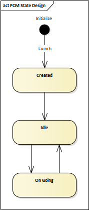
Image reference: doc_image_023.png

Figure 21 PCM State Design

Create: The State that the PCM was created

Idle: The PCM will be sleep due to system sleep

On Going: The PCM will resume after sleep

Below is the table describe how PCM change state base on System Power Mode

## Table
| After Before | OFF Mode | ON mode | Low Power Mode |
| --- | --- | --- | --- |
| OFF Mode | … | Create | Idle |
| ON mode | Exit app | … | Idle |
| Low Power Mode | Exit app | On Going | … |

Table 6 PCM State

Interaction Design

Send message via PCM using Binder

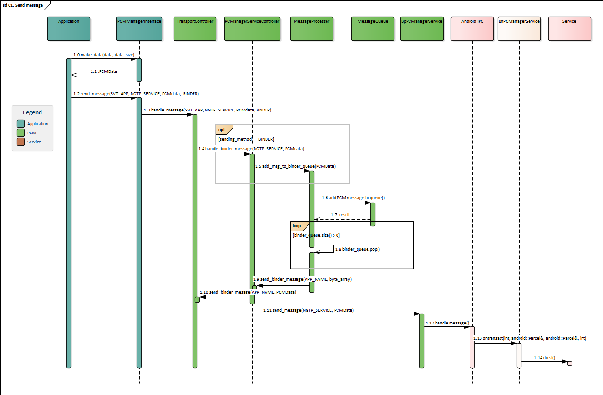
Image reference: doc_image_024.png

Figure 22 Send message via PCM

Above figure describes about how SVT send the data to NGTP via PCM

1. The SVT must serialize message to PCM data before send data to PCM (the PCM will provide make_data method that help Application serialize data)

2. The SVT send data via send_message method from PCMManagerInterface (this class is created in PCM library)

3. The PCM receives the request then send it to Transport Controller

3. a. If the method is BINDER, the Tranport Controller call to handle_binder_message function of MessageProcesser Object

	3.a.1. MessageProcesser add the binder message to binder queue

	     3.a.1.a. in case the binder queue have size bigger than 1, the MessageProcesser detect the top message then send it to PCMManagerServiceController via send_binder_message method

               3.a.1.a.1. The PCMManagerServiceController continue to send data via send_binder_method of TransportController

	        3.a.1.a.2. The TransportController send data via BPPCMManagerService, in this Object, the send_message will using transact API of Android system to send message to NGTP Service

        4. The Android IPC Binder system receiver the message then pass the message to the Service (Identifying senders to receivers via UID/PID).

Share Memory via PCM

Because the Share memory has some risk when use so the system should define specific rule when using this system:

Only the Service can modify the shared memory

The Application only reads the shared memory when received the notification a message that the data is safe for read

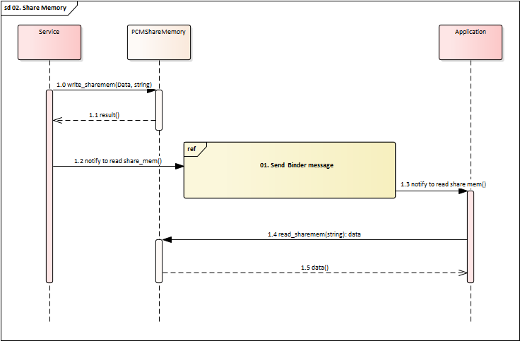
Image reference: doc_image_025.png

Figure 23 Share memory via PCM

The Service update the data via PCMShareMemory

The Service send a message via Binder to Application to Notify that the data was finished wrote

The Application call read_sharemem from PCMShareMemory to read the data then excute it’s business flow

PCM sends onBinderDied to Application when the Service was died

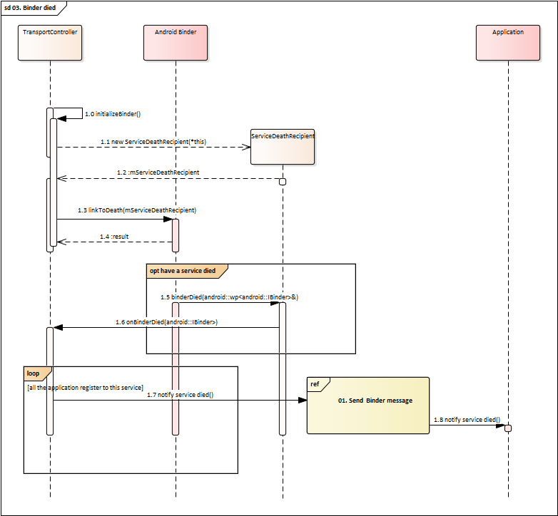
Image reference: doc_image_026.png

Figure 24 Notify binder died to resisted Application

1. In initialize function of Transport Controller, it will linkToDeath all the Service Interface

2. When have a Service died, it will send the Notify to the Service via ServiceDeathRecipent

3. PCM forward this information for all Application that register to this service

Algorithm Design

In order to reduce the API that PCM need to created, the data that all processes communicate together should be serialize in the parameter. After the target receives the message, the PCM library will provide an API to Deserialize data and the App/Service can use this data.

Serialize Data and Deserialize Data

Because PCM transfers various types of data, creating an API and maintaining data structure in arguments can become quite complex. As a result, it is necessary to serialize the data from the data class into a byte array and then deserialize it after the target receives the data. We also have some library to support this task such as protobuf Serialization in boots library.

Below is the simple way to understand how the PCM Serialize and Deserialize the data:

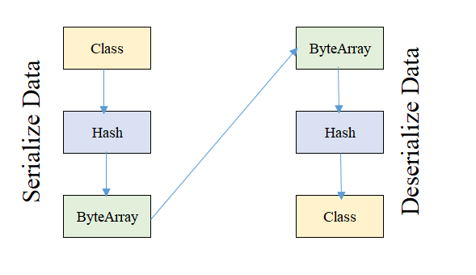
Image reference: doc_image_027.png

Figure 25 Serialize & Deserialize data

The PCM will implement this method in the library to facilitate the convenient serialization and deserialization execution for the App/Service.
