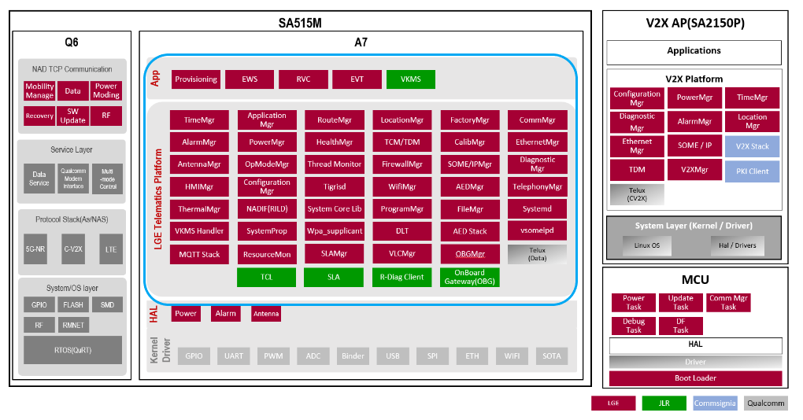
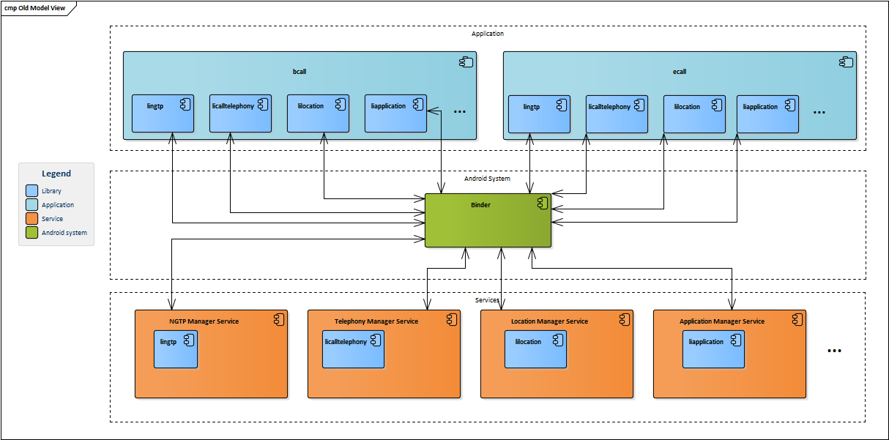
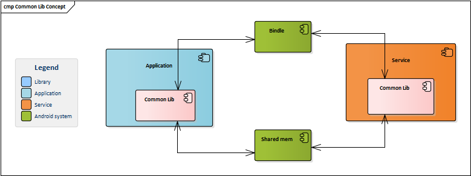
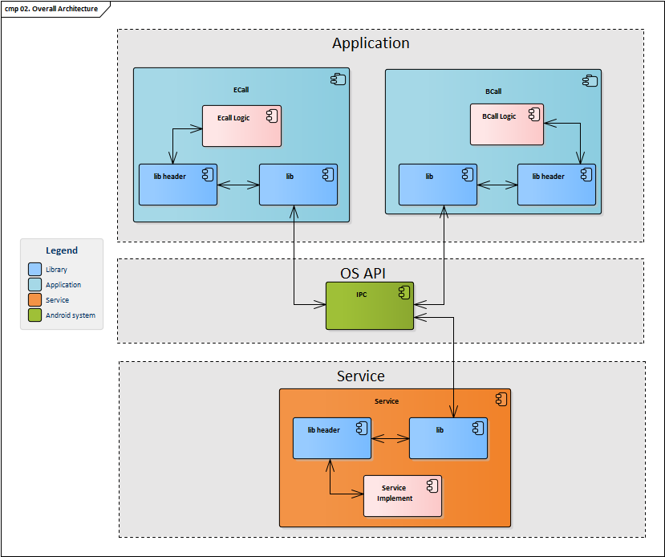
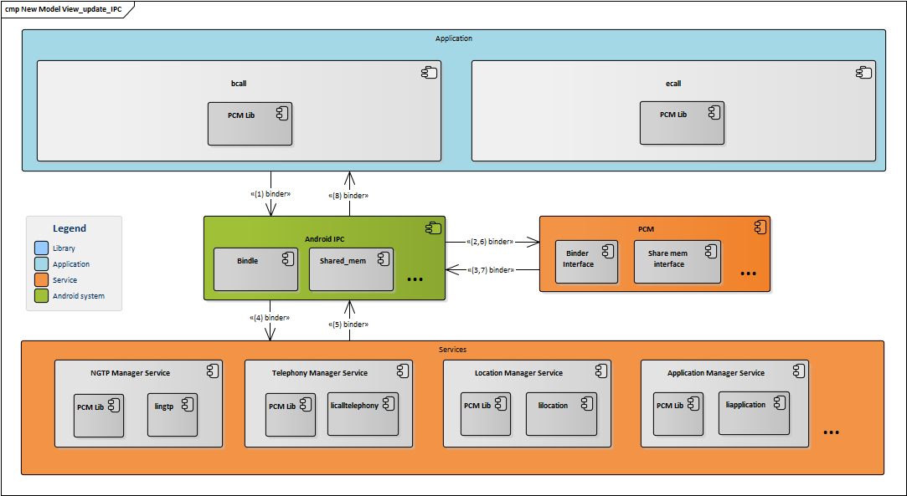

# Raw Slide Content

- Source file: Process_Communication_Manager_Architecture_final[1].pptx
- Total slides: 18

## Slide 1

Image reference: slide_01_image_01.png

FA 인증과제
Process Communication Manager

Table of contents

1. Problem Identification
2. Task Objectives
3. Architecture Design Proposals
4. Architectural Analysis
5. Architectural Decision
6. Detailed Architecture Design

LGE Internal Use Only

Phan Hoang Hai

CSU Unit – Application team

Supervised by 남궁준 joon.namkoong

## Slide 2

LGE Internal Use Only

1. Problem Identification

The current project:
Technical:
C++ 11
Tiger 2.0
Android OS

2

Image reference: slide_02_image_01.png

## Slide 3

BCall

LGE Internal Use Only

1. Problem Identification

Applications communicate with Services

3

Services

ECall

NGTP Manager Service

NGTP Lib

NGTP Lib

Tele Manager Service

Tele Lib

Tele Lib

Location Manager Service

Location Lib

Location Lib

Binder

Location Lib

NGTP Lib

Tele Lib

## Slide 4

LGE Internal Use Only

1. Problem Identification

Application communicate with another Application

4

Application 1

Application 2

Binder

Application1 Lib

Application2 Lib

Application Manager Lib

Application Manager Lib

Application Manager Service

Application Manager Lib

## Slide 5

LGE Internal Use Only

1. Problem Identification

Current Architecture Design Problems:

5

Image reference: slide_05_image_01.png

All the new services also need to implement the library to enable the application to communicate with it. (it doesn't adapt reusable).
It is difficult to modify the IPC behavior, such as transitioning Binder from asynchronous to synchronous.
There are a lot of same libraries that Applications need to import (increase the starting time)
There is only Binder method to communicate (This IPC method has some limitations such as the Binder Banwidth limit is 1MB)

## Slide 6

LGE Internal Use Only

1. Problem Identification

An issue that I faced when working in TCUA:
Problem:
The size of Json Data is 16KB
The bandwidth of Binder is limited to 1MB, which means that a data size of 16KB is not allowed. In real vehicle scenarios, where the number of messages is significant, this message size could potentially lead to the occurrence of a TransactionTooLargeException.
Current solution:
Provisioning save the data to Json file then notify to Config Manager after finished it.
Problem:
The speed of writing files is very slow, so when the system encounters similar messages, the latency logic will be significantly impacted
Solution:
Create shared_memory area between OBGManager – Provisioning – Config Manager

6

VCDP

OBG Manager

Provisioning

Config Manager

Json Data

Json Data

Json Data

Json Data

SOME/IP

Binder

Binder

## Slide 7

LGE Internal Use Only

2. Task Objectives

Engineers do not need to duplicate efforts when implementing common behaviors of IPC.
It would be more convenient to implement new communication methods in the system.
Minimize the duplicated effort required to implement the same communication method between processes.
New engineers can implement new services without needing to be concerned about complex behaviors.
Improve the initial performance by minimizing the duplication of integrated libraries

7

## Slide 8

LGE Internal Use Only

3. Architecture Design Proposals

Proposal 1: Communication Common Library
This proposal is based on the idea of grouping all the libraries that are used to communicate to one big group
Goal:
Minimize the library that is required for inter-process communication in the Telematics system
Reduce the duplicated implementation.
Group the communicate methods to 1 library

8

Image reference: slide_08_image_01.png

## Slide 9

LGE Internal Use Only

3. Architecture Design Proposals

Proposal 1: Communication Common Library
Pros
Reduce the number of integrated libraries.
Minimize the duplicated implementation for Binder.
Standardize the communication behavior.
Make implementation in Tiger 3.0 easier.
Cons
The size of the common library is very large.
It is difficult to reuse in other projects.
There is a high risk of issues arising as all processes must import this library.

9

Image reference: slide_09_image_01.png

## Slide 10

LGE Internal Use Only

3. Architecture Design Proposals

Proposal 2: Process Communication Manager (PCM)
The proposal is based on the concept of consolidating all communication libraries into a single comprehensive entity
The PCM Contain 2 main parts:
PCM Library: Provide the API to all processes
PCM Process: Handle dispatch the message
Goal:
Minimize the library requirements for inter-process communication in the Telematics system.
Develop a streamlined process for handling system messages.
Reduce duplicated implementations.
Design a system that is easily reusable in other projects.

10

## Slide 11

Image reference: slide_11_image_01.png

LGE Internal Use Only

3. Architecture Design Proposals

Proposal 2: Process Communication Manager (PCM)
Pros:
Reduce the number of integrated libraries.
Enable reusability in other projects.
Improve the initial performance of all processes.
Mitigate the risk in case of issues.
Cons:
Less suitable for Tiger 3.0
The potential impact on all system processes if messages are not delivered on time.

11

## Slide 12

LGE Internal Use Only

4. Architectural Analysis

Files:
PCM can effectively reduce the amount of code in the system by eliminating duplicated implementations in the Service library. One of the key advantages is that as more processes are added to the system, the reduction in lines of code becomes even more significant.
The Common Lib does not significantly reduce the lines of code in the system. While it helps avoid duplicated implementation, there are still numerous specific implementations of each service that need to be updated.
Error Handling:
The PCM is designed based on two specific paths, which facilitate convenient analysis of the implementation path that causes an error. Engineers can easily detect the process responsible for the error, making it easier to handle and address the issue.
The Common Lib becomes more complicated as all processes need to be implemented within the same library. It also poses a challenge for engineers to identify the specific process causing an issue.

12

## Slide 13

LGE Internal Use Only

4. Architectural Analysis

Performance
For PCM, this variance will be a significant value when the system has a lot of process
The Common lib is not improve the performance due to the size of lib also increasing by number of processes.
The Common Lib does not have the overhead of a separate process, so for a small system, it will deliver better performance.

13

09-13 09:42:36.775 1898 1898 E Leopard : launchApp(svt)
09-13 09:42:37.597 993 1532 V AppManager: handleReadyToRun, svt

09-15 04:41:52.247 1919 1919 E Leopard : launchApp(svt)
09-15 04:41:52.959 999 1552 V AppManager: handleReadyToRun, svt

822ms

712ms

SVT Application

llingtp

lngtpsvc

licanmanager

lipower

linetwork

litelephonyregistry

limobilenetwork

…

~100ms / 7 libs

## Slide 14

### Table
| Maintainability & Extensibility | Non function requirement |  | PCM | Common Lib |
|  | Stability | Functional Isolation | Normal | Low |
|  |  | Rationale Preservability | High | Normal |
|  | Analyzability | Comprehensibility | Normal | Normal |
|  |  | Traceability | Normal | Low |
|  | Changeability | Modifiability | High | Normal |
|  |  | Extensibility | High | Normal |
|  |  | Portability | High | Very low |
|  | Testability | Impact Limitability | Normal | low |
|  |  | Observability | High | Normal |
|  |  | Controllability | Normal | Low |

PCM provides clearer functional isolation compared to the Common Lib. The handled messages and the interfaces used by processes in PCM are highly specific, resulting in a more distinct separation of functionalities. On the other hand, the Common Lib lacks strong functional isolation characteristics as it consolidates all features into a single library.

The Preservability characteristic of Rationale is based on the number of logic components and how we divide them into layers. PCM appears to be easier to preserve because in a large project, the Common Lib tends to contain a significant amount of specific logic. Nevertheless, when compared to the previous architecture, both PCM and Common Lib demonstrate improvements.

LGE Internal Use Only

4. Architectural Analysis

Maintainability & Extensibility

14

Both PCM and the Common Lib are not difficult to comprehend. Their adherence to a single responsibility allows engineers to easily trace the flow of code.

The PCM has a superior layer architecture compared to the Common Lib. The inclusion of specialized processes in PCM makes it easier for engineers to trace the logic flow.

Both PCM and Common Lib have become easier to modify compared to before because they group the communication methods into specific areas. However, modifying the Common Lib is more challenging than modifying PCM because it contains more specific implementations of each process.

Both PCM and Common Lib are easier to extend. PCM is particularly conventional because it ensures that all processes use the same IPC method through serialized messaging.

The Common Lib is not suitable for portability because it contains a lot of business-specific code. On the other hand, PCM encapsulates the business logic within its processes, making it more convenient to use in other projects..

PCM has better mechanisms for limiting the impact of other logic by dividing the program into separate layers to execute specific tasks. On the other hand, the Common Lib lacks effective mechanisms for minimizing the impact of different components.

Both PCM and Common Lib make it easier to observe the flow. PCM is particularly convenient for observing the flow because its processes can detect which process is being called. While the Common Lib also has this capability, it requires tracing the flow to the specific process handling the message, which can be more inconvenient.

For the same reason as observability, PCM is also more conducive to controlling the flow. This is because the interface only contains common business logic, while the business logic of each process is handled within the PCM process. Moreover, PCM incorporates mechanisms to minimize the inclusion of specific business logic as much as possible.

## Slide 15

LGE Internal Use Only

4. Architectural Analysis

Portability:
PCM is easy to easier to bring to other system due to some below character below:
The PCM process is common process and can work with all kind of message
PCM has API to serialize/deserialize message
The PCM process will help it more convention to modify in other system
On the contrary, the Common Lib cannot be easily integrated into other systems due to the extensive implementation of service-specific business logic within it.
Tiger 3.0 compatibility
The Common library is suitable for Tiger 3.0. The Service just need to add new Interface class then Common library will communicate with legacy interface class via it
PCM is quite hard to implement in Tiger 3.0. It can be implemented in an easy way in Tiger 3.0 by wrapping the Interface Legacy to PCM Legacy but it will lose the performance advantage.

15

## Slide 16

LGE Internal Use Only

5. Architectural Decision

The Common lib is more suitable with Tiger 3.0 than PCM
The Common Lib is more suitable for smaller projects with less complicated requirements.
In a more extensive project with some complicated requirements, PCM is far superior to Common lib, especially with some below characteristics:
Performance
Maintainability
Extensibility
Error handling
Considering that PCM represents a significant change and is responsible for handling a crucial aspect of the system, it requires a meticulous and careful implementation process. Therefore, a strict design approach is necessary.

16

## Slide 17

LGE Internal Use Only

6. Detailed Architecture Design

17

## Slide 18

Q&A

LGE Internal Use Only

18

Q&A

Thank you for listening!

