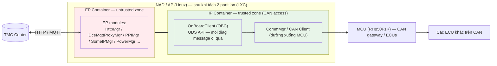
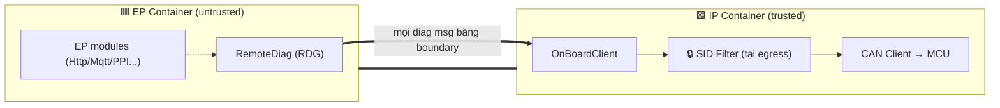
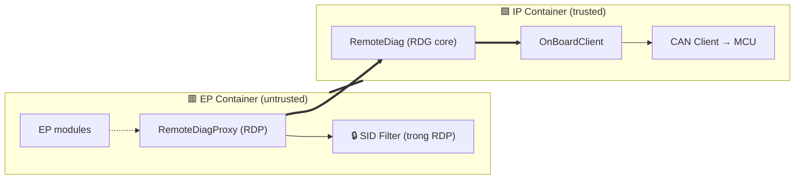
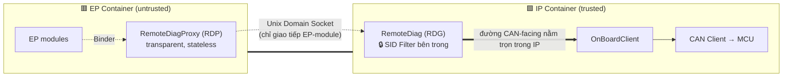
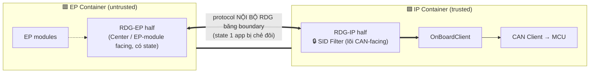
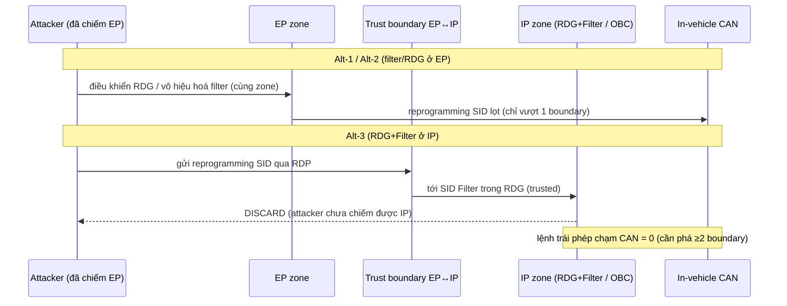

# Architecture Design Document: Vị trí đặt RemoteDiag và SID Filter trong kiến trúc EP/IP Partition

| Thuộc tính | Giá trị |
| --- | --- |
| Dự án | Toyota DCM 24LM (MPW ePF, 19PFv3KAI — 2DEX NAD 4G/5G) |
| Phạm vi tài liệu | Quyết định kiến trúc về **vị trí của RemoteDiag (RDG)** và **vị trí của SID Filter** trong mô hình hai partition EP/IP |
| Ngày lập | 2026-08-14 |
| Architectural driver | Yêu cầu Cybersecurity của TMC (multi-layer separation, chống lệnh diagnostic reprogramming trái phép) |
| Ràng buộc hệ thống (đã chốt) | (1) Tách AP thành 2 partition **EP** và **IP**, tech stack **LXC containerization**; (2) **Mọi diagnostic message phải đi qua OnBoardClient (OBC)** |
| Ngoài phạm vi | Đường xử lý SID36, resource quota giữa container, ràng buộc lịch (không nằm trong tài liệu này) |

---

## 1. Project Context

### 1.1 Tổng quan dự án

DCM (Data Communication Module) là telematics ECU của Toyota, gồm hai chip: **NAD/AP** (SA515M 5G / SA415M 4G, chạy Linux) và **MCU** (RH850F1K, AUTOSAR). Trên AP hiện chạy toàn bộ software stack telematics trong **một không gian tiến trình duy nhất** (single partition).

Hai thành phần trung tâm của tài liệu này:

- **RemoteDiagApplication (RDG)**: một Application phía NAD. Chức năng: (1) thực hiện xử lý diagnostic cho từng ECU dựa trên request từ Center; (2) upload dữ liệu diagnostic phát hiện trong xe lên Center. Trong kiến trúc hiện tại, RDG nằm trong nhóm **Regional Application** trên AP.
- **OnBoardClient (OBC)**: nằm trong **TMC Framework** phía NAD, cung cấp API hỗ trợ giao tiếp Diagnostics theo giao thức **UDS** giữa Application và CAN Client (đường xuống MCU/CAN).

Các module liên quan (đều trên AP hiện nay): **DiagMgr, CommMgr, HealthMgr, PowerMgr, AppMgr** (LGE Tiger Framework), **HttpMgr, DceMqttProxyMgr, PPIMgr** (TMC Framework).

### 1.2 Bối cảnh và động lực thay đổi

TMC đưa ra yêu cầu Cybersecurity (multi-layer separation — sheet D-1, 2-CYS-01-20): **AP phải được tách thành hai partition**:

- **EP (Entry Point) Partition**: chứa các thành phần tiếp xúc bên ngoài (Center qua HTTP/MQTT, SOME/IP, OTA) — **bề mặt tấn công lớn**, coi là *untrusted* khi bị compromise.
- **IP (Internal Partition)**: chứa các thành phần có quyền truy cập **in-vehicle CAN bus** — vùng *trusted*.

Quyết định ở mức system-level đã chốt: dùng **LXC containerization** để hiện thực hai partition (EP Container / IP Container). Tài liệu này **không** đặt lại câu hỏi "có nên tách hay không" (đã là ràng buộc) mà giải quyết bài toán **đặt RDG và SID Filter ở đâu** trong hai partition đó, sao cho tối ưu các quality attribute trọng yếu.

---

## 2. Problem to Solve

### 2.1 Mô tả bài toán

RDG hiện nằm ở nhóm Regional Application (sẽ thuộc phía EP nếu giữ nguyên vị trí), nhưng bản chất công việc của RDG là **hướng CAN**: xử lý UDS diagnostic cho từng ECU qua OBC → CAN. Đồng thời RDG cũng cần dữ liệu từ các module phía EP (Center communication, user consent...).

Khi AP bị chẻ đôi bởi trust boundary EP/IP, phát sinh câu hỏi kiến trúc:

1. **RDG nên nằm ở EP hay IP?** — RDG vừa cần nói chuyện với module EP, vừa cần đẩy UDS xuống CAN (phía IP). Đặt sai phía sẽ khiến luồng traffic chính phải băng qua trust boundary liên tục, và đặt lõi diagnostic vào vùng untrusted.
2. **SID Filter (chặn diagnostic command reprogramming trái phép) nên nằm ở EP hay IP?** — Filter là security control bảo vệ CAN. Đặt sai phía khiến kẻ tấn công chiếm EP có thể vô hiệu hóa chính filter.

### 2.2 Functional Requirements

| ID | Yêu cầu |
| --- | --- |
| FR-01 | RDG tiếp tục thực hiện diagnostic processing cho từng ECU dựa trên Center request và upload diagnostic data lên Center sau khi tách partition. |
| FR-02 | Mọi diagnostic message (Tx/Rx UDS) phải đi qua OBC (ràng buộc kiến trúc). |
| FR-03 | Hệ thống phải discard các diagnostic request thuộc nhóm reprogramming SID {0x10 programming session (0x02), 0x11, 0x28, 0x34, 0x85} đến từ nguồn không được phép. |

### 2.3 Quality Attributes (mục tiêu trọng yếu — có response measure)

Bốn QA dưới đây là tiêu chí phân định giữa các alternative. Mỗi QA viết dưới dạng scenario đo được (không mô tả giải pháp).

| ID | Quality Attribute | Scenario (Stimulus → Response) | Response Measure (ngưỡng đề xuất) |
| --- | --- | --- | --- |
| **QA-SEC** (driver) | Security – Resistance/Integrity | Khi **EP partition bị compromise** và mạo danh DIAG client, gửi reprogramming SID xuống CAN | Reprogramming SID {0x10(02),0x11,0x28,0x34,0x85} chạm in-vehicle CAN = **0** (chặn **100%** nhóm SID); số trust boundary độc lập attacker phải phá ≥ **2**; phát hiện tamper filter config = **100%** |
| **QA-PERF** | Performance efficiency | Một giao dịch diagnostic hướng CAN (Center/in-vehicle → ECU → response) trên đường traffic **chủ đạo** | Số lần băng **EP↔IP boundary** trên đường CAN-facing = **0** (ngưỡng chấp nhận ≤ 1); độ trễ transport nội AP thêm cho 1 UDS request nhỏ (ReadDID) **p95 ≤ 5 ms**; throughput đủ cho tần suất data-collection định kỳ |
| **QA-REL** | Reliability – Fault containment | Một tiến trình phía **EP** (bề mặt tấn công lớn, tần suất lỗi cao hơn) crash | Fault propagation qua boundary = **0**; phát hiện RDP chết (POLLHUP) **≤ 50 ms**; reconnect RDP **p95 ≤ 500 ms**; RDG core luôn ở trạng thái xác định |
| **QA-AVAIL** | Availability | (a) EP suy giảm/lỗi; (b) EP compromise cố đẩy lệnh phá ECU | (a) Chức năng in-vehicle diagnostic IP→CAN duy trì **100%** khi EP suy giảm (không phụ thuộc EP); (b) lệnh trái phép chạm CAN = **0** ⇒ availability điều khiển xe không bị hạ |

> Lưu ý phương pháp: bốn QA trên **không** ràng buộc giải pháp; chính response measure của chúng (đặc biệt "≥ 2 boundary" của QA-SEC và "0 lần băng boundary trên đường CAN-facing" của QA-PERF) sẽ **ép** ra vị trí đặt RDG và Filter ở các mục sau.
>
> **Ghi chú về ngưỡng số**: các giá trị trên là **mục tiêu đề xuất (proposed target)** làm cơ sở verify — cần đo thực nghiệm và stakeholder ratify; chưa có measured evidence tại thời điểm lập tài liệu.

### 2.4 System Context Diagram

Chú giải (legend): khối nền đỏ = untrusted (EP); khối nền xanh = trusted (IP); đường `===` = trust boundary EP↔IP; mũi tên = luồng dữ liệu. **Vị trí của RDG và SID Filter là ẩn số** — được quyết định ở mục 3–6.

---

## 3. Architecture Alternatives

Bốn alternative dưới đây cô lập lần lượt hai quyết định con:

- **Alt-1 vs Alt-3** làm nổi bật quyết định **vị trí RDG** (EP hay IP).
- **Alt-2 vs Alt-3** làm nổi bật quyết định **vị trí SID Filter** (EP hay IP).
- **Alt-4 vs Alt-3** làm nổi bật quyết định **giữ RDG nguyên khối** (trong IP) so với **chẻ đôi RDG** qua boundary — trục Reliability + Maintainability.

### 3.1 Alternative 1 — "Minimal move": giữ RDG ở EP, filter khi message xuống CAN

- **Ý tưởng**: thay đổi ít nhất. RDG **ở lại EP** (đúng vị trí Regional Application hiện tại). Vì OBC và CAN access buộc phải ở IP, ta chỉ thêm **SID Filter tại điểm message xuống CAN** (ở OBC/egress phía IP hoặc MCU gateway).
- **Đặc điểm**: RDG (EP) gọi OBC (IP) qua trust boundary cho **mọi** diagnostic message; filter nằm ở cửa ra CAN.

### 3.2 Alternative 2 — RDG vào IP + RemoteDiagProxy (RDP), nhưng filter đặt ở EP (RDP)

- **Ý tưởng**: chuyển **RDG vào IP**, tạo **RemoteDiagProxy (RDP)** ở EP làm transparent proxy để RDG nói chuyện với module EP; nhưng đặt **SID Filter trong RDP (EP)** để "chặn sớm ngay đầu vào EP".
- **Đặc điểm**: RDG core ở IP; RDP bắc cầu EP↔IP; filter ở phía untrusted.

### 3.3 Alternative 3 — (Đề xuất) RDG vào IP + RDP transparent, filter đặt bên trong RDG (IP)

- **Ý tưởng**: **RDG toàn phần trong IP**; **RDP** ở EP là transparent proxy (mọi module EP coi RDP như chính RDG thật); **SID Filter nằm bên trong RDG (IP)** — ngay tại lõi trusted, sát cửa ra CAN.
- **Đặc điểm**: lõi diagnostic + filter cùng nằm trong vùng trusted, đồng vị trí với OBC/CAN egress; phần giao tiếp EP-module đi qua RDP.

### 3.4 Alternative 4 — Chẻ đôi RDG thành hai nửa (EP + IP), filter ở IP

- **Ý tưởng** (theo hướng thiết kế 5/19): tách RDG thành **hai nửa** — **RDG-EP** (giao tiếp Center/EP-module) và **RDG-IP** (lõi diagnostic hướng CAN + **SID Filter**). Hai nửa trao đổi qua trust boundary.
- **Đặc điểm**: lõi CAN-facing + filter ở IP (tốt cho Security/đường CAN), nhưng **state của một application bị chẻ đôi** qua boundary; khác Alt-3 ở chỗ EP không phải proxy stateless mà là một **nửa logic có state** của RDG.

---

## 4. Architecture Diagrams (per alternative)

Legend chung: 🟥 EP (untrusted) · 🟩 IP (trusted) · `===` trust boundary · 🔒 SID Filter · nét liền = luồng hướng CAN (traffic chủ đạo) · nét đứt = giao tiếp với module EP.

### 4.1 Alt-1 — RDG ở EP, filter tại cửa xuống CAN

Nhận xét: đường CAN-facing chủ đạo `RDG→OBC` **băng boundary trên mọi message**. Nếu filter nằm ở IP thì RDG (nguồn phát) vẫn ở untrusted zone; nếu EP bị chiếm, attacker điều khiển trực tiếp RDG.

### 4.2 Alt-2 — RDG ở IP + RDP, filter ở EP (RDP)

Nhận xét: RDG core đã ở IP (tốt cho đường CAN-facing), nhưng **filter ở phía untrusted** → khi EP compromise, attacker vô hiệu hóa được filter.

### 4.3 Alt-3 (chosen) — RDG ở IP + RDP transparent, filter trong RDG (IP)

Nhận xét: lõi diagnostic + filter cùng trong IP; đường CAN-facing `RDG→OBC→CAN` **không băng boundary**; chỉ phần giao tiếp EP-module (tần suất thấp hơn) đi qua RDP.

### 4.4 Alt-4 — RDG chẻ đôi (RDG-EP + RDG-IP), filter trong RDG-IP

Nhận xét: lõi CAN-facing + filter ở IP ⇒ Security và đường CAN tương đương Alt-3. Nhưng **một application bị chẻ thành hai nửa có state** ⇒ (i) mọi tương tác nội bộ RDG băng boundary (overhead nội app, không chỉ traffic EP-module); (ii) **hai failure domain cho một app** — rủi ro split-brain/không nhất quán state; (iii) phải định nghĩa + bảo trì **protocol nội bộ RDG** xuyên boundary (phức tạp hơn interface EP-module đơn thuần của Alt-3).

### 4.5 Runtime View — kịch bản EP compromise (so sánh khả năng kháng)

---

## 5. Comparison between Alternatives

### 5.1 Bảng đối chiếu theo Quality Attribute

Thang: ✅ đạt tốt · ➖ trung tính/đạt một phần · ❌ không đạt.

| Quality Attribute (measure) | Alt-1 (RDG@EP, filter@egress) | Alt-2 (RDG@IP, filter@EP) | Alt-4 (RDG chẻ đôi EP+IP, filter@IP) | **Alt-3 (RDG@IP, filter@IP)** |
| --- | --- | --- | --- | --- |
| **QA-SEC** — lệnh trái phép chạm CAN khi EP compromise = 0; ≥2 boundary | ❌ RDG ở EP; nếu filter cũng bị ảnh hưởng qua EP → chỉ 1 boundary | ❌ Filter ở EP → attacker chiếm EP vô hiệu hoá filter (1 boundary) | ✅ Lõi CAN-facing + filter ở IP → ≥2 boundary; lọt = 0 | ✅ Filter trong IP; cần phá thêm IP (≥2 boundary); discard = 0 lệnh lọt |
| **QA-PERF** — số lần băng boundary trên đường CAN-facing (mục tiêu 0) | ❌ **Mọi** diag msg `RDG→OBC` băng boundary | ✅ Đường CAN-facing nằm trong IP (RDG↔OBC) | ➖ Đường CAN = 0 crossing, nhưng tương tác **nội bộ RDG** giữa hai nửa băng boundary | ✅ Đường CAN-facing nằm trọn trong IP; chỉ EP-module traffic (thấp) qua RDP |
| **QA-REL** — fault containment khi EP crash | ❌ RDG chung failure domain với EP (attack surface lớn) | ✅ RDG core cô lập ở IP | ❌ Một app có **hai failure domain**; rủi ro split-brain/không nhất quán state | ✅ RDG core cô lập ở IP; RDP crash không kéo theo RDG (cần fail-safe cho RDP) |
| **QA-AVAIL** — (a) diag nội bộ khi EP suy giảm; (b) CAN integrity | ❌ EP lỗi ⇒ mất RDG; filter EP-bypass ⇒ hạ availability CAN | ➖ (a) tốt; (b) filter EP có thể bị bypass ⇒ rủi ro CAN | ➖ (a) lỗi nửa EP làm mất một phần chức năng RDG; (b) CAN integrity giữ | ✅ (a) IP→CAN vẫn chạy; (b) filter trusted giữ CAN integrity |
| Maintainability (phụ) | ✅ Ít thay đổi nhất | ➖ Có RDP nhưng filter lệch chỗ | ❌ Chẻ codebase RDG + protocol nội bộ xuyên boundary (phức tạp nhất) | ➖ Có RDP; lõi & filter gọn trong IP, EP-module không đổi (transparent) |

### 5.2 Phân tích trọng điểm

**(a) Quyết định vị trí RDG — Alt-1 vs Alt-3 (trục Performance + Reliability + Availability):**

Bản chất công việc RDG là *hướng CAN* (diagnostic processing từng ECU). Đường traffic chủ đạo là `RDG ↔ OBC ↔ CAN`, mà OBC + CAN access **bắt buộc ở IP** (ràng buộc). Do đó:

- **Performance**: đặt RDG ở EP (Alt-1) khiến **mọi** message của đường chủ đạo băng qua EP↔IP boundary → mỗi giao dịch gánh chi phí serialize + context-switch cross-container. Đặt RDG ở IP (Alt-3) đưa đường chủ đạo **về 0 lần băng boundary**; chỉ phần giao tiếp EP-module (Center/consent — tần suất thấp hơn) mới qua RDP. Đây là ứng dụng nguyên tắc **locality**: đặt thành phần cạnh nơi nó tương tác nhiều nhất.
- **Reliability**: EP tập trung các tiến trình bề mặt tấn công lớn/độ biến động cao. Để RDG ở EP (Alt-1) đặt lõi diagnostic **chung failure domain** với chúng. Đưa RDG vào IP (Alt-3) **cô lập failure domain** — lỗi phía EP không lan tới lõi diagnostic (QA-REL: fault propagation = 0).
- **Availability**: với Alt-3, khi EP suy giảm, đường diagnostic nội bộ `RDG→OBC→CAN` (nằm trọn trong IP) vẫn khả dụng; Alt-1 thì EP lỗi kéo sập luôn RDG.

→ **RDG vào IP** thắng rõ trên cả ba QA P/R/A. Cái giá là cần **RDP** để giữ liên lạc với module EP mà **không thay đổi** các module đó (transparent). RDP thêm một hop cho traffic EP-module và là điểm hội tụ (rủi ro reliability) — chấp nhận được vì (1) traffic EP-module không phải đường chủ đạo, (2) RDP stateless nên áp fail-safe/reconnect gọn.

**(b) Quyết định vị trí Filter — Alt-2 vs Alt-3 (trục Security kéo theo Availability):**

Nguyên tắc security: **một control phải nằm ở partition có mức tin cậy ≥ asset nó bảo vệ.** Asset là in-vehicle CAN (trusted). Vậy filter **không được** ở EP.

- Alt-2 đặt filter trong RDP (EP): khi EP compromise, attacker ở **cùng zone** với filter → tự vô hiệu hoá → reprogramming SID lọt xuống CAN chỉ sau **1 boundary**. QA-SEC **fail**.
- Alt-3 đặt filter trong RDG (IP): attacker chiếm EP vẫn phải **phá thêm IP** mới qua được filter → measure "≥ 2 boundary" đạt; lệnh trái phép chạm CAN = **0**. Đây đồng thời là **defense-in-depth** và bảo vệ **QA-AVAIL(b)** (giữ CAN integrity ⇒ không hạ availability điều khiển xe).

→ **Filter vào IP (trong RDG)** là lựa chọn duy nhất thoả response measure của QA-SEC trong environment "EP compromised".

**(c) Vì sao không chẻ đôi RDG — Alt-4 vs Alt-3 (trục Reliability + Maintainability):**

Alt-4 cũng đặt lõi CAN-facing + filter ở IP nên đạt **Security** và **Performance đường CAN** tương đương Alt-3. Điểm thua nằm ở chỗ nó **chẻ state của một application qua trust boundary**:

- **Reliability**: một logical app có **hai failure domain** (RDG-EP và RDG-IP) → cần đồng bộ state xuyên boundary, phát sinh rủi ro split-brain/không nhất quán khi một nửa lỗi — containment kém hơn Alt-3 (nơi RDG là một đơn vị trạng thái duy nhất trong IP).
- **Performance**: ngoài traffic EP-module, cả **tương tác nội bộ giữa hai nửa RDG** cũng băng boundary — nhiều điểm cắt hơn Alt-3 (vốn chỉ có proxy stateless ở EP).
- **Maintainability**: phải định nghĩa + bảo trì **protocol nội bộ RDG** xuyên boundary (chặt chẽ hơn interface EP-module), lại phải chia codebase RDG làm hai — chi phí bảo trì cao nhất.

→ Alt-3 giữ **RDG nguyên khối trong IP** và chỉ đặt **proxy stateless** ở EP ⇒ đạt cùng lợi ích CAN-side/Security như Alt-4 nhưng **tránh chẻ state** ⇒ vượt Alt-4 ở Reliability và Maintainability.

---

## 6. Architectural Decision & Rationale

### AD-1: Đặt RemoteDiag (RDG) trong IP Container; tạo RemoteDiagProxy (RDP) transparent ở EP

- **Decision**: RDG chuyển hẳn vào **IP**; bổ sung **RDP** ở EP làm transparent proxy — mọi module EP tương tác với RDP y như với RDG thật; RDP không giữ business logic.
- **Rationale (QA-driven)**:
  - *Performance*: đưa đường CAN-facing chủ đạo về **0 lần băng trust boundary** (locality với OBC/CAN egress ở IP).
  - *Reliability*: cô lập lõi diagnostic khỏi failure domain của EP (fault propagation = 0).
  - *Availability*: đường diagnostic nội bộ IP→CAN vẫn khả dụng khi EP suy giảm.
  - *Maintainability*: RDP transparent ⇒ **không sửa** các module EP hiện hữu.
- **Trade-off / Consequence**: RDP là điểm hội tụ + thêm một hop cho traffic EP-module ⇒ cần **fail-safe** cho RDP (detect disconnect → reconnect); RDP là Application để đóng đúng vai "RDG thật" trước các module EP.
- **Impacted QA**: Performance (+), Reliability (+ với fail-safe), Availability (+), Security (+ lõi ở trusted), Maintainability (+).

### AD-2: Đặt SID Filter bên trong RDG (phía IP)

- **Decision**: **SID Filter nằm trong RDG (IP)**, chặn nhóm reprogramming SID {0x10(02), 0x11, 0x28, 0x34, 0x85}. (Không đặt ở RDP/EP.)
- **Rationale (QA-driven)**:
  - *Security (driver)*: control phải ở trust zone ≥ asset (CAN). Filter ở IP đảm bảo **kể cả khi EP bị chiếm**, lệnh trái phép vẫn bị discard (≥ 2 boundary, lọt = 0).
  - *Availability*: giữ CAN integrity ⇒ không để attacker hạ availability điều khiển xe qua lệnh reprogramming trái phép.
  - Đồng vị trí với lõi diagnostic + cửa ra CAN ⇒ đúng choke point, dễ kiểm chứng tập trung.
- **Trade-off / Consequence**: message trái phép vẫn di chuyển tới IP rồi mới bị chặn (chi phí băng thông nhỏ ở tình huống tấn công) — chấp nhận được vì đây là cái giá của việc đặt control ở đúng phía trusted.
- **Impacted QA**: Security (+), Availability (+), Testability (+ tập trung một điểm), Performance (trung tính).

> **Ràng buộc dẫn xuất**: SID Filter là security control ⇒ **phải** ở IP (hệ quả bắt buộc từ QA-SEC, không phải lựa chọn tiện lợi).

Hai quyết định trên **nhất quán** với ràng buộc hệ thống: (1) đều nằm trong mô hình 2 partition LXC; (2) đường Tx/Rx vẫn đi qua OBC (OBC ở IP, cùng zone RDG).

> **Vì sao không chẻ đôi RDG (Alt-4)?** Xem mục 5.2(c): chẻ state một app qua boundary làm xấu **Reliability** (hai failure domain, rủi ro split-brain) và **Maintainability** (protocol nội bộ RDG xuyên boundary), trong khi không mang thêm lợi ích Security/Performance nào so với Alt-3. Giữ RDG nguyên khối trong IP + proxy stateless ở EP đạt cùng mục tiêu mà tránh các nhược điểm đó.

---

## 7. Verification of the Architecture

| # | QA cần chứng minh | Phương pháp kiểm chứng | Tiêu chí đạt |
| --- | --- | --- | --- |
| V-1 | QA-SEC (Alt-3) | **Fault/attack injection**: giả lập EP compromise, từ RDP/EP gửi đủ nhóm reprogramming SID {0x10(02),0x11,0x28,0x34,0x85} xuống hướng CAN | Số lệnh chạm CAN = **0** (chặn **100%** nhóm SID); review kiến trúc xác nhận cần phá **≥ 2** boundary (EP + IP) |
| V-2 | QA-SEC / Integrity | Test tamper cấu hình filter | Phát hiện **100%** sửa đổi filter config trái phép (chống tamper ở mức trusted) |
| V-3 | QA-PERF | Đo **số lần băng EP↔IP boundary** và độ trễ trên đường CAN-facing, so Alt-1 vs Alt-3 | Alt-3: đường CAN-facing = **0 boundary crossing** (Alt-1 = 2); độ trễ transport nội AP cho ReadDID **p95 ≤ 5 ms** |
| V-4 | QA-REL | **Fault injection**: kill lần lượt tiến trình EP (kể cả RDP) | Fault propagation qua boundary = **0**; phát hiện RDP chết (POLLHUP) **≤ 50 ms**; reconnect RDP **p95 ≤ 500 ms**; RDG core giữ trạng thái xác định |
| V-5 | QA-AVAIL | (a) Hạ tải/lỗi EP, kiểm tra đường diagnostic nội bộ IP→CAN; (b) lặp lại V-1 | (a) chức năng IP→CAN duy trì **100%** (không phụ thuộc EP); (b) lệnh trái phép chạm CAN = **0** |
| V-6 | FR-02 (constraint) | Trace luồng Tx/Rx | Mọi diagnostic message đều đi qua OBC |

---

## 8. Conclusion

Trong ràng buộc đã chốt (hai partition EP/IP trên LXC; mọi diagnostic message qua OBC), hai quyết định — **đưa RDG vào IP kèm RemoteDiagProxy transparent ở EP** và **đặt SID Filter bên trong RDG (IP)** — được lựa chọn không chỉ vì Security (driver) mà vì chúng **thắng đồng thời trên Performance, Reliability, Availability**:

- Vì công việc của RDG là *hướng CAN*, đặt RDG cạnh OBC/CAN egress trong IP **loại bỏ việc băng trust boundary trên đường traffic chủ đạo** (Performance), **cô lập failure domain** khỏi bề mặt tấn công EP (Reliability), và **giữ đường diagnostic nội bộ khả dụng** khi EP suy giảm (Availability).
- Vì filter là security control bảo vệ CAN, đặt nó ở IP là **cách duy nhất** thoả response measure "kể cả khi EP compromise, lệnh trái phép lọt = 0, cần ≥ 2 boundary" (Security), đồng thời bảo vệ CAN integrity ⇒ **availability điều khiển xe**.

Alternative "giữ RDG ở EP + chỉ filter khi xuống CAN" (Alt-1) tuy thay đổi ít nhất nhưng **thất bại trên cả bốn QA**: mọi diagnostic băng boundary (Performance kém), lõi diagnostic chung failure domain với EP (Reliability kém), phụ thuộc EP (Availability kém), và không đảm bảo chống compromise (Security kém). Alternative "RDG ở IP nhưng filter ở EP" (Alt-2) tốt về P/R/A nhưng **hỏng ở Security** vì đặt control ở vùng untrusted. Alternative "chẻ đôi RDG" (Alt-4) đạt Security và Performance đường CAN tương đương Alt-3 nhưng **thua ở Reliability và Maintainability** vì chẻ state của một application qua boundary (hai failure domain + protocol nội bộ xuyên boundary).

**Reflection / hướng phát triển**: điểm cần củng cố tiếp theo là **fail-safe của RDP** (điểm hội tụ) và biện pháp bảo vệ kênh EP↔IP — cả hai đều thuộc trục Reliability/Security. Các response measure đã được đề xuất thành ngưỡng số cụ thể (mục 2.3 và 7); bước tiếp theo là đo thực nghiệm và stakeholder ratify để chuyển từ *proposed target* sang *baseline* chính thức.
