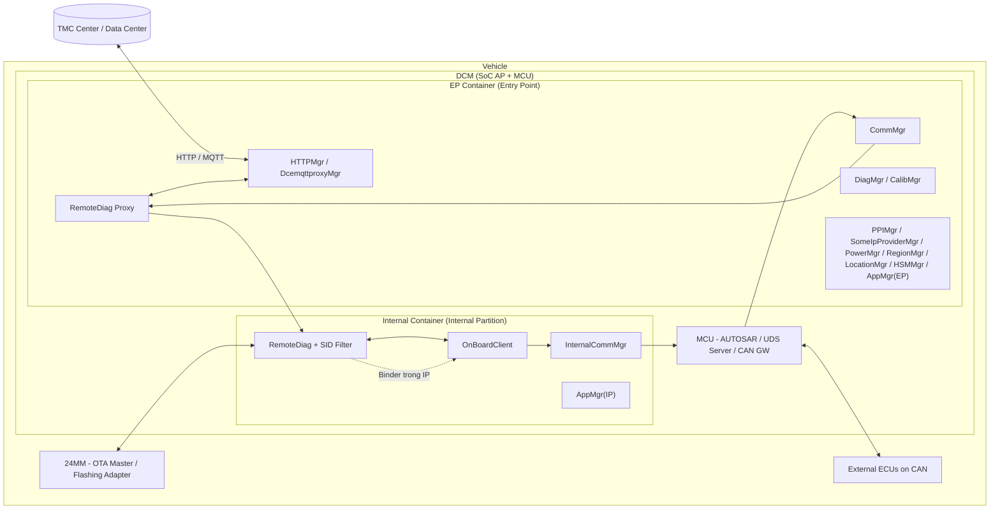
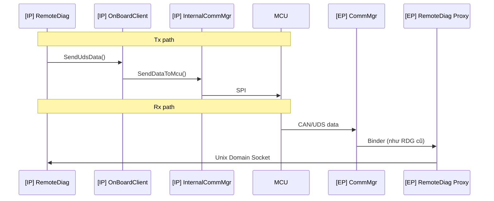
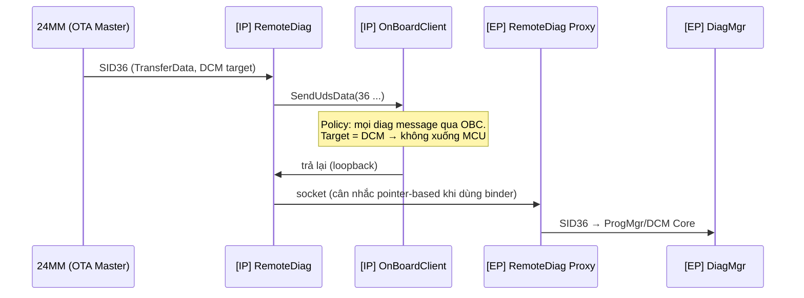
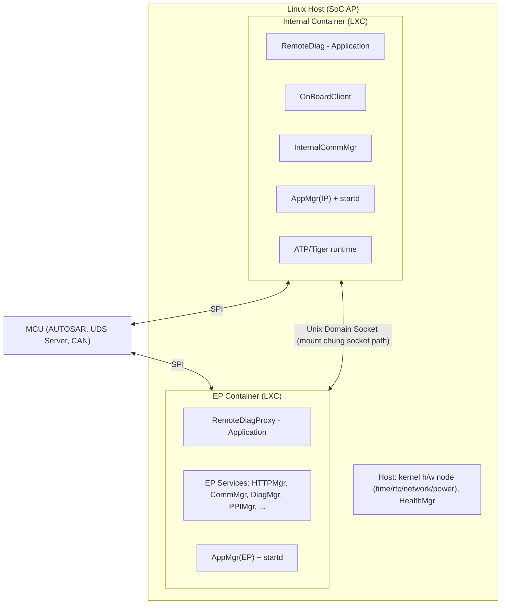

# Design Document: Tách RemoteDiag sang Internal Partition với RemoteDiag Proxy (EP/IP Container Separation)

| Thuộc tính | Giá trị |
| --- | --- |
| Dự án | Toyota DCM 24LM (MPW ePF, 19PFv3KAI — 2DEX 4G/5G) |
| Phạm vi | RemoteDiag (RDG) / RemoteDiag Proxy (RDP) / OnBoardClient (OBC) / EP–Internal Partition |
| Ngày lập | 2026-07-31 |
| Nguồn chính | RDG_discussions.md (thread thảo luận giữa gwansu.shin — HQ Architect và tuyen2.nguyen — LGEDV) |
| Tài liệu tham chiếu | 19PFv3KAI-DCM Cybersecurity Specification (2025-12-03), appendix.md (sheet B-3, C-2, C-3, D-1), SEC-ePF-MFG-REQ-SPEC-a03-00-a, SEC-ePF-MFG-TST-SPEC-a03-00-a, Confluence DCMNTCY (page 3582109698, 2016280312, 2312224711, 3688463772, 3741825871), Jira TMCDCMLM-157, MPWSPEC-44 |

---

## 1. Executive Summary

Tài liệu này tái dựng (reconstruct) và hệ thống hóa các quyết định kiến trúc cho việc **tách phần mềm DCM thành hai partition chạy trong Linux Container (LXC): EP (Entry Point) Container và Internal Partition (IP) Container**, tập trung vào module **RemoteDiag (RDG)** — thành phần thực hiện Remote Diagnostics / Data Collection.

Bối cảnh xuất phát từ yêu cầu Cybersecurity của TMC (Toyota Motor Corporation) trong bộ đặc tả 19PFv3KAI: khi EP Partition (nơi tiếp xúc Internet/Cellular) bị compromise, phạm vi thiệt hại **không được lan sang Internal Partition và in-vehicle CAN bus** (sheet D-1); đồng thời các diagnostic command trái phép liên quan reprogramming phải bị **filter** (sheet B-3-2, đặc tả Message Filtering MFGREQ_00058–00061, Table 5-1).

Các quyết định kiến trúc chính đã được chốt (fixed) qua thảo luận:

1. **Toàn bộ RemoteDiag đặt trong Internal Container**; bổ sung module mới **RemoteDiag Proxy (RDP)** đặt trong EP Container để giao tiếp với các module còn ở EP.
2. **RDP hoạt động như một transparent proxy**: mọi module ở EP coi RDP như chính RemoteDiag thật ("All modules of EP will treat the RemoteDiag Proxy as if it were the actual RemoteDiag").
3. **SID Filter đặt bên trong RemoteDiag** (Internal Partition) — phù hợp yêu cầu Cyber Security và vị trí chức năng cập nhật collection condition hiện hữu.
4. **Đường SID36 cho DCM update**: `MM → RemoteDiag → OBC → RemoteDiag → RemoteDiag Proxy → DiagMgr` (Option #2), giữ nguyên policy "mọi diag message phải đi qua OBC", tránh chuyển gói lớn (~180MB) hai lần qua SPI tới MCU.
5. **AppMgr tồn tại độc lập ở cả EP và IP**; AppMgr của IP chỉ dùng cho BOOT_COMPLETE; lifecycle event từ EP AppMgr đến RDG thông qua RDP; RDG phân biệt hai đường nhận bằng Adapter (socket vs binder).
6. **Grade switching (DCM5.2, 3 grade Low/Mid/High)**: DiagMgr thông báo grade (nhận qua SID31 VIN sync) cho RDG/DCA; RDG/DCA tự enable/disable.

Trạng thái tại thời điểm lập tài liệu: kiến trúc đã "fixed" ở mức khối; việc bring-up RDP đang triển khai theo Jira TMCDCMLM-157 (branch `toyota_24lm_feature_EPSeparation_260623`); một số chủ đề (fail-safe chi tiết, lifecycle/priority của RDP, cơ chế truyền dữ liệu lớn bằng binder/pointer) còn **open**.

---

## 2. Architecture Drivers

### 2.1 Functional Requirements

| ID | Yêu cầu | Nguồn |
| --- | --- | --- |
| FR-01 | RemoteDiag phải tiếp tục cung cấp đầy đủ chức năng Remote Diagnostics / Data Collection sau khi chuyển vào Internal Container (Service Mode Status, User Consent, Center Communication, DID read/write, Power mode, Region, Location, CAN message, App priority) | RDG_discussions (danh sách module của tuyen2.nguyen) |
| FR-02 | Hỗ trợ SID36 (TransferData) cho DCM update với package tối đa ~180MB qua đường MM → RDG → OBC → DiagMgr | RDG_discussions; Confluence 2016280312 (quyết định 8/23, 12/18) |
| FR-03 | SID36 cho ECU khác DCM tiếp tục đi qua MCU (OBC → InternalCommMgr → MCU → external ECU) | RDG_discussions; Confluence 2016280312 |
| FR-04 | Hỗ trợ Grade switching (Low: Remote diag/Data collection hoạt động; Mid/High: dừng hoạt động), trigger bởi SID31 Spec info switching (VIN writing); RDG/DCA tự đọc grade sau initial boot-up (DID read hoặc property) | MPWSPEC-44; RDG_discussions |
| FR-05 | SID Filter chặn các SID bị cấm theo bảng filtering: 0x10 (programming session 0x02), 0x11, 0x28, 0x34, 0x85 | Confluence 3582109698 (bảng Filtering); MFGREQ_00006 Table 5-1 |
| FR-06 | BOOT_COMPLETE và lifecycle event (schedule reset...) phải đến được RDG trong IP | RDG_discussions (trao đổi về AppMgr) |

### 2.2 Non-functional / Security Requirements

| ID | Yêu cầu | Nguồn |
| --- | --- | --- |
| NFR-01 (Security) | Phạm vi compromise giới hạn trong EP Partition, không lan sang Internal Partition / in-vehicle CAN | Confluence 3582109698 Req#1; sheet D-1 (Mandatory requirements) |
| NFR-02 (Security) | SoC/VM bị compromise phía EP mạo danh DIAG client gửi SID vào internal CAN thì phải bị discard | Confluence 3582109698 Req#2; sheet D-1 (Đề xuất thay thế 2/2) |
| NFR-03 (Security) | Filter diagnostic command trái phép liên quan reprogramming | Sheet B-3-2; MFGREQ_00006/00058–00061; 2-CYS-01-20 additional requirements |
| NFR-04 (Performance) | Không truyền gói dữ liệu lớn (512KB/lần test hiện tại, tối đa ~180MB) qua SPI tới MCU hai lần; cân nhắc truyền bằng pointer khi dùng binder trong path RDG → OBC → RDG | RDG_discussions; Confluence 2312224711 (kết quả test DoCAN: SID36 có hiện tượng không truyền được >13 bytes thời điểm 2024/01, đã fix) |
| NFR-05 (Reliability) | Fail-safe cho proxy/service: phát hiện service chết (POLLHUP), reconnect, reset hệ thống nếu abnormal restart ≥4 lần trong 480s (HealthMgr/StartD) | Confluence 3688463772, 3741825871 |
| NFR-06 (Availability) | Resource Quotas: tránh EP Container chiếm 100% CPU/RAM làm đói Internal (Diag) Container | Confluence 3582109698 (Design list No.12) |
| NFR-07 (Maintainability) | Không phải định nghĩa/hiện thực IPC mới cho từng module liên quan ở EP | RDG_discussions ("we don't need to define/implement the new interface for IPC for lots of related modules") |
| NFR-08 (Schedule) | Bring-up RDP theo mốc 7/17 → 7/24 (implement), 7/31 (verification) | TMCDCMLM-157 |

### 2.3 Regulatory / Compliance

- UN R155 / Toyota Vehicle Cybersecurity: các đặc tả SEC-ePF-* trong 19PFv3KAI (đặc biệt 2-CYS-01-20 Communication Security between Partitions với additional requirement "Filter unauthorized diagnostic commands related to reprogramming" và "Support relocation to the EP bus or alternative multi-layer separation — sheet D-1").
- Message Filtering: MFGREQ_00058–00061 (không route diagnostic request/response, external tool message giữa các In-Vehicle Bus trái quy tắc; control message theo routing map), kiểm chứng bởi MFGTST_00032–00036.
- Chuyển đổi PQC (sheet B-3) và ECU Authentication CHAP với CGW (sheet C-2), Key Update qua OTA/TEE (sheet C-3) — ảnh hưởng dài hạn tới thiết kế bảo mật kênh liên lạc và lưu khóa (nằm trong Design list cần xem xét: mục 5, 6, 7).

### 2.4 Integration Requirements

- RDG phụ thuộc các module EP: SomeIpProviderMgr (RMS), PPIMgr, HTTPMgr, DcemqttproxyMgr, HSMMgr (China only), DiagMgr, CalibMgr, PowerMgr, RegionMgr, LocationMgr, CommunicationMgr (CommMgr), AppMgr; TDM là library (link trực tiếp, không phải service).
- Giao tiếp EP↔IP container dùng IPC socket (Unix Domain Socket) theo kiến trúc ManagerProxy/ManagerSocketServer (Confluence 3741825871); trong container, client↔proxy dùng Binder.
- CAN path: Tx `[IP] RDG → [IP] OBC → [IP] InternalCommMgr → MCU`; Rx `MCU → [EP] CommMgr → [EP] RDP → [IP] RDG`.

---

## 3. Assumptions and Constraints

### 3.1 Constraints (ràng buộc đã xác nhận)

| ID | Ràng buộc | Bằng chứng |
| --- | --- | --- |
| C-01 | Policy nghiệp vụ: **mọi diag message phải đi qua OBC**; vi phạm cần thảo luận với OEM | RDG_discussions: "our basic concept is; all diag messages must go through OBC. If we take op#1, it will violate this policy" |
| C-02 | Kết quả test tích hợp DoCAN 2024/01: truyền packet lớn qua SPI (MCU) là heavy operation → không dùng đường MCU cho SID36 của DCM | RDG_discussions; Confluence 2312224711 |
| C-03 | Giao tiếp giữa container yêu cầu IPC socket mới; mỗi module phải tự hiện thực nếu không có proxy | RDG_discussions (lý do loại op#1 của bài toán interface) |
| C-04 | Nền tảng proxy chuẩn hóa: ManagerProxy (Binder server, EP) ↔ Unix Domain Socket ↔ ManagerSocketServer (service side); OpCode whitelist + payload size validation; struct `__attribute__((packed))` | Confluence 3741825871, 3688463772 |
| C-05 | SocketServer đặt phía RemoteDiag (IP), Proxy là Client — basic policy | RDG_discussions (gwansu.shin yêu cầu chuyển SocketServer từ RDP về RDG) |
| C-06 | Schedule rất gấp ("the schedule is really tight"); bring-up không cần hoàn hảo, fail-safety xử lý sau | RDG_discussions; TMCDCMLM-157 |
| C-07 | Grade notification (SID31) không gửi lại mỗi lần DCM reboot/IG cycle — chỉ khi "SID31 write"; RDG/DCA phải tự đọc grade sau boot | RDG_discussions |
| C-08 | Base branch cho EP Separation: `toyota_24lm_feature_EPSeparation_260623`; do system part (ATP, Container) chưa xong, implementation bắt đầu trên master 24DCM | TMCDCMLM-157 |
| C-09 | RDG Proxy là **Application** (không phải Service) — vì EP module coi RDP là RemoteDiag thật (bản thân RDG là Application) | RDG_discussions (đính chính của gwansu.shin) |

### 3.2 Assumptions (giả định — chưa xác nhận đầy đủ)

| ID | Giả định | Ghi chú |
| --- | --- | --- |
| A-01 | Isolation giữa hai container (namespace, cgroup, mount) đủ mạnh để thỏa NFR-01/NFR-02 ở mức OS-level | Design list No.2, No.12 còn đang xem xét; chưa có evidence về cấu hình cụ thể |
| A-02 | Kênh socket EP↔IP sẽ được bổ sung biện pháp bảo vệ (encryption, authentication) theo Design list No.5, No.6 | Chưa chốt trong thảo luận |
| A-03 | RDP chỉ forward, không giữ business logic; SID Filter chỉ tồn tại trong RDG (IP) | Suy diễn từ "treat the RemoteDiag Proxy as if it were the actual RemoteDiag" |
| A-04 | Truyền dữ liệu SID36 nội bộ AP (binder + pointer-based transfer) đáp ứng throughput cho 180MB | Được nêu là điểm "will discuss later about this implementation" |
| A-05 | "stop all operation" khi grade = Mid/High bao gồm dừng thu thập, dừng gửi center, `setFeatureStatus(OFF)` | Yêu cầu OEM còn ambiguous, inquiry đang mở (MPWSPEC-44) |

---

## 4. Architecture Overview

### 4.1 Project Context

DCM (Data Communication Module) là telematics ECU của Toyota (nền tảng 24LM/MPW ePF cho 19PFv3KAI, NAD 4G/5G). DCM có hai vai trò xung đột về an ninh:

- **Entry Point (EP)**: giao tiếp không dây với Center (HTTP/MQTT), SOME/IP, OTA — bề mặt tấn công lớn.
- **Diagnostic client nội bộ**: gửi UDS request xuống MCU và in-vehicle CAN (Remote Diagnostics, OTA reprogramming cho ECU khác).

TMC đề xuất mô hình tách partition (theo sheet D-1 — "The internal CAN shall be separated from EP") và LGE hiện thực hóa bằng **hai LXC container trên Linux Host**: EP Container và Internal Container. TMC suggested design này được đánh giá "efficient for us because there's not major design change" (gwansu.shin).

### 4.2 Problem Statement

RemoteDiag hiện chạy chung không gian với các module EP. Khi tách partition:

1. RDG thuộc **security domain nội bộ** (ra lệnh diag xuống CAN) nhưng **phụ thuộc chức năng** vào ≥10 module ở EP → cần cơ chế giao tiếp xuyên trust boundary mà không phá vỡ isolation và không bùng nổ chi phí IPC.
2. Đường dữ liệu lớn SID36 cho DCM update phải giữ hiệu năng (không đi vòng qua SPI/MCU).
3. Các yêu cầu filter SID (Cybersecurity) phải đặt đúng phía trust boundary.
4. Lifecycle (AppMgr, BOOT_COMPLETE, fail-safe) phải hoạt động nhất quán khi một application bị tách làm hai process ở hai container.

### 4.3 System Context Diagram

Chú giải (legend): mũi tên nét liền = luồng dữ liệu chính; nét đứt = IPC nội container; khối bo = container/trust zone.

---

## 5. Architecture Views

### 5.1 Context View

- **Objective**: xác định biên hệ thống và external actor.
- **External systems**: TMC Center (HTTP/MQTT), 24MM (OTA Master — gửi UDS qua Flashing Adapter), MCU (UDS Server, CAN gateway theo Architecture#2 của thiết kế DoCAN), external ECU trên CAN, LAN tester/diagnostic tool (theo môi trường đánh giá MFGTST, Figure 4-1: ECU — LAN tester).
- **Data flows chính**: (1) Diag request/response từ Center qua HTTPMgr/Dcemqttproxy → RDP → RDG; (2) UDS Tx từ RDG → OBC → InternalCommMgr → MCU; (3) UDS/CAN Rx từ MCU → CommMgr(EP) → RDP → RDG; (4) SID36 DCM update từ MM.
- **Rationale**: giữ nguyên external interface (Center protocol, MM interface, MCU protocol) — chỉ thay đổi cấu trúc nội bộ, đúng tinh thần "not major design change".

### 5.2 Logical View

- **Objective**: phân rã thành phần và trách nhiệm.

| Component | Partition | Trách nhiệm | Phụ thuộc |
| --- | --- | --- | --- |
| RemoteDiag (RDG) | IP | Remote diagnostics, data collection, **SID Filter**, collection condition update, grade enable/disable | OBC, RDP, AppMgr(IP), InternalCommMgr |
| RemoteDiag Proxy (RDP) | EP | Transparent proxy — đại diện RDG trước mọi module EP; forward hai chiều qua socket | RDG (socket client), tất cả module EP liên quan (binder) |
| OnBoardClient (OBC) | IP | Cổng bắt buộc cho mọi diag message (policy C-01); route SID36 DCM về DiagMgr (qua RDG→RDP), SID khác xuống MCU | InternalCommMgr, RDG |
| InternalCommMgr | IP | Giao tiếp MCU (Tx path) | MCU |
| CommMgr | EP | Nhận CAN/UDS từ MCU (Rx path), chuyển cho RDP | MCU, RDP |
| DiagMgr / CalibMgr | EP | UDS service xử lý DID read/write, nhận SID36 DCM; thông báo grade (SID31) | DCM Core, ProgMgr |
| AppMgr (EP/IP) + startd | EP & IP | Lifecycle; IP AppMgr chỉ broadcast BOOT_COMPLETE; EP AppMgr gửi lifecycle event qua RDP | — |
| SID Filter | IP (trong RDG) | Chặn SID cấm: 0x10(prog 0x02), 0x11, 0x28, 0x34, 0x85 | RDG |

- **Rationale**: đặt tất cả logic quyết định (SID Filter, collection condition) phía trong trust boundary (IP); phía EP chỉ còn adapter không trạng thái.

### 5.3 Runtime View

- **Objective**: mô tả luồng thực thi chính.

**(a) UDS Tx/Rx tổng quát** (evidence: gwansu.shin):

**(b) SID36 cho DCM update — Option #2 đã chốt:**

**(c) Lifecycle / BOOT_COMPLETE:** RDG nhận từ hai đường — (1) EP AppMgr → RDP → RDG (lifecycle: schedule reset...), (2) IP AppMgr → RDG (chỉ BOOT_COMPLETE; message khác bị ignore). Phân biệt bằng Adapter (socket vs binder).

**(d) Grade switching:** DiagMgr nhận SID31 (VIN sync kèm grade) → notify RDG/DCA (qua RDP) → RDG/DCA enable (như cũ) hoặc disable (stop all operation + `setFeatureStatus(OFF)`); sau initial boot-up RDG/DCA tự đọc grade (DID read/property).

### 5.4 Deployment View

- **Objective**: môi trường thực thi, biên mạng.

- Ghi chú: socket path được bind-mount giữa hai container (theo TMCDCMLM-157: "Server/Client definition & socket path mount"); container start bởi systemd (Design list No.1); Tiger chạy trong container + Host-Proxy Services (kế hoạch ~7/10).
- **Rationale**: LXC cho phép tách namespace/resource mà không cần hypervisor; các chủ đề kernel h/w node, resource quota, SW update per-container nằm trong Design list cần thiết kế tiếp.

### 5.5 Security View

- **Objective**: trust boundary và control.

| Khía cạnh | Thiết kế | Trace |
| --- | --- | --- |
| Trust boundary | EP Container (untrusted khi bị compromise) ↔ Internal Container (trusted, nắm CAN access) | Req#1/Req#2 (3582109698); sheet D-1 |
| Ingress control tại IP | SocketServer đặt phía RDG (IP); **OpCode whitelist + payload size + received data size validation** trước khi xử lý | C-05; Confluence 3688463772 §3.1 |
| SID Filter | Trong RDG (IP): chặn 0x10(02)/0x11/0x28/0x34/0x85 theo bảng Filtering (phối hợp cột OBC/DiagMgr) | MFGREQ_00006 Table 5-1; 3582109698 |
| Routing restriction | MCU/gateway + OBC bảo đảm MFGREQ_00058–00061 (không route diag request/response, external tool message trái quy tắc) | SEC-ePF-MFG-REQ-SPEC |
| Message encryption EP↔IP | Design list No.5 — **chưa chốt** | Gap |
| ECU Authentication | CHAP với CGW (sheet C-2); key trong SHE, CMD_LOAD_KEY | 19PFv3KAI (KMG-SLV) — Design list No.6 |
| Key Update | Key/password lưu TEE, update qua OTA (sheet C-3) | Design list No.7 |
| Logging & Audit | Design list No.13 — chưa chốt | Gap |

- **Rationale**: mô hình "default deny" tại biên IP: chỉ OpCode whitelist đi qua; logic filter đặt phía trusted để kẻ tấn công chiếm EP không thể vô hiệu hóa filter (đúng NFR-02: EP mạo danh DIAG client gửi SID → bị discard).

### 5.6 Information/Data View

- **Objective**: thực thể dữ liệu chính và vòng đời.

| Data entity | Owner | Lifecycle / Movement |
| --- | --- | --- |
| UDS request/response | OBC (transit), DiagMgr/MCU (xử lý) | Sinh từ MM/Center/RDG → qua OBC → MCU hoặc DiagMgr; response ngược lại |
| SID36 transfer block (~512KB/chunk test, tổng ~180MB) | ProgMgr/DiagMgr | MM → RDG → OBC → RDG → RDP → DiagMgr; cần zero-copy/pointer khi qua binder |
| Grade info (Low/Mid/High) | DiagMgr (nhận SID31), RDG/DCA (consume) | Ghi khi SID31 write; RDG/DCA tự đọc lại sau boot (DID/property) |
| Collection condition | RDG | Update từ Center; đi qua RDP |
| SID Filter config | RDG | Tĩnh theo spec filtering; thuộc PSP-level cần chống tamper (MFGTST_00002 / VULCMN_51200) |
| OpCode protocol (SOCKET_PATH, structs) | Shared header giữa RDP và RDG | `IXxxManagerProxyType.hpp` packed struct, hai phía tham chiếu cùng header |
| BOOT_COMPLETE / lifecycle event | AppMgr EP/IP | EP AppMgr → RDP → RDG; IP AppMgr → RDG |

---

## 6. High Level Design

### 6.1 System Overview

- **Purpose**: duy trì đầy đủ chức năng RemoteDiag khi phần mềm DCM bị tách thành EP/IP container theo yêu cầu cybersecurity multi-layer separation.
- **Scope**: RDG, RDP, OBC, AppMgr (EP/IP), đường CAN/UDS Tx-Rx, SID36 DCM, SID Filter, grade switching. Ngoài scope: chi tiết container platform (LCP), MCU AUTOSAR nội bộ.
- **Architectural goals**: (1) bảo toàn trust boundary; (2) tối thiểu thay đổi với module EP hiện hữu; (3) hiệu năng dữ liệu lớn; (4) khả năng kiểm chứng theo MFGTST.

### 6.2 Major Components

| Component | Inputs | Outputs | Dependencies |
| --- | --- | --- | --- |
| RemoteDiag (IP) | UDS response, CAN data (từ RDP), lifecycle event, grade notify, request từ MM | UDS request (→OBC), data collection (→Center qua RDP→HTTPMgr), `setFeatureStatus` | OBC, RDP, AppMgr(IP), TDM lib |
| RemoteDiagProxy (EP) | Binder call từ EP modules (CommMgr, DiagMgr, HTTPMgr, PPIMgr, AppMgr(EP)...), socket response từ RDG | Socket request tới RDG, binder response về EP modules | RDG socket server, EP binder framework |
| OnBoardClient (IP) | UDS từ RDG | SID36-DCM → trả lại RDG; SID khác → InternalCommMgr → MCU | InternalCommMgr, RDG |
| SID Filter (trong RDG) | Mọi SID đi qua RDG | Allow/deny theo bảng filter + grade | RDG config |
| AppMgr(IP) | systemd/startd | BOOT_COMPLETE broadcast trong IP | — |
| AppMgr(EP) | systemd/startd | Lifecycle event (qua RDP) | RDP |

### 6.3 Interface Design

| Interface | Loại | Protocol | Security |
| --- | --- | --- | --- |
| EP module ↔ RDP | Internal (EP) | Binder (giữ nguyên interface RDG cũ — transparent) | Binder UID/permission hiện hữu |
| RDP ↔ RDG | Cross-container | Unix Domain Socket; OpCode + packed struct; RDG là SocketServer, RDP là Client | OpCode whitelist, payload/size validation; encryption TBD (Design list No.5) |
| RDG ↔ OBC | Internal (IP) | Binder/direct call | Nội trust zone |
| OBC/InternalCommMgr ↔ MCU | HW | SPI (proprietary framing REQUEST_REMOTE_UDS_DATA...) | MCU-side gateway filter |
| DCM ↔ Center | External | HTTP/MQTT (qua HTTPMgr/Dcemqttproxy ở EP) | TLS (hướng PQC theo sheet B-3) |
| MM ↔ RDG | External (in-vehicle) | UDS-based (Flashing Adapter) | Đi qua OBC policy + SID Filter |

### 6.4 Data Flow

- **Primary**: diag request (Center/MM) → RDP → RDG → SID Filter → OBC → (MCU | DiagMgr-via-RDP) → response ngược lại.
- **Control**: lifecycle (EP AppMgr → RDP → RDG; IP AppMgr → RDG), grade notify (DiagMgr → RDP → RDG).
- **Error**: socket fail (`sendSocketRequest() == -1` khi service chưa chạy) → retry/reconnect; OpCode invalid → return failed về caller; service crash → POLLHUP detect → reportServiceDead → reconnect loop; abnormal restart ≥4 lần/480s → HealthMgr `requestReset()` → system reset.

### 6.5 Operational Behavior

- **Startup**: systemd khởi động container → startd/AppMgr từng container → RDG mở SocketServer (bind trước) → RDP connect → `sd_notify(READY=1)` → BOOT_COMPLETE_PRE/BOOT_COMPLETE broadcast.
- **Normal operation**: RDP forward hai chiều; RDG xử lý logic; OBC route theo target ECU.
- **Fault handling**: theo mục 6.4 Error; hai option giám sát — (A) persistent connection + POLLHUP (khuyến nghị, phát hiện trong vài ms, thuộc phần common của ManagerProxy) hoặc (B) dual-channel heartbeat (OP_HEARTBEAT_REQ/RSP, trạng thái INIT/RUNNING/DEGRADED/SHUTTING_DOWN).
- **Recovery**: reconnect tự động; khi grade chuyển Mid/High: dừng toàn bộ hoạt động RDG + `setFeatureStatus(OFF)` (chi tiết "stop all operation" chưa chốt).

---

## 7. Architecture Decisions

## AD-001: Tách phần mềm DCM thành EP Container và Internal Container (LXC)

### Context
TMC yêu cầu multi-layer separation (sheet D-1) do rủi ro EP bị compromise; 2-CYS-01-20 yêu cầu "Support relocation to the EP bus or alternative multi-layer separation".
### Problem
Ngăn compromise ở EP lan sang internal CAN mà không thay đổi lớn thiết kế hiện hữu và không cần di dời vật lý ECU sang EP bus.
### Alternatives
1. Di dời/tập hợp ECU có EP sang EP bus của CGW (sheet D-1 chính); 2. Tách logic trong ECU (alternative proposal D-1): tách EP partition và CAN partition + AP14-19/Secure Boot cho phía CAN; 3. Giữ nguyên (không đạt yêu cầu).
### Decision
Chọn tách logic bằng hai LXC container trên Linux Host (EP Container / Internal Container); "TMC suggested this design. It's efficient for us because there's not major design change."
### Rationale
Đáp ứng D-1 alternative; tái sử dụng codebase 24DCM; container isolation + gateway filter phía MCU thỏa Req#1/Req#2.
### Trade-offs
(+) Ít thay đổi; đạt yêu cầu compliance. (−) Phát sinh chi phí IPC xuyên container, lifecycle phức tạp (AppMgr đôi), rủi ro resource contention (Design list No.12).
### Consequences
Mọi module có phụ thuộc xuyên biên phải có proxy hoặc IPC socket mới; sinh ra chuỗi quyết định AD-002…AD-007.
### Impacted Quality Attributes
Security (+), Maintainability (−), Performance (−), Availability (cần quota).
### Evidence
RDG_discussions (mở đầu); Confluence 3582109698 (Req#1/Req#2, Design list); appendix.md sheet D-1; 19PFv3KAI 2-CYS-01-20.

## AD-002: Toàn bộ RemoteDiag đặt trong Internal Container + thêm RemoteDiagProxy ở EP

### Context
RDG phụ thuộc ≥10 module EP; lịch sử thiết kế có phương án tách RDG thành nhiều app theo Server/MM SID path (5/19 Nagoya meeting), OBC không tách và chỉ ở Internal Container (5/19).
### Problem
RDG nằm ở đâu, và giao tiếp với EP modules thế nào để không phải định nghĩa hàng loạt interface IPC mới.
### Alternatives
1. Tách RDG thành nhiều app hai bên (design 5/19); 2. RDG toàn phần ở IP, mỗi EP module tự implement IPC socket mới tới RDG (op#1 của interface question); 3. RDG toàn phần ở IP + **RemoteDiagProxy** ở EP đóng vai RDG (chosen, 6/25).
### Decision
Chọn 3 — "Place the new module interacting with 'Components located in EP' within EP … Making 'RemoteDiag Proxy' is a new ideal concept from LGE side."
### Rationale
"From the EP perspective, there is no need to pre-define many interfaces, and the structure remains the same as before"; "Communication between Container requires new IPC(socket). Each module should implement it independently. From our expectation, op#1 requires more effort than op#2."
### Trade-offs
(+) EP modules không đổi; một điểm hội tụ IPC duy nhất. (−) RDP là single point of failure cho mọi luồng EP↔RDG; thêm một hop cho mọi giao dịch.
### Consequences
RDP phải là Application (AD-006); cần fail-safe/lifecycle riêng cho RDP; cần mapping toàn bộ interface RDG cũ vào OpCode protocol.
### Impacted Quality Attributes
Maintainability (+), Modifiability (+), Reliability (− nếu RDP crash), Performance (− một hop socket).
### Evidence
RDG_discussions (design update của gwansu.shin); Confluence 3582109698 ("(6/25) RemoteDiag 전체를 Internal Container에 포함, 단 EP에 위치하는 모듈과의 통신을 위해 RemoteDiagProxy 모듈 추가").

## AD-003: SID Filter đặt bên trong RemoteDiag (Internal Partition)

### Context
Yêu cầu filter SID reprogramming (sheet B-3-2; MFGREQ_00006: 0x10 prog/0x11/0x28/0x34/0x85). Bảng Filtering trong Confluence 3582109698 phân công OBC/DiagMgr theo SID.
### Problem
Đặt SID Filter ở đâu trong chuỗi xử lý để vừa đúng chức năng vừa đúng trust boundary.
### Alternatives
1. Filter ở EP (RDP hoặc CommMgr); 2. Filter ở OBC; 3. Filter trong RDG (chosen); (MCU gateway filter là lớp bổ sung độc lập).
### Decision
"SID Filter will be located inside of RDG" (mục Fixed).
### Rationale
"Since the collection condition update function currently resides within RemoteDiag, it is considered appropriate to place the SID Filter inside RemoteDiag as well. As the 'SID Filter' is intended to block specific SIDs, it is also more aligned with Cyber Security requirements" — filter nằm phía trusted, EP compromise không vô hiệu hóa được (NFR-02).
### Trade-offs
(+) An toàn, gần logic điều kiện thu thập. (−) SID từ EP vẫn đi tới IP trước khi bị chặn (tiêu tốn socket bandwidth với message rác; DoS mitigations thuộc lớp khác).
### Consequences
RDG chịu trách nhiệm compliance với MFGREQ Table 5-1; cần test theo MFGTST tương ứng; filter config cần chống tamper (MFGTST_00002).
### Impacted Quality Attributes
Security (+), Testability (+ tập trung một chỗ), Performance (trung tính).
### Evidence
RDG_discussions; Confluence 3582109698 bảng Filtering; SEC-ePF-MFG-REQ-SPEC MFGREQ_00006.

## AD-004: RDP là transparent proxy và là Application (không phải Service)

### Context
Ban đầu gwansu.shin trả lời "RDG Proxy will be a Service" (guideline hiện có là cho Service proxy); sau đó đính chính.
### Problem
RDP nên là Service (theo ManagerProxy guide) hay Application?
### Alternatives
1. Service (theo guide chuẩn AudioMgrProxy); 2. Application đóng vai RDG thật (chosen).
### Decision
"RemoteDiag Proxy will be an Application, not a Service. All modules will think RemoteDiag Proxy as an actual RemoteDiag, so the Proxy should be an Application."
### Rationale
Tính transparent: EP modules (kể cả AppMgr) tương tác với RDP y như với application RDG cũ — không đổi contract; lifecycle của RDP do AppMgr(EP) quản lý như một app.
### Trade-offs
(+) Zero change cho EP modules. (−) Lệch pattern chuẩn ManagerProxy (main/service lifecycle khác); lifecycle/priority phải thiết kế riêng ("I'm considering the lifecycle, priority for this").
### Consequences
`app_proc`/AppMgr fork RDP trong EP và RDG trong IP; cần định nghĩa hành vi khi RDP restart.
### Impacted Quality Attributes
Modifiability (+), Maintainability (− lệch pattern), Reliability (cần fail-safe riêng).
### Evidence
RDG_discussions (hai lượt trả lời của gwansu.shin, xác nhận app_proc hai container).

## AD-005: Đường SID36 cho DCM update — Option #2 (MM → RDG → OBC → RDG → RDP → DiagMgr)

### Context
Thiết kế cũ (2023, Confluence 2016280312): SID36 target-DCM đi thẳng OBC→DiagMgr (không qua MCU) vì gói lớn, không cần pending; SID34/37 nhỏ đi qua MCU. Sau khi tách partition, đường OBC→DiagMgr bị cắt bởi container boundary. Package DCM update tối đa ~180MB, chunk test hiện tại 512KB.
### Problem
Chọn đường đi mới cho SID36-DCM xuyên EP/IP boundary.
### Alternatives
1. `MM → RDG → RDP → DiagMgr` (bỏ qua OBC) — bị loại: "it will violate this policy [all diag messages must go through OBC]. Also, it needs discussion with OEM"; giữ làm phương án dự phòng nếu #2 gặp vấn đề kỹ thuật.
2. `MM → RDG → OBC → RDG → RDP → DiagMgr` — **chosen**.
3. `MM → RDG → OBC → DiagMgr` với IPC mới OBC→EP — cần định nghĩa/hiện thực IPC mới.
4. Tạo OBC Proxy — từng được gwansu.shin nghiêng về ("I think No.4 would be better") nhưng không được chọn ở kết luận.
5. (Đề xuất tuyen2.nguyen) `MM → RDG → OBC → MCU → DiagMgr` như SID36 của ECU khác — bị loại do kết quả test cũ: "Transmitting such large packet to SPI twice will be a heavy operation" (Confluence 2312224711: lịch sử tích hợp DoCAN, SID36 từng lỗi >13 bytes).
### Decision
"In conclusion, we took #2. (MM → RemoteDiag → OBC → RemoteDiag → RemoteDiag Proxy → DiagMgr)".
### Rationale
Giữ policy OBC (không cần thỏa thuận lại với OEM); tránh SPI double-transfer cho 180MB; tái dùng kênh RDG↔RDP sẵn có thay vì tạo IPC/proxy mới cho OBC.
### Trade-offs
(+) Không IPC mới, tuân policy, hiệu năng chấp nhận được trong AP. (−) Đường đi vòng (2 lần qua RDG); hiệu năng binder cho chunk 512KB cần kỹ thuật pointer-based transfer ("performance aspects such as transfers using pointers also need to be taken into account. We will discuss this later").
### Consequences
Cần thiết kế chi tiết truyền dữ liệu lớn (Design list No.4); nếu thất bại kỹ thuật → fallback option #1 (đề xuất với OEM).
### Impacted Quality Attributes
Performance (chấp nhận, cần verify), Interoperability/Compliance (+), Maintainability (+).
### Evidence
RDG_discussions (chuỗi thảo luận SID36 và kết luận); Confluence 2016280312 (quyết định 8/23, 12/18, Option 1/2); Confluence 2312224711 (test DoCAN).

## AD-006: SocketServer đặt phía RemoteDiag (IP); RDP là Socket Client

### Context
Nhóm Dev bước đầu implement SocketServer ở RDP (log TMCDCMLM-157).
### Problem
Bên nào listen socket?
### Alternatives
1. Server ở RDP (EP); 2. Server ở RDG (IP) — basic policy.
### Decision
"RemoteDiag should be the SocketServer, and RemoteDiag Proxy should be the Client" (gwansu.shin yêu cầu chuyển).
### Rationale
Nhất quán pattern ManagerProxy/ManagerSocketServer (server nằm cùng process với "actual operation"); về an ninh, phía trusted (IP) kiểm soát accept + OpCode whitelist thay vì phía EP giữ listening endpoint.
### Trade-offs
(+) Nhất quán, ingress control tại trust boundary. (−) Yêu cầu sửa code đã viết; RDG phải sẵn sàng (bind) trước khi RDP connect (boot ordering).
### Consequences
Boot sequence: RDG bind → RDP connect → sd_notify READY; RDP cần retry-connect logic.
### Impacted Quality Attributes
Security (+), Reliability (+ boot ordering rõ), Testability (+).
### Evidence
RDG_discussions; Confluence 3741825871 (pattern chuẩn); TMCDCMLM-157.

## AD-007: AppMgr độc lập ở EP và IP; RDG nhận lifecycle qua hai đường, phân biệt bằng Adapter

### Context
App Service có nhiều callback tới RDG; App Service chạy ở cả hai partition — cả RDG lẫn RDP đều có thể nhận callback (câu hỏi của tuyen2.nguyen, image 12).
### Problem
Tránh xử lý trùng/xung đột lifecycle event khi có hai AppMgr.
### Alternatives
1. Chỉ dùng IP AppMgr cho mọi event; 2. Chỉ dùng EP AppMgr qua RDP; 3. IP AppMgr chỉ cho BOOT_COMPLETE, còn lại từ EP AppMgr qua RDP; RDG phân biệt nguồn bằng Adapter (socket vs binder) — chosen.
### Decision
"the plan is to ignore all messages from the Internal Container's AppMgr (excluding essential messages such as BOOT_COMPLETE). Since the goal is for RDP and RDG to function as a single unit, the RDG must receive messages from the EP Container's AppMgr via RDP… We believe we can distinguish between (1) and (2) using an Adapter."
### Rationale
Boot-complete phải phát sinh cục bộ trong IP (module IP chưa chắc thấy EP); các lifecycle nghiệp vụ (schedule reset) gắn với hệ EP nơi RDP "đại diện" RDG.
### Trade-offs
(+) RDP+RDG hoạt động như một unit. (−) Hai nguồn sự thật về lifecycle; nguy cơ race/duplicate nếu lọc message không chặt.
### Consequences
Cần bảng phân loại message theo nguồn; test khởi động hai container theo thứ tự khác nhau.
### Impacted Quality Attributes
Reliability (rủi ro cần kiểm soát), Observability (cần log rõ nguồn), Maintainability (trung tính).
### Evidence
RDG_discussions (Q&A cuối thread); Confluence 3688463772 (boot-complete sequence).

## AD-008: Grade switching — DiagMgr notify, RDG/DCA tự enable/disable và tự đọc grade sau boot

### Context
DCM5.2 có 3 grade (Low/Mid/High); TMC muốn giảm software variation bằng grade switching qua "Spec info switching (VIN writing), SID31" (MPWSPEC-44).
### Problem
RDG/DCA biết và phản ứng với grade thế nào khi SID31 không lặp lại mỗi reboot/IG cycle.
### Alternatives
(Trong MPWSPEC-44) Idea #1: switch ngay sau SID31; Idea #2: switch sau ADF desuppressed + 1 IG cycle. Phía LGE: DiagMgr push-notify + RDG/DCA self-read khi boot (chosen ở mức design LGE).
### Decision
"DiagMgr will notify RDG/DCA about the grade; RDG/DCA handles enable/disable operation… The SID31 won't be notified for every DCM reboot or IG cycle… RDG/DCA should read the grade themselves after the initial boot-up. Such as DID read or store it as property."
### Rationale
Event-driven khi thay đổi + self-recovery khi khởi động; disable = "stop all operation and setFeatureStatus(OFF)".
### Trade-offs
(+) Không phụ thuộc re-notification; đơn giản cho DiagMgr. (−) "stop all operation" chưa được đặc tả đầy đủ (requirement ambiguous, inquiry on-going).
### Consequences
Cần persistence grade (DID/property) đọc được từ IP; hành vi disable phải định nghĩa rõ (ảnh hưởng test).
### Impacted Quality Attributes
Modifiability (+ giảm variation), Availability (grade sai → mất chức năng), Testability (− khi spec chưa chốt).
### Evidence
RDG_discussions (thông báo grade + image 02/03); MPWSPEC-44 (Done — requirement đầu vào).

## AD-009 (Lịch sử — ràng buộc nền): MCU đảm nhiệm UDS Server (DoCAN), SID36-DCM không qua MCU

### Context
24CY chuyển vehicle network từ Ethernet (DoIP) sang CAN (DoCAN); hai phương án: AED xử lý DoCAN↔UDS (1안) vs MCU xử lý (2안).
### Problem
Ai là UDS server và đường đi của gói OTA lớn.
### Alternatives
1안 AED; 2안 MCU (chosen — kèm thỏa thuận OEM bỏ yêu cầu DCM Core grant session).
### Decision
Architecture#2: MCU là UDS Server mọi scenario kể cả OTA; SID34/37 (nhỏ, cần pending) qua MCU; **SID36 target-DCM: RDG → DiagMgr trực tiếp** (không qua MCU), target ECU khác → qua MCU.
### Rationale
Xử lý DoCAN sớm khi AP chưa boot (NRC); tránh gánh nặng SPI cho dữ liệu lớn.
### Trade-offs
(+) Hiệu năng, khả dụng sớm. (−) VectorSIP không cho DCM Core approve session → cần OEM đồng ý đổi thiết kế.
### Consequences
Là tiền đề trực tiếp của C-01/C-02 và AD-005.
### Impacted Quality Attributes
Performance (+), Availability (+), Interoperability (thỏa thuận OEM).
### Evidence
Confluence 2016280312 (§1.2, §3.2.1, meeting 5/26, 6/08, 8/23, 12/18); Confluence 2312224711.

---

## 8. Design Rationale (tổng hợp)

1. **Trust-boundary-first**: mọi logic quyết định an ninh (SID Filter, ingress validation, socket server) dồn về Internal Partition — bảo đảm EP compromise không thể tự cấp quyền (NFR-01/02).
2. **Transparency để giảm chi phí thay đổi**: RDP mô phỏng RDG trước EP modules → hàng chục interface hiện hữu không đổi; đánh đổi bằng một hop socket và một điểm hội tụ.
3. **Tôn trọng ràng buộc lịch sử đã kiểm chứng**: policy "mọi diag qua OBC" và bài học hiệu năng SPI (2024/01) định hình lựa chọn SID36 thay vì tối ưu cục bộ (đề xuất đi qua MCU bị bác bằng dữ liệu test).
4. **Chuẩn hóa hạ tầng IPC**: tái dùng khung ManagerProxy/ManagerSocketServer (common vs variable part) → RDP kế thừa validation, fail-safe monitoring, boot-complete convention với chi phí thấp.
5. **Fail-safe từng nấc**: reconnect → report dead/alive → HealthMgr reset — phù hợp thiết bị automotive không người vận hành.

---

## 9. Quality Attribute Analysis

### AD-002 (RDG toàn phần ở IP + RDP)

| Quality Attribute | Impact | Reason | Positive Effect | Negative Effect |
| --- | --- | --- | --- | --- |
| Security | Cao (+) | RDG (CAN-facing logic) nằm trọn trong trusted zone | Thu hẹp attack surface từ EP | — |
| Maintainability | Cao (+) | EP modules giữ nguyên contract | Không sửa hàng loạt module | RDP phải sync interface với RDG mãi mãi |
| Reliability | Trung bình (−) | RDP là điểm hội tụ | — | RDP crash làm gián đoạn mọi luồng EP↔RDG (cần fail-safe) |
| Performance | Thấp (−) | Thêm một hop socket | — | Latency nhỏ mỗi giao dịch |
| Testability | Trung bình (+) | Boundary rõ (OpCode protocol) | Test contract độc lập từng phía | Cần môi trường 2 container để integration test |

### AD-003 (SID Filter trong RDG)

| Quality Attribute | Impact | Reason | Positive Effect | Negative Effect |
| --- | --- | --- | --- | --- |
| Security | Cao (+) | Filter phía trusted, EP không vô hiệu hóa được | Thỏa NFR-02, MFGREQ_00006 | — |
| Testability | Trung bình (+) | Một điểm filter | Map thẳng MFGTST | — |
| Performance | Thấp (−) | Message rác vẫn tới IP mới bị chặn | — | Tiêu tốn socket bandwidth ở tình huống tấn công |

### AD-005 (SID36 Option #2)

| Quality Attribute | Impact | Reason | Positive Effect | Negative Effect |
| --- | --- | --- | --- | --- |
| Performance | Cao (điều kiện) | Tránh SPI x2 cho 180MB, nhưng thêm 2 hop nội AP | Không nghẽn SPI | Binder copy 512KB/chunk nếu không dùng pointer-based transfer |
| Interoperability | Cao (+) | Giữ policy OBC, không cần renegotiate OEM | Không đổi spec với TMC | — |
| Maintainability | Trung bình (+) | Không IPC/proxy mới | Ít component hơn (so option 3/4) | Luồng đi vòng khó đọc, cần tài liệu hóa |
| Reliability | Trung bình | Nhiều hop hơn | — | Nhiều điểm hỏng trên path update DCM |

### AD-007 (AppMgr hai container)

| Quality Attribute | Impact | Reason | Positive Effect | Negative Effect |
| --- | --- | --- | --- | --- |
| Reliability | Trung bình (−) | Hai nguồn lifecycle event | BOOT_COMPLETE cục bộ chắc chắn | Nguy cơ duplicate/race nếu lọc sai |
| Observability | Trung bình | Cần phân biệt nguồn qua Adapter | Log tách nguồn rõ | Thiếu spec logging (Design list No.13) |
| Modifiability | Thấp (+) | RDP+RDG như một unit | Ít thay đổi phía EP | — |

### AD-001 (Container separation) — bổ sung

| Quality Attribute | Impact | Reason | Positive Effect | Negative Effect |
| --- | --- | --- | --- | --- |
| Security | Cao (+) | OS-level isolation + gateway filter | Thỏa D-1/PCS | Còn phụ thuộc cấu hình LXC đúng |
| Availability | Trung bình (rủi ro) | Resource contention | — | EP chiếm 100% CPU/RAM → đói Diag Container (đã nhận diện, No.12) |
| Safety | Gián tiếp (+) | Ngăn lệnh diag trái phép xuống CAN | Giảm rủi ro điều khiển trái phép | — |

---

## 10. Traceability Matrices

### 10.1 Requirement → Design

| Requirement | Design Element | Discussion Evidence | Reference Document |
| --- | --- | --- | --- |
| NFR-01 (compromise không lan khỏi EP) | EP/IP Container (AD-001), RDG trong IP (AD-002) | Thread mở đầu + design update 6/25 | Sheet D-1; 3582109698 Req#1; 2-CYS-01-20 |
| NFR-02 (EP mạo danh DIAG client → discard) | SID Filter trong RDG (AD-003), OpCode whitelist tại SocketServer IP (AD-006), MCU gateway | "SID Filter … more aligned with Cyber Security requirements" | 3582109698 Req#2; sheet D-1 (2/2); MFGREQ_00006 |
| NFR-03 (filter reprogramming SID) | Bảng SID Filter 0x10(02)/0x11/0x28/0x34/0x85 phân công OBC/DiagMgr | Bảng Filtering trong collab | MFGREQ_00006 Table 5-1; sheet B-3-2; MFGTST tương ứng |
| MFGREQ_00058–00061 (routing restriction In-Vehicle Bus) | OBC routing + MCU gateway/routing map | Path Tx/Rx qua OBC/InternalCommMgr | SEC-ePF-MFG-REQ/TST-SPEC (MFGTST_00032–00036) |
| FR-02 (SID36 DCM ~180MB) | Option #2 path (AD-005) | Kết luận "we took #2" + lý do SPI | 2016280312 (8/23, 12/18); 2312224711 |
| FR-04 (grade switching) | DiagMgr notify + self-read (AD-008) | Thông báo của gwansu.shin (images 02/03) | MPWSPEC-44 |
| FR-06 (lifecycle) | AppMgr EP/IP + Adapter (AD-007) | Q&A cuối thread (image 12) | 3688463772 (boot-complete, fail-safe) |
| NFR-05 (fail-safe) | ServiceMonitor POLLHUP / heartbeat; HealthMgr reset 4 lần/480s | "Items … such as fail-safety, will be addressed at a later date" | 3741825871 §7; 3688463772 §3.3 |
| NFR-07 (không IPC mới hàng loạt) | Transparent RDP (AD-002/AD-004) | "we don't need to define/implement the new interface for IPC for lots of related modules" | 3741825871 (pattern) |
| NFR-08 (schedule) | Bring-up scope tách khỏi functional (SID Filter, SID36, grade để sau) | Mail yêu cầu start implementation | TMCDCMLM-157 |

### 10.2 Decision → Quality Attribute

| Decision | Quality Attribute | Impact | Rationale |
| --- | --- | --- | --- |
| AD-001 | Security / Availability | + / rủi ro | Isolation OS-level; cần resource quota |
| AD-002 | Security, Maintainability / Reliability | + / − | Trusted logic tập trung; RDP single point |
| AD-003 | Security, Testability | + | Filter phía trusted, map MFGTST |
| AD-004 | Modifiability / Maintainability | + / − | Transparent nhưng lệch pattern Service proxy |
| AD-005 | Performance, Interoperability | + (điều kiện) | Tránh SPI x2; giữ policy OBC; cần pointer-based transfer |
| AD-006 | Security, Reliability | + | Ingress control tại IP; boot ordering rõ |
| AD-007 | Reliability, Observability | rủi ro kiểm soát được | Hai nguồn lifecycle, phân biệt bằng Adapter |
| AD-008 | Modifiability, Availability | + / rủi ro | Giảm SW variation; disable behavior chưa chốt |
| AD-009 | Performance, Availability | + | MCU xử lý DoCAN sớm; SID36 tránh SPI |

### 10.3 Decision → Requirement

| Decision | Requirement | Justification |
| --- | --- | --- |
| AD-001 | NFR-01, NFR-02, 2-CYS-01-20 | Hiện thực multi-layer separation (D-1 alternative) |
| AD-002 | NFR-01, NFR-07, FR-01 | RDG trọn trong IP; EP contract không đổi |
| AD-003 | NFR-02, NFR-03, MFGREQ_00006 | Chặn SID cấm tại trusted zone |
| AD-004 | NFR-07, FR-01, FR-06 | EP modules (kể cả AppMgr) không cần biết separation |
| AD-005 | FR-02, C-01, C-02, NFR-04 | Thỏa policy OBC + tránh nghẽn SPI |
| AD-006 | NFR-02, NFR-05 | Trusted side kiểm soát accept/whitelist |
| AD-007 | FR-06 | BOOT_COMPLETE cục bộ + lifecycle từ EP |
| AD-008 | FR-04, C-07 | Grade event + self-read khi boot |
| AD-009 | FR-03, NFR-04 | Nền tảng đường UDS/DoCAN hiện hữu |

---

## 11. Risks and Open Issues

| # | Loại | Mô tả | Trạng thái / Mitigation |
| --- | --- | --- | --- |
| R-01 | Performance | Binder/socket copy cho chunk 512KB × ~360 lần (180MB) trên path SID36 Option #2 | Open — "transfers using pointers also need to be taken into account. We will discuss this later"; fallback: Option #1 (đề xuất OEM) |
| R-02 | Reliability | RDP crash → mất toàn bộ luồng EP↔RDG | Open — fail-safety "addressed at a later date"; áp dụng ServiceMonitor Option A (POLLHUP) khuyến nghị |
| R-03 | Availability | EP Container chiếm 100% CPU/RAM → starve Internal Container | Đã nhận diện (Design list No.12 Resource Quotas) — chưa có cấu hình |
| R-04 | Security | Kênh socket EP↔IP chưa có encryption/authentication (Design list No.5/No.6 chưa chốt) | Open |
| R-05 | Functional | "stop all operation" (grade disable) chưa được spec đầy đủ; SID31 requirement ambiguous | Inquiry on-going với TMC (MPWSPEC-44 follow-up) |
| R-06 | Schedule | "the schedule is really tight"; mốc 7/17 bring-up không hoàn hảo | Chấp nhận: HQ chỉ yêu cầu "support for proxy process running and communication" |
| R-07 | Process | RS/CuRS phải làm lại khi functional spec RDG (phiên bản kiến trúc mới) phát hành 7/E | Theo dõi lịch phát hành |
| R-08 | Integration | Image EP Separation còn lỗi SOME/IP + Diag, boot complete chưa hoạt động (build 6/23) | Đang xử lý bởi system part (ATP/Container) |
| R-09 | Design | Lifecycle/priority của RDP (Application) chưa chốt | gwansu.shin "considering"; LGE được yêu cầu góp ý |

---

## 12. Gap Analysis

### 12.1 Confirmed by Evidence (đã xác nhận)

- Kiến trúc "Fixed": SID Filter trong RDG; RDP transparent với EP modules; SID36 Option #2; AppMgr riêng ở IP (quản lý lifecycle RDG trong Internal Container).
- Đường Tx/Rx UDS-CAN như mục 5.3(a); policy OBC; lý do hiệu năng SPI (có dữ liệu test 2024/01).
- Nền tảng proxy ManagerProxy/ManagerSocketServer với OpCode whitelist, packed struct, boot-complete (sd_notify), fail-safe reset (4 lần/480s).
- Bảng SID Filter khớp MFGREQ_00006 Table 5-1 (bổ sung phân công OBC/DiagMgr).
- Grade 3 mức và cơ chế SID31 (MPWSPEC-44 Done ở phía requirement intake).

### 12.2 Inferred from Evidence (suy diễn có căn cứ)

- RDP không chứa business logic/SID Filter (từ nguyên tắc transparent proxy — A-03).
- SocketServer cuối cùng sẽ nằm ở RDG (yêu cầu rõ của HQ, dù code bước đầu làm ngược — chưa thấy xác nhận đã sửa).
- MFGREQ_00058–00061 chủ yếu do MCU gateway + routing map đảm nhiệm; phần AP góp phần qua OBC/SID Filter (tài liệu MFG là spec mức ECU, chưa có mapping module chi tiết trong thảo luận).
- ECU Authentication (CHAP, sheet C-2) và Key Update (C-3) sẽ tác động kênh EP↔IP và lưu khóa của RDG/TDM — mới ở mức Design list, chưa có thiết kế.

### 12.3 Assumptions (giả định — cần stakeholder xác nhận)

- A-01…A-05 (mục 3.2). Đặc biệt: cấu hình isolation LXC đạt mức yêu cầu D-1 "tài nguyên phân vùng nội bộ không bị ghi đè/đọc trái phép bởi EP"; và throughput binder pointer-based đủ cho 180MB trong time-budget OTA.
- Chưa có evidence về: port range EP/IP (đã hỏi, trả lời bằng link guide chung), cơ chế encryption socket, chi tiết Logging & Audit, hành vi RDP khi EP AppMgr restart.

### 12.4 Conflicting / cần làm rõ

- RDP là "Service" (trả lời đầu) vs "Application" (đính chính sau) → chốt: **Application**; nhưng guide hạ tầng viết cho Service proxy → cần guide bổ sung cho Application proxy.
- gwansu.shin từng nghiêng về option #4 (OBC Proxy) trước khi kết luận #2 → kết luận cuối là #2, option #4 không còn hiệu lực.

---

## 13. Conclusion

Thiết kế tách RemoteDiag sang Internal Partition với RemoteDiag Proxy là lời giải cân bằng giữa **yêu cầu cybersecurity bắt buộc** (multi-layer separation D-1, filter SID reprogramming, Req#1/Req#2) và **ràng buộc thực dụng** (schedule gấp, codebase 24DCM, policy OBC, giới hạn SPI). Chuỗi quyết định nhất quán theo nguyên tắc: *logic quyết định nằm phía trusted; phía untrusted chỉ còn adapter trong suốt; đường dữ liệu lớn ở lại trong AP*.

**Cách kiểm chứng kiến trúc (verification):**
1. Bring-up theo TMCDCMLM-157 (Action 3): xác minh một luồng UDS end-to-end qua RDP↔RDG (happy case) — đang thực hiện, đã có socket communication log (7/17 khung thời gian).
2. Security test theo SEC-ePF-MFG-TST-SPEC: MFGTST_00035/00036 (diagnostic request/response In-vehicle), MFGTST_00032–00034 (routing map / external tool message), MFGTST_00002 (tamper-proof filter config); bổ sung test giả lập EP compromise gửi SID cấm → RDG discard (Req#2).
3. Performance test SID36: đo throughput chunk 512KB trên path Option #2, so với time-budget DCM update 180MB; nếu fail → kích hoạt fallback Option #1 (thảo luận OEM).
4. Fault-injection: kill RDP/RDG lần lượt, xác minh POLLHUP detection, reconnect và HealthMgr reset threshold; test resource quota EP 100% CPU.
5. Lifecycle test: thứ tự boot hai container hoán đổi, xác minh BOOT_COMPLETE và loại trừ duplicate event qua Adapter.

**Việc còn lại:** chốt thiết kế truyền dữ liệu lớn (pointer-based), fail-safe/lifecycle của RDP, encryption/authentication kênh socket, spec "stop all operation" cho grade, Logging & Audit, và cập nhật RS/CuRS theo functional spec RDG phát hành 7/E.
