# Functional Architecture Design: Module RemoteDiag (RDG)

| Thuộc tính | Giá trị |
| --- | --- |
| Dự án | Toyota DCM 24LM (MPW ePF, 19PFv3KAI — 2DEX 4G/5G) |
| Module | RemoteDiag (RDG) — Remote Diagnostics / Data Collection |
| Ngày lập | 2026-08-02 |
| Loại tài liệu | Functional Architecture Design (standalone) |
| Tài liệu nguồn | RDG_EP_Separation_Design_Document_20260731.md; RDG_discussions.md; Confluence DCMNTCY (3582109698, 2016280312, 2312224711, 3688463772, 3741825871); Jira TMCDCMLM-157, MPWSPEC-44; SEC-ePF-MFG-REQ/TST-SPEC |

---

## 1. Project Context

### 1.1 Tổng quan dự án

DCM (Data Communication Module) là telematics ECU của Toyota trên nền tảng 24LM/MPW ePF cho 19PFv3KAI (NAD 4G/5G). DCM đồng thời giữ hai vai trò xung đột về an ninh:

- **Entry Point (EP)**: giao tiếp không dây với TMC Center (HTTP/MQTT), SOME/IP, OTA — bề mặt tấn công lớn nhất của xe.
- **Diagnostic client nội bộ**: gửi UDS request xuống MCU và in-vehicle CAN bus (Remote Diagnostics, OTA reprogramming cho ECU khác).

Theo yêu cầu Cybersecurity của TMC (bộ đặc tả 19PFv3KAI, sheet D-1 và 2-CYS-01-20): khi EP Partition bị compromise, phạm vi thiệt hại **không được lan sang Internal Partition và in-vehicle CAN bus**; đồng thời các diagnostic command trái phép liên quan reprogramming phải bị **filter** (MFGREQ_00058–00061, Table 5-1).

Giải pháp đã chốt ở mức hệ thống: tách phần mềm DCM thành hai partition chạy trong Linux Container (LXC) — **EP Container** và **Internal Partition (IP) Container** — trên cùng Linux Host (SoC AP). TMC đề xuất mô hình này và LGE đánh giá "efficient for us because there's not major design change".

### 1.2 Vai trò của module RDG trong bối cảnh mới

RemoteDiag (RDG) là application thực hiện Remote Diagnostics / Data Collection — thành phần **ra lệnh diag xuống CAN**, thuộc security domain nội bộ, nhưng lại **phụ thuộc chức năng vào ≥10 module nằm ở EP**. Vì vậy RDG là module chịu tác động lớn nhất của việc tách partition và là đối tượng trung tâm của tài liệu này.

Chức năng chính của RDG (giữ nguyên sau khi tách partition — FR-01):

| Nhóm chức năng | Mô tả |
| --- | --- |
| Remote Diagnostics | Nhận diag request từ Center/24MM, gửi UDS request qua OnBoardClient (OBC), trả response |
| Data Collection | Thu thập dữ liệu xe (CAN message, DID, Location, Power mode, Region...) theo collection condition, gửi về Center |
| SID Filter | Chặn các SID bị cấm theo bảng filtering Cybersecurity (0x10 programming session 0x02, 0x11, 0x28, 0x34, 0x85) |
| Collection Condition Update | Cập nhật điều kiện thu thập từ Center |
| Grade enable/disable | Phản ứng với grade switching (Low/Mid/High) theo SID31 — DCM5.2 |
| Service Mode / User Consent | Quản lý Service Mode Status, User Consent |

---

## 2. Problem — Bài toán cần giải quyết

### 2.1 Mô tả chi tiết vấn đề

Trước khi tách partition, RDG chạy chung không gian với toàn bộ module EP và giao tiếp bằng Binder. Khi hệ thống bị tách thành EP Container / IP Container, phát sinh 4 vấn đề với RDG:

1. **Xung đột trust boundary vs functional dependency**: RDG thuộc security domain nội bộ (ra lệnh diag xuống CAN) nhưng phụ thuộc chức năng vào ≥10 module ở EP (SomeIpProviderMgr/RMS, PPIMgr, HTTPMgr, DcemqttproxyMgr, HSMMgr — China only, DiagMgr, CalibMgr, PowerMgr, RegionMgr, LocationMgr, CommMgr, AppMgr; riêng TDM là library link trực tiếp). Cần cơ chế giao tiếp xuyên trust boundary mà không phá vỡ isolation và không bùng nổ chi phí IPC.
2. **Đường dữ liệu lớn SID36**: package DCM update tối đa ~180MB (chunk test hiện tại 512KB) phải giữ hiệu năng — không được đi vòng qua SPI/MCU (kết quả test tích hợp DoCAN 2024/01 cho thấy truyền packet lớn qua SPI là heavy operation).
3. **Vị trí SID Filter**: yêu cầu filter SID reprogramming phải đặt đúng phía trust boundary — kẻ tấn công chiếm EP không được phép vô hiệu hóa filter.
4. **Lifecycle nhất quán**: AppMgr tồn tại ở cả hai container; BOOT_COMPLETE và lifecycle event (schedule reset...) phải đến được RDG mà không gây duplicate/race.

### 2.2 Functional Requirements

| ID | Yêu cầu | Nguồn |
| --- | --- | --- |
| FR-01 | RDG tiếp tục cung cấp đầy đủ chức năng Remote Diagnostics / Data Collection sau khi chuyển vào Internal Container | RDG_discussions |
| FR-02 | Hỗ trợ SID36 (TransferData) cho DCM update, package tối đa ~180MB, qua đường MM → RDG → OBC → DiagMgr | Confluence 2016280312 |
| FR-03 | SID36 cho ECU khác DCM tiếp tục đi qua MCU (OBC → InternalCommMgr → MCU → external ECU) | Confluence 2016280312 |
| FR-04 | Hỗ trợ Grade switching (Low: hoạt động; Mid/High: dừng), trigger bởi SID31; RDG tự đọc grade sau initial boot-up | MPWSPEC-44 |
| FR-05 | SID Filter chặn các SID bị cấm: 0x10 (programming session 0x02), 0x11, 0x28, 0x34, 0x85 | MFGREQ_00006 Table 5-1 |
| FR-06 | BOOT_COMPLETE và lifecycle event phải đến được RDG trong IP | RDG_discussions |

### 2.3 Quality Attributes / Non-functional Requirements

| ID | Quality Attribute | Yêu cầu | Nguồn |
| --- | --- | --- | --- |
| NFR-01 | Security | Compromise giới hạn trong EP Partition, không lan sang IP / in-vehicle CAN | Sheet D-1; Confluence 3582109698 Req#1 |
| NFR-02 | Security | EP bị compromise mạo danh DIAG client gửi SID vào internal CAN → phải bị discard | Confluence 3582109698 Req#2 |
| NFR-03 | Security | Filter diagnostic command trái phép liên quan reprogramming | Sheet B-3-2; MFGREQ_00058–00061 |
| NFR-04 | Performance | Không truyền gói lớn (~180MB) qua SPI tới MCU hai lần; cân nhắc pointer-based transfer khi dùng Binder | Confluence 2312224711 |
| NFR-05 | Reliability | Fail-safe: phát hiện service chết (POLLHUP), reconnect, reset nếu abnormal restart ≥4 lần/480s | Confluence 3688463772, 3741825871 |
| NFR-06 | Availability | Resource Quotas: EP Container không được chiếm 100% CPU/RAM làm đói IP Container | Confluence 3582109698 No.12 |
| NFR-07 | Maintainability | Không phải định nghĩa/hiện thực IPC mới cho từng module liên quan ở EP | RDG_discussions |
| NFR-08 | Schedule | Bring-up theo mốc 7/17 → 7/24 (implement), 7/31 (verification) | TMCDCMLM-157 |

### 2.4 Ràng buộc (Constraints)

| ID | Ràng buộc |
| --- | --- |
| C-01 | Policy nghiệp vụ: **mọi diag message phải đi qua OBC**; vi phạm cần thảo luận với OEM |
| C-02 | Không dùng đường MCU/SPI cho SID36 của DCM (bài học test DoCAN 2024/01) |
| C-03 | Giao tiếp giữa container yêu cầu IPC socket mới (Unix Domain Socket) |
| C-04 | Nền tảng proxy chuẩn hóa: ManagerProxy ↔ Unix Domain Socket ↔ ManagerSocketServer; OpCode whitelist + payload size validation; packed struct |
| C-05 | SocketServer đặt phía service thật (basic policy) |
| C-06 | Schedule rất gấp; bring-up trước, fail-safety xử lý sau |
| C-07 | Grade notification (SID31) không lặp lại mỗi DCM reboot/IG cycle |

### 2.5 System Context Diagram

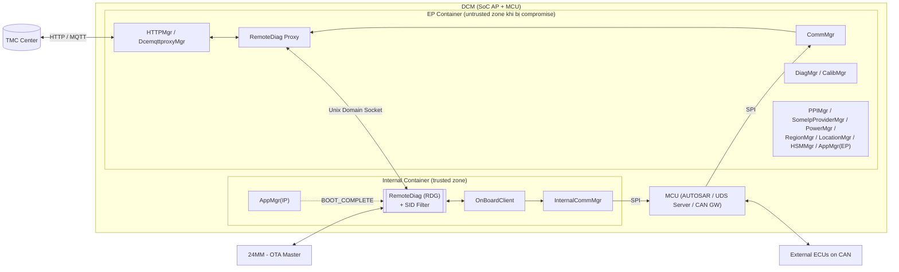

Chú giải (legend): khối bo kép = module trung tâm (RDG); mũi tên nét liền = luồng dữ liệu chính; nét đứt = lifecycle event; khối bo = container/trust zone.

---

## 3. Architecture Alternatives — Các phương án kiến trúc

Bài toán cốt lõi: **đặt RDG ở đâu và giao tiếp với các module EP như thế nào**. Bốn phương án được xem xét (Alt A/B/C tái dựng từ thread thảo luận HQ–LGEDV; Alt D là đề xuất bổ sung của người viết tài liệu, được đánh dấu rõ):

### Alt A — Tách RDG thành nhiều application ở hai bên container

Theo design 5/19 (Nagoya meeting): chia RDG thành nhiều app theo Server/MM SID path — phần cần CAN access ở IP, phần giao tiếp Center/EP ở EP. OBC không tách và chỉ nằm ở Internal Container.

### Alt B — RDG toàn phần ở IP; mỗi module EP tự hiện thực IPC socket mới

Chuyển nguyên khối RDG vào IP Container. Mỗi module EP có phụ thuộc với RDG (≥10 module) tự định nghĩa và hiện thực interface IPC socket mới xuyên container để gọi sang RDG.

### Alt C — RDG toàn phần ở IP + RemoteDiag Proxy (RDP) transparent ở EP ✅ (chosen)

Chuyển nguyên khối RDG vào IP Container; bổ sung module mới **RemoteDiag Proxy (RDP)** trong EP Container hoạt động như **transparent proxy**: mọi module EP coi RDP như chính RDG thật ("All modules of EP will treat the RemoteDiag Proxy as if it were the actual RemoteDiag"). RDP là **Application** (không phải Service), forward hai chiều qua Unix Domain Socket; RDG là SocketServer, RDP là Client. Đây là "a new ideal concept from LGE side" (6/25).

### Alt D — Generic Container Gateway/Message Broker tại biên EP↔IP *(đề xuất bổ sung của người viết — không có trong thảo luận gốc)*

Thay vì proxy riêng cho RDG, xây dựng một **gateway service dùng chung** tại biên hai container: mọi module (RDG và các module tương lai cần tách) đăng ký topic/endpoint qua broker; broker chịu trách nhiệm routing, validation, encryption tập trung. Phương án này tổng quát hóa cho các module khác sẽ tách sau này, nhưng vượt scope và schedule hiện tại.

---

## 4. Architecture Diagrams — Sơ đồ từng phương án

### 4.1 Alt A — Component Diagram (Static View)

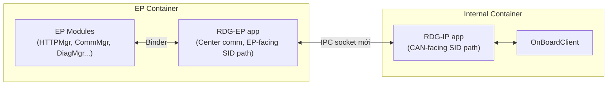

Chú giải: RDG bị chẻ đôi theo SID path; hai nửa đồng bộ trạng thái qua IPC socket riêng.

**Đặc điểm**: business logic của RDG (bao gồm phần xử lý SID) tồn tại ở cả hai phía trust boundary; state (collection condition, session, consent) phải đồng bộ hai chiều.

### 4.2 Alt B — Component Diagram (Static View)

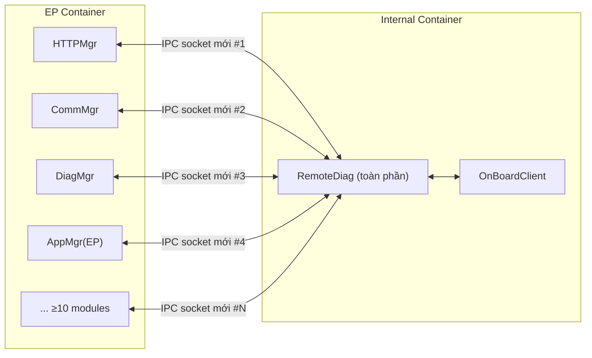

Chú giải: mỗi mũi tên xuyên biên container = một interface IPC socket phải định nghĩa và hiện thực mới.

**Đặc điểm**: mỗi module EP phải sửa code, tự hiện thực socket client, tự xử lý reconnect/fail-safe — nhân bản effort × N module.

### 4.3 Alt C (chosen) — Component Diagram (Static View)

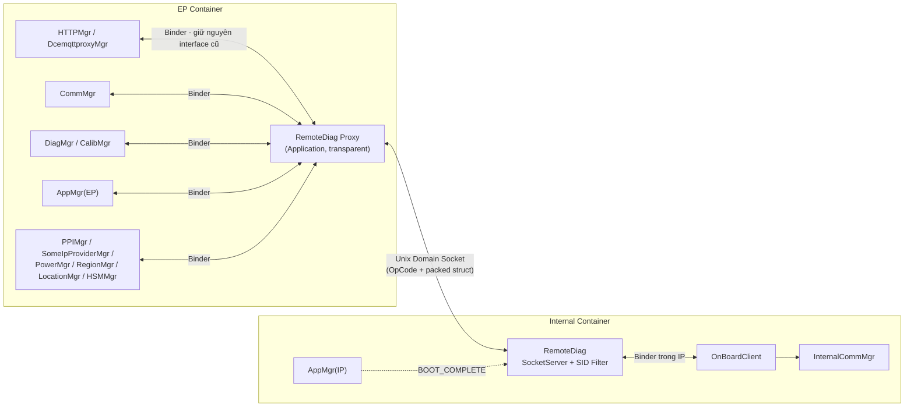

Chú giải: các module EP giữ nguyên Binder interface như trước khi tách — chỉ endpoint đổi từ RDG sang RDP; một kênh socket duy nhất hội tụ tại biên container.

#### 4.3.1 Cấu trúc chức năng nội bộ RDG (Alt C)

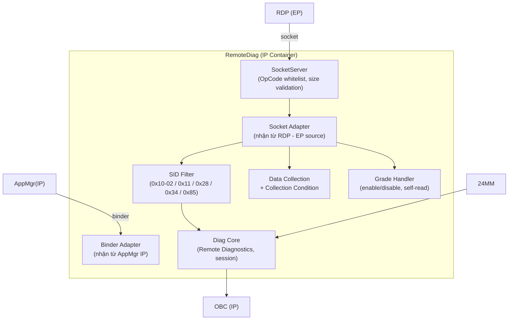

Chú giải: hai Adapter phân biệt nguồn message (EP qua socket vs IP qua binder — AD-007); mọi SID đi qua SID Filter trước khi tới Diag Core.

#### 4.3.2 Sequence Diagram — UDS Tx/Rx tổng quát (Dynamic View)

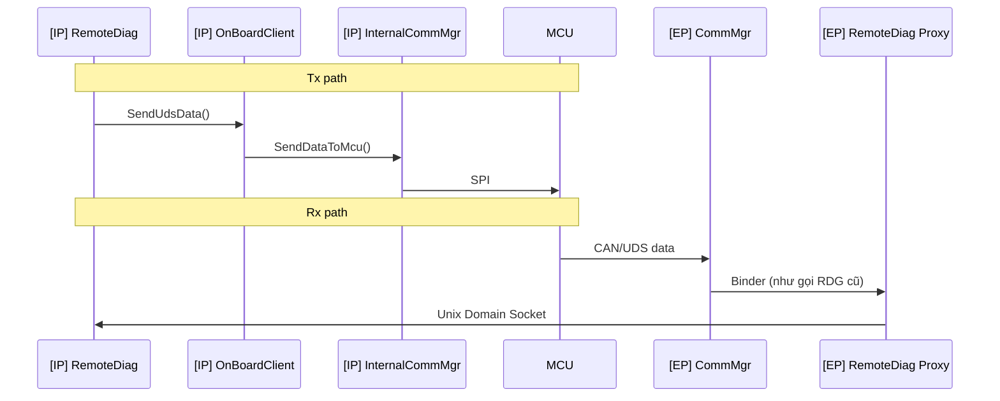

#### 4.3.3 Sequence Diagram — SID36 DCM update (Option #2)

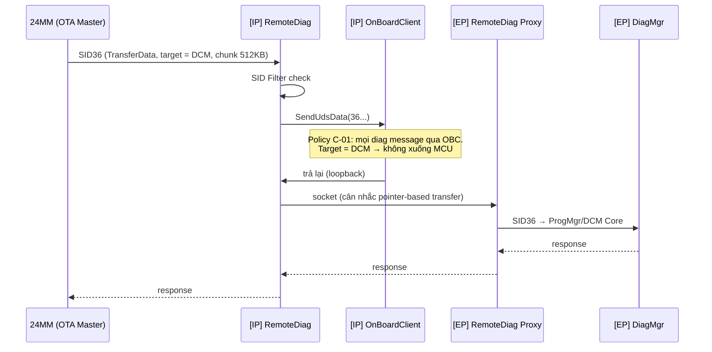

#### 4.3.4 Sequence Diagram — Lifecycle / BOOT_COMPLETE

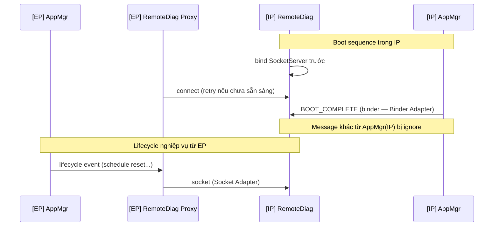

#### 4.3.5 Sequence Diagram — Grade switching (DCM5.2)

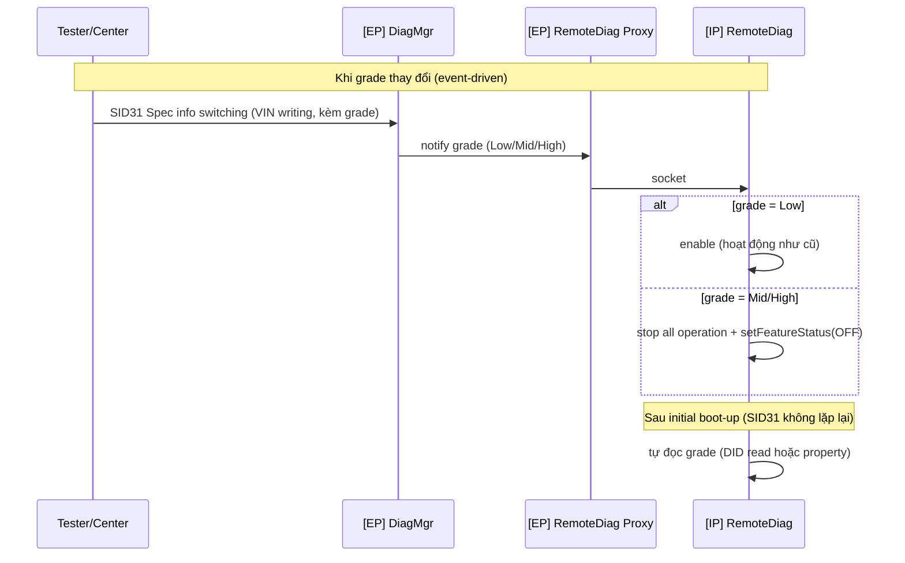

### 4.4 Alt D — Component Diagram (Static View) *(đề xuất bổ sung)*

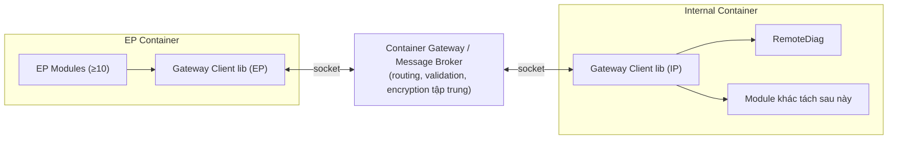

Chú giải: broker là process/service độc lập tại biên; hai bên chỉ link client library.

---

## 5. Comparison — So sánh các phương án

### 5.1 Bảng so sánh tổng hợp

| Tiêu chí | Alt A (tách RDG nhiều app) | Alt B (RDG ở IP + IPC per-module) | **Alt C (RDG ở IP + RDP)** ✅ | Alt D (Generic Gateway)* |
| --- | --- | --- | --- | --- |
| Security (NFR-01/02/03) | ✗ Logic diag vẫn một phần ở EP — filter/state có thể bị thao túng khi EP compromise | ✓ RDG trọn trong trusted zone | ✓ RDG + SID Filter trọn trong trusted zone; ingress control tại IP | ✓ Tương đương C, thêm điểm kiểm soát tập trung |
| Maintainability (NFR-07) | ✗ Chẻ đôi codebase RDG, đồng bộ state phức tạp | ✗ ≥10 module EP phải sửa code, hiện thực IPC mới ("op#1 requires more effort than op#2") | ✓ EP modules giữ nguyên contract; một điểm hội tụ IPC | ~ Broker phải được thiết kế/duy trì như platform component mới |
| Performance (NFR-04) | ~ Ít hop hơn cho luồng EP-side, nhưng đồng bộ state tốn kém | ✓ Đường trực tiếp module→RDG | ~ Thêm một hop socket mỗi giao dịch (chấp nhận được) | ✗ Thêm 2 hop (client→broker→client) |
| Reliability (NFR-05) | ✗ Hai nửa RDG phải đồng bộ — nhiều failure mode | ✗ N kênh socket = N điểm phải fail-safe riêng | ~ RDP là single point of failure (cần fail-safe, đã có pattern ServiceMonitor) | ✗ Broker là single point of failure toàn hệ thống |
| Schedule (NFR-08, C-06) | ✗ Thay đổi thiết kế lớn nhất | ✗ Effort nhân bản theo số module | ✓ Tái dùng khung ManagerProxy/ManagerSocketServer sẵn có | ✗ Vượt scope; phải xây platform mới từ đầu |
| Tuân thủ policy OBC (C-01) | ~ Cần rà soát lại từng SID path | ✓ | ✓ | ✓ |
| Tác động module EP hiện hữu | Lớn | Lớn (≥10 module) | **Zero change** (transparent) | Trung bình (đổi sang client lib) |

*\* Alt D là đề xuất bổ sung của người viết, chưa qua thảo luận HQ–LGEDV.*

### 5.2 Phân tích Quality Attribute cho phương án chọn (Alt C)

| Quality Attribute | Impact | Lý do | Positive Effect | Negative Effect |
| --- | --- | --- | --- | --- |
| Security | Cao (+) | RDG (CAN-facing logic) nằm trọn trong trusted zone; SocketServer + OpCode whitelist tại IP | Thu hẹp attack surface từ EP; EP compromise không vô hiệu hóa được SID Filter | — |
| Maintainability | Cao (+) | EP modules giữ nguyên contract | Không sửa hàng loạt module | RDP phải sync interface với RDG lâu dài |
| Reliability | Trung bình (−) | RDP là điểm hội tụ mọi luồng EP↔RDG | — | RDP crash làm gián đoạn toàn bộ luồng (cần fail-safe POLLHUP/heartbeat) |
| Performance | Thấp (−) | Thêm một hop socket | — | Latency nhỏ mỗi giao dịch; chunk 512KB cần pointer-based transfer |
| Testability | Trung bình (+) | Boundary rõ (OpCode protocol) | Test contract độc lập từng phía | Cần môi trường 2 container cho integration test |

---

## 6. Architectural Decision and Rationale

### AD-RDG-01: Chọn Alt C — RDG toàn phần ở Internal Container + RemoteDiag Proxy transparent ở EP

- **Decision**: "Place the new module interacting with 'Components located in EP' within EP … Making 'RemoteDiag Proxy' is a new ideal concept from LGE side" (chốt 6/25).
- **Rationale**: "From the EP perspective, there is no need to pre-define many interfaces, and the structure remains the same as before"; op#1 (Alt B) "requires more effort than op#2". Toàn bộ logic quyết định an ninh dồn về trusted zone (NFR-01/02), EP modules zero change (NFR-07), tái dùng khung ManagerProxy sẵn có (NFR-08).
- **Trade-off chấp nhận**: RDP là single point of failure — mitigated bằng fail-safe pattern chuẩn (POLLHUP detect, reconnect, HealthMgr reset ≥4 lần/480s); một hop socket thêm mỗi giao dịch.

### AD-RDG-02: SID Filter đặt bên trong RDG (Internal Partition)

- **Decision**: "SID Filter will be located inside of RDG" (Fixed).
- **Rationale**: "Since the collection condition update function currently resides within RemoteDiag, it is considered appropriate to place the SID Filter inside RemoteDiag as well. As the 'SID Filter' is intended to block specific SIDs, it is also more aligned with Cyber Security requirements" — filter nằm phía trusted, EP compromise không vô hiệu hóa được (NFR-02).

### AD-RDG-03: RDP là transparent proxy và là Application (không phải Service)

- **Decision**: "RemoteDiag Proxy will be an Application, not a Service. All modules will think RemoteDiag Proxy as an actual RemoteDiag."
- **Rationale**: bản thân RDG là Application; để transparent với EP modules (kể cả AppMgr), RDP phải giữ nguyên contract của một Application. Lifecycle của RDP do AppMgr(EP) quản lý như một app thường.

### AD-RDG-04: SocketServer đặt phía RDG (IP); RDP là Socket Client

- **Decision**: "RemoteDiag should be the SocketServer, and RemoteDiag Proxy should be the Client."
- **Rationale**: nhất quán pattern ManagerProxy/ManagerSocketServer (server cùng process với "actual operation"); phía trusted (IP) kiểm soát accept + OpCode whitelist thay vì để EP giữ listening endpoint. Hệ quả boot ordering: RDG bind trước → RDP connect (kèm retry).

### AD-RDG-05: Đường SID36 cho DCM update — Option #2

- **Decision**: "In conclusion, we took #2. (MM → RemoteDiag → OBC → RemoteDiag → RemoteDiag Proxy → DiagMgr)".
- **Rationale**: giữ policy "mọi diag message qua OBC" (C-01, không cần thỏa thuận lại OEM); tránh SPI double-transfer cho 180MB (C-02); tái dùng kênh RDG↔RDP thay vì tạo IPC/OBC Proxy mới. Các option bị loại: #1 (bỏ qua OBC — vi phạm policy, giữ làm fallback), #3 (IPC mới OBC→EP), #4 (OBC Proxy), #5 (qua MCU như ECU khác — heavy SPI operation).

### AD-RDG-06: Lifecycle qua hai đường, phân biệt bằng Adapter

- **Decision**: "the plan is to ignore all messages from the Internal Container's AppMgr (excluding essential messages such as BOOT_COMPLETE)… RDG must receive messages from the EP Container's AppMgr via RDP… distinguish between (1) and (2) using an Adapter."
- **Rationale**: BOOT_COMPLETE phải phát sinh cục bộ trong IP; lifecycle nghiệp vụ gắn với hệ EP nơi RDP đại diện RDG — mục tiêu "RDP and RDG function as a single unit".

### AD-RDG-07: Grade switching — DiagMgr notify + RDG self-read sau boot

- **Decision**: "DiagMgr will notify RDG/DCA about the grade; RDG/DCA handles enable/disable operation… RDG/DCA should read the grade themselves after the initial boot-up. Such as DID read or store it as property."
- **Rationale**: SID31 không lặp lại mỗi reboot/IG cycle (C-07) → cần cơ chế event-driven khi thay đổi + self-recovery khi khởi động. Disable = "stop all operation and setFeatureStatus(OFF)" (chi tiết đang inquiry với TMC).

### Nguyên tắc thiết kế xuyên suốt

1. **Trust-boundary-first**: mọi logic quyết định an ninh (SID Filter, ingress validation, SocketServer) dồn về Internal Partition.
2. **Transparency để giảm chi phí thay đổi**: RDP mô phỏng RDG trước EP modules — hàng chục interface hiện hữu không đổi.
3. **Tôn trọng ràng buộc lịch sử đã kiểm chứng**: policy OBC và bài học hiệu năng SPI (test 2024/01) định hình lựa chọn SID36.
4. **Chuẩn hóa hạ tầng IPC**: tái dùng ManagerProxy/ManagerSocketServer — kế thừa validation, fail-safe monitoring, boot-complete convention.

---

## 7. Verification — Kiểm chứng kiến trúc

Chứng minh kiến trúc chọn (Alt C) thực sự giải quyết bài toán, theo 5 nhóm test:

| # | Nhóm test | Nội dung | Requirement được kiểm chứng |
| --- | --- | --- | --- |
| V-1 | Bring-up (TMCDCMLM-157) | Xác minh một luồng UDS end-to-end qua RDP↔RDG (happy case); socket communication log đã có ở khung 7/17 | FR-01, NFR-08 |
| V-2 | Security test (SEC-ePF-MFG-TST-SPEC) | MFGTST_00035/00036 (diagnostic request/response In-vehicle); MFGTST_00032–00034 (routing map / external tool message); MFGTST_00002 (tamper-proof filter config); test giả lập EP compromise gửi SID cấm → RDG discard | NFR-01/02/03, FR-05 |
| V-3 | Performance test SID36 | Đo throughput chunk 512KB trên path Option #2 so với time-budget DCM update 180MB; nếu fail → kích hoạt fallback Option #1 (thảo luận OEM) | FR-02, NFR-04 |
| V-4 | Fault-injection | Kill RDP/RDG lần lượt: xác minh POLLHUP detection, reconnect, HealthMgr reset threshold (≥4 lần/480s); test resource quota EP 100% CPU | NFR-05, NFR-06 |
| V-5 | Lifecycle test | Hoán đổi thứ tự boot hai container: xác minh BOOT_COMPLETE, loại trừ duplicate event qua Adapter | FR-06 |

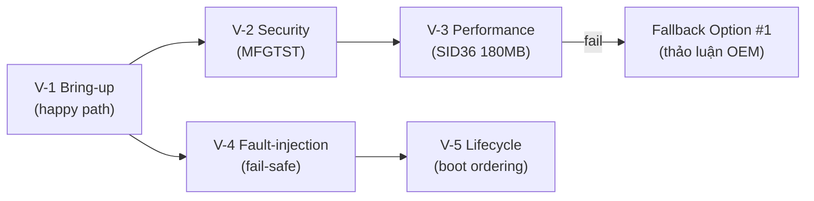

Chú giải: V-1 là điều kiện tiên quyết; V-3 có nhánh fallback đã định nghĩa trước.

---

## 8. Conclusion

### 8.1 Kết luận

Kiến trúc **RDG toàn phần ở Internal Container + RemoteDiag Proxy transparent ở EP** (Alt C) là lời giải cân bằng giữa **yêu cầu Cybersecurity bắt buộc** (multi-layer separation sheet D-1, filter SID reprogramming, Req#1/Req#2) và **ràng buộc thực dụng** (schedule gấp, codebase 24DCM, policy OBC, giới hạn SPI). Chuỗi quyết định nhất quán theo nguyên tắc: *logic quyết định nằm phía trusted; phía untrusted chỉ còn adapter trong suốt; đường dữ liệu lớn ở lại trong AP*.

### 8.2 Open Issues / Rủi ro còn lại

| # | Loại | Mô tả | Trạng thái |
| --- | --- | --- | --- |
| R-01 | Performance | Binder/socket copy cho chunk 512KB × ~360 lần (180MB) trên path SID36 Option #2 | Open — pointer-based transfer "will discuss later"; fallback Option #1 |
| R-02 | Reliability | RDP crash → mất toàn bộ luồng EP↔RDG | Open — fail-safety "addressed at a later date"; khuyến nghị ServiceMonitor POLLHUP |
| R-03 | Security | Kênh socket EP↔IP chưa có encryption/authentication (Design list No.5/No.6) | Open |
| R-04 | Functional | "stop all operation" (grade disable) chưa được spec đầy đủ | Inquiry on-going với TMC (MPWSPEC-44 follow-up) |
| R-05 | Design | Lifecycle/priority của RDP (Application) chưa chốt | HQ đang xem xét; LGE được yêu cầu góp ý |

### 8.3 Kế hoạch tiếp theo

- Chốt thiết kế truyền dữ liệu lớn (pointer-based transfer) cho SID36.
- Hoàn thiện fail-safe/lifecycle của RDP; encryption/authentication kênh socket.
- Chốt spec "stop all operation" cho grade switching; Logging & Audit.
- Cập nhật RS/CuRS theo functional spec RDG phát hành 7/E.
- Đánh giá lại Alt D (Generic Gateway) như hướng dài hạn nếu có thêm module cần tách sang IP Container trong các thế hệ platform sau.
