`gwansu.shin:`

> 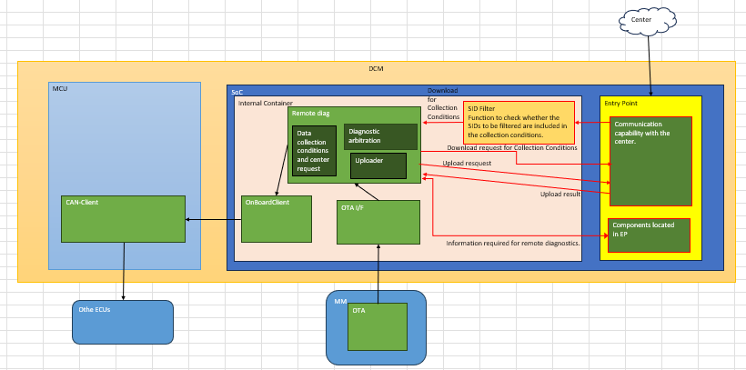
> TMC suggested this design. It's efficient for us because there's not major design change.
> To discuss this design internally, we should clarify which EP modules do we need to communicate.
> Could you list up the modules, including those?
> • Receiving Service Mode Status (RMS, SOME/IP)
> • User Consent Status (PPI)
> • Center Communication (HTTP, MQTT)
> • Data Encryption (TDM, HSM)
> • DID read/write (DiagMgr/CalibMgr)
> • Power mode
> • Region
> • Location
> • CAN message (CommunicationMgr)

`tuyen2.nguyen:`

> Sorry, Is Internal partition for both TX/RX of UDS request/response?
> then Entry partition will be for Server communication only
> Or, please describe R&R of EP and Internal partition that I can have overall role

`gwansu.shin:`

> The others are same with the previous design; [EP] CommMgr - [IP] Internal CommMgr
> Following the new design, the Tx/Rx of UDS req/res will be like this. But, it should be discussed further..
> Tx: [IP] RDG → [IP] OBC → [IP] InternalCommMgr → MCU → ...
> Rx: [EP] CommMgr → [IP] RDG

`tuyen2.nguyen:`

> I'm not sure which will be in EP partition, so let me share below list modules which are related to RemoteDiag
> • Receiving Service Mode Status: SomeIpProviderMgr
> • User Consent Status: PPIMgr
> • Center Communication: HTTPMgr, DcemqttproxyMgr
> • Data Encryption (TDM, HSM): TDM lib (library, not service running), HSMMgr (china only)
> • DID read/write: DiagMgr, CalibMgr
> • Power mode, IG status: PowerMgr
> • Region: RegionMgr
> • Location: LocationMgr
> • CAN message: CommunicationMgr
> • Application priority: AppMgr

`gwansu.shin:`

> Dear all,
> Regarding this matter, I had announced to Dev members before, but let me share again.
> There are three grades for DCM5.2 like this.
> 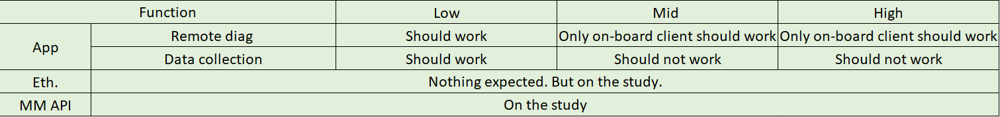
> We directly get impact of it. During the runtime, we should judge the enable/disable.
> The 'grade' will be sent with SID31, which is used for VIN sync for now.
> DiagMgr will notify to RDG/DCA, and RDG/DCA should enable/disable themselves.
> Since the requirement is ambiguous now, the inquiry is still on-going. But, let me share the design so far.
> DiagMgr will notify RDG/DCA about the grade
> RDG/DCA handles enable/disable operation
> enable: same as before
> disable: stop all operation and setFeatureStatus(OFF)
> "stop all operation" is not fully specified yet
> The SID31 won't be notified for every DCM reboot or IG cycle. It will only notified at "SID31 write" operation.
> RDG/DCA should read the grade themselves after the initial boot-up. Such as DID read or store it as property..
> You may f/u the SPEC ticket: https://toyota-11f.rickcloud.jp/jira/browse/MPWSPEC-44, and I'll also notify you.
> 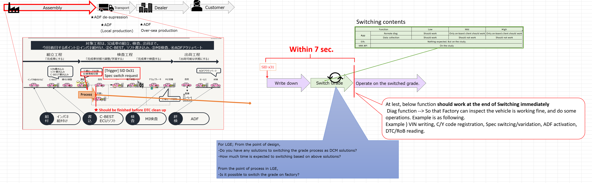

`gwansu.shin:`

`gwansu.shin:`

> Let me share the latest design. The discussion with TMC is on-going.
>
> The main changes are as follows:
> • Place the SID Filter inside RemoteDiag
> → Since the collection condition update function currently resides within RemoteDiag, it is considered appropriate to place the SID Filter inside RemoteDiag as well.
> → As the "SID Filter" is intended to block specific SIDs, it is also more aligned with Cyber Security requirements.
> • Place the new module interacting with 'Components located in EP' within EP
> → From the EP perspective, there is no need to pre-define many interfaces, and the structure remains the same as before.
>
> The main changes are as follows:
> • Place the SID Filter inside RemoteDiag
> → Since the collection condition update function currently resides within RemoteDiag, it is considered appropriate to place the SID Filter inside RemoteDiag as well.
> → As the "SID Filter" is intended to block specific SIDs, it is also more aligned with Cyber Security requirements.
> • Place the new module interacting with 'Components located in EP' within EP
> → From the EP perspective, there is no need to pre-define many interfaces, and the structure remains the same as before.
> 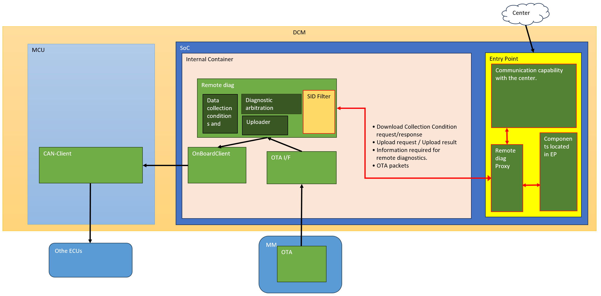
> Making 'RemoteDiag Proxy' is a new ideal concept from LGE side.
> If we take this design, we don't need to define/implement the new interface for IPC for lots of related modules.
> If you have any concern or question about this, please let me know.

`gwansu.shin:`

> The SW block diagram was updated.
> But, only for SID36, DiagMgr - OBC should be supported. Because of this, OBC and DiagMgr should support new IPC or we might add OBC Proxy in EP, too..

> 

`gwansu.shin:`

> Mr. Tuyen
> Following the above design, I missed one point; SID36 for DCM update.
> The path for SID36 will be like this.
> MM → RemoteDiag → OnBoardClient → DiagMgr
> The current design cannot cover such path, so I'm considering below solutions.
> Make OBC Proxy
> Direct communication with DiagMgr
> Special path only for SID36. It will not go through OBC; MM → RemoteDiag → RemoteDiag Proxy → DiagMgr
> Could you give your opinion on implementation + functional requirement view?
> 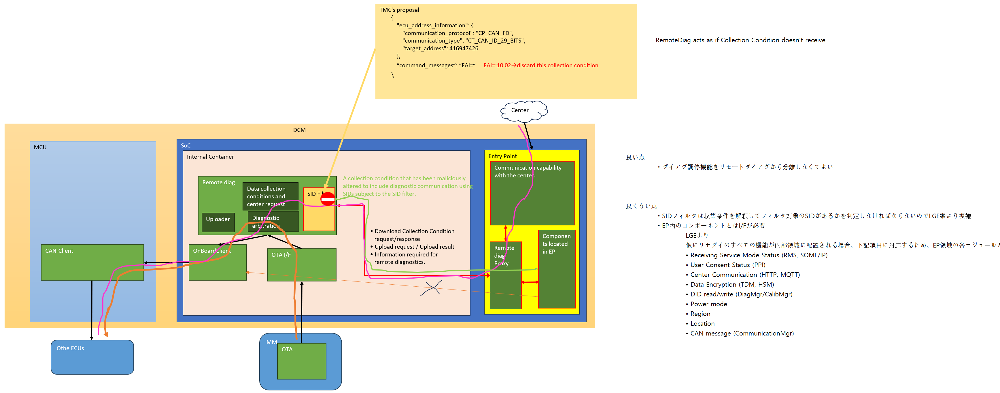

`tuyen2.nguyen:`

> How about changing communication path?
> MM → RemoteDiag → OnBoardClient -> MCU → DiagMgr

`gwansu.shin:`

> Hmm.. Following the history of the current SID36 path, would it be acceptable..?
> As I know, the current SID36 path was determined because of the performance.

`tuyen2.nguyen:`

> Actually, currently, SID 36 (except DCM) is going through MCU -> external ECU

`gwansu.shin:`

> Yes, sorry for missing, only for DCM of SID36 is the discussion point.

`tuyen2.nguyen:`

> yes, so we can consider cost between 2 cases
> Adding one more Service for only SID 36 of DCM
> Forwarding to MCU (likes SID 36 of other ECUs)
> I think #2 is easy way than #1
> How about your opinion?

`gwansu.shin:`

> If possible, I agree with your suggestion. That would be the best option.
> Following the current design, could you share the history in detail? From your explanation before, it was determined with HQ Archi(by.kim), right?
> 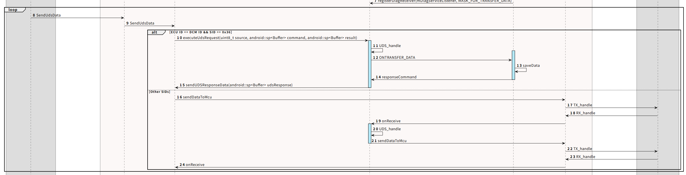

`tuyen2.nguyen:`

> Yes, in previous, SA BY.kim and MCU P.I.C discussed about this.
> I think this page: http://collab.lge.com/main/spaces/DCMNTCY/pages/2016280312/3.2.19+DoIP-+DoCAN+RemoteDiag
> 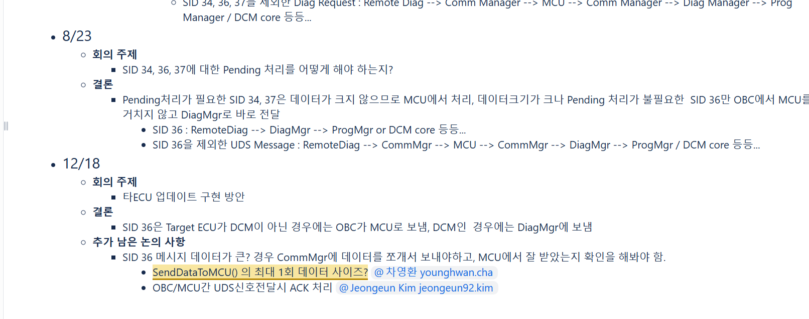

`gwansu.shin:`

> Thanks for sharing. I understood the history.
> I think your suggestion will be difficult to be applied, because of the test result at that time...
> http://collab.lge.com/main/spaces/DCMNTCY/pages/2312224711/Integrate+with+DoCAN_20240102
> 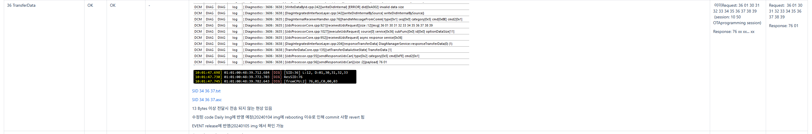
>
> I'm considering those sequences now.
> MM → RemoteDiag → RemoteDiag Proxy → DiagMgr
> MM → RemoteDiag → OBC → RemoteDiag → RemoteDiag Proxy → DiagMgr
> MM → RemoteDiag → OBC → DiagMgr // New IPC should be defined and implemented
> Create OBC Proxy
> I think No.4 would be better, because OBC inside of Internal Partition will be able to communicate with EP.
> I thought that OBC did not have any dependencies on components other than RDG/CommMgr/MCU/DiagMgr, so I had not considered OBC Proxy until now.

`gwansu.shin:`

> Mr. Tuyen
> Let me share the result of discussion.
>
> In conclusion, we took #2. (MM → RemoteDiag → OBC → RemoteDiag → RemoteDiag Proxy → DiagMgr)
>
> Your suggestion is not acceptable due to the previous test result. Transmitting such large packet to SPI twice will be a heavy operation.
> As I shared before, for DCM update, the maximum package size will be 180MB approximately.
>
> Considering the 512KB size currently being tested, even if a binder is used in the RemoteDiag → OBC → RemoteDiag path, performance aspects such as transfers using pointers also need to be taken into account. We will discuss this later about this implementation.

`tuyen2.nguyen:`

> Ok, thanks.
> I got the background of SA decision.
> I think we can discuss about implementation later, after SW design is confirmed.

`gwansu.shin:`

> Everyone (cc CUONG CAO DOAN/Part Leader/LGEDV CONNECTIVITY SERVICE TEAM)
> Dear all,
> Let me share the current situation.
>
> The architecture is fixed as below.
> Fixed
> : Those may also be changed if new issues are discovered
> SID Filter will be located inside of RDG
> All modules of EP will treat the RemoteDiag Proxy as if it were the actual RemoteDiag and operate accordingly
> SID36 for DCM (신관수/연구원/Connected Service 1 Unit: TUYEN DINH NGUYEN/LGEDV CONNECTIVITY SERVICE TEA...)
> Discussion on-going
> A separate AppMgr will be implemented in the Internal Container to manage the RemoteDiag lifecycle (launch, reboot, etc.)
> Currently, task is underway to run Tiger inside a container and implement Host-Proxy Services. (~7/10)
> In addition to this task being completed, AppMgr must be started to begin operations inside the Internal Container.
>
> However, I think RemoteDiag Proxy can start implementation in parallel.
> I will create a ticket for the work and provide the details soon.
> http://collab.lge.com/main/spaces/DCMNTCY/pages/3582109698/02.+EP+Internal+Partition+Container
> 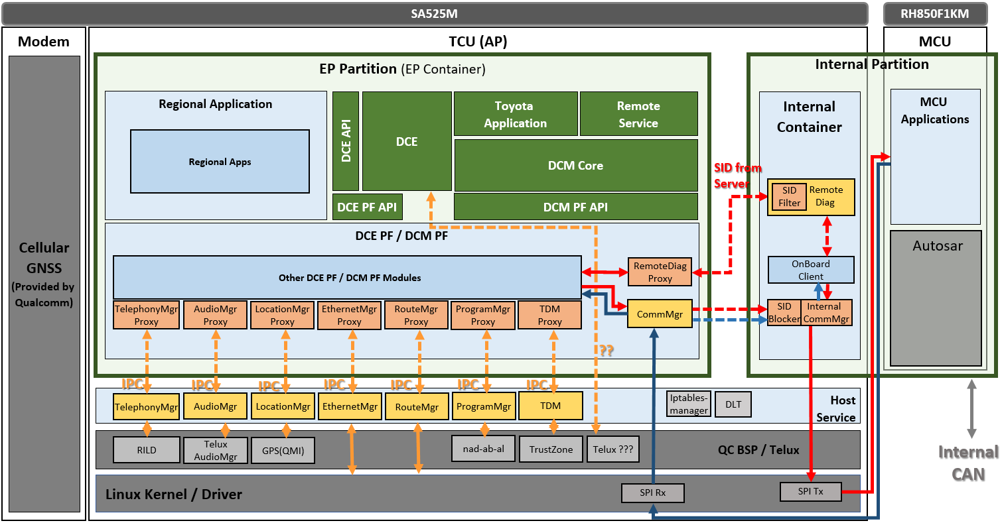
> +) The functional specification of the RDG reflecting the current architecture is scheduled to be published at 7/E.
> Please note that tasks such as CuRS and RS must also be performed anew at that time.
> If you have any questions or concerns, please let me know immediately.
> I'm sorry, the schedule is really tight..

`tuyen2.nguyen:`

> Hmm, I have a meeting with Mr. Phi tomorrow morning related to this situation.
> Is possible to share after that?

`tuyen2.nguyen:`
Can you share the reason that op#1 is not chosen?
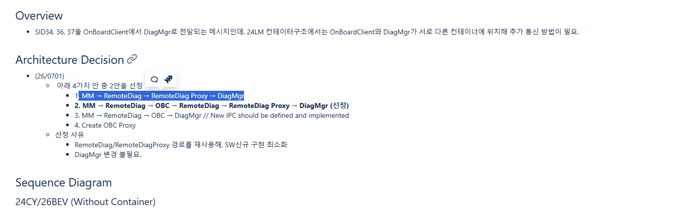

`gwansu.shin:`

> Communication between Container requires new IPC(socket). Each module should implement it independently.
> From our expectation, op#1 requires more effort than op#2, so we chose op#2.
>
> This is the guide of IPC(socket) that I shared to you before.
> http://collab.lge.com/main/spaces/DCMNTCY/pages/3688463772/06.+24LM+Design+for+module+in+the+Linux+Host

`tuyen2.nguyen:`

> Op#2: MM → RemoteDiag → OBC → RemoteDiag → RemoteDiag Proxy → DiagMgr
>
> Op#1: MM → RemoteDiag → OBC → RemoteDiag → RemoteDiag Proxy → DiagMgr
>
> I think the different point between Op#1 and OP#2 is adding OBC to communication sequence.
> All will be going back to RemoteDiag and come to RemoteDiag proxy
> I think we don't need go through OBC
> Hmm, Is there any points that I missed here?

`gwansu.shin:`

> Ah, I'm sorry. I confused with op#3.
> First, our basic concept is; all diag messages must go through OBC. If we take op#1, it will violate this policy.
> Also, it needs discussion with OEM.
>
> If op#2 is not acceptable due to technical problem, then we can suggest op#1 to OEM.
>
> Please let me know if I'm misunderstanding something.

`tuyen2.nguyen:`

> Mr.신관수/연구원/Connected Service 1 Unit
> Mr.PHI HOANG VU/LGEDV SOFTWARE ENGINEERING 1 TEAM
> Currently, we have no concern points related to new design (except my comment above related to OTA SID 36 communication sequence)
> I will re-study collab page and may ask you help me clear it

`gwansu.shin:`

> Dear all,
> I just sent mail to request you to start the implementation for RemoteDiag Proxy.
>
> I understand that the results to be implemented by July 17th will not be perfect.
> However, the outcome HQ desires is "support for proxy process running and communication." Items requiring multifaceted consideration, such as fail-safety, will be addressed at a later date.
>
> Please adhere to the schedule, and feel free to ask me any questions you may have.
>
> I will provide updates on necessary details as they arise.
>
> Please share me the concerns if you have, and please handle this with higher priority.

`tuyen2.nguyen:`

> Hmm, schedule is too tight.
> I have a question
> RemoteDiag proxy will be Service or Application?
> As I saw in Collab page, all guidelines are for Service proxy
> http://collab.lge.com/main/spaces/DCMNTCY/pages/3737980512/ManagerProxy+ManagerSocketServer+%EC%95%84%ED%82%A4%ED%85%8D%EC%B2%98+%EA%B0%80%EC%9D%B4%EB%93%9C

`gwansu.shin:`

> Yes, RDG Proxy will be a Service.

`tuyen2.nguyen:`

> Ok, thanks for your information.
> I will check and discuss with our members first, if there is any concern points, I will share to you

`tuyen2.nguyen:`

> Mr.신관수/연구원/Connected Service 1 Unit
> As design, HTTP/Dcemqttproxy will be in EP, so I think RemoteDiag Proxy will communicate with them instead of RemoteDiag
> Communication flow will be
> HTTP/Dcemqttproxy <-> RemoteDiag Proxy <-> RemoteDiag
> Am I correct?

`gwansu.shin:`

> RemoteDiag Proxy will be an Application, not a Service.
> All modules will think RemoteDiag Proxy as an actual RemoteDiag, so the Proxy should be an Application.
> I'm considering the lifecycle, priority for this. Please also share your concerns about this.

`tuyen2.nguyen:`

> So app_proc will be placed in 2 containers (EP/IP) to fork RemoteDiag application (IP) and RemoteDiagProxy (EP)?
> Am I correct?

`gwansu.shin:`

> Yes, correct. AppMgr will be located in IP/EP both, independently. startd, too.
> However, the IP's AppMgr is used for BOOT_COMPLETE broadcasts for modules within the IP.
> Other messages will be ignored by the App.
>
> Lifecycle-related operations, such as schedule resets, will be notified by the EP's AppMgr.

`tuyen2.nguyen:`

> Can you share me collab page for EP/IP communication protocol? (port range also needed)
> Can you share me SW image base for EP separation?

`gwansu.shin:`

> 1. Can you share me collab page for EP/IP communication protocol? (port range also needed)
>    I requested ENG guide for this.
>    Proxy and IPC(socket): http://collab.lge.com/main/spaces/DCMNTCY/pages/3741825871/eng+ManagerProxy+ManagerSocketServer+Architecture+Guide
>    Container: http://collab.lge.com/main/spaces/DCMNTCY/pages/3595850009/99.+Container (refer to the subpages)
> 2. Can you share me SW image base for EP separation?
>    This is the image, but there's issue in SOME/IP and Diag side. Currently, boot complete does not work.
>    It was built yesterday.
>    http://vbas.lge.com:8082/artifactory/toyota_26bev/24LM/dev_build/toyota_24lm_feature_EPSeparation_260623/toyota_24lm_feature_EPSeparation_260623/

`tuyen2.nguyen:`

> Today, Mr. Hoang tried and completed to create socket server in RemoteDiag proxy side
> Log is shared in http://jira.lge.com/issue/browse/TMCDCMLM-157
> We have a question about CAN message from CommMgr
> It will be as below
> MCU -> CommMgr -> InternalCommMgr -> InternalRemoteDiag
>
> Am I correct?

`gwansu.shin:`

> The CAN message will be like this.
> Tx: RemoteDiag - InternalCommMgr - MCU - ...
> Rx: MCU - CommMgr - RemoteDiag Proxy - RemoteDiag

`gwansu.shin:`

> Mr. Tuyen
> I have two questions.
>
> First, the basic policy for socket is like this.
> RemoteDiag should be the SocketServer, and RemoteDiag Proxy should be the Client
> But, it seems you implemented SocketServer in RemoteDiag Proxy. Could you explain the reason and how about change the location of SocketServer in RemoteDiag, not Proxy?
>
> Second, the attached log by Mr. Hoang is not including Internal Container's RemoteDiag. Where can I check Internal Container's RemoteDiag running state?

`tuyen2.nguyen:`

> Dear Mr 신관수/연구원/Connected Service 1 Unit,
> We currently have a concern regarding the Application Manager.
> There are several callbacks from the App Service to the RDG, as shown in the attached image.
> As we understand it, the App Service is running on both EP IPs. Therefore, both RDG and RDP should be able to receive these callbacks from the App Service. Could you please confirm whether our understanding is correct?
> 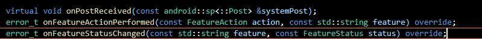

`gwansu.shin:`

> That is a good question.
>
> Basically, the plan is to ignore all messages from the Internal Container's AppMgr (excluding essential messages such as BOOT_COMPLETE).
> Since the goal is for RDP and RDG to function as a single unit, the RDG must receive messages from the EP Container's AppMgr via RDP.
> This means the RDG will have two receiving paths:
>
> (1) the EP's AppMgr via RDP
> (2) the Internal AppMgr
>
> We believe we can distinguish between (1) and (2) using an Adapter to receive them. (Personally, I think using sockets and binders is a good approach.)
> Please let me know if this answer is insufficient.
