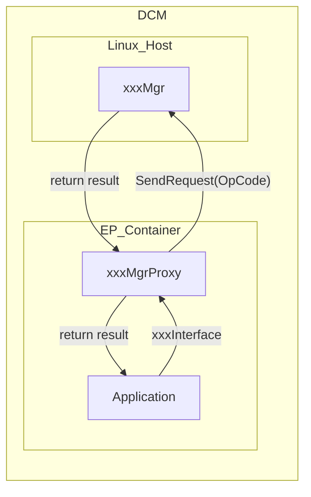

## Phân tích TMCDCMLM-124

### Thông tin cơ bản

| Trường       | Nội dung                                                   |
| ------------ | ---------------------------------------------------------- |
| **Ticket**   | TMCDCMLM-124                                               |
| **Summary**  | [24DCM-LM] EP분리 SW구현 - OnBoardClient/RemoteDiag : CS1U |
| **Status**   | ✅ Resolved                                                |
| **Priority** | P2                                                         |
| **Label**    | `EP_Separation`                                            |
| **Assignee** | 신관수 (gwansu.shin@lge.com)                               |
| **Reporter** | 최용성 (yongsung.choi@lge.com)                             |
| **Created**  | 2026-06-19                                                 |
| **Updated**  | 2026-07-31                                                 |

---

### Nội dung công việc

Ticket này thuộc nhánh **EP분리 (EP Separation)** trong dự án **24DCM-LM** (Toyota DCM Linux Module). Công việc cụ thể:

- Triển khai **Proxy I/F (Interface)** cho từng Manager song song với EP separation
- **Pilot**: AudioMgr được chọn để triển khai trước, chia sẻ kết quả vào ngày 6/25
- Deadline ban đầu: ~7/10

---

### Kiến trúc kỹ thuật (từ Confluence liên kết)

Confluence page: **"06. (24LM) Design for module in the Linux Host"** (page 3688463772)

**Hai điểm thiết kế chính:**

1. **OPCode Validity Check** — `xxxMgr` phía Linux Host kiểm tra tính hợp lệ của OpCode từ `xxxMgrProxy`:
   - OpCode có trong whitelist?
   - Payload size hợp lệ?
   - Received data size hợp lệ?
   - Nếu invalid → trả về `failed` về Application

2. **Boot-Complete handling** — `xxxMgrProxy` kết nối đến `xxxMgr` qua Unix socket (`AF_UNIX, SOCK_STREAM`), sau đó notify systemd bằng `sd_notify(0, "READY=1")` khi kết nối thành công

---

### Kết luận

Đây là ticket **SW implementation** cho cơ chế Proxy (MgrProxy) giúp Application trong EP Container giao tiếp với các Manager đang chạy phía Linux Host, trong khuôn khổ kiến trúc EP Separation của dự án 24DCM-LM (CS1U). Ticket đã **Resolved**.
