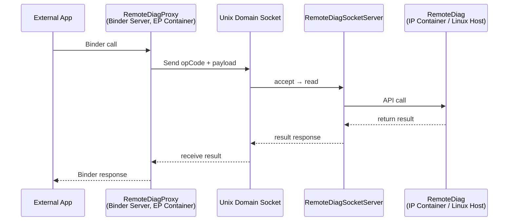

## Phân tích TMCDCMLM-157

### Thông tin cơ bản

| Trường       | Nội dung                                        |
| ------------ | ----------------------------------------------- |
| **Ticket**   | TMCDCMLM-157                                    |
| **Summary**  | [RemoteDiag] Implementation of RemoteDiag Proxy |
| **Parent**   | TMCDCMLM-124                                    |
| **Status**   | 🔵 In Progress                                  |
| **Priority** | P2                                              |
| **Assignee** | TUYEN DINH NGUYEN (tuyen2.nguyen@lge.com)       |
| **Reporter** | 신관수 (gwansu.shin@lge.com)                    |
| **Branch**   | `toyota_24lm_feature_EPSeparation_260623`       |

---

### Phạm vi công việc

> **Không** bao gồm: SID Filter, SID36 for DCM, Grade switching  
> **Chỉ** cover: bring-up để `RemoteDiagProxy` + `RemoteDiag` chạy được trong IP/EP Container, không crash.

---

### Action Items & Trạng thái

| #   | Nội dung                                                                                               | Owner    | Deadline         | Status       |
| --- | ------------------------------------------------------------------------------------------------------ | -------- | ---------------- | ------------ |
| 1   | Setup EP/IP Container environment (ATP, AppMgr trong IP Container, RemoteDiag chạy trong IP Container) | ATP team | ~~7/10~~ → 7/16  | ✅ Completed |
| 2   | Implement RemoteDiag Proxy (chạy trong EP Container)                                                   | RDG Dev  | ~~7/17~~ → ~7/24 | 🔄           |
| 3   | Verification: communication giữa RemoteDiag Proxy ↔ RemoteDiag                                         | RDG Dev  | ~~7/24~~ → ~7/31 | 🔄           |
| 4   | Viết Design Document (HLD)                                                                             | RDG HQ   | TBD              | ⏳           |

---

### Breakdown kỹ thuật (Item #2)

```
1. Protocol Design
   ├── Define SOCKET_PATH, OpCode, request/response structs
   └── Map I/Fs cho các Adapters

2. Create Separated Binary
   ├── ✅ Define remotediagproxy trong Makefile.am (7/14)
   ├── ✅ Update meta-layer (7/14)
   └── ✅ Run remotediagproxy trong EP Container (7/14)

3. EP-Internal Socket Communication
   ├── ✅ Server/Client definition & socket path mount (7/20)
   └── ✅ Simple communication verification (7/20)

4. Implement RemoteDiag Proxy Components
   ├── Binder part per API (serialize/deserialize)
   └── Socket part per API (serialize/deserialize)

5. Implement RemoteDiag Components
   ├── RemoteDiagSocketServer (OpCode dispatch in onRequest())
   └── Socket part per API (startServer, serialize/deserialize)

6. Verification (Happy case only)
   └── Verify một UDS communication
```

---

### Kiến trúc tổng thể (từ Architecture Guide)



**Nguyên tắc thiết kế:** Proxy và Service chạy **separate process** — nếu Service chết, Proxy vẫn sống và ngược lại.

---

### Tiến độ tổng hợp (tính đến 7/31)

- Infrastructure (binary, meta-layer, socket path): ✅ Xong
- Protocol design & component implementation: 🔄 Đang làm
- Verification & HLD document: ⏳ Chưa
