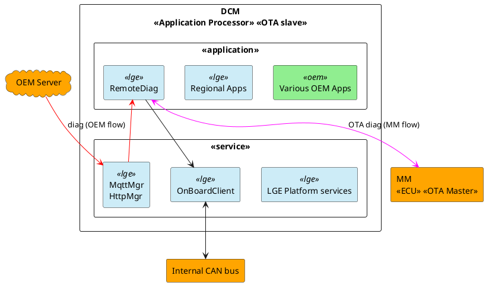
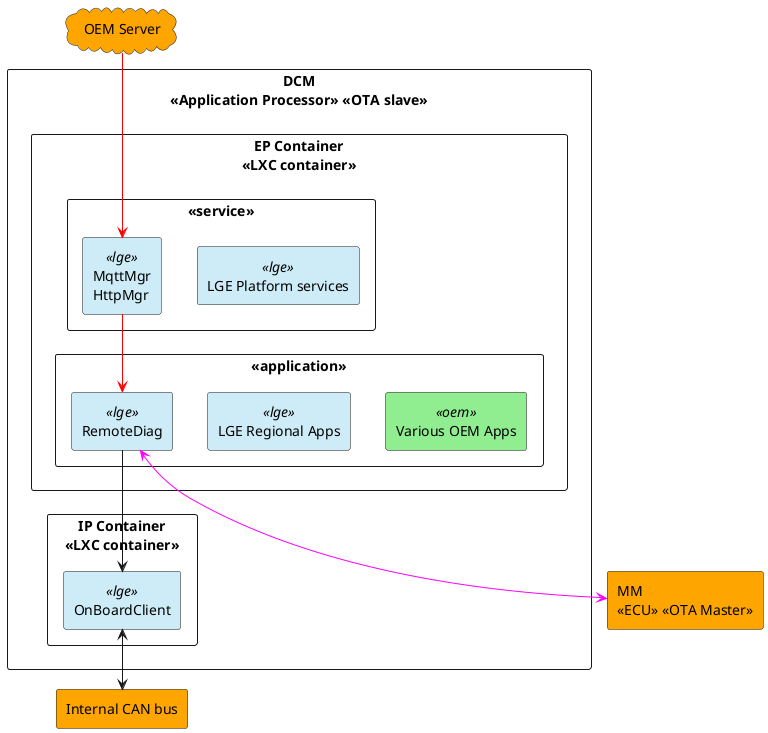
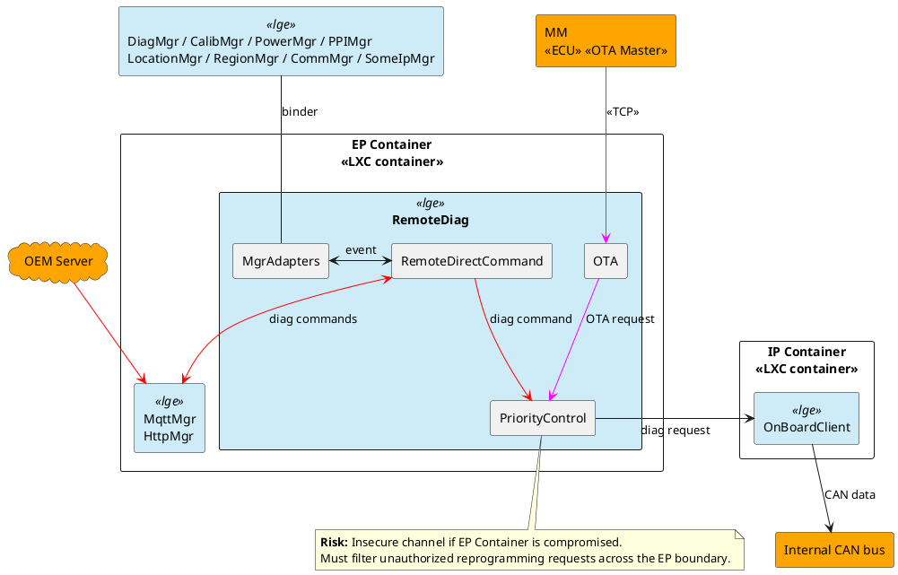
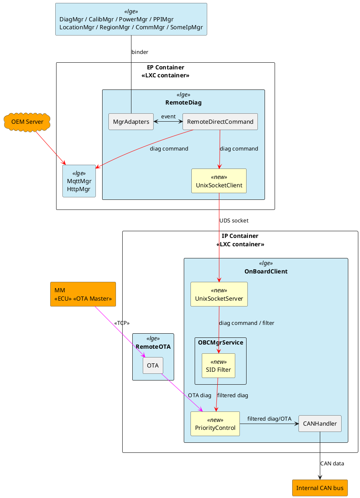
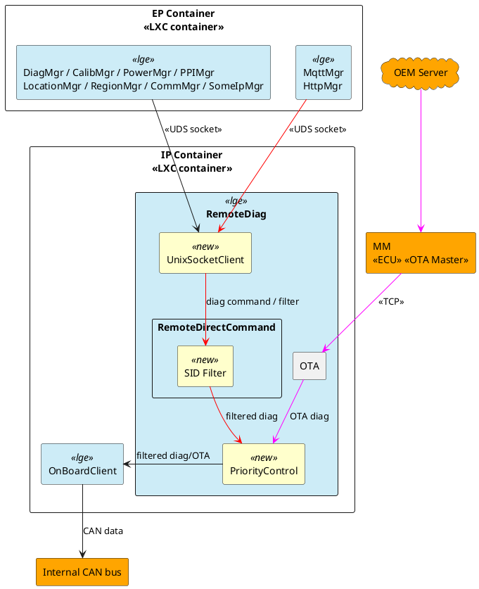
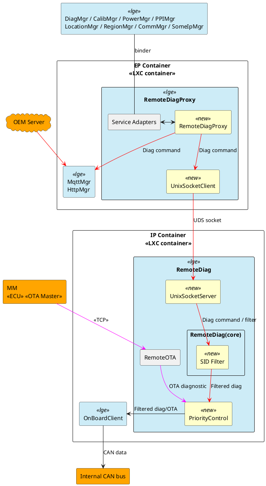
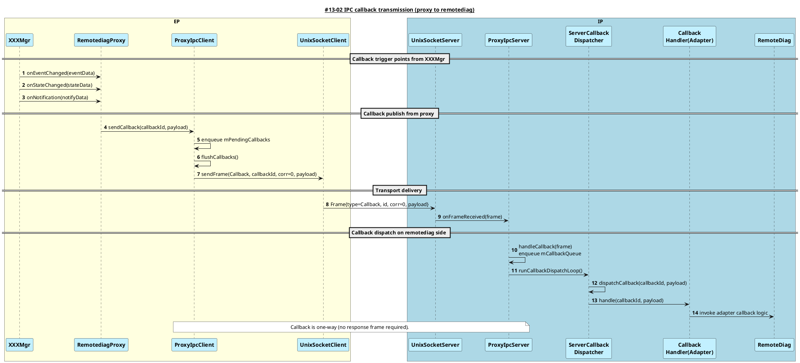
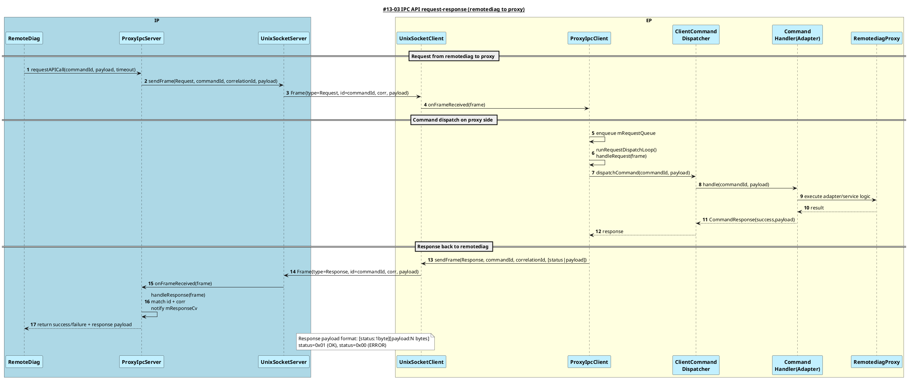
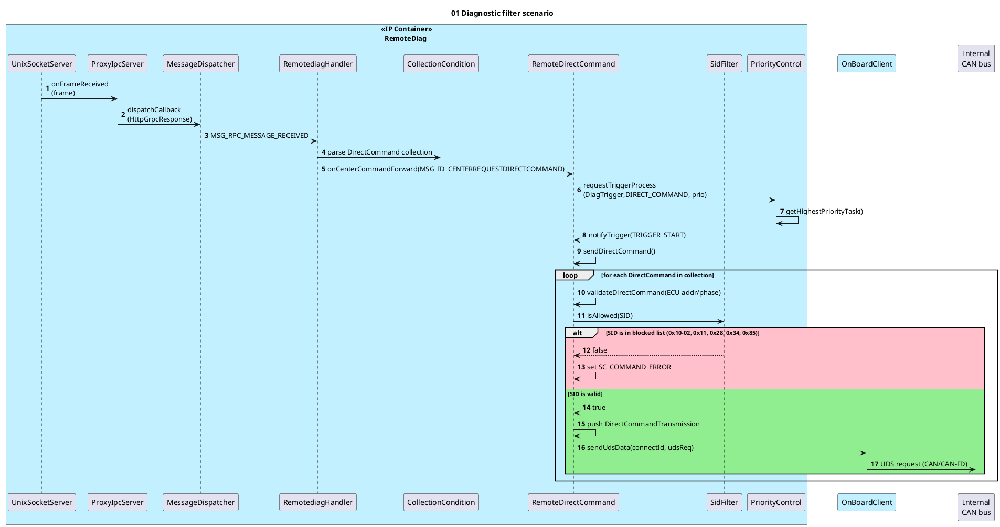

# Design of Secure Remote Diag on Container Separation Architecture

**Candidate:** Vu Hoang Phi (phi.vu)
**LGEDV – September 2026**

---

## Content

1. Context & Motivation
2. Problem
3. Quality Attribute
4. Design Alternative
5. Comparison & Decision
6. Implementation & Verification

---

## 1. Context & Motivation – Toyota 24DCM project

- **Toyota DCM:** a telematics platform providing connected vehicle services, including remote diagnostics from OEM server.
- Supports diagnostic communication and OTA updates through the Internal CAN bus.
- **Current architecture:** monolithic deployment model, with all components running in a single partition.

**System architecture migration:**

- Due to security, OEM wants to separate DCM into 2 partitions using LXC containers:
  - **EP container (Entry Point):** externally exposed network components.
  - **Internal container:** components which have access to CAN bus.

### Current system architecture (monolithic)



### New system architecture (containerized)



> **Legend:** System/subsystem boundary; Multiple Applications/Services (stacked box); LXC Container (blue border); Scope of this FE project (red dashed).
> Arrows — black: have communication; red: OEM server ↔ Internal CAN bus flow; magenta: MM ecu ↔ Internal CAN bus flow.
> Color — Green: OEM scope; Light blue: LGE scope; Orange: External; Gray: 3rd party.

---

## 2. Problem

- **RemoteDiag:** a module that processes diagnostics for each ECU and uploads diagnostic data to the OEM Server.
- RemoteDiag has 2 communication paths:
  - **with OEM Server:** performs direct diagnostic commands.
  - **with MM ecu:** OTA diagnostic update.
- **Risk:** the RemoteDiag ↔ MM path routes through the EP, which is insecure.
- OEM requests that unauthorized reprogramming requests should be filtered.

> RemoteDiag's internal architecture and communication should be redesigned to align with the new architecture.



### Functional requirements

| #     | Description                                                                                      |
| ----- | ------------------------------------------------------------------------------------------------ |
| FR-01 | The system shall block unauthorized diagnostic commands related to ECU reprogramming.            |
| FR-02 | The system shall route UDS diagnostic messages exchanged with the MM ECU entirely within the IP. |

---

## 3. Quality Attribute

| ID    | QA Scenario                                                                   | Measure                                                                                                                                                        | Type            | Priority |
| ----- | ----------------------------------------------------------------------------- | -------------------------------------------------------------------------------------------------------------------------------------------------------------- | --------------- | -------- |
| QA-01 | A compromised app/service sends reprogramming diagnostic to CAN               | Zero Reprogramming SIDs reaches the internal CAN.                                                                                                              | Security        | High     |
| QA-02 | MM ECU sends a diagnostic request via TCP to RemoteDiag                       | Zero diagnostic communication is found in EP. 100% of requests are handled within IP.                                                                          | Security        | High     |
| QA-03 | The new design preserves the original core responsibility of each component.  | No component is required to take responsibilities outside its originally defined role. No additional specification updates caused by responsibility expansion. | Modifiability   | High     |
| QA-04 | Existing software components (other than RemoteDiag) require minimal changes. | Number of components which need to be modified to align with the new design.                                                                                   | Maintainability | Medium   |
| QA-05 | Failure in OEM Center flow or MM ECU flow                                     | The other flow remains operational.                                                                                                                            | Availability    | Low      |

---

## 4. Design Alternative

### Alt-A: Split RemoteDiag

- Split RemoteDiag responsibilities into 2 apps:
  - **RemoteDiag (EP):** handles diag messages from OEM server.
  - **RemoteOTA (IP):** handles OTA diag message flows from MM ECU.
- **OnBoardClient** is responsible for reprogramming message filtering and diagnostic priority control.



### Alt-B: Move RemoteDiag

- Move RemoteDiag into the IP container.
- To maintain communication with the OEM server and other EP-side components, establish UDS socket connections to each module.

> **Trade-off — Maintainability:** All EP modules require cross-container IPC support, increasing implementation effort and code-change scope.



### Alt-C: Move RemoteDiag + Proxy

- Move RemoteDiag into the IP container.
- Add a new **RemoteDiagProxy (RDP)** component in the EP that acts as a transparent proxy.
  - EP modules continue to interact with RDP using their existing interface.
  - RDP forwards requests to RemoteDiag via a UDS socket channel.



---

## 5. Comparison & Decision

|                           | Alt-A – Split RemoteDiag                                                                                                                                   | Alt-B – Move RemoteDiag                                                                                                           | Alt-C – Move RemoteDiag + Proxy                                                                                       |
| ------------------------- | ---------------------------------------------------------------------------------------------------------------------------------------------------------- | --------------------------------------------------------------------------------------------------------------------------------- | --------------------------------------------------------------------------------------------------------------------- |
| **QA-01 Security**        | **High** — Unauthorized diagnostic commands are filtered.                                                                                                  | **High** — Unauthorized diagnostic commands are filtered.                                                                         | **High** — Unauthorized diagnostic commands are filtered.                                                             |
| **QA-02 Security**        | **High** — MM ECU diagnostic traffic remains within the EP container. (CyberSecurity team confirmed)                                                       | **High** — MM ECU diagnostic traffic remains within the EP container. (CyberSecurity team confirmed)                              | **High** — MM ECU diagnostic traffic remains within the EP container. (CyberSecurity team confirmed)                  |
| **QA-03 Modifiability**   | **Low** — RemoteDiag and OnBoardClient's responsibility is changed (diagnostic priority control is moved to OnBoardClient), requiring requirement updates. | **High** — Core responsibilities of existing components remain unchanged after migration.                                         | **High** — Core responsibilities of existing components remain unchanged after migration.                             |
| **QA-04 Maintainability** | **Medium** — 01 additional component is modified (OnBoardClient — implements UDS socket server and priority control).                                      | **Low** — 10 EP modules (PowerMgr, HttpMgr, …) have to implement cross-container UDS socket communication and fail-safe handling. | **High** — No changes required in existing modules. RemoteDiagProxy preserves the current binder interface.           |
| **QA-05 Availability**    | **High** — OEM center and MM ECU communication flows run in separate processes. Failure of one flow does not impact the other.                             | **Low** — OEM center and MM ECU communication flows share the same process. Failure in one flow may impact the other.             | **Low** — OEM center and MM ECU communication flows share the same process. Failure in one flow may impact the other. |
| **Decision**              | Rejected                                                                                                                                                   | Rejected                                                                                                                          | **Selected**                                                                                                          |

> **Rating:** High = Fully satisfy · Medium = Partially satisfy · Low = Not satisfy
> **Final decision: Alt-C**

---

## Detail design: Forward API call from proxy to remotediag



> **Related flow — IPC API request-response (remotediag to proxy):**



---

## Detail design: Filter scenario



---

## 6. Implementation and Verification

### SidFilter blocks reprogramming diagnostic requests

Runtime log evidence — `SidFilter` rejects reprogramming-related SIDs before they reach the internal CAN bus:

```text
3555985  66.2025  24LM  RDG  info  [ SidFilter.cpp : isAllowed : 45 ] SidFilter: blocked reprogramming-related request SID 11
3555986  66.2026  24LM  RDG  info  [ RemoteDirectCommand.cpp : validateDirectCommand : 344 ] Ecu list size = 1
3555987  66.2026  24LM  RDG  info  [ SidFilter.cpp : isAllowed : 45 ] SidFilter: blocked reprogramming-related request SID 28
3555989  66.2026  24LM  RDG  info  [ SidFilter.cpp : isAllowed : 45 ] SidFilter: blocked reprogramming-related request SID 85
3555991  66.2027  24LM  RDG  info  [ SidFilter.cpp : isAllowed : 45 ] SidFilter: blocked reprogramming-related request SID 10
3555993  66.2027  24LM  RDG  info  [ SidFilter.cpp : isAllowed : 45 ] SidFilter: blocked reprogramming-related request SID 34
```

### RemoteDiagProxy and RemoteDiag communication

Runtime log evidence — proxy IPC request/response across the UDS socket:

```text
[ VehicleManagerAdapter.cpp : registerServiceLocked : 99 ] Registed Vehicle Manager Service with PID: 1333
[ VehicleManagerAdapter.cpp : registerServiceLocked : 101 ] Registed MsgInd_CanRx_MET1S02
...
[ ProxyIpcServer.cpp : requestAPICall : 219 ] ProxyIpcServer: request start request=VehicleGetTripCounter path=/dev/socket/remotediag/remotediag_proxy.sock timeoutMs=2000 maxRetries=10
[ ProxyIpcServer.cpp : requestAPICall : 247 ] ProxyIpcServer: sending request=VehicleGetTripCounter payloadLen=0 frameSize=8
[ ProxyIpcClient.cpp : dispatchRequest : 381 ] ProxyIpcClient dispatchRequest: command=VehicleGetTripCounter(9002) payloadLen=0
[ ProxyIpcServer.cpp : requestAPICall : 300 ] ProxyIpcServer: request complete request=VehicleGetTripCounter status=OK payloadLen=5
```

---

## Q&A

_Thank you for listening._

---

# Appendix

## Diagnostic filtering requirements

### 5. Diagnostic Filtering Requirements

#### 5.1. Diagnostic Filtering Targets — 【MFGREQ_00005】

The ECU shall target the diagnostic request message excluding the legally applicable diagnostic communication addresses for diagnostic filtering. (For diagnostic communication addresses, refer to "Related Documents [2][10]".)

_(Supplement)_ "Reserve" in service tools and remote diagnostic response messages may be set in diagnostic request messages. Therefore, refer to the latest diagnostic address, and be careful not to exclude the diagnostic request message from the filtering target.

#### 5.2. Diagnostic Filtering Implementation Details — 【MFGREQ_00006】

The ECU shall discard diagnostic request messages in Table 5-1 by diagnostic filtering.

**Table 5-1 Diagnostic requests to be filtered (Phase 5, 6)**

| SID  | Description                                           |
| ---- | ----------------------------------------------------- |
| 0x10 | DiagnosticSessionControl — Programming session (0x02) |
| 0x11 | ECUReset                                              |
| 0x28 | CommunicationControl                                  |
| 0x34 | RequestDownload                                       |
| 0x85 | ControlDTCSetting                                     |

#### 5.3. Diagnostic Filtering Deactivate Conditions — 【MFGREQ_00007】

The ECU shall deactivate the diagnostic filtering of MFGREQ_00006 if the center connection device authentication completed successfully. For center connection device authentication, refer to "Related Documents [3]".

#### 5.4. Reactivating after Diagnostic Filtering deactivation — 【MFGREQ_00016】

After the deactivation of the diagnostic filtering in 【MFGREQ_00007】, the ECU shall reactivate the diagnostic filtering before the authentication state of the center connection device authentication transitions to "Unauthenticated" state. For the authentication state of the center connection device authentication, refer to "Related Documents [3]".

_TOYOTA MOTOR CORPORATION_
