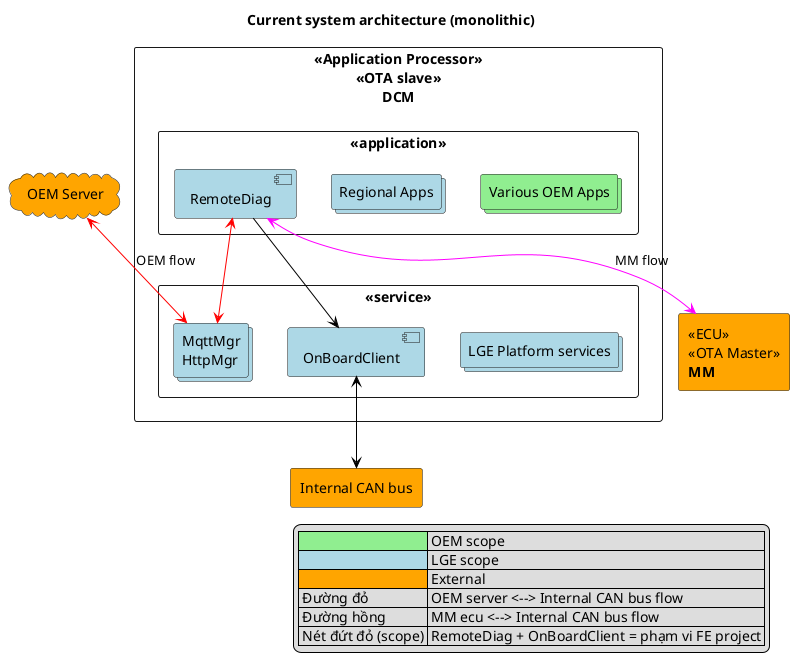
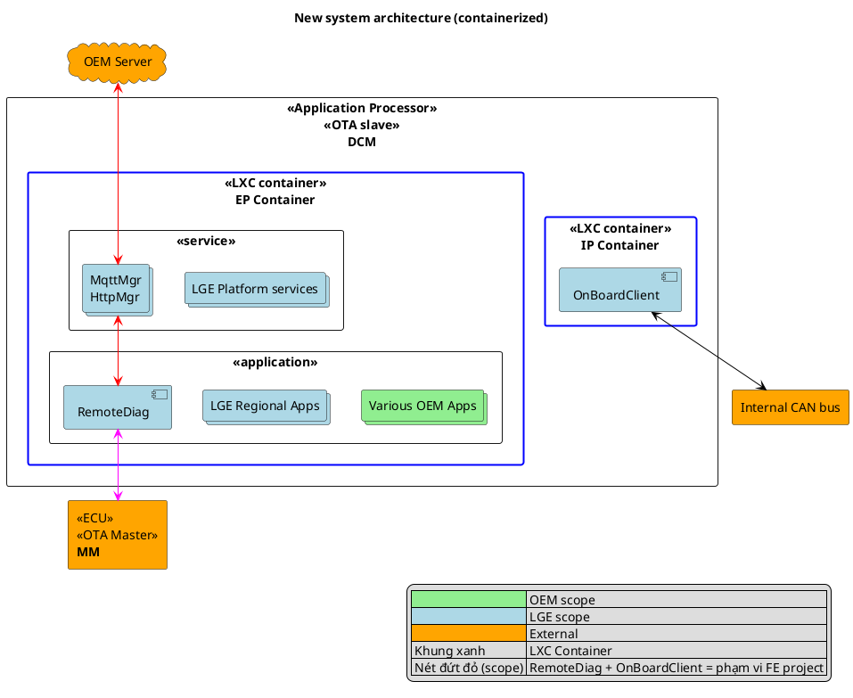
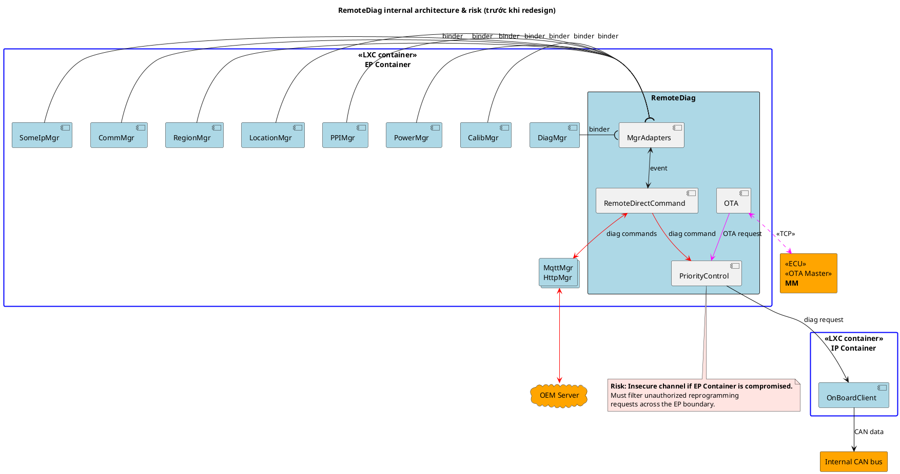
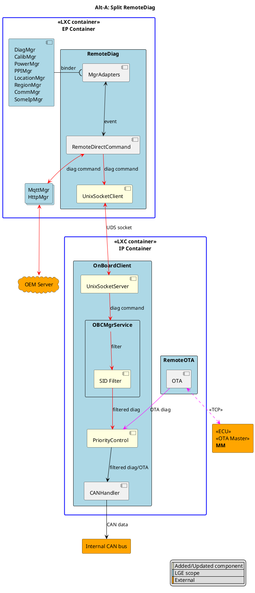
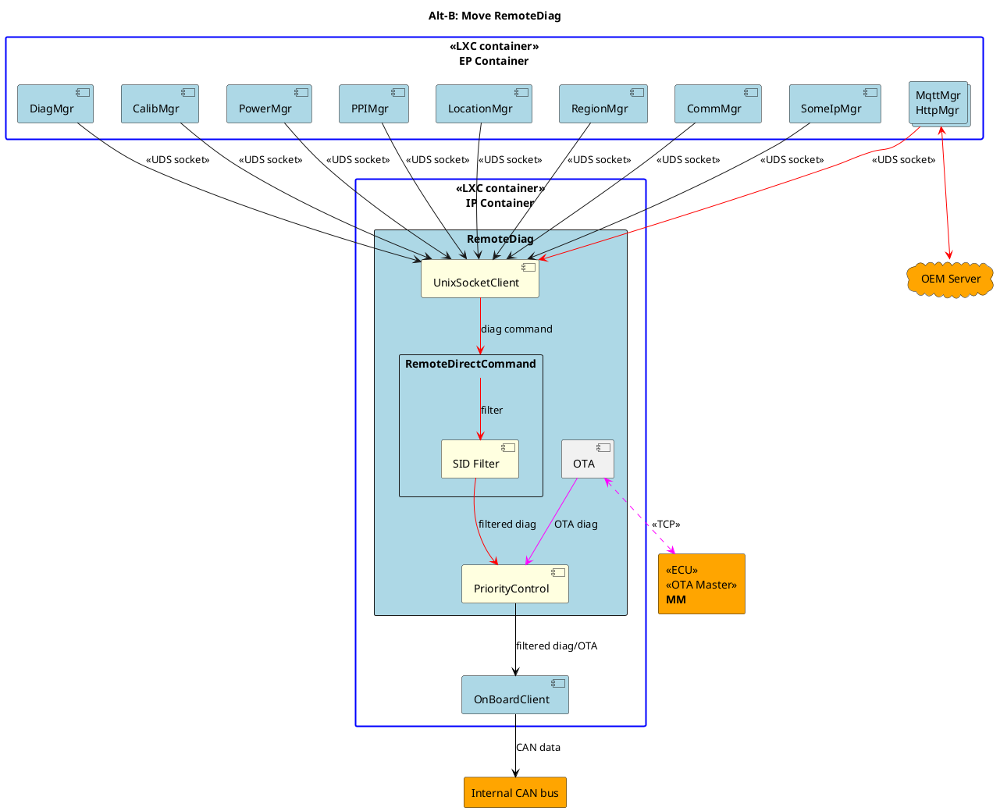
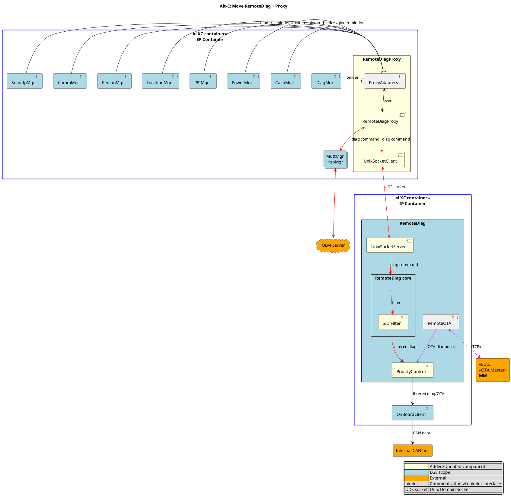
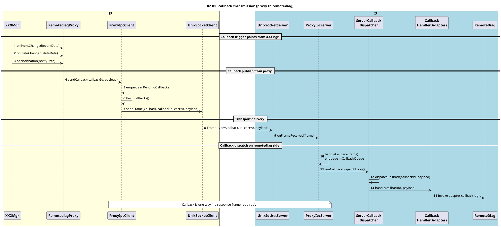
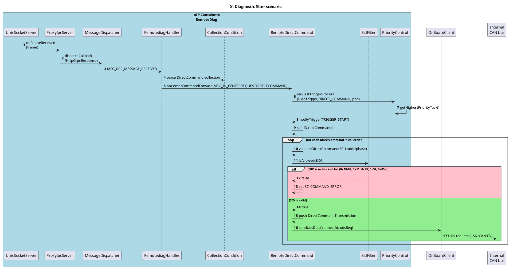

# Design of Secure Remote Diag on Container Separation Architecture

> Chuyển đổi từ file: `FE_phi.vu_Design of Secure Remote Diag on Container Separation Architecture_3rd.pptx`
> Candidate: Vu Hoang Phi (phi.vu) — LGEDV, September 2026

---

## Mục lục

1. [Context & Motivation](#1-context--motivation--toyota-24dcm-project)
2. [Problem](#2-problem)
3. [Quality Attribute](#3-quality-attribute)
4. [Design Alternative](#4-design-alternative)
5. [Comparison & Decision](#5-comparison--decision)
6. [Implementation & Verification](#6-implementation--verification)
7. [Appendix](#7-appendix)

---

## 1. Context & Motivation – Toyota 24DCM project

### 1.1. Slide 1 — Toyota DCM và kiến trúc hiện tại

**Toyota DCM là gì?**

- **Toyota DCM**: một telematics platform cung cấp các connected vehicle services, bao gồm remote diagnostics từ OEM server.
- Hỗ trợ diagnostic communication và OTA updates thông qua Internal CAN bus.
- DCM đóng vai trò **OTA slave**, phối hợp với MM ECU (**OTA Master**) trong các luồng OTA diagnostic update.

**Kiến trúc hiện tại (monolithic):**

- Monolithic deployment model: tất cả components (network-facing services, applications, CAN-access components) chạy trong **một partition duy nhất** trên cùng Application Processor.
- Các network components tiếp xúc trực tiếp với bên ngoài (MqttMgr/HttpMgr kết nối OEM server, RemoteDiag kết nối MM ECU qua TCP) **chạy chung partition** với OnBoardClient — component có quyền truy cập Internal CAN bus.

#### Sơ đồ kiến trúc hiện tại



### 1.2. Slide 2 — Migration sang kiến trúc 2 containers

**Tại sao phải tách thành 2 containers?** *(theo Toyota Cybersecurity Specification — Sheet D-1: "The internal CAN shall be separated from EP")*

- **Threat model (giả định của OEM)**: Entry Point (EP) partition — bao gồm cả OS — **bị compromise bởi phần mềm trái phép và bị chiếm quyền**. Vì EP chứa các network components tiếp xúc với bên ngoài (Internet, TCP), đây là bề mặt tấn công lớn nhất của DCM.
- Từ threat model đó, Toyota đưa ra các **mandatory requirements** (MLSREQ_00008, 00016; tách biệt logic MLSREQ_00023–00026):
  - Tài nguyên trong **Internal partition** (ROM, RAM, thanh ghi, …) không được phép bị ghi đè trái phép (tamper) bởi EP partition.
  - Internal partition **không được forward giao tiếp trái phép từ EP tới Internal CAN bus** (bao gồm cả DoS attack chiếm dụng bus).
  - Ngay cả khi SoC/VM phía EP bị compromise và **mạo danh DIAG client** gửi SID tới Internal CAN, request đó **phải bị loại bỏ**.
- ⇒ Giải pháp: tách DCM thành **2 partition độc lập sử dụng LXC containers**:
  - **EP container (Entry Point)**: các network components tiếp xúc với bên ngoài.
  - **Internal container (IP)**: các components có quyền truy cập CAN bus.

**Risk tiềm ẩn với 2 đường giao tiếp của RemoteDiag:**

| Đường giao tiếp | Risk khi EP bị compromise |
|---|---|
| **OEM server <-> RemoteDiag** (direct diagnostic commands qua MqttMgr/HttpMgr) | Attacker chiếm quyền EP có thể **mạo danh OEM server / inject unauthorized reprogramming diagnostic commands** (SID 0x10-02, 0x11, 0x28, 0x34, 0x85), và các lệnh này sẽ được RemoteDiag → OnBoardClient forward xuống Internal CAN → **reprogramming trái phép các ECU**. |
| **MM ECU <-> RemoteDiag** (OTA diagnostic update qua TCP) | Đường UDS diagnostic này **route qua EP — vùng insecure**. EP bị compromise có thể can thiệp/giả mạo diagnostic traffic giữa MM ECU và RemoteDiag, vi phạm yêu cầu D-1 là không để giao tiếp trái phép từ EP tiếp cận Internal CAN. |

#### Kiến trúc mới (containerized)



**Legends (từ slide gốc):**

| Ký hiệu | Ý nghĩa |
|---|---|
| Khung đen | System/subsystem boundary |
| Khung chồng | Multiple Applications/Multiple Services |
| Khung xanh dương | LXC Container |
| Nét đứt đỏ | Scope của FE project này |
| Mũi tên đen 2 chiều | Have communication |
| Mũi tên đỏ | OEM server <--> Internal CAN bus flow |
| Mũi tên hồng | MM ecu <--> Internal CAN bus flow |
| Màu xanh lá | OEM scope · Màu xanh nhạt: LGE scope · Cam: External · Xám: 3rd party |

---

## 2. Problem

- **RemoteDiag**: module xử lý diagnostic cho từng ECU và upload diagnostic data lên OEM Server.
- RemoteDiag có **2 đường communication**:
  - Với **OEM Server**: thực hiện direct diagnostic commands.
  - Với **MM ecu**: OTA diagnostic update.
- **Risk**: đường RemoteDiag <-> MM đi qua EP — vùng không an toàn (insecure).
- OEM yêu cầu: **các unauthorized reprogramming requests phải được filter**.
- ⇒ Internal architecture và communication của RemoteDiag cần được **redesign** để phù hợp với kiến trúc mới.

### Kiến trúc nội bộ RemoteDiag hiện tại và rủi ro



### Functional requirements

| # | Description |
|---|---|
| FR-01 | The system shall block unauthorized diagnostic commands related to ECU reprogramming. |
| FR-02 | The system shall route UDS diagnostic messages exchanged with the MM ECU entirely within the IP. |

---

## 3. Quality Attribute

| ID | QA Scenario | Measure | Type | Priority |
|---|---|---|---|---|
| QA-01 | Một app/service bị compromise gửi reprogramming diagnostic xuống CAN | Zero Reprogramming SIDs reaches the internal CAN. | Security | High |
| QA-02 | MM ECU gửi diagnostic request qua TCP tới RemoteDiag | Zero diagnostic communication is found in EP. 100% số requests được xử lý bên trong IP. | Security | High |
| QA-03 | Design mới bảo toàn core responsibility ban đầu của từng component | Không component nào phải nhận responsibility ngoài vai trò được định nghĩa ban đầu. Không phát sinh specification updates do responsibility expansion. | Modifiability | High |
| QA-04 | Các software components hiện có (ngoài RemoteDiag) chỉ cần thay đổi tối thiểu | Số lượng component cần modify để phù hợp với design mới | Maintainability | Medium |

---

## 4. Design Alternative

### 4.1. Alt-A: Split RemoteDiag

Tách responsibilities của RemoteDiag thành 2 apps:

- **RemoteDiag (EP)**: xử lý diag messages từ OEM server.
- **RemoteOTA (IP)**: xử lý OTA diag message flows từ MM ECU.
- **OnBoardClient** chịu trách nhiệm reprogramming message filtering và diagnostic priority control.



### 4.2. Alt-B: Move RemoteDiag

- Move RemoteDiag vào **IP container**.
- Để duy trì communication với OEM server và các EP-side component khác, thiết lập **UDS socket connections tới từng module**.



> **Trade-offs (notes từ slide):**
> Maintainability: tất cả EP modules đều phải hỗ trợ cross-container IPC, làm tăng implementation effort và phạm vi code-change.

### 4.3. Alt-C: Move RemoteDiag + Proxy

- Move RemoteDiag vào **IP container**.
- Thêm component mới **RemoteDiagProxy (RDP)** trong EP đóng vai trò **transparent proxy**:
  - Các EP modules tiếp tục tương tác với RDP qua **existing interface** (binder).
  - RDP forward requests tới RemoteDiag qua **UDS socket channel**.



---

## 5. Comparison & Decision

| | Alt-A – Split RemoteDiag | Alt-B: Move RemoteDiag | Alt-C: Move RemoteDiag + Proxy |
|---|---|---|---|
| **QA-01 Security** | **High** — Unauthorized diagnostic commands are filtered. | **High** — Unauthorized diagnostic commands are filtered. | **High** — Unauthorized diagnostic commands are filtered. |
| **QA-02 Security** | **High** — MM ECU diagnostic traffic remains within the EP container. (CyberSecurity team confirmed) | **High** — MM ECU diagnostic traffic remains within the EP container. (CyberSecurity team confirmed) | **High** — MM ECU diagnostic traffic remains within the EP container. (CyberSecurity team confirmed) |
| **QA-03 Modifiability** | **Low** — Responsibility của RemoteDiag và OnBoardClient bị thay đổi (diagnostic priority control chuyển sang OnBoardClient), cần cập nhật requirements. | **High** — Core responsibilities của các components hiện có không đổi sau migration. | **High** — Core responsibilities của các components hiện có không đổi sau migration. |
| **QA-04 Maintainability** | **Medium** — 01 component bổ sung phải modify (OnBoardClient — implement UDS socket server và priority control) | **Low** — 10 EP modules (PowerMgr, HttpMgr, …) phải implement cross-container UDS socket communication và fail-safe handling. | **High** — Không cần thay đổi các modules hiện có. RemoteDiagProxy giữ nguyên binder interface hiện tại. |
| **Decision** | ❌ Rejected | ❌ Rejected | ✅ **Selected** |

Thang đánh giá: **High** = Fully satisfy · **Medium** = Partially satisfy · **Low** = Not satisfy

> **Final decision: Alt-C**

---

## 6. Implementation & Verification

### 6.1. Detail design: Forward callback từ proxy sang RemoteDiag



### 6.2. Detail design: Filter scenario



### 6.3. Verification: SidFilter blocks reprogramming diagnostic requests

Log evidence — `SidFilter` block các reprogramming SIDs (0x10, 0x11, 0x28, 0x34, 0x85):

```log
[1397] [RemoteDirectCommand.cpp : sendDirectCommand : 629] Get location data success, latitude...
[1397] [RemoteDirectCommand.cpp : validateDirectCommand : 344] Ecu list size = 1
[1397] [SidFilter.cpp : isAllowed : 45] SidFilter: blocked reprogramming-related request SID 11
[1397] [RemoteDirectCommand.cpp : validateDirectCommand : 344] Ecu list size = 1
[1397] [SidFilter.cpp : isAllowed : 45] SidFilter: blocked reprogramming-related request SID 28
[1397] [RemoteDirectCommand.cpp : validateDirectCommand : 344] Ecu list size = 1
[1397] [SidFilter.cpp : isAllowed : 45] SidFilter: blocked reprogramming-related request SID 85
[1397] [RemoteDirectCommand.cpp : validateDirectCommand : 344] Ecu list size = 1
[1397] [SidFilter.cpp : isAllowed : 45] SidFilter: blocked reprogramming-related request SID 10
[1397] [RemoteDirectCommand.cpp : validateDirectCommand : 344] Ecu list size = 1
[1397] [SidFilter.cpp : isAllowed : 45] SidFilter: blocked reprogramming-related request SID 34
```

Log MqttManagerAdapter đăng ký service qua proxy:

```log
[1109] [MqttManagerAdapter.cpp : registerService : 40] MqttManagerAdapter registerService
[1109] [MqttManagerAdapter.cpp : registerServiceLocked : 84] MqttManagerAdapter: registered successfully
[1001] [ProxyIpcServer.cpp : requestAPICall : 204] ProxyIpcServer: request start request=MqttSubscribeTopic path=/dev/socket/remotediag/remotediag_proxy.sock timeoutMs=2000 maxRetries=10
[1001] [ProxyIpcServer.cpp : requestAPICall : 232] ProxyIpcServer: sending request=MqttSubscribeTopic payloadLen=17 frameSize=25
[1001] [ProxyIpcServer.cpp : requestAPICall : 285] ProxyIpcServer: request complete request=MqttSubscribeTopic status=OK payloadLen=1
[1220] [ProxyIpcClient.cpp : dispatchRequest : 380] ProxyIpcClient dispatchRequest: command=MqttSubscribeTopic(4001) payloadLen=17
[2??] [MqttManagerAdapter.cpp : subscribeTopic : 113] MqttManagerAdapter: subscribeTopic success vin=?????
```

### 6.4. Verification: RemoteDiagProxy và RemoteDiag communication

Log evidence — communication 2 chiều RDP (RemoteDiagProxy) ↔ RDG (RemoteDiag) qua UDS socket:

```log
RDP | [1342] [VehicleManagerAdapter.cpp : registerServiceLocked : 99 ] Registed Vehicle Manager Service with PID: 1333
RDP | [1342] [VehicleManagerAdapter.cpp : registerServiceLocked : 101] Registed MsgInd_CanRx_MET1S02
RDP | [1342] [VehicleManagerAdapter.cpp : registerServiceLocked : 104] Registed MsgInd_CanRx_MET1S34
RDP | [1342] [VehicleManagerAdapter.cpp : registerServiceLocked : 107] Registed MsgInd_CanRx_MET1S35
RDP | [1342] [VehicleManagerAdapter.cpp : registerServiceLocked : 110] Registed MsgInd_CanRx_MET1S36
RDP | [1342] [VehicleManagerAdapter.cpp : registerServiceLocked : 113] Registed MsgInd_CanRx_MET1S37
RDP | [1342] [VehicleManagerAdapter.cpp : registerServiceLocked : 116] Registed MsgInd_CanRx_ENG1G90
RDP | [1342] [VehicleManagerAdapter.cpp : registerServiceLocked : 123] Registed Timeout MsgInd_CanRx_MET1S34
RDG | [1215] [ProxyIpcServer.cpp : requestAPICall : 219] ProxyIpcServer: request start request=VehicleGetTripCounter path=/dev/socket/remotediag/remotediag_proxy.sock timeoutMs=2000 maxRetries=10
RDG | [1215] [ProxyIpcServer.cpp : requestAPICall : 247] ProxyIpcServer: sending request=VehicleGetTripCounter payloadLen=0 frameSize=8
RDP | [1456] [ProxyIpcClient.cpp : dispatchRequest : 381] ProxyIpcClient dispatchRequest: command=VehicleGetTripCounter(9002) payloadLen=0
RDG | [1215] [ProxyIpcServer.cpp : requestAPICall : 300] ProxyIpcServer: request complete request=VehicleGetTripCounter status=OK payloadLen=5
```

---

## Q&A

Thank you for listening.

---

## 7. Appendix

### Diagnostic filtering requirements (Toyota spec trích dẫn)

#### 5.1. Diagnostic Filtering Targets 【MFGREQ_00005】

The ECU shall target the diagnostic request message excluding the legally applicable diagnostic communication addresses for diagnostic filtering. (For diagnostic communication addresses, refer to "Related Documents [2][10]").

*(Supplement)* "Reserve" in service tools and remote diagnostic response messages may be set in diagnostic request messages. Therefore, refer to the latest diagnostic address, and be careful not to exclude the diagnostic request message from the filtering target.

#### 5.2. Diagnostic Filtering Implementation Details 【MFGREQ_00006】

The ECU shall discard diagnostic request messages in Table 5-1 by diagnostic filtering.

**Table 5-1 — Diagnostic requests to be filtered (Phase 5, 6):**

| SID | Description |
|---|---|
| 0x10 | DiagnosticSessionControl — Programming session (0x02) |
| 0x11 | ECUReset |
| 0x28 | CommunicationControl |
| 0x34 | RequestDownload |
| 0x85 | ControlDTCSetting |

#### 5.3. Diagnostic Filtering Deactivate Conditions 【MFGREQ_00007】

The ECU shall deactivate the diagnostic filtering of MFGREQ_00006 if the center connection device authentication completed successfully. For center connection device authentication, refer to "Related Documents [3]".

#### 5.4. Reactivating after Diagnostic Filtering deactivation 【MFGREQ_00016】

After the deactivation of the diagnostic filtering in 【MFGREQ_00007】, the ECU shall reactivate the diagnostic filtering before the authentication state of the center connection device authentication transitions to "Unauthenticated" state. For the authentication state of the center connection device authentication, refer to "Related Documents [3]".
