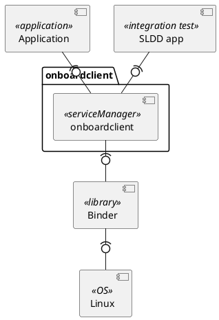
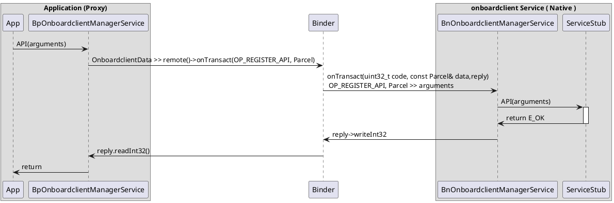
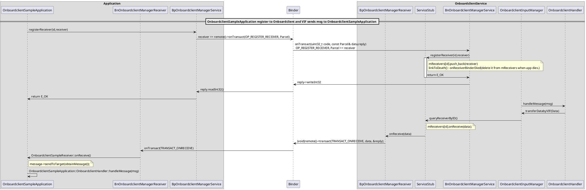

# About This Document
## Document Information

| Issuing authority  | LG VC Smart SW Platform Team      |
| ------------------ | --------------------------------- |
| Configuration ID   | LGE_SDD_onboardclientManagerService |
| Status of document | Approved / Released |

## Revision History
| Version | Date       | Comment         | Author                             | Approver |
| ------- | ---------- | --------------- | ---------------------------------- | -------- |
// @CGA_VARIANT_START{"__GLOBAL_SCOPE__:__VERSION_HISTORY__:variant"}
| 0.9     | 2018-07-20 | Initial Release | Charles.Lee <cheoljoo.lee@lge.com> |          |
// @CGA_VARIANT___END{"__GLOBAL_SCOPE__:__VERSION_HISTORY__:variant"}

## Overview
- This document specifies the Software Detailed Design (SDD) for the onboardclient service including the static design, dynamic design.
    - OnboardClient service manager

## Scope
- This document identifies the class consisting of each component from SAD, and describes the behaviors of those classes to accomplish the requirements upon them.

## Audience
- The target audience of this document is:
    - Software architect who will evaluate the design of the software
    - Component developer who will implement the design in actual code
    - Native application developers who need to use onboardclient service
    - Cheetah project participants who want to understand the low level design of the onboardclient service
    - Test engineers who verify this component

## Related Documents
- SAD (Software Architectural Design)

## Conventions
- This document remarks “NOTE” as follows

NOTE
> To describe information that helps audience’s conveniences.

## Acronyms
| Acronym | Description                   |
| ------- | ----------------------------- |
| SAD     | Software Architectural Design |
| SDD     | Software Detailed Design      |
// @CGA_VARIANT_START{"__GLOBAL_SCOPE__:__ACRONYMS__:variant"}
| etc     | add your acronyms             |
// @CGA_VARIANT___END{"__GLOBAL_SCOPE__:__ACRONYMS__:variant"}

## Glossary (Optional)
| Glossary        | Description      |
| --------------- | ---------------- |
| onboardclient | OnboardClient service manager |
// @CGA_VARIANT_START{"__GLOBAL_SCOPE__:__GLOSSARY__:variant"}
| etc             | add your glossary             |
// @CGA_VARIANT___END{"__GLOBAL_SCOPE__:__GLOSSARY__:variant"}

# onboardclient Component
## External Design

// @CGA_VARIANT_START{"__GLOBAL_SCOPE__:__EXTERNAL_DESIGN__:variant"}
- add your comments for external design
// @CGA_VARIANT___END{"__GLOBAL_SCOPE__:__EXTERNAL_DESIGN__:variant"}

- Dynamic Design

// @CGA_VARIANT_START{"__GLOBAL_SCOPE__:__DYNAMIC1_DESIGN__:variant"}
- Step : add your comments for dynamic design
    - use markdown format
// @CGA_VARIANT___END{"__GLOBAL_SCOPE__:__DYNAMIC1_DESIGN__:variant"}

- **sendUdsData** : send UDS request

## Internal Design
- 

// @CGA_VARIANT_START{"__GLOBAL_SCOPE__:__STATIC_DESIGN__:variant"}
- add your comments for static design of internal design
    - use markdown format
// @CGA_VARIANT___END{"__GLOBAL_SCOPE__:__STATIC_DESIGN__:variant"}

- The class diagram for the onboardclient is shown below:
    - 

// @CGA_VARIANT_START{"__GLOBAL_SCOPE__:__CLASS_DESIGN__:variant"}
- add your comments for class design of internal design
    - use markdown format
// @CGA_VARIANT___END{"__GLOBAL_SCOPE__:__CLASS_DESIGN__:variant"}

- Dynmaic Design
    - this is sequence diagram how to do operations through binder.

// @CGA_VARIANT_START{"__GLOBAL_SCOPE__:__DYNAMIC2_DESIGN__:variant"}
- add your comments for dynamic design of internal design
    - use markdown format
// @CGA_VARIANT___END{"__GLOBAL_SCOPE__:__DYNAMIC2_DESIGN__:variant"}
