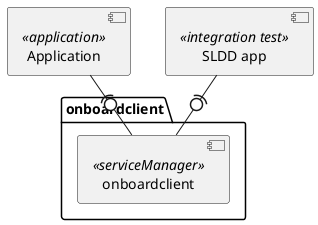

# Introduction
## Revision History
| Version | Date       | Comment         | Author                             | Approver |
| ------- | ---------- | --------------- | ---------------------------------- | -------- |
// @CGA_VARIANT_START{"__GLOBAL_SCOPE__:__VERSION_HISTORY__:variant"}
| 0.1     | 2018-08-17 | Initial Release | Who.Lee <who.lee@gmail.com>        |          |
// @CGA_VARIANT___END{"__GLOBAL_SCOPE__:__VERSION_HISTORY__:variant"}

## Purpose
- This document is a Software Requirement Specification (SRS) of onboardclient Manager . This SRS is a result which describes software requirements analyzed by LGE. Each software requirement in this document is traced from the System Requirements Specifications (SysRS).

## Scope
- SW Overview, SW Main Features
- External Interface Requirements
- Functional Requirements
- Quality Attributes (Non-functional requirements)
- Constraints

## Audience
- The target audience of this document is:
    - OEM (Customer) , Requirement engineer, S ystem/ Software architect, Component developer, Test Engineer

# SW Overview
// @CGA_VARIANT_START{"__GLOBAL_SCOPE__:__OVERVIEW__:variant"}
- Overview
    - Overview in detail
    - use markdown format
// @CGA_VARIANT___END{"__GLOBAL_SCOPE__:__OVERVIEW__:variant"}

## SW Main Features
- Features
    - **sendUdsData** : send UDS request

// @CGA_VARIANT_START{"__GLOBAL_SCOPE__:__FEATURES__:variant"}
- additional features
    - use markdown format
// @CGA_VARIANT___END{"__GLOBAL_SCOPE__:__FEATURES__:variant"}

# External Interface Requirements
## SW Context
- The SW context diagram shows the interface between following external components .

## SW Interface

|No | Interface Name |Description                                       |Remarks|
|---|----------------|--------------------------------------------------|-------|
| 1 | sendUdsData | send UDS request | |
// @CGA_VARIANT_START{"__GLOBAL_SCOPE__:__SW_INTERFACES__:variant"}
| - | new interface | add description  |  | |
// @CGA_VARIANT___END{"__GLOBAL_SCOPE__:__SW_INTERFACES__:variant"}

# Functional Requirements

| FR              | Description                                | Limitation | OEM Dependency |
| --------------- | ------------------------------------------ | ---------- | -------------- |
// @CGA_VARIANT_START{"__GLOBAL_SCOPE__:__FUNCTIONAL_REQUIREMENT__:variant"}
| TIDL-FR-001  | This is example (replace with your requirement)     |            |                |
| TIDL-FR-002  | This is another example  (replace with your requirement)  |            |                |
// @CGA_VARIANT___END{"__GLOBAL_SCOPE__:__FUNCTIONAL_REQUIREMENT__:variant"}

// @CGA_VARIANT_START{"__GLOBAL_SCOPE__:__IF_YOU_NEED__:variant"}
# Quality Attributes

# Design Constraints
## Business Constraints

## Technical Constraints

## Standard & Regulations

// @CGA_VARIANT___END{"__GLOBAL_SCOPE__:__IF_YOU_NEED__:variant"}
