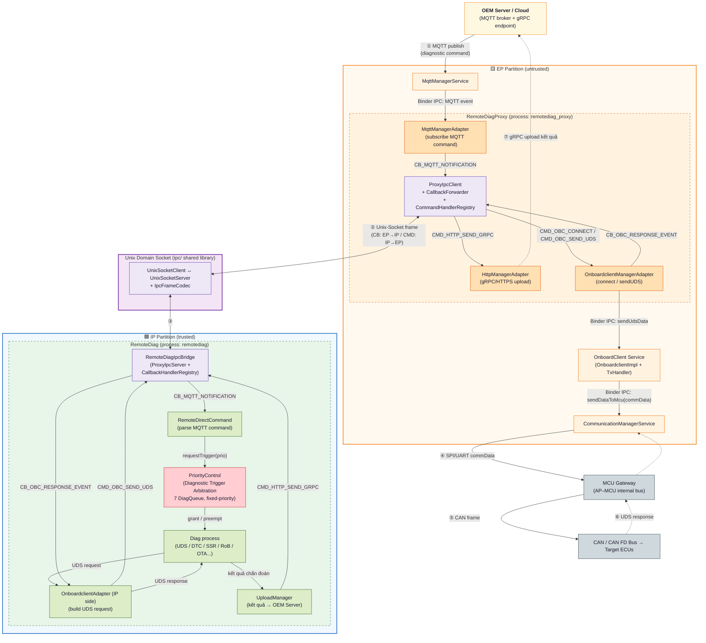

```mermaid
flowchart TB
    OEM["<b>OEM Server / Cloud</b><br/>(MQTT broker + gRPC endpoint)"]:::external

    subgraph EP["🟨 EP Partition (untrusted)"]
        direction TB
        subgraph PROXY["RemoteDiagProxy (process: remotediag_proxy)"]
            direction TB
            EP_MQTT["MqttManagerAdapter<br/>(subscribe MQTT command)"]:::adapter
            EP_HTTP["HttpManagerAdapter<br/>(gRPC/HTTPS upload)"]:::adapter
            EP_OBC["OnboardclientManagerAdapter<br/>(connect / sendUDS)"]:::adapter
            EP_IPC["ProxyIpcClient<br/>+ CallbackForwarder<br/>+ CommandHandlerRegistry"]:::ipc
            EP_MQTT -->|"CB_MQTT_NOTIFICATION"| EP_IPC
            EP_IPC -->|"CMD_HTTP_SEND_GRPC"| EP_HTTP
            EP_IPC -->|"CMD_OBC_CONNECT / CMD_OBC_SEND_UDS"| EP_OBC
            EP_OBC -->|"CB_OBC_RESPONSE_EVENT"| EP_IPC
        end
        MQTTSVC["MqttManagerService"]:::binder
        OBCSVC["OnboardClient Service<br/>(OnboardclientImpl + TxHandler)"]:::binder
        COMMGR["CommunicationManagerService"]:::binder
        MQTTSVC -->|"Binder IPC: MQTT event"| EP_MQTT
        EP_OBC -->|"Binder IPC: sendUdsData"| OBCSVC
        OBCSVC -->|"Binder IPC: sendDataToMcu(commData)"| COMMGR
    end

    subgraph TRANSPORT["Unix Domain Socket (ipc/ shared library)"]
        USOCK["UnixSocketClient ↔ UnixSocketServer<br/>+ IpcFrameCodec"]:::ipc
    end

    subgraph IP["🟦 IP Partition (trusted)"]
        direction TB
        subgraph RDG["RemoteDiag (process: remotediag)"]
            direction TB
            IP_IPC["RemoteDiagIpcBridge<br/>(ProxyIpcServer +<br/>CallbackHandlerRegistry)"]:::ipc
            DIRCMD["RemoteDirectCommand<br/>(parse MQTT command)"]:::core
            PRIO["PriorityControl<br/>(Diagnostic Trigger Arbitration<br/>7 DiagQueue, fixed-priority)"]:::arb
            UDS["Diag process<br/>(UDS / DTC / SSR / RoB / OTA...)"]:::core
            IP_OBC["OnboardclientAdapter (IP side)<br/>(build UDS request)"]:::core
            UPLOAD["UploadManager<br/>(kết quả → OEM Server)"]:::core
            IP_IPC -->|"CB_MQTT_NOTIFICATION"| DIRCMD
            DIRCMD -->|"requestTrigger(prio)"| PRIO
            PRIO -->|"grant / preempt"| UDS
            UDS -->|"UDS request"| IP_OBC
            IP_OBC -->|"CMD_OBC_SEND_UDS"| IP_IPC
            IP_IPC -->|"CB_OBC_RESPONSE_EVENT"| IP_OBC
            IP_OBC -->|"UDS response"| UDS
            UDS -->|"kết quả chẩn đoán"| UPLOAD
            UPLOAD -->|"CMD_HTTP_SEND_GRPC"| IP_IPC
        end
    end

    MCU["MCU Gateway<br/>(AP–MCU internal bus)"]:::hw
    CAN["CAN / CAN FD Bus → Target ECUs"]:::hw

    OEM -->|"① MQTT publish<br/>(diagnostic command)"| MQTTSVC
    EP_IPC <-->|"② Unix-Socket frame<br/>(CB: EP→IP / CMD: IP→EP)"| USOCK
    USOCK <-->|"③"| IP_IPC
    COMMGR -->|"④ SPI/UART commData"| MCU
    MCU -->|"⑤ CAN frame"| CAN
    CAN -.->|"⑥ UDS response"| MCU
    MCU -.-> COMMGR
    EP_HTTP -.->|"⑦ gRPC upload kết quả"| OEM

    classDef external fill:#FFF8E1,stroke:#F57F17,color:#1A1A2E
    classDef adapter fill:#FFE0B2,stroke:#E65100,color:#1A1A2E
    classDef ipc fill:#EDE7F6,stroke:#5E35B1,color:#1A1A2E
    classDef binder fill:#FFF3E0,stroke:#EF6C00,color:#1A1A2E
    classDef core fill:#DCEDC8,stroke:#33691E,color:#1A1A2E
    classDef arb fill:#FFCDD2,stroke:#C62828,color:#1A1A2E
    classDef hw fill:#CFD8DC,stroke:#37474F,color:#1A1A2E
    style EP fill:#FFF9EF,stroke:#F57F17,stroke-width:2px
    style IP fill:#F1F8FE,stroke:#1565C0,stroke-width:2px
    style PROXY fill:#FFF3E0,stroke:#E65100,stroke-dasharray:5 5
    style RDG fill:#E8F5E9,stroke:#2E7D32,stroke-dasharray:5 5
    style TRANSPORT fill:#F3E5F5,stroke:#6A1B9A,stroke-width:2px
```