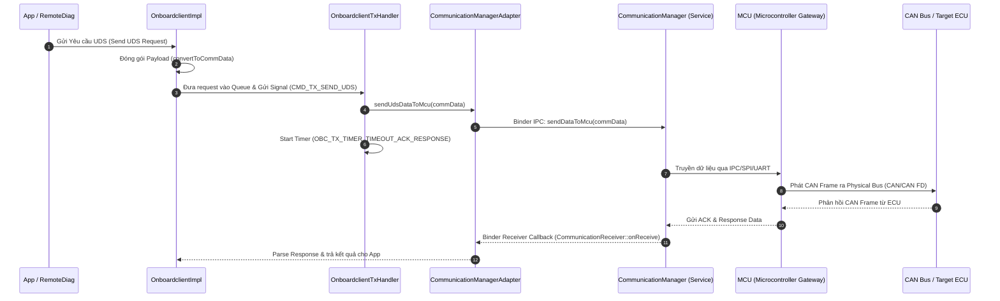

# Phân tích Luồng Gửi Dữ Liệu từ OBC (OnboardClient) xuống CAN Bus

Dưới đây là chi tiết kiến trúc và luồng xử lý dữ liệu chẩn đoán (UDS/CAN) từ **OnboardClient (OBC)** xuống **CAN Bus** trong hệ thống.

---

## 1. Tổng Quan Kiến Trúc (Architecture Overview)

Quá trình gửi dữ liệu UDS từ OBC xuống CAN Bus đi qua các tầng sau:



---

## 2. Chi Tiết Luồng Xử Lý Theo Mã Nguồn (Code Flow Details)

### Bước 1: Khởi tạo kết nối CAN Channel (`connectCanClient`)
Trước khi gửi UDS data, client kết nối kênh CAN bằng cách xác định Protocol Type và CAN ID:
* **Protocol Types hỗ trợ**: `DOCAN` (11-bit), `DOCAN29BIT`, `DOCAN11BITEX`, `DOCAN29BITCANFD`.
* `OnboardclientImpl::handleConnectCanClient` gọi `convertToCommData` để đóng gói yêu cầu mở kết nối, gửi lệnh `REQUEST_CONNECT` xuống MCU qua CommMgr.
* Sau khi MCU phản hồi thành công, `makeConnectId` tạo ra một `connectId` quản lý phiên kết nối này.

---

### Bước 2: Đóng gói dữ liệu UDS (`OnboardclientImpl::convertToCommData`)
Hàm `convertToCommData(connectedCanId, udsData, commData)` chuyển đổi UDS request buffer thành cấu trúc packet `CommunicationData`:

* **`type`**: `TYPE_REQUEST` (`0x01`)
* **`category`**: `CATEGORY_OBC`
* **`cmd`**: `SEND_UDS_REQUEST` (`0x01`)
* **`payload` format**:
  1. `[Byte 0]`: **MCU Protocol Type** (đã convert từ `OBCProtocolType` sang `MCUProtocolType`).
  2. `[Byte 1..4]`: **Target CAN ID** (4 byte Big-Endian).
  3. `[Byte 5..6]`: **UDS Payload Length** (2 byte length format).
  4. `[Byte 7..N]`: **UDS Request Data** (Dữ liệu byte chẩn đoán thực tế như `0x22`, `0x19`, `0x2E`,...).

---

### Bước 3: Đưa vào Hàng đợi và Xử lý Gửi (`OnboardclientTxHandler`)
* Message `CMD_TX_SEND_UDS` được gửi tới `OnboardclientTxHandler::handleMessage`.
* Handler lấy `udsReqData` từ queue theo `connectId`.
* Gọi `CommunicationManagerAdapter::getInstance()->sendUdsDataToMcu(commData)`.
* Bắt đầu khởi chạy Timer giám sát phản hồi ACK: `OBC_TX_TIMER_TIMEOUT_ACK_RESPONSE`.

---

### Bước 4: Truyền qua Binder IPC sang CommunicationManager Service
Trong `CommunicationManagerAdapter.cpp`:
* Lấy Binder Proxy tới `"service_layer.CommunicationManagerService"`.
* Thực hiện cuộc gọi Binder IPC:
  ```cpp
  mCommManager->sendDataToMcu(commData);
  ```
* `CommunicationManagerService` tiếp nhận và chuyển tiếp gói tin xuống phần cứng MCU (Microcontroller) qua đường truyền AP-MCU internal bus.

---

### Bước 5: Thử lại (Retry) & Xử lý Lỗi (Error & Timeout Handling)
* **Retry tối đa**: `MAX_RETRY_COUNT_NO_ACK = 3` lần.
* Nếu `sendUdsDataToMcu` bị lỗi hoặc quá thời gian chờ ACK từ MCU, timer `OBC_TX_TIMER_TIMEOUT_ACK_RESPONSE` sẽ kích hoạt handler retry.
* Nếu vượt quá 3 lần retry thất bại, OBC sẽ phát sự kiện lỗi `OBC_ERR_SEND_UDS_DATA` hoặc `OBC_TIMEOUT` về cho ứng dụng gọi.

---

### Bước 6: Nhận Phản Hồi từ CAN Bus (`onUdsResponse`)
* MCU gửi phản hồi UDS nhận được từ CAN Bus ngược lên CommMgr.
* CommMgr gọi callback `CommunicationReceiver::onReceive(commData)`.
* `OnboardclientRxHandler` nhận tín hiệu, dừng Timer timeout response, chuyển qua `OnboardclientImpl::onUdsResponse` để trích xuất CAN ID, status error code và UDS data phản hồi để chuyển tiếp về cho App/RemoteDiag.
