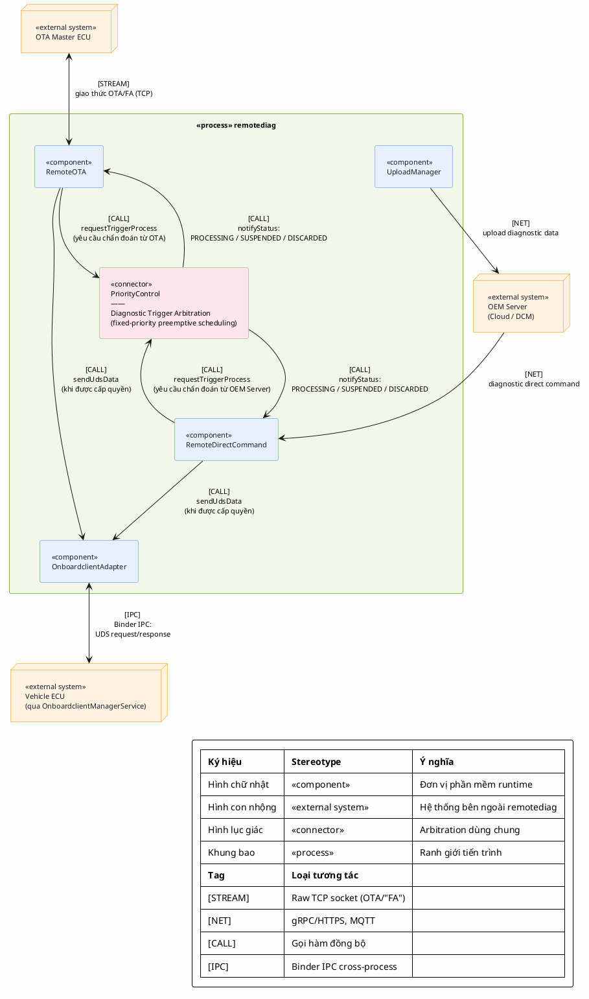

# Component-and-Connector View - module `remotediag` (Runtime, theo chuẩn SEI)

Sơ đồ dưới đây tuân theo cách trình bày Component-and-Connector (C&C) view của SEI
(trong tài liệu *"Documenting Software Architectures: Views and Beyond"* - Clements et al.),
được **thu gọn theo yêu cầu** để chỉ thể hiện đúng 3 đường giao tiếp quan trọng nhất của
`remotediag` với thế giới bên ngoài, và làm rõ rằng cả 2 nguồn yêu cầu chẩn đoán (OTA và OEM
Server) đều **đi qua `PriorityControl`** - điểm arbitration ở tầng logic/nghiệp vụ:

1. `RemoteOTA` &harr; **OTA Master ECU** (giao thức OTA/"FA" qua TCP).
2. **OEM Server** &harr; `remotediag` — tập trung vào: upload diagnostic data (`UploadManager`)
   và nhận diagnostic direct command từ server (`RemoteDirectCommand`).
3. **Binder IPC** giữa `OnboardclientAdapter` và `OnboardclientManagerService` để thực thi UDS
   trên Vehicle ECU (chỉ thực hiện **sau khi** `PriorityControl` đã cấp quyền `PROCESSING`).

`PriorityControl` là **connector arbitration duy nhất được nhấn mạnh trong sơ đồ này**: cả
`RemoteOTA` lẫn `RemoteDirectCommand` đều gọi `requestTriggerProcess()` vào đây trước khi được
phép gửi UDS xuống ECU; `PriorityControl` quyết định ai được `PROCESSING`, ai bị `SUSPENDED`
hay `DISCARDED` dựa trên chính sách ưu tiên cố định (`PRIO_OTA_HIGH=10 < PRIO_WARNING_TRIGGER=20
< ... < PRIO_OTA_LOW=200 < PRIO_MAX=255`).

## Chú giải (Diagram Key)

| Ký hiệu (shape) | Stereotype | Ý nghĩa |
|---|---|---|
| Hình chữ nhật `[ ]` | `<<component>>` | Đơn vị phần mềm chạy runtime (class/module cụ thể) |
| Hình con nhộng `([ ])` | `<<external system>>` | Hệ thống/tiến trình bên ngoài `remotediag` |
| Hình lục giác `{{ }}` | `<<connector>>` | Cơ chế kết nối dùng chung, được reify thành 1 phần tử kiến trúc — ở đây là **`PriorityControl`, connector arbitration (scheduling) dùng chung giữa `RemoteOTA` và `RemoteDirectCommand`** |
| Khung subgraph | `<<process>>` | Ranh giới tiến trình `remotediag` |

| Tag trên connector | Loại tương tác |
|---|---|
| `[STREAM]` | Luồng byte qua raw TCP socket (giao thức OTA/"FA") |
| `[NET]` | Giao thức mạng ra Cloud/OEM Server (gRPC/HTTPS, MQTT) |
| `[CALL]` | Gọi hàm đồng bộ: xin xử lý (`requestTriggerProcess`), nhận trạng thái (`notifyStatus`), hoặc gửi UDS (`sendUdsData`) |
| `[IPC]` | Trao đổi Binder IPC cross-process với `OnboardclientManagerService` |

## Ghi chú kiến trúc

- **`PriorityControl` là điểm arbitration ở tầng logic/nghiệp vụ**: nó không biết gì về UDS hay
  `OnboardclientAdapter`, chỉ quản lý trạng thái của từng `DiagTrigger` (`PROCESSING`/`SUSPENDED`/
  `DISCARDED`/`PENDING`) theo chính sách ưu tiên cố định. Cả yêu cầu từ `RemoteOTA` (khởi phát bởi
  OTA Master ECU) và từ `RemoteDirectCommand` (khởi phát bởi OEM Server) đều phải qua
  `requestTriggerProcess()` tại đây trước khi được phép chạy.
- Nếu OTA đang `PROCESSING` với `PRIO_OTA_HIGH` → cờ `m_ota_non_interuptible = true` → mọi yêu cầu
  khác (kể cả từ OEM Server) đều không thể ngắt, chỉ xếp `PENDING`. Ngược lại nếu OTA đang chạy ở
  `PRIO_OTA_LOW` mà có yêu cầu từ OEM Server ưu tiên cao hơn → OTA bị `DISCARDED` ngay lập tức.
- `OnboardclientAdapter` vẫn còn tồn tại như 1 component IPC gateway phía sau (giữ khoá phiên UDS
  vật lý — xem thảo luận trước), nhưng trong sơ đồ này **không được nhấn mạnh là arbitration**
  theo đúng phạm vi bạn yêu cầu; nó chỉ đóng vai trò component thực thi việc gửi UDS sau khi đã
  được `PriorityControl` cấp quyền.
- Sơ đồ này lược bỏ các luồng khác (DTC/SSR/RoB, IG, Location, Power...) so với bản C&C runtime
  đầy đủ để tập trung đúng 3 đường giao tiếp được yêu cầu.
