# Component-and-Connector View — module `remotediag` (Full Runtime, SEI C&C)

Đây là bản **đầy đủ** (non-focused) của C&C view cho module `remotediag`. Tất cả các
`diagprocess` component và `service adapter` đều được thể hiện ở **cùng mức độ abstraction**
với bản focused (không đi vào chi tiết nội bộ từng class), nhưng bổ sung toàn bộ:

- **Tất cả DiagProcess component**: OTA, DirectCommand, SSR, DTC, RoB, RoBSSR, RoBMonitoring,
  RoBOccurrence, Warning, EcuInformation, LastUpload, SchedulerManager, CollectionCondition.
- **Tất cả Service Adapter** (gateway tới hệ thống bên ngoài): OnboardclientAdapter,
  MqttManagerAdapter, HttpManagerAdapter, DiagManagerAdapter, PowerManagerAdapter,
  VehicleManagerAdapter, LocationManagerAdapter, CalibManagerAdapter, PPIManagerAdapter,
  ApplicationManagerAdapter, RegionManagerAdapter.
- **Luồng trigger nội bộ (internal chaining)**: Warning → DTC → SSR → RoB → LastUpload.
- **Hai thread boundary** (Looper): `DiagnosticsLooper` và `VehicleTriggerLooper`.
- `PriorityControl` vẫn là connector arbitration duy nhất, nhận yêu cầu từ tất cả
  diagprocess cần UDS.

## Chú giải (Diagram Key)

| Ký hiệu | Stereotype | Ý nghĩa |
|---|---|---|
| Hình chữ nhật trong khung | `<<component>>` | Đơn vị phần mềm runtime |
| Hình con nhộng (node) | `<<external system>>` | Hệ thống/tiến trình bên ngoài |
| Hình chữ nhật với màu đỏ nhạt | `<<connector>>` | Arbitration connector (PriorityControl) |
| Hình chữ nhật với màu xanh lam nhạt | `<<adapter>>` | Service adapter gateway |
| Khung `<<thread>>` | Thread/Looper boundary | Ranh giới luồng xử lý |
| Khung `<<process>>` | Process boundary | Ranh giới tiến trình remotediag |

| Tag | Loại tương tác |
|---|---|
| `[STREAM]` | Raw TCP socket (OTA/FA) |
| `[NET-gRPC]` | gRPC/HTTPS lên OEM Server / Cloud |
| `[NET-MQTT]` | MQTT subscribe/publish |
| `[CALL]` | Gọi hàm đồng bộ nội bộ |
| `[TRIGGER]` | Kích hoạt diagprocess theo chuỗi (chaining) |
| `[IPC]` | Binder IPC cross-process |
| `[EVENT]` | Sự kiện callback bất đồng bộ |

```plantuml
@startuml
'!theme plain
skinparam backgroundColor #F8F9FA
skinparam defaultFontName "Segoe UI"
skinparam defaultFontSize 10
skinparam componentStyle rectangle
skinparam padding 6
skinparam roundCorner 6
skinparam ArrowColor #455A64
skinparam ArrowFontSize 9

skinparam component {
    BackgroundColor #E3F2FD
    BorderColor #1565C0
    FontColor #0D1B2A
}
skinparam node {
    BackgroundColor #FFF8E1
    BorderColor #F57F17
    FontColor #1A1A2E
}
skinparam rectangle {
    BorderColor #37474F
    FontColor #1A1A2E
}

' ══════════════════════════════════════════════════════════
'  EXTERNAL SYSTEMS (bên ngoài process remotediag)
' ══════════════════════════════════════════════════════════
node "<<external system>>\nOTA Master ECU" as OTAECU #FFF8E1
node "<<external system>>\nOEM Server / Cloud\n(gRPC + MQTT)" as OEMSRV #FFF8E1
node "<<external system>>\nOnboardclientManagerService\n(Vehicle ECU via CAN)" as OBCSVC #FFF8E1
node "<<external system>>\nDiagManagerService\n(DID/Flag/UnderRepair)" as DIAGSVC #FFF8E1
node "<<external system>>\nPowerManagerService\n(IG status)" as PWRSVC #FFF8E1
node "<<external system>>\nVehicleManagerService\n(vehicle data/event)" as VEHSVC #FFF8E1
node "<<external system>>\nLocationManagerService" as LOCSVC #FFF8E1
node "<<external system>>\nCalibManagerService\n(calibration data)" as CALIBSVC #FFF8E1
node "<<external system>>\nPPIManagerService\n(personal info flag)" as PPISVC #FFF8E1
node "<<external system>>\nApplicationManagerService\n(lifecycle)" as APPSVC #FFF8E1
node "<<external system>>\nSldd / SystemPost\n(debug/test trigger)" as SLDD #FFF8E1

' ══════════════════════════════════════════════════════════
'  PROCESS BOUNDARY: remotediag
' ══════════════════════════════════════════════════════════
rectangle "<<process>> remotediag" as RDG #F1F8E9 {

    ' ─── SERVICE ADAPTER LAYER ─────────────────────────────
    rectangle "<<thread>> Main Looper\n(RemoteDiag)" as MAIN_LOOPER #E8EAF6 {
        component "<<adapter>>\nOnboardclientAdapter\n(IPC gateway → OBC)" as OBC #C5CAE9
        component "<<adapter>>\nMqttManagerAdapter\n(MQTT subscribe)" as MQTT #C5CAE9
        component "<<adapter>>\nHttpManagerAdapter\n(HTTP/gRPC)" as HTTP #C5CAE9
        component "<<adapter>>\nDiagManagerAdapter\n(DID/Flag)" as DIAGADP #C5CAE9
        component "<<adapter>>\nPowerManagerAdapter\n(IG event)" as PWRADP #C5CAE9
        component "<<adapter>>\nVehicleManagerAdapter\n(vehicle event)" as VEHADP #C5CAE9
        component "<<adapter>>\nLocationManagerAdapter" as LOCADP #C5CAE9
        component "<<adapter>>\nCalibManagerAdapter" as CALIBADP #C5CAE9
        component "<<adapter>>\nPPIManagerAdapter" as PPIADP #C5CAE9
        component "<<adapter>>\nApplicationManagerAdapter" as APPADP #C5CAE9
        component "<<adapter>>\nRegionManagerAdapter" as REGADP #C5CAE9
    }

    ' ─── DIAGNOSTICS LOOPER ────────────────────────────────
    rectangle "<<thread>> DiagnosticsLooper" as DIAG_LOOPER #E8F5E9 {

        ' -- Arbitration Connector --
        rectangle "<<connector>>\nPriorityControl\n——\nDiagnostic Trigger Arbitration\n(fixed-priority preemptive scheduling)" as PRIO #FFCDD2

        ' -- Shared infrastructure --
        component "<<component>>\nCollectionCondition\n(sync schedule/flag từ Server)" as COLCOND #E3F2FD
        component "<<component>>\nSchedulerManager\n(lịch tự động)" as SCHEDMGR #E3F2FD
        component "<<component>>\nUploadManager\n(upload kết quả lên OEM Server)" as UPLOAD #E3F2FD
        component "<<component>>\nRemoteLastUpload\n(fallback upload)" as LASTUP #E3F2FD

        ' -- DiagProcess: CAN-facing --
        component "<<component>>\nRemoteOTA\n(OTA/FA protocol)" as OTA #DCEDC8
        component "<<component>>\nRemoteDirectCommand\n(OEM direct command)" as DIRCMD #DCEDC8
        component "<<component>>\nRemoteDTC\n(DTC collection)" as DTC #DCEDC8
        component "<<component>>\nRemoteSSR\n(SSR snapshot)" as SSR #DCEDC8
        component "<<component>>\nRemoteRoB\n(RoB data)" as ROB #DCEDC8
        component "<<component>>\nRemoteRoBSSR\n(RoB+SSR combined)" as ROBSSR #DCEDC8
        component "<<component>>\nRoBMonitoring\n(condition-based monitor)" as ROBMON #DCEDC8
        component "<<component>>\nRemoteEcuInformation\n(ECU update info)" as ECUINFO #DCEDC8
    }

    ' ─── VEHICLE TRIGGER LOOPER ────────────────────────────
    rectangle "<<thread>> VehicleTriggerLooper" as VEH_LOOPER #FFF3E0 {
        component "<<component>>\nRemoteWarning\n(vehicle anomaly trigger)" as WARNING #FFE0B2
        component "<<component>>\nRoBOccurrence\n(RoB occurrence event)" as ROBOCCUR #FFE0B2
    }

    ' ─── DEBUG LAYER ───────────────────────────────────────
    component "<<component>>\nRemoteDiagSLDD\n(debug/SLDD interface)" as SLDDCOMP #F3E5F5
}

' ══════════════════════════════════════════════════════════
'  CONNECTIONS: External Systems ↔ Adapters
' ══════════════════════════════════════════════════════════
OTAECU <--> OTA           : [STREAM] OTA/FA (TCP)
OEMSRV <--> HTTP          : [NET-gRPC] gRPC / HTTPS
OEMSRV <--> MQTT          : [NET-MQTT] MQTT subscribe
OBCSVC <--> OBC           : [IPC] Binder: sendUDS / UDS response
DIAGSVC <--> DIAGADP      : [IPC] DID read/write, flag, UnderRepair
PWRSVC --> PWRADP         : [EVENT] IG ON/OFF callback
VEHSVC --> VEHADP         : [EVENT] vehicle data event
LOCSVC --> LOCADP         : [EVENT] location update
CALIBSVC <--> CALIBADP    : [IPC] calib data
PPISVC <--> PPIADP        : [IPC] PPI flag
APPSVC <--> APPADP        : [IPC] lifecycle / feature status
SLDD --> SLDDCOMP         : [CALL] SystemPost / debug command

' ══════════════════════════════════════════════════════════
'  CONNECTIONS: Adapters → Internal Components
' ══════════════════════════════════════════════════════════
MQTT --> DIRCMD           : [EVENT] direct command từ Server (MQTT)
HTTP <--> UPLOAD          : [NET-gRPC] upload diagnostic data
HTTP <--> COLCOND         : [NET-gRPC] get/update CollectionCondition
PWRADP --> WARNING        : [EVENT] IG ON/OFF → trigger Warning
PWRADP --> OTA            : [EVENT] IG ON/OFF
VEHADP --> WARNING        : [EVENT] vehicle anomaly event
LOCADP --> WARNING        : [EVENT] location data
LOCADP --> DTC            : [EVENT] location for DTC trigger
DIAGADP <-- COLCOND       : [CALL] get/set DID flag
PPIADP --> WARNING        : [EVENT] PPI flag change
CALIBADP --> WARNING      : [EVENT] calib data

' ══════════════════════════════════════════════════════════
'  CONNECTIONS: CollectionCondition & SchedulerManager
' ══════════════════════════════════════════════════════════
COLCOND --> DTC           : [CALL] forward CenterRequest AllDtcSsr
COLCOND --> ROB           : [CALL] forward CenterRequest AllRob
COLCOND --> ROBSSR        : [CALL] forward CenterRequest RobSsr
COLCOND --> ROBMON        : [CALL] forward CollectionCondition Monitor
COLCOND --> ECUINFO       : [CALL] forward CenterRequest EcuInfo
COLCOND --> DIRCMD        : [CALL] forward CenterRequest DirectCommand
COLCOND --> WARNING       : [CALL] forward CollectionCondition Warning
SCHEDMGR --> DTC          : [CALL] scheduled trigger
SCHEDMGR --> SSR          : [CALL] scheduled trigger
SCHEDMGR --> ROB          : [CALL] scheduled trigger

' ══════════════════════════════════════════════════════════
'  CONNECTIONS: requestTriggerProcess → PriorityControl
' ══════════════════════════════════════════════════════════
OTA --> PRIO              : [CALL] requestTriggerProcess (OTA_HIGH/LOW)
DIRCMD --> PRIO           : [CALL] requestTriggerProcess
DTC --> PRIO              : [CALL] requestTriggerProcess
SSR --> PRIO              : [CALL] requestTriggerProcess
ROB --> PRIO              : [CALL] requestTriggerProcess
ROBSSR --> PRIO           : [CALL] requestTriggerProcess
ROBMON --> PRIO           : [CALL] requestTriggerProcess
ECUINFO --> PRIO          : [CALL] requestTriggerProcess
WARNING --> PRIO          : [CALL] requestTriggerProcess (PRIO_WARNING_TRIGGER)

' ══════════════════════════════════════════════════════════
'  CONNECTIONS: PriorityControl → notifyStatus
' ══════════════════════════════════════════════════════════
PRIO --> OTA              : [CALL] notifyStatus: PROCESSING/SUSPENDED/DISCARDED
PRIO --> DIRCMD           : [CALL] notifyStatus
PRIO --> DTC              : [CALL] notifyStatus
PRIO --> SSR              : [CALL] notifyStatus
PRIO --> ROB              : [CALL] notifyStatus
PRIO --> ROBSSR           : [CALL] notifyStatus
PRIO --> ROBMON           : [CALL] notifyStatus
PRIO --> ECUINFO          : [CALL] notifyStatus
PRIO --> WARNING          : [CALL] notifyStatus

' ══════════════════════════════════════════════════════════
'  CONNECTIONS: sendUdsData → OnboardclientAdapter
' ══════════════════════════════════════════════════════════
OTA --> OBC               : [CALL] sendUdsData (khi PROCESSING)
DIRCMD --> OBC            : [CALL] sendUdsData
DTC --> OBC               : [CALL] sendUdsData
SSR --> OBC               : [CALL] sendUdsData
ROB --> OBC               : [CALL] sendUdsData
ROBSSR --> OBC            : [CALL] sendUdsData
ROBMON --> OBC            : [CALL] sendUdsData
ECUINFO --> OBC           : [CALL] sendUdsData

' ══════════════════════════════════════════════════════════
'  CONNECTIONS: Internal Trigger Chaining
'  Warning → DTC → SSR → RoB → LastUpload (fallback)
' ══════════════════════════════════════════════════════════
WARNING --> DTC           : [TRIGGER] triggerWarningToDTC\n(nếu DTC flag ON)
WARNING --> LASTUP        : [TRIGGER] triggerLastUpload\n(nếu DTC flag OFF)
DTC --> SSR               : [TRIGGER] triggerDTCToSSR
SSR --> ROB               : [TRIGGER] triggerSSRToRoB\n(nếu RoB flag ON)
SSR --> LASTUP            : [TRIGGER] triggerLastUpload\n(nếu RoB flag OFF)
ROB --> LASTUP            : [TRIGGER] triggerLastUpload (sau khi RoB xong)
ROBOCCUR --> ROB          : [TRIGGER] RoB occurrence notification

' ══════════════════════════════════════════════════════════
'  CONNECTIONS: Upload
' ══════════════════════════════════════════════════════════
DTC --> UPLOAD            : [CALL] upload DTC result
SSR --> UPLOAD            : [CALL] upload SSR result
ROB --> UPLOAD            : [CALL] upload RoB result
ROBSSR --> UPLOAD         : [CALL] upload RoBSSR result
ROBMON --> UPLOAD         : [CALL] upload Monitor result
ECUINFO --> UPLOAD        : [CALL] upload ECU info
DIRCMD --> UPLOAD         : [CALL] upload DirectCommand result
WARNING --> UPLOAD        : [CALL] upload Warning info

@enduml
```



## Ghi chú kiến trúc

### Hai Thread Boundary
| Thread | Looper name | Các component chạy trên đó |
|---|---|---|
| Main Looper | `RemoteDiag` | Tất cả Service Adapter (nhận callback từ Binder services) |
| DiagnosticsLooper | `Diagnostics` | PriorityControl, CollectionCondition, SchedulerManager, UploadManager, RemoteLastUpload, và toàn bộ diagprocess CAN-facing |
| VehicleTriggerLooper | `VehicleTrigger` | RemoteWarning, RoBOccurrence (nhận event từ vehicle ở tần suất cao) |

### Luồng Trigger Chaining (chuỗi nghiệp vụ chính)
```
VehicleManagerAdapter ──EVENT──▶ RemoteWarning
                                       │
                      requestTriggerProcess ▶ PriorityControl
                                       │ notifyStatus: PROCESSING
                                       ▼
                               triggerWarningToDTC
                                       │
                    [DTC flag ON] ──▶ RemoteDTC ──sendUdsData──▶ OnboardclientAdapter ──IPC──▶ Vehicle ECU
                                       │ triggerDTCToSSR
                                       ▼
                               RemoteSSR ──sendUdsData──▶ OBC
                                       │ triggerSSRToRoB [RoB flag ON]
                                       ▼
                               RemoteRoB ──sendUdsData──▶ OBC
                                       │
                                       ▼ (sau khi hoàn thành)
                               UploadManager ──gRPC──▶ OEM Server
```

### PriorityControl - Priority Table
| Nguồn trigger | Constant | Giá trị |
|---|---|---|
| OTA High | `PRIO_OTA_HIGH` | 10 |
| Warning | `PRIO_WARNING_TRIGGER` | 20 |
| IG ON Trigger | `PRIO_IG_ON_TRIGGER` | 220 |
| OTA Low | `PRIO_OTA_LOW` | 200 |
| Center Request | tuỳ cấu hình server | ~50–150 |
| Max (thấp nhất ưu tiên) | `PRIO_MAX` | 255 |

> **Lưu ý**: Số **nhỏ hơn = ưu tiên cao hơn** (min-heap / fixed-priority scheduling).

### Components KHÔNG có trong bản "Focused View" trước đây
- `RemoteSSR`, `RemoteDTC`, `RemoteRoB` — diagprocess cốt lõi, đều thực thi UDS qua `OnboardclientAdapter`
- `RemoteRoBSSR` — kết hợp RoB+SSR trong một trigger
- `RoBMonitoring` — monitor điều kiện thu thập RoB theo lịch
- `RoBOccurrence` — nhận sự kiện xảy ra RoB từ vehicle (chạy trên `VehicleTriggerLooper`)
- `RemoteEcuInformation` — thu thập thông tin cập nhật ECU
- `RemoteLastUpload` — fallback: upload thẳng nếu không cần DTC/SSR/RoB
- `SchedulerManager` — quản lý lịch tự động (one-shot/routine)
- `CollectionCondition` — đồng bộ điều kiện thu thập từ OEM Server (gRPC)
- Tất cả Service Adapter (10 adapter) đều là gateway Binder IPC tới các external system
