# Component-and-Connector View — module `remotediag` (Focused View, v2)

Sơ đồ **focused** cho implement mới, tập trung vào **3 đường giao tiếp quan trọng nhất** trong
bối cảnh kiến trúc **EP/IP partition**:

1. **OTA Master ECU ↔ `RemoteOTA`** — kết nối trực tiếp vào IP container qua TCP (`FaServer`),
   **không đi qua proxy**.
2. **OEM Server ↔ `remotediag`** — qua proxy EP: MQTT/gRPC nhận ở EP, **forward callback** sang IP
   qua Unix Socket; `remotediag` (IP) gửi command ngược lại EP để upload, publish MQTT, v.v.
3. **`OnboardclientAdapter` ↔ `OnboardclientManagerService`** — `remotediag` (IP) gửi
   `CMD_OBC_SEND_UDS` xuống EP proxy qua Unix Socket; EP thực thi Binder IPC tới OBC service →
   Vehicle ECU. Chỉ thực hiện **sau khi `PriorityControl` đã cấp quyền `PROCESSING`**.

### Vai trò của `remotediag_proxy` (EP container)

`remotediag_proxy` là **forwarder thuần tuý** theo 2 chiều:
- **EP → IP (Callback)**: Nhận event từ các EP service (DiagManager, Power, MQTT, Vehicle, OBC...),
  đóng gói thành `IpcFrame` `TYPE_CALLBACK` và forward sang `remotediag` (IP) qua Unix Socket.
- **IP → EP (Command)**: Nhận `IpcFrame` `TYPE_REQUEST` từ `remotediag` (IP), dispatch sang
  `CommandHandlerRegistry` → handler tương ứng để gọi EP service, trả response về.

> OTA Master ECU **không đi qua proxy** vì OTA connect trực tiếp TCP tới IP container
> (RemoteOTA lắng nghe trên port riêng qua `FaServer`).

## Chú giải (Diagram Key)

| Ký hiệu | Stereotype | Ý nghĩa |
|---|---|---|
| Hình chữ nhật `component` | `<<component>>` | Đơn vị phần mềm runtime |
| Hình con nhộng `node` | `<<external system>>` | Hệ thống/service bên ngoài scope |
| Màu đỏ nhạt | `<<connector>>` | Arbitration connector (PriorityControl) |
| Màu tím nhạt | `<<ipc-bridge>>` | Unix Socket IPC infrastructure |
| Màu xanh lam nhạt | `<<adapter>>` | EP service adapter (proxy side) |
| Khung `<<EP container>>` | EP partition | Phân vùng EP (untrusted/external) |
| Khung `<<IP container>>` | IP partition | Phân vùng IP (trusted/internal) |

| Tag | Loại tương tác | Chiều |
|---|---|---|
| `[STREAM/TCP]` | Raw TCP (OTA/FA, FaServer) | OTA ECU → IP trực tiếp |
| `[NET-gRPC]` | gRPC/HTTPS tới OEM Server | EP ↔ OEM Server |
| `[NET-MQTT]` | MQTT subscribe/publish | EP ↔ OEM Server |
| `[CALL]` | Gọi hàm đồng bộ nội bộ | IP internal |
| `[Binder-IPC]` | Android Binder IPC | EP → EP services |
| `[Unix-Socket CB]` | Unix Socket callback (EP→IP) | EP forward event → IP |
| `[Unix-Socket CMD]` | Unix Socket command (IP→EP) | IP gửi command → EP |

```plantuml
@startuml remotediag_cc_focused_v2_corrected
skinparam backgroundColor #FAFBFC
skinparam defaultFontName "Segoe UI"
skinparam defaultFontSize 11
skinparam componentStyle rectangle
skinparam padding 9
skinparam roundCorner 8
skinparam ArrowColor #455A64
skinparam ArrowFontSize 9
skinparam ArrowThickness 1.5

skinparam component {
    BackgroundColor #E3F2FD
    BorderColor #1565C0
    FontColor #0D1B2A
}
skinparam node {
    BackgroundColor #FFF8E1
    BorderColor #F57F17
    FontColor #1A1A2E
}
skinparam rectangle {
    BorderColor #37474F
    FontColor #1A1A2E
}

' ══════════════════════════════════════════════
'  LEGEND
' ══════════════════════════════════════════════
legend right
  |= Ký hiệu |= Stereotype |= Ý nghĩa |
  | Hình chữ nhật | <<component>> | Đơn vị phần mềm runtime |
  | Hình con nhộng | <<external system>> | Hệ thống bên ngoài |
  | Màu đỏ nhạt | <<connector>> | Arbitration (PriorityControl) |
  | Màu tím nhạt | <<ipc-bridge>> | Unix Socket infrastructure |
  |= Tag |= Chiều |
  | [STREAM/TCP]     | OTA ECU → IP (trực tiếp) |
  | [NET-gRPC/MQTT]  | EP ↔ OEM Server |
  | [CALL]           | Gọi hàm nội bộ |
  | [Binder-IPC]     | EP → EP service |
  | [Unix-Socket CB] | EP → IP (callback forward) |
  | [Unix-Socket CMD]| IP → EP (command execute) |
end legend

' ══════════════════════════════════════════════
'  EXTERNAL SYSTEMS (ngoài cả 2 partition)
' ══════════════════════════════════════════════
node "<<external system>>\nOTA Master ECU\n(kết nối TCP trực tiếp vào IP)" as OTAECU #FFF8E1
node "<<external system>>\nOEM Server / Cloud\n(gRPC + MQTT)" as OEMSRV #FFF8E1

' ══════════════════════════════════════════════
'  EP CONTAINER — remotediag_proxy (forwarder)
' ══════════════════════════════════════════════
rectangle "<<EP container>> remotediag_proxy\n(EP partition — untrusted)" as EP_PROC #FFF3E0 {

    ' EP service adapters (nhận event, thực thi command)
    component "<<adapter>>\nMqttManagerAdapter\n(EP)\n→ subscribe MQTT từ OEM Server" as EP_MQTT #FFE0B2
    component "<<adapter>>\nHttpManagerAdapter\n(EP)\n→ gRPC/HTTPS tới OEM Server" as EP_HTTP #FFE0B2
    component "<<adapter>>\nOnboardclientManagerAdapter\n(EP)\n→ Binder IPC tới OBC service" as EP_OBC #FFE0B2
    component "<<adapter>>\nPowerManagerAdapter\n(EP)\n→ Binder IPC tới PowerManager" as EP_PWR #FFE0B2
    component "<<adapter>>\nVehicleManagerAdapter + others\n(DiagMgr / Location / Calib / PPI / App / Region)\n(EP)" as EP_OTHERS #FFE0B2

    ' IPC client (forward callbacks, execute commands)
    component "<<ipc-bridge>>\nProxyIpcClient\n+ CallbackForwarder\n+ CommandHandlerRegistry\n(forward CB EP→IP; execute CMD IP→EP)" as EP_IPC #EDE7F6
}

' Các EP Binder services (ngoài proxy process nhưng trong EP)
node "<<external system>>\nEP Binder Services\n(DiagManagerSvc / PowerMgrSvc\n/ OnboardclientMgrSvc\n/ VehicleMgrSvc / ...)" as EP_SVCS #FFF8E1

' ══════════════════════════════════════════════
'  SHARED IPC TRANSPORT (Unix Domain Socket)
' ══════════════════════════════════════════════
rectangle "<<shared library>> ipc/\n(UnixSocketServer + UnixSocketClient\n+ IpcFrameCodec)" as IPC_LIB #F3E5F5

' ══════════════════════════════════════════════
'  IP CONTAINER — remotediag (core logic)
' ══════════════════════════════════════════════
rectangle "<<IP container>> remotediag\n(IP partition — trusted)" as IP_PROC #F1F8E9 {

    ' IPC server (nhận callback, gửi command)
    component "<<ipc-bridge>>\nRemoteDiagIpcBridge\n——\nProxyIpcServer + CallbackHandlerRegistry\n(nhận CB từ EP; gửi CMD xuống EP)" as IP_IPC #EDE7F6

    ' Core diagprocess
    component "<<component>>\nRemoteOTA\n(FaServer: TCP listener\ntrực tiếp với OTA ECU)" as OTA #DCEDC8
    component "<<component>>\nRemoteDirectCommand\n(nhận MQTT command forward từ EP)" as DIRCMD #DCEDC8
    component "<<component>>\nUploadManager\n(gửi CMD_HTTP_SEND_GRPC → EP\nđể upload lên OEM Server)" as UPLOAD #E3F2FD

    ' Arbitration connector
    rectangle "<<connector>>\nPriorityControl\n——\nDiagnostic Trigger Arbitration\n(7 DiagQueue, fixed-priority preemptive)\nPRIO_OTA_HIGH=10 < PRIO_WARNING=20\n< ... < PRIO_OTA_LOW=80" as PRIO #FFCDD2

    ' IPC gateway (gọi command xuống EP)
    component "<<component>>\nOnboardclientAdapter (IP side)\n——\ngửi CMD_OBC_SEND_UDS / CMD_OBC_CONNECT\n/ CMD_OBC_TAKE_RESOURCE xuống EP\nnhận CB_OBC_RESPONSE_EVENT từ EP" as OBC #C5CAE9
}

' ══════════════════════════════════════════════
'  CONNECTIONS: EP services → EP_IPC (callbacks)
' ══════════════════════════════════════════════
EP_SVCS <--> EP_MQTT     : [Binder-IPC] MQTT event
EP_SVCS <--> EP_HTTP     : [Binder-IPC] gRPC request/response
EP_SVCS <--> EP_OBC      : [Binder-IPC] OBC connect/sendUDS/response
EP_SVCS <--> EP_PWR      : [Binder-IPC] IG event
EP_SVCS <--> EP_OTHERS   : [Binder-IPC] vehicle/diag/calib/... events

EP_MQTT --> EP_IPC       : [CALL] CB_MQTT_NOTIFICATION → forward
EP_HTTP --> EP_IPC       : [CALL] CB_HTTP_GRPC_RESPONSE → forward
EP_OBC --> EP_IPC        : [CALL] CB_OBC_RESPONSE_EVENT → forward
EP_PWR --> EP_IPC        : [CALL] CB_POWER_IG_CHANGED → forward
EP_OTHERS --> EP_IPC     : [CALL] CB_VEHICLE_EVENT / CB_DIAG_* / ... → forward

OEMSRV <--> EP_MQTT      : [NET-MQTT] MQTT subscribe / publish
OEMSRV <--> EP_HTTP      : [NET-gRPC] gRPC / HTTPS

' ══════════════════════════════════════════════
'  CONNECTIONS: Unix Socket (EP ↔ IP)
' ══════════════════════════════════════════════
EP_IPC <--> IPC_LIB      : [Unix-Socket CB/CMD]\nProxyIpcClient ↔ transport
IPC_LIB <--> IP_IPC      : [Unix-Socket CB/CMD]\ntransport ↔ ProxyIpcServer

' ══════════════════════════════════════════════
'  CONNECTIONS: IP — IP_IPC → diagprocess
'   (CB_* dispatched from CallbackHandlerRegistry)
' ══════════════════════════════════════════════
IP_IPC --> DIRCMD        : [CALL] CB_MQTT_NOTIFICATION\ndispatch → direct command
IP_IPC --> OBC           : [CALL] CB_OBC_RESPONSE_EVENT\ndispatch → UDS response
IP_IPC --> UPLOAD        : [CALL] CMD_HTTP_SEND_GRPC response

' ══════════════════════════════════════════════
'  CONNECTIONS: OTA Master ECU ↔ RemoteOTA (trực tiếp, không qua proxy)
' ══════════════════════════════════════════════
OTAECU <--> OTA          : [STREAM/TCP]\nOTA/FA protocol\n(FaServer — kết nối thẳng vào IP)

' ══════════════════════════════════════════════
'  CONNECTIONS: IP — PriorityControl Arbitration
' ══════════════════════════════════════════════
OTA --> PRIO             : [CALL] requestTriggerProcess\n(PRIO_OTA_HIGH=10 / PRIO_OTA_LOW=80)
DIRCMD --> PRIO          : [CALL] requestTriggerProcess

PRIO --> OTA             : [CALL] notifyStatus:\nPROCESSING / SUSPENDED / DISCARDED
PRIO --> DIRCMD          : [CALL] notifyStatus

' ══════════════════════════════════════════════
'  CONNECTIONS: IP — sendUdsData (sau khi PROCESSING)
'   OBC (IP) gửi CMD xuống EP, EP gọi Binder tới OBC service
' ══════════════════════════════════════════════
OTA --> OBC              : [CALL] CMD_OBC_TAKE_RESOURCE\n→ CMD_OBC_SEND_UDS\n→ CMD_OBC_RELEASE_RESOURCE
DIRCMD --> OBC           : [CALL] CMD_OBC_SEND_UDS\n(khi được cấp quyền)

' OBC (IP) gửi command xuống EP thông qua IPC
OBC --> IP_IPC           : [Unix-Socket CMD]\nCMD_OBC_SEND_UDS / CMD_OBC_CONNECT
UPLOAD --> IP_IPC        : [Unix-Socket CMD]\nCMD_HTTP_SEND_GRPC\n(upload diagnostic data)

@enduml
```



---

## Ghi chú kiến trúc — Điều chỉnh quan trọng

### Kiến trúc EP/IP Partition

```
┌─────────────────────────────────────────────────────────────────┐
│  EP container (untrusted partition)                              │
│                                                                  │
│  OEM Server ──MQTT──▶ MqttManagerAdapter ──CB_MQTT──▶           │
│  OEM Server ──gRPC──▶ HttpManagerAdapter ──CB_HTTP──▶           │
│  DiagMgrSvc ─Binder─▶ DiagManagerAdapter ──CB_DIAG──▶  [EP_IPC]│
│  PowerMgrSvc─Binder─▶ PowerManagerAdapter──CB_POWER──▶          │
│  OBCSvc──────Binder─▶ OBCAdapter──────────CB_OBC────▶           │
│  VehicleSvc──Binder─▶ VehicleAdapter──────CB_VEHICLE─▶          │
│                                      [ProxyIpcClient]            │
└──────────────────────────────────────────┬──────────────────────┘
                              [Unix Domain Socket]
                          CB_* (EP→IP) / CMD_* (IP→EP)
┌─────────────────────────────────────────┴───────────────────────┐
│  IP container (trusted partition)                                │
│                                                                  │
│           [ProxyIpcServer + CallbackHandlerRegistry]             │
│                    │ CB_MQTT_NOTIFICATION                        │
│                    ├──────────────────▶ RemoteDirectCommand      │
│                    │ CB_OBC_RESPONSE_EVENT                       │
│                    ├──────────────────▶ OnboardclientAdapter     │
│                    │ CB_POWER_IG_CHANGED                         │
│                    ├──────────────────▶ RemoteWarning / RemoteOTA│
│                    │ ...                                         │
│                                                                  │
│  OTA Master ECU ──TCP──▶ RemoteOTA (FaServer) [TRỰC TIẾP]       │
│                                                                  │
│       RemoteOTA / RemoteDirectCommand                            │
│            │ requestTriggerProcess()                             │
│            ▼                                                     │
│       PriorityControl (7 DiagQueue)                              │
│            │ notifyStatus: PROCESSING                            │
│            ▼                                                     │
│       OnboardclientAdapter (IP side)                             │
│            │ CMD_OBC_SEND_UDS ──Unix Socket──▶ EP               │
│            │                    EP: OBCAdapter ──Binder──▶ OBCSvc│
│            │ ◀── CB_OBC_RESPONSE_EVENT ─────────────────────────│
└─────────────────────────────────────────────────────────────────┘
```

### Tại sao OTA Master ECU kết nối trực tiếp IP (không qua proxy)?

- OTA session yêu cầu **latency thấp** và **kết nối liên tục** (TCP stream).
- `FaServer` trong `RemoteOTA` lắng nghe trực tiếp trên port TCP trong IP container.
- Dữ liệu OTA là **trusted** — không cần đi qua EP boundary.

### Luồng command IP → EP: `OnboardclientAdapter`

`OnboardclientAdapter` trong IP **không còn** gọi Binder IPC trực tiếp. Thay vào đó:

```
OnboardclientAdapter (IP)
    │ CMD_OBC_TAKE_RESOURCE  ──[Unix-Socket CMD]──▶
    │                                               EP: OBCAdapter → OBCSvc (Binder)
    │ CMD_OBC_SEND_UDS       ──[Unix-Socket CMD]──▶
    │                                               EP: OBCSvc → Vehicle ECU (CAN/DoIP)
    │ ◀── CB_OBC_RESPONSE_EVENT ──[Unix-Socket CB]──
    │ (UDS response nhận được ở EP, forward về IP)
    ▼
RemoteOTA / RemoteDTC / ... xử lý response
```

### Callback IDs được forward từ EP → IP (từ `IpcConstants.h`)

| Nhóm | Callback ID | Nguồn EP service |
|---|---|---|
| DiagManager | `CB_DIAG_STATUS_CHANGED`, `CB_DIAG_UNDER_REPAIR_CHANGED`, `CB_DIAG_SERVICE_FLAG_CHANGED`, `CB_DIAG_DID_READ_RESPONSE` | DiagManagerService |
| Power | `CB_POWER_IG_CHANGED`, `CB_POWER_BATTERY_STATUS` | PowerManagerService |
| MQTT | `CB_MQTT_NOTIFICATION` | MqttManagerService |
| HTTP | `CB_HTTP_GRPC_RESPONSE` | HttpManagerService |
| OBC | `CB_OBC_RESPONSE_EVENT`, `CB_OBC_OBD2_EVENT`, `CB_OBC_RESOURCE_EVENT` | OnboardclientManagerService |
| Vehicle | `CB_VEHICLE_EVENT` | VehicleManagerService |
| App | `CB_APP_BOOT_COMPLETED`, `CB_APP_FEATURE_STATUS_CHANGED`, `CB_APP_POST_RECEIVED` | ApplicationManagerService |
| Calib | `CB_CALIB_STATUS_CHANGED` | CalibManagerService |
| PPI | `CB_PPI_RECEIVED` | PPIManagerService |
| Location | `CB_LOCATION_UPDATE` | LocationManagerService |
| Region | `CB_REGION_CHANGED` | RegionManagerService |
