# Component-and-Connector View — module `remotediag` (Runtime, SEI C&C) — v2 (implement mới)

Sơ đồ phản ánh **implement hiện tại** (sau khi bổ sung tầng IPC proxy), tuân theo chuẩn trình bày
Component-and-Connector (C&C) view của SEI (*Documenting Software Architectures: Views and Beyond*).

### Những thay đổi so với bản cũ (`remotediag_runtime_cc_diagram_plantuml.md`)

| # | Thay đổi | Chi tiết |
|---|---|---|
| 1 | **`remotediag_proxy` process mới** | Process riêng biệt, kết nối với `remotediag` qua **Unix Domain Socket** (không phải Binder IPC) |
| 2 | **Tầng `ipc/` (shared library)** | Chứa `ProxyIpcServer` (phía remotediag) / `ProxyIpcClient` (phía proxy) + transport `UnixSocketServer/Client` + `IpcFrameCodec` |
| 3 | **`RemoteDiagIpcBridge`** | Component trong `remotediag` — điểm vào init Unix Socket server, bridge `ProxyIpcServer` ↔ `CallbackHandlerRegistry` |
| 4 | **`RemoteDiagProxy` + `CommandHandlerRegistry` + `DiagCommandHandler`** | Daemon phía proxy, nhận command từ external client qua Unix Socket, dispatch qua `CommandHandlerRegistry` → `DiagCommandHandler` |
| 5 | **`OnboardclientAdapter`** (tên đầy đủ) | Rõ hơn vai trò: thêm `TakeObcResource` / `ReleaseObcResource` — quản lý quyền chiếm session UDS vật lý |
| 6 | **`PriorityControl` — 7 DiagQueue** | Thay 1 queue chung bằng 7 `DiagQueue` riêng biệt theo dải priority |
| 7 | **Bổ sung diagprocess đầy đủ** | Toàn bộ diagprocess: DTC, SSR, RoB, RoBSSR, RoBMonitoring, RoBOccurrence, EcuInformation, Warning, LastUpload |
| 8 | **Thread boundary 3 Looper** | Main Looper / DiagnosticsLooper / VehicleTriggerLooper được vẽ rõ ràng |

## Chú giải (Diagram Key)

| Ký hiệu | Stereotype | Ý nghĩa |
|---|---|---|
| Hình chữ nhật `component` | `<<component>>` | Đơn vị phần mềm runtime |
| Hình con nhộng `node` | `<<external system>>` | Hệ thống/process bên ngoài scope |
| Hình chữ nhật màu đỏ nhạt | `<<connector>>` | Arbitration connector (PriorityControl) |
| Hình chữ nhật màu tím nhạt | `<<ipc-bridge>>` | IPC infrastructure (Unix Socket layer) |
| Khung `<<thread>>` | Thread/Looper boundary | Ranh giới luồng xử lý |
| Khung `<<process>>` | Process boundary | Ranh giới tiến trình OS |

| Tag trên connector | Loại tương tác |
|---|---|
| `[STREAM/TCP]` | Raw TCP socket (OTA/FA protocol) |
| `[NET-gRPC]` | gRPC/HTTPS lên OEM Server / Cloud |
| `[NET-MQTT]` | MQTT subscribe/publish |
| `[CALL]` | Gọi hàm đồng bộ nội bộ |
| `[TRIGGER]` | Kích hoạt diagprocess theo chuỗi (chaining) |
| `[Binder-IPC]` | Binder IPC cross-process (Android) |
| `[Unix-Socket]` | Unix Domain Socket (custom IPC protocol giữa remotediag ↔ proxy) |
| `[EVENT]` | Callback bất đồng bộ |

## Diagram PlantUML — v2

```plantuml
@startuml remotediag_cc_v2
skinparam backgroundColor #FAFBFC
skinparam defaultFontName "Segoe UI"
skinparam defaultFontSize 11
skinparam componentStyle rectangle
skinparam padding 8
skinparam roundCorner 8
skinparam ArrowColor #455A64
skinparam ArrowFontSize 9
skinparam ArrowThickness 1.5

skinparam component {
    BackgroundColor #E3F2FD
    BorderColor #1565C0
    FontColor #0D1B2A
}
skinparam node {
    BackgroundColor #FFF8E1
    BorderColor #F57F17
    FontColor #1A1A2E
}
skinparam rectangle {
    BorderColor #37474F
    FontColor #1A1A2E
}

' ══════════════════════════════════════════════
'  EXTERNAL SYSTEMS
' ══════════════════════════════════════════════
node "<<external system>>\nOTA Master ECU\n(gửi OTA/FA request qua TCP)" as OTAECU #FFF8E1
node "<<external system>>\nOEM Server / Cloud\n(gRPC + MQTT)" as OEMSRV #FFF8E1
node "<<external system>>\nOnboardclientManagerService\n(Vehicle ECU via CAN/DoIP)" as OBCSVC #FFF8E1
node "<<external system>>\nExternal Diag Client\n(test tool / CLI)" as EXTCLIENT #FFF8E1

' ══════════════════════════════════════════════
'  PROCESS: remotediag_proxy (daemon mới)
' ══════════════════════════════════════════════
rectangle "<<process>> remotediag_proxy" as PROXY_PROC #FFF3E0 {
    component "<<component>>\nRemoteDiagProxy\n(lifecycle: onCreate/onDestroy)" as RDPROXY #FFE0B2
    component "<<component>>\nCommandHandlerRegistry\n(dispatch cmdId → handler)" as CMDREG #FFE0B2
    component "<<component>>\nDiagCommandHandler\n(handle diag commands)" as DIAGCMD #FFE0B2
    component "<<ipc-bridge>>\nProxyIpcClient\n(Unix Socket client side)" as IPCCLIENT #EDE7F6
}

' ══════════════════════════════════════════════
'  SHARED IPC TRANSPORT LAYER
' ══════════════════════════════════════════════
rectangle "<<shared library>> ipc/" as IPC_LIB #F3E5F5 {
    component "<<ipc-bridge>>\nUnixSocketServer\n/ UnixSocketClient\n(transport)" as TRANSPORT #CE93D8
    component "<<ipc-bridge>>\nIpcFrameCodec\n(framing/deframing)" as CODEC #CE93D8
}

' ══════════════════════════════════════════════
'  PROCESS BOUNDARY: remotediag
' ══════════════════════════════════════════════
rectangle "<<process>> remotediag" as RDG #F1F8E9 {

    ' ─── IPC BRIDGE (entry point) ──────────────
    component "<<ipc-bridge>>\nRemoteDiagIpcBridge\n(init Unix Socket server;\nbridge ProxyIpcServer ↔ CallbackHandlerRegistry)" as RDGBRIDGE #EDE7F6
    component "<<ipc-bridge>>\nProxyIpcServer\n(Unix Socket server side;\nreceives commands, sends callbacks)" as IPCSERVER #EDE7F6
    component "<<ipc-bridge>>\nCallbackHandlerRegistry\n(dispatch callbackId → handler func)" as CBKREG #EDE7F6

    ' ─── DIAGNOSTICS LOOPER ────────────────────
    rectangle "<<thread>> DiagnosticsLooper" as DIAG_LOOPER #E8F5E9 {

        ' -- Arbitration Connector (7 priority queues) --
        rectangle "<<connector>>\nPriorityControl\n——\nDiagnostic Trigger Arbitration\n(7 DiagQueue: OTA_H / Warning / OTA_L / CenterReq / ...)\n(fixed-priority preemptive scheduling)" as PRIO #FFCDD2

        ' -- Shared infrastructure --
        component "<<component>>\nCollectionCondition\n(sync CC từ OEM Server via gRPC)" as COLCOND #E3F2FD
        component "<<component>>\nSchedulerManager\n(one-shot / routine schedule)" as SCHEDMGR #E3F2FD
        component "<<component>>\nUploadManager\n(upload kết quả → OEM Server)" as UPLOAD #E3F2FD
        component "<<component>>\nRemoteLastUpload\n(fallback upload)" as LASTUP #E3F2FD

        ' -- DiagProcess: CAN-facing --
        component "<<component>>\nRemoteOTA\n(OTA/FA protocol;\nFaServer: TCP listener;\nrequestPriorityControl)" as OTA #DCEDC8
        component "<<component>>\nRemoteDirectCommand\n(direct command từ OEM Server)" as DIRCMD #DCEDC8
        component "<<component>>\nRemoteDTC\n(DTC collection)" as DTC #DCEDC8
        component "<<component>>\nRemoteSSR\n(SSR snapshot)" as SSR #DCEDC8
        component "<<component>>\nRemoteRoB\n(RoB data)" as ROB #DCEDC8
        component "<<component>>\nRemoteRoBSSR\n(RoB+SSR combined)" as ROBSSR #DCEDC8
        component "<<component>>\nRoBMonitoring\n(condition-based monitor)" as ROBMON #DCEDC8
        component "<<component>>\nRemoteEcuInformation\n(ECU update info)" as ECUINFO #DCEDC8
    }

    ' ─── MAIN LOOPER (Service Adapter layer) ───
    rectangle "<<thread>> Main Looper (RemoteDiag)" as MAIN_LOOPER #E8EAF6 {
        component "<<adapter>>\nOnboardclientAdapter\n(Binder IPC gateway → OBC;\nTakeObcResource / ReleaseObcResource;\nsendUdsData)" as OBC #C5CAE9
        component "<<adapter>>\nMqttManagerAdapter\n(MQTT subscribe)" as MQTT #C5CAE9
        component "<<adapter>>\nHttpManagerAdapter\n(gRPC / HTTPS)" as HTTP #C5CAE9
        component "<<adapter>>\nPowerManagerAdapter\n(IG event)" as PWRADP #C5CAE9
        component "<<adapter>>\nVehicleManagerAdapter\n(vehicle data/event)" as VEHADP #C5CAE9
        component "<<adapter>>\nDiagManagerAdapter\n(DID/Flag/UnderRepair)" as DIAGADP #C5CAE9
        component "<<adapter>>\nLocationManagerAdapter" as LOCADP #C5CAE9
    }

    ' ─── VEHICLE TRIGGER LOOPER ────────────────
    rectangle "<<thread>> VehicleTriggerLooper" as VEH_LOOPER #FFF3E0 {
        component "<<component>>\nRemoteWarning\n(vehicle anomaly trigger)" as WARNING #FFE0B2
        component "<<component>>\nRoBOccurrence\n(RoB occurrence event)" as ROBOCCUR #FFE0B2
    }
}

' ══════════════════════════════════════════════
'  CONNECTIONS: External Client → Proxy → remotediag
' ══════════════════════════════════════════════
EXTCLIENT --> IPCCLIENT  : [Unix-Socket]\nclient connects to proxy
IPCCLIENT <--> TRANSPORT : [Unix-Socket] client transport
RDPROXY --> CMDREG       : [CALL] dispatch command
CMDREG --> DIAGCMD       : [CALL] route to DiagCommandHandler

' proxy → remotediag IPC channel
TRANSPORT <--> IPCSERVER : [Unix-Socket] server transport
IPCSERVER --> RDGBRIDGE  : [CALL] onDataReceived
RDGBRIDGE --> IPCSERVER  : [CALL] init / setCallbackDispatcher
RDGBRIDGE --> CBKREG     : [CALL] dispatchCallback
IPCSERVER --> CBKREG     : [CALL] dispatchCallback(callbackId, payload)

' ══════════════════════════════════════════════
'  CONNECTIONS: OTA Master ECU ↔ RemoteOTA
' ══════════════════════════════════════════════
OTAECU <--> OTA          : [STREAM/TCP]\nOTA/FA protocol\n(FaServer listens on port)

' ══════════════════════════════════════════════
'  CONNECTIONS: OEM Server ↔ Adapters
' ══════════════════════════════════════════════
OEMSRV <--> HTTP         : [NET-gRPC] gRPC / HTTPS
OEMSRV <--> MQTT         : [NET-MQTT] MQTT subscribe
HTTP <--> UPLOAD         : [NET-gRPC] upload diagnostic data
HTTP <--> COLCOND        : [NET-gRPC] GetCollectionCondition\n/ NotifyUpdateResult
MQTT --> DIRCMD          : [EVENT] direct command từ Server

' ══════════════════════════════════════════════
'  CONNECTIONS: OnboardclientAdapter ↔ OBC Service
' ══════════════════════════════════════════════
OBCSVC <--> OBC          : [Binder-IPC] connect/sendUdsData\n/ UDS response callback

' ══════════════════════════════════════════════
'  CONNECTIONS: Power/Vehicle events
' ══════════════════════════════════════════════
PWRADP --> WARNING       : [EVENT] IG ON/OFF → trigger Warning
PWRADP --> OTA           : [EVENT] IG ON/OFF
VEHADP --> WARNING       : [EVENT] vehicle anomaly event
LOCADP --> WARNING       : [EVENT] location data
LOCADP --> DTC           : [EVENT] location for DTC trigger
DIAGADP <-- COLCOND      : [CALL] get/set DID flag

' ══════════════════════════════════════════════
'  CONNECTIONS: CollectionCondition & SchedulerManager → DiagProcess
' ══════════════════════════════════════════════
COLCOND --> DTC          : [CALL] forward CenterRequest AllDtcSsr
COLCOND --> ROB          : [CALL] forward CenterRequest AllRob
COLCOND --> ROBSSR       : [CALL] forward CenterRequest RobSsr
COLCOND --> ROBMON       : [CALL] forward CollectionCondition Monitor
COLCOND --> ECUINFO      : [CALL] forward CenterRequest EcuInfo
COLCOND --> DIRCMD       : [CALL] forward CenterRequest DirectCommand
COLCOND --> WARNING      : [CALL] forward CollectionCondition Warning
SCHEDMGR --> DTC         : [CALL] scheduled trigger
SCHEDMGR --> SSR         : [CALL] scheduled trigger
SCHEDMGR --> ROB         : [CALL] scheduled trigger

' ══════════════════════════════════════════════
'  CONNECTIONS: requestTriggerProcess → PriorityControl
' ══════════════════════════════════════════════
OTA --> PRIO             : [CALL] requestTriggerProcess\n(PRIO_OTA_HIGH=10 / PRIO_OTA_LOW=80)
DIRCMD --> PRIO          : [CALL] requestTriggerProcess
DTC --> PRIO             : [CALL] requestTriggerProcess
SSR --> PRIO             : [CALL] requestTriggerProcess
ROB --> PRIO             : [CALL] requestTriggerProcess
ROBSSR --> PRIO          : [CALL] requestTriggerProcess
ROBMON --> PRIO          : [CALL] requestTriggerProcess
ECUINFO --> PRIO         : [CALL] requestTriggerProcess
WARNING --> PRIO         : [CALL] requestTriggerProcess\n(PRIO_WARNING_TRIGGER=20)

' ══════════════════════════════════════════════
'  CONNECTIONS: PriorityControl → notifyStatus
' ══════════════════════════════════════════════
PRIO --> OTA             : [CALL] notifyStatus:\nPROCESSING / SUSPENDED / DISCARDED
PRIO --> DIRCMD          : [CALL] notifyStatus
PRIO --> DTC             : [CALL] notifyStatus
PRIO --> SSR             : [CALL] notifyStatus
PRIO --> ROB             : [CALL] notifyStatus
PRIO --> ROBSSR          : [CALL] notifyStatus
PRIO --> ROBMON          : [CALL] notifyStatus
PRIO --> ECUINFO         : [CALL] notifyStatus
PRIO --> WARNING         : [CALL] notifyStatus

' ══════════════════════════════════════════════
'  CONNECTIONS: sendUdsData → OnboardclientAdapter
' ══════════════════════════════════════════════
OTA --> OBC              : [CALL] sendUdsData (khi PROCESSING)\n+ handleGetObcResourceReq\n+ handleReleaseObcResourceReq
DIRCMD --> OBC           : [CALL] sendUdsData
DTC --> OBC              : [CALL] sendUdsData
SSR --> OBC              : [CALL] sendUdsData
ROB --> OBC              : [CALL] sendUdsData
ROBSSR --> OBC           : [CALL] sendUdsData
ROBMON --> OBC           : [CALL] sendUdsData
ECUINFO --> OBC          : [CALL] sendUdsData

' ══════════════════════════════════════════════
'  CONNECTIONS: Internal Trigger Chaining
' ══════════════════════════════════════════════
WARNING --> DTC          : [TRIGGER] triggerWarningToDTC\n(nếu DTC flag ON)
WARNING --> LASTUP       : [TRIGGER] triggerLastUpload\n(nếu DTC flag OFF)
DTC --> SSR              : [TRIGGER] triggerDTCToSSR
SSR --> ROB              : [TRIGGER] triggerSSRToRoB (nếu RoB flag ON)
SSR --> LASTUP           : [TRIGGER] triggerLastUpload (nếu RoB flag OFF)
ROB --> LASTUP           : [TRIGGER] triggerLastUpload (sau khi RoB xong)
ROBOCCUR --> ROB         : [TRIGGER] RoB occurrence notification

' ══════════════════════════════════════════════
'  CONNECTIONS: Upload
' ══════════════════════════════════════════════
DTC --> UPLOAD           : [CALL] upload DTC result
SSR --> UPLOAD           : [CALL] upload SSR result
ROB --> UPLOAD           : [CALL] upload RoB result
ROBSSR --> UPLOAD        : [CALL] upload RoBSSR result
ROBMON --> UPLOAD        : [CALL] upload Monitor result
ECUINFO --> UPLOAD       : [CALL] upload ECU info
DIRCMD --> UPLOAD        : [CALL] upload DirectCommand result
WARNING --> UPLOAD       : [CALL] upload Warning info

@enduml
```



---

## Ghi chú kiến trúc — Những điểm mới quan trọng

### 1. `remotediag_proxy` Process — IPC Proxy Daemon mới

```
External Diag Client
        │ connect()
        ▼
  [remotediag_proxy process]
  RemoteDiagProxy::onCreate(socketPath)
        │ setCommandHandler(λ)
        ▼
  ProxyIpcClient (UnixSocketClient)
        │ [Unix Domain Socket]
        ▼
  ProxyIpcServer (UnixSocketServer)   ← trong [remotediag process]
        │ onDataReceived()
        ▼
  RemoteDiagIpcBridge
        │ dispatchCallback()
        ▼
  CallbackHandlerRegistry
        │ callbackId → handler()
        ▼
  (diagprocess nhận kết quả callback)
```

**Ý nghĩa kiến trúc:**
- `remotediag_proxy` chạy trong **process riêng** (tách biệt khỏi `remotediag`).
- Giao tiếp giữa 2 process qua **Unix Domain Socket** với custom framing (`IpcFrameCodec`), **không phải Binder IPC**.
- `RemoteDiagIpcBridge` là điểm entry duy nhất trong `remotediag` để khởi tạo Unix Socket server.
- `CallbackHandlerRegistry` cho phép đăng ký handler theo `callbackId` → loosely coupled.

### 2. `OnboardclientAdapter` — Resource Management

Class `OnboardclientAdapter` hiện có thêm **OBC resource management** rõ ràng:
- `TakeObcResource()` / `ReleaseObcResource()` — quản lý quyền chiếm session UDS vật lý.
- Đây là phần `RemoteOTA` gọi trước khi `sendUdsData`: `handleGetObcResourceReq` → `TakeObcResource` → `sendUdsData` → `handleReleaseObcResourceReq` → `ReleaseObcResource`.

### 3. `PriorityControl` — 7 DiagQueue riêng biệt

| Queue | Phạm vi priority | Ý nghĩa |
|---|---|---|
| `queue1` | 0–9 | Dự phòng (chưa dùng) |
| `queue_OTA_H` | 10 (`PRIO_OTA_HIGH`) | OTA high priority (non-interruptible) |
| `queue3` | 11–19 | Dự phòng |
| `queue_Warning` | 20 (`PRIO_WARNING_TRIGGER`) | Vehicle anomaly warning |
| `queue5` | 21–79 | Center Request (DTC/SSR/RoB/EcuInfo/DirectCommand) |
| `queue_OTA_L` | 80 (`PRIO_OTA_LOW`) | OTA low priority (có thể bị preempt) |
| `queue7` | 81–255 | IG ON Trigger / các trigger ưu tiên thấp nhất |

> **Lưu ý**: Số **nhỏ hơn = ưu tiên cao hơn**. `m_ota_non_interuptible = true` khi OTA đang chạy ở `PRIO_OTA_HIGH=10`.

### 4. Thread Boundary — 3 Looper

| Thread/Looper | Component chạy trên đó |
|---|---|
| **Main Looper** (`RemoteDiag`) | Tất cả Service Adapter (nhận Binder callback) |
| **DiagnosticsLooper** | PriorityControl, CollectionCondition, SchedulerManager, UploadManager, RemoteLastUpload, và toàn bộ diagprocess CAN-facing |
| **VehicleTriggerLooper** | RemoteWarning, RoBOccurrence |

### 5. Trigger Chaining — Luồng nghiệp vụ chính

```
VehicleManagerAdapter ──EVENT──▶ RemoteWarning (VehicleTriggerLooper)
                                        │ requestTriggerProcess(PRIO=20) ▶ PriorityControl
                                        │ notifyStatus: PROCESSING
                                        ▼ triggerWarningToDTC [DTC flag ON]
                                    RemoteDTC ──sendUdsData──▶ OnboardclientAdapter ──[Binder]──▶ OnboardclientManagerService ──[CAN/DoIP]──▶ Vehicle ECU
                                        │ triggerDTCToSSR
                                        ▼
                                    RemoteSSR ──sendUdsData──▶ OBC
                                        │ triggerSSRToRoB [RoB flag ON]
                                        ▼
                                    RemoteRoB ──sendUdsData──▶ OBC
                                        │ triggerLastUpload
                                        ▼
                                    UploadManager ──[gRPC]──▶ OEM Server
```
