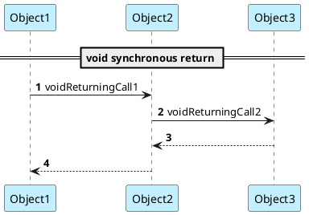
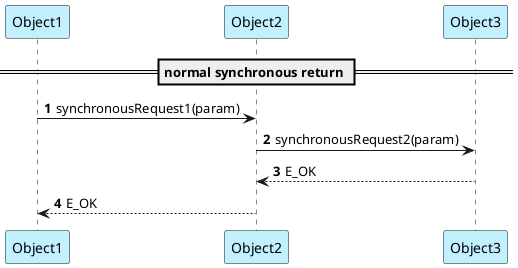
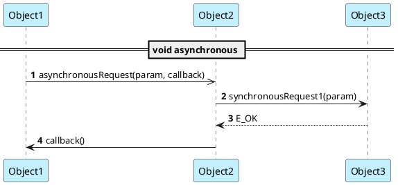
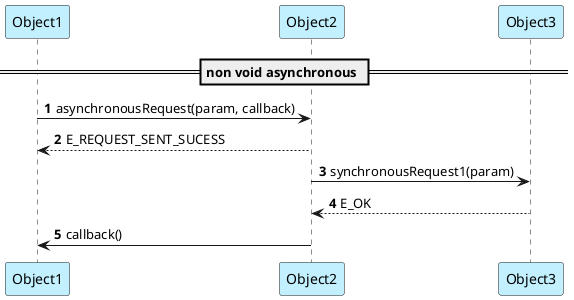
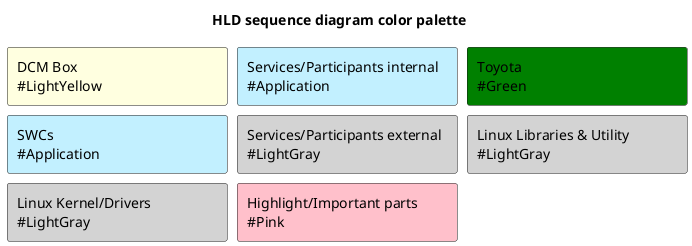
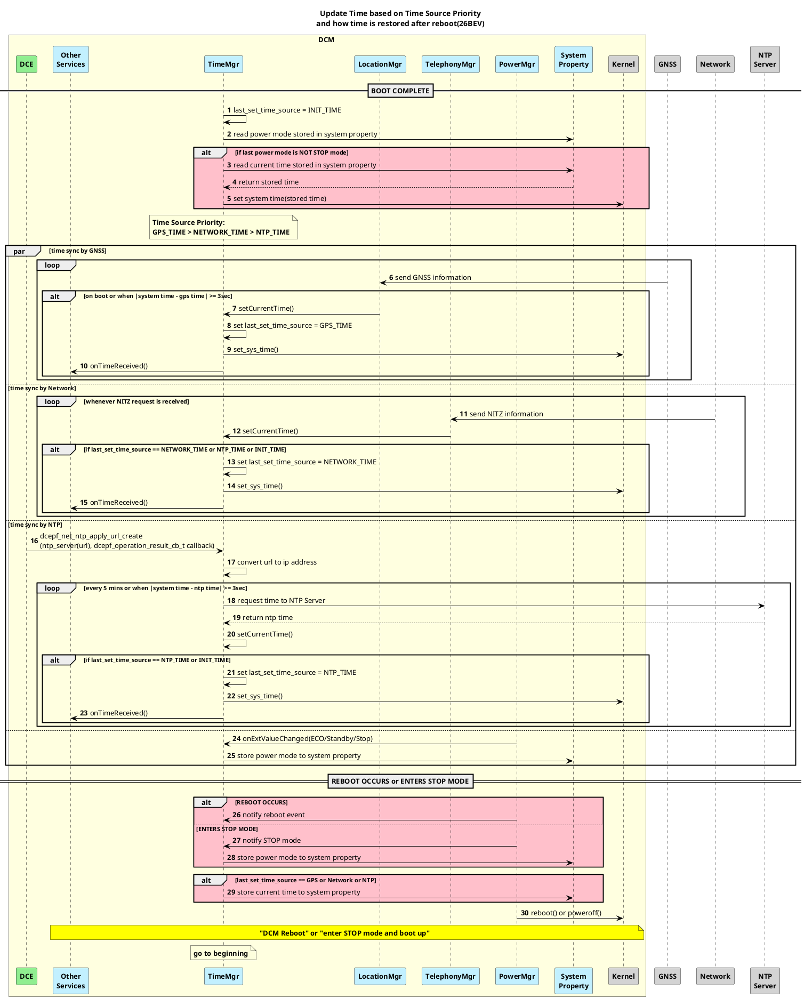
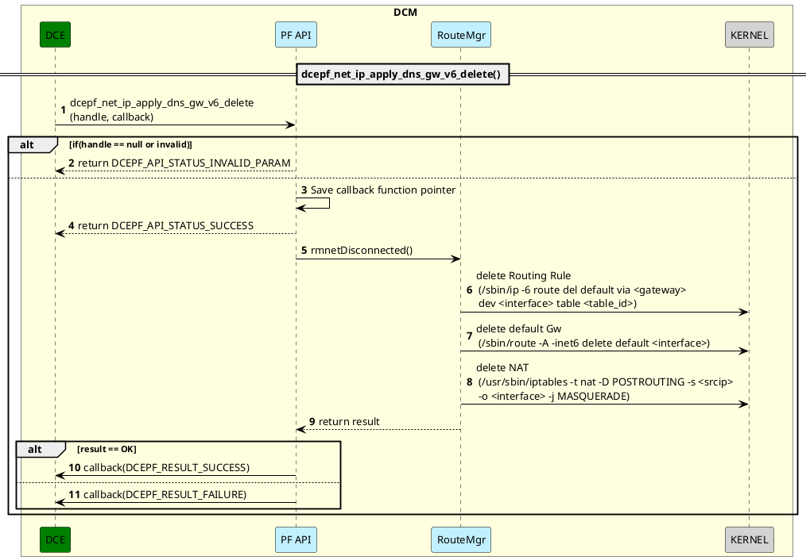
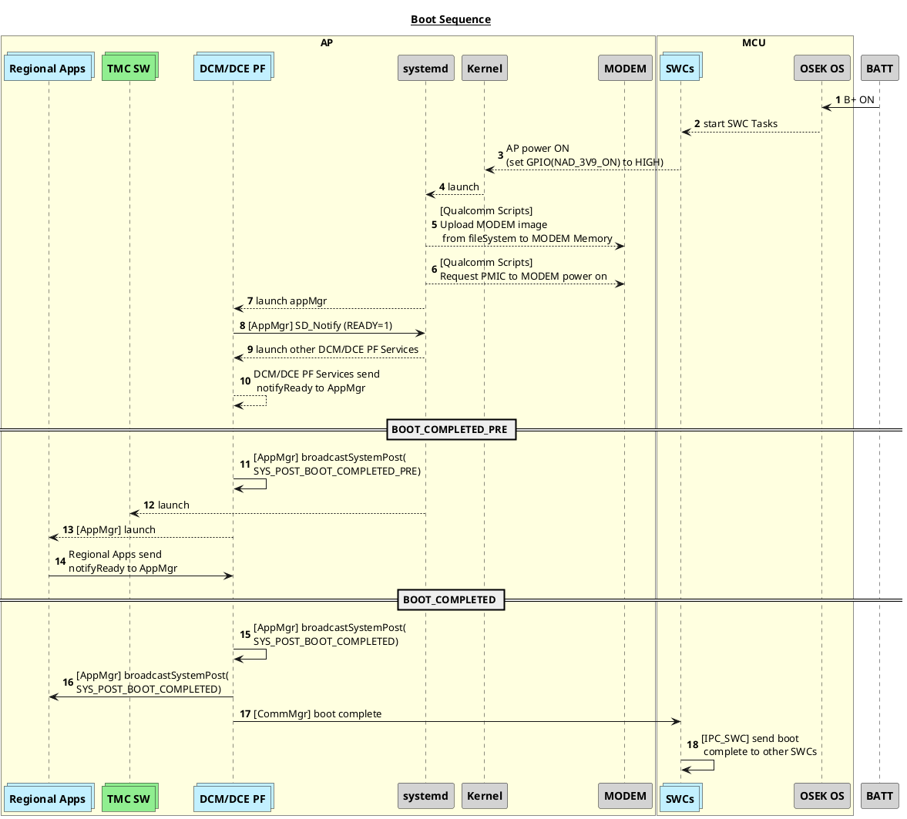

1. Sequence Diagram Guide
1.1 Returning Void Syncrhonous Function call
The return arrow is required for the synchronous function call to show the active time of each object during function execution time.
The CALL arrow should have SOLID body and bold head: #1, #2
The RETURN arrow should have DASHED body and bold head: #3, #4


1.2 Returning Value Syncrhonous Function call
The return arrow is required for the synchronous function call to show the active time of each object during function execution time  and for further exception handling if any.
The CALL arrow should have SOLID body and bold head: #1, #2
The RETURN arrow should have DASHED body and bold head: #3, #4


1.3 Void Asyncrhonous Function call
The return arrow is not needed,
The CALL arrow should have SOLID body and light head: #1
The RETURN arrow is no need for this: N/A

1.4 Returning Value Asyncrhonous Function call
This is treated similar to the synchronous function call, the Return arrow is needed for showing the exception handling logic if any.
The CALL arrow should have SOLID body and bold head: #1
The RETURN arrow should have DASHED body and bold head: #2

2. Sample
2.1. HLD Sequence Diagram
```info
Sequence Diagram Object는 SW Block Diagram에 표기되어 있는 모듈명과 일치해야 함
동일한 모듈이 없을 경우 Block Diagram를 업데이트 할지 아키텍트 협의 필요
Sequence Diagram Object는 Black box로 봄, 내부 설계는 SDD에서 표현
Sequence 간 call에대한 text는 External API name이 되어야 함. 단 API로 기술될 수 없는 경우(동작 등) Description으로 대체할 수 있음. (예, Click SOS Button)
Trigger 대상이 명확해야함 (DCM Core/User or button/other ECU)
```

2.1.1 Usecase - Update Time Based on Time Source Priority and how time is restored after reboot


2.1.2 Usecase - dcepf_net_ip_apply_dns_gw_v6_delete

2.1.3 Usecase - Overall Initial bootup sequence
