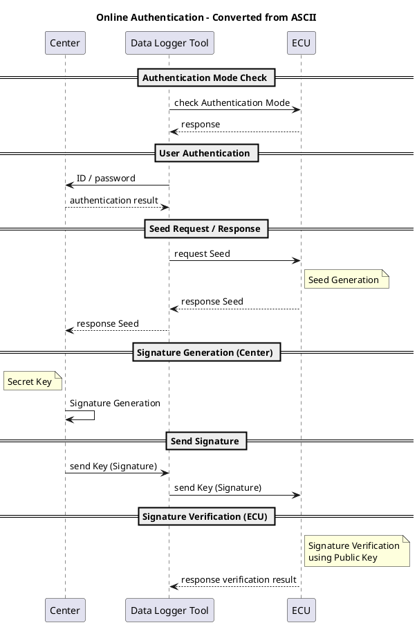
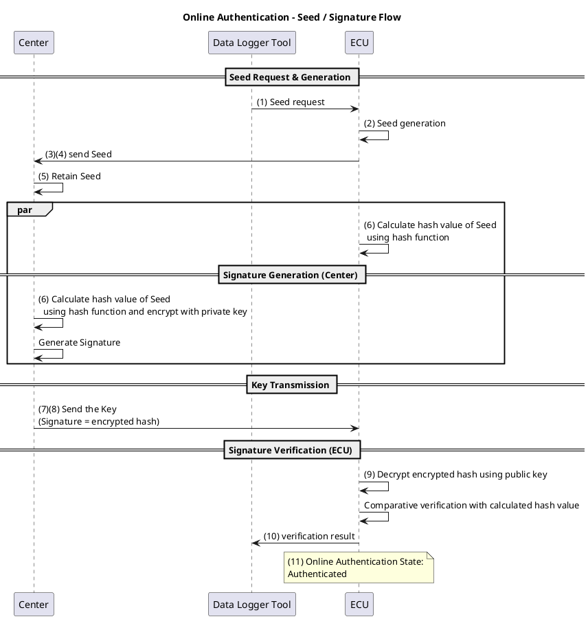
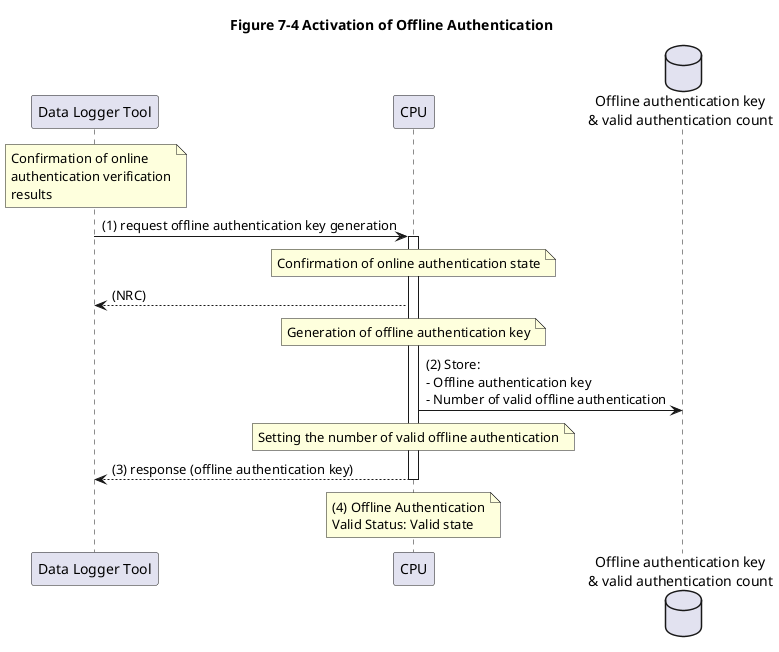
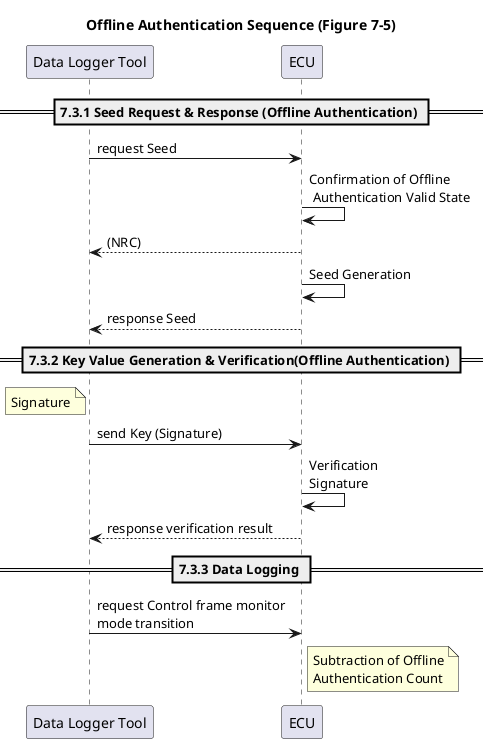
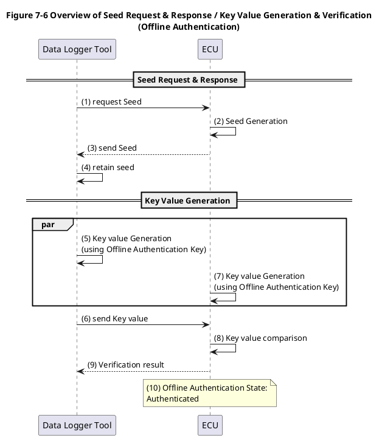

In-Vehicle Network Requirements Specification of Message Filtering 1/29
Application: ECU of in-Vehicle network
No. SEC-ePF-MFG-REQ-SPEC-a03-00-a

TOYOTA MOTOR CORPORATION

1. Revision Record

## Version Contents of revision Date Revise

| Version  | Contents of revision                                                                                                                                                                                                                                                                                                                                                     | Date          | Revise     |
| -------- | ------------------------------------------------------------------------------------------------------------------------------------------------------------------------------------------------------------------------------------------------------------------------------------------------------------------------------------------------------------------------ | ------------- | ---------- |
| a03‑00‑a | Creation of new specification based on SEC‑ePF‑MFG‑REQ‑SPEC‑a02‑02‑a <br> **Point of change:** <br> - Updates to Upper‑level Documents section <br> - Updates to Related Documents section <br> - Updates to Terms and Definitions section <br> - Addition of Notes section <br> - Addition of new requirements (MFGREQ_00058, MFGREQ_00059, MFGREQ_00060, MFGREQ_00061) | Nov. 28, 2025 | 3DEX Yasue |

---

Table of Contents

1. Revision Record .................................................................................... 1

2. Introduction .......................................................................................... 4
   Purpose of this Document ................................................................................................................. 4
   Scope ................................................................................................................................................... 4
   Description in this Document ........................................................................................................... 4
   Upper-level Documents ..................................................................................................................... 4
   Related Documents ............................................................................................................................ 5
   Terms and Definitions ....................................................................................................................... 7
   Notes ................................................................................................................................................... 7

3. List of Requirements ............................................................................. 8

4. Filtering Requirements ....................................................................... 10

5. Diagnostic Filtering Requirements ..................................................... 13
   Diagnostic Filtering Targets ........................................................................................................... 13
   Diagnostic Filtering Implementation Details ................................................................................ 13
   Diagnostic Filtering Deactivate Conditions ................................................................................... 13
   Reactivating after Diagnostic Filtering deactivation .................................................................... 13

6. Logging Filtering Requirements ......................................................... 14
   Logging Filtering Targets ................................................................................................................ 14
   Logging Filtering Implementation Details .................................................................................... 14
   Logging Filtering Deactivate Conditions ....................................................................................... 14
   Reactivating after Logging Filtering Deactivation ........................................................................ 14

7. Data Logger Tool Authentication Requirements ................................ 15
   Online Authentication ..................................................................................................................... 16
   Logger Authentication Mode Response Function ................................................................... 17
   User Authentication Function ................................................................................................. 18
   Seed Request & Response (Online Authentication) ............................................................... 18
   Signature Generation & Verification (Online Authentication) ............................................. 19
   Activation of Offline Authentication ............................................................................................... 22
   Offline Authentication ..................................................................................................................... 24
   Seed Request & Response (Offline Authentication) ............................................................... 25
   Key Value Generation & Verification (Offline Authentication) ............................................. 25
   Data Logging ............................................................................................................................ 27
   Deactivation of Offline Authentication ........................................................................................... 27

---

## 2. Introduction

### Purpose of this Document

In order to prevent unauthorized communication from DLC, this document takes measures by introducing message filtering to the ECU/VM that connects with the external tool through DLC.  
This document defines the requirements for realizing message filtering.

### Scope

The scope of the message filtering specified in this document is the ECU/VM that connects with the external tool through DLC (hereinafter referred to as ECU).  
In addition, both CAN and Ethernet are the scope of this document.

### Description in this Document

A requirement in this document shall be labeled as \[MFGREQ\_\*\*\*\*\*\].  
However, provided that what is labeled as (Supplement) is a supplementary item and therefore is not a requirement specification.

### Upper-level Documents

**Table 2-1 List of Upper-level Documents**

| No  | Title                                            | Ver. (See the latest version)           |
| --- | ------------------------------------------------ | --------------------------------------- |
| 1   | MPW ePF Vehicle Cybersecurity Concept Definition | SEC-ePF-VCL-CPT-INST-DOC-\*\*\*-\*\*-\* |

---

### Related Documents

**Table 2-2 List of Related Documents**

| No  | Title                                                              | Ver.                                              |
| --- | ------------------------------------------------------------------ | ------------------------------------------------- |
| 2   | Management Ledger for Diagnostics Communication Address            | Ver\*.\*.\*                                       |
| 3   | Requirements Specification of Online Client Authentication         | SEC-ePF-RPR-OCA-REQ-SPEC-\*\*\*-\*\*-\*           |
| 4   | Terms and Definitions related to Vehicle Cybersecurity and Privacy | SEC-ePF-TRM-GUD-PROC-\*\*\*-\*\*-\*               |
| 5   | (Deleted)                                                          | -                                                 |
| 6   | Requirements Specification of Common Vulnerability Countermeasure  | SEC-ePF-VUL-CMN-REQ-SPEC-\*\*\*-\*\*-\*           |
| 7   | Wired Reprogramming Specification Reprogramming Sequence           | wrrs-\*\*\*\*\*-\*\*\*-\*                         |
| 8   | CAN(FD) Communication Data Format(ARXML) Specification             | gnccanarxmlfmt-\*\*\*-\*\*-\*                     |
| 9   | Automotive Ethernet communication function specification           | etherprotocol-\*\*\*-\*\*-\*                      |
| 10  | Ledger for Phase6 Diagnostic Communication Address                 | Phase6 Diagnostic Communication Address_V\*\_\*\* |
| 11  | Instructions for Prototype Parameter of Message Filtering          | SEC-ePF-MFG-PRT-INST-DOC-\*\*\*-\*\*-\*           |
| 12  | Diagnostic design specification UDS Protocol                       | diaguds-rd\*\*\*-\*\*\*-\*                        |
| 13  | Interface specification of Center-Logger tool                      | TBD                                               |
| 14  | Tool ⇔ GW communication specification                              | TBD                                               |
| 15  | Write Once Requirement Specification                               | wwrtone-rd\*\*\*-\*\*\*-\*                        |

---

**Table 2-3 List of Public-Related Documents**

| No  | Title                                            | Ver. |
| --- | ------------------------------------------------ | ---- |
| 1   | Technical requirements for vehicle cybersecurity | -    |

---

## Terms and Definitions

**Table 2-4 List of Terms and Definitions**

| Term                                            | Explanation                                                                                                                                                                                                                                |
| ----------------------------------------------- | ------------------------------------------------------------------------------------------------------------------------------------------------------------------------------------------------------------------------------------------ |
| Control message                                 | • For CAN or CAN-FD, messages for vehicle control. Refer to “10 Message Format Rules” in Related Documents [8].<br>• For Ethernet, a message used for transmitting/receiving a data between applications. Refer to “Related Documents [9]” |
| External tool message                           | Messages other than diagnostic messages that are sent and received with tools connecting to the vehicle through DLC such as CCP/XCP. For CAN, refer to Related Documents [8], and for Ethernet, refer to Related Documents [9]             |
| In-Vehicle Bus                                  | A bus inside the vehicle that is not used to connect with external diagnostic tools.                                                                                                                                                       |
| Diagnostic Client Bus                           | A bus to which ECUs equipped with diagnostic client functions, such as OTA master functionality or onboard client functionality, are connected                                                                                             |
| In-Vehicle Bus other than Diagnostic Client Bus | An in-vehicle bus to which no ECUs equipped with diagnostic client functions, such as OTA master functionality or onboard client functionality, are connected                                                                              |

### Notes

For vehicles subject to China GB (Public-Related Document [1]), processing based on this document may involve the cryptographic algorithms specified in **VULCMN_00110** of Related Document [6].  
This is due to regulation changes effective **January 2028**.  
If cryptographic algorithms change, additional instructions will be provided.

---

## 3. List of Requirements

A list of the requirements to be defined in this document is indicated in Table 3-1.  
See Chapter 4 and thereafter for the details of the requirements.

### Table 3-1 Requirement List

**Classification / Requirement ID**

- **Filtering Requirements**  
  MFGREQ_00001 –  
  MFGREQ_00002 –  
  MFGREQ_00003 –  
  MFGREQ_00004 –  
  MFGREQ_00057 –  
  MFGREQ_00058 –  
  MFGREQ_00059 –  
  MFGREQ_00060 –  
  MFGREQ_00061 –

- **Diagnostic Filtering Requirements**  
  MFGREQ_00005 –  
  MFGREQ_00006 –  
  MFGREQ_00007 –  
  MFGREQ_00016 –

- **Logging Filtering Requirements**  
  MFGREQ_00008 –  
  MFGREQ_00009 –  
  MFGREQ_00010 –  
  MFGREQ_00017 –

- **Data Logger Tool Authentication Requirements**  
   MFGREQ_00011 (Deleted) –  
   MFGREQ_00012 (Deleted) –  
   MFGREQ_00013 (Deleted) –  
   MFGREQ_00014 (Deleted) –  
   MFGREQ_00015 (Deleted) –  
   MFGREQ_00018 –  
   MFGREQ_00019 –  
   MFGREQ_00020 –  
   MFGREQ_00021 –  
   MFGREQ_00022 –  
   MFGREQ_00023 –  
   MFGREQ_00024 –
  MFGREQ_00025 –  
  MFGREQ_00026 –  
  MFGREQ_00027 –  
  MFGREQ_00028 –  
  MFGREQ_00029 –  
  MFGREQ_00030 –  
  MFGREQ_00031 –  
  MFGREQ_00032 –  
  MFGREQ_00033 –  
  MFGREQ_00034 –  
  MFGREQ_00035 –  
  MFGREQ_00036 –  
  MFGREQ_00037 –  
  MFGREQ_00038 –  
  MFGREQ_00039 –  
  MFGREQ_00040 –  
  MFGREQ_00041 –  
  MFGREQ_00042 –  
  MFGREQ_00043 –  
  MFGREQ_00044 –  
  MFGREQ_00045 –  
  MFGREQ_00046 –  
  MFGREQ_00047 –  
  MFGREQ_00048 –  
  MFGREQ_00049 –  
  MFGREQ_00050 –  
  MFGREQ_00051 –  
  MFGREQ_00052 –  
  MFGREQ_00053 –  
  MFGREQ_00054 –  
  MFGREQ_00055 –  
  MFGREQ_00056 –

---

## 4. Filtering Requirements

**【MFGREQ_00001】**  
The ECU shall discard control messages from buses and ports that connect to diagnostic tools outside of the vehicle.

**【MFGREQ_00057】**  
The ECU shall discard External tool messages from buses and ports that connect to diagnostic tools outside of the vehicle if the WriteOnce process has already been executed.  
For details about the WriteOnce process, refer to related document [15].

_(Note)_  
If the WriteOnce process has not been executed, it is permissible to exclude External tool messages from the filtering targets.

**【MFGREQ_00002】**  
The ECU shall perform diagnostic filtering for diagnostic request messages from buses and ports that connect to diagnostic tools outside of the vehicle.  
For diagnostic filtering, refer to “5. Diagnostic Filtering Requirements”.

**【MFGREQ_00003】**  
The ECU shall perform logging filtering for control messages to buses and ports that connect to diagnostic tools outside of the vehicle.  
For logging filtering, refer to “6. Logging Filtering Requirements”.

**【MFGREQ_00058】**  
The ECU shall not route diagnostic request messages received from In‑Vehicle Bus other than Diagnostic Client Bus to other In‑Vehicle Buses.

**【MFGREQ_00059】**  
The ECU shall not route diagnostic response messages received from In‑Vehicle Bus to any other In‑Vehicle Bus except the Diagnostic Client Bus.

**【MFGREQ_00060】**  
The ECU shall not route External tool message received from In‑Vehicle Bus to any other In‑Vehicle Bus.

**【MFGREQ_00061】**  
The ECU shall route Control messages received from In‑Vehicle Bus according to the predefined routing map.

The reference information for the requirements in this chapter is shown in Table 4-1.

### Table 4-1 Filtering Requirements

| Source                                                                    | Destination                                                             | Control messages       | External tool messages                            | Diagnostic request messages | Diagnostic response messages |
| ------------------------------------------------------------------------- | ----------------------------------------------------------------------- | ---------------------- | ------------------------------------------------- | --------------------------- | ---------------------------- |
| ① Buses and ports that connect to diagnostic tools outside of the vehicle | (any)                                                                   | Discard                | Discard (after the WriteOnce process is executed) | Diagnostic filtering        | N/A                          |
| ② (any)                                                                   | Buses and ports that connect to diagnostic tools outside of the vehicle | Logging filtering      | N/A                                               | N/A                         | N/A                          |
| ③ Diagnostic Client Bus                                                   | In‑Vehicle Bus other than Diagnostic Client Bus                         | Follow the routing map | Do not route                                      | N/A                         | Do not route                 |
| ④ In‑Vehicle Bus other than Diagnostic Client Bus                         | Diagnostic Client Bus                                                   | Follow the routing map | Do not route                                      | Do not route                | N/A                          |
| ⑤ Diagnostic Client Bus                                                   | Diagnostic Client Bus                                                   | Follow the routing map | Do not route                                      | N/A                         | N/A                          |
| ⑥ In‑Vehicle Bus other than Diagnostic Client Bus                         | In‑Vehicle Bus other than Diagnostic Client Bus                         | Follow the routing map | Do not route                                      | Do not route                | Do not route                 |

**【MFGREQ_00004】**  
Countermeasures against tampering the filtering configuration information shall be performed.

_(Supplement)_  
Examples of the realization of countermeasure against tampering is shown below.

- Ex.1 Store configuration information in a secure area such as HSM.
- Ex.2 Secure Boot detects that configuration information has been tampered.

---

## 5. Diagnostic Filtering Requirements

### Diagnostic Filtering Targets

**【MFGREQ_00005】**  
The ECU shall target the diagnostic request message excluding the legally applicable diagnostic communication addresses for diagnostic filtering.  
(For diagnostic communication addresses, refer to “Related Documents [2][10]”).

_(Supplement)_  
“Reserve” in service tools and remote diagnostic response messages may be set in diagnostic request messages.  
Therefore, refer to the latest diagnostic address, and be careful not to exclude the diagnostic request message from the filtering target.

### Diagnostic Filtering Implementation Details

**【MFGREQ_00006】**  
The ECU shall discard diagnostic request messages in Table 5-1 by diagnostic filtering.

**Table 5-1 Diagnostic requests to be filtered (Phase5,6)**

| SID  | Description                                           |
| ---- | ----------------------------------------------------- |
| 0x10 | DiagnosticSessionControl (Programming session (0x02)) |
| 0x11 | ECUReset                                              |
| 0x28 | CommunicationControl                                  |
| 0x34 | RequestDownload                                       |
| 0x85 | ControlDTCSetting                                     |

**【MFGREQ_00007】**  
The ECU shall deactivate the diagnostic filtering of MFGREQ_00006 if the center connection device authentication completed successfully.  
For center connection device authentication, refer to “Related Documents [3]”.

### Reactivating after Diagnostic Filtering Deactivation

**【MFGREQ_00016】**  
After the deactivation of the diagnostic filtering in 【MFGREQ_00007】, the ECU shall reactivate the diagnostic filtering before the authentication state of the center connection device authentication transitions to “Unauthenticated” state.  
For the authentication state of the center connection device authentication, refer to “Related Documents [3]”.

---

## 6. Logging Filtering Requirements

### Logging Filtering Targets

**【MFGREQ_00008】**  
The ECU shall target control messages for logging filtering.

### Logging Filtering Implementation Details

**【MFGREQ_00009】**  
The ECU shall discard control messages to buses and ports that connect to diagnostic tools by logging filtering.

### Logging Filtering Deactivate Conditions

**【MFGREQ_00010】**  
The ECU shall deactivate the logging filtering of MFGREQ_00009 if the data logger tool authentication completed successfully.  
Refer to Chapter 7.3 for details.

### Reactivating after Logging Filtering Deactivation

**【MFGREQ_00017】**  
After the deactivation of the logging filtering in 【MFGREQ_00010】, the ECU shall be to reconfigure the logging filtering when the logging filtering condition is satisfied.  
For more details, refer to Chapter 7.3.3.

---

## 7. Data Logger Tool Authentication Requirements

The overview sequence of data logger tool authentication is shown in Figure 7-1.

```
+--------------------+        +----------------------+        +-------------+
|   Center           |        |     Data Logger Tool |        |    ECU      |
+--------------------+        +----------------------+        +-------------+
            |                            |                           |
        +-----------------------------------------------------------------+
        |                   7.1 Online Authentication                     |
        +-----------------------------------------------------------------+
            |                            |                           |
            |       +-----------------------------------------------------+
            |       |      7.2 Activation of Offline Authentication       |
            |       +-----------------------------------------------------+
            |                            |                           |
            |       +-----------------------------------------------------+
            |       |                 7.3 Offline Authentication          |
            |       +-----------------------------------------------------+
            |       |                    |                           |
            |       +-----------------------------------------------------+
            |       |        7.4 Deactivation of Offline Authentication   |
            |       +-----------------------------------------------------+
            |       |                    |                           |
```

_Figure 7-1 Overview sequence of data logger tool authentication_

**【MFGREQ_00011】** (Deleted)  
**【MFGREQ_00012】** (Deleted)  
**【MFGREQ_00013】** (Deleted)
**【MFGREQ_00014】** (Deleted)  
**【MFGREQ_00015】** (Deleted)

## 7.1 Online Authentication

The sequence of online authentication is shown in Figure 7-2.



_Figure 7-2 Sequence of online authentication_

### Logger Authentication Mode Response Function

**【MFGREQ_00018】**  
The ECU shall determine the current logger authentication mode (Prototype mode or Production mode) based on the type of public key (Prototype key / Production key) used in online authentication with the center.

**【MFGREQ_00054】**  
The ECU shall use the public key in the Related Document [11] for online authentication when it is a Prototype key, and use the key distributed from the center when it is a Production key.

**【MFGREQ_00019】**  
The ECU shall respond with the current logger authentication mode when requested the logger authentication mode retrieval from the data logger tool.

**【MFGREQ_00020】**  
The ECU shall store the public key used in online authentication with tamper-prevention measures.

**【MFGREQ_00021】**  
The request message for logger authentication mode retrieval shall follow Table 7-1.  
The request message format when specifying multiple dataIdentifiers shall comply with the related document [12].

**Table 7-1 Logger Authentication Mode Retrieval Request Message Format**

| A_Data byte | Parameter                        | Byte Value | Scaling / Bit |
| ----------- | -------------------------------- | ---------- | ------------- |
| #1          | ReadDataByIdentifier Request SID | 0x22       | hexadecimal   |
| #2          | dataIdentifier[] byte#1 (MSB)    | 0xA9       | hexadecimal   |
| #3          | dataIdentifier[] byte#2          | 0xD0       | hexadecimal   |

**【MFGREQ_00022】**  
The response message for logger authentication mode retrieval shall follow Table 7-2.  
The response message format when specifying multiple dataIdentifiers, and the details of the negative response shall comply with the related document [12].

**Table 7-2 Logger Authentication Mode Retrieval Positive Response Message Format**

| A_Data byte | Parameter                         | Byte Value | Scaling / Bit |
| ----------- | --------------------------------- | ---------- | ------------- |
| #1          | ReadDataByIdentifier Response SID | 0x62       | hexadecimal   |
| #2          | dataIdentifier[] byte#1 (MSB)     | 0xA9       | hexadecimal   |
| #3          | dataIdentifier[] byte#2           | 0xD0       | hexadecimal   |
| #4          | dataRecord[] byte#1               | 0xXX       | hexadecimal   |

The response value of dataRecord (Logger Authentication Mode) is as follows:

- 0x00 = Prototype Mode
- 0x01 = Production Mode

### User Authentication Function

**【MFGREQ_00023】**  
The data logger tool shall transmit its ID and password to the center.  
The center shall verify that the ID and password received from the data logger tool are correct.  
The center shall send the result of the user authentication back to the data logger tool.

**【MFGREQ_00024】**  
The data logger tool shall determine the center to connect with based on the logger authentication mode of the ECU.

### Seed Request & Response (Online Authentication)

**【MFGREQ_00025】**  
(1) The data logger tool shall send a Seed request to the ECU.  
(2) The ECU shall generate and retain the Seed (random number).  
The generated random number shall comply with “VULCMN_00200” and “VULCMN_00300” in the related document [6].  
(3) The ECU shall transmit the Seed generated in (2) to the data logger tool.  
(4) The data logger tool shall send the Seed and Key ID specified by the Key Management Center to the center when user authentication is successful.  
(5) The center shall retain the Seed (until the processing of 【MFGREQ_00028】(8) is completed).  
(Refer to Figure 7-3)

**【MFGREQ_00026】**  
The diagnostic communication message of the Seed request in online authentication between the data logger tool and the ECU shall follow Table 7-3.  
Refer to the related document [12] for details.

**Table 7-3 Online Authentication Seed Request**

| Item           | Content                           |
| -------------- | --------------------------------- |
| SID            | 0x27 (SecurityAccess Request SID) |
| sub-function   | requestSeed                       |
| Security Level | 4                                 |

**【MFGREQ_00027】**  
Refer to the related document [13] for details on the communication regarding the Seed request between the data logger tool and the center.

### Signature Generation & Verification (Online Authentication)

**【MFGREQ_00028】**  
(6) The center shall calculate the hash value of the Seed, encrypt it with a private key, and generate the Key (Signature).  
(7) The center shall send the Key (Signature) to the data logger tool.  
(8) The data logger tool shall transmit the Key (Signature) to the ECU.  
(9) The ECU shall decrypt the Key (Signature) with a public key and verify the signature.  
(10) The ECU shall send the verification result to the data logger tool.  
(11) The ECU shall set the online authentication state to the Authenticated state if the signature verification is OK.

(Refer to Figure 7-3 and Table 7-4)



_Figure 7-3 Seed Request & Response / Signature Generation & Verification (Online Authentication) Overview_

### Table 7-4 Signature Generation & Verification Method (Online Authentication)

| Item                   | Content                                            |
| ---------------------- | -------------------------------------------------- |
| Authentication Method  | CHAP (Challenge Handshake Authentication Protocol) |
| Algorithm              | RSASSA-PKCS1_v1_5                                  |
| Key Length             | 3072bit                                            |
| RSA public exponent    | e = 65537                                          |
| Hash Function          | SHA-256                                            |
| Seed Length            | 128bit                                             |
| Key (Signature) Length | 3072bit                                            |

**【MFGREQ_00029】**  
The diagnostic communication message for Key transmission in online authentication between the data logger tool and the ECU shall follow Table 7-5.  
Refer to the related document [12] for details.

**Table 7-5 Online Authentication Key Transmission**

| Item           | Content                           |
| -------------- | --------------------------------- |
| SID            | 0x27 (SecurityAccess Request SID) |
| sub-function   | sendKey                           |
| Security Level | 4                                 |

**【MFGREQ_00030】**  
Refer to the related document [13] for details on the communication regarding Key transmission between the data logger tool and the center.

**【MFGREQ_00056】**  
The ECU shall set the online authentication state to Unauthenticated state when the session with the data logger tool is interrupted.

_(Note)_  
Initial state of the online authentication state is Unauthenticated state.

## Activation of Offline Authentication

The sequence for activating offline authentication is shown in Figure 7-4.



_Figure 7-4 Activation of Offline Authentication_

**【MFGREQ_00031】**  
(1) The data logger tool shall request the ECU to generate the offline authentication key when the verification result of online authentication is OK.  
(2) When the ECU is requested to generate the offline authentication key while the online authentication state is Authenticated state, it shall generate the offline authentication key and set the number of valid offline authentication times.  
The setting value for the number of valid offline authentication times is 600 times.  
(3) The ECU shall send the generated offline authentication key to the data logger tool.  
(4) When the processing of offline authentication activation is completed, the ECU shall set the offline authentication valid state to Valid state.

**【MFGREQ_00032】**  
The request message for generating an offline authentication key shall follow Table 7-6.  
(StopRoutine, RequestRoutineResults: Not supported)

### Table 7-6 Format of the request message for generating an offline authentication key (StartRoutine)

| A_Data byte | Parameter                                                          | Byte Value | Scaling / Bit |
| ----------- | ------------------------------------------------------------------ | ---------- | ------------- |
| #1          | RoutineControl Request SID                                         | 0x31       | hexadecimal   |
| #2          | subFunction = StartRoutine, suppressPosRspMsgIndicationBit = FALSE | 0x01       | hexadecimal   |
| #3          | routineIdentifier[] byte#1 (MSB)                                   | 0xD9       | hexadecimal   |
| #4          | routineIdentifier[] byte#2                                         | 0xD0       | hexadecimal   |

※ No routineControlOptionRecord.

---

**【MFGREQ_00033】**  
For the response message of generating an offline authentication key, the positive response shall follow Table 7-7, and the negative response shall follow the related document [12].

### Table 7-7 Format of the positive response message for generating an offline authentication key

| A_Data byte | Parameter                        | Byte Value | Scaling / Bit |
| ----------- | -------------------------------- | ---------- | ------------- |
| #1          | RoutineControl Response SID      | 0x71       | hexadecimal   |
| #2          | subFunction = StartRoutine       | 0x01       | hexadecimal   |
| #3          | routineIdentifier[] byte#1 (MSB) | 0xD9       | hexadecimal   |
| #4          | routineIdentifier[] byte#2       | 0xD0       | hexadecimal   |
| #5          | routineInfo                      | 0x02       | hexadecimal   |
| #6–#21      | routineStatusRecord[]            | any        | hexadecimal   |

※ routineStatusRecord[] is the value of the generated offline authentication key.

---

**【MFGREQ_00055】**  
The ECU shall generate the offline authentication key complied with “VULCMN_00200” and “VULCMN_00300” in the related document [6].

**【MFGREQ_00034】**  
The ECU shall securely store the offline authentication key complied with  
“VULCMN_01700”, “VULCMN_01701”, and “VULCMN_01702” in the related document [6].

**【MFGREQ_00035】**  
The ECU shall take tampering measures and store the number of valid offline authentication times.

**【MFGREQ_00036】**  
The data logger tool shall securely store the received offline authentication key.

---

## Offline Authentication

The sequence for offline authentication is shown in Figure 7-5.



_Figure 7-5 Sequence for offline authentication_

**7.3.1 Seed Request & Response (Offline Authentication)**

**【MFGREQ_00038】**
(1) The data logger tool shall send the Seed request to the ECU.
(2) When the offline authentication valid state is Valid state, the ECU shall generate and hold the Seed (random number).
The generated random number should follow the related document [6] “VULCMN_00200” and “VULCMN_00300”.
(3) The ECU shall send the Seed generated in (2) to the data logger tool.
(4) The data logger tool shall hold the Seed.
(Refer to Figure 7-6)

**【MFGREQ_00039】**
The diagnostic communication message for Seed request in offline authentication between the data logger tool and the ECU shall follow Table 7-8.
For details, refer to the related document [12].

### Table 7-8 Offline Authentication Seed Request

| Item           | Content                           |
| -------------- | --------------------------------- |
| SID            | 0x27 (SecurityAccess Request SID) |
| sub-function   | requestSeed                       |
| Security Level | 3                                 |

**7.3.2 Key Value Generation & Verification (Offline Authentication)**

**【MFGREQ_00040】**
(5) The data logger tool shall generate the Key value using the Seed received from the ECU and the offline authentication key.
(6) The data logger tool shall send the Key value to the ECU.
(7) The ECU shall generate the Key value using the Seed generated in 【MFGREQ_00038】(2) and the offline authentication key.
(8) The ECU shall compare the Key value received from the data logger tool in (6) with the Key value generated in (7) to confirm if they match.
If they match, it is considered successful authentication, and if they do not match, it is considered failed authentication.
(9) The ECU shall send the authentication result to the data logger tool.
(10) If authentication is successful, the ECU shall set the offline authentication state to Authenticated state.

(Refer to Figure 7-6 and Table 7-9)



_Figure 7-6 Overview of Seed Request & Response / Key Value Generation & Verification (Offline Authentication)_

### Table 7-9 Key Value Generation Method (Offline Authentication)

| Item                            | Content                                            |
| ------------------------------- | -------------------------------------------------- |
| Authentication Method           | CHAP (Challenge Handshake Authentication Protocol) |
| Key value calculation algorithm | AES128 ECB                                         |
| Key length                      | 128bit                                             |
| Seed length                     | 128bit                                             |
| Key length                      | 128bit                                             |

**【MFGREQ_00041】**
The diagnostic communication message for Key transmission in offline authentication between the data logger tool and the ECU shall follow Table 7-10.
For details, refer to the related document [12].

### Table 7-10 Offline Authentication Key Transmission

| Item           | Content                           |
| -------------- | --------------------------------- |
| SID            | 0x27 (SecurityAccess Request SID) |
| sub-function   | sendKey                           |
| Security Level | 3                                 |

**7.3.3 Data Logging**

### Key Value Generation & Verification (Offline Authentication)

## Data Logging

**【MFGREQ_00042】**  
The data logger tool shall request the ECU to transition to control frame monitor mode when the signature verification result of offline authentication is OK.  
For details of the control frame monitor mode transition request, refer to the related document [14].

**【MFGREQ_00043】**  
When the ECU is requested to transition to control frame monitor mode by the data logger tool while the offline authentication state is Authenticated state, the ECU shall decrement the number of valid offline authentications and deactivate the logging filtering.

**【MFGREQ_00044】**  
When the session with the data logger tool is interrupted while the offline authentication state is Authenticated state, the ECU shall set the offline authentication state to Unauthenticated state and activate the logging filtering.

_(Note)_  
Initial state of the offline authentication state is Unauthenticated state.

---

## Deactivation of Offline Authentication

**【MFGREQ_00045】**  
The ECU shall set the offline authentication valid state to Invalid state when the number of valid offline authentications reaches zero.

_(Note)_  
Initial state of the offline authentication valid state is Invalid state.

**【MFGREQ_00046】**  
When the ECU is requested to deactivate the offline authentication by the data logger tool while the offline authentication valid state is Valid state, the ECU shall set the offline authentication valid state to the Invalid state.

**【MFGREQ_00047】**  
The StartRoutine request for offline authentication deactivation shall follow Table 7-11.  
(StopRoutine, RequestRoutineResults: Not supported)

### Table 7-11 Offline authentication deactivation request message format (StartRoutine)

| A_Data byte | Parameter                                                                 | Byte Value  | Scaling / Bit |
| ----------- | ------------------------------------------------------------------------- | ----------- | ------------- |
| #1          | RoutineControl Request SID                                                | 0x31        | hexadecimal   |
| #2          | subFunction = StartRoutine, suppressPosRspMsgIndicationBit = FALSE / TRUE | 0x01 / 0x81 | hexadecimal   |
| #3          | routineIdentifier[] byte#1 (MSB)                                          | 0xD9        | hexadecimal   |
| #4          | routineIdentifier[] byte#2                                                | 0xD1        | hexadecimal   |

※ No routineControlOptionRecord.

---

**【MFGREQ_00048】**  
The positive response of the StartRoutine for the offline authentication deactivation shall follow Table 7-12.  
Details of positive and negative responses shall comply with related document [12].

### Table 7-12 Offline authentication deactivation response message format (StartRoutine)

| A_Data byte | Parameter                        | Byte Value | Scaling / Bit |
| ----------- | -------------------------------- | ---------- | ------------- |
| #1          | RoutineControl Response SID      | 0x71       | hexadecimal   |
| #2          | subFunction = StartRoutine       | 0x01       | hexadecimal   |
| #3          | routineIdentifier[] byte#1 (MSB) | 0xD9       | hexadecimal   |
| #4          | routineIdentifier[] byte#2       | 0xD1       | hexadecimal   |
| #5          | routineInfo                      | 0x02       | hexadecimal   |

※ No routineStatusRecord.

**【MFGREQ_00049】**  
The ECU shall respond with the number of valid offline authentications when requested for an offline authentication validation count confirmation by the data logger tool.

**【MFGREQ_00050】**  
The request message for offline authentication validation count confirmation shall follow Table 7-13.  
The request message format when specifying multiple dataIdentifiers shall comply with related document [12].

### Table 7-13 Offline authentication validation count confirmation request message format

| A_Data byte | Parameter                        | Byte Value | Scaling / Bit |
| ----------- | -------------------------------- | ---------- | ------------- |
| #1          | ReadDataByIdentifier Request SID | 0x22       | hexadecimal   |
| #2          | dataIdentifier[] byte#1 (MSB)    | 0xA9       | hexadecimal   |
| #3          | dataIdentifier[] byte#2          | 0xD1       | hexadecimal   |

**【MFGREQ_00051】**  
The response message for offline authentication validation count check shall follow Table 7-14.  
The response message format and details of negative responses when multiple dataIdentifiers are specified shall comply with related document [12].

### Table 7-14 Offline authentication validation count confirmation positive response message format

| A_Data byte | Parameter                         | Byte Value | Scaling / Bit |
| ----------- | --------------------------------- | ---------- | ------------- |
| #1          | ReadDataByIdentifier Response SID | 0x62       | hexadecimal   |
| #2          | dataIdentifier[] byte#1 (MSB)     | 0xA9       | hexadecimal   |
| #3          | dataIdentifier[] byte#2           | 0xD1       | hexadecimal   |
| #4          | dataRecord[] byte#1 (MSB)         | 0xXX       | hexadecimal   |
| #5          | dataRecord[] byte#2               | 0xXX       | hexadecimal   |

_(Note 1)_  
dataRecord[]#1 is the count of valid offline authentications.

**【MFGREQ_00052】**  
The ECU shall set the offline authentication valid state to Invalid state when requested for online authentication again by the data logger tool while the offline authentication valid state is Valid state.

**【MFGREQ_00053】**  
When the ECU transitions the offline authentication valid state to Invalid state, the ECU shall discard the held offline authentication key and set the number of valid offline authentications to zero.
