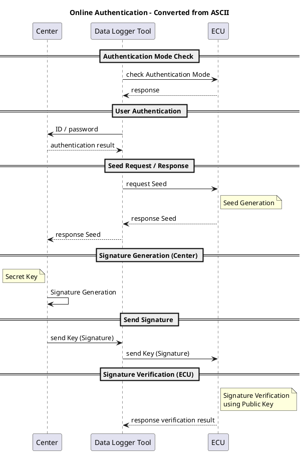
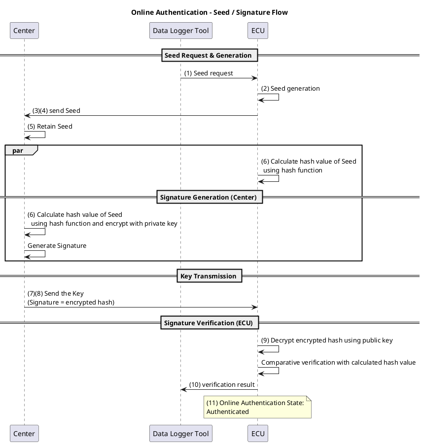
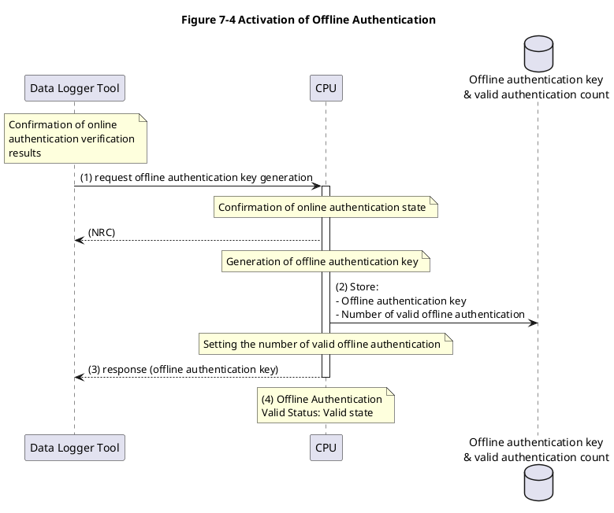
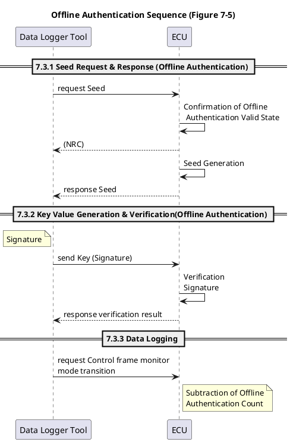

Đặc tả yêu cầu In-Vehicle Network - Message Filtering 1/29
Ứng dụng: ECU của in-Vehicle network
Số hiệu: SEC-ePF-MFG-REQ-SPEC-a03-00-a

TOYOTA MOTOR CORPORATION

1. Revision Record

## Phiên bản Nội dung sửa đổi Ngày Sửa đổi

| Phiên bản | Nội dung sửa đổi                                                                                                                                                                                                                                                                                                  | Ngày              | Sửa đổi    |
| --------- | ----------------------------------------------------------------------------------------------------------------------------------------------------------------------------------------------------------------------------------------------------------------------------------------------------------------- | ----------------- | ---------- |
| a03‑00‑a  | Tạo mới đặc tả dựa trên SEC‑ePF‑MFG‑REQ‑SPEC‑a02‑02‑a <br> **Điểm thay đổi:** <br> - Cập nhật mục Upper‑level Documents <br> - Cập nhật mục Related Documents <br> - Cập nhật mục Terms và Definitions <br> - Thêm mục Notes <br> - Thêm các yêu cầu mới (MFGREQ_00058, MFGREQ_00059, MFGREQ_00060, MFGREQ_00061) | 28 tháng 11, 2025 | 3DEX Yasue |

---

Mục lục

1. Revision Record .................................................................................... 1

2. Introduction .......................................................................................... 4
   Purpose of this Document ................................................................................................................. 4
   Scope ................................................................................................................................................... 4
   Description in this Document ........................................................................................................... 4
   Upper-level Documents ..................................................................................................................... 4
   Related Documents ............................................................................................................................ 5
   Terms and Definitions ....................................................................................................................... 7
   Notes ................................................................................................................................................... 7

3. List of Requirements ............................................................................. 8

4. Filtering Requirements ....................................................................... 10

5. Diagnostic Filtering Requirements ..................................................... 13
   Diagnostic Filtering Targets ........................................................................................................... 13
   Diagnostic Filtering Implementation Details ................................................................................ 13
   Diagnostic Filtering Deactivate Conditions ................................................................................... 13
   Reactivating after Diagnostic Filtering deactivation .................................................................... 13

6. Logging Filtering Requirements ......................................................... 14
   Logging Filtering Targets ................................................................................................................ 14
   Logging Filtering Implementation Details .................................................................................... 14
   Logging Filtering Deactivate Conditions ....................................................................................... 14
   Reactivating after Logging Filtering Deactivation ........................................................................ 14

7. Data Logger Tool Authentication Requirements ................................ 15
   Online Authentication ..................................................................................................................... 16
   Logger Authentication Mode Response Function ................................................................... 17
   User Authentication Function ................................................................................................. 18
   Seed Request & Response (Online Authentication) ............................................................... 18
   Signature Generation & Verification (Online Authentication) ............................................. 19
   Activation of Offline Authentication ............................................................................................... 22
   Offline Authentication ..................................................................................................................... 24
   Seed Request & Response (Offline Authentication) ............................................................... 25
   Key Value Generation & Verification (Offline Authentication) ............................................. 25
   Data Logging ............................................................................................................................ 27
   Deactivation of Offline Authentication ........................................................................................... 27

---

## 2. Introduction

### Mục đích của tài liệu (Purpose of this Document)

Để ngăn chặn các giao tiếp trái phép từ DLC, tài liệu này áp dụng các biện pháp bằng cách giới thiệu Message Filtering cho ECU/VM kết nối với các công cụ bên ngoài thông qua DLC.  
Tài liệu này định nghĩa các yêu cầu để thực hiện Message Filtering.

### Phạm vi (Scope)

Phạm vi của Message Filtering được quy định trong tài liệu này là các ECU/VM kết nối với công cụ bên ngoài thông qua DLC (sau đây gọi là ECU).  
Ngoài ra, cả CAN và Ethernet đều thuộc phạm vi của tài liệu này.

### Mô tả trong tài liệu này (Description in this Document)

Một yêu cầu trong tài liệu này sẽ được gắn nhãn là [MFGREQ_*****].  
Tuy nhiên, những mục được gắn nhãn là (Supplement) là mục bổ sung và do đó không phải là một đặc tả yêu cầu.

### Tài liệu cấp trên (Upper-level Documents)

**Bảng 2-1 Danh sách các tài liệu cấp trên**

| No  | Tiêu đề                                          | Ver. (Xem phiên bản mới nhất)           |
| --- | ------------------------------------------------ | --------------------------------------- |
| 1   | MPW ePF Vehicle Cybersecurity Concept Definition | SEC-ePF-VCL-CPT-INST-DOC-\*\*\*-\*\*-\* |

---

### Tài liệu liên quan (Related Documents)

**Bảng 2-2 Danh sách các tài liệu liên quan**

| No  | Tiêu đề                                                            | Ver.                                              |
| --- | ------------------------------------------------------------------ | ------------------------------------------------- |
| 2   | Management Ledger for Diagnostics Communication Address            | Ver\*.\*.\*                                       |
| 3   | Requirements Specification of Online Client Authentication         | SEC-ePF-RPR-OCA-REQ-SPEC-\*\*\*-\*\*-\*           |
| 4   | Terms and Definitions related to Vehicle Cybersecurity and Privacy | SEC-ePF-TRM-GUD-PROC-\*\*\*-\*\*-\*               |
| 5   | (Đã xóa)                                                           | -                                                 |
| 6   | Requirements Specification of Common Vulnerability Countermeasure  | SEC-ePF-VUL-CMN-REQ-SPEC-\*\*\*-\*\*-\*           |
| 7   | Wired Reprogramming Specification Reprogramming Sequence           | wrrs-\*\*\*\*\*-\*\*\*-\*                         |
| 8   | CAN(FD) Communication Data Format(ARXML) Specification             | gnccanarxmlfmt-\*\*\*-\*\*-\*                     |
| 9   | Automotive Ethernet communication function specification           | etherprotocol-\*\*\*-\*\*-\*                      |
| 10  | Ledger for Phase6 Diagnostic Communication Address                 | Phase6 Diagnostic Communication Address_V\*\_\*\* |
| 11  | Instructions for Prototype Parameter of Message Filtering          | SEC-ePF-MFG-PRT-INST-DOC-\*\*\*-\*\*-\*           |
| 12  | Diagnostic design specification UDS Protocol                       | diaguds-rd\*\*\*-\*\*\*-\*                        |
| 13  | Interface specification of Center-Logger tool                      | TBD                                               |
| 14  | Tool ⇔ GW communication specification                              | TBD                                               |
| 15  | Write Once Requirement Specification                               | wwrtone-rd\*\*\*-\*\*\*-\*                        |

---

**Bảng 2-3 Danh sách các tài liệu liên quan công khai**

| No  | Tiêu đề                                          | Ver. |
| --- | ------------------------------------------------ | ---- |
| 1   | Technical requirements for vehicle cybersecurity | -    |

---

## Thuật ngữ và định nghĩa (Terms and Definitions)

**Bảng 2-4 Danh sách các thuật ngữ và định nghĩa**

| Thuật ngữ                                       | Giải thích                                                                                                                                                                                                                                                    |
| ----------------------------------------------- | ------------------------------------------------------------------------------------------------------------------------------------------------------------------------------------------------------------------------------------------------------------- |
| Control message                                 | • Đối với CAN hoặc CAN-FD, các tin nhắn dành cho điều khiển xe. Tham khảo “10 Message Format Rules” trong Related Documents [8].<br>• Đối với Ethernet, một tin nhắn được sử dụng để truyền/nhận dữ liệu giữa các ứng dụng. Tham khảo “Related Documents [9]” |
| External tool message                           | Các tin nhắn khác ngoài Diagnostic message được gửi và nhận với các công cụ kết nối với xe thông qua DLC như CCP/XCP. Đối với CAN, tham khảo Related Documents [8], và đối với Ethernet, tham khảo Related Documents [9]                                      |
| In-Vehicle Bus                                  | Một bus bên trong xe không được sử dụng để kết nối với các công cụ Diagnostic bên ngoài.                                                                                                                                                                      |
| Diagnostic Client Bus                           | Một bus mà các ECU được trang bị chức năng Diagnostic Client, chẳng hạn như chức năng OTA Master hoặc chức năng Onboard Client, được kết nối.                                                                                                                 |
| In-Vehicle Bus other than Diagnostic Client Bus | Một In-Vehicle Bus mà không có ECU nào được trang bị chức năng Diagnostic Client, chẳng hạn như chức năng OTA Master hoặc chức năng Onboard Client, được kết nối.                                                                                             |

### Ghi chú (Notes)

Đối với các xe thuộc phạm vi của China GB (Public-Related Document [1]), việc xử lý dựa trên tài liệu này có thể liên quan đến các thuật toán mã hóa được quy định trong **VULCMN_00110** của Related Document [6].  
Điều này là do các thay đổi quy định có hiệu lực từ **tháng 1 năm 2028**.  
Nếu các thuật toán mã hóa thay đổi, các hướng dẫn bổ sung sẽ được cung cấp.

---

## 3. List of Requirements

Danh sách các yêu cầu được định nghĩa trong tài liệu này được chỉ ra trong Bảng 3-1.  
Xem Chương 4 và các chương tiếp theo để biết chi tiết về các yêu cầu.

### Bảng 3-1 Requirement List

**Phân loại / Requirement ID**

- **Filtering Requirements**  
  MFGREQ_00001 –  
  MFGREQ_00002 –  
  MFGREQ_00003 –  
  MFGREQ_00004 –  
  MFGREQ_00057 –  
  MFGREQ_00058 –  
  MFGREQ_00059 –  
  MFGREQ_00060 –  
  MFGREQ_00061 –

- **Diagnostic Filtering Requirements**  
  MFGREQ_00005 –  
  MFGREQ_00006 –  
  MFGREQ_00007 –  
  MFGREQ_00016 –

- **Logging Filtering Requirements**  
  MFGREQ_00008 –  
  MFGREQ_00009 –  
  MFGREQ_00010 –  
  MFGREQ_00017 –

- **Data Logger Tool Authentication Requirements**  
   MFGREQ_00011 (Đã xóa) –  
   MFGREQ_00012 (Đã xóa) –  
   MFGREQ_00013 (Đã xóa) –  
   MFGREQ_00014 (Đã xóa) –  
   MFGREQ_00015 (Đã xóa) –  
   MFGREQ_00018 –  
   MFGREQ_00019 –  
   MFGREQ_00020 –  
   MFGREQ_00021 –  
   MFGREQ_00022 –  
   MFGREQ_00023 –  
   MFGREQ_00024 –
  MFGREQ_00025 –  
  MFGREQ_00026 –  
  MFGREQ_00027 –  
  MFGREQ_00028 –  
  MFGREQ_00029 –  
  MFGREQ_00030 –  
  MFGREQ_00031 –  
  MFGREQ_00032 –  
  MFGREQ_00033 –  
  MFGREQ_00034 –  
  MFGREQ_00035 –  
  MFGREQ_00036 –  
  MFGREQ_00037 –  
  MFGREQ_00038 –  
  MFGREQ_00039 –  
  MFGREQ_00040 –  
  MFGREQ_00041 –  
  MFGREQ_00042 –  
  MFGREQ_00043 –  
  MFGREQ_00044 –  
  MFGREQ_00045 –  
  MFGREQ_00046 –  
  MFGREQ_00047 –  
  MFGREQ_00048 –  
  MFGREQ_00049 –  
  MFGREQ_00050 –  
  MFGREQ_00051 –  
  MFGREQ_00052 –  
  MFGREQ_00053 –  
  MFGREQ_00054 –  
  MFGREQ_00055 –  
  MFGREQ_00056 –

---

## 4. Filtering Requirements

**【MFGREQ_00001】**  
ECU sẽ hủy bỏ (discard) các Control message từ các bus và cổng kết nối với các công cụ Diagnostic bên ngoài xe.

**【MFGREQ_00057】**  
ECU sẽ hủy bỏ các External tool message từ các bus và cổng kết nối với các công cụ Diagnostic bên ngoài xe nếu quy trình WriteOnce đã được thực thi.  
Để biết chi tiết về quy trình WriteOnce, tham khảo Related Document [15].

_(Ghi chú)_  
Nếu quy trình WriteOnce chưa được thực thi, việc loại trừ các External tool message khỏi các đối tượng Filtering là được phép.

**【MFGREQ_00002】**  
ECU sẽ thực hiện Diagnostic Filtering cho các Diagnostic Request message từ các bus và cổng kết nối với các công cụ Diagnostic bên ngoài xe.  
Về Diagnostic Filtering, tham khảo “5. Diagnostic Filtering Requirements”.

**【MFGREQ_00003】**  
ECU sẽ thực hiện Logging Filtering cho các Control message đến các bus và cổng kết nối với các công cụ Diagnostic bên ngoài xe.  
Về Logging Filtering, tham khảo “6. Logging Filtering Requirements”.

**【MFGREQ_00058】**  
ECU sẽ không định tuyến (route) các Diagnostic Request message nhận được từ In‑Vehicle Bus other than Diagnostic Client Bus đến các In‑Vehicle Bus khác.

**【MFGREQ_00059】**  
ECU sẽ không định tuyến các Diagnostic Response message nhận được từ In‑Vehicle Bus đến bất kỳ In‑Vehicle Bus nào khác ngoại trừ Diagnostic Client Bus.

**【MFGREQ_00060】**  
ECU sẽ không định tuyến External tool message nhận được từ In‑Vehicle Bus đến bất kỳ In‑Vehicle Bus nào khác.

**【MFGREQ_00061】**  
ECU sẽ định tuyến các Control message nhận được từ In‑Vehicle Bus theo Routing Map đã được định nghĩa trước.

Thông tin tham khảo cho các yêu cầu trong chương này được trình bày trong Bảng 4-1.

### Bảng 4-1 Filtering Requirements

| Nguồn (Source)                                                            | Đích (Destination)                                                      | Control messages  | External tool messages                              | Diagnostic request messages | Diagnostic response messages |
| ------------------------------------------------------------------------- | ----------------------------------------------------------------------- | ----------------- | --------------------------------------------------- | --------------------------- | ---------------------------- |
| ① Buses and ports that connect to diagnostic tools outside of the vehicle | (any)                                                                   | Discard           | Discard (sau khi quy trình WriteOnce được thực thi) | Diagnostic filtering        | N/A                          |
| ② (any)                                                                   | Buses and ports that connect to diagnostic tools outside of the vehicle | Logging filtering | N/A                                                 | N/A                         | N/A                          |
| ③ Diagnostic Client Bus                                                   | In‑Vehicle Bus other than Diagnostic Client Bus                         | Theo Routing Map  | Do not route                                        | N/A                         | Do not route                 |
| ④ In‑Vehicle Bus other than Diagnostic Client Bus                         | Diagnostic Client Bus                                                   | Theo Routing Map  | Do not route                                        | Do not route                | N/A                          |
| ⑤ Diagnostic Client Bus                                                   | Diagnostic Client Bus                                                   | Theo Routing Map  | Do not route                                        | N/A                         | N/A                          |
| ⑥ In‑Vehicle Bus other than Diagnostic Client Bus                         | In‑Vehicle Bus other than Diagnostic Client Bus                         | Theo Routing Map  | Do not route                                        | Do not route                | Do not route                 |

**【MFGREQ_00004】**  
Các biện pháp chống giả mạo (tampering) thông tin cấu hình Filtering sẽ được thực hiện.

_(Bổ sung)_  
Dưới đây là các ví dụ về việc thực hiện các biện pháp chống giả mạo.

- Ví dụ 1: Lưu trữ thông tin cấu hình trong một khu vực an toàn như HSM.
- Ví dụ 2: Secure Boot phát hiện thông tin cấu hình đã bị giả mạo.

---

## 5. Diagnostic Filtering Requirements

### Đối tượng Diagnostic Filtering (Diagnostic Filtering Targets)

**【MFGREQ_00005】**  
ECU sẽ nhắm mục tiêu vào Diagnostic Request message ngoại trừ các địa chỉ giao tiếp Diagnostic được áp dụng hợp pháp cho Diagnostic Filtering.  
(Đối với các địa chỉ giao tiếp Diagnostic, tham khảo “Related Documents [2][10]”).

_(Bổ sung)_  
“Reserve” trong các công cụ dịch vụ và các tin nhắn Remote Diagnostic Response có thể được đặt trong các Diagnostic Request message.  
Do đó, hãy tham khảo địa chỉ Diagnostic mới nhất và cẩn thận không loại trừ Diagnostic Request message khỏi đối tượng Filtering.

### Chi tiết thực hiện Diagnostic Filtering (Diagnostic Filtering Implementation Details)

**【MFGREQ_00006】**  
ECU sẽ hủy bỏ các Diagnostic Request message trong Bảng 5-1 bằng Diagnostic Filtering.

**Bảng 5-1 Diagnostic requests to be filtered (Phase5,6)**

| SID  | Mô tả                                                 |
| ---- | ----------------------------------------------------- |
| 0x10 | DiagnosticSessionControl (Programming session (0x02)) |
| 0x11 | ECUReset                                              |
| 0x28 | CommunicationControl                                  |
| 0x34 | RequestDownload                                       |
| 0x85 | ControlDTCSetting                                     |

**【MFGREQ_00007】**  
ECU sẽ vô hiệu hóa Diagnostic Filtering của MFGREQ_00006 nếu việc xác thực thiết bị kết nối trung tâm (center connection device authentication) hoàn tất thành công.  
Đối với Center connection device authentication, tham khảo “Related Documents [3]”.

### Kích hoạt lại sau khi vô hiệu hóa Diagnostic Filtering (Reactivating after Diagnostic Filtering Deactivation)

**【MFGREQ_00016】**  
Sau khi vô hiệu hóa Diagnostic Filtering trong 【MFGREQ_00007】, ECU sẽ kích hoạt lại Diagnostic Filtering trước khi trạng thái xác thực của Center connection device authentication chuyển sang trạng thái “Unauthenticated”.  
Đối với trạng thái xác thực của Center connection device authentication, tham khảo “Related Documents [3]”.

---

## 6. Logging Filtering Requirements

### Đối tượng Logging Filtering (Logging Filtering Targets)

**【MFGREQ_00008】**  
ECU sẽ nhắm mục tiêu vào các Control message cho Logging Filtering.

### Chi tiết thực hiện Logging Filtering (Logging Filtering Implementation Details)

**【MFGREQ_00009】**  
ECU sẽ hủy bỏ các Control message đến các bus và cổng kết nối với các công cụ Diagnostic bằng Logging Filtering.

### Điều kiện vô hiệu hóa Logging Filtering (Logging Filtering Deactivate Conditions)

**【MFGREQ_00010】**  
ECU sẽ vô hiệu hóa Logging Filtering của MFGREQ_00009 nếu việc xác thực Data Logger Tool hoàn tất thành công.  
Tham khảo Chương 7.3 để biết chi tiết.

### Kích hoạt lại sau khi vô hiệu hóa Logging Filtering (Reactivating after Logging Filtering Deactivation)

**【MFGREQ_00017】**  
Sau khi vô hiệu hóa Logging Filtering trong 【MFGREQ_00010】, ECU sẽ phải cấu hình lại Logging Filtering khi điều kiện Logging Filtering được thỏa mãn.  
Để biết thêm chi tiết, tham khảo Chương 7.3.3.

---

## 7. Data Logger Tool Authentication Requirements

Chuỗi quy trình tổng quan về xác thực Data Logger Tool được trình bày trong Hình 7-1.

```
+--------------------+        +----------------------+        +-------------+
|   Center           |        |     Data Logger Tool |        |    ECU      |
+--------------------+        +----------------------+        +-------------+
            |                            |                           |
        +-----------------------------------------------------------------+
        |                   7.1 Online Authentication                     |
        +-----------------------------------------------------------------+
            |                            |                           |
            |       +-----------------------------------------------------+
            |       |      7.2 Activation of Offline Authentication       |
            |       +-----------------------------------------------------+
            |                            |                           |
            |       +-----------------------------------------------------+
            |       |                 7.3 Offline Authentication          |
            |       +-----------------------------------------------------+
            |       |                    |                           |
            |       +-----------------------------------------------------+
            |       |        7.4 Deactivation of Offline Authentication   |
            |       +-----------------------------------------------------+
            |       |                    |                           |
```

_Hình 7-1 Tổng quan trình tự xác thực Data Logger Tool_

**【MFGREQ_00011】** (Đã xóa)  
**【MFGREQ_00012】** (Đã xóa)  
**【MFGREQ_00013】** (Đã xóa)  
**【MFGREQ_00014】** (Đã xóa)  
**【MFGREQ_00015】** (Đã xóa)

## 7.1 Online Authentication

Trình tự của Online Authentication được trình bày trong Hình 7-2.



_Hình 7-2 Trình tự Online Authentication_

### Chức năng phản hồi Logger Authentication Mode (Logger Authentication Mode Response Function)

**【MFGREQ_00018】**  
ECU sẽ xác định Logger Authentication Mode hiện tại (Prototype Mode hoặc Production Mode) dựa trên loại Public Key (Prototype Key / Production Key) được sử dụng trong Online Authentication với Center.

**【MFGREQ_00054】**  
ECU sẽ sử dụng Public Key trong Related Document [11] cho Online Authentication khi nó là một Prototype Key, và sử dụng khóa được phân phối từ Center khi nó là một Production Key.

**【MFGREQ_00019】**  
ECU sẽ phản hồi với Logger Authentication Mode hiện tại khi được yêu cầu truy xuất Logger Authentication Mode từ Data Logger Tool.

**【MFGREQ_00020】**  
ECU sẽ lưu trữ Public Key được sử dụng trong Online Authentication với các biện pháp ngăn chặn giả mạo.

**【MFGREQ_00021】**  
Tin nhắn yêu cầu để truy xuất Logger Authentication Mode sẽ tuân theo Bảng 7-1.  
Định dạng tin nhắn yêu cầu khi chỉ định nhiều dataIdentifier sẽ tuân thủ Related Document [12].

**Bảng 7-1 Logger Authentication Mode Retrieval Request Message Format**

| A_Data byte | Parameter                        | Byte Value | Scaling / Bit |
| ----------- | -------------------------------- | ---------- | ------------- |
| #1          | ReadDataByIdentifier Request SID | 0x22       | hexadecimal   |
| #2          | dataIdentifier[] byte#1 (MSB)    | 0xA9       | hexadecimal   |
| #3          | dataIdentifier[] byte#2          | 0xD0       | hexadecimal   |

**【MFGREQ_00022】**  
Tin nhắn phản hồi cho truy xuất Logger Authentication Mode sẽ tuân theo Bảng 7-2.  
Định dạng tin nhắn phản hồi khi chỉ định nhiều dataIdentifier, và chi tiết của phản hồi âm (negative response) sẽ tuân thủ Related Document [12].

**Bảng 7-2 Logger Authentication Mode Retrieval Positive Response Message Format**

| A_Data byte | Parameter                         | Byte Value | Scaling / Bit |
| ----------- | --------------------------------- | ---------- | ------------- |
| #1          | ReadDataByIdentifier Response SID | 0x62       | hexadecimal   |
| #2          | dataIdentifier[] byte#1 (MSB)     | 0xA9       | hexadecimal   |
| #3          | dataIdentifier[] byte#2           | 0xD0       | hexadecimal   |
| #4          | dataRecord[] byte#1               | 0xXX       | hexadecimal   |

Giá trị phản hồi của dataRecord (Logger Authentication Mode) như sau:

- 0x00 = Prototype Mode
- 0x01 = Production Mode

### Chức năng xác thực người dùng (User Authentication Function)

**【MFGREQ_00023】**  
Data Logger Tool sẽ truyền ID và mật khẩu của nó đến Center.  
Center sẽ xác minh rằng ID và mật khẩu nhận được từ Data Logger Tool là chính xác.  
Center sẽ gửi kết quả xác thực người dùng trở lại Data Logger Tool.

**【MFGREQ_00024】**  
Data Logger Tool sẽ xác định Center để kết nối dựa trên Logger Authentication Mode của ECU.

### Seed Request & Response (Online Authentication)

**【MFGREQ_00025】**  
(1) Data Logger Tool sẽ gửi một yêu cầu Seed (Seed request) đến ECU.  
(2) ECU sẽ tạo và lưu giữ Seed (số ngẫu nhiên).  
Số ngẫu nhiên được tạo sẽ tuân thủ “VULCMN_00200” và “VULCMN_00300” trong Related Document [6].  
(3) ECU sẽ truyền Seed được tạo trong bước (2) đến Data Logger Tool.  
(4) Data Logger Tool sẽ gửi Seed và Key ID được chỉ định bởi Key Management Center đến Center khi xác thực người dùng thành công.  
(5) Center sẽ lưu giữ Seed (cho đến khi quá trình xử lý của 【MFGREQ_00028】(8) được hoàn tất).  
(Tham khảo Hình 7-3)

**【MFGREQ_00026】**  
Tin nhắn Diagnostic Communication của yêu cầu Seed trong Online Authentication giữa Data Logger Tool và ECU sẽ tuân theo Bảng 7-3.  
Tham khảo Related Document [12] để biết chi tiết.

**Bảng 7-3 Online Authentication Seed Request**

| Item           | Content                           |
| -------------- | --------------------------------- |
| SID            | 0x27 (SecurityAccess Request SID) |
| sub-function   | requestSeed                       |
| Security Level | 4                                 |

**【MFGREQ_00027】**  
Tham khảo Related Document [13] để biết chi tiết về giao tiếp liên quan đến yêu cầu Seed giữa Data Logger Tool và Center.

### Tạo & Xác minh chữ ký (Online Authentication) (Signature Generation & Verification (Online Authentication))

**【MFGREQ_00028】**  
(6) Center sẽ tính toán giá trị Hash của Seed, mã hóa nó bằng một Private Key, và tạo ra Key (Signature).  
(7) Center sẽ gửi Key (Signature) đến Data Logger Tool.  
(8) Data Logger Tool sẽ truyền Key (Signature) đến ECU.  
(9) ECU sẽ giải mã Key (Signature) bằng một Public Key và xác minh chữ ký.  
(10) ECU sẽ gửi kết quả xác minh đến Data Logger Tool.  
(11) ECU sẽ đặt trạng thái Online Authentication thành trạng thái Authenticated nếu xác minh chữ ký thành công (OK).

(Tham khảo Hình 7-3 và Bảng 7-4)



_Hình 7-3 Tổng quan Seed Request & Response / Signature Generation & Verification (Online Authentication)_

### Bảng 7-4 Signature Generation & Verification Method (Online Authentication)

| Item                   | Content                                            |
| ---------------------- | -------------------------------------------------- |
| Authentication Method  | CHAP (Challenge Handshake Authentication Protocol) |
| Algorithm              | RSASSA-PKCS1_v1_5                                  |
| Key Length             | 3072bit                                            |
| RSA public exponent    | e = 65537                                          |
| Hash Function          | SHA-256                                            |
| Seed Length            | 128bit                                             |
| Key (Signature) Length | 3072bit                                            |

**【MFGREQ_00029】**  
Tin nhắn Diagnostic Communication cho việc truyền Key trong Online Authentication giữa Data Logger Tool và ECU sẽ tuân theo Bảng 7-5.  
Tham khảo Related Document [12] để biết chi tiết.

**Bảng 7-5 Online Authentication Key Transmission**

| Item           | Content                           |
| -------------- | --------------------------------- |
| SID            | 0x27 (SecurityAccess Request SID) |
| sub-function   | sendKey                           |
| Security Level | 4                                 |

**【MFGREQ_00030】**  
Tham khảo Related Document [13] để biết chi tiết về giao tiếp liên quan đến truyền Key giữa Data Logger Tool và Center.

**【MFGREQ_00056】**  
ECU sẽ đặt trạng thái Online Authentication sang trạng thái Unauthenticated khi phiên làm việc (session) với Data Logger Tool bị gián đoạn.

_(Ghi chú)_  
Trạng thái ban đầu của Online Authentication là trạng thái Unauthenticated.

## Activation of Offline Authentication

Trình tự kích hoạt Offline Authentication được trình bày trong Hình 7-4.



_Hình 7-4 Kích hoạt Offline Authentication_

**【MFGREQ_00031】**  
(1) Data Logger Tool sẽ yêu cầu ECU tạo Offline Authentication Key khi kết quả xác minh của Online Authentication là OK.  
(2) Khi ECU được yêu cầu tạo Offline Authentication Key trong khi trạng thái Online Authentication là trạng thái Authenticated, nó sẽ tạo Offline Authentication Key và đặt số lần xác thực Offline hợp lệ.  
Giá trị đặt cho số lần xác thực Offline hợp lệ là 600 lần.  
(3) ECU sẽ gửi Offline Authentication Key đã tạo đến Data Logger Tool.  
(4) Khi quá trình kích hoạt Offline Authentication hoàn tất, ECU sẽ đặt trạng thái hiệu lực của Offline Authentication sang trạng thái Valid.

**【MFGREQ_00032】**  
Tin nhắn yêu cầu để tạo một Offline Authentication Key sẽ tuân theo Bảng 7-6.  
(StopRoutine, RequestRoutineResults: Không được hỗ trợ)

### Bảng 7-6 Định dạng tin nhắn yêu cầu tạo Offline Authentication Key (StartRoutine)

| A_Data byte | Parameter                                                          | Byte Value | Scaling / Bit |
| ----------- | ------------------------------------------------------------------ | ---------- | ------------- |
| #1          | RoutineControl Request SID                                         | 0x31       | hexadecimal   |
| #2          | subFunction = StartRoutine, suppressPosRspMsgIndicationBit = FALSE | 0x01       | hexadecimal   |
| #3          | routineIdentifier[] byte#1 (MSB)                                   | 0xD9       | hexadecimal   |
| #4          | routineIdentifier[] byte#2                                         | 0xD0       | hexadecimal   |

※ Không có routineControlOptionRecord.

---

**【MFGREQ_00033】**  
Đối với tin nhắn phản hồi tạo một Offline Authentication Key, phản hồi dương (positive response) sẽ tuân theo Bảng 7-7, và phản hồi âm (negative response) sẽ tuân theo Related Document [12].

### Bảng 7-7 Định dạng tin nhắn phản hồi dương cho việc tạo Offline Authentication Key

| A_Data byte | Parameter                        | Byte Value | Scaling / Bit |
| ----------- | -------------------------------- | ---------- | ------------- |
| #1          | RoutineControl Response SID      | 0x71       | hexadecimal   |
| #2          | subFunction = StartRoutine       | 0x01       | hexadecimal   |
| #3          | routineIdentifier[] byte#1 (MSB) | 0xD9       | hexadecimal   |
| #4          | routineIdentifier[] byte#2       | 0xD0       | hexadecimal   |
| #5          | routineInfo                      | 0x02       | hexadecimal   |
| #6–#21      | routineStatusRecord[]            | bất kỳ     | hexadecimal   |

※ routineStatusRecord[] là giá trị của Offline Authentication Key đã được tạo.

---

**【MFGREQ_00055】**  
ECU sẽ tạo Offline Authentication Key tuân thủ “VULCMN_00200” và “VULCMN_00300” trong Related Document [6].

**【MFGREQ_00034】**  
ECU sẽ lưu trữ an toàn Offline Authentication Key tuân thủ “VULCMN_01700”, “VULCMN_01701”, và “VULCMN_01702” trong Related Document [6].

**【MFGREQ_00035】**  
ECU sẽ thực hiện các biện pháp chống giả mạo và lưu trữ số lần xác thực Offline hợp lệ.

**【MFGREQ_00036】**  
Data Logger Tool sẽ lưu trữ an toàn Offline Authentication Key nhận được.

---

## Offline Authentication

Trình tự cho Offline Authentication được trình bày trong Hình 7-5.



_Hình 7-5 Trình tự Offline Authentication_

**7.3.1 Seed Request & Response (Offline Authentication)**

**【MFGREQ_00038】**
(1) Data Logger Tool sẽ gửi yêu cầu Seed đến ECU.
(2) Khi trạng thái hiệu lực của Offline Authentication là trạng thái Valid, ECU sẽ tạo và lưu giữ Seed (số ngẫu nhiên).
Số ngẫu nhiên được tạo phải tuân theo Related Document [6] “VULCMN_00200” và “VULCMN_00300”.
(3) ECU sẽ gửi Seed được tạo trong bước (2) đến Data Logger Tool.
(4) Data Logger Tool sẽ lưu giữ Seed.
(Tham khảo Hình 7-6)

**【MFGREQ_00039】**
Tin nhắn Diagnostic Communication cho yêu cầu Seed trong Offline Authentication giữa Data Logger Tool và ECU sẽ tuân theo Bảng 7-8.
Để biết chi tiết, tham khảo Related Document [12].

### Bảng 7-8 Offline Authentication Seed Request

| Item           | Content                           |
| -------------- | --------------------------------- |
| SID            | 0x27 (SecurityAccess Request SID) |
| sub-function   | requestSeed                       |
| Security Level | 3                                 |

**7.3.2 Tạo & Xác minh giá trị khóa (Offline Authentication) (Key Value Generation & Verification (Offline Authentication))**

**【MFGREQ_00040】**
(5) Data Logger Tool sẽ tạo giá trị Key bằng cách sử dụng Seed nhận được từ ECU và Offline Authentication Key.
(6) Data Logger Tool sẽ gửi giá trị Key đến ECU.
(7) ECU sẽ tạo giá trị Key bằng cách sử dụng Seed đã tạo trong 【MFGREQ_00038】(2) và Offline Authentication Key.
(8) ECU sẽ so sánh giá trị Key nhận được từ Data Logger Tool trong bước (6) với giá trị Key được tạo trong bước (7) để xác nhận xem chúng có khớp nhau hay không.
Nếu chúng khớp nhau, nó được coi là xác thực thành công, và nếu không khớp, nó được coi là xác thực thất bại.
(9) ECU sẽ gửi kết quả xác thực đến Data Logger Tool.
(10) Nếu xác thực thành công, ECU sẽ đặt trạng thái Offline Authentication thành trạng thái Authenticated.

(Tham khảo Hình 7-6 và Bảng 7-9)

```plantuml
@startuml
title Figure 7-6 Overview of Seed Request & Response / Key Value Generation & Verification\n(Offline Authentication)

participant "Data Logger Tool" as DLT
participant ECU


== Seed Request & Response ==

DLT -> ECU : (1) request Seed
ECU -> ECU: (2) Seed Generation


ECU --> DLT : (3) send Seed
DLT -> DLT: (4) retain seed

== Key Value Generation ==
par
    DLT -> DLT : (5) Key value Generation\n(using Offline Authentication Key)
    ECU -> ECU : (7) Key value Generation\n(using Offline Authentication Key)
end

DLT -> ECU : (6) send Key value

ECU -> ECU: (8) Key value comparison

ECU --> DLT : (9) Verification result

note over ECU
(10) Offline Authentication State:\nAuthenticated


@enduml
```

_Hình 7-6 Tổng quan Seed Request & Response / Key Value Generation & Verification (Offline Authentication)_

### Bảng 7-9 Key Value Generation Method (Offline Authentication)

| Item                            | Content                                            |
| ------------------------------- | -------------------------------------------------- |
| Authentication Method           | CHAP (Challenge Handshake Authentication Protocol) |
| Key value calculation algorithm | AES128 ECB                                         |
| Key length                      | 128bit                                             |
| Seed length                     | 128bit                                             |
| Key length                      | 128bit                                             |

**【MFGREQ_00041】**
Tin nhắn Diagnostic Communication cho việc truyền Key trong Offline Authentication giữa Data Logger Tool và ECU sẽ tuân theo Bảng 7-10.
Để biết chi tiết, tham khảo Related Document [12].

### Bảng 7-10 Offline Authentication Key Transmission

| Item           | Content                           |
| -------------- | --------------------------------- |
| SID            | 0x27 (SecurityAccess Request SID) |
| sub-function   | sendKey                           |
| Security Level | 3                                 |

**7.3.3 Data Logging**

### Tạo & Xác minh giá trị khóa (Offline Authentication) (Key Value Generation & Verification (Offline Authentication))

## Data Logging

**【MFGREQ_00042】**  
Data Logger Tool sẽ yêu cầu ECU chuyển sang chế độ Control Frame Monitor Mode khi kết quả xác minh chữ ký của Offline Authentication là OK.  
Để biết chi tiết về yêu cầu chuyển đổi Control Frame Monitor Mode, tham khảo Related Document [14].

**【MFGREQ_00043】**  
Khi ECU được yêu cầu chuyển sang Control Frame Monitor Mode bởi Data Logger Tool trong khi trạng thái Offline Authentication là trạng thái Authenticated, ECU sẽ giảm số lần xác thực Offline hợp lệ và vô hiệu hóa Logging Filtering.

**【MFGREQ_00044】**  
Khi phiên làm việc với Data Logger Tool bị gián đoạn trong khi trạng thái Offline Authentication là trạng thái Authenticated, ECU sẽ đặt trạng thái Offline Authentication sang trạng thái Unauthenticated và kích hoạt Logging Filtering.

_(Ghi chú)_  
Trạng thái ban đầu của Offline Authentication là trạng thái Unauthenticated.

---

## Deactivation of Offline Authentication

**【MFGREQ_00045】**  
ECU sẽ đặt trạng thái hiệu lực của Offline Authentication sang trạng thái Invalid khi số lần xác thực Offline hợp lệ đạt đến mức không.

_(Ghi chú)_  
Trạng thái ban đầu của trạng thái hiệu lực Offline Authentication là trạng thái Invalid.

**【MFGREQ_00046】**  
Khi ECU được yêu cầu vô hiệu hóa Offline Authentication bởi Data Logger Tool trong khi trạng thái hiệu lực Offline Authentication là trạng thái Valid, ECU sẽ đặt trạng thái hiệu lực Offline Authentication sang trạng thái Invalid.

**【MFGREQ_00047】**  
Yêu cầu StartRoutine cho việc vô hiệu hóa Offline Authentication sẽ tuân theo Bảng 7-11.  
(StopRoutine, RequestRoutineResults: Không được hỗ trợ)

### Bảng 7-11 Định dạng tin nhắn yêu cầu vô hiệu hóa Offline Authentication (StartRoutine)

| A_Data byte | Parameter                                                                 | Byte Value  | Scaling / Bit |
| ----------- | ------------------------------------------------------------------------- | ----------- | ------------- |
| #1          | RoutineControl Request SID                                                | 0x31        | hexadecimal   |
| #2          | subFunction = StartRoutine, suppressPosRspMsgIndicationBit = FALSE / TRUE | 0x01 / 0x81 | hexadecimal   |
| #3          | routineIdentifier[] byte#1 (MSB)                                          | 0xD9        | hexadecimal   |
| #4          | routineIdentifier[] byte#2                                                | 0xD1        | hexadecimal   |

※ Không có routineControlOptionRecord.

---

**【MFGREQ_00048】**  
Phản hồi dương của StartRoutine cho việc vô hiệu hóa Offline Authentication sẽ tuân theo Bảng 7-12.  
Chi tiết về phản hồi dương và âm sẽ tuân thủ Related Document [12].

### Bảng 7-12 Định dạng tin nhắn phản hồi vô hiệu hóa Offline Authentication (StartRoutine)

| A_Data byte | Parameter                        | Byte Value | Scaling / Bit |
| ----------- | -------------------------------- | ---------- | ------------- |
| #1          | RoutineControl Response SID      | 0x71       | hexadecimal   |
| #2          | subFunction = StartRoutine       | 0x01       | hexadecimal   |
| #3          | routineIdentifier[] byte#1 (MSB) | 0xD9       | hexadecimal   |
| #4          | routineIdentifier[] byte#2       | 0xD1       | hexadecimal   |
| #5          | routineInfo                      | 0x02       | hexadecimal   |

※ Không có routineStatusRecord.

**【MFGREQ_00049】**  
ECU sẽ phản hồi với số lần xác thực Offline hợp lệ khi được Data Logger Tool yêu cầu xác nhận số lần xác thực Offline hợp lệ (offline authentication validation count confirmation).

**【MFGREQ_00050】**  
Tin nhắn yêu cầu xác nhận số lần xác thực Offline hợp lệ sẽ tuân theo Bảng 7-13.  
Định dạng tin nhắn yêu cầu khi chỉ định nhiều dataIdentifier sẽ tuân thủ Related Document [12].

### Bảng 7-13 Offline authentication validation count confirmation request message format

| A_Data byte | Parameter                        | Byte Value | Scaling / Bit |
| ----------- | -------------------------------- | ---------- | ------------- |
| #1          | ReadDataByIdentifier Request SID | 0x22       | hexadecimal   |
| #2          | dataIdentifier[] byte#1 (MSB)    | 0xA9       | hexadecimal   |
| #3          | dataIdentifier[] byte#2          | 0xD1       | hexadecimal   |

**【MFGREQ_00051】**  
Tin nhắn phản hồi cho việc kiểm tra số lần xác thực Offline hợp lệ sẽ tuân theo Bảng 7-14.  
Định dạng tin nhắn phản hồi và chi tiết các phản hồi âm khi nhiều dataIdentifier được chỉ định sẽ tuân thủ Related Document [12].

### Bảng 7-14 Offline authentication validation count confirmation positive response message format

| A_Data byte | Parameter                         | Byte Value | Scaling / Bit |
| ----------- | --------------------------------- | ---------- | ------------- |
| #1          | ReadDataByIdentifier Response SID | 0x62       | hexadecimal   |
| #2          | dataIdentifier[] byte#1 (MSB)     | 0xA9       | hexadecimal   |
| #3          | dataIdentifier[] byte#2           | 0xD1       | hexadecimal   |
| #4          | dataRecord[] byte#1 (MSB)         | 0xXX       | hexadecimal   |
| #5          | dataRecord[] byte#2               | 0xXX       | hexadecimal   |

_(Ghi chú 1)_  
dataRecord[]#1 là số lượng các xác thực Offline hợp lệ.

**【MFGREQ_00052】**  
ECU sẽ chuyển trạng thái hiệu lực của Offline Authentication sang trạng thái Invalid khi được Data Logger Tool yêu cầu xác thực Online (online authentication) lần nữa trong khi trạng thái hiệu lực Offline Authentication là trạng thái Valid.

**【MFGREQ_00053】**  
Khi ECU chuyển trạng thái hiệu lực của Offline Authentication sang trạng thái Invalid, ECU sẽ hủy bỏ Offline Authentication Key đang nắm giữ và đặt số lần xác thực Offline hợp lệ về mức không.
