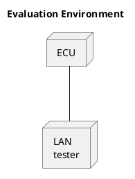

# In-Vehicle Network Test Specification of Message Filtering

---

## 1. Revision Record

| Version  | Contents of revision                                                                                                                                                                                                                    | Date         | Revise     |
| -------- | --------------------------------------------------------------------------------------------------------------------------------------------------------------------------------------------------------------------------------------- | ------------ | ---------- |
| a03-00-a | - Update Table 3-1 (updating trace information of MFGTST_00019)   - Update Pass-fail judgment (MFGTST_00028)   - Addition of MFGTST_00058, MFGTST_00059, MFGTST_00060, and MFGTST_00061 due to changes in filtering requirements. | Mar. 6, 2026 | 3DEX Ikeno |

---

## Table of Contents

1. Revision Record ............................................................................................................ 1

2. Introduction ................................................................................................................. 3

- Purpose of this Document ................................................................................................................. 3
- Scope ................................................................................................................................................... 3
- Preconditions ...................................................................................................................................... 3
- Description in this Document ........................................................................................................... 3
- Upper-Level Document ...................................................................................................................... 3
- Related Documents ............................................................................................................................ 4

3. Outline of Evaluation .................................................................................................. 5

- Traceability of requirements specification and test specification ................................................... 5
- List of test items ................................................................................................................................ 7

4. Evaluation Environment ............................................................................................. 9

5. Evaluation items ........................................................................................................ 10

- Filtering ............................................................................................................................................ 10
- Diagnostic Filtering ......................................................................................................................... 15
- Logging Filtering ............................................................................................................................. 18
- Data Logger Tool Authentication .................................................................................................... 18

---

## 2. Introduction

### Purpose of this Document

In order to prevent unauthorized communication from DLC, this document takes measures by introducing message filtering to the ECU/VM that connects with the external tool through DLC.  
This document defines the evaluation method to check that message filtering function behaves in accordance with requirements.

### Scope

The scope of the message filtering specified in this document is the ECU/VM that connects with the external tool through DLC (hereinafter referred to as ECU).  
In addition, both CAN and Ethernet are the scope of this document.

### Preconditions

Nothing.

### Description in this Document

A requirement in this document shall be labeled as `[MFGTST_******]`.  
However, provided that what is labeled as **(Supplement)** is a supplementary item and therefore is not a requirement specification.

### Upper-Level Document

The upper-level document is shown in Table 2-1.

**Table 2-1 List of Upper-level document**

| No  | Document name                                   | Version                   |
| --- | ----------------------------------------------- | ------------------------- |
| 1   | Requirements Specification of Message Filtering | SEC-ePF-MFG-REQ-a03-00-\* |

### Related Documents

The related documents are shown in Table 2-2.

**Table 2-2 List of Related documents**

| No  | Documents names                                                                                                 | Version (See the latest version)    |
| --- | --------------------------------------------------------------------------------------------------------------- | ----------------------------------- |
| 1   | Management Ledger for Diagnostics Communication Address Management Ledger for Diagnostics Communication Address | Ver*.*.\*                           |
| 2   | Requirements Specification of Online Client Authentication                                                      | SEC-ePF-RPR-OCA-REQ-SPEC-**\*-**-\* |
| 3   | Terms and Definitions related to Vehicle Cybersecurity and Privacy                                              | SEC-ePF-TRM-GUD-PROC-**\*-**-\*     |
| 4   | The Common Key Instruction for Regular Tool Authentication (for Data Logging)                                   | SEC-ePF-MFG-IKV-INST-DOC-**\*-**-\* |
| 5   | Requirements Specification of Common Vulnerability Countermeasure                                               | SEC-ePF-VUL-CMN-REQ-SPEC-**_-_**    |
| 6   | Diagnostic Evaluation specification UDS Protocol                                                                | diaguds-evl***-***-\*               |
| 7   | Tool-GW Communication Specification (TBD)                                                                       | TBD                                 |
| 8   | Write Once Requirement Specification                                                                            | wwrtone-rd***-***-\*                |

---

## 3. Outline of Evaluation

### Traceability of requirements specification and test specification

Table 3-1 shows the traceability for requirements specification and test specification.  
In addition, the requirements that need to be adjusted at the time of production are indicated by "○" in the "Production-time functions" column.

**Table 3-1 Confirmation list of Traceability for requirements specification and test specification**

| Requirements Specification ID | Test Specification ID                    | Reason for no evaluation items               | Production-time functions |
| ----------------------------- | ---------------------------------------- | -------------------------------------------- | ------------------------- |
| MFGREQ_00001                  | MFGTST_00001                             | -                                            | -                         |
| MFGREQ_00002                  | MFGTST_00003, MFGTST_00004, MFGTST_00005 | -                                            | -                         |
| MFGREQ_00003                  | MFGTST_00010                             | -                                            | -                         |
| MFGREQ_00004                  | MFGTST_00002                             | -                                            | -                         |
| MFGREQ_00005                  | MFGTST_00003, MFGTST_00004, MFGTST_00005 | -                                            | -                         |
| MFGREQ_00006                  | MFGTST_00004, MFGTST_00005               | -                                            | -                         |
| MFGREQ_00007                  | MFGTST_00004, MFGTST_00005               | -                                            | -                         |
| MFGREQ_00008                  | MFGTST_00010                             | -                                            | -                         |
| MFGREQ_00009                  | MFGTST_00010                             | -                                            | -                         |
| MFGREQ_00010                  | MFGTST_00010                             | -                                            | -                         |
| MFGREQ_00011                  | (Deleted)                                | The requirement is deleted                   | -                         |
| MFGREQ_00012                  | (Deleted)                                | The requirement is deleted                   | -                         |
| MFGREQ_00013                  | (Deleted)                                | The requirement is deleted                   | -                         |
| MFGREQ_00014                  | (Deleted)                                | The requirement is deleted                   | -                         |
| MFGREQ_00015                  | (Deleted)                                | The requirement is deleted                   | -                         |
| MFGREQ_00016                  | MFGTST_00006                             | -                                            | -                         |
| MFGREQ_00017                  | MFGTST_00024                             | -                                            | -                         |
| MFGREQ_00018                  | MFGTST_00013, MFGTST_00014               | -                                            | -                         |
| MFGREQ_00019                  | MFGTST_00013, MFGTST_00014               | -                                            | -                         |
| MFGREQ_00020                  | MFGTST_00015                             | -                                            | -                         |
| MFGREQ_00021                  | MFGTST_00013, MFGTST_00014               | -                                            | -                         |
| MFGREQ_00022                  | MFGTST_00013, MFGTST_00014               | -                                            | -                         |
| MFGREQ_00023                  | -                                        | The requirement is related to out of vehicle | -                         |
| MFGREQ_00024                  | -                                        | The requirement is related to out of vehicle | -                         |
| MFGREQ_00025                  | MFGTST_00016                             | -                                            | -                         |
| MFGREQ_00026                  | MFGTST_00016                             | -                                            | -                         |
| MFGREQ_00027                  | -                                        | The requirement is related to out of vehicle | -                         |
| MFGREQ_00028                  | MFGTST_00016                             | -                                            | -                         |
| MFGREQ_00029                  | MFGTST_00016                             | -                                            | -                         |
| MFGREQ_00030                  | -                                        | The requirement is related to out of vehicle | -                         |
| MFGREQ_00031                  | MFGTST_00017, MFGTST_00018               | -                                            | -                         |
| MFGREQ_00032                  | MFGTST_00017, MFGTST_00018               | -                                            | -                         |
| MFGREQ_00033                  | MFGTST_00017, MFGTST_00018               | -                                            | -                         |
| MFGREQ_00034                  | MFGTST_00015                             | -                                            | -                         |
| MFGREQ_00035                  | MFGTST_00015                             | -                                            | -                         |
| MFGREQ_00036                  | -                                        | The requirement is related to out of vehicle | -                         |
| MFGREQ_00037                  | (Deleted)                                | The requirement is deleted                   | -                         |
| MFGREQ_00038                  | MFGTST_00020, MFGTST_00021               | -                                            | -                         |
| MFGREQ_00039                  | MFGTST_00020, MFGTST_00021               | -                                            | -                         |
| MFGREQ_00040                  | MFGTST_00020, MFGTST_00021               | -                                            | -                         |
| MFGREQ_00041                  | MFGTST_00020, MFGTST_00021               | -                                            | -                         |
| MFGREQ_00042                  | MFGTST_00022, MFGTST_00023               | -                                            | -                         |
| MFGREQ_00043                  | MFGTST_00022, MFGTST_00023               | -                                            | -                         |
| MFGREQ_00044                  | MFGTST_00024                             | -                                            | -                         |
| MFGREQ_00045                  | MFGTST_00025                             | -                                            | -                         |
| MFGREQ_00046                  | MFGTST_00026, MFGTST_00027               | -                                            | -                         |
| MFGREQ_00047                  | MFGTST_00026, MFGTST_00027               | -                                            | -                         |
| MFGREQ_00048                  | MFGTST_00026, MFGTST_00027               | -                                            | -                         |
| MFGREQ_00049                  | MFGTST_00028                             | -                                            | -                         |
| MFGREQ_00050                  | MFGTST_00028                             | -                                            | -                         |
| MFGREQ_00051                  | MFGTST_00028                             | -                                            | -                         |
| MFGREQ_00052                  | MFGTST_00029                             | -                                            | -                         |
| MFGREQ_00053                  | MFGTST_00029                             | -                                            | -                         |
| MFGREQ_00054                  | -                                        | The requirement is related to operations     | -                         |
| MFGREQ_00055                  | MFGTST_00030                             | -                                            | -                         |
| MFGREQ_00056                  | MFGTST_00019                             | -                                            | -                         |
| MFGREQ_00057                  | MFGTST_00031                             | -                                            | -                         |
| MFGREQ_00058                  | MFGTST_00032, MFGTST_00033               |                                              |                           |
| MFGREQ_00059                  | MFGTST_00034                             |                                              |                           |
| MFGREQ_00060                  | MFGTST_00035                             |                                              |                           |
| MFGREQ_00061                  | MFGTST_00036                             |                                              |                           |

### List of test items

The list of test items are shown in Table 3-2.

**Table 3-2 List of test items**

| Classification                  | Test specification ID | Test items                                                                              |
| ------------------------------- | --------------------- | --------------------------------------------------------------------------------------- |
| Filtering                       | MFGTST_00001          | Filtering(control message/Vehicle-to-Outside Communication)                             |
|                                 | MFGTST_00031          | Filtering(external tool message/Vehicle-to-Outside Communication)                       |
|                                 | MFGTST_00002          | Filtering(Countermeasures against tampering with filtering configuration information)   |
|                                 | MFGTST_00032          | Filtering(control message/In-vehicle communication described in the routing map)        |
|                                 | MFGTST_00033          | Filtering(control message/In-vehicle communication not described in the routing map)    |
|                                 | MFGTST_00034          | Filtering(external tool message/In-vehicle communication)                               |
|                                 | MFGTST_00035          | Filtering(diagnostic request message/In-vehicle communication)                          |
|                                 | MFGTST_00036          | Filtering(diagnostic response message/In-vehicle communication)                         |
| Diagnostic Filtering            | MFGTST_00003          | Diagnostic Filtering(legislative diagnostics)                                           |
|                                 | MFGTST_00004          | Diagnostic Filtering(Before center connection device authentication)                    |
|                                 | MFGTST_00005          | Diagnostic Filtering(After center connection device authentication)                     |
| Diagnostic Filtering            | MFGTST_00006          | Diagnostic Filtering(Filtering reactivating)                                            |
| Logging Filtering               | MFGTST_00010          | Logging Filtering(Before data logger tool authentication)                               |
|                                 | MFGTST_00011          | (Deleted)                                                                               |
|                                 | MFGTST_00012          | (Deleted)                                                                               |
| Data Logger Tool Authentication | MFGTST_00007          | (Deleted)                                                                               |
|                                 | MFGTST_00008          | (Deleted)                                                                               |
|                                 | MFGTST_00009          | (Deleted)                                                                               |
|                                 | MFGTST_00013          | Logger Authentication Mode Response (Prototype key)                                     |
|                                 | MFGTST_00014          | Logger Authentication Mode Response (Production key)                                    |
|                                 | MFGTST_00015          | Data Protection Measures                                                                |
|                                 | MFGTST_00016          | Online Authentication                                                                   |
|                                 | MFGTST_00017          | Activation of Offline Authentication (Normal)                                           |
|                                 | MFGTST_00018          | Activation of Offline Authentication (Abnormal)                                         |
|                                 | MFGTST_00019          | Online Authentication Deactivation                                                      |
|                                 | MFGTST_00020          | Offline Authentication (Normal)                                                         |
|                                 | MFGTST_00021          | Offline Authentication (Abnormal)                                                       |
|                                 | MFGTST_00022          | Logging Filter Deactivation (Normal)                                                    |
|                                 | MFGTST_00023          | Logging Filter Deactivation (Abnormal)                                                  |
|                                 | MFGTST_00024          | Logging Filtering                                                                       |
|                                 | MFGTST_00025          | Deactivation of Offline Authentication Valid State (upper limit of the number of times) |
|                                 | MFGTST_00026          | Deactivation during Offline Authentication Valid State (Deactivation Request)           |
|                                 | MFGTST_00027          | Deactivation during Offline Authentication Invalid State (Deactivation Request)         |
|                                 | MFGTST_00028          | Confirmation of Offline Authentication Validation Count                                 |
|                                 | MFGTST_00029          | Online Authentication during Offline Authentication Valid State                         |
|                                 | MFGTST_00030          | Generation of Offline Authentication Key (Random number)                                |

---

## 4. Evaluation Environment

The evaluation environment shown in Figure 4-1.

**Figure 4-1 Evaluation Environment**

Note 1: CANoe (Vector) is assumed for the LAN tester.

---

## 5. Evaluation items

### Filtering

### 【MFGTST_00001】Filtering (control message / Vehicle-to-Outside Communication)

| Mục                | Nội dung                                                                                                                                                                                                                                                                                                                                                                                                                                                                                                                                                                                          |
| ------------------ | ------------------------------------------------------------------------------------------------------------------------------------------------------------------------------------------------------------------------------------------------------------------------------------------------------------------------------------------------------------------------------------------------------------------------------------------------------------------------------------------------------------------------------------------------------------------------------------------------- |
| Test content       | This test confirms that the ECU discards control messages from buses and ports that connect to diagnostic tools outside of the vehicle.                                                                                                                                                                                                                                                                                                                                                                                                                                                           |
| Precondition       | None.                                                                                                                                                                                                                                                                                                                                                                                                                                                                                                                                                                                             |
| Test procedure     | &lt; For DoCAN &gt; (1) Transmit an arbitrary CAN/CAN-FD control message for the interface connected to buses and ports that connect to diagnostic tools outside of the vehicle of the ECU. (2) Confirm the messages that are sent from the ECU for all CAN/CAN-FD interfaces of the ECU.  &lt; For DoIP &gt; (1) Transmit an arbitrary Ethernet control message for the interface connected to buses and ports that connect to diagnostic tools outside of the vehicle of the ECU. (2) Confirm the messages that are sent from the ECU for all Ethernet interfaces of the ECU. |
| Measurement Item   | (a) The messages that are sent from the ECU in test procedure (2).                                                                                                                                                                                                                                                                                                                                                                                                                                                                                                                                |
| Pass-fail judgment | The measurement item (a) shall not include the message transmitted in the test procedure (1).                                                                                                                                                                                                                                                                                                                                                                                                                                                                                                     |
| Remarks            | None.                                                                                                                                                                                                                                                                                                                                                                                                                                                                                                                                                                                             |

---

### 【MFGTST_00031】Filtering (external tool message / Vehicle-to-Outside Communication)

| Mục                | Nội dung                                                                                                                                                                                                                                                                                                                                                                                                                                                                                                                                                                                                      |
| ------------------ | ------------------------------------------------------------------------------------------------------------------------------------------------------------------------------------------------------------------------------------------------------------------------------------------------------------------------------------------------------------------------------------------------------------------------------------------------------------------------------------------------------------------------------------------------------------------------------------------------------------- |
| Test content       | This test confirms that the ECU discards External tool messages from buses and ports that connect to diagnostic tools outside of the vehicle if the WriteOnce process has already been executed.                                                                                                                                                                                                                                                                                                                                                                                                              |
| Precondition       | WriteOnce process has already been executed.                                                                                                                                                                                                                                                                                                                                                                                                                                                                                                                                                                  |
| Test procedure     | &lt; For DoCAN &gt; (1) Transmit an arbitrary CAN/CAN-FD External tool message for the interface connected to buses and ports that connect to diagnostic tools outside of the vehicle of the ECU. (2) Confirm the messages that are sent from the ECU for all CAN/CAN-FD interfaces of the ECU.  &lt; For DoIP &gt; (1) Transmit an arbitrary Ethernet External tool message for the interface connected to buses and ports that connect to diagnostic tools outside of the vehicle of the ECU. (2) Confirm the messages that are sent from the ECU for all Ethernet interfaces of the ECU. |
| Measurement Item   | (b) The messages that are sent from the ECU in test procedure (2).                                                                                                                                                                                                                                                                                                                                                                                                                                                                                                                                            |
| Pass-fail judgment | The measurement item (a) shall not include the message transmitted in the test procedure (1).                                                                                                                                                                                                                                                                                                                                                                                                                                                                                                                 |
| Remarks            | For details on the WriteOnce process, refer to the related document [8].                                                                                                                                                                                                                                                                                                                                                                                                                                                                                                                                      |

---

### 【MFGTST_00002】Filtering (Countermeasures against tampering with filtering configuration information)

| Mục                | Nội dung                                                                         |
| ------------------ | -------------------------------------------------------------------------------- |
| Test content       | This test confirms that the filtering configuration information is tamper-proof. |
| Precondition       | None.                                                                            |
| Test procedure     | See Related Documents \[5]【VULCMN_51200】.                                      |
| Supplement         | Put filtering configuration information on a level of PSPs.                      |
| Measurement Item   | (Not specified)                                                                  |
| Pass-fail judgment | (Not specified)                                                                  |
| Remarks            | None.                                                                            |

---

### 【MFGTST_00032】Filtering (control message / In-vehicle communication described in the routing map)

| Mục                   | Nội dung                                                                                                                                                                                                                                                                                                                                                                                                                         |
| --------------------- | -------------------------------------------------------------------------------------------------------------------------------------------------------------------------------------------------------------------------------------------------------------------------------------------------------------------------------------------------------------------------------------------------------------------------------- |
| Test content          | Confirm that control messages received from the in-vehicle bus are routed according to the predefined routing map.                                                                                                                                                                                                                                                                                                               |
| Precondition          | For the combinations of the source bus and the destination bus, perform the evaluation under the specific conditions 1) to 4) below.                                                                                                                                                                                                                                                                                             |
| Evaluation conditions | 1) Source: Diagnostic client bus → Destination: In-vehicle buses other than the diagnostic client bus 2) Source: In-vehicle buses other than the diagnostic client bus → Destination: Diagnostic client bus 3) Source: Diagnostic client bus → Destination: Diagnostic client bus 4) Source: In-vehicle buses other than the diagnostic client bus → Destination: In-vehicle buses other than the diagnostic client bus |
| Test procedure        | (1) For all destination buses, confirm that the messages transmitted from the DUT do not include any messages defined in the routing map.  (2) Input a control message under one of the specific conditions 1) to 4) into the interface of an ECU connected to any source bus.  (3) For all destination buses, check the messages transmitted from the DUT.                                                          |
| Measurement Item      | (a) Messages transmitted from the DUT in step (3)                                                                                                                                                                                                                                                                                                                                                                                |
| Pass-fail judgment    | (1) The control message input in step (2) shall be included only on the bus(es) defined in the routing map as confirmed in measurement item (a).                                                                                                                                                                                                                                                                                 |
| Remarks               | None                                                                                                                                                                                                                                                                                                                                                                                                                             |

---

### 【MFGTST_00033】Filtering (control message / In-vehicle communication not described in the routing map)

| Item               | Content                                                                                                                                                                                                                |
| ------------------ | ---------------------------------------------------------------------------------------------------------------------------------------------------------------------------------------------------------------------- |
| Test content       | Confirm that control messages received from the in-vehicle bus, which are not listed in the predefined routing map, are discarded.                                                                                     |
| Precondition       | For the combinations of the source bus and the destination bus, perform the evaluation under the specific conditions 1) to 4) below.                                                                                   |
| Test procedure     | (1) Input a control message under one of the specific conditions 1) to 4) into the interface of an ECU connected to any source bus.  (2) For all destination buses, check the messages transmitted from the DUT. |
| Measurement Item   | (a) Messages transmitted from the DUT in step (2).                                                                                                                                                                     |
| Pass-fail judgment | The control message input in step (1) shall not be included in measurement item (a).                                                                                                                                   |
| Remarks            | None.                                                                                                                                                                                                                  |

**Specific evaluation conditions (as defined in the precondition):**

1. Source: Diagnostic client bus → Destination: In-vehicle buses other than the diagnostic client bus
2. Source: In-vehicle buses other than the diagnostic client bus → Destination: Diagnostic client bus
3. Source: Diagnostic client bus → Destination: Diagnostic client bus
4. Source: In-vehicle buses other than the diagnostic client bus → Destination: In-vehicle buses other than the diagnostic client bus

---

### 【MFGTST_00034】Filtering (external tool message / In-vehicle communication)

| Item               | Content                                                                                                                                                                                                                                      |
| ------------------ | -------------------------------------------------------------------------------------------------------------------------------------------------------------------------------------------------------------------------------------------- |
| Test content       | Verify that external-tool messages received from in-vehicle buses are discarded.                                                                                                                                                             |
| Precondition       | For the combinations of the source bus and the destination bus, perform the evaluation under the specific conditions 1) to 4) below.                                                                                                         |
| Test procedure     | (1) Under the specific evaluation conditions 1) to 4), input an external-tool message to the interface of the ECU connected to the designated Source bus.  (2) For all Destination buses, check the messages transmitted from the DUT. |
| Measurement Item   | (a) Messages transmitted from the DUT in step (2).                                                                                                                                                                                           |
| Pass-fail judgment | The message entered in step (1) as an external-tool message must not be included in the measurement item (a).                                                                                                                                |
| Remarks            | None.                                                                                                                                                                                                                                        |
