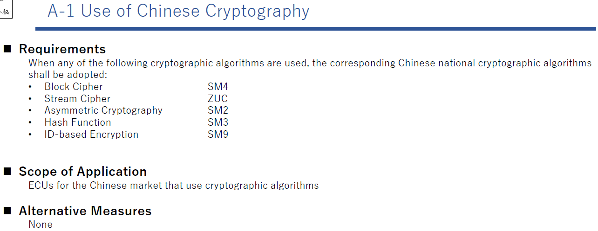
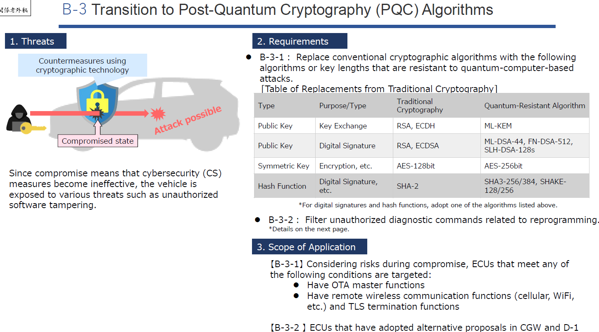
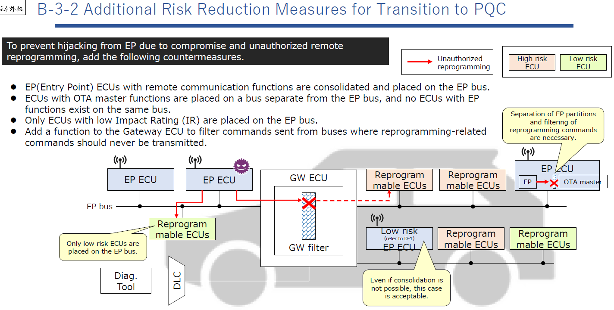
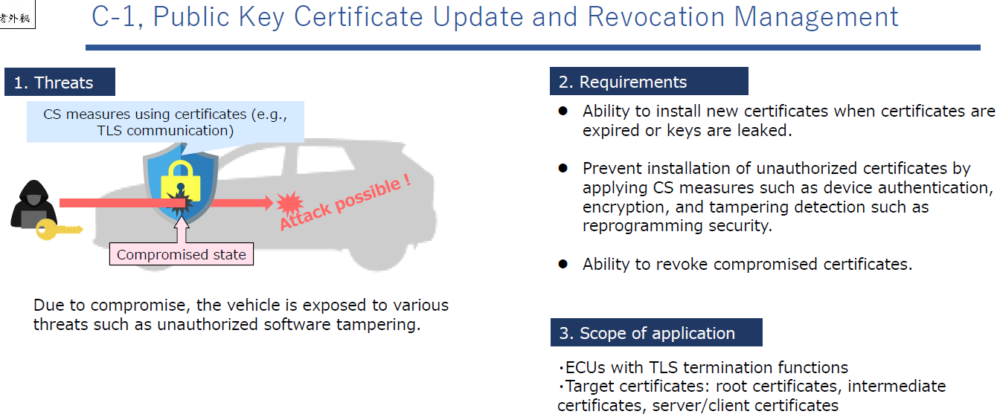
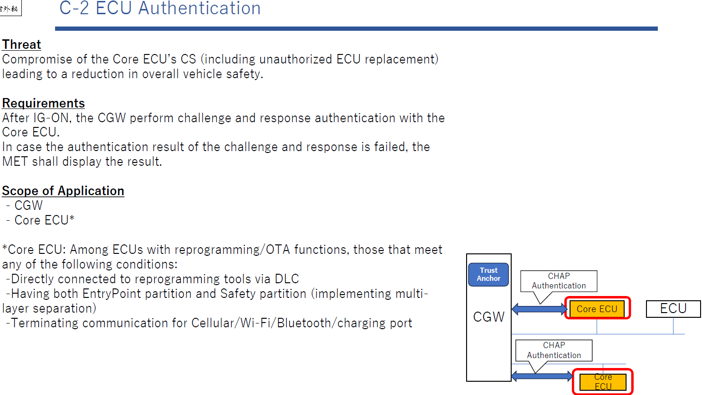
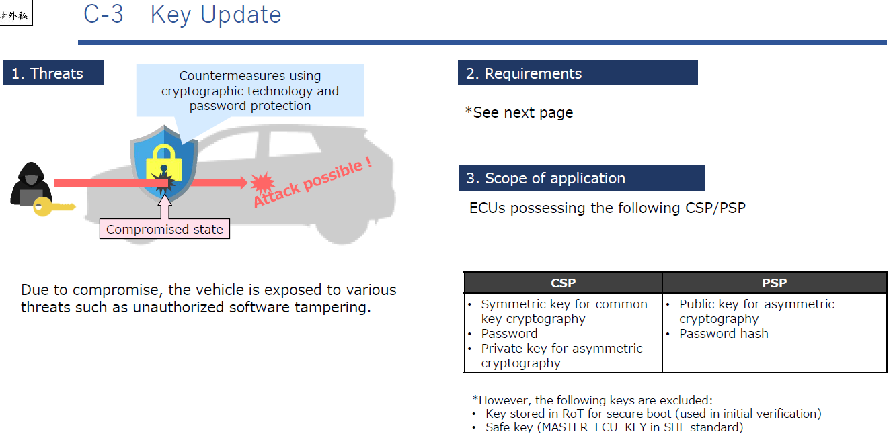
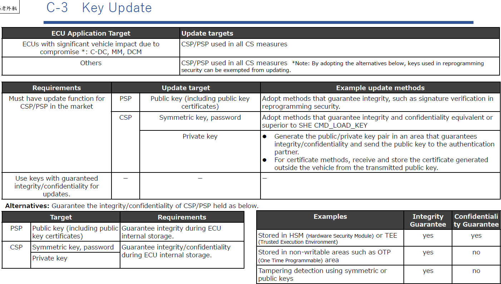
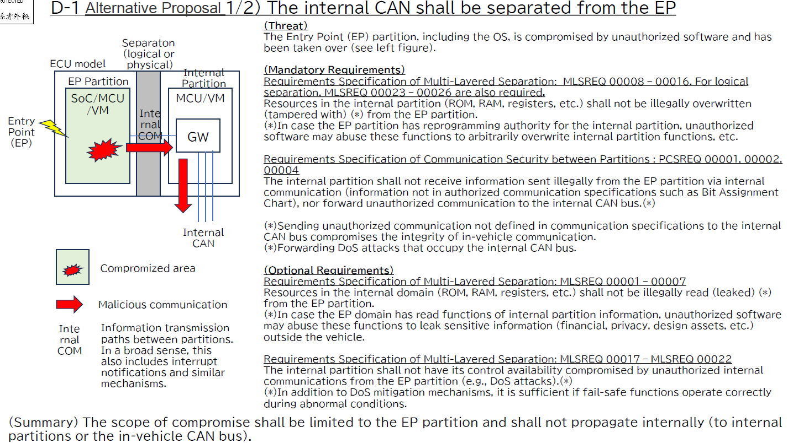
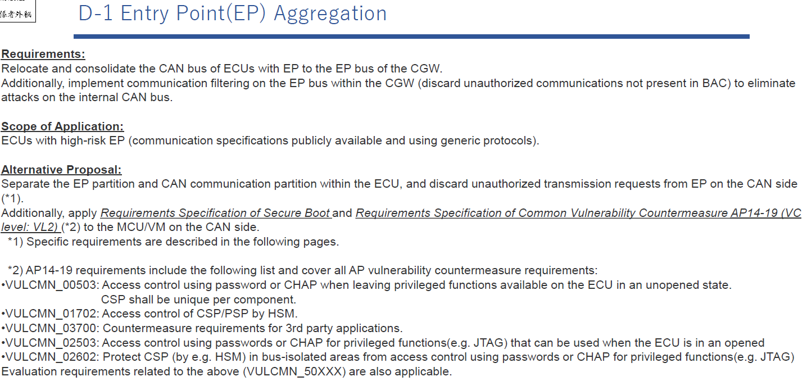
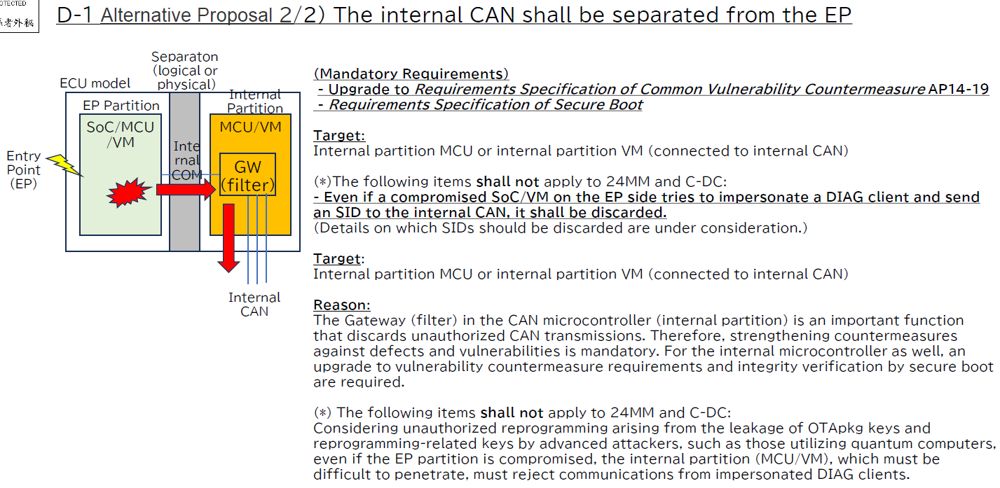

# Sheet A-1

> **A-1 Sử dụng Mật mã Trung Quốc**
>
> **Yêu cầu:**
> Khi sử dụng bất kỳ thuật toán mật mã nào sau đây, các thuật toán mật mã quốc gia Trung Quốc tương ứng phải được áp dụng:
>
> - **Mật mã khối:** SM4
> - **Mật mã dòng:** ZUC
> - **Mật mã bất đối xứng:** SM2
> - **Hàm băm:** SM3
> - **Mã hóa dựa trên ID:** SM9
>
> **Phạm vi áp dụng:**
> Các ECU cho thị trường Trung Quốc sử dụng thuật toán mật mã.
>
> **Biện pháp thay thế:**
> Không có.

---

# Sheet B-3

> **B-3 Chuyển đổi sang các thuật toán Mật mã Hậu Lượng tử (PQC)**
>
> **1. Mối đe dọa:**
> Vì việc bị xâm phạm nghĩa là các biện pháp an ninh mạng (CS) trở nên vô hiệu, xe sẽ bị phơi nhiễm trước các mối đe dọa khác nhau như giả mạo phần mềm trái phép.
>
> **2. Yêu cầu:**
> **B-3-1:** Thay thế các thuật toán mật mã truyền thống bằng các thuật toán hoặc độ dài khóa sau đây có khả năng chống lại các cuộc tấn công dựa trên máy tính lượng tử.
>
> **Bảng thay thế từ Mật mã truyền thống:**

| Loại | Mục đích/Loại | Mật mã truyền thống | Thuật toán kháng lượng tử |
| Mật mã khóa công khai | Trao đổi khóa | RSA, ECDH | ML-KEM |
| | Chữ ký điện tử | RSA, ECDSA | ML-DSA-44, FN-DSA-512, SLH-DSA-128s |
| Mật mã khóa đối xứng | Mã hóa, v.v. | AES-128bit | AES-256bit |
| Hàm băm | Chữ ký điện tử, v.v. | SHA-2 | SHA3-256/384, SHAKE-128/256 |

> \*Đối với chữ ký điện tử và hàm băm, áp dụng một trong các thuật toán liệt kê ở trên.
>
> **B-3-2:** Lọc các lệnh chẩn đoán trái phép liên quan đến lập trình lại. (Chi tiết ở trang sau)
>
> **3. Phạm vi áp dụng:**
> **[B-3-1]** Xem xét rủi ro khi bị xâm phạm, các ECU đáp ứng bất kỳ điều kiện nào sau đây là đối tượng:
>
> - Có chức năng OTA master.
> - Có chức năng giao tiếp không dây từ xa (di động, WiFi, v.v.) và chức năng đầu cuối TLS.
>     **[B-3-2]** Các ECU đã áp dụng các đề xuất thay thế trong CGW và D-1.

> **B-3-2 Các biện pháp giảm thiểu rủi ro bổ sung cho việc chuyển đổi sang PQC**
> Để ngăn chặn việc chiếm quyền kiểm soát từ EP do bị xâm phạm và lập trình lại từ xa trái phép, thêm các biện pháp đối phó sau:
>
> - Tập hợp các ECU EP (Entry Point) có chức năng giao tiếp từ xa và đặt trên bus EP.
> - Các ECU có chức năng OTA master được đặt trên một bus tách biệt với bus EP, và không có ECU nào có chức năng EP tồn tại trên cùng bus đó.
> - Phân tách các phân vùng EP: Chỉ các ECU có Đánh giá Tác động (Impact Rating - IR) thấp được đặt trên bus EP.
> - Thêm chức năng cho Gateway ECU để lọc các lệnh lập trình lại được gửi từ các bus nơi các lệnh liên quan đến lập trình lại không bao giờ được phép truyền.
> - Ngay cả khi không thể tập hợp, trường hợp này cũng có thể chấp nhận được nếu có GW filter.

---

# Sheet C-1

Lưu trữ chứng chỉ trong TEE và cho phép cập nhật chứng chỉ qua OTA

> **C-1 Cập nhật Chứng chỉ Công khai và Quản lý Thu hồi**
>
> **1. Mối đe dọa:**
> Do bị xâm phạm, xe bị phơi nhiễm trước các mối đe dọa khác nhau như giả mạo phần mềm trái phép.
>
> **2. Yêu cầu:**
>
> - Các biện pháp CS sử dụng chứng chỉ (ví dụ: giao tiếp TLS): Khả năng cài đặt chứng chỉ mới khi chứng chỉ hết hạn hoặc khóa bị lộ.
> - Ngăn chặn việc cài đặt các chứng chỉ trái phép bằng cách áp dụng các biện pháp CS như xác thực thiết bị, mã hóa và phát hiện giả mạo như bảo mật lập trình lại.
> - Trạng thái bị xâm phạm: Khả năng thu hồi các chứng chỉ bị xâm phạm.
>
> **3. Phạm vi áp dụng:**
>
> - Các ECU có chức năng đầu cuối TLS.
> - Chứng chỉ mục tiêu: chứng chỉ gốc, chứng chỉ trung gian, chứng chỉ máy chủ/máy khách.

---

# Sheet C-2

> **C-2 Xác thực ECU**
>
> **1. Mối đe dọa:**
> Xâm phạm CS của ECU Cốt lõi (bao gồm thay thế ECU trái phép) dẫn đến giảm an toàn tổng thể của xe.
>
> **2. Yêu cầu:**
>
> - Sau khi IG-ON, CGW thực hiện xác thực thách thức và phản hồi (challenge and response) với ECU Cốt lõi.
> - Trong trường hợp kết quả xác thực thất bại, MET sẽ hiển thị kết quả.
>
> **3. Phạm vi áp dụng:**
>
> - CGW
> - ECU Cốt lõi: Trong số các ECU có chức năng lập trình lại/OTA, những ECU đáp ứng bất kỳ điều kiện nào sau đây:
>     - Kết nối trực tiếp với công cụ lập trình lại qua DLC.
>     - Có cả phân vùng Entry Point và phân vùng Safety (thực hiện phân tách đa lớp).
>     - Kết thúc giao tiếp Cellular/WiFi/Bluetooth/cổng sạc.

---

# Sheet C-3

> **C-3 Cập nhật Khóa**
>
> **1. Mối đe dọa:**
> Do bị xâm phạm, xe bị phơi nhiễm trước các mối đe dọa khác nhau như giả mạo phần mềm trái phép.
>
> **2. Yêu cầu:**
>
> - Các biện pháp đối phó sử dụng công nghệ mật mã và bảo vệ mật khẩu (Xem trang sau).
>
> **3. Phạm vi áp dụng:**
>
> - Các ECU sở hữu các CSP/PSP sau:
>     - Khóa đối xứng cho mật mã chung (CSP)
>     - Khóa công khai cho mật mã bất đối xứng (PSP)
>     - Mật khẩu (CSP)
>     - Băm mật khẩu (CSP)
>     - Khóa riêng cho mật mã bất đối xứng (CSP)
>       \*Tuy nhiên, các khóa sau bị loại trừ:
> - Khóa được lưu trữ trong RoT để khởi động an toàn (được sử dụng trong xác minh ban đầu).
> - Khóa an toàn (MASTER_ECU_KEY trong tiêu chuẩn SHE).

> **C-3 Cập nhật Khóa (Tiếp theo)**
>
> **Mục tiêu cập nhật:** Các ECU có ảnh hưởng lớn đến xe do bị xâm phạm.
>
> - C-DC, MM, DCM
> - Khác: CSP/PSP được sử dụng trong tất cả các biện pháp CS (Ví dụ: dùng trong bảo mật lập trình lại).
>     \*Lưu ý: Bằng cách áp dụng các lựa chọn thay thế bên dưới, có thể được miễn cập nhật.
>
> **Yêu cầu:**
>
> - Phải có chức năng cập nhật cho CSP/PSP trên thị trường.
> - PSP (Khóa công khai/chứng chỉ): Áp dụng các phương pháp đảm bảo tính toàn vẹn như xác minh chữ ký trong bảo mật lập trình lại.
> - CSP (Khóa đối xứng, mật khẩu): Áp dụng các phương pháp đảm bảo tính toàn vẹn và bảo mật tương đương hoặc vượt trội so với SHE CMD_LOAD_KEY.
> - Khóa riêng: Tạo cặp khóa công khai/riêng tư trong một khu vực đảm bảo tính toàn vẹn/bảo mật và gửi khóa công khai cho đối tác xác thực. Đối với phương pháp chứng chỉ, nhận và lưu trữ chứng chỉ được tạo bên ngoài xe từ khóa công khai đã gửi. Sử dụng các khóa có tính toàn vẹn/bảo mật được đảm bảo để cập nhật.
>
> **Các lựa chọn thay thế (Đảm bảo tính toàn vẹn/bảo mật của CSP/PSP nắm giữ như bên dưới):**
>
> - **PSP (Khóa công khai, chứng chỉ):** Đảm bảo tính toàn vẹn trong quá trình lưu trữ nội bộ ECU. (Lưu trong HSM hoặc TEE).
> - **CSP (Khóa đối xứng, Mật khẩu):** Đảm bảo tính toàn vẹn/bảo mật trong quá trình lưu trữ nội bộ ECU. (Lưu trong các khu vực không thể ghi như OTP).
> - **Khóa riêng:** Phát hiện giả mạo sử dụng khóa đối xứng hoặc khóa công khai.

---

# Sheet D-1

> **D-1 Đề xuất thay thế 1/2**
> **Bus CAN nội bộ phải được tách biệt khỏi EP.**
>
> **Mô hình ECU:** Phân tách (logic hoặc vật lý).
> **Giả định:** Phân vùng Entry Point (EP), bao gồm cả OS, bị xâm phạm bởi phần mềm trái phép và bị chiếm quyền.
>
> **[Mandatory requirements]**
>
> - **Phân vùng nội bộ (Internal Partition):**
>     - Đặc tả yêu cầu phân tách đa lớp: MLSREQ_00008, 00016. Tách biệt logic MLSREQ_00023-00026 cũng được yêu cầu.
>     - Tài nguyên trong phân vùng nội bộ (ROM, RAM, thanh ghi, v.v.) không được phép bị ghi đè trái phép (giả mạo) bởi phân vùng EP. (\*)
>     - (\*) Trong trường hợp phân vùng EP có quyền lập trình lại đối với phân vùng nội bộ, phần mềm trái phép có thể lạm dụng các chức năng này để ghi đè tùy ý các chức năng phân vùng nội bộ, v.v.
>     - Phân vùng nội bộ không được nhận thông tin được gửi trái phép từ phân vùng EP thông qua giao tiếp nội bộ (thông tin không có trong đặc tả giao tiếp được ủy quyền như BAC), cũng như không chuyển tiếp giao tiếp trái phép đến bus CAN nội bộ (\*).
>     - (\*) Chuyển tiếp các cuộc tấn công DoS chiếm dụng bus CAN nội bộ.
>
> **[Optional requirements]**
>
> - Tài nguyên trong miền nội bộ không được phép bị đọc trái phép (rò rỉ) bởi phân vùng EP.
> - Phân vùng nội bộ không được để tính sẵn sàng điều khiển bị xâm phạm bởi các giao tiếp nội bộ trái phép từ phân vùng EP (ví dụ: tấn công DoS).

> **D-1 Tập hợp Entry Point (EP)**
>
> **Yêu cầu:**
>
> - Di dời và tập hợp bus CAN của các ECU có EP sang bus EP của CGW.
> - Ngoài ra, thực hiện lọc giao tiếp trên bus EP trong CGW (loại bỏ các giao tiếp trái phép không có trong BAC) để loại bỏ các cuộc tấn công vào bus CAN nội bộ.
>
> **Phạm vi áp dụng:**
>
> - Các ECU có EP rủi ro cao (đặc tả giao tiếp được công khai và sử dụng các giao thức chung).
>
> **Đề xuất thay thế:**
>
> - Tách biệt phân vùng EP và phân vùng giao tiếp CAN trong ECU, và loại bỏ các yêu cầu truyền trái phép từ EP ở phía CAN (\*1).
> - Ngoài ra áp dụng Đặc tả yêu cầu Khởi động an toàn và Đặc tả yêu cầu Đối phó lỗ hổng chung AP14-19 (Cấp độ VL2) (*2) cho MCU/VM ở phía CAN.
>     *1) Các yêu cầu cụ thể được mô tả trong các trang sau (hình D-1_3 và D-1_5).
>     \*2) Các yêu cầu AP14-19 bao gồm danh sách sau và bao gồm tất cả các yêu cầu đối phó lỗ hổng AP:
> - VULCMN_00503: Kiểm soát truy cập sử dụng mật khẩu hoặc CHAP khi để các chức năng đặc quyền khả dụng trên ECU ở trạng thái chưa mở. CSP phải là duy nhất cho mỗi thành phần.
> - VULCMN_01702: Kiểm soát truy cập CSP/PSP bằng HSM.
> - VULCMN_03700: Yêu cầu đối phó cho ứng dụng bên thứ 3.
> - VULCMN_02503: Kiểm soát truy cập sử dụng mật khẩu hoặc CHAP cho các chức năng đặc quyền (ví dụ JTAG) có thể sử dụng khi ECU ở trạng thái mở.
> - VULCMN_02602: Bảo vệ CSP (bằng HSM, v.v.) trong các khu vực cách ly bus khỏi kiểm soát truy cập sử dụng mật khẩu hoặc CHAP cho các chức năng đặc quyền (ví dụ JTAG).
>     Các yêu cầu đánh giá liên quan đến các mục trên (VULCMN_50XXX) cũng được áp dụng.

> **D-1 Đề xuất thay thế 2/2**
> **Bus CAN nội bộ phải được tách biệt khỏi EP.**
>
> **[Yêu cầu bắt buộc]**
>
> - Nâng cấp lên Đặc tả yêu cầu Đối phó lỗ hổng chung AP14-19.
> - Đặc tả yêu cầu Khởi động an toàn.
> - **Mục tiêu:** MCU phân vùng nội bộ hoặc VM phân vùng nội bộ (kết nối với CAN nội bộ).
> - Ngay cả khi SoC/VM bị xâm phạm ở phía EP cố gắng mạo danh một DIAG client và gửi một SID đến CAN nội bộ, nó phải bị loại bỏ.
> - (Chi tiết về SID nào nên bị loại bỏ đang được xem xét).
>
> **Lý do:**
>
> - Gateway (bộ lọc) trong vi điều khiển CAN (phân vùng nội bộ) là một chức năng quan trọng loại bỏ các truyền dẫn CAN trái phép. Do đó, việc tăng cường các biện pháp đối phó chống lại các khiếm khuyết và lỗ hổng là bắt buộc.
> - Đối với vi điều khiển nội bộ cũng vậy, yêu cầu nâng cấp lên các yêu cầu đối phó lỗ hổng và xác minh tính toàn vẹn bằng khởi động an toàn.
>
> **Các mục sau đây sẽ không áp dụng cho 24MM và C-DC:**
>
> - Xem xét việc lập trình lại trái phép phát sinh từ việc rò rỉ khóa gói OTA và khóa liên quan đến lập trình lại bởi những kẻ tấn công tiên tiến (ví dụ: sử dụng máy tính lượng tử), ngay cả khi phân vùng EP bị xâm phạm, phân vùng nội bộ (MCU/VM), nơi phải khó xâm nhập, phải từ chối các giao tiếp từ các DIAG client mạo danh.
