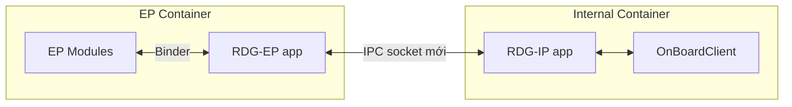
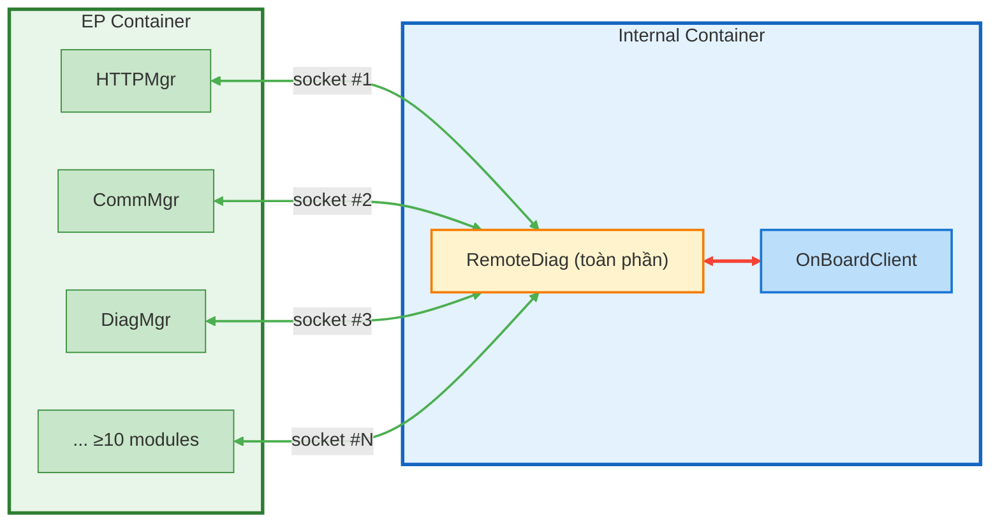
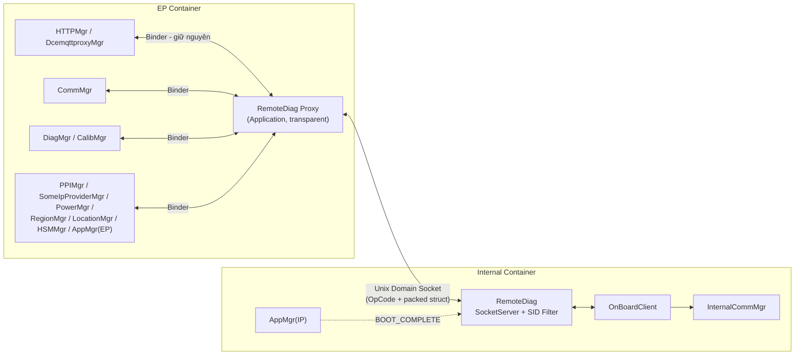
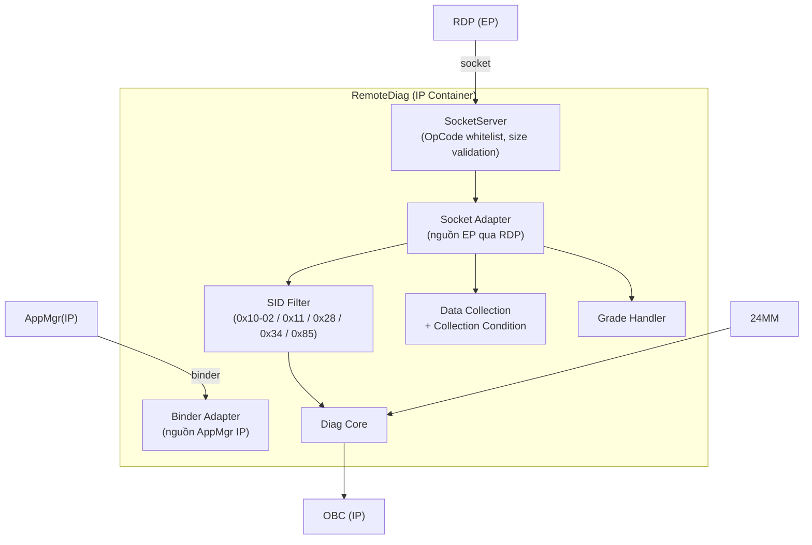
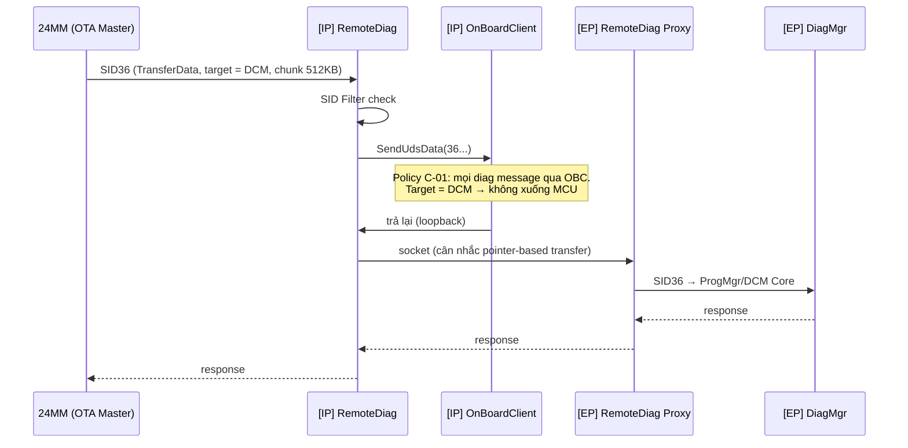
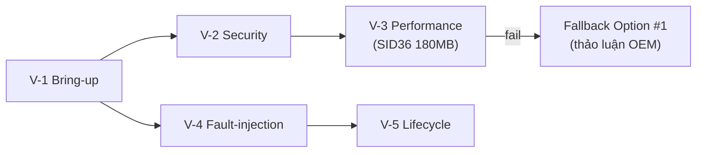
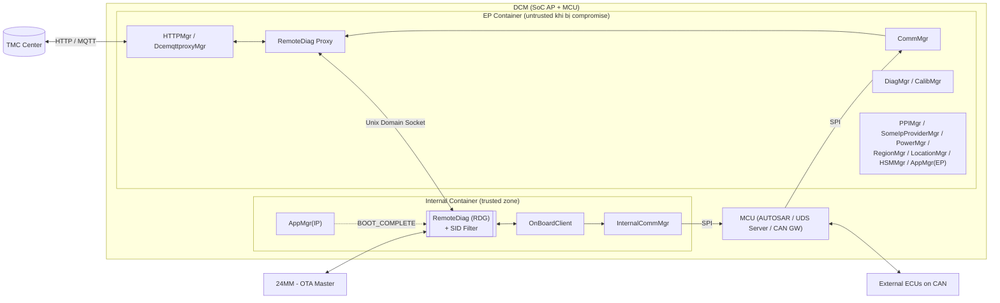
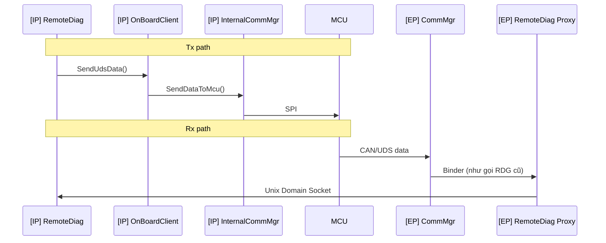
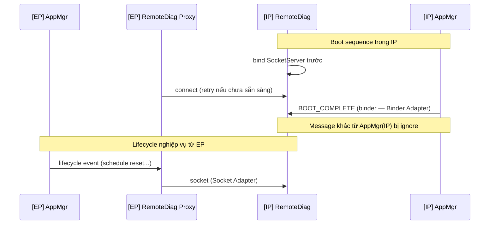
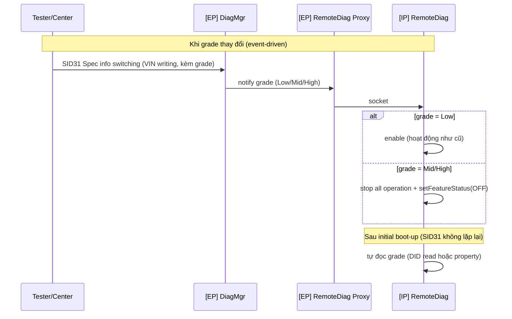

<!-- Slide 1 -->

# Functional Architecture Design for RemoteDiag (RDG) under EP Separation

**Module:** RemoteDiag (RDG) — Remote Diagnostics / Data Collection
**Dự án:** Toyota DCM 24LM (MPW ePF, 19PFv3KAI — 2DEX 4G/5G)
**Ngày:** 2026-08-04

---

<!-- Slide 2 -->

# Table of Contents

1. Overview
2. Problem Identification
3. Solution Proposals
4. Design Proposals for Selected Solution
5. Implementation and Verification
6. Conclusion
7. Q&A

---

<!-- Slide 3 -->

# 1. Overview — DCM và module RDG trong dự án Toyota 24LM

DCM (Data Communication Module) là telematics ECU của Toyota, đồng thời giữ **hai vai trò xung đột về an ninh**:

- **Entry Point (EP)**: giao tiếp không dây với TMC Center (HTTP/MQTT), SOME/IP, OTA — bề mặt tấn công lớn nhất của xe.
- **Diagnostic client nội bộ**: gửi UDS request xuống MCU và in-vehicle CAN bus.

**Giải pháp mức hệ thống đã chốt:** tách phần mềm DCM thành hai partition chạy trong Linux Container (LXC) — **EP Container** và **Internal Partition (IP) Container**.

Đặc điểm của module **RemoteDiag (RDG)**:

- **CAN-facing**: là module ra lệnh diag xuống CAN → thuộc security domain nội bộ.
- **High Fan-in từ EP**: phụ thuộc chức năng vào **≥10 module nằm ở EP** (HTTPMgr, CommMgr, DiagMgr, PPIMgr, SomeIpProviderMgr, PowerMgr, RegionMgr, LocationMgr, HSMMgr, AppMgr...).
- **Safety/Security-critical**: chịu yêu cầu filter SID reprogramming theo Cybersecurity spec của TMC.

→ RDG là module **chịu tác động lớn nhất** của việc tách partition.

_Chi tiết tại Appendix 1 (System Context Diagram)_

---

<!-- Slide 4 -->

# 2. Problem Identification — Starting Point

**Bối cảnh:** Yêu cầu Cybersecurity của TMC (19PFv3KAI, sheet D-1, 2-CYS-01-20):

- Khi EP Partition bị compromise, thiệt hại **không được lan sang Internal Partition và in-vehicle CAN bus**.
- Diagnostic command trái phép liên quan reprogramming phải bị **filter** (MFGREQ_00058–00061, Table 5-1).

**4 vấn đề phát sinh với RDG khi tách partition:**

1. **Xung đột trust boundary vs functional dependency**: RDG thuộc trusted zone nhưng phụ thuộc ≥10 module ở EP — cần giao tiếp xuyên trust boundary mà không phá vỡ isolation, không bùng nổ chi phí IPC.
2. **Đường dữ liệu lớn SID36**: package DCM update tối đa ~180MB phải giữ hiệu năng — không được đi vòng qua SPI/MCU (bài học test DoCAN 2024/01).
3. **Vị trí SID Filter**: kẻ tấn công chiếm EP không được phép vô hiệu hóa filter.
4. **Lifecycle nhất quán**: AppMgr tồn tại ở cả hai container; BOOT_COMPLETE và lifecycle event phải đến được RDG mà không gây duplicate/race.

_Chi tiết tại Appendix 2 (Functional Requirements) và Appendix 3 (Constraints)_

---

<!-- Slide 5 -->

# 2. Problem Identification — Key Quality Attributes

| Quality Attribute | Priority | Mô tả                                                                                                    |
| ----------------- | -------- | -------------------------------------------------------------------------------------------------------- |
| Security          | **High** | Compromise giới hạn trong EP; EP mạo danh DIAG client → discard; filter SID reprogramming (NFR-01/02/03) |
| Performance       | High     | Không truyền gói ~180MB qua SPI hai lần; cân nhắc pointer-based transfer (NFR-04)                        |
| Reliability       | Medium   | Fail-safe: POLLHUP detect, reconnect, reset nếu abnormal restart ≥4 lần/480s (NFR-05)                    |
| Availability      | Medium   | Resource Quotas: EP Container không được làm đói IP Container (NFR-06)                                   |
| Maintainability   | Medium   | Không phải định nghĩa/hiện thực IPC mới cho từng module EP (NFR-07)                                      |
| Schedule          | High     | Bring-up 7/17 → 7/24 (implement), 7/31 (verification) — rất gấp (NFR-08, C-06)                           |

**Ràng buộc chính:** mọi diag message phải đi qua OBC (C-01); không dùng SPI cho SID36 của DCM (C-02); tái dùng nền tảng proxy chuẩn ManagerProxy ↔ Unix Domain Socket ↔ ManagerSocketServer (C-04).

---

<!-- Slide 6 -->

# 3. Solution Proposals — Alt A: Tách RDG thành nhiều app ở hai bên

Chia RDG thành nhiều app theo Server/MM SID path — phần cần CAN access ở IP, phần giao tiếp Center/EP ở EP (design 5/19, Nagoya meeting).

✅ **Advantages:**

- Performance: ít hop hơn cho luồng EP-side.

❌ **Disadvantages:**

- Security: logic diag vẫn một phần ở EP — filter/state có thể bị thao túng khi EP compromise.
- Maintainability: chẻ đôi codebase RDG, đồng bộ state (collection condition, session, consent) phức tạp.
- Schedule: thay đổi thiết kế lớn nhất.

---

<!-- Slide 7 -->

# 3. Solution Proposals — Alt B: RDG ở IP + IPC socket per-module

Chuyển nguyên khối RDG vào IP Container; **mỗi module EP (≥10)** tự định nghĩa và hiện thực interface IPC socket mới xuyên container.

✅ **Advantages:**

- Security: RDG trọn trong trusted zone.
- Performance: đường trực tiếp module → RDG.

❌ **Disadvantages:**

- Maintainability: ≥10 module EP phải sửa code, tự hiện thực socket client — effort nhân bản × N.
- Reliability: N kênh socket = N điểm phải fail-safe riêng.

---

<!-- Slide 8 -->

# 3. Solution Proposals — Alt C: RDG ở IP + RemoteDiag Proxy transparent

Chuyển nguyên khối RDG vào IP Container; bổ sung **RemoteDiag Proxy (RDP)** ở EP hoạt động như **transparent proxy** — mọi module EP coi RDP như chính RDG thật. Một kênh Unix Domain Socket duy nhất hội tụ tại biên container ("a new ideal concept from LGE side" — 6/25).

✅ **Advantages:**

- Security: RDG + SID Filter trọn trong trusted zone; ingress control (OpCode whitelist) tại IP.
- Maintainability: EP modules **zero change** — giữ nguyên Binder contract cũ.
- Schedule: tái dùng khung ManagerProxy/ManagerSocketServer sẵn có.

❌ **Disadvantages:**

- Reliability: RDP là single point of failure (cần fail-safe POLLHUP/heartbeat).
- Performance: thêm một hop socket mỗi giao dịch (chấp nhận được).

---

<!-- Slide 9 -->

# 3. Solution Proposals — Alt D: Generic Container Gateway/Message Broker _(đề xuất bổ sung)_

Gateway service dùng chung tại biên hai container: mọi module đăng ký topic/endpoint qua broker; broker chịu trách nhiệm routing, validation, encryption tập trung.

✅ **Advantages:**

- Security: tương đương Alt C, thêm điểm kiểm soát tập trung.
- Reusability: tổng quát hóa cho các module khác sẽ tách sang IP sau này.

❌ **Disadvantages:**

- Performance: thêm 2 hop (client → broker → client).
- Reliability: broker là single point of failure toàn hệ thống.
- Schedule: vượt scope; phải xây platform mới từ đầu.

---

<!-- Slide 10 -->

# 3. Solution Proposals — Comparison & Selection

| Criteria        | Priority | Alt A (tách RDG)        | Alt B (IPC per-module) | **Alt C (RDG + RDP)**       | Alt D (Gateway)\* |
| --------------- | -------- | ----------------------- | ---------------------- | --------------------------- | ----------------- |
| Security        | High     | ✗ Logic diag ở EP       | ✓                      | ✓ Filter trọn trusted zone  | ✓                 |
| Maintainability | Medium   | ✗ Chẻ đôi codebase      | ✗ ≥10 module sửa code  | ✓ **Zero change** ở EP      | ~ Platform mới    |
| Performance     | High     | ~ Đồng bộ state tốn kém | ✓ Trực tiếp            | ~ +1 hop socket             | ✗ +2 hop          |
| Reliability     | Medium   | ✗ Nhiều failure mode    | ✗ N điểm fail-safe     | ~ RDP SPOF (có pattern sẵn) | ✗ Broker SPOF     |
| Schedule        | High     | ✗ Thay đổi lớn nhất     | ✗ Effort × N           | ✓ Tái dùng khung sẵn có     | ✗ Vượt scope      |

**Key Decision Factors:**

- **Security vs Dependency**: chỉ Alt C và B đưa trọn SID Filter về trusted zone; Alt C thắng nhờ zero change ở EP ("op#1 requires more effort than op#2").
- **Schedule**: Alt C tái dùng ManagerProxy/ManagerSocketServer — duy nhất khả thi với mốc 7/17–7/31.
- **Trade-off chấp nhận**: RDP SPOF được mitigate bằng fail-safe pattern chuẩn (ServiceMonitor POLLHUP).

🏆 **Selected: Alt C — RDG toàn phần ở Internal Container + RemoteDiag Proxy transparent ở EP** (AD-RDG-01)

_\* Alt D chưa qua thảo luận HQ–LGEDV; giữ làm hướng dài hạn._

---

<!-- Slide 11 -->

# 4. Design Proposals — Static View (Alt C)

**Legend:** ô mới = new components (RDP, SocketServer/SID Filter trong RDG); còn lại = existing components; nét đứt = lifecycle event.

**Key decisions:**

- **AD-RDG-02**: SID Filter đặt **bên trong RDG** (trusted zone) — EP compromise không vô hiệu hóa được.
- **AD-RDG-03**: RDP là **Application** (không phải Service) để transparent với AppMgr(EP).
- **AD-RDG-04**: **RDG là SocketServer, RDP là Client** — phía trusted kiểm soát accept + OpCode whitelist; hệ quả boot ordering: RDG bind trước → RDP connect (retry).

---

<!-- Slide 12 -->

# 4. Design Proposals — Cấu trúc chức năng nội bộ RDG

- Hai **Adapter** phân biệt nguồn message: EP qua socket vs IP qua binder (AD-RDG-06) — BOOT_COMPLETE từ AppMgr(IP), lifecycle nghiệp vụ từ AppMgr(EP) qua RDP; message khác từ AppMgr(IP) bị ignore.
- Mọi SID đi qua **SID Filter** trước khi tới Diag Core.

---

<!-- Slide 13 -->

# 4. Design Proposals — Dynamic View: SID36 DCM update (AD-RDG-05)

**Option #2 được chọn:** MM → RDG → OBC → RDG → RDP → DiagMgr

**Rationale:** giữ policy OBC (C-01, không thỏa thuận lại OEM); tránh SPI double-transfer cho 180MB (C-02); tái dùng kênh RDG↔RDP. Option bị loại: #1 (bỏ qua OBC — giữ làm fallback), #3/#4 (IPC/Proxy mới), #5 (qua MCU — heavy SPI).

_Sequence UDS Tx/Rx tổng quát, Lifecycle và Grade switching tại Appendix 4–6_

---

<!-- Slide 14 -->

# 5. Implementation and Verification

Kiểm chứng kiến trúc theo 5 nhóm test (mốc TMCDCMLM-157: implement 7/24, verification 7/31):

| #   | Nhóm test         | Nội dung                                                                                 | Requirement         |
| --- | ----------------- | ---------------------------------------------------------------------------------------- | ------------------- |
| V-1 | Bring-up          | Luồng UDS end-to-end qua RDP↔RDG (happy case); socket log đã có ở khung 7/17             | FR-01, NFR-08       |
| V-2 | Security test     | MFGTST_00035/00036, 00032–00034, 00002; giả lập EP compromise gửi SID cấm → RDG discard  | NFR-01/02/03, FR-05 |
| V-3 | Performance SID36 | Đo throughput chunk 512KB trên Option #2 vs time-budget 180MB; fail → fallback Option #1 | FR-02, NFR-04       |
| V-4 | Fault-injection   | Kill RDP/RDG: POLLHUP detect, reconnect, HealthMgr reset ≥4 lần/480s; EP chiếm 100% CPU  | NFR-05, NFR-06      |
| V-5 | Lifecycle test    | Hoán đổi thứ tự boot hai container: BOOT_COMPLETE, loại trừ duplicate qua Adapter        | FR-06               |

---

<!-- Slide 15 -->

# 6. Conclusion

| Quality Attribute | Priority | Kết quả với Alt C                                                                            | Result    |
| ----------------- | -------- | -------------------------------------------------------------------------------------------- | --------- |
| Security          | High     | RDG + SID Filter trọn trusted zone; ingress control tại IP; EP compromise không lan sang CAN | ✅        |
| Maintainability   | Medium   | EP modules zero change; một điểm hội tụ IPC                                                  | ✅        |
| Performance       | High     | Đường 180MB ở lại trong AP; +1 hop socket chấp nhận được; pointer-based transfer còn open    | ⚠️ (R-01) |
| Reliability       | Medium   | RDP SPOF — mitigate bằng fail-safe pattern chuẩn, xử lý sau bring-up                         | ⚠️ (R-02) |
| Schedule          | High     | Tái dùng khung ManagerProxy sẵn có, đáp ứng mốc 7/17–7/31                                    | ✅        |

**Nguyên tắc thiết kế xuyên suốt:** (1) Trust-boundary-first; (2) Transparency để giảm chi phí thay đổi; (3) Tôn trọng ràng buộc đã kiểm chứng (policy OBC, bài học SPI); (4) Chuẩn hóa hạ tầng IPC.

**Kế hoạch tiếp theo:**

- Chốt pointer-based transfer cho SID36; fail-safe/lifecycle của RDP.
- Encryption/authentication kênh socket EP↔IP (R-03); spec "stop all operation" cho grade (R-04).
- Cập nhật RS/CuRS theo functional spec RDG 7/E.
- Đánh giá Alt D (Generic Gateway) như hướng dài hạn cho các module tách sau này.

---

<!-- Slide 16 -->

# Q&A

**Thank you for listening**

---

<!-- Slide 17 -->

# Appendix 1 — System Context Diagram

---

<!-- Slide 18 -->

# Appendix 2 — Functional Requirements

| ID    | Yêu cầu                                                                                              | Nguồn                  |
| ----- | ---------------------------------------------------------------------------------------------------- | ---------------------- |
| FR-01 | RDG tiếp tục cung cấp đầy đủ chức năng Remote Diagnostics / Data Collection sau khi vào IP Container | RDG_discussions        |
| FR-02 | SID36 (TransferData) cho DCM update, package ~180MB, qua MM → RDG → OBC → DiagMgr                    | Confluence 2016280312  |
| FR-03 | SID36 cho ECU khác tiếp tục qua MCU (OBC → InternalCommMgr → MCU → external ECU)                     | Confluence 2016280312  |
| FR-04 | Grade switching (Low: hoạt động; Mid/High: dừng), trigger bởi SID31; RDG tự đọc grade sau boot       | MPWSPEC-44             |
| FR-05 | SID Filter chặn: 0x10 (programming session 0x02), 0x11, 0x28, 0x34, 0x85                             | MFGREQ_00006 Table 5-1 |
| FR-06 | BOOT_COMPLETE và lifecycle event phải đến được RDG trong IP                                          | RDG_discussions        |

---

<!-- Slide 19 -->

# Appendix 3 — Constraints

| ID   | Ràng buộc                                                                                                                                |
| ---- | ---------------------------------------------------------------------------------------------------------------------------------------- |
| C-01 | Policy nghiệp vụ: **mọi diag message phải đi qua OBC**; vi phạm cần thảo luận với OEM                                                    |
| C-02 | Không dùng đường MCU/SPI cho SID36 của DCM (bài học test DoCAN 2024/01)                                                                  |
| C-03 | Giao tiếp giữa container yêu cầu IPC socket mới (Unix Domain Socket)                                                                     |
| C-04 | Nền tảng proxy chuẩn: ManagerProxy ↔ Unix Domain Socket ↔ ManagerSocketServer; OpCode whitelist + payload size validation; packed struct |
| C-05 | SocketServer đặt phía service thật (basic policy)                                                                                        |
| C-06 | Schedule rất gấp; bring-up trước, fail-safety xử lý sau                                                                                  |
| C-07 | Grade notification (SID31) không lặp lại mỗi DCM reboot/IG cycle                                                                         |

---

<!-- Slide 20 -->

# Appendix 4 — Sequence: UDS Tx/Rx tổng quát

---

<!-- Slide 21 -->

# Appendix 5 — Sequence: Lifecycle / BOOT_COMPLETE (AD-RDG-06)

---

<!-- Slide 22 -->

# Appendix 6 — Sequence: Grade switching DCM5.2 (AD-RDG-07)

---

<!-- Slide 23 -->

# Appendix 7 — Architectural Decisions Summary

| AD        | Decision                                         | Rationale chính                                                           |
| --------- | ------------------------------------------------ | ------------------------------------------------------------------------- |
| AD-RDG-01 | Alt C: RDG toàn phần ở IP + RDP transparent ở EP | EP zero change; security logic dồn về trusted zone; tái dùng ManagerProxy |
| AD-RDG-02 | SID Filter bên trong RDG                         | Filter nằm phía trusted, EP compromise không vô hiệu hóa được             |
| AD-RDG-03 | RDP là Application (không phải Service)          | Transparent với EP modules kể cả AppMgr(EP)                               |
| AD-RDG-04 | RDG = SocketServer, RDP = Client                 | Trusted side kiểm soát accept + OpCode whitelist; boot ordering rõ        |
| AD-RDG-05 | SID36 DCM update qua Option #2                   | Giữ policy OBC; tránh SPI double-transfer 180MB                           |
| AD-RDG-06 | Lifecycle hai đường, phân biệt bằng Adapter      | BOOT_COMPLETE cục bộ trong IP; lifecycle nghiệp vụ từ EP qua RDP          |
| AD-RDG-07 | Grade: DiagMgr notify + RDG self-read sau boot   | SID31 không lặp lại mỗi reboot/IG cycle (C-07)                            |

---

<!-- Slide 24 -->

# Appendix 8 — Open Issues / Rủi ro còn lại

| #    | Loại        | Mô tả                                                                      | Trạng thái                                        |
| ---- | ----------- | -------------------------------------------------------------------------- | ------------------------------------------------- |
| R-01 | Performance | Binder/socket copy cho chunk 512KB × ~360 lần (180MB) trên SID36 Option #2 | Open — pointer-based transfer; fallback Option #1 |
| R-02 | Reliability | RDP crash → mất toàn bộ luồng EP↔RDG                                       | Open — khuyến nghị ServiceMonitor POLLHUP         |
| R-03 | Security    | Kênh socket EP↔IP chưa có encryption/authentication                        | Open                                              |
| R-04 | Functional  | "stop all operation" (grade disable) chưa spec đầy đủ                      | Inquiry với TMC (MPWSPEC-44)                      |
| R-05 | Design      | Lifecycle/priority của RDP (Application) chưa chốt                         | HQ đang xem xét                                   |
