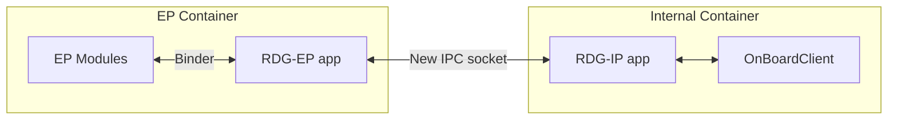
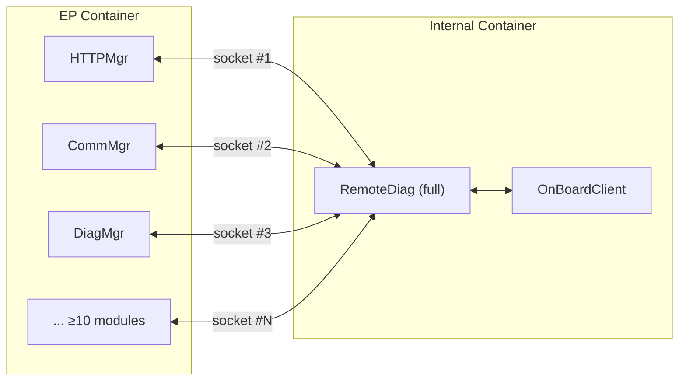
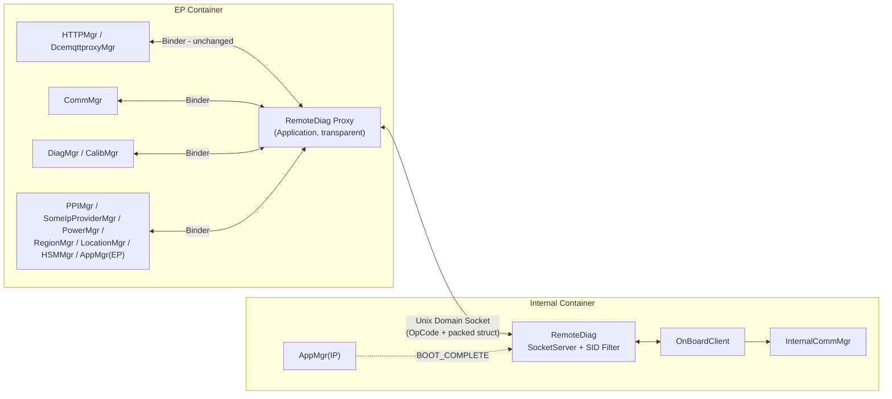
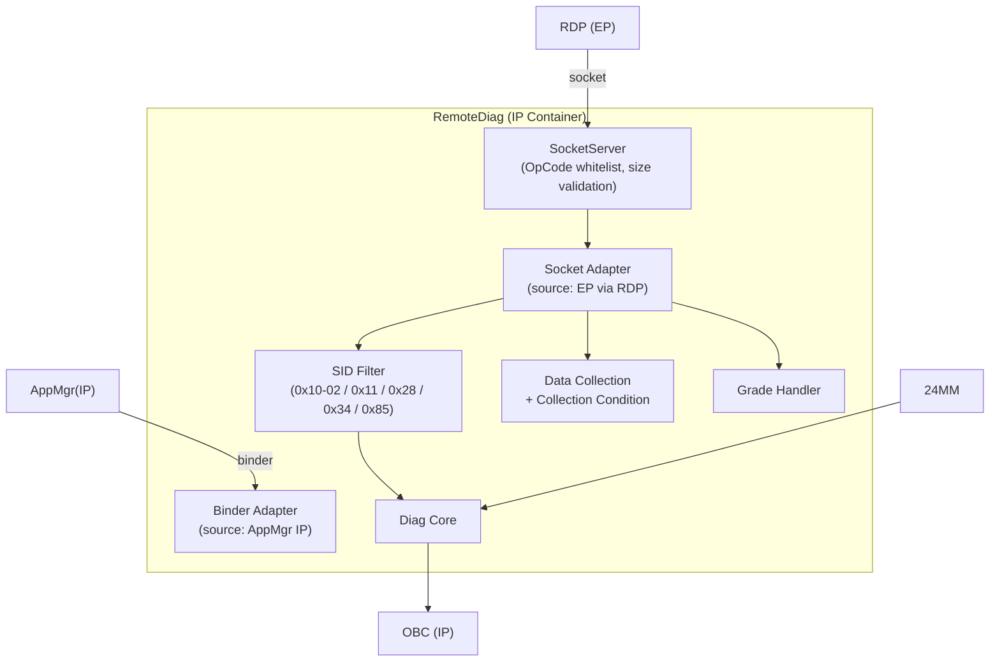
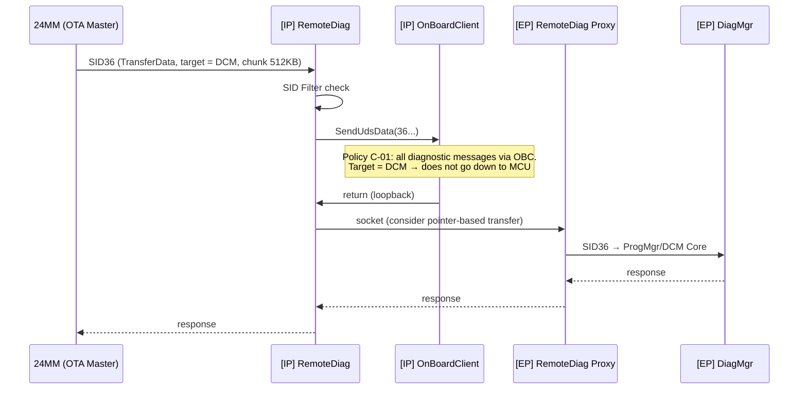
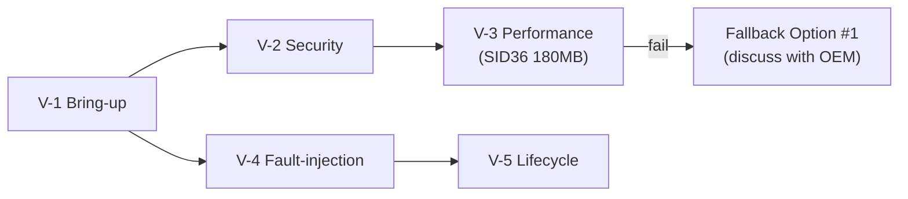
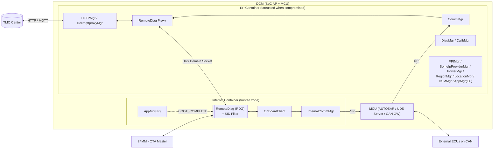
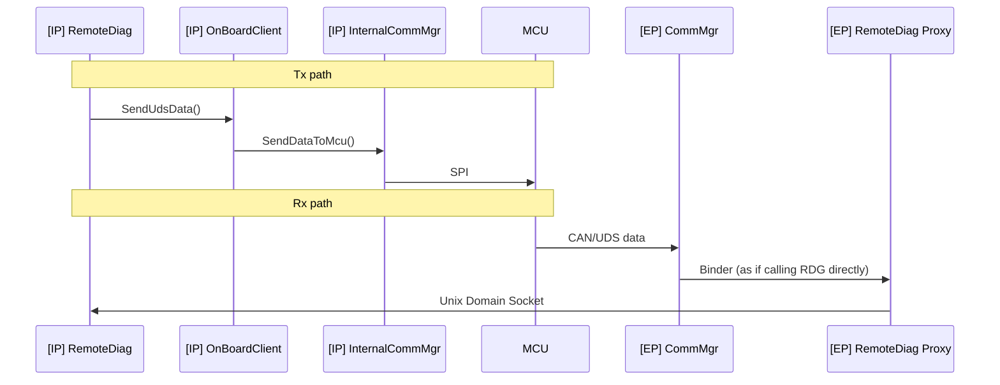
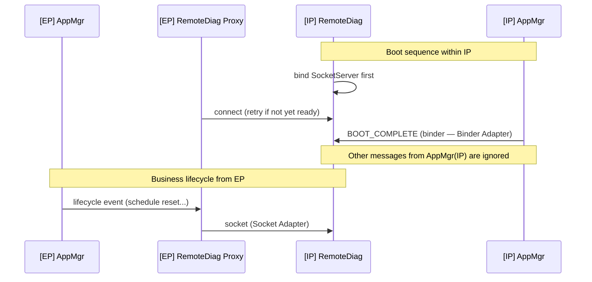
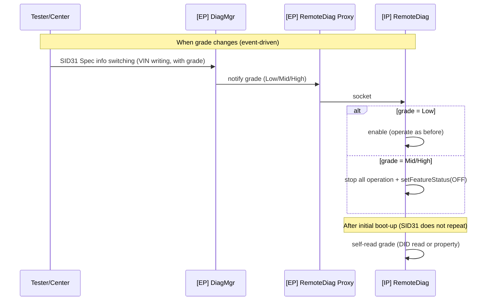

<!-- Slide 1 -->
# Functional Architecture Design for RemoteDiag (RDG) under EP Separation

**Module:** RemoteDiag (RDG) — Remote Diagnostics / Data Collection
**Project:** Toyota DCM 24LM (MPW ePF, 19PFv3KAI — 2DEX 4G/5G)
**Date:** 2026-08-04

---

<!-- Slide 2 -->
# Table of Contents

1. Overview
2. Problem Identification
3. Solution Proposals
4. Design Proposals for Selected Solution
5. Implementation and Verification
6. Conclusion
7. Q&A

---

<!-- Slide 3 -->
# 1. Overview — DCM and the RDG Module in Toyota 24LM

DCM (Data Communication Module) is Toyota's telematics ECU, simultaneously holding **two conflicting security roles**:

- **Entry Point (EP)**: wirelessly communicates with TMC Center (HTTP/MQTT), SOME/IP, OTA — the largest attack surface on the vehicle.
- **Internal diagnostic client**: sends UDS requests to MCU and in-vehicle CAN bus.

**Confirmed system-level solution:** split DCM software into two partitions running in Linux Containers (LXC) — **EP Container** and **Internal Partition (IP) Container**.

Characteristics of the **RemoteDiag (RDG)** module:

- **CAN-facing**: the module that issues diagnostic commands to the CAN bus → belongs to the internal security domain.
- **High Fan-in from EP**: functionally depends on **≥10 modules in the EP** (HTTPMgr, CommMgr, DiagMgr, PPIMgr, SomeIpProviderMgr, PowerMgr, RegionMgr, LocationMgr, HSMMgr, AppMgr...).
- **Safety/Security-critical**: subject to SID reprogramming filter requirements per TMC's Cybersecurity spec.

→ RDG is the module **most impacted** by the partition separation.

*Details at Appendix 1 (System Context Diagram)*

---

<!-- Slide 4 -->
# 2. Problem Identification — Starting Point

**Background:** TMC's Cybersecurity requirements (19PFv3KAI, sheet D-1, 2-CYS-01-20):

- When EP Partition is compromised, the damage **must not propagate to Internal Partition and in-vehicle CAN bus**.
- Unauthorized diagnostic commands related to reprogramming must be **filtered** (MFGREQ_00058–00061, Table 5-1).

**4 issues arising with RDG when separating partitions:**

1. **Trust boundary vs functional dependency conflict**: RDG belongs to the trusted zone but depends on ≥10 modules in the EP — requires cross-trust-boundary communication without breaking isolation or causing IPC cost explosion.
2. **Large data path SID36**: DCM update package up to ~180MB must maintain performance — must not route through SPI/MCU (lesson from DoCAN test 2024/01).
3. **SID Filter placement**: an attacker who compromises EP must not be able to disable the filter.
4. **Consistent lifecycle**: AppMgr exists in both containers; BOOT_COMPLETE and lifecycle events must reach RDG without causing duplicates or race conditions.

*Details at Appendix 2 (Functional Requirements) and Appendix 3 (Constraints)*

---

<!-- Slide 5 -->
# 2. Problem Identification — Key Quality Attributes

| Quality Attribute | Priority | Description |
| --- | --- | --- |
| Security | **High** | Compromise contained within EP; EP impersonating DIAG client → discard; filter SID reprogramming (NFR-01/02/03) |
| Performance | High | Do not transmit ~180MB packet through SPI twice; consider pointer-based transfer (NFR-04) |
| Reliability | Medium | Fail-safe: POLLHUP detect, reconnect, reset on abnormal restart ≥4 times/480s (NFR-05) |
| Availability | Medium | Resource Quotas: EP Container must not starve IP Container (NFR-06) |
| Maintainability | Medium | No need to define/implement new IPC for each EP module (NFR-07) |
| Schedule | High | Bring-up 7/17 → 7/24 (implement), 7/31 (verification) — very tight (NFR-08, C-06) |

**Key constraints:** all diagnostic messages must go through OBC (C-01); do not use SPI for DCM's SID36 (C-02); reuse the standard proxy platform ManagerProxy ↔ Unix Domain Socket ↔ ManagerSocketServer (C-04).

---

<!-- Slide 6 -->
# 3. Solution Proposals — Alt A: Split RDG into Multiple Apps on Both Sides

Split RDG into multiple apps by Server/MM SID path — the part requiring CAN access in IP, the part communicating with Center/EP in EP (design 5/19, Nagoya meeting).

✅ **Advantages:**
- Performance: fewer hops for the EP-side flow.

❌ **Disadvantages:**
- Security: diagnostic logic still partially in EP — filter/state can be manipulated when EP is compromised.
- Maintainability: RDG codebase split in two; synchronizing state (collection condition, session, consent) is complex.
- Schedule: largest design change required.

---

<!-- Slide 7 -->
# 3. Solution Proposals — Alt B: RDG in IP + IPC Socket per-module

Move the entire RDG block into IP Container; **each EP module (≥10)** individually defines and implements a new IPC socket interface across containers.

✅ **Advantages:**
- Security: RDG fully within trusted zone.
- Performance: direct path module → RDG.

❌ **Disadvantages:**
- Maintainability: ≥10 EP modules must modify code and implement socket client — effort multiplied × N.
- Reliability: N socket channels = N separate fail-safe points required.

---

<!-- Slide 8 -->
# 3. Solution Proposals — Alt C: RDG in IP + Transparent RemoteDiag Proxy

Move the entire RDG block into IP Container; add **RemoteDiag Proxy (RDP)** in EP acting as a **transparent proxy** — all EP modules treat RDP as the actual RDG itself. A single Unix Domain Socket channel converges at the container boundary ("a new ideal concept from LGE side" — 6/25).

✅ **Advantages:**
- Security: RDG + SID Filter fully in trusted zone; ingress control (OpCode whitelist) at IP.
- Maintainability: EP modules **zero change** — retain original Binder contract.
- Schedule: reuse existing ManagerProxy/ManagerSocketServer framework.

❌ **Disadvantages:**
- Reliability: RDP is a single point of failure (requires fail-safe POLLHUP/heartbeat).
- Performance: one additional socket hop per transaction (acceptable).

---

<!-- Slide 9 -->
# 3. Solution Proposals — Alt D: Generic Container Gateway/Message Broker *(supplementary proposal)*

Shared gateway service at the boundary between two containers: all modules register topics/endpoints through broker; broker handles centralized routing, validation, and encryption.

✅ **Advantages:**
- Security: equivalent to Alt C, with additional centralized control point.
- Reusability: generalized for other modules that will be separated to IP later.

❌ **Disadvantages:**
- Performance: adds 2 hops (client → broker → client).
- Reliability: broker is a system-wide single point of failure.
- Schedule: exceeds scope; requires building a new platform from scratch.

---

<!-- Slide 10 -->
# 3. Solution Proposals — Comparison & Selection

| Criteria | Priority | Alt A (split RDG) | Alt B (IPC per-module) | **Alt C (RDG + RDP)** | Alt D (Gateway)* |
| --- | --- | --- | --- | --- | --- |
| Security | High | ✗ Diagnostic logic in EP | ✓ | ✓ Filter fully in trusted zone | ✓ |
| Maintainability | Medium | ✗ Split codebase | ✗ ≥10 modules must modify code | ✓ **Zero change** in EP | ~ New platform required |
| Performance | High | ~ Costly state synchronization | ✓ Direct | ~ +1 socket hop | ✗ +2 hops |
| Reliability | Medium | ✗ Multiple failure modes | ✗ N fail-safe points | ~ RDP SPOF (pattern available) | ✗ Broker SPOF |
| Schedule | High | ✗ Largest design change | ✗ Effort × N | ✓ Reuse existing framework | ✗ Exceeds scope |

**Key Decision Factors:**

- **Security vs Dependency**: only Alt C and B bring the entire SID Filter to the trusted zone; Alt C wins due to zero change in EP ("op#1 requires more effort than op#2").
- **Schedule**: Alt C reuses ManagerProxy/ManagerSocketServer — the only feasible option for the 7/17–7/31 milestone.
- **Accepted trade-off**: RDP SPOF mitigated by standard fail-safe pattern (ServiceMonitor POLLHUP).

🏆 **Selected: Alt C — RDG fully in Internal Container + RemoteDiag Proxy transparent in EP** (AD-RDG-01)

*\* Alt D has not been discussed with HQ–LGEDV; kept as a long-term direction.*

---

<!-- Slide 11 -->
# 4. Design Proposals — Static View (Alt C)

**Legend:** new box = new components (RDP, SocketServer/SID Filter in RDG); remaining = existing components; dashed line = lifecycle event.

**Key decisions:**
- **AD-RDG-02**: SID Filter placed **inside RDG** (trusted zone) — EP compromise cannot disable it.
- **AD-RDG-03**: RDP is an **Application** (not a Service) to be transparent to AppMgr(EP).
- **AD-RDG-04**: **RDG is the SocketServer, RDP is the Client** — trusted side controls accept + OpCode whitelist; boot ordering consequence: RDG binds first → RDP connects (with retry).

---

<!-- Slide 12 -->
# 4. Design Proposals — Internal Functional Structure of RDG

- Two **Adapters** distinguish message sources: EP via socket vs IP via binder (AD-RDG-06) — BOOT_COMPLETE from AppMgr(IP), business lifecycle from AppMgr(EP) via RDP; other messages from AppMgr(IP) are ignored.
- All SIDs pass through **SID Filter** before reaching Diag Core.

---

<!-- Slide 13 -->
# 4. Design Proposals — Dynamic View: SID36 DCM Update (AD-RDG-05)

**Option #2 selected:** MM → RDG → OBC → RDG → RDP → DiagMgr

**Rationale:** preserves OBC policy (C-01, no OEM renegotiation); avoids SPI double-transfer for 180MB (C-02); reuses RDG↔RDP channel. Rejected options: #1 (bypass OBC — kept as fallback), #3/#4 (new IPC/Proxy), #5 (via MCU — heavy SPI).

*General UDS Tx/Rx sequence, Lifecycle, and Grade switching at Appendix 4–6*

---

<!-- Slide 14 -->
# 5. Implementation and Verification

Architecture verification across 5 test groups (TMCDCMLM-157 milestone: implement 7/24, verification 7/31):

| # | Test Group | Content | Requirement |
| --- | --- | --- | --- |
| V-1 | Bring-up | End-to-end UDS flow through RDP↔RDG (happy case); socket log available at 7/17 framework | FR-01, NFR-08 |
| V-2 | Security test | MFGTST_00035/00036, 00032–00034, 00002; simulate EP compromise sending forbidden SID → RDG discard | NFR-01/02/03, FR-05 |
| V-3 | Performance SID36 | Measure 512KB chunk throughput on Option #2 vs 180MB time-budget; fail → fallback Option #1 | FR-02, NFR-04 |
| V-4 | Fault-injection | Kill RDP/RDG: POLLHUP detect, reconnect, HealthMgr reset ≥4 times/480s; EP consuming 100% CPU | NFR-05, NFR-06 |
| V-5 | Lifecycle test | Swap boot order of two containers: BOOT_COMPLETE, eliminate duplicates via Adapter | FR-06 |

---

<!-- Slide 15 -->
# 6. Conclusion

| Quality Attribute | Priority | Result with Alt C | Outcome |
| --- | --- | --- | --- |
| Security | High | RDG + SID Filter fully in trusted zone; ingress control at IP; EP compromise does not propagate to CAN | ✅ |
| Maintainability | Medium | EP modules zero change; single IPC convergence point | ✅ |
| Performance | High | 180MB path stays within AP; +1 socket hop acceptable; pointer-based transfer still open | ⚠️ (R-01) |
| Reliability | Medium | RDP SPOF — mitigated by standard fail-safe pattern, to be addressed after bring-up | ⚠️ (R-02) |
| Schedule | High | Reuse existing ManagerProxy framework, meets 7/17–7/31 milestones | ✅ |

**Cross-cutting design principles:** (1) Trust-boundary-first; (2) Transparency to reduce change cost; (3) Respect proven constraints (OBC policy, SPI lessons); (4) Standardize IPC infrastructure.

**Next steps:**
- Finalize pointer-based transfer for SID36; fail-safe/lifecycle of RDP.
- Encryption/authentication for EP↔IP socket channel (R-03); spec "stop all operation" for grade (R-04).
- Update RS/CuRS per RDG functional spec release 7/E.
- Evaluate Alt D (Generic Gateway) as a long-term direction for modules to be separated later.

---

<!-- Slide 16 -->
# Q&A

**Thank you for listening**

---

<!-- Slide 17 -->
# Appendix 1 — System Context Diagram

---

<!-- Slide 18 -->
# Appendix 2 — Functional Requirements

| ID | Requirement | Source |
| --- | --- | --- |
| FR-01 | RDG continues to provide full Remote Diagnostics / Data Collection functionality after moving to IP Container | RDG_discussions |
| FR-02 | SID36 (TransferData) for DCM update, package ~180MB, via MM → RDG → OBC → DiagMgr | Confluence 2016280312 |
| FR-03 | SID36 for other ECUs continues via MCU (OBC → InternalCommMgr → MCU → external ECU) | Confluence 2016280312 |
| FR-04 | Grade switching (Low: active; Mid/High: stop), triggered by SID31; RDG reads grade itself after boot | MPWSPEC-44 |
| FR-05 | SID Filter blocks: 0x10 (programming session 0x02), 0x11, 0x28, 0x34, 0x85 | MFGREQ_00006 Table 5-1 |
| FR-06 | BOOT_COMPLETE and lifecycle events must reach RDG in IP | RDG_discussions |

---

<!-- Slide 19 -->
# Appendix 3 — Constraints

| ID | Constraint |
| --- | --- |
| C-01 | Business policy: **all diagnostic messages must go through OBC**; violations require discussion with OEM |
| C-02 | Do not use MCU/SPI path for DCM's SID36 (lesson from DoCAN test 2024/01) |
| C-03 | Inter-container communication requires new IPC socket (Unix Domain Socket) |
| C-04 | Standard proxy platform: ManagerProxy ↔ Unix Domain Socket ↔ ManagerSocketServer; OpCode whitelist + payload size validation; packed struct |
| C-05 | SocketServer placed on the actual service side (basic policy) |
| C-06 | Very tight schedule; bring-up first, fail-safety addressed later |
| C-07 | Grade notification (SID31) does not repeat on each DCM reboot/IG cycle |

---

<!-- Slide 20 -->
# Appendix 4 — Sequence: General UDS Tx/Rx

---

<!-- Slide 21 -->
# Appendix 5 — Sequence: Lifecycle / BOOT_COMPLETE (AD-RDG-06)

---

<!-- Slide 22 -->
# Appendix 6 — Sequence: Grade Switching DCM5.2 (AD-RDG-07)

---

<!-- Slide 23 -->
# Appendix 7 — Architectural Decisions Summary

| AD | Decision | Key Rationale |
| --- | --- | --- |
| AD-RDG-01 | Alt C: RDG fully in IP + RDP transparent in EP | EP zero change; security logic centralized in trusted zone; reuse ManagerProxy |
| AD-RDG-02 | SID Filter inside RDG | Filter on trusted side; EP compromise cannot disable it |
| AD-RDG-03 | RDP is Application (not Service) | Transparent to EP modules including AppMgr(EP) |
| AD-RDG-04 | RDG = SocketServer, RDP = Client | Trusted side controls accept + OpCode whitelist; clear boot ordering |
| AD-RDG-05 | SID36 DCM update via Option #2 | Preserves OBC policy; avoids SPI double-transfer for 180MB |
| AD-RDG-06 | Lifecycle via two paths, distinguished by Adapter | BOOT_COMPLETE local within IP; business lifecycle from EP via RDP |
| AD-RDG-07 | Grade: DiagMgr notify + RDG self-read after boot | SID31 does not repeat on each reboot/IG cycle (C-07) |

---

<!-- Slide 24 -->
# Appendix 8 — Open Issues / Remaining Risks

| # | Type | Description | Status |
| --- | --- | --- | --- |
| R-01 | Performance | Binder/socket copy for 512KB chunk × ~360 times (180MB) on SID36 Option #2 | Open — pointer-based transfer; fallback Option #1 |
| R-02 | Reliability | RDP crash → loss of entire EP↔RDG flow | Open — recommend ServiceMonitor POLLHUP |
| R-03 | Security | EP↔IP socket channel has no encryption/authentication | Open |
| R-04 | Functional | "stop all operation" (grade disable) not fully specified | Under inquiry with TMC (MPWSPEC-44) |
| R-05 | Design | Lifecycle/priority of RDP (Application) not yet finalized | Under review by HQ |
