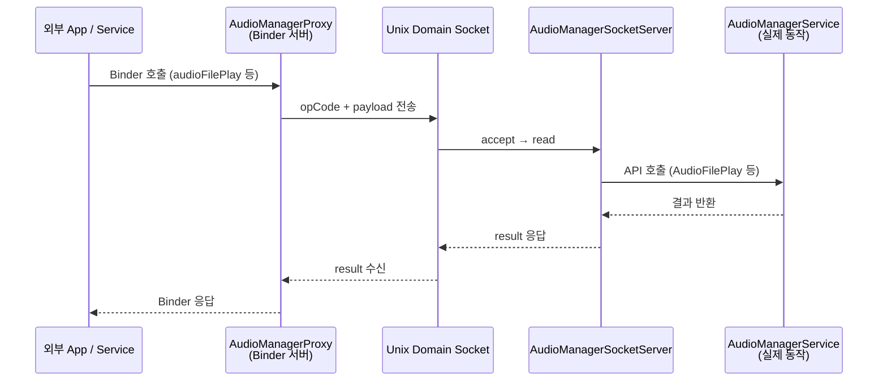
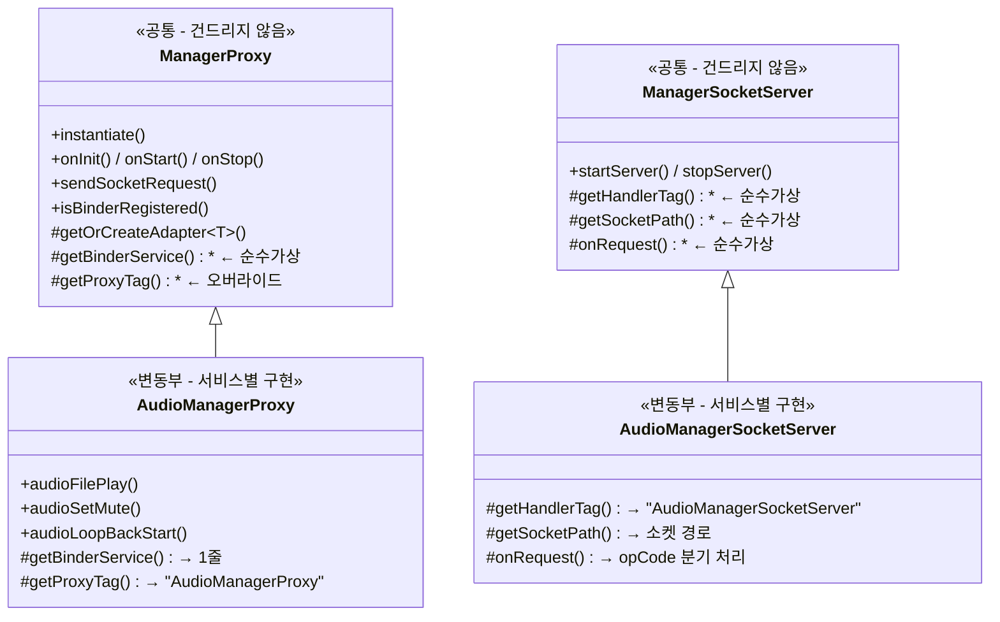
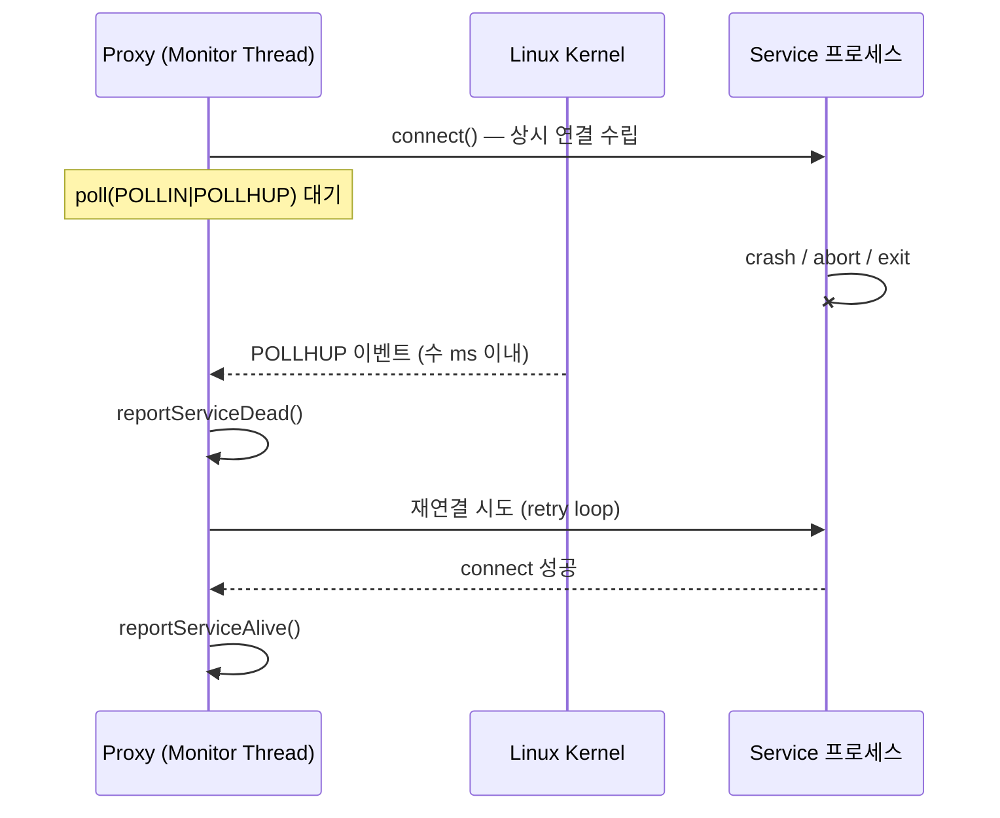
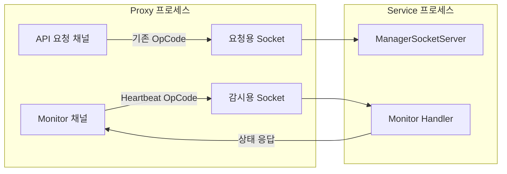

INLINE# ManagerProxy / ManagerSocketServer 아키텍처 가이드
> \*\*목적\*\*: 외부 서비스·앱이 Binder IPC로 요청 → Proxy가 Unix Domain Socket으로 Service에 전달하는 구조.
> Audio를 예시로 구현했으며, 다른 서비스(Navigation, Vehicle 등)도 \*\*동일 패턴\*\*으로 확장 가능.
---
## 1. 전체 구조 (Big Picture)

\*\*왜 이런 구조인가?\*\*
- Proxy 프로세스와 Service 프로세스가 \*\*별도 프로세스\*\*로 분리됨
- Binder는 클라이언트(외부 앱)와 Proxy 사이, Socket은 Proxy와 Service 사이 통신 담당
- Service가 죽어도 Proxy는 살아있고, Proxy가 죽어도 Service는 영향 없음
---
## 2. 클래스 계층 — 공통부 vs 변동부

### 핵심 원칙
| 구분 | 공통부 (건드릴 필요 없음) | 변동부 (서비스별 구현) |
|------|--------------------------|----------------------|
| \*\*Proxy 쪽\*\* | `ManagerProxy` — Binder 등록, 생명주기, Socket 전송, Handler | `AudioManagerProxy` — API 정의, opCode/payload 변환 |
| \*\*Service 쪽\*\* | `ManagerSocketServer` — accept/read/write 루프 | `AudioManagerSocketServer` — opCode별 Service 함수 호출 |
| \*\*main()\*\* | `ManagerProxy\_main.cpp` — 그대로 복사해서 사용 | `createProxyService()` — 서브클래스 cpp 파일 끝에 1줄 |
---
## 3. 파일 구성 (Audio 예시)
```
proxy/ ← Proxy 프로세스 (빌드 결과: AudProxy)
├── ManagerProxy\_main.cpp ← [공통] main() — 모든 서비스 동일
├── ManagerProxy.hpp / .cpp ← [공통] 기반 클래스
├── AudioManagerProxy.hpp / .cpp ← [변동] Audio 전용 Proxy
├── Makefile.am ← [변동] 빌드 대상 설정
└── interface/
├── IAudioManagerProxy.hpp ← [변동] Binder 인터페이스 정의
└── IAudioManagerProxyType.hpp ← [변동] OpCode, 구조체 정의 (프로토콜)
service/ ← Service 프로세스 (기존 서비스에 추가)
├── ManagerSocketServer.hpp / .cpp ← [공통] Socket 서버 기반 클래스
└── AudioManagerSocketServer.hpp / .cpp ← [변동] Audio 전용 요청 처리
```
---
## 4. 각 파일의 역할 상세
### 4.1 `ManagerProxy\_main.cpp` — 모든 서비스 공통 (수정 불필요)
```cpp
extern ManagerProxy\* createProxyService(); // 서브클래스 cpp에서 구현
int main() {
ManagerProxy\* service = createProxyService(); // 팩토리로 구체 타입 생성
service->instantiate(); // Binder 등록
service->onInit(); // 초기화
service->onStart(); // 시작
android::IPCThreadState::self()->joinThreadPool(); // Binder 루프 진입
}
```
> \*\*Q: `extern createProxyService()`는 어디서 구현되나?\*\*
> A: 각 서비스의 서브클래스 `.cpp` 파일 \*\*맨 아래\*\*에 구현합니다. (아래 4.3 참고)
### 4.2 `ManagerProxy` — 공통 기반 클래스 (수정 불필요)
이미 구현된 기능:
- \*\*Binder 등록\*\* (`instantiate`) — `getBinderService()`를 호출하여 서브클래스의 Binder를 등록
- \*\*생명주기 관리\*\* (`onInit`, `onStart`, `onStop`) — 서브클래스 훅 자동 호출
- \*\*Socket 통신\*\* (`sendSocketRequest`) — 서브클래스에서 opCode/payload만 넘기면 됨
- \*\*Adapter 자동 생성\*\* (`getOrCreateAdapter<T>()`) — Binder 어댑터를 1줄로 생성
### 4.3 `AudioManagerProxy` — 변동부 (서비스별 구현)
```cpp
// 1) 생성자 — 서비스 이름만 전달
AudioManagerProxy::AudioManagerProxy()
: ManagerProxy(AudioManagerProxy::getServiceName()) {}
// 2) Binder 서비스 — getOrCreateAdapter로 1줄 끝
android::IBinder\* AudioManagerProxy::getBinderService() {
return getOrCreateAdapter<BnAudioManagerProxyAdapter>();
}
// 3) API 구현 — 구조체에 데이터 담아 sendSocketRequest 호출
error\_t AudioManagerProxy::audioFilePlay(const std::string& filePath) {
AudioManagerSocket::FilePlayRequest req = {};
std::memcpy(req.filePath, filePath.c\_str(), copyLen);
// payload로 변환 후 전송
return sendSocketRequest(SOCKET\_PATH, OP\_FILE\_PLAY, payload);
}
// 4) 팩토리 함수 — 파일 맨 아래에 1줄
ManagerProxy\* createProxyService() {
return new AudioManagerProxy();
}
```
### 4.4 `IAudioManagerProxyType.hpp` — Socket 프로토콜 정의
Proxy ↔ Service 양쪽이 \*\*동일한 헤더\*\*를 참조하여 프로토콜 일치를 보장합니다.
```cpp
namespace AudioManagerSocket {
static constexpr const char\* SOCKET\_PATH = "/data/audio/proxy\_audio\_service.sock";
enum class OpCode : uint32\_t {
OP\_FILE\_PLAY = 2U,
OP\_SET\_MUTE = 3U,
// ...
};
struct FilePlayRequest { char filePath[256]; } \_\_attribute\_\_((packed));
struct SetMuteRequest { uint8\_t spkMute; uint8\_t micMute; uint8\_t srvType; };
}
```
### 4.5 `AudioManagerSocketServer` — Service 쪽 변동부
기존 서비스에 Socket 서버를 추가합니다. `onRequest()`에서 opCode 분기만 구현:
```cpp
int32\_t AudioManagerSocketServer::onRequest(uint32\_t opCode, const std::vector<uint8\_t>& payload) {
switch (static\_cast<AudioManagerSocket::OpCode>(opCode)) {
case OpCode::OP\_FILE\_PLAY: {
// payload → 구조체 변환
return mService.AudioFilePlay(filePath, NONE);
}
case OpCode::OP\_SET\_MUTE: { /\* ... \*/ }
// ...
}
}
```
---
## 5. 새 서비스 Proxy 추가 체크리스트
예: \*\*NavigationManagerProxy\*\*를 만든다고 가정
### Step 1: Proxy 쪽 (4개 파일)
| # | 파일 | 할 일 |
|---|------|-------|
| 1 | `INavigationManagerProxyType.hpp` | `namespace NavigationManagerSocket` 안에 `SOCKET\_PATH`, `OpCode`, 요청 구조체 정의 |
| 2 | `INavigationManagerProxy.hpp` | Binder 인터페이스 — API 순수가상 함수 선언 |
| 3 | `NavigationManagerProxy.hpp` | `ManagerProxy` + `INavigationManagerProxy` 상속, API 선언 |
| 4 | `NavigationManagerProxy.cpp` | 생성자, `getBinderService()` 1줄, API별 `sendSocketRequest()` 구현, `createProxyService()` |
### Step 2: Service 쪽 (1개 파일)
| # | 파일 | 할 일 |
|---|------|-------|
| 5 | `NavigationManagerSocketServer.hpp/.cpp` | `ManagerSocketServer` 상속, `onRequest()`에서 opCode 분기 → 기존 Service 함수 호출 |
### Step 3: 기존 Service main에 서버 시작 추가 (1줄)
```cpp
// NavigationManagerService.cpp의 onStart() 등에서
mSocketServer = std::make\_unique<NavigationManagerSocketServer>(\*this);
mSocketServer->startServer();
```
### Step 4: main()은 그대로 복사
`ManagerProxy\_main.cpp`를 그대로 복사합니다. `ManagerProxy.hpp/.cpp`도 그대로 복사합니다.
`createProxyService()`는 Step 1의 4번 파일 맨 아래에 이미 구현됩니다.
### Step 5: Makefile.am
```makefile
bin\_PROGRAMS = NavProxy
NavProxy\_SOURCES = \
ManagerProxy\_main.cpp \
ManagerProxy.cpp \
NavigationManagerProxy.cpp
```
---
## 6. 구현 시 주의사항
### Socket 프로토콜 일치
- `IAudioManagerProxyType.hpp`의 OpCode와 구조체를 Proxy/Service 양쪽이 \*\*동일하게\*\* 참조해야 합니다.
- 구조체에 `\_\_attribute\_\_((packed))`를 반드시 붙여 바이트 정렬 차이를 방지합니다.
### Binder 어댑터 (BnAdapter)
- `PROXY\_DELEGATE\_N` 매크로를 사용하면 API당 1줄로 Binder→Proxy 위임이 완성됩니다.
- 매크로 숫자는 파라미터 개수: `PROXY\_DELEGATE\_0`(파라미터 없음), `PROXY\_DELEGATE\_1`(1개), ...
### 에러 처리
- `sendSocketRequest()`가 `-1`을 반환하면 Socket 연결 실패 (Service 미기동 등)
- `isBinderRegistered()`로 Binder 등록 실패 여부 확인 가능 (main에서 이미 체크)
### 생명주기 훅 (선택)
필요 시 서브클래스에서 오버라이드:
- `onProxyInit()` — 초기화 시점 추가 작업
- `onProxyStarted()` — 시작 시점 추가 작업
- `onConnectMessage()` — Handler 메시지 처리
---
## 7. Service 생명주기 감시
현재 구조에서는 Proxy가 `sendSocketRequest()`를 호출할 때만 Service 연결 상태를 알 수 있습니다.
하지만 Service가 crash/abort로 죽으면 \*\*즉시\*\* 감지해야 하는 요구가 있어, 아래 두 가지 방안을 추가 구현할 예정입니다.
### 7.1 방안 A: Persistent Connection + Disconnect Detection (추천)
Service에 \*\*상시 연결 소켓\*\*을 유지하고, 커널이 소켓을 정리하는 시점에 `POLLHUP`으로 사망을 감지합니다.

\*\*Proxy 쪽 구현 (공통부 `ManagerProxy`에 추가)\*\*:
```cpp
// ManagerProxy 내부 — 모든 Proxy가 자동으로 Service 감시 기능을 갖게 됨
class ServiceMonitor {
int mPersistentFd = -1; // 상시 연결 소켓
std::thread mMonitorThread;
void monitorLoop() {
while (running) {
if (mPersistentFd < 0) {
mPersistentFd = connectToService();
if (mPersistentFd < 0) {
reportServiceDead();
retryAfterDelay();
continue;
}
reportServiceAlive();
}
// poll()로 연결 상태 감시
struct pollfd pfd = {mPersistentFd, POLLIN | POLLHUP, 0};
int ret = poll(&pfd, 1, kHeartbeatIntervalMs);
if (pfd.revents & (POLLHUP | POLLERR)) {
// Service 프로세스 종료 → 소켓 끊김 즉시 감지
close(mPersistentFd);
mPersistentFd = -1;
reportServiceDead();
} else {
// 정상 → Health에 heartbeat 전달
HeartBeat();
}
}
}
};
```
| 항목 | 내용 |
|------|------|
| \*\*감지 원리\*\* | 프로세스 crash/exit 시 커널이 소켓 FD를 정리 → `POLLHUP` 발생 |
| \*\*감지 속도\*\* | 수 ms 이내 (커널 이벤트 기반, polling 주기에 의존하지 않음) |
| \*\*장점\*\* | 연결 자체가 liveness 증거, Ping 불필요, 반응 즉각적 |
| \*\*단점\*\* | 소켓 1개를 상시 점유 (기능 요청용 소켓과 별도) |
| \*\*공통/변동\*\* | \*\*공통부\*\* (`ManagerProxy`)에 구현 — 서브클래스는 별도 작업 불필요 |
### 7.2 방안 B: Dual-Channel (제어 + 모니터링 분리)
기능 요청 채널과 모니터링 채널을 분리하고, 프로토콜 레벨에서 Service 상태를 세분화합니다.

\*\*프로토콜 확장 (`IXxxManagerProxyType.hpp`에 추가)\*\*:
```cpp
// 기존 OpCode에 생명주기 관련 코드 추가
enum class OpCode : uint32\_t {
OP\_PING = 1U,
OP\_FILE\_PLAY = 2U,
// ...기존 OpCode...
// ─── 생명주기 모니터링 (100번대) ───
OP\_HEARTBEAT\_REQ = 100U, // Proxy → Service: 살아있니?
OP\_HEARTBEAT\_RSP = 101U, // Service → Proxy: 살아있어 + 상태정보
OP\_SERVICE\_READY = 102U, // Service → Proxy: 초기화 완료 통보
OP\_SERVICE\_SHUTDOWN = 103U, // Service → Proxy: 정상 종료 예고
};
// 서비스 상태 세분화
struct HeartbeatResponse {
uint32\_t state; // INIT / RUNNING / DEGRADED / SHUTTING\_DOWN
uint32\_t uptimeSec; // 서비스 구동 시간
uint32\_t pendingRequests; // 처리 중인 요청 수
} \_\_attribute\_\_((packed));
```
| 항목 | 내용 |
|------|------|
| \*\*감지 원리\*\* | 전용 채널에서 주기적 Heartbeat + 상태 조회 |
| \*\*장점\*\* | 기능 요청과 감시가 독립적, 서비스 상태 세분화 (DEGRADED 등) 가능 |
| \*\*단점\*\* | 복잡도 증가, 소켓 2개 사용, Heartbeat 주기에 따른 감지 지연 |
| \*\*공통/변동\*\* | 프로토콜 구조체는 \*\*변동부\*\*, Monitor 루프는 \*\*공통부\*\* |
### 7.3 방안 비교 및 적용 전략
```
방안 A (Persistent) 방안 B (Dual-Channel)
────────────────── ────────────────────
감지 속도 즉각적 (ms 이내) Heartbeat 주기 의존
구현 복잡도 낮음 높음
상태 세분화 죽음/살아있음 2가지 INIT/RUNNING/DEGRADED/... 다양
소켓 점유 +1개 (감시 전용) +1개 (감시 전용)
서브클래스 작업 없음 OpCode 확장 필요
```
> \*\*권장\*\*: \*\*방안 A를 기본\*\*으로 적용하고, 서비스 상태 세분화가 필요한 경우에만 방안 B를 추가 도입합니다.
> 방안 A는 `ManagerProxy` 공통부에 구현되므로, 서브클래스 담당자는 \*\*추가 작업 없이\*\* 자동으로 Service 감시 기능을 얻게 됩니다.
---
## 8. 한눈에 보는 요약
```
┌─────────────────────────────────────────────────────────┐
│ 공통 (수정 불필요) │
│ ManagerProxy\_main.cpp ← main() 진입점 │
│ ManagerProxy.hpp/.cpp ← Binder등록, Socket전송, 생명주기│
│ ManagerSocketServer.hpp/.cpp ← accept/read/write 루프 │
└─────────────────────────────────────────────────────────┘
↑ 상속
┌─────────────────────────────────────────────────────────┐
│ 변동부 (서비스별 구현) │
│ [Proxy 쪽] │
│ XxxManagerProxy.hpp/.cpp ← API + opCode/payload 변환 │
│ IXxxManagerProxy.hpp ← Binder 인터페이스 │
│ IXxxManagerProxyType.hpp ← Socket 프로토콜 (공유) │
│ │
│ [Service 쪽] │
│ XxxManagerSocketServer.hpp/.cpp ← opCode→서비스함수 │
└─────────────────────────────────────────────────────────┘
```
> \*\*결론\*\*: 공통부 파일 3개(`main`, `ManagerProxy`, `ManagerSocketServer`)는 복사만 하고,
> 서비스 전용 파일 4~5개만 새로 작성하면 됩니다.
> API마다 하는 일은 \*\*구조체 pack → sendSocketRequest\*\* (Proxy) / \*\*구조체 unpack → Service 호출\*\* (Server) 뿐입니다.

Audio Test Code

250