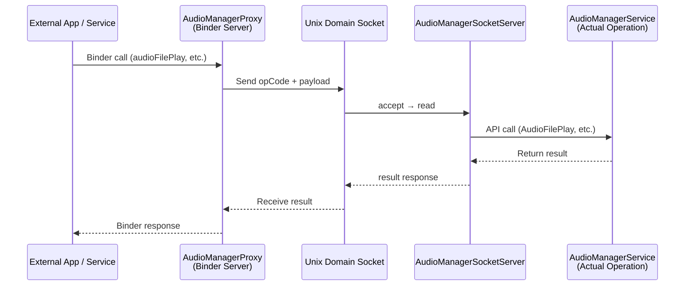
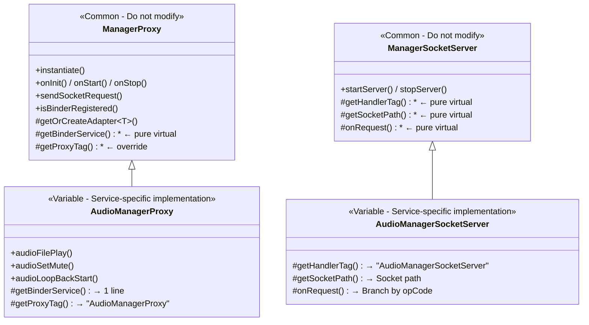
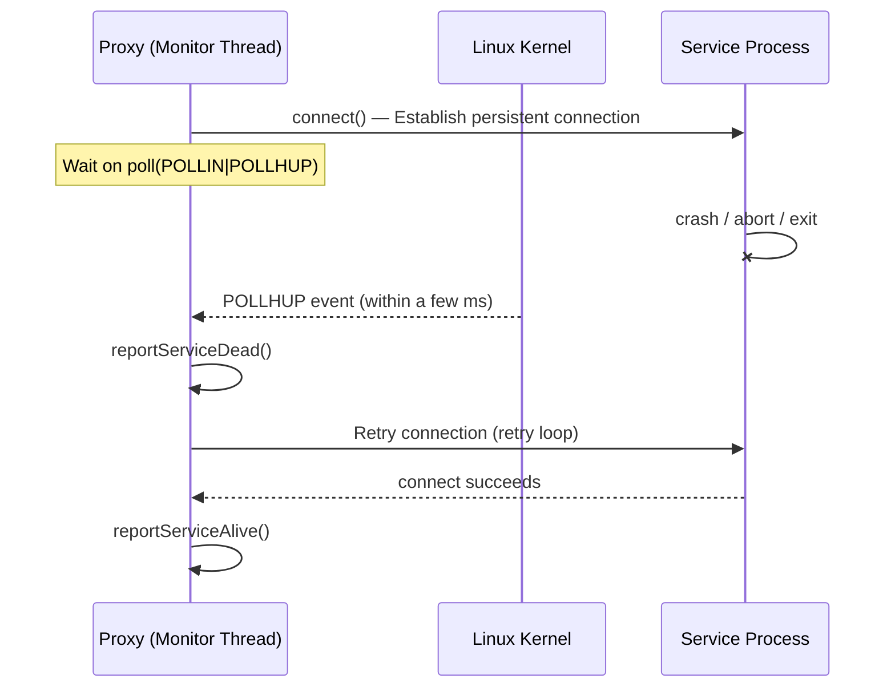
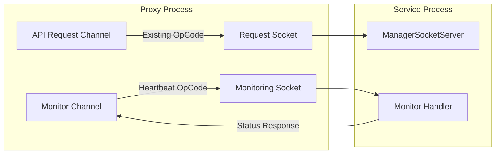

INLINE# ManagerProxy / ManagerSocketServer Architecture Guide
> \*\*Purpose\*\*: External services/apps send requests via Binder IPC → the Proxy forwards them to the Service through a Unix Domain Socket.
> This guide uses Audio as an implementation example, and other services such as Navigation, Vehicle, etc. can be extended using the \*\*same pattern\*\*.
---
## 1. Overall Structure (Big Picture)

\*\*Why this structure?\*\*
- The Proxy process and the Service process are separated into \*\*different processes\*\*.
- Binder handles communication between the client, such as an external app, and the Proxy, while Socket handles communication between the Proxy and the Service.
- Even if the Service dies, the Proxy remains alive; even if the Proxy dies, the Service is not affected.
---
## 2. Class Hierarchy — Common Parts vs. Variable Parts

### Core Principles
| Category | Common Part (No need to modify) | Variable Part (Service-specific implementation) |
|------|--------------------------|----------------------|
| \*\*Proxy side\*\* | `ManagerProxy` — Binder registration, lifecycle, Socket transmission, Handler | `AudioManagerProxy` — API definition, opCode/payload conversion |
| \*\*Service side\*\* | `ManagerSocketServer` — accept/read/write loop | `AudioManagerSocketServer` — Calls Service functions per opCode |
| \*\*main()\*\* | `ManagerProxy\_main.cpp` — Copy and use as is | `createProxyService()` — One line at the end of the subclass cpp file |
---
## 3. File Structure (Audio Example)
```text
proxy/ ← Proxy process (build output: AudProxy)
├── ManagerProxy\_main.cpp ← [Common] main() — same for all services
├── ManagerProxy.hpp / .cpp ← [Common] Base class
├── AudioManagerProxy.hpp / .cpp ← [Variable] Audio-specific Proxy
├── Makefile.am ← [Variable] Build target configuration
└── interface/
├── IAudioManagerProxy.hpp ← [Variable] Binder interface definition
└── IAudioManagerProxyType.hpp ← [Variable] OpCode and struct definitions (protocol)
service/ ← Service process (added to existing service)
├── ManagerSocketServer.hpp / .cpp ← [Common] Socket server base class
└── AudioManagerSocketServer.hpp / .cpp ← [Variable] Audio-specific request handling
```
---
## 4. Detailed Role of Each File
### 4.1 `ManagerProxy\_main.cpp` — Common to All Services (No modification required)
```cpp
extern ManagerProxy\* createProxyService(); // Implemented in the subclass cpp
int main() {
ManagerProxy\* service = createProxyService(); // Create concrete type through factory
service->instantiate(); // Register Binder
service->onInit(); // Initialize
service->onStart(); // Start
android::IPCThreadState::self()->joinThreadPool(); // Enter Binder loop
}
```
> \*\*Q: Where is `extern createProxyService()` implemented?\*\*
> A: It is implemented at the \*\*very bottom\*\* of each service’s subclass `.cpp` file. See section 4.3 below.
### 4.2 `ManagerProxy` — Common Base Class (No modification required)
Already implemented features:
- \*\*Binder registration\*\* (`instantiate`) — Calls `getBinderService()` to register the subclass’s Binder.
- \*\*Lifecycle management\*\* (`onInit`, `onStart`, `onStop`) — Automatically calls subclass hooks.
- \*\*Socket communication\*\* (`sendSocketRequest`) — The subclass only needs to pass opCode/payload.
- \*\*Automatic Adapter creation\*\* (`getOrCreateAdapter<T>()`) — Creates a Binder adapter in one line.
### 4.3 `AudioManagerProxy` — Variable Part (Service-specific implementation)
```cpp
// 1) Constructor — only passes the service name
AudioManagerProxy::AudioManagerProxy()
: ManagerProxy(AudioManagerProxy::getServiceName()) {}
// 2) Binder service — one line using getOrCreateAdapter
android::IBinder\* AudioManagerProxy::getBinderService() {
return getOrCreateAdapter<BnAudioManagerProxyAdapter>();
}
// 3) API implementation — put data into a struct and call sendSocketRequest
error\_t AudioManagerProxy::audioFilePlay(const std::string& filePath) {
AudioManagerSocket::FilePlayRequest req = {};
std::memcpy(req.filePath, filePath.c\_str(), copyLen);
// Convert to payload and send
return sendSocketRequest(SOCKET\_PATH, OP\_FILE\_PLAY, payload);
}
// 4) Factory function — one line at the bottom of the file
ManagerProxy\* createProxyService() {
return new AudioManagerProxy();
}
```
### 4.4 `IAudioManagerProxyType.hpp` — Socket Protocol Definition
Both Proxy ↔ Service reference the \*\*same header\*\* to ensure protocol consistency.
```cpp
namespace AudioManagerSocket {
static constexpr const char\* SOCKET\_PATH = "/data/audio/proxy\_audio\_service.sock";
enum class OpCode : uint32\_t {
OP\_FILE\_PLAY = 2U,
OP\_SET\_MUTE = 3U,
// ...
};
struct FilePlayRequest { char filePath[256]; } \_\_attribute\_\_((packed));
struct SetMuteRequest { uint8\_t spkMute; uint8\_t micMute; uint8\_t srvType; };
}
```
### 4.5 `AudioManagerSocketServer` — Variable Part on the Service Side
Add a Socket server to the existing service. Implement only the opCode branching in `onRequest()`:
```cpp
int32\_t AudioManagerSocketServer::onRequest(uint32\_t opCode, const std::vector<uint8\_t>& payload) {
switch (static\_cast<AudioManagerSocket::OpCode>(opCode)) {
case OpCode::OP\_FILE\_PLAY: {
// payload → struct conversion
return mService.AudioFilePlay(filePath, NONE);
}
case OpCode::OP\_SET\_MUTE: { /\* ... \*/ }
// ...
}
}
```
---
## 5. Checklist for Adding a New Service Proxy
Example: Assume we are creating \*\*NavigationManagerProxy\*\*.
### Step 1: Proxy Side (4 Files)
| # | File | Task |
|---|------|-------|
| 1 | `INavigationManagerProxyType.hpp` | Define `SOCKET\_PATH`, `OpCode`, and request structs inside `namespace NavigationManagerSocket` |
| 2 | `INavigationManagerProxy.hpp` | Binder interface — Declare pure virtual API functions |
| 3 | `NavigationManagerProxy.hpp` | Inherit from `ManagerProxy` + `INavigationManagerProxy`, declare APIs |
| 4 | `NavigationManagerProxy.cpp` | Constructor, one-line `getBinderService()`, `sendSocketRequest()` implementation per API, `createProxyService()` |
### Step 2: Service Side (1 File)
| # | File | Task |
|---|------|-------|
| 5 | `NavigationManagerSocketServer.hpp/.cpp` | Inherit from `ManagerSocketServer`, branch by opCode in `onRequest()` → call existing Service functions |
### Step 3: Add Server Startup to Existing Service main (1 Line)
```cpp
// In onStart() or similar function of NavigationManagerService.cpp
mSocketServer = std::make\_unique<NavigationManagerSocketServer>(\*this);
mSocketServer->startServer();
```
### Step 4: Copy main() As Is
Copy `ManagerProxy\_main.cpp` as is. Also copy `ManagerProxy.hpp/.cpp` as is.
`createProxyService()` is already implemented at the bottom of file #4 in Step 1.
### Step 5: Makefile.am
```makefile
bin\_PROGRAMS = NavProxy
NavProxy\_SOURCES = \
ManagerProxy\_main.cpp \
ManagerProxy.cpp \
NavigationManagerProxy.cpp
```
---
## 6. Implementation Notes
### Socket Protocol Consistency
- The OpCode and structs in `IAudioManagerProxyType.hpp` must be referenced \*\*identically\*\* by both the Proxy and Service sides.
- Be sure to add `\_\_attribute\_\_((packed))` to structs to prevent byte alignment differences.
### Binder Adapter (BnAdapter)
- Using the `PROXY\_DELEGATE\_N` macro completes Binder → Proxy delegation with one line per API.
- The macro number indicates the number of parameters: `PROXY\_DELEGATE\_0` for no parameters, `PROXY\_DELEGATE\_1` for one parameter, and so on.
### Error Handling
- If `sendSocketRequest()` returns `-1`, it means the Socket connection failed, such as when the Service is not running.
- `isBinderRegistered()` can be used to check whether Binder registration failed, which is already checked in main.
### Lifecycle Hooks (Optional)
Override in the subclass if needed:
- `onProxyInit()` — Additional work during initialization.
- `onProxyStarted()` — Additional work at startup.
- `onConnectMessage()` — Handler message processing.
---
## 7. Service Lifecycle Monitoring
In the current structure, the Proxy can detect the Service connection status only when `sendSocketRequest()` is called.
However, there is a requirement to detect \*\*immediately\*\* when the Service dies due to crash/abort, so the following two approaches are planned to be added.
### 7.1 Option A: Persistent Connection + Disconnect Detection (Recommended)
Maintain a \*\*persistent socket connection\*\* to the Service and detect Service death through `POLLHUP` when the kernel cleans up the socket.

\*\*Proxy-side implementation (added to common `ManagerProxy`)\*\*:
```cpp
// Inside ManagerProxy — all Proxies automatically gain Service monitoring
class ServiceMonitor {
int mPersistentFd = -1; // Persistent socket
std::thread mMonitorThread;
void monitorLoop() {
while (running) {
if (mPersistentFd < 0) {
mPersistentFd = connectToService();
if (mPersistentFd < 0) {
reportServiceDead();
retryAfterDelay();
continue;
}
reportServiceAlive();
}
// Monitor connection status with poll()
struct pollfd pfd = {mPersistentFd, POLLIN | POLLHUP, 0};
int ret = poll(&pfd, 1, kHeartbeatIntervalMs);
if (pfd.revents & (POLLHUP | POLLERR)) {
// Service process terminated → Socket disconnect detected immediately
close(mPersistentFd);
mPersistentFd = -1;
reportServiceDead();
} else {
// Normal → Send heartbeat to Health
HeartBeat();
}
}
}
};
```
| Item | Description |
|------|------|
| \*\*Detection principle\*\* | When the process crashes/exits, the kernel cleans up the socket FD → `POLLHUP` occurs |
| \*\*Detection speed\*\* | Within a few ms, based on kernel events and not dependent on the polling interval |
| \*\*Advantages\*\* | The connection itself proves liveness, no Ping required, immediate response |
| \*\*Disadvantages\*\* | Occupies one persistent socket, separate from the functional request socket |
| \*\*Common/Variable\*\* | Implemented in the \*\*common part\*\* (`ManagerProxy`) — no additional work required in subclasses |
### 7.2 Option B: Dual-Channel (Separate Control + Monitoring)
Separate the functional request channel and the monitoring channel, and refine the Service status at the protocol level.

\*\*Protocol extension (added to `IXxxManagerProxyType.hpp`)\*\*:
```cpp
// Add lifecycle-related codes to the existing OpCode
enum class OpCode : uint32\_t {
OP\_PING = 1U,
OP\_FILE\_PLAY = 2U,
// ...existing OpCodes...
// ─── Lifecycle Monitoring (100 range) ───
OP\_HEARTBEAT\_REQ = 100U, // Proxy → Service: Are you alive?
OP\_HEARTBEAT\_RSP = 101U, // Service → Proxy: I am alive + status info
OP\_SERVICE\_READY = 102U, // Service → Proxy: Initialization complete notification
OP\_SERVICE\_SHUTDOWN = 103U, // Service → Proxy: Normal shutdown notice
};
// Detailed service state
struct HeartbeatResponse {
uint32\_t state; // INIT / RUNNING / DEGRADED / SHUTTING\_DOWN
uint32\_t uptimeSec; // Service uptime
uint32\_t pendingRequests; // Number of requests being processed
} \_\_attribute\_\_((packed));
```
| Item | Description |
|------|------|
| \*\*Detection principle\*\* | Periodic heartbeat + status query on a dedicated channel |
| \*\*Advantages\*\* | Functional requests and monitoring are independent; detailed service states such as DEGRADED can be represented |
| \*\*Disadvantages\*\* | Increased complexity, uses two sockets, detection delay depends on heartbeat interval |
| \*\*Common/Variable\*\* | Protocol structs are \*\*variable parts\*\*, Monitor loop is a \*\*common part\*\* |
### 7.3 Comparison and Application Strategy
```text
Option A (Persistent) Option B (Dual-Channel)
────────────────── ────────────────────
Detection speed Immediate (within ms) Depends on heartbeat interval
Complexity Low High
State granularity Dead/Alive only INIT/RUNNING/DEGRADED/... various
Socket usage +1 socket (monitoring) +1 socket (monitoring)
Subclass work None OpCode extension required
```
> \*\*Recommendation\*\*: Apply \*\*Option A by default\*\*, and introduce Option B only when detailed Service state information is required.
> Since Option A is implemented in the common `ManagerProxy` part, subclass owners automatically gain Service monitoring capability \*\*without any additional work\*\*.
---
## 8. Summary at a Glance
```text
┌─────────────────────────────────────────────────────────┐
│ Common (No modification required) │
│ ManagerProxy\_main.cpp ← main() entry point │
│ ManagerProxy.hpp/.cpp ← Binder registration, Socket transmission, lifecycle │
│ ManagerSocketServer.hpp/.cpp ← accept/read/write loop │
└─────────────────────────────────────────────────────────┘
↑ Inheritance
┌─────────────────────────────────────────────────────────┐
│ Variable Parts (Service-specific implementation) │
│ [Proxy side] │
│ XxxManagerProxy.hpp/.cpp ← API + opCode/payload conversion │
│ IXxxManagerProxy.hpp ← Binder interface │
│ IXxxManagerProxyType.hpp ← Socket protocol (shared) │
│ │
│ [Service side] │
│ XxxManagerSocketServer.hpp/.cpp ← opCode → service function │
└─────────────────────────────────────────────────────────┘
```
> \*\*Conclusion\*\*: The three common files, `main`, `ManagerProxy`, and `ManagerSocketServer`, only need to be copied.
> Only 4–5 service-specific files need to be newly written.
> For each API, the only required work is \*\*struct pack → sendSocketRequest\*\* on the Proxy side and \*\*struct unpack → Service call\*\* on the Server side.