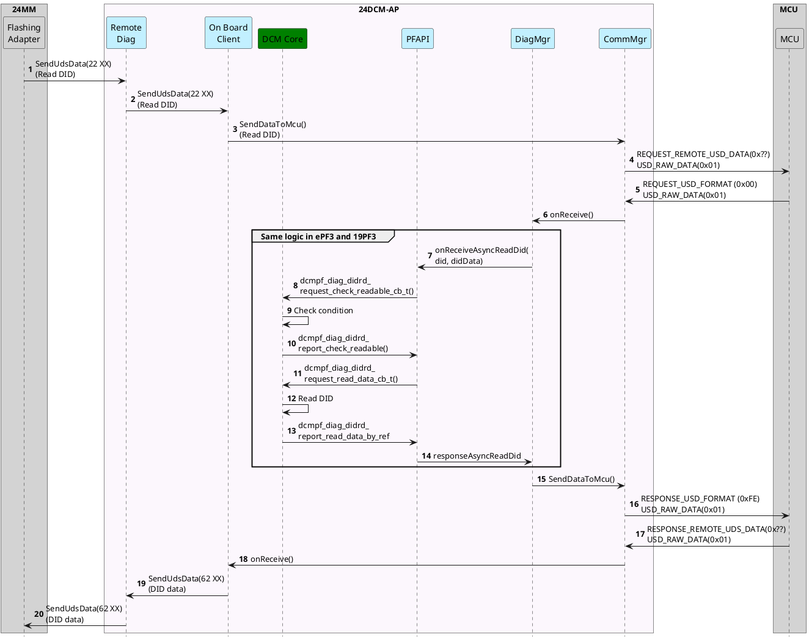
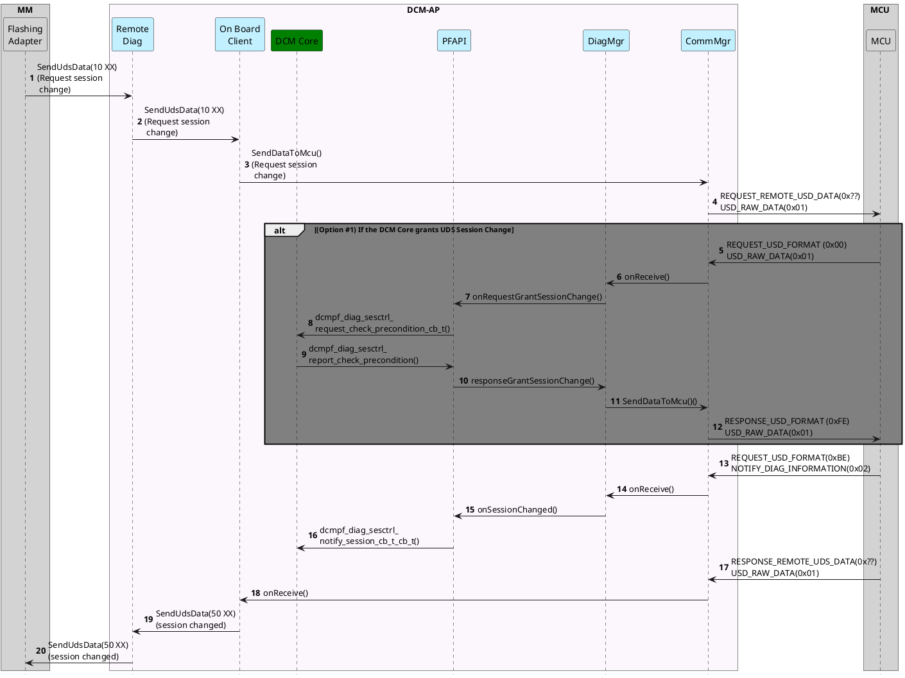
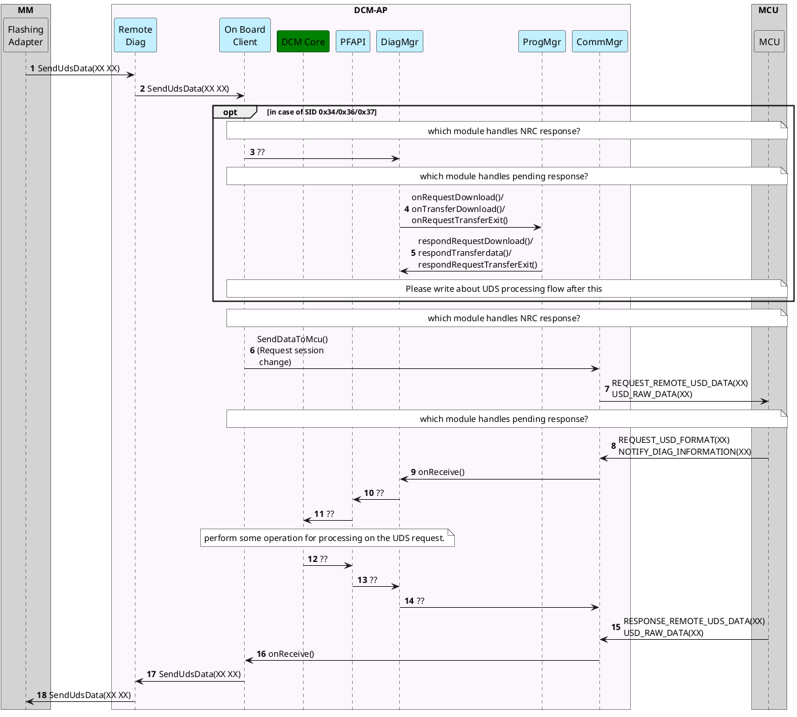

# 3.2.19 DoIP → DoCAN / RemoteDiag

> Nguồn: Confluence DCMNTCY — trang 2016280312. Bản dịch tiếng Việt; giữ nguyên các sequence diagram PlantUML (vốn đã bằng tiếng Anh) và thuật ngữ kỹ thuật tiếng Anh.
>
> Link gốc: http://collab.lge.com/main/spaces/DCMNTCY/pages/2016280312/3.2.19+DoIP-+DoCAN+RemoteDiag#ASIS-DoIP--1549936919
> Các sơ đồ AS-IS / To-Be của phần 1.2 (nhiều biến thể DoIP/DoCAN) được giữ nguyên trong trang gốc; tài liệu này dịch phần mô tả và giữ nguyên các sequence diagram lõi ở phần 3.2.2.

---

## 1. DoIP → DoCAN

### 1.1 Requirement (Yêu cầu)

- Do vehicle network của 24CY thay đổi từ Ethernet sang CAN, nên phải xử lý DoCAN thay cho DoIP hiện tại.
- Là sản phẩm/spec dùng chung của 24LC.

### 1.2 SW Architecture Design

- **Quyết định chọn phương án 2 (2안).**
  - Hạng mục quyết định bổ sung: đối với chức năng session control, theo thiết kế của Toyota OEM thì phải nhận approve từ DCM Core; nhưng VectorSIP không có cấu trúc như vậy, nên sau khi thảo luận với khách hàng đã thống nhất **đổi thiết kế để không cần approve từ DCM Core**.
- Architecture#2 đã được chọn. Tuy nhiên AED không bị loại bỏ mà vẫn đóng vai trò chuyển OTA DoIP và UDS tới DiagMgr.

|      | Phương án 1 (1안): AED không chỉ xử lý DoIP mà còn đảm nhiệm cả việc chuyển DoCAN sang UDS                   | Phương án 2 (2안): MCU chuyển DoCAN sang UDS                                                                                                                                           |
| ---- | ------------------------------------------------------------------------------------------------------------ | -------------------------------------------------------------------------------------------------------------------------------------------------------------------------------------- |
| Pros | Xử lý nhất quán UDS (Unified Diagnostic Services protocol) của cả DoCAN/DoIP trong tổ hợp DiagMgr+AED của AP | Có thể xử lý message DoCAN nhanh ngay cả khi AP chưa sẵn sàng lúc mới boot (ví dụ: xử lý NRC)                                                                                          |
| Cons | Cần hiện thực thêm chức năng UDS Session Control trong AED                                                   | Khi hiện thực bằng Autosar (VectorSIP) trên MCU thì việc chuyển DoCAN→UDS không vấn đề, nhưng khi hiện thực chức năng Session Control lại cần đổi thiết kế để nhận approve từ DCM Core |

_(Sơ đồ "DoIP to DoCAN" — đính kèm trong trang gốc.)_

### 1.2 Sequence Diagram

#### 1.2.1 AS-IS Sequence

_(Các sequence diagram AS-IS về DoIP: Session Change, Read DID, Write DID, Routine, S/W Download, DTC — giữ nguyên PlantUML tiếng Anh trong trang gốc.)_

#### 1.2.2 To-Be Sequence Alternative#1

- DoCAN không có AED (DoCAN without AED).

_(Các sequence diagram To-Be Alternative#1: MCU Session Change, Session Change, Read DID, ... — giữ nguyên PlantUML tiếng Anh trong trang gốc.)_

#### 1.2.3 To-Be Sequence Alternative#2

_(Các sequence diagram To-Be Alternative#2 — giữ nguyên PlantUML tiếng Anh trong trang gốc.)_

### 1.3 Thời gian phát triển / Nguồn lực

_(Nội dung chi tiết trong trang gốc.)_

---

## 2. On Board Client (RemoteDiag + OTA)

### 2.1 Requirement (Yêu cầu)

### 2.1 SW Architecture Design

- On Board Client được phát triển thành một module riêng vì đảm nhiệm vai trò gửi Toyota OTA Master UDS command tới MCU (yêu cầu của khách hàng).

_(Sơ đồ "On Board Client" — đính kèm trong trang gốc.)_

### 2.2 Thời gian phát triển và nguồn lực

---

## 3. UDS Server design for OTA

### 3.1 Requirement (Yêu cầu)

### 3.2 SW Architecture Design

#### 3.2.1 Architecture Decision

- OEM đang cân nhắc thay đổi thiết kế của DCM Core để MCU có thể đổi UDS session mà không cần grant của DCM Core.
- Do đó, MCU đảm nhiệm vai trò UDS Server cho mọi kịch bản, kể cả OTA.

#### 3.2.2 Sequence Diagram

##### 3.2.2.1 Read DID

##### 3.2.2.2 Request Session Changed

- Nếu MCU không cần nhận grant của DCMCore thì phần gray box sẽ không cần thiết.

##### 3.2.2.3 UDS request processing flow

- Với SID 0x34/0x36/0x37, OBC chuyển tiếp UDS request trực tiếp tới Diag Manager.

---

## 4. Họp thiết kế (설계 회의)

### 5/26

- **Chủ đề họp**
  - Thảo luận thiết kế thay đổi DoIP → DoCAN (làm rõ phạm vi xử lý DoCAN của MCU).
- **Nội dung chia sẻ**
  - (MCU — Kim Seong-cheol C) Khi MICOM xử lý yêu cầu đổi Session, theo thiết kế của Toyota OEM thì phải nhận approve qua DCM Core của AP; nhưng Autosar Vector SIP (Generated Code) không cho phép phần xử lý từ bên ngoài, nên không thể hiện thực được.
  - (VNU — Hong Kyung-hyun C) Hôm nay tại một cuộc họp với khách hàng khác đã hỏi liệu khi có Session request có bắt buộc phải nhận approve qua DCM Core hay không, và sẽ tiếp tục thảo luận với khách hàng.
- **Kết luận**
  - Phương án thiết kế của LG: đối với xử lý Session, dựa trên thông tin Session đã nhận từ DCM Core hiện có, Vector SIP của MCU xử lý ngay lập tức và thông báo kết quả cho DCM Core (cần sửa thiết kế DCM Core PF API).
  - Tiếp tục thảo luận với khách hàng về phương án thiết kế của LG (VNU/MCU/Architect).

### 6/08

- **Chủ đề họp**
  - Thảo luận cách thức đảm nhiệm UDS Server trong kịch bản OTA.
- **Kết luận**
  - Khách hàng cho ý kiến sẽ xem xét đổi thiết kế để MCU có thể đảm nhiệm toàn bộ việc approve đổi UDS session mà không cần approve của DCM Core.
  - Theo đó, **MCU đảm nhiệm chức năng UDS Server và cũng đảm nhiệm y như vậy trong kịch bản OTA.**
- **Hạng mục thảo luận còn lại → quyết định chọn phương án 2**
  - Trong các OTA message chuyển từ RemoteDiag, các SID 34, 36, 37 có kích thước dữ liệu lớn sẽ được xử lý theo đường nào? → Phương án 2 trước mắt có vẻ tốt nhưng MCU sẽ xem xét thêm rồi cho ý kiến.
    - **Option 1.** Với các Diag Request (bao gồm OTA) của target 24DCM chuyển từ Remote Diag, đi qua MCU (là UDS server) để xử lý.
      - Remote Diag → Comm Manager → MCU → Comm Manager → Diag Manager → Prog Manager / DCM core, v.v.
    - **Option 2.** Với các Diag Request của target 24DCM chuyển từ Remote Diag thì đi qua MCU (UDS server), nhưng riêng dữ liệu OTA kích thước lớn (SID34, 36, 37) thì chuyển trực tiếp tới Diag Manager.
      - SID 34, 36, 37: Remote Diag → Diag Manager → Prog Manager or DCM core, v.v.
      - Diag Request ngoài SID 34, 36, 37: Remote Diag → Comm Manager → MCU → Comm Manager → Diag Manager → Prog Manager / DCM core, v.v.

### 8/23

- **Chủ đề họp**
  - Xử lý Pending cho SID 34, 36, 37 nên làm thế nào?
- **Kết luận**
  - SID 34, 37 cần xử lý Pending nhưng dữ liệu không lớn nên xử lý tại MCU; riêng SID 36 có dữ liệu lớn nhưng không cần xử lý Pending thì OBC chuyển thẳng tới DiagMgr, không qua MCU.
    - SID 36: RemoteDiag → DiagMgr → ProgMgr or DCM core, v.v.
    - UDS Message ngoài SID 36: RemoteDiag → CommMgr → MCU → CommMgr → DiagMgr → ProgMgr / DCM core, v.v.

### 12/18

- **Chủ đề họp**
  - Phương án hiện thực cập nhật ECU khác (타ECU update).
- **Kết luận**
  - SID 36: nếu Target ECU không phải DCM thì OBC gửi tới MCU; nếu là DCM thì gửi tới DiagMgr.
- **Hạng mục thảo luận còn lại**
  - Trường hợp dữ liệu message SID 36 lớn thì phải chia nhỏ dữ liệu gửi cho CommMgr, và cần kiểm tra xem MCU đã nhận đúng chưa.
    - Kích thước dữ liệu tối đa cho mỗi lần `SendDataToMCU()`?
    - Xử lý ACK khi truyền tín hiệu UDS giữa OBC/MCU.
